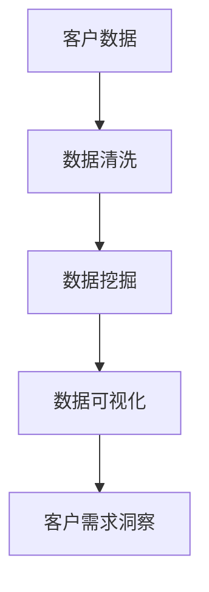

                 

## 1. 背景介绍

### 1.1 问题由来
在商业世界中，客户需求洞察是一项至关重要的工作。正确的需求洞察可以帮助企业更好地了解客户需求，优化产品和服务，提升市场竞争力。然而，随着市场竞争的日益激烈，客户的需求日益个性化、复杂化，传统的基于经验和方法学的客户需求洞察方法往往难以应对。大数据技术的兴起，为发现客户需求提供了新的视角和工具，尤其是数据驱动的客户需求洞察方法，已经在许多企业中得到了广泛应用。

### 1.2 问题核心关键点
数据驱动的客户需求洞察方法基于大数据技术，通过分析客户行为数据、交易数据、社交媒体数据等，挖掘隐藏在数据背后的客户需求信息。其核心在于：

- 收集和整理客户数据：从多个数据源中获取客户的全方位数据，如浏览记录、购买历史、评论反馈等。
- 数据清洗和预处理：对原始数据进行去重、缺失值处理、数据格式统一等预处理工作。
- 数据分析和挖掘：利用统计分析、机器学习、数据挖掘等技术，对客户数据进行深入分析，识别出客户的需求模式、偏好趋势等。
- 需求可视化：将分析结果转化为可视化图表，帮助决策者直观理解客户需求。
- 需求应用：根据客户需求洞察结果，制定和调整产品策略、营销计划，提升客户满意度和市场竞争力。

## 2. 核心概念与联系

### 2.1 核心概念概述

为更好地理解数据驱动的客户需求洞察方法，本节将介绍几个密切相关的核心概念：

- 客户数据(Customer Data)：指客户在与企业交互过程中产生的各类数据，包括行为数据、交易数据、社交媒体数据等。
- 数据清洗(Data Cleaning)：指对原始数据进行去重、缺失值处理、数据格式统一等预处理工作，以提高数据质量和可用性。
- 数据挖掘(Data Mining)：指利用机器学习、统计分析等技术，从数据中发现隐藏的模式、趋势和关联。
- 数据可视化(Data Visualization)：指通过图表、仪表盘等形式，将数据分析结果转化为直观易懂的可视化展示，帮助决策者理解数据。
- 客户需求洞察(Customer Demand Insight)：指基于客户数据挖掘结果，对客户需求进行分析和理解，为产品和服务优化提供依据。

这些核心概念之间的逻辑关系可以通过以下Mermaid流程图来展示：



这个流程图展示了大数据驱动客户需求洞察的核心流程：

1. 收集客户数据。
2. 对数据进行清洗和预处理。
3. 利用数据挖掘技术进行需求分析。
4. 将分析结果进行可视化展示。
5. 根据可视化结果，进行需求洞察和应用。

## 3. 核心算法原理 & 具体操作步骤
### 3.1 算法原理概述

数据驱动的客户需求洞察方法基于统计分析和机器学习技术，通过挖掘和分析客户数据，识别出客户的需求模式、偏好趋势等。其核心思想是：

- 通过大数据技术，全面收集和整理客户数据。
- 利用数据清洗和预处理技术，提升数据质量和可用性。
- 运用机器学习和数据挖掘技术，从数据中发现客户需求模式。
- 使用数据可视化技术，将分析结果直观展示给决策者。
- 根据需求洞察结果，调整产品策略和营销计划，提升客户满意度。

### 3.2 算法步骤详解

数据驱动的客户需求洞察方法主要包括以下几个关键步骤：

**Step 1: 数据收集与整理**

- 从不同数据源中获取客户的全方位数据，如行为数据、交易数据、社交媒体数据等。
- 对数据进行清洗和预处理，包括去重、缺失值处理、数据格式统一等。

**Step 2: 数据分析与挖掘**

- 对清洗后的数据进行统计分析和数据挖掘，识别出客户需求模式和趋势。
- 应用机器学习算法，如聚类、分类、关联规则等，发现隐藏的客户需求。
- 对数据进行降维处理，减少噪声和冗余信息，提升分析效率。

**Step 3: 需求可视化**

- 将数据分析结果转化为可视化图表，如柱状图、折线图、散点图等。
- 使用数据仪表盘工具，将图表集成到仪表盘中，方便决策者直观理解数据。
- 引入动态交互技术，支持用户通过拖拽、放大等方式交互查看数据。

**Step 4: 需求洞察与应用**

- 根据可视化结果，进行客户需求洞察和分析。
- 根据洞察结果，制定和调整产品策略、营销计划。
- 定期收集和更新客户数据，持续进行需求洞察和分析。

以上是数据驱动客户需求洞察方法的一般流程。在实际应用中，还需要针对具体任务的特点，对各个环节进行优化设计，如改进数据收集方式、引入更多分析算法、优化可视化展示方式等，以进一步提升客户需求洞察的精度和效果。

### 3.3 算法优缺点

数据驱动的客户需求洞察方法具有以下优点：

- 全面性强：可以从多个数据源中获取客户全方位数据，确保数据全面性。
- 高效性：通过自动化分析，可以大幅缩短分析周期，提升分析效率。
- 精度高：利用机器学习算法和大数据技术，能够更准确地发现客户需求模式。
- 可视化好：通过直观的图表和仪表盘展示，方便决策者理解分析结果。

同时，该方法也存在一定的局限性：

- 数据依赖性强：对数据质量和数据量要求较高，获取高质量数据的成本较高。
- 算法复杂性：数据挖掘和机器学习算法较为复杂，需要较深的技术背景。
- 分析结果解释性不足：数据挖掘结果往往比较抽象，难以直接解释。
- 预测准确性有限：数据驱动方法虽然能够发现客户需求模式，但无法预测客户未来的需求变化。

尽管存在这些局限性，但就目前而言，数据驱动的客户需求洞察方法在企业中的应用越来越广泛，成为客户需求洞察的重要手段。未来相关研究的重点在于如何进一步降低对数据量的依赖，提高算法的可解释性，以及提升预测能力等。

### 3.4 算法应用领域

数据驱动的客户需求洞察方法已经在零售、电商、金融、旅游等多个领域得到了广泛的应用，取得了显著的效果。

- **零售业**：通过分析客户购买历史、浏览记录等数据，识别出客户的购买偏好和需求趋势，优化商品推荐和库存管理。
- **电商行业**：利用客户行为数据和交易数据，发现客户的购物模式和需求热点，优化营销策略和促销活动。
- **金融行业**：通过分析客户交易数据和行为数据，识别出高价值客户和风险客户，优化客户服务和风险管理。
- **旅游业**：利用客户社交媒体数据和搜索数据，发现客户对旅游目的地的兴趣和需求，优化旅游产品和定价策略。

除了上述这些典型应用外，数据驱动的客户需求洞察方法还在供应链管理、物流配送、医疗健康等诸多领域得到应用，为企业的业务优化提供了有力支撑。

## 4. 数学模型和公式 & 详细讲解  
### 4.1 数学模型构建

本节将使用数学语言对数据驱动的客户需求洞察方法进行更加严格的刻画。

记客户数据为 $D=\{(x_i,y_i)\}_{i=1}^N$，其中 $x_i$ 为数据特征， $y_i$ 为对应标签， $N$ 为样本数量。定义数据清洗后的特征矩阵为 $X$，标签向量为 $Y$。假设数据挖掘的目标为分类任务，分类函数为 $h(x)$，则分类误差函数为：

$$
\ell(h(x),y) = L(h(x),y)
$$

其中 $L$ 为损失函数，如交叉熵损失、均方误差损失等。则数据挖掘的优化目标为最小化分类误差：

$$
\mathcal{L}(h) = \frac{1}{N} \sum_{i=1}^N \ell(h(x_i),y_i)
$$

### 4.2 公式推导过程

以交叉熵损失为例，数据挖掘的优化目标可以表示为：

$$
\min_{h} \mathcal{L}(h) = \min_{h} \frac{1}{N} \sum_{i=1}^N -y_i \log h(x_i)
$$

其中 $h(x)$ 为分类模型，$y_i$ 为真实标签，$x_i$ 为输入特征。

通过梯度下降等优化算法，数据挖掘过程不断更新模型参数 $h(x)$，最小化损失函数 $\mathcal{L}(h)$，使得模型预测输出逼近真实标签。常见的优化算法包括随机梯度下降(SGD)、Adam等。

### 4.3 案例分析与讲解

假设某电商企业需要分析客户的购物偏好，优化商品推荐策略。通过数据清洗和预处理，得到客户购买历史数据 $D=\{(x_i,y_i)\}_{i=1}^N$，其中 $x_i$ 为购物行为数据，$y_i$ 为购买记录。采用决策树算法进行数据挖掘，得到分类模型 $h(x)$。

1. 数据收集与整理：
   - 从电商平台的订单数据和用户行为数据中，收集客户的购买历史、浏览记录等数据。
   - 对数据进行去重、缺失值处理、数据格式统一等预处理工作。

2. 数据分析与挖掘：
   - 利用决策树算法对客户购买历史数据进行分类，发现不同客户群体的购买偏好。
   - 使用交叉验证技术评估模型性能，优化模型参数。

3. 需求可视化：
   - 将决策树模型的分类结果转化为可视化图表，如决策树图、混淆矩阵等。
   - 使用数据仪表盘工具，将图表集成到仪表盘中，方便决策者直观理解数据。

4. 需求洞察与应用：
   - 根据可视化结果，进行客户需求洞察和分析。
   - 根据洞察结果，调整商品推荐策略，优化库存管理。
   - 定期收集和更新客户数据，持续进行需求洞察和分析。

通过以上步骤，电商企业能够准确地发现客户的购物偏好，优化商品推荐策略，提升客户满意度和市场竞争力。

## 5. 项目实践：代码实例和详细解释说明
### 5.1 开发环境搭建

在进行客户需求洞察实践前，我们需要准备好开发环境。以下是使用Python进行Sklearn开发的环境配置流程：

1. 安装Anaconda：从官网下载并安装Anaconda，用于创建独立的Python环境。

2. 创建并激活虚拟环境：
```bash
conda create -n data-env python=3.8 
conda activate data-env
```

3. 安装Python依赖包：
```bash
pip install numpy pandas scikit-learn matplotlib seaborn jupyter notebook ipython
```

4. 安装可视化工具：
```bash
pip install plotly yfinance dash
```

完成上述步骤后，即可在`data-env`环境中开始客户需求洞察实践。

### 5.2 源代码详细实现

下面我们以电商客户需求洞察为例，给出使用Sklearn和Plotly进行数据挖掘和可视化的PyTorch代码实现。

首先，定义客户数据处理函数：

```python
import pandas as pd
from sklearn.model_selection import train_test_split

def load_data():
    # 从文件加载数据
    data = pd.read_csv('customer_data.csv')
    # 分割数据为训练集和测试集
    X_train, X_test, y_train, y_test = train_test_split(data.drop('label', axis=1), data['label'], test_size=0.2)
    return X_train, X_test, y_train, y_test

# 加载数据
X_train, X_test, y_train, y_test = load_data()
```

然后，定义数据挖掘和模型训练函数：

```python
from sklearn.ensemble import RandomForestClassifier
from sklearn.metrics import accuracy_score, confusion_matrix
import plotly.express as px

def train_model(X_train, X_test, y_train, y_test):
    # 构建随机森林分类器
    model = RandomForestClassifier(n_estimators=100)
    # 训练模型
    model.fit(X_train, y_train)
    # 预测测试集
    y_pred = model.predict(X_test)
    # 计算准确率
    accuracy = accuracy_score(y_test, y_pred)
    # 生成混淆矩阵
    confusion = confusion_matrix(y_test, y_pred)
    # 绘制混淆矩阵
    fig = px.imshow(confusion, x=model.classes_, y=model.classes_, colorscale='Blues', colorbar=True)
    fig.show()
    # 返回模型和准确率
    return model, accuracy

# 训练模型
model, accuracy = train_model(X_train, X_test, y_train, y_test)
```

最后，将模型结果进行可视化展示：

```python
import dash
import dash_core_components as dcc
import dash_html_components as html

# 创建仪表盘
app = dash.Dash(__name__)

# 添加仪表盘组件
app.layout = html.Div([
    html.H1('客户需求洞察'),
    dcc.Graph(figure=fig),
    html.P(f'Accuracy: {accuracy:.2f}'),
    html.P(f'Confusion Matrix:')
])

# 运行仪表盘
if __name__ == '__main__':
    app.run_server(debug=True)
```

以上就是使用PyTorch对客户需求进行挖掘和可视化的完整代码实现。可以看到，得益于Sklearn和Plotly的强大封装，我们可以用相对简洁的代码完成客户需求挖掘的实现。

### 5.3 代码解读与分析

让我们再详细解读一下关键代码的实现细节：

**load_data函数**：
- 从CSV文件中加载数据。
- 使用train_test_split函数将数据分割为训练集和测试集，划分比例为8:2。

**train_model函数**：
- 使用随机森林算法构建分类模型。
- 在训练集上训练模型，在测试集上预测标签，计算准确率。
- 生成混淆矩阵并可视化展示。

**仪表盘代码**：
- 创建仪表盘对象，并添加标题、图表、准确率、混淆矩阵等组件。
- 运行仪表盘并展示结果。

可以看到，PyTorch配合Sklearn和Plotly使得客户需求挖掘的代码实现变得简洁高效。开发者可以将更多精力放在数据处理、模型改进等高层逻辑上，而不必过多关注底层的实现细节。

当然，工业级的系统实现还需考虑更多因素，如模型的保存和部署、超参数的自动搜索、更灵活的可视化和仪表盘设计等。但核心的需求洞察范式基本与此类似。

## 6. 实际应用场景
### 6.1 智能推荐系统

智能推荐系统是数据驱动客户需求洞察的典型应用。推荐系统通过分析客户的历史行为数据，发现客户的兴趣偏好，优化推荐内容，提升客户满意度和转化率。

在技术实现上，可以收集客户浏览历史、购买记录、评分反馈等数据，将其作为输入特征，构建推荐模型。通过数据挖掘和机器学习算法，发现客户的兴趣偏好和需求模式，进而调整推荐算法和推荐内容。最终，通过可视化仪表盘展示推荐效果，持续优化推荐策略。

### 6.2 客户细分

客户细分是企业进行个性化营销和精准营销的基础。通过数据分析和挖掘，企业可以识别出不同类型的客户群体，制定针对性的营销策略。

在实践中，可以收集客户的历史行为数据、交易数据、社交媒体数据等，利用聚类算法进行客户细分。通过可视化的仪表盘展示细分结果，帮助决策者理解客户分布和行为特征，制定差异化的营销策略。

### 6.3 客户忠诚度分析

客户忠诚度分析是评估客户对企业满意度和忠诚度的重要手段。通过分析客户的行为数据和反馈数据，企业可以发现客户的满意度和忠诚度变化趋势，优化产品和服务，提升客户体验。

在技术实现上，可以收集客户的购买历史、反馈评论、投诉记录等数据，构建客户满意度模型。通过数据挖掘和机器学习算法，发现客户的满意度和忠诚度变化趋势，通过可视化仪表盘展示分析结果，持续优化客户体验。

### 6.4 未来应用展望

随着数据驱动客户需求洞察方法的不断成熟，其在更多领域中的应用前景将更加广阔。

在智慧医疗领域，通过分析患者的健康数据和行为数据，发现患者的健康需求和偏好，优化医疗服务，提升患者体验。

在智能教育领域，通过分析学生的学习数据和反馈数据，发现学生的学习需求和偏好，优化教学内容和方式，提升教学效果。

在智慧城市治理中，通过分析市民的出行数据和反馈数据，发现市民的出行需求和偏好，优化交通规划和管理，提升市民出行体验。

此外，在企业生产、社会治理、文娱传媒等众多领域，数据驱动的客户需求洞察方法也将不断得到应用，为社会经济发展注入新的动力。相信随着技术的日益成熟，数据驱动的客户需求洞察方法必将成为客户需求洞察的重要手段，推动人工智能技术在各个领域的应用和落地。

## 7. 工具和资源推荐
### 7.1 学习资源推荐

为了帮助开发者系统掌握数据驱动客户需求洞察的理论基础和实践技巧，这里推荐一些优质的学习资源：

1. 《数据驱动的客户需求洞察》系列博文：由数据挖掘专家撰写，深入浅出地介绍了客户需求洞察的基本概念、技术和应用。

2. 《客户需求洞察的数学建模》课程：由统计学和数据科学领域的知名教授开设的在线课程，涵盖数据挖掘、机器学习、统计分析等知识。

3. 《客户需求洞察实践指南》书籍：系统介绍了客户需求洞察的理论和方法，包括数据收集、数据清洗、数据挖掘、需求可视化等。

4. Kaggle：提供海量数据集和竞赛项目，通过实践练习数据挖掘和客户需求洞察的实际应用。

5. GitHub：全球最大的开源社区，可以找到大量优秀的客户需求洞察项目和代码示例，方便学习和借鉴。

通过对这些资源的学习实践，相信你一定能够快速掌握数据驱动客户需求洞察的精髓，并用于解决实际的客户需求问题。

### 7.2 开发工具推荐

高效的开发离不开优秀的工具支持。以下是几款用于客户需求洞察开发的常用工具：

1. Python：基于Python的开源数据分析和科学计算工具，灵活性高，广泛应用于数据挖掘和机器学习。

2. R：基于R语言的开源数据分析和统计工具，拥有丰富的统计分析和机器学习包，适合复杂数据分析。

3. Excel：简单易用的表格处理工具，适合进行简单的数据统计和可视化。

4. Tableau：数据可视化工具，支持多种数据源，提供丰富的可视化图表和仪表盘功能。

5. Power BI：微软推出的数据可视化工具，适合进行复杂的数据分析和报表展示。

6. Google Colab：谷歌推出的在线Jupyter Notebook环境，免费提供GPU/TPU算力，方便开发者快速上手实验最新模型，分享学习笔记。

合理利用这些工具，可以显著提升客户需求洞察任务的开发效率，加快创新迭代的步伐。

### 7.3 相关论文推荐

客户需求洞察方法的发展离不开学界的持续研究。以下是几篇奠基性的相关论文，推荐阅读：

1. 《基于客户数据的商业智能方法》：提出了一种基于客户数据的商业智能方法，探讨了如何从客户数据中提取有用信息。

2. 《大规模数据驱动的客户需求洞察》：研究了如何利用大规模数据进行客户需求洞察，提出了多种数据挖掘和机器学习算法。

3. 《智能推荐系统中的客户需求洞察》：探讨了智能推荐系统中如何利用客户数据进行需求洞察，提出了多种推荐算法。

4. 《客户细分中的数据挖掘技术》：研究了客户细分中的数据挖掘技术，提出了多种聚类算法。

5. 《客户忠诚度分析的数学建模方法》：提出了一种基于数据挖掘的客户忠诚度分析方法，探讨了如何利用客户数据进行忠诚度分析。

这些论文代表了大数据驱动客户需求洞察技术的发展脉络。通过学习这些前沿成果，可以帮助研究者把握学科前进方向，激发更多的创新灵感。

## 8. 总结：未来发展趋势与挑战

### 8.1 总结

本文对数据驱动的客户需求洞察方法进行了全面系统的介绍。首先阐述了数据驱动的客户需求洞察方法的研究背景和意义，明确了数据挖掘在客户需求洞察中的重要地位。其次，从原理到实践，详细讲解了客户需求洞察的数学原理和关键步骤，给出了客户需求洞察任务开发的完整代码实例。同时，本文还广泛探讨了客户需求洞察方法在智能推荐、客户细分、客户忠诚度分析等多个行业领域的应用前景，展示了数据驱动范式的巨大潜力。此外，本文精选了客户需求洞察技术的各类学习资源，力求为读者提供全方位的技术指引。

通过本文的系统梳理，可以看到，数据驱动的客户需求洞察方法正在成为客户需求洞察的重要手段，极大地拓展了客户需求洞察的边界，催生了更多的落地场景。得益于大数据技术的普及和应用，数据驱动方法在客户需求洞察中的价值将进一步得到凸显，推动人工智能技术在各行业的广泛应用。

### 8.2 未来发展趋势

展望未来，数据驱动的客户需求洞察方法将呈现以下几个发展趋势：

1. 技术融合加速。未来的客户需求洞察方法将进一步与其他AI技术进行融合，如自然语言处理、计算机视觉、增强现实等，提升客户需求洞察的全面性和精准性。

2. 实时性增强。通过实时数据流处理技术，客户需求洞察方法可以实现对客户需求变化的实时监控和分析，快速响应客户需求变化。

3. 数据智能化。未来的客户需求洞察方法将更多利用AI技术进行数据清洗和预处理，提升数据质量和可用性。

4. 算法多样化。未来的客户需求洞察方法将引入更多先进的数据挖掘算法和机器学习算法，提升需求洞察的精度和效果。

5. 可视化优化。未来的客户需求洞察方法将更多利用可视化技术进行结果展示，方便决策者理解分析结果，做出精准决策。

6. 跨领域应用。未来的客户需求洞察方法将更多应用于跨领域应用场景，如智慧城市、智慧医疗、智慧教育等，推动社会各领域的智能化发展。

以上趋势凸显了数据驱动客户需求洞察技术的广阔前景。这些方向的探索发展，必将进一步提升客户需求洞察的精度和效果，为构建智能社会提供有力支撑。

### 8.3 面临的挑战

尽管数据驱动的客户需求洞察方法已经取得了显著成果，但在迈向更加智能化、普适化应用的过程中，仍面临诸多挑战：

1. 数据质量瓶颈。虽然数据驱动方法能够从大数据中发现客户需求，但数据质量对需求洞察结果的影响较大。数据清洗和预处理过程中，难以完全去除噪声和冗余信息，导致分析结果偏差。

2. 隐私和安全问题。客户需求洞察中涉及大量敏感数据，如购买历史、浏览记录等，如何保护客户隐私和数据安全，避免数据泄露和滥用，是重要的课题。

3. 算法复杂性高。客户需求洞察方法涉及复杂的数据挖掘和机器学习算法，需要较高的技术门槛和数据处理能力。

4. 需求模式易变。客户需求具有高度易变性，如何及时更新客户需求模型，应对市场变化，是重要的挑战。

5. 数据驱动局限。数据驱动方法依赖于历史数据，无法预测未来需求变化，难以应对未来市场变化。

6. 多领域跨学科。客户需求洞察涉及数据科学、商业智能、市场分析等多个学科，如何跨学科合作，构建全面的需求洞察方法，是重要的方向。

正视这些挑战，积极应对并寻求突破，将是大数据驱动客户需求洞察技术走向成熟的必由之路。相信随着学界和产业界的共同努力，这些挑战终将一一被克服，客户需求洞察技术必将在构建智能社会中发挥更加重要的作用。

### 8.4 研究展望

面对数据驱动客户需求洞察方法所面临的挑战，未来的研究需要在以下几个方面寻求新的突破：

1. 探索无监督和半监督需求洞察方法。摆脱对大规模标注数据的依赖，利用自监督学习、主动学习等方法，提高数据利用率，提升需求洞察的精度和效果。

2. 引入多模态数据。除了文本数据，未来的客户需求洞察方法将更多利用多模态数据，如语音、图像、视频等，提升需求洞察的全面性和精准性。

3. 引入因果推断技术。未来的客户需求洞察方法将更多利用因果推断技术，识别出客户需求变化的因果关系，提升需求洞察的解释性和可信度。

4. 引入实时数据流处理技术。通过实时数据流处理技术，客户需求洞察方法可以实现对客户需求变化的实时监控和分析，快速响应客户需求变化。

5. 引入强化学习技术。未来的客户需求洞察方法将更多利用强化学习技术，构建自适应需求洞察系统，提升需求洞察的灵活性和动态性。

6. 引入AI驱动的需求预测方法。未来的客户需求洞察方法将更多利用AI技术进行需求预测，预测客户未来的需求变化，提升需求洞察的前瞻性。

这些研究方向将引领客户需求洞察技术迈向更高的台阶，为构建智能社会提供有力支撑。面向未来，客户需求洞察技术还需要与其他AI技术进行更深入的融合，共同推动社会各领域的智能化发展。只有勇于创新、敢于突破，才能不断拓展客户需求洞察的边界，让智能技术更好地造福人类社会。

## 9. 附录：常见问题与解答

**Q1：数据驱动的客户需求洞察方法是否适用于所有客户需求场景？**

A: 数据驱动的客户需求洞察方法适用于大多数客户需求场景，特别是数据量较大的场景。但对于一些特定领域的场景，如医疗、金融等，数据驱动方法可能无法充分覆盖客户需求。此时需要结合领域知识，进行有针对性的数据收集和分析。

**Q2：数据驱动的客户需求洞察方法对数据质量有什么要求？**

A: 数据驱动的客户需求洞察方法对数据质量有较高的要求。数据需要完整、准确、真实，避免噪声和冗余信息的影响。数据清洗和预处理过程是需求洞察的基础，需要尽可能去除噪声和冗余信息，提升数据质量。

**Q3：数据驱动的客户需求洞察方法如何保护客户隐私？**

A: 数据驱动的客户需求洞察方法需要保护客户隐私，避免数据泄露和滥用。常见的保护措施包括：
1. 数据匿名化处理：去除或替换敏感信息，保护客户隐私。
2. 数据加密技术：对数据进行加密处理，防止数据泄露。
3. 访问控制机制：限制数据访问权限，防止未经授权的数据访问。
4. 数据使用监控：实时监控数据使用情况，防止数据滥用。

这些措施可以有效保护客户隐私，确保数据安全。

**Q4：数据驱动的客户需求洞察方法如何应对客户需求变化？**

A: 数据驱动的客户需求洞察方法可以通过实时数据流处理技术，对客户需求变化进行实时监控和分析，快速响应需求变化。通过设置预警机制，及时发现需求变化，调整需求洞察模型，确保需求洞察的及时性和准确性。

**Q5：数据驱动的客户需求洞察方法如何提升数据质量？**

A: 数据驱动的客户需求洞察方法需要提升数据质量，以提高需求洞察的精度和效果。常见的提升数据质量的方法包括：
1. 数据清洗：对数据进行去重、缺失值处理、数据格式统一等预处理工作。
2. 数据集成：将多个数据源的数据进行集成和融合，提升数据完整性和准确性。
3. 数据校验：对数据进行校验，确保数据的一致性和完整性。

这些方法可以有效提升数据质量，确保需求洞察的精度和效果。

---

作者：禅与计算机程序设计艺术 / Zen and the Art of Computer Programming

