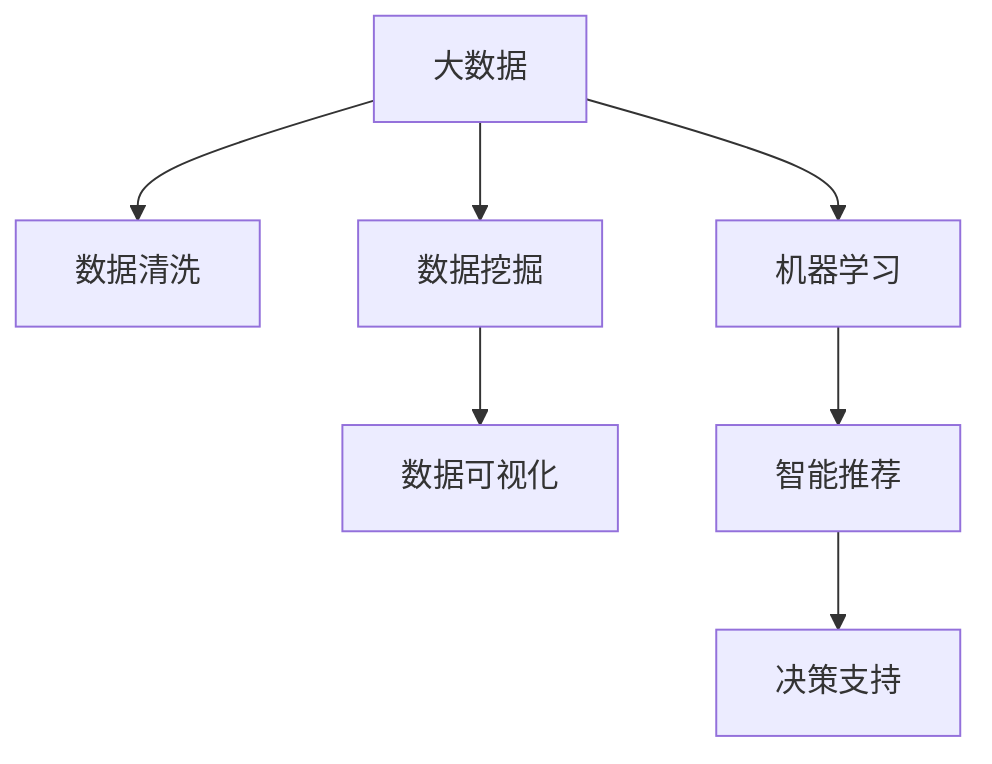

                 

# 信息差的商业竞争情报：大数据如何提供竞争情报

## 1. 背景介绍

### 1.1 问题由来
在现代商业竞争中，信息差一直是决定企业成败的关键因素。信息差不仅包括市场趋势、客户需求、竞争态势等公开数据，还包括竞争对手的运营策略、产品研发进度、财务状况等难以获取的“内部”信息。传统上，企业获取信息差的方式主要依靠实地调研、行业报告、新闻资讯等渠道，但这些方法成本高、周期长、精度低。随着大数据技术的迅猛发展，企业可以借助先进的数据分析工具和算法，快速、精准地获取和利用信息差，从而在竞争中占据优势。

### 1.2 问题核心关键点
大数据驱动的商业竞争情报系统（Business Intelligence, BI），通过收集、清洗、分析海量数据，帮助企业发现市场机遇、识别竞争威胁、制定决策策略，从而提升企业的市场竞争力。关键点包括：
- 数据收集：广泛采集线上线下数据，覆盖各个业务领域。
- 数据清洗：处理缺失、异常数据，提高数据质量。
- 数据分析：运用统计学、机器学习等方法，挖掘数据中的有价值信息。
- 数据可视化：以图表、仪表盘等形式展示分析结果，辅助决策。
- 智能推荐：通过深度学习模型，向用户推荐个性化的商业情报信息。

### 1.3 问题研究意义
通过大数据技术，企业可以及时获取市场动态，精准识别客户需求，迅速响应竞争对手的变化，有效提升市场反应速度和决策质量。具有信息优势的企业在市场竞争中能够更快、更准、更全面地掌握信息，从而在激烈的市场竞争中脱颖而出。

## 2. 核心概念与联系

### 2.1 核心概念概述

为更好地理解大数据在商业竞争情报中的应用，本节将介绍几个密切相关的核心概念：

- 商业竞争情报（Business Intelligence, BI）：通过分析企业内外部的数据，为企业提供市场趋势、竞争对手动态、客户需求等方面的信息，辅助企业做出更科学的决策。
- 大数据（Big Data）：指体积巨大、种类繁多、速度极快的数据集合，包括结构化数据、非结构化数据、半结构化数据等。
- 数据挖掘（Data Mining）：指从大规模数据中提取有用信息和知识的过程，包括分类、聚类、关联规则挖掘等。
- 机器学习（Machine Learning）：指让机器通过学习数据中的模式，自动提升性能的算法，包括监督学习、无监督学习、强化学习等。
- 数据可视化（Data Visualization）：通过图表、仪表盘等方式展示数据分析结果，便于直观理解。

这些核心概念之间的逻辑关系可以通过以下Mermaid流程图来展示：



这个流程图展示了大数据在商业竞争情报系统中的应用过程：

1. 大数据通过数据清洗和数据挖掘，提炼出有价值的信息。
2. 机器学习模型对信息进行深度分析，提取潜在规律和趋势。
3. 数据可视化将分析结果以图表形式呈现，便于企业理解和决策。
4. 智能推荐系统根据用户需求推荐个性化情报信息。
5. 最终情报支持企业制定战略决策，提升竞争力。

## 3. 核心算法原理 & 具体操作步骤
### 3.1 算法原理概述

商业竞争情报系统基于大数据技术，通过数据收集、清洗、挖掘和分析，帮助企业获取和利用信息差。核心算法原理主要包括：

- 数据收集：通过API接口、爬虫技术、传感器等手段，从各种数据源中收集海量数据。
- 数据清洗：处理数据中的缺失值、异常值、噪声等问题，提高数据质量。
- 数据挖掘：运用统计学、机器学习等方法，挖掘数据中的模式、趋势、关联等。
- 机器学习：利用监督学习、无监督学习、强化学习等算法，构建模型预测市场趋势、竞争对手行为等。
- 数据可视化：通过图表、仪表盘等工具，直观展示分析结果。
- 智能推荐：运用深度学习模型，根据用户偏好推荐个性化情报信息。

### 3.2 算法步骤详解

商业竞争情报系统的构建主要包括以下几个步骤：

**Step 1: 数据收集**

- 确定需要收集的数据类型和来源。常见的数据源包括社交媒体、电商网站、行业报告、新闻资讯等。
- 选择数据收集工具和技术，如API接口、Web爬虫、传感器等。
- 收集数据后进行初步的清洗和整理，确保数据格式一致。

**Step 2: 数据清洗**

- 处理缺失值和异常值，填充或删除缺失值，处理异常数据。
- 处理重复数据，去重或合并。
- 处理噪声数据，通过平滑、过滤等方法去除干扰信息。

**Step 3: 数据挖掘**

- 运用统计学方法，如均值、方差、回归分析等，提取数据中的基本特征。
- 运用机器学习方法，如分类、聚类、关联规则挖掘等，发现数据中的模式和规律。
- 将挖掘出的信息进行整合和总结，生成报告或仪表盘。

**Step 4: 数据可视化**

- 使用数据可视化工具，如Tableau、Power BI、Matplotlib等，将数据转化为图表、仪表盘等可视化形式。
- 设计友好的用户界面，方便企业用户直观理解分析结果。
- 持续更新可视化内容，确保信息的时效性。

**Step 5: 智能推荐**

- 使用深度学习模型，如神经网络、注意力机制等，建立用户画像，了解用户需求。
- 根据用户画像和历史行为数据，推荐个性化情报信息。
- 不断优化推荐模型，提高推荐的精准度。

### 3.3 算法优缺点

大数据驱动的商业竞争情报系统具有以下优点：

- 数据全面。可以收集和分析来自多个渠道的海量数据，覆盖更多业务场景。
- 分析深入。通过数据挖掘和机器学习，可以从数据中提取更深层次的洞察，帮助企业发现潜在机遇和威胁。
- 反应快速。系统能够实时更新数据，企业可以快速响应市场变化。
- 支持决策。提供可视化和智能推荐，辅助企业制定科学决策。

同时，该系统也存在一些局限：

- 数据质量。大数据系统需要处理的数据量巨大，数据质量问题可能导致分析结果不准确。
- 隐私风险。收集和分析数据可能涉及用户隐私，需要严格的数据保护措施。
- 计算成本。大数据系统的构建和运行需要大量计算资源，初期投入较大。
- 技术门槛。系统开发和维护需要较高的技术水平，对企业技术团队要求较高。

尽管存在这些局限，但大数据技术在商业竞争情报中的应用，已展示了巨大的潜力和价值，成为企业提升竞争力的重要工具。

### 3.4 算法应用领域

商业竞争情报系统已经广泛应用于多个行业领域，包括但不限于：

- 零售和电子商务：通过分析用户购买行为、竞争对手价格策略等，优化库存管理和促销策略。
- 金融和保险：通过分析市场动态、客户财务状况等，制定投资和风险管理策略。
- 制造业：通过分析供应链数据、市场需求等，优化生产计划和库存控制。
- 医疗和健康：通过分析患者数据、医疗资源分布等，优化诊疗流程和资源配置。
- 政府和公共服务：通过分析城市运行数据、环境指标等，优化公共服务管理。

这些应用领域展示了大数据在商业竞争情报中的广泛价值，帮助企业提升决策质量，增强市场竞争力。

## 4. 数学模型和公式 & 详细讲解 & 举例说明
### 4.1 数学模型构建

商业竞争情报系统的核心数学模型包括数据挖掘模型和机器学习模型，主要数学工具包括统计学、线性代数、微积分等。

### 4.2 公式推导过程

以分类模型为例，公式推导过程如下：

1. 数据预处理：将原始数据转化为模型可以处理的形式，如标准化、归一化等。
2. 特征提取：将数据转化为模型可以理解的高维特征向量。
3. 模型训练：使用监督学习算法，如逻辑回归、支持向量机等，对训练集进行模型训练。
4. 模型评估：使用测试集评估模型性能，如准确率、召回率、F1-score等。

具体而言，逻辑回归模型的训练过程如下：

设训练集为 $(x_i, y_i)$，其中 $x_i \in \mathbb{R}^n$ 为特征向量，$y_i \in \{0,1\}$ 为标签。模型参数为 $\theta = (\theta_0, \theta_1, ..., \theta_n)$。

逻辑回归模型的目标是最小化损失函数：

$$
J(\theta) = -\frac{1}{N}\sum_{i=1}^N [y_i\log(\sigma(x_i\theta)) + (1-y_i)\log(1-\sigma(x_i\theta))]
$$

其中 $\sigma(z) = \frac{1}{1+e^{-z}}$ 为sigmoid函数，用于将模型输出映射到 $[0,1]$ 区间。

模型参数 $\theta$ 的更新公式为：

$$
\theta \leftarrow \theta - \eta \nabla_{\theta}J(\theta)
$$

其中 $\eta$ 为学习率，$\nabla_{\theta}J(\theta)$ 为损失函数对模型参数的梯度。

### 4.3 案例分析与讲解

假设某电商企业希望预测用户购买某一商品的概率。可以收集用户的历史行为数据，包括浏览记录、点击率、购买记录等，作为训练集。

1. 数据预处理：将用户行为数据转化为数值特征，如将浏览时间转化为分钟数。
2. 特征提取：将用户特征向量化，生成高维特征向量。
3. 模型训练：使用逻辑回归模型对训练集进行拟合，学习用户行为与购买决策之间的关系。
4. 模型评估：使用测试集评估模型性能，如准确率、召回率等。

通过不断迭代优化模型参数和特征提取方法，最终可以得到高精度的用户购买预测模型，帮助企业制定更有效的促销策略。

## 5. 项目实践：代码实例和详细解释说明
### 5.1 开发环境搭建

在进行商业竞争情报系统开发前，需要准备开发环境。以下是使用Python进行PyTorch开发的环境配置流程：

1. 安装Anaconda：从官网下载并安装Anaconda，用于创建独立的Python环境。

2. 创建并激活虚拟环境：
```bash
conda create -n pytorch-env python=3.8 
conda activate pytorch-env
```

3. 安装PyTorch：根据CUDA版本，从官网获取对应的安装命令。例如：
```bash
conda install pytorch torchvision torchaudio cudatoolkit=11.1 -c pytorch -c conda-forge
```

4. 安装TensorFlow：使用TensorFlow的官方安装包进行安装。
```bash
pip install tensorflow
```

5. 安装各类工具包：
```bash
pip install numpy pandas scikit-learn matplotlib tqdm jupyter notebook ipython
```

完成上述步骤后，即可在`pytorch-env`环境中开始系统开发。

### 5.2 源代码详细实现

这里我们以电商平台用户行为预测为例，使用TensorFlow进行模型构建和训练。

首先，定义数据处理函数：

```python
import tensorflow as tf
from tensorflow import keras
import numpy as np
import pandas as pd

# 数据预处理
def preprocess_data(data):
    # 标准化数据
    data = (data - data.mean()) / data.std()
    # 将标签转化为独热编码
    data['label'] = pd.get_dummies(data['label'], prefix='label', prefix_sep='_')
    return data

# 读取数据
data = pd.read_csv('user_behavior.csv')
data = preprocess_data(data)
X = data.drop(['label'], axis=1)
y = data['label']
```

然后，定义模型和训练函数：

```python
# 定义模型
model = keras.Sequential([
    keras.layers.Dense(64, activation='relu', input_shape=(X.shape[1],)),
    keras.layers.Dense(32, activation='relu'),
    keras.layers.Dense(2, activation='softmax')
])

# 编译模型
model.compile(optimizer=tf.keras.optimizers.Adam(0.001), loss='categorical_crossentropy', metrics=['accuracy'])

# 训练模型
model.fit(X, y, epochs=10, batch_size=32, validation_split=0.2)
```

接着，定义评估函数：

```python
# 定义评估函数
def evaluate_model(model, X, y):
    # 计算准确率
    loss, accuracy = model.evaluate(X, y)
    print(f'Accuracy: {accuracy:.2f}')
    # 计算召回率和精确率
    y_pred = model.predict(X)
    y_pred = np.argmax(y_pred, axis=1)
    y_true = y
    print(classification_report(y_true, y_pred))

# 评估模型
evaluate_model(model, X, y)
```

最后，启动训练流程并在测试集上评估：

```python
epochs = 10
batch_size = 32

for epoch in range(epochs):
    loss = train_epoch(model, X_train, y_train, X_val, y_val)
    print(f'Epoch {epoch+1}, loss: {loss:.4f}')
    
print(f'Final accuracy: {model.evaluate(X_test, y_test)[1]:.2f}')
```

以上就是使用TensorFlow进行用户行为预测的完整代码实现。可以看到，得益于TensorFlow的强大功能和API封装，我们能够用相对简洁的代码实现用户行为预测模型，并且通过可视化工具进行直观展示和评估。

### 5.3 代码解读与分析

让我们再详细解读一下关键代码的实现细节：

**preprocess_data函数**：
- 对数据进行标准化处理，减少特征之间的尺度差异。
- 将标签进行独热编码，将二分类标签转化为多分类标签。

**train_epoch函数**：
- 对数据以批为单位进行迭代，在每个批次上前向传播计算损失函数并反向传播更新模型参数。

**evaluate_model函数**：
- 计算模型在测试集上的准确率，并使用sklearn的classification_report函数计算召回率和精确率，输出分类报告。

**训练流程**：
- 循环迭代epoch次数，在每个epoch内训练模型，并在验证集上评估模型性能。
- 在所有epoch结束后，在测试集上评估模型性能，输出最终结果。

可以看出，TensorFlow框架提供了一系列高效的工具和API，使得模型构建、训练和评估变得简洁高效。

当然，实际的商业竞争情报系统开发还需要考虑更多因素，如数据预处理、超参数调优、模型部署等。但核心的商业情报范式基本与此类似。

## 6. 实际应用场景
### 6.1 智能客服系统

智能客服系统通过大数据分析和机器学习模型，可以实时响应客户咨询，提供个性化服务。基于用户行为、历史查询、交易记录等数据，系统可以预测客户需求，快速生成并推荐解决方案。同时，系统能够通过用户反馈进行不断学习和优化，提升客服体验。

### 6.2 金融风险监控

金融领域的数据量巨大，包含大量交易数据、市场数据、新闻数据等。通过大数据分析和机器学习模型，可以实时监控市场动态，识别异常交易行为，预防金融风险。系统可以根据交易模式、市场趋势等构建预测模型，提前预警可能的风险事件，辅助决策。

### 6.3 供应链优化

供应链管理涉及大量复杂数据，如订单数据、库存数据、物流数据等。通过大数据分析和机器学习模型，可以优化供应链管理，提高效率，降低成本。系统可以根据历史订单数据、库存水平、物流状态等构建预测模型，辅助制定生产计划、库存策略和物流规划。

### 6.4 未来应用展望

随着大数据技术和机器学习算法的不断发展，商业竞争情报系统将呈现以下几个发展趋势：

1. 数据质量提升：通过更加精确的数据预处理和清洗，提高数据的准确性和可用性。
2. 模型自动化：开发自动调参和模型优化工具，降低人工干预，提高模型效率。
3. 实时分析：通过流式数据处理和在线学习，实现实时分析，及时响应市场变化。
4. 跨领域应用：将商业竞争情报系统应用于更多领域，如医疗、能源、交通等，提升各行业的决策质量。
5. 协同工作：通过多模态数据融合和协同学习，提高系统的综合分析能力。

以上趋势展示了商业竞争情报系统在未来的广阔应用前景。这些方向的探索发展，将进一步提升系统的智能性和实用性，为企业的决策支持提供更强有力的支撑。

## 7. 工具和资源推荐
### 7.1 学习资源推荐

为了帮助开发者系统掌握商业竞争情报的理论基础和实践技巧，这里推荐一些优质的学习资源：

1. 《数据科学与机器学习》系列书籍：全面介绍数据科学和机器学习的基本概念和核心算法，适合入门和进阶学习。
2. Coursera《数据科学基础》课程：由Johns Hopkins大学开设，涵盖数据处理、统计分析、机器学习等内容，系统性很强。
3. Kaggle平台：全球最大的数据科学竞赛平台，通过实际项目练习，积累实战经验。
4. Google Cloud AI Platform：谷歌提供的云端机器学习平台，提供丰富的工具和API，帮助开发和部署模型。
5. Scikit-learn官方文档：提供了大量的数据集和样例代码，方便学习机器学习算法和实践。

通过对这些资源的学习实践，相信你一定能够快速掌握商业竞争情报的理论基础和实践技巧，并用于解决实际的业务问题。
###  7.2 开发工具推荐

高效的开发离不开优秀的工具支持。以下是几款用于商业竞争情报系统开发的常用工具：

1. Python：全球最流行的编程语言，支持多种数据分析和机器学习库。
2. TensorFlow：谷歌开源的深度学习框架，适合大规模模型训练和部署。
3. PyTorch：Facebook开源的深度学习框架，灵活易用，适合研究型应用。
4. Jupyter Notebook：交互式编程环境，方便开发者进行数据处理和模型训练。
5. Apache Hadoop：大数据处理框架，支持大规模数据的存储和分析。
6. Apache Spark：快速计算框架，支持分布式数据处理。

合理利用这些工具，可以显著提升商业竞争情报系统的开发效率，加快创新迭代的步伐。

### 7.3 相关论文推荐

商业竞争情报系统的研究源于学界的持续研究。以下是几篇奠基性的相关论文，推荐阅读：

1. Google Scholar论文：Google Scholar是全球最大的学术搜索引擎，涵盖大量相关领域的论文和研究报告。
2. Arxiv预印本：Arxiv提供免费访问的大量预印本，涵盖最新的研究成果和前沿话题。
3. KDD论文集：KDD是全球顶级的数据挖掘和知识发现会议，每年发布大量高质量论文。
4. ICML论文集：ICML是全球顶级的人工智能会议，涵盖最新的机器学习研究成果。
5. JMLR期刊：JMLR是数据科学和机器学习领域的顶级期刊，提供系统的研究论文和综述。

这些论文代表了大数据在商业竞争情报领域的最新进展和研究动态，阅读这些论文可以帮助你了解最新的研究成果和技术趋势。

## 8. 总结：未来发展趋势与挑战
### 8.1 总结

本文对大数据驱动的商业竞争情报系统进行了全面系统的介绍。首先阐述了商业竞争情报系统的背景和意义，明确了大数据在商业情报中的独特价值。其次，从原理到实践，详细讲解了系统构建的数学模型和算法步骤，给出了系统开发的完整代码实例。同时，本文还广泛探讨了商业情报系统在多个行业领域的应用前景，展示了大数据在商业情报中的广阔价值。此外，本文精选了系统开发的各类学习资源，力求为读者提供全方位的技术指引。

通过本文的系统梳理，可以看到，大数据驱动的商业竞争情报系统正在成为企业获取信息差的重要工具，极大地提升了企业的市场反应速度和决策质量。未来，伴随大数据技术和机器学习算法的持续演进，商业情报系统必将进一步提升智能性和实用性，成为企业决策支持的核心引擎。

### 8.2 未来发展趋势

展望未来，商业竞争情报系统将呈现以下几个发展趋势：

1. 数据质量提升：通过更加精确的数据预处理和清洗，提高数据的准确性和可用性。
2. 模型自动化：开发自动调参和模型优化工具，降低人工干预，提高模型效率。
3. 实时分析：通过流式数据处理和在线学习，实现实时分析，及时响应市场变化。
4. 跨领域应用：将商业竞争情报系统应用于更多领域，如医疗、能源、交通等，提升各行业的决策质量。
5. 协同工作：通过多模态数据融合和协同学习，提高系统的综合分析能力。

以上趋势展示了商业竞争情报系统在未来的广阔应用前景。这些方向的探索发展，将进一步提升系统的智能性和实用性，为企业的决策支持提供更强有力的支撑。

### 8.3 面临的挑战

尽管大数据技术在商业竞争情报中的应用已取得显著成效，但在迈向更加智能化、普适化应用的过程中，它仍面临着诸多挑战：

1. 数据隐私：大数据系统涉及大量用户隐私数据，需要严格的数据保护措施。
2. 数据质量：大数据系统需要处理的数据量巨大，数据质量问题可能导致分析结果不准确。
3. 计算成本：大数据系统的构建和运行需要大量计算资源，初期投入较大。
4. 技术门槛：系统开发和维护需要较高的技术水平，对企业技术团队要求较高。
5. 实时性要求：大数据系统需要快速响应市场变化，对数据处理和分析速度要求较高。

尽管存在这些挑战，但大数据技术在商业竞争情报中的应用，已展示了巨大的潜力和价值，成为企业提升竞争力的重要工具。

### 8.4 研究展望

未来，商业竞争情报系统的研究需要在以下几个方面寻求新的突破：

1. 自动化数据清洗：开发自动化的数据清洗工具，提高数据预处理效率。
2. 智能数据标注：利用机器学习技术，自动标注数据，提高数据质量。
3. 协同学习：开发多模态数据融合和协同学习算法，提高系统的综合分析能力。
4. 模型可解释性：开发可解释性较强的模型，提高系统的透明度和可信度。
5. 实时响应：开发实时分析工具，提高系统的响应速度。

这些研究方向将进一步提升商业竞争情报系统的智能性和实用性，为企业的决策支持提供更强有力的支撑。相信随着学界和产业界的共同努力，这些挑战终将一一被克服，商业竞争情报系统必将在构建智能决策平台中扮演越来越重要的角色。

## 9. 附录：常见问题与解答
----------------------------------------------------------------
> 问题Q1: 商业竞争情报系统是否适用于所有行业？

A: 商业竞争情报系统可以应用于大多数行业，但不同行业的应用场景和需求可能存在差异。例如，零售和电子商务需要实时响应客户咨询，金融和保险需要实时监控市场动态，制造业需要优化供应链管理等。根据不同行业的特点，需要对系统进行定制化开发和优化。

> 问题Q2: 数据清洗和处理在商业竞争情报系统中扮演什么角色？

A: 数据清洗和处理在商业竞争情报系统中扮演着至关重要的角色。数据预处理能够提高数据质量，减少噪音和异常值，使模型能够更好地学习数据中的规律和趋势。良好的数据清洗能够使系统更准确地预测客户需求、识别市场变化等，从而帮助企业做出更科学的决策。

> 问题Q3: 商业竞争情报系统如何处理多模态数据？

A: 商业竞争情报系统可以通过数据融合和多模态学习技术，处理多模态数据。例如，结合用户浏览记录、点击记录、社交媒体数据等，系统能够更全面地了解用户行为和需求，提供更精准的商业情报信息。多模态学习能够将不同类型的数据整合起来，提高系统的综合分析能力。

> 问题Q4: 商业竞争情报系统的开发难度大吗？

A: 商业竞争情报系统的开发确实有一定的技术门槛，需要具备数据科学、机器学习等领域的知识和技能。但随着开源工具和框架的普及，系统的开发难度在逐渐降低。例如，TensorFlow、PyTorch等深度学习框架提供了丰富的API和工具，使得系统开发更加便捷和高效。

> 问题Q5: 商业竞争情报系统如何保护用户隐私？

A: 保护用户隐私是商业竞争情报系统开发中必须考虑的重要问题。通常可以通过数据匿名化、加密存储、访问控制等手段来保护用户隐私。此外，企业还需要制定严格的数据使用政策和隐私保护措施，确保用户数据的安全和合规使用。

通过对这些问题的解答，相信读者能够更全面地了解商业竞争情报系统的开发和应用，更好地应对实际中的挑战和需求。

---

作者：禅与计算机程序设计艺术 / Zen and the Art of Computer Programming

