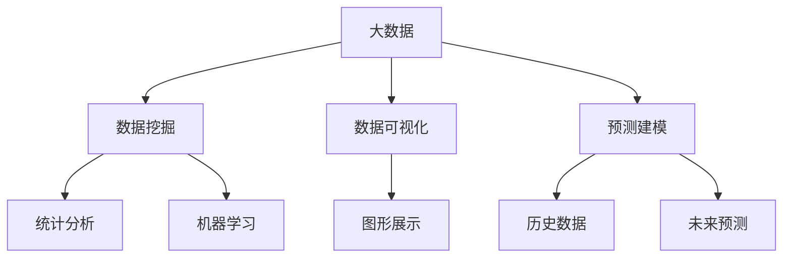

                 

# 信息差的市场进入突破：大数据如何突破进入壁垒

在当今数字化时代，信息差成为了企业市场进入与竞争的显著壁垒。如何通过大数据技术突破信息差，抓住市场先机，成为许多企业亟需解决的问题。本文旨在探讨大数据如何帮助企业有效识别信息差，并利用数据分析和建模技术突破这些壁垒，获取竞争优势。

## 1. 背景介绍

### 1.1 问题由来
在经济全球化和数字化转型的大背景下，信息差逐渐成为企业进入新市场、获取新客户的关键因素。市场信息不对称、需求预测困难、客户行为复杂等因素，使得企业难以精准把握市场机会。如何通过数据驱动决策，有效解决信息不对称问题，成为企业转型升级的关键。

### 1.2 问题核心关键点
- **信息差**：指市场信息的不对称，企业缺乏及时、准确的市场情报，导致市场响应和决策滞后。
- **大数据**：指规模庞大、多样化、实时性强的数据集，具备强大分析能力，可以帮助企业准确捕捉市场变化和客户需求。
- **数据驱动决策**：指通过数据驱动的分析和建模，辅助企业做出更明智的决策，降低决策风险，提高市场响应速度。
- **突破壁垒**：指通过大数据技术和方法，突破信息差的限制，获取竞争优势，实现市场快速进入和份额增长。

## 2. 核心概念与联系

### 2.1 核心概念概述

为更好地理解大数据如何突破信息差，我们首先介绍几个核心概念：

- **大数据(Big Data)**：指从各种来源收集和处理的海量数据，能够进行复杂的数据分析，揭示数据背后的模式和趋势。
- **数据挖掘(Data Mining)**：指通过统计分析、机器学习等手段，从大数据中发现有用信息的过程。
- **数据可视化(Data Visualization)**：指通过图形化展示数据，直观揭示数据背后的模式和趋势，辅助决策。
- **预测建模(Predictive Modeling)**：指通过建立数据模型，对未来数据进行预测，为企业提供有价值的信息支持。

这些概念之间存在紧密的联系：大数据提供了丰富的数据源，数据挖掘通过算法提取有价值的信息，数据可视化使信息更直观，而预测建模则基于历史数据预测未来趋势，支持企业决策。

### 2.2 核心概念原理和架构的 Mermaid 流程图



这个流程图展示了大数据到最终预测建模的全过程。大数据源通过数据挖掘提取有价值的信息，并经过数据可视化和预测建模两个环节，最终支持企业决策。

## 3. 核心算法原理 & 具体操作步骤

### 3.1 算法原理概述

利用大数据突破信息差的关键在于数据驱动决策。其核心思想是通过对海量数据的深入分析，揭示市场和客户行为背后的规律，从而制定科学的决策策略。具体来说，大数据技术可以用于以下几个方面：

1. **市场情报分析**：通过分析竞争对手、市场趋势、客户反馈等数据，识别市场机会和潜在风险。
2. **客户需求预测**：通过分析客户行为数据、购买历史等，预测未来客户需求，优化产品和服务。
3. **渠道优化**：通过分析渠道销售数据、客户流量等，优化渠道布局和营销策略。

### 3.2 算法步骤详解

以下是利用大数据突破信息差的一般步骤：

**Step 1: 数据收集与清洗**
- 收集来自市场、客户、销售、渠道等多个渠道的数据，确保数据完整性和质量。
- 对数据进行清洗和预处理，去除噪声和异常值，保证数据准确性。

**Step 2: 数据探索与分析**
- 使用统计分析、机器学习等方法，探索数据背后的模式和趋势。
- 通过可视化工具（如Tableau、Power BI等），直观展示数据分布和变化趋势。

**Step 3: 预测建模与评估**
- 建立数据模型（如回归模型、分类模型、聚类模型等），进行未来数据预测。
- 对模型进行评估和验证，确保预测精度和稳定性。

**Step 4: 策略制定与优化**
- 根据预测结果和分析结论，制定市场进入和优化策略。
- 不断迭代和优化策略，提升市场响应速度和决策效率。

### 3.3 算法优缺点

利用大数据突破信息差具有以下优点：

1. **准确性高**：大数据分析基于大量样本，能够更准确地揭示市场和客户行为规律。
2. **实时性高**：大数据处理技术能够实时分析数据，快速响应市场变化。
3. **覆盖广**：大数据可以覆盖多个领域和维度，提供全面的市场情报。
4. **可解释性强**：数据分析和建模过程可解释性强，有助于理解决策依据。

同时，该方法也存在一些局限性：

1. **数据获取难度大**：获取高质量、多样化的大数据集可能面临技术和成本挑战。
2. **数据隐私和安全问题**：数据收集和分析过程中可能涉及隐私数据和敏感信息。
3. **数据质量依赖**：分析结果的准确性和可靠性高度依赖于数据质量。
4. **技术门槛高**：需要具备数据分析和建模的专业技能，技术门槛较高。

### 3.4 算法应用领域

大数据技术在多个领域都有广泛应用，以下是几个典型的应用场景：

1. **零售行业**：通过分析销售数据、客户行为数据等，预测需求趋势，优化库存和定价策略。
2. **金融行业**：通过分析交易数据、市场情绪数据等，预测市场走势，优化投资和风险管理。
3. **制造业**：通过分析生产数据、供应链数据等，优化生产流程和供应链管理。
4. **医疗行业**：通过分析患者数据、医疗记录等，预测疾病趋势，优化诊疗方案。
5. **政府管理**：通过分析人口数据、环境数据等，制定政策，优化资源配置。

## 4. 数学模型和公式 & 详细讲解 & 举例说明

### 4.1 数学模型构建

我们以客户需求预测为例，构建一个基于时间序列分析的预测模型。

假设市场需求量 $Y_t$ 受多种因素 $X_t$ 影响，可用线性回归模型表示：

$$
Y_t = \beta_0 + \sum_{i=1}^p \beta_i X_{ti} + \epsilon_t
$$

其中 $\beta_0$ 为截距项，$\beta_i$ 为影响系数，$X_{ti}$ 为影响因素，$\epsilon_t$ 为误差项。

### 4.2 公式推导过程

基于上述模型，我们可以推导出预测值的计算公式：

$$
\hat{Y}_{t+1} = \hat{\beta}_0 + \sum_{i=1}^p \hat{\beta}_i X_{t+1,i}
$$

其中 $\hat{\beta}$ 为参数估计值，可通过最小二乘法或其他优化方法得到。

### 4.3 案例分析与讲解

以某零售公司为例，通过分析历史销售数据和节假日数据，建立线性回归模型预测未来销量：

- **数据准备**：收集历史销售数据、节假日信息等。
- **模型建立**：选择合适的影响因素，建立线性回归模型。
- **参数估计**：使用最小二乘法估计模型参数。
- **结果分析**：分析预测结果，调整销售策略。

## 5. 项目实践：代码实例和详细解释说明

### 5.1 开发环境搭建

在进行大数据分析实践前，我们需要准备好开发环境。以下是使用Python进行Pandas、NumPy、Scikit-learn等库的配置流程：

1. 安装Anaconda：从官网下载并安装Anaconda，用于创建独立的Python环境。
2. 创建并激活虚拟环境：
```bash
conda create -n data-env python=3.8 
conda activate data-env
```
3. 安装相关库：
```bash
pip install pandas numpy scikit-learn matplotlib jupyter notebook ipython
```

完成上述步骤后，即可在`data-env`环境中开始数据分析实践。

### 5.2 源代码详细实现

我们使用Python和Pandas库进行大数据分析，以下是一个简单的案例：

```python
import pandas as pd
import numpy as np
from sklearn.linear_model import LinearRegression

# 加载数据
data = pd.read_csv('sales_data.csv')

# 数据预处理
data = data.dropna()
X = data[['促销活动', '季节性因素', '天气状况']]
Y = data['sales']

# 模型建立
model = LinearRegression()
model.fit(X, Y)

# 预测
forecast_data = pd.read_csv('forecast_data.csv')
forecast_X = forecast_data[['促销活动', '季节性因素', '天气状况']]
forecast_Y = model.predict(forecast_X)

# 结果可视化
import matplotlib.pyplot as plt
plt.plot(forecast_data.index, Y)
plt.plot(forecast_data.index, forecast_Y)
plt.show()
```

### 5.3 代码解读与分析

让我们再详细解读一下关键代码的实现细节：

**数据预处理**：
- 使用Pandas加载数据，并进行数据清洗，去除缺失值。
- 选择影响因子 $X$ 和目标变量 $Y$。

**模型建立**：
- 使用Scikit-learn的LinearRegression模型，拟合数据。

**预测与可视化**：
- 对测试数据进行预测。
- 使用Matplotlib库绘制预测结果和实际数据对比图。

## 6. 实际应用场景

### 6.1 零售行业

大数据分析在零售行业中有广泛应用。通过分析客户购买行为、市场趋势等数据，零售企业可以制定更精准的市场营销策略和库存管理方案。例如：

- **客户细分**：通过分析客户购买记录、评价数据等，对客户进行细分，提供个性化服务。
- **库存优化**：通过分析历史销售数据、市场趋势等，预测未来需求，优化库存水平。
- **价格优化**：通过分析竞争对手价格、市场波动等，制定最优定价策略。

### 6.2 金融行业

金融行业依赖于大数据分析进行风险管理和投资决策。通过分析交易数据、市场情绪等，金融机构可以预测市场走势，优化投资组合和风险管理策略。例如：

- **市场情绪分析**：通过分析新闻、社交媒体等，评估市场情绪，调整投资策略。
- **信用评分**：通过分析客户信用记录、交易数据等，评估信用风险，优化贷款审批流程。
- **投资组合优化**：通过分析历史交易数据、市场波动等，优化投资组合，提高收益。

### 6.3 制造业

制造业通过大数据分析，可以优化生产流程和供应链管理。例如：

- **生产调度**：通过分析生产数据、设备状态等，优化生产调度，提高生产效率。
- **质量控制**：通过分析生产数据、质检记录等，优化质量控制，降低次品率。
- **供应链优化**：通过分析供应商数据、物流信息等，优化供应链管理，提高供应链响应速度。

### 6.4 未来应用展望

未来，大数据技术将在更多领域得到应用，为各行各业带来变革性影响：

1. **实时分析**：通过流数据处理技术，实现实时数据分析，及时响应市场变化。
2. **跨领域融合**：将大数据分析与其他技术（如区块链、物联网等）结合，形成更全面的数据分析体系。
3. **边缘计算**：通过边缘计算技术，将数据分析推向边缘设备，提升数据分析效率。
4. **AI和ML集成**：将AI和ML技术融入大数据分析，提升分析精度和自动化水平。
5. **数据隐私保护**：通过数据加密、匿名化等手段，保护数据隐私和安全。

## 7. 工具和资源推荐

### 7.1 学习资源推荐

为了帮助开发者掌握大数据分析技术，我们推荐以下学习资源：

1. **《Python数据分析实战》**：详细讲解Pandas、NumPy等库的应用，提供大量实例代码。
2. **《大数据分析基础》**：系统介绍大数据分析的原理和实现方法，涵盖数据收集、清洗、建模等多个环节。
3. **Coursera《大数据与人工智能》课程**：由斯坦福大学开设，涵盖大数据技术和AI算法，适合深入学习。
4. **Kaggle**：数据科学竞赛平台，提供大量数据集和模型实现案例，适合实战练习。
5. **TensorFlow和PyTorch官方文档**：介绍这两个主流深度学习框架的应用，涵盖大数据分析的多个场景。

通过这些学习资源，相信你能够快速掌握大数据分析的核心技术，并应用于实际项目中。

### 7.2 开发工具推荐

高效的数据分析离不开优秀的工具支持。以下是几款用于大数据分析开发的常用工具：

1. **Pandas**：基于NumPy的Python数据分析库，提供高效的数据处理和分析功能。
2. **NumPy**：Python科学计算库，提供高效的多维数组操作和线性代数功能。
3. **Scikit-learn**：Python机器学习库，提供丰富的模型和算法实现。
4. **TensorFlow和PyTorch**：主流深度学习框架，支持大数据分析的多场景应用。
5. **Tableau和Power BI**：数据可视化工具，提供强大的数据展示功能。
6. **Jupyter Notebook**：Python开发环境，支持代码执行和结果展示。

合理利用这些工具，可以显著提升大数据分析任务的开发效率，加快创新迭代的步伐。

### 7.3 相关论文推荐

大数据分析和预测建模的探索源于学界的持续研究。以下是几篇奠基性的相关论文，推荐阅读：

1. **《Big Data: A Revolution That Will Transform How We Live, Work, and Think》**：作者Viktor Mayer-Schönberger和Kenneth Cukier，详细探讨了大数据的变革潜力。
2. **《Predictive Analytics: The Power of Analytics for Business Decision Making》**：作者Eric Siegel，系统介绍了预测建模的原理和方法。
3. **《Data Mining: Concepts and Techniques》**：作者Jianmo Yu和Michael Kamber，全面介绍了数据挖掘的算法和技术。
4. **《Time Series Analysis and Its Applications》**：作者Robert S. Tsay，详细介绍了时间序列分析的理论和实践方法。

这些论文代表了大数据分析和预测建模的发展脉络。通过学习这些前沿成果，可以帮助研究者把握学科前进方向，激发更多的创新灵感。

## 8. 总结：未来发展趋势与挑战

### 8.1 总结

本文对大数据如何突破信息差进行了全面系统的介绍。首先阐述了大数据在市场进入和竞争中的重要性，明确了利用大数据进行信息差突破的关键。其次，从原理到实践，详细讲解了大数据分析的数学模型和实现步骤，给出了具体的大数据分析代码实例。同时，本文还探讨了大数据分析在零售、金融、制造等多个行业领域的应用场景，展示了大数据分析的广阔前景。

通过本文的系统梳理，可以看到，大数据技术正在成为市场进入和竞争的关键手段，极大地拓展了企业的决策能力。未来，伴随大数据技术的持续演进，大数据分析必将在更多领域大放异彩，为各行各业带来全新的突破。

### 8.2 未来发展趋势

展望未来，大数据技术的发展趋势如下：

1. **实时分析**：通过流数据处理技术，实现实时数据分析和决策，提升市场响应速度。
2. **边缘计算**：将大数据分析推向边缘设备，降低延迟，提升处理效率。
3. **跨领域融合**：将大数据分析与其他技术（如区块链、物联网等）结合，形成更全面的数据分析体系。
4. **AI和ML集成**：将AI和ML技术融入大数据分析，提升分析精度和自动化水平。
5. **数据隐私保护**：通过数据加密、匿名化等手段，保护数据隐私和安全。

这些趋势展示了大数据技术的广阔前景，预示着未来企业数据驱动决策的革命性变革。

### 8.3 面临的挑战

尽管大数据分析技术已经取得了显著成就，但在迈向更加智能化、普适化应用的过程中，仍面临诸多挑战：

1. **数据质量问题**：大数据分析依赖于高质量的数据源，数据质量问题可能会影响分析结果的准确性。
2. **技术门槛高**：大数据分析需要具备数据分析和建模的专业技能，技术门槛较高。
3. **计算资源需求大**：大数据分析通常需要大量的计算资源，这对计算设备和存储能力提出了高要求。
4. **数据隐私和安全问题**：大数据分析涉及大量敏感数据，数据隐私和安全问题需要得到重视。
5. **数据孤岛问题**：不同系统之间的数据整合和共享存在障碍，形成数据孤岛，影响数据分析效果。

这些挑战需要企业和技术开发者共同应对，不断优化数据质量，提升技术能力，改善计算资源和隐私安全环境，才能实现大数据分析的最大潜力。

### 8.4 研究展望

面对大数据分析面临的挑战，未来的研究需要在以下几个方面寻求新的突破：

1. **数据清洗和预处理技术**：研发高效的数据清洗和预处理算法，提升数据质量。
2. **跨平台数据整合技术**：开发跨系统数据整合和共享的解决方案，解决数据孤岛问题。
3. **智能分析工具**：开发基于AI和ML技术的智能分析工具，提升数据分析的自动化和智能化水平。
4. **数据隐私保护技术**：研究数据隐私保护的新技术，确保数据安全。
5. **实时分析技术**：研发实时数据处理技术，实现实时数据分析和决策。

这些研究方向的探索，必将引领大数据分析技术迈向更高的台阶，为构建安全、可靠、可解释、可控的智能系统铺平道路。面向未来，大数据分析技术还需要与其他人工智能技术进行更深入的融合，如知识表示、因果推理、强化学习等，多路径协同发力，共同推动数据驱动决策的进步。

## 9. 附录：常见问题与解答

**Q1: 大数据分析是否适用于所有企业？**

A: 大数据分析对企业规模和行业都有一定的要求。大数据分析通常适用于数据量较大、业务复杂、需要实时决策的企业。对于数据规模较小、业务简单的企业，大数据分析可能并不是最优选择。

**Q2: 如何选择合适的数据源？**

A: 选择数据源时，需要考虑数据的完整性、实时性、多样性等因素。通常，选择具备数据质量保证和实时更新能力的第三方数据供应商，可以提供更可靠的数据源。同时，企业也可以通过自建数据采集和存储系统，构建自己的数据平台。

**Q3: 数据清洗和预处理需要注意哪些问题？**

A: 数据清洗和预处理是数据分析的第一步，需要注意以下几个问题：
1. 去除噪声和异常值，确保数据准确性。
2. 处理缺失数据，填补或删除缺失值。
3. 数据归一化和标准化，提升数据一致性。
4. 数据采样和分组，优化数据处理效率。

**Q4: 如何评估数据分析模型的效果？**

A: 评估数据分析模型的效果通常需要以下几个步骤：
1. 使用交叉验证等方法，评估模型的泛化能力。
2. 计算模型在测试集上的准确率、召回率、F1分数等指标。
3. 进行敏感性分析，评估模型对数据变化的鲁棒性。
4. 进行实际应用测试，验证模型的实用性和效果。

通过以上问题与解答，相信你能够更加全面地理解大数据分析的应用场景和实践细节，更好地应对企业数据驱动决策的挑战。

---

作者：禅与计算机程序设计艺术 / Zen and the Art of Computer Programming

