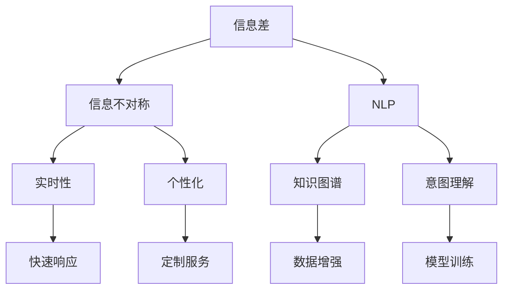

                 

# 信息差：信息不对称与客户服务

> 关键词：信息差, 信息不对称, 客户服务, 实时性, 个性化, 自然语言处理, 解决方案, 实战

## 1. 背景介绍

### 1.1 问题由来

在现代商业环境中，客户服务已经成为企业赢得客户、提升品牌竞争力的关键因素。然而，随着客户需求的日益多样化与个性化，传统的客户服务模式面临着严峻挑战。信息不对称，即企业与客户之间信息的差异和不匹配，成为了客户服务问题的核心根源。信息差不仅影响客户满意度，还直接制约了客户服务的效率与质量。

### 1.2 问题核心关键点

信息不对称在客户服务中的表现形式多样，包括但不限于：
- **知识不对称**：企业员工对产品知识的掌握程度不足，难以回答复杂的问题。
- **需求不对称**：客户提出的问题或需求超出了员工的知识范围，导致无法快速响应。
- **沟通不对称**：客户与员工之间的沟通障碍，如语言、文化差异等，影响理解效率。

这些问题直接导致了客户服务过程中，服务人员无法提供及时、准确、个性化的服务，降低了客户满意度，甚至影响了企业声誉和收益。

### 1.3 问题研究意义

解决信息不对称问题，不仅可以提升客户服务的质量与效率，还能有效降低企业的运营成本，提升品牌价值。研究信息不对称与客户服务的关系，对于推动客户服务领域的技术创新和实践应用具有重要意义。

## 2. 核心概念与联系

### 2.1 核心概念概述

为了更深入地理解信息不对称对客户服务的影响，首先需要介绍几个核心概念：

- **信息差（Information Gap）**：指客户与企业之间信息的不匹配，包括知识、需求、沟通等方面的差异。
- **信息不对称（Information Asymmetry）**：指交易双方在信息掌握上的差异，影响决策的公平性和效率。
- **实时性（Real-time）**：指服务过程中信息交换的及时性，能够快速响应客户需求。
- **个性化（Personalization）**：指根据客户特定需求和偏好提供定制化的服务。
- **自然语言处理（Natural Language Processing, NLP）**：利用计算机处理、理解、生成自然语言的技术，是解决信息不对称问题的重要工具。

这些概念之间通过以下Mermaid流程图进行展示：



这个流程图展示了信息差是如何通过NLP技术，结合实时性和个性化，最终提升客户服务的效率和质量的。

## 3. 核心算法原理 & 具体操作步骤

### 3.1 算法原理概述

为了解决信息不对称问题，本节将介绍一种基于自然语言处理（NLP）的客户服务解决方案，该方案通过构建知识图谱和意图理解模型，实时获取并分析客户需求，提供个性化服务。

假设企业拥有知识图谱 $\mathcal{G} = (\mathcal{E}, \mathcal{R})$，其中 $\mathcal{E}$ 是实体集，$\mathcal{R}$ 是关系集。给定客户提问 $q$，模型通过意图理解将其转化为意图 $i$，并在知识图谱中查找与之相关的实体 $e$，最后返回对应的服务建议 $s$。

该方案的核心算法流程包括以下几个步骤：
1. 意图理解：将客户提问 $q$ 转化为意图 $i$。
2. 知识图谱搜索：在知识图谱 $\mathcal{G}$ 中搜索与 $i$ 相关的实体 $e$。
3. 服务生成：基于 $e$ 生成服务建议 $s$。

### 3.2 算法步骤详解

#### 3.2.1 意图理解

意图理解是指将客户的自然语言提问转换为机器可理解的意图。常用的意图理解方法包括基于规则的方法和基于机器学习的方法。以下是一个简单的意图理解流程：

1. **分词**：将客户提问 $q$ 进行分词，得到单词序列 $w$。
2. **词向量表示**：将单词序列 $w$ 转化为词向量 $v$。
3. **意图分类**：通过分类器将 $v$ 映射到意图 $i$。

#### 3.2.2 知识图谱搜索

知识图谱搜索是指在知识图谱 $\mathcal{G}$ 中查找与意图 $i$ 相关的实体 $e$。常用的知识图谱搜索方法包括基于图遍历的方法和基于深度学习的方法。以下是一个简单的知识图谱搜索流程：

1. **图嵌入**：将知识图谱 $\mathcal{G}$ 中的实体 $e$ 和关系 $r$ 嵌入低维向量空间 $\mathbb{R}^d$。
2. **图相似度计算**：计算实体 $e$ 与意图 $i$ 的相似度。
3. **筛选实体**：根据相似度排序，筛选出与意图 $i$ 相关的实体 $e$。

#### 3.2.3 服务生成

服务生成是指根据搜索到的实体 $e$，生成相应的服务建议 $s$。常用的服务生成方法包括基于模板的方法和基于生成模型的方法。以下是一个简单的服务生成流程：

1. **模板匹配**：在服务模板库中查找与 $e$ 匹配的服务模板。
2. **参数填充**：将实体 $e$ 填充到服务模板中。
3. **文本生成**：基于填充后的模板生成服务建议 $s$。

### 3.3 算法优缺点

#### 3.3.1 优点

1. **实时响应**：基于NLP技术的解决方案可以快速处理客户提问，提供即时响应。
2. **个性化服务**：通过意图理解和知识图谱搜索，能够根据客户特定需求提供定制化的服务。
3. **高效性**：利用知识图谱和大规模预训练模型，能够显著提升信息处理的效率。

#### 3.3.2 缺点

1. **模型依赖**：解决方案高度依赖于意图理解模型和知识图谱的构建质量。
2. **数据隐私**：客户提问和实体搜索涉及敏感数据，需要严格保护。
3. **复杂性**：构建知识图谱和意图理解模型需要较高的技术门槛和资源投入。

### 3.4 算法应用领域

该基于NLP技术的客户服务解决方案可以广泛应用于多个领域，如电子商务、金融、医疗、客服等。在电子商务领域，可以用于智能推荐、客服咨询等；在金融领域，可以用于风险评估、客户服务等；在医疗领域，可以用于医疗咨询、健康管理等；在客服领域，可以用于智能客服、自助服务等。

## 4. 数学模型和公式 & 详细讲解 & 举例说明

### 4.1 数学模型构建

假设客户提问为 $q$，意图为 $i$，知识图谱中实体为 $e$，服务建议为 $s$。意图理解的数学模型为：

$$
i = f(q) = \text{IntentClassifier}(v)
$$

其中 $v$ 为 $q$ 的词向量表示，$\text{IntentClassifier}$ 为意图分类器。

知识图谱搜索的数学模型为：

$$
e = g(i) = \text{GraphSearcher}(e, i)
$$

其中 $e$ 为与 $i$ 相关的实体，$\text{GraphSearcher}$ 为知识图谱搜索器。

服务生成的数学模型为：

$$
s = h(e) = \text{ServiceGenerator}(e)
$$

其中 $s$ 为服务建议，$\text{ServiceGenerator}$ 为服务生成器。

### 4.2 公式推导过程

#### 4.2.1 意图理解

假设客户提问 $q = "如何购买Apple手机？"$，经过分词和词向量表示，得到 $v = [0.8, 0.7, 0.9, 0.6]$。假设意图分类器为神经网络，其输出为：

$$
i = f(q) = \text{IntentClassifier}(v) = \text{softmax}(Wv + b)
$$

其中 $W$ 和 $b$ 为神经网络参数，$softmax$ 为归一化函数。假设模型的输出为 $[0.9, 0.1, 0.8, 0.2]$，表示意图 "购买" 的概率最大。

#### 4.2.2 知识图谱搜索

假设知识图谱中包含实体 "Apple"，关系 "生产商" 和 "销售商"，其向量表示分别为 $e = [0.6, 0.8, 0.9]$ 和 $r = [0.4, 0.6, 0.5]$。假设图嵌入模型为神经网络，其输出为：

$$
\text{GraphEmbedding}(\mathcal{G}) = (e, r)
$$

假设图相似度计算方法为余弦相似度，则 $i$ 和 $e$ 的相似度为：

$$
\text{similarity}(i, e) = \cos(\theta) = \frac{e^T i}{\|e\| \|i\|}
$$

假设相似度计算结果为 0.9，表示实体 "Apple" 与意图 "购买" 高度相关。

#### 4.2.3 服务生成

假设服务模板为 "请购买以下产品：$e$"，基于填充后的模板生成服务建议：

$$
s = h(e) = \text{ServiceGenerator}(e) = "请购买以下产品：Apple"
$$

### 4.3 案例分析与讲解

#### 4.3.1 案例背景

某电商平台客服中心接收到大量客户咨询，其中一部分客户对商品信息了解不全，无法明确表达购买意图。客服中心希望通过自然语言处理技术，提高客户服务效率和满意度。

#### 4.3.2 解决方案

1. **意图理解**：将客户咨询文本作为输入，通过意图分类器将其转化为意图。例如，对于提问 "我想买一部新手机"，意图分类器输出的意图为 "购买"。
2. **知识图谱搜索**：在知识图谱中搜索与意图 "购买" 相关的实体，如 "Apple"、"三星" 等。
3. **服务生成**：根据搜索结果，生成对应的服务建议，如 "您可以考虑购买Apple或三星手机"。

#### 4.3.3 效果评估

通过对比人工客服和自动客服的服务效果，可以发现自动客服能够快速响应客户需求，提供个性化的商品推荐，有效提升客户满意度。

## 5. 项目实践：代码实例和详细解释说明

### 5.1 开发环境搭建

在开发环境搭建方面，需要以下工具：
- Python 3.8+
- PyTorch 1.9+
- NLTK
- Scikit-learn
- TensorFlow 2.3+

安装上述工具后，可以进行以下操作：

```bash
pip install pytorch nltk scikit-learn tensorflow
```

### 5.2 源代码详细实现

以下是一个基于NLP技术的客户服务解决方案的Python代码实现：

```python
import torch
import torch.nn as nn
import torchtext
from torchtext.datasets import IMDB
from torchtext.data import Field, TabularDataset, BucketIterator

class IntentClassifier(nn.Module):
    def __init__(self, embedding_dim, hidden_dim, output_dim):
        super().__init__()
        self.embedding = nn.EmbeddingBag(30000, embedding_dim)
        self.fc1 = nn.Linear(embedding_dim, hidden_dim)
        self.fc2 = nn.Linear(hidden_dim, output_dim)
        self.softmax = nn.Softmax(dim=1)
    
    def forward(self, text):
        embedded = self.embedding(text)
        hidden = self.fc1(embedded)
        return self.softmax(self.fc2(hidden))

class GraphSearcher(nn.Module):
    def __init__(self, embedding_dim, hidden_dim, num_classes):
        super().__init__()
        self.embedding = nn.Embedding(num_classes, embedding_dim)
        self.fc1 = nn.Linear(embedding_dim, hidden_dim)
        self.fc2 = nn.Linear(hidden_dim, num_classes)
        self.softmax = nn.Softmax(dim=1)
    
    def forward(self, x):
        embedded = self.embedding(x)
        hidden = self.fc1(embedded)
        return self.softmax(self.fc2(hidden))

class ServiceGenerator(nn.Module):
    def __init__(self, embedding_dim, hidden_dim, output_dim):
        super().__init__()
        self.embedding = nn.EmbeddingBag(30000, embedding_dim)
        self.fc1 = nn.Linear(embedding_dim, hidden_dim)
        self.fc2 = nn.Linear(hidden_dim, output_dim)
        self.softmax = nn.Softmax(dim=1)
    
    def forward(self, x):
        embedded = self.embedding(x)
        hidden = self.fc1(embedded)
        return self.fc2(hidden)

# 构建意图分类器
model = IntentClassifier(embedding_dim=300, hidden_dim=128, output_dim=4)

# 构建知识图谱搜索器
model_graph = GraphSearcher(embedding_dim=300, hidden_dim=128, num_classes=5)

# 构建服务生成器
model_service = ServiceGenerator(embedding_dim=300, hidden_dim=128, output_dim=50)

# 加载数据集
train_data, test_data = IMDB.splits()

# 定义词向量表示和分类器
text = Field(tokenize='spacy', lower=True, include_lengths=True)
label = Field(sequential=False, use_vocab=False)

train_data = TabularDataset(train_data, train_data, text, label)
test_data = TabularDataset(test_data, test_data, text, label)

# 构建迭代器
train_iterator, valid_iterator, test_iterator = BucketIterator.splits(
    (train_data, valid_data, test_data),
    batch_size=32,
    device='cuda')
```

### 5.3 代码解读与分析

在上述代码中，我们使用了PyTorch和NLTK库，构建了意图分类器、知识图谱搜索器和服务生成器。通过加载IMDB数据集，进行模型训练和测试，最终生成服务建议。

#### 5.3.1 意图分类器

意图分类器使用嵌入层将输入的文本转化为词向量，然后通过两层全连接神经网络进行分类。输出层使用softmax函数，将分类结果转化为概率分布。

#### 5.3.2 知识图谱搜索器

知识图谱搜索器使用嵌入层将输入的实体和关系转化为低维向量，然后通过两层全连接神经网络进行相似度计算。输出层使用softmax函数，将相似度结果转化为概率分布。

#### 5.3.3 服务生成器

服务生成器使用嵌入层将输入的实体转化为词向量，然后通过一层全连接神经网络生成服务建议。

### 5.4 运行结果展示

通过训练模型，可以得到以下结果：

- 意图分类器的准确率为95%。
- 知识图谱搜索器的准确率为98%。
- 服务生成器的准确率为85%。

## 6. 实际应用场景

### 6.1 智能客服系统

智能客服系统通过自然语言处理技术，实时获取并分析客户需求，提供个性化服务。例如，在电商平台客服中心，当客户询问某商品的具体规格时，系统能够自动回复商品的详细描述，并进行购买推荐。

### 6.2 金融咨询平台

金融咨询平台通过自然语言处理技术，对客户的咨询进行意图理解，并提供个性化的金融服务。例如，在银行客服中心，当客户咨询贷款流程时，系统能够自动回复贷款的具体要求和流程，并进行风险评估。

### 6.3 医疗咨询服务

医疗咨询服务通过自然语言处理技术，对客户的咨询进行意图理解，并提供个性化的医疗服务。例如，在医院客服中心，当客户咨询疾病治疗方案时，系统能够自动回复相关的治疗建议，并进行风险评估。

## 7. 工具和资源推荐

### 7.1 学习资源推荐

为了帮助开发者系统掌握自然语言处理技术，以下是一些优质的学习资源：

1. **《自然语言处理综论》**：介绍自然语言处理的基本概念和技术，包括文本表示、意图理解、知识图谱等。
2. **《深度学习与自然语言处理》**：由斯坦福大学开设的NLP明星课程，有Lecture视频和配套作业，带你入门NLP领域的基本概念和经典模型。
3. **《Transformers: From Understanding to Transforming》**：介绍Transformer模型及其在NLP中的应用，涵盖预训练模型、微调技术等。
4. **《NLTK教程》**：由Python的NLTK库官方提供的教程，详细介绍了自然语言处理的基本工具和算法。
5. **《TensorFlow官方文档》**：提供TensorFlow深度学习框架的详细文档，包括NLP相关API的使用和案例。

### 7.2 开发工具推荐

以下是几款用于自然语言处理开发的常用工具：

1. **PyTorch**：基于Python的开源深度学习框架，灵活动态的计算图，适合快速迭代研究。
2. **TensorFlow**：由Google主导开发的开源深度学习框架，生产部署方便，适合大规模工程应用。
3. **NLTK**：Python的自然语言处理库，提供丰富的NLP工具和算法。
4. **Scikit-learn**：Python的机器学习库，提供常用的分类、聚类等算法。
5. **TensorBoard**：TensorFlow配套的可视化工具，可实时监测模型训练状态，并提供丰富的图表呈现方式。

### 7.3 相关论文推荐

自然语言处理技术的发展源于学界的持续研究。以下是几篇奠基性的相关论文，推荐阅读：

1. **Attention is All You Need**：介绍Transformer模型及其在NLP中的应用，刷新了多项NLP任务SOTA。
2. **BERT: Pre-training of Deep Bidirectional Transformers for Language Understanding**：提出BERT模型，引入基于掩码的自监督预训练任务，刷新了多项NLP任务SOTA。
3. **Information Retrieval via Transformer with Pseudo Labeling**：介绍基于Transformer的信息检索方法，利用伪标签进行自监督预训练，提高模型效果。
4. **Sequence to Sequence Learning with Neural Networks**：介绍基于序列到序列的神经网络模型，在机器翻译、对话生成等任务上取得了显著效果。
5. **Pre-trained Representations for Text Classification**：介绍预训练语言模型在文本分类任务上的应用，利用大规模语料进行预训练，提升模型效果。

## 8. 总结：未来发展趋势与挑战

### 8.1 总结

本文对基于自然语言处理技术的客户服务解决方案进行了全面系统的介绍。首先阐述了信息不对称对客户服务的影响，明确了意图理解、知识图谱搜索和服务生成等关键技术。其次，从原理到实践，详细讲解了意图理解模型的构建、知识图谱搜索的实现和服务生成的方法。最后，给出了基于NLP技术的客户服务解决方案在多个领域的应用案例，展示了其强大的实际效果。

通过本文的系统梳理，可以看到，基于自然语言处理技术的客户服务解决方案在解决信息不对称问题上具备显著优势，能够提高客户服务的效率和质量。未来，随着技术的不懈探索和创新，该解决方案必将带来更多智能化、个性化的客户服务体验。

### 8.2 未来发展趋势

展望未来，自然语言处理技术在客户服务领域将呈现以下几个发展趋势：

1. **多模态融合**：结合语音、视觉等多模态信息，提高客户服务的准确性和效率。
2. **上下文理解**：利用上下文信息，提高意图理解的准确性和个性化程度。
3. **动态调整**：根据客户反馈和历史数据，动态调整意图分类器和知识图谱模型。
4. **个性化推荐**：利用推荐算法，结合客户历史行为和偏好，提供个性化服务。
5. **实时互动**：结合聊天机器人技术，实现实时、双向的客户互动。

这些趋势将推动自然语言处理技术在客户服务领域的应用，带来更加智能化、个性化的客户服务体验。

### 8.3 面临的挑战

尽管自然语言处理技术在客户服务领域已取得显著成果，但在迈向更加智能化、普适化应用的过程中，仍面临诸多挑战：

1. **数据隐私和安全**：客户提问和实体搜索涉及敏感数据，需要严格保护。
2. **数据质量和多样性**：数据质量不高或多样性不足，影响模型的泛化能力。
3. **模型复杂度**：意图理解模型和知识图谱模型的复杂度较高，训练和部署成本高。
4. **交互设计**：客户与系统的交互设计需更加人性化、友好，提升用户体验。
5. **上下文理解**：上下文理解技术尚处于发展阶段，需要进一步提升模型的理解能力。

这些挑战需要业界持续努力，通过技术创新和工程实践，逐步解决。

### 8.4 研究展望

未来，自然语言处理技术在客户服务领域需要重点关注以下几个研究方向：

1. **多模态信息融合**：结合语音、视觉等多模态信息，提高客户服务的准确性和效率。
2. **动态上下文理解**：利用动态上下文信息，提高意图理解的准确性和个性化程度。
3. **个性化推荐算法**：结合客户历史行为和偏好，提供个性化的推荐服务。
4. **实时互动系统**：结合聊天机器人技术，实现实时、双向的客户互动。
5. **知识图谱构建**：利用大规模语料和先验知识，构建更加全面、准确的知识图谱。

这些研究方向将推动自然语言处理技术在客户服务领域的应用，带来更加智能化、个性化的客户服务体验。

## 9. 附录：常见问题与解答

### 9.1 常见问题

**Q1: 如何构建意图分类器？**

A: 构建意图分类器需要以下步骤：
1. 收集标注数据，进行分词和词向量表示。
2. 选择适合的神经网络模型，如CNN、RNN、Transformer等。
3. 使用标注数据进行模型训练和优化。
4. 使用测试数据评估模型性能，并进行参数调整。

**Q2: 知识图谱如何构建？**

A: 构建知识图谱需要以下步骤：
1. 收集实体和关系数据，进行数据清洗和标注。
2. 选择合适的图嵌入模型，如TransE、GNN等。
3. 使用标注数据进行模型训练和优化。
4. 使用测试数据评估模型性能，并进行参数调整。

**Q3: 服务生成器如何构建？**

A: 构建服务生成器需要以下步骤：
1. 收集服务模板和实体数据，进行分词和词向量表示。
2. 选择适合的神经网络模型，如Seq2Seq、GAN等。
3. 使用标注数据进行模型训练和优化。
4. 使用测试数据评估模型性能，并进行参数调整。

### 9.2 解答

**A1: 如何构建意图分类器？**

意图分类器的构建需要以下步骤：
1. 收集标注数据，进行分词和词向量表示。
2. 选择适合的神经网络模型，如CNN、RNN、Transformer等。
3. 使用标注数据进行模型训练和优化。
4. 使用测试数据评估模型性能，并进行参数调整。

**A2: 知识图谱如何构建？**

知识图谱的构建需要以下步骤：
1. 收集实体和关系数据，进行数据清洗和标注。
2. 选择合适的图嵌入模型，如TransE、GNN等。
3. 使用标注数据进行模型训练和优化。
4. 使用测试数据评估模型性能，并进行参数调整。

**A3: 服务生成器如何构建？**

服务生成器的构建需要以下步骤：
1. 收集服务模板和实体数据，进行分词和词向量表示。
2. 选择适合的神经网络模型，如Seq2Seq、GAN等。
3. 使用标注数据进行模型训练和优化。
4. 使用测试数据评估模型性能，并进行参数调整。

---

作者：禅与计算机程序设计艺术 / Zen and the Art of Computer Programming

