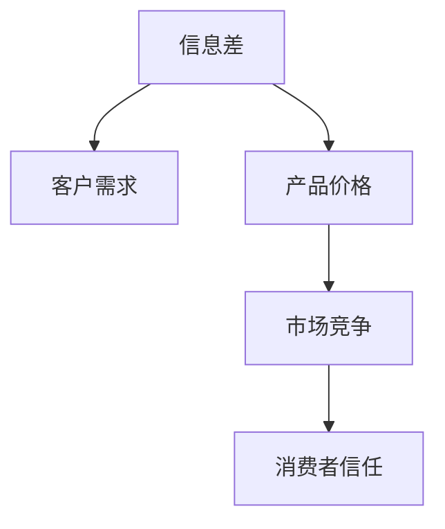

                 

# 信息差：信息不对称与客户需求

## 1. 背景介绍

在现代社会，信息流通的速度和范围日益扩大，信息差（Information Asymmetry），即信息不对称，成为了影响客户需求的重要因素。商家和客户在商品和服务提供、价格定位、市场竞争等方面存在信息不对称，这直接影响了消费者的购买决策。

## 2. 核心概念与联系

### 2.1 核心概念概述

为更好地理解信息差与客户需求之间的关系，本节将介绍几个密切相关的核心概念：

- **信息差（Information Asymmetry）**：指交易双方所掌握的信息存在差异。一般指商家拥有商品或服务的详细信息，而消费者往往对商品质量、价格等信息缺乏全面了解。

- **客户需求（Customer Demand）**：指客户对商品或服务的真实需求，受其自身偏好、经济状况、认知水平等多方面因素影响。

- **产品价格（Product Price）**：指商家为商品或服务设定的价格。价格定位在信息不对称中扮演重要角色，影响客户购买意愿和行为。

- **市场竞争（Market Competition）**：指不同商家在提供相同或相似商品或服务时的竞争关系。竞争策略常利用信息不对称对消费者施加影响。

- **消费者信任（Consumer Trust）**：指消费者对商品或服务提供者的信任程度。信任感会影响客户对信息的接受度和购买行为。

这些核心概念之间的逻辑关系可以通过以下Mermaid流程图来展示：



### 2.2 核心概念原理和架构

信息差与客户需求的关系主要体现在以下几个方面：

1. **价格感知差异**：不同客户对商品或服务的价值感知不同，导致对价格的敏感程度不同。信息不对称情况下，消费者无法完全了解商品价值，往往依赖商家定价。

2. **质量不确定性**：商品质量信息在买卖双方之间不对称，消费者在购买时常常缺乏足够的质量验证手段。这导致消费者对商品质量的评价可能与实际情况有偏差。

3. **信息获取成本**：获取商品的详细信息需要耗费时间和精力，信息不对称使得消费者获取信息的成本较高，影响购买决策。

4. **信任机制缺失**：缺乏透明的、可信的信息渠道，导致消费者对商家或产品的信任度降低。信任度低时，客户更易受到不实信息的误导。

信息差的产生与客户需求密切相关，如商家可以基于客户需求信息提供更加精准的定价和产品优化，而客户则需要有效获取信息，降低决策风险。

## 3. 核心算法原理 & 具体操作步骤

### 3.1 算法原理概述

在信息差与客户需求的背景下，商家需要精准了解客户需求，以实现更有效的定价和营销策略。基于此，商家可以通过数据分析和机器学习算法对客户需求进行预测和匹配。

核心算法原理如下：

- **数据收集与预处理**：收集客户的历史行为数据（如购买记录、浏览历史、评分等）和特征数据（如年龄、性别、地域等）。
- **需求建模**：利用机器学习算法（如线性回归、逻辑回归、随机森林等）建立客户需求模型，预测客户的购买意向。
- **信息匹配与优化**：根据客户需求模型，匹配合适的商品或服务，并优化价格和促销策略。

### 3.2 算法步骤详解

以下是一个基于机器学习的客户需求预测和匹配流程：

**Step 1: 数据收集与预处理**
- 收集客户历史行为数据和特征数据，如购买记录、评分、浏览时长、商品分类等。
- 数据清洗和预处理，包括缺失值填充、异常值处理、特征归一化等。

**Step 2: 需求建模**
- 选择合适的机器学习算法，如决策树、随机森林、神经网络等。
- 利用历史数据训练模型，预测客户在未来是否会购买某个商品。

**Step 3: 信息匹配与优化**
- 根据需求模型，匹配客户最可能感兴趣的商品或服务。
- 通过价格调整、促销活动等方式，优化营销策略，提升客户购买意愿。

### 3.3 算法优缺点

基于机器学习的客户需求预测和匹配算法具有以下优点：
1. **精准预测**：通过大量历史数据训练模型，能够较为准确地预测客户需求。
2. **灵活调整**：能够根据客户反馈实时调整匹配策略，提高匹配效果。
3. **广泛适用**：适用于各种电商平台和线下零售场景。

同时，该算法也存在一定的局限性：
1. **数据依赖性高**：对数据质量和数量的要求较高，数据不足或噪声过多可能导致预测效果不佳。
2. **过拟合风险**：模型过度依赖训练数据，可能对新客户或新商品预测效果差。
3. **计算复杂度高**：训练和预测过程计算资源消耗较大，需要较高的计算能力。

### 3.4 算法应用领域

基于机器学习的客户需求预测和匹配算法在多个领域得到了应用：

- **电商推荐系统**：通过预测用户需求，推荐商品或服务，提升用户购买转化率。
- **智能客服系统**：基于用户查询意图预测，提供个性化服务，减少人工客服成本。
- **营销活动优化**：通过客户需求分析，优化广告投放策略和促销活动效果。
- **库存管理**：预测库存需求，避免过剩或缺货，提高库存管理效率。

## 4. 数学模型和公式 & 详细讲解

### 4.1 数学模型构建

我们以电商推荐系统为例，构建一个基于逻辑回归的客户需求预测模型。假设客户需求模型为 $y=f(x)$，其中 $y$ 表示客户是否会购买商品（1表示会购买，0表示不会购买），$x$ 表示客户的特征向量。

定义逻辑回归模型：

$$
\log \frac{P(y=1|x)}{P(y=0|x)} = \theta_0 + \theta_1 x_1 + \theta_2 x_2 + \cdots + \theta_n x_n
$$

其中 $\theta_0,\theta_1,\theta_2,\cdots,\theta_n$ 为模型参数，$x_1,x_2,\cdots,x_n$ 为特征变量。

### 4.2 公式推导过程

将上述公式化简为：

$$
\log \frac{P(y=1|x)}{1-P(y=1|x)} = \theta_0 + \theta_1 x_1 + \theta_2 x_2 + \cdots + \theta_n x_n
$$

进一步推导得：

$$
\frac{P(y=1|x)}{1-P(y=1|x)} = e^{\theta_0 + \theta_1 x_1 + \theta_2 x_2 + \cdots + \theta_n x_n}
$$

使用sigmoid函数将概率映射到 [0,1] 区间：

$$
y = \sigma(\theta_0 + \theta_1 x_1 + \theta_2 x_2 + \cdots + \theta_n x_n)
$$

其中 $\sigma(z) = \frac{1}{1+e^{-z}}$ 为sigmoid函数。

通过最小化损失函数：

$$
\mathcal{L} = -\frac{1}{N} \sum_{i=1}^N [y_i \log P(y_i|x_i) + (1-y_i) \log(1-P(y_i|x_i))]
$$

使用梯度下降法优化模型参数 $\theta$。

### 4.3 案例分析与讲解

以电商平台为例，利用已有的用户行为数据，训练模型预测用户是否会购买某件商品。

假设已知用户 $i$ 是否购买商品 $j$ 的特征包括：年龄、性别、浏览时间、评价等。训练集包含 $M$ 个样本，每个样本包含 $n$ 个特征 $x_1, x_2, \cdots, x_n$ 和一个标签 $y$。

将特征标准化，计算出训练集均值 $\mu$ 和方差 $\sigma^2$。

$$
x_i = \frac{x_i - \mu}{\sigma}
$$

建立逻辑回归模型，并使用梯度下降法进行参数优化：

$$
\theta = \arg\min_{\theta} \mathcal{L}(\theta) = -\frac{1}{N} \sum_{i=1}^M [y_i \log P(y_i|x_i) + (1-y_i) \log(1-P(y_i|x_i))]
$$

其中 $P(y_i|x_i) = \sigma(\theta_0 + \theta_1 x_{i,1} + \theta_2 x_{i,2} + \cdots + \theta_n x_{i,n})$。

## 5. 项目实践：代码实例和详细解释说明

### 5.1 开发环境搭建

在进行客户需求预测和匹配的实践前，我们需要准备好开发环境。以下是使用Python进行Scikit-learn开发的Python环境配置流程：

1. 安装Anaconda：从官网下载并安装Anaconda，用于创建独立的Python环境。

2. 创建并激活虚拟环境：
```bash
conda create -n sklearn-env python=3.8 
conda activate sklearn-env
```

3. 安装Scikit-learn：
```bash
conda install scikit-learn
```

4. 安装各类工具包：
```bash
pip install numpy pandas scikit-learn matplotlib tqdm jupyter notebook ipython
```

完成上述步骤后，即可在`sklearn-env`环境中开始项目实践。

### 5.2 源代码详细实现

以下是基于Scikit-learn库对客户需求进行预测的Python代码实现。

```python
import pandas as pd
import numpy as np
from sklearn.model_selection import train_test_split
from sklearn.linear_model import LogisticRegression
from sklearn.preprocessing import StandardScaler
from sklearn.metrics import accuracy_score

# 读取数据
data = pd.read_csv('customer_data.csv')

# 数据预处理
features = ['age', 'gender', 'browsing_time', 'rating']
X = data[features]
y = data['purchase']

# 标准化特征
scaler = StandardScaler()
X_scaled = scaler.fit_transform(X)

# 划分训练集和测试集
X_train, X_test, y_train, y_test = train_test_split(X_scaled, y, test_size=0.2, random_state=42)

# 建立逻辑回归模型
model = LogisticRegression()

# 训练模型
model.fit(X_train, y_train)

# 评估模型
y_pred = model.predict(X_test)
accuracy = accuracy_score(y_test, y_pred)
print(f'Accuracy: {accuracy:.2f}')
```

### 5.3 代码解读与分析

让我们再详细解读一下关键代码的实现细节：

**数据预处理**：
- 从CSV文件中读取用户行为数据。
- 提取用户特征，包括年龄、性别、浏览时间、评分等。
- 对特征进行标准化处理，使用StandardScaler类实现。

**模型训练**：
- 使用train_test_split方法划分训练集和测试集。
- 构建LogisticRegression模型。
- 通过fit方法对模型进行训练，使用训练集进行参数优化。

**模型评估**：
- 使用predict方法对测试集进行预测。
- 通过accuracy_score计算模型准确率。
- 输出模型评估结果。

**注意事项**：
- 在实际应用中，可能需要对特征进行更多的预处理，如缺失值填充、异常值处理等。
- 特征工程对模型效果影响显著，需要根据具体任务和数据特点进行优化。

## 6. 实际应用场景

### 6.1 电商推荐系统

基于机器学习的客户需求预测和匹配算法，可以广泛应用于电商推荐系统中。传统推荐系统依赖单一的协同过滤算法，难以全面考虑用户需求和商品属性。而基于客户需求的推荐系统能够更精准地匹配商品和用户，提高用户满意度。

在技术实现上，可以收集用户的历史购买记录、浏览历史和评分信息，构建客户需求模型，根据模型预测用户对不同商品的需求程度，从而生成个性化推荐列表。

### 6.2 智能客服系统

基于客户需求的智能客服系统，能够更智能地处理用户查询，提供个性化服务。利用机器学习算法对用户问题进行意图分类，预测用户需求，从而自动生成回答，减少人工客服的负担。

具体实现上，可以收集用户的历史查询记录和回答记录，训练模型进行意图分类。在用户输入问题时，预测用户意图，生成对应的回答。

### 6.3 营销活动优化

营销活动优化中，通过客户需求预测，可以更精准地定位目标用户，设计更具吸引力的促销策略。利用历史数据训练模型，预测不同用户对促销活动的响应程度，从而优化广告投放和促销活动安排。

## 7. 工具和资源推荐

### 7.1 学习资源推荐

为了帮助开发者系统掌握客户需求预测和匹配的理论基础和实践技巧，这里推荐一些优质的学习资源：

1. 《Python机器学习》书籍：由机器学习专家Sebastian Raschka所著，详细介绍了机器学习算法的实现和应用，包括逻辑回归、决策树等经典模型。
2. 《深度学习》课程：由斯坦福大学Andrew Ng主讲，介绍深度学习的基础和应用，涵盖神经网络、卷积神经网络、循环神经网络等。
3. Coursera《数据科学与机器学习》课程：由Johns Hopkins University提供，涵盖数据科学和机器学习的基本概念和实践技能。
4. Kaggle平台：提供丰富的数据集和比赛，可以实践机器学习算法，了解实际问题。

通过这些资源的学习实践，相信你一定能够快速掌握客户需求预测和匹配的精髓，并用于解决实际的商业问题。

### 7.2 开发工具推荐

高效的开发离不开优秀的工具支持。以下是几款用于客户需求预测和匹配开发的常用工具：

1. Python编程语言：简洁、易学易用，广泛应用于机器学习和数据科学领域。
2. Scikit-learn库：Python中最流行的机器学习库，提供了多种常用算法和工具，如逻辑回归、随机森林、梯度下降等。
3. TensorFlow和PyTorch：深度学习领域的两大主流框架，支持高效的神经网络实现和训练。
4. Jupyter Notebook：交互式编程环境，方便数据处理和模型训练。
5. Matplotlib和Seaborn：数据可视化工具，便于结果展示和分析。

合理利用这些工具，可以显著提升客户需求预测和匹配任务的开发效率，加快创新迭代的步伐。

### 7.3 相关论文推荐

客户需求预测和匹配技术的发展源于学界的持续研究。以下是几篇奠基性的相关论文，推荐阅读：

1. "Customer Demand Prediction using Logistic Regression"（逻辑回归用于客户需求预测）：详细介绍了基于逻辑回归的客户需求预测算法。
2. "A Multi-Channel Recommendation System for E-commerce"（电商平台多渠道推荐系统）：提出了基于多种推荐算法和数据源的电商推荐系统。
3. "Intelligent Customer Service via Natural Language Processing"（基于自然语言处理的智能客服）：探讨了利用自然语言处理技术实现智能客服的方法。
4. "Adaptive Marketing Strategies via Customer Demand Analysis"（基于客户需求分析的适应性营销策略）：提出了基于客户需求分析的个性化营销策略。

这些论文代表了大客户需求预测和匹配技术的发展脉络。通过学习这些前沿成果，可以帮助研究者把握学科前进方向，激发更多的创新灵感。

## 8. 总结：未来发展趋势与挑战

### 8.1 总结

本文对基于机器学习的客户需求预测和匹配方法进行了全面系统的介绍。首先阐述了信息差与客户需求的关系，明确了客户需求预测和匹配在提升商业价值中的重要作用。其次，从原理到实践，详细讲解了机器学习算法的实现步骤，给出了客户需求预测和匹配的完整代码实例。同时，本文还探讨了该方法在电商推荐、智能客服、营销优化等多个场景中的应用前景，展示了机器学习技术在实际商业问题中的巨大潜力。最后，本文精选了客户需求预测和匹配技术的各类学习资源，力求为读者提供全方位的技术指引。

通过本文的系统梳理，可以看到，客户需求预测和匹配技术已经成为提升商业决策质量、增强用户体验的关键手段。机器学习技术在数据驱动的商业决策中扮演了重要角色，极大地拓展了企业运营的智能化水平。未来，伴随数据科学的不断发展，客户需求预测和匹配技术必将更加成熟和实用，进一步推动商业智能的升级和转型。

### 8.2 未来发展趋势

展望未来，客户需求预测和匹配技术将呈现以下几个发展趋势：

1. **模型集成与融合**：未来将出现更多集成化的模型，通过融合不同算法和数据源，提升预测准确性和泛化能力。
2. **深度学习与强化学习结合**：深度学习模型结合强化学习，能够更加动态地适应客户需求变化，优化推荐和营销策略。
3. **多模态数据融合**：未来将更加注重多模态数据（如文本、图像、语音等）的融合，提高客户需求预测的全面性和准确性。
4. **实时化与个性化**：客户需求预测将更加注重实时化和个性化，通过实时数据反馈优化预测模型，实现个性化推荐。
5. **隐私保护与合规性**：随着数据隐私保护法规的加强，客户需求预测将更加注重数据隐私和安全。
6. **跨领域应用扩展**：客户需求预测将扩展到更多领域，如医疗、金融、物流等，推动跨领域智能化应用。

这些趋势凸显了客户需求预测和匹配技术的广阔前景。这些方向的探索发展，必将进一步提升预测和匹配的效果，为商业决策提供更可靠的支持。

### 8.3 面临的挑战

尽管客户需求预测和匹配技术已经取得了瞩目成就，但在迈向更加智能化、普适化应用的过程中，它仍面临着诸多挑战：

1. **数据质量和数量**：数据质量和数量不足可能导致预测效果差，未来需要更加精细化的数据获取和处理。
2. **模型复杂性**：深度学习模型复杂度高，训练和推理资源消耗大，需要高效的优化算法和硬件支持。
3. **算法透明性与可解释性**：机器学习模型通常被视为“黑盒”系统，难以解释其决策过程，需要提升算法的透明性和可解释性。
4. **跨领域适应性**：不同领域的客户需求预测模型难以通用，需要针对不同领域进行定制化开发。
5. **用户隐私保护**：客户需求预测需要收集大量用户数据，如何保护用户隐私是一个重要问题。
6. **人机协同**：未来需要更多地结合人工干预和用户反馈，优化推荐和营销策略。

这些挑战需要我们在技术、工程、伦理等多个维度进行综合优化，才能充分发挥客户需求预测和匹配技术的优势。

### 8.4 研究展望

面对客户需求预测和匹配技术面临的挑战，未来的研究需要在以下几个方面寻求新的突破：

1. **增强模型可解释性**：开发可解释性更高的算法，如LIME、SHAP等，提升模型的透明性和可信度。
2. **多模态数据融合**：利用多模态数据提升预测准确性，如文本、图像、语音等，拓展预测模型的应用边界。
3. **实时化与个性化**：结合实时数据反馈和个性化推荐策略，提升用户体验和满意度。
4. **隐私保护与数据安全**：采用差分隐私、联邦学习等技术，保护用户隐私，确保数据安全。
5. **跨领域应用拓展**：结合领域知识图谱，开发跨领域需求预测模型，提高模型的通用性和适应性。
6. **用户反馈与反馈循环**：引入用户反馈机制，构建反馈循环，不断优化预测模型和推荐策略。

这些研究方向的探索，必将引领客户需求预测和匹配技术迈向更高的台阶，为商业智能和用户体验带来新的突破。面向未来，客户需求预测和匹配技术还需要与其他人工智能技术进行更深入的融合，如知识表示、因果推理、强化学习等，多路径协同发力，共同推动自然语言理解和智能交互系统的进步。只有勇于创新、敢于突破，才能不断拓展客户需求预测和匹配的边界，让智能技术更好地服务于商业和用户。

## 9. 附录：常见问题与解答

**Q1：客户需求预测和匹配算法是否适用于所有客户群体？**

A: 客户需求预测和匹配算法在大多数客户群体上都能取得不错的效果，特别是对有大量历史数据和稳定行为模式的客户。但对于新客户或低频客户，数据量和行为模式的稳定性可能不足，导致预测效果差。

**Q2：如何缓解客户需求预测中的过拟合问题？**

A: 过拟合是客户需求预测中的常见问题，尤其是在训练数据有限的情况下。缓解过拟合的方法包括：
1. 数据增强：通过数据扩充、样本重采样等方式增加训练数据量。
2. 正则化：使用L1、L2正则化等方法，抑制模型复杂度。
3. 模型集成：使用集成学习，如Bagging、Boosting等，提升模型的泛化能力。
4. 交叉验证：通过交叉验证方法，评估模型的泛化性能，选择最优模型。

**Q3：客户需求预测和匹配算法在实际应用中需要注意哪些问题？**

A: 将客户需求预测和匹配算法转化为实际应用，还需要考虑以下问题：
1. 算法部署：选择合适的算法部署方式，如云计算、边缘计算等，确保服务稳定性和低延迟。
2. 用户隐私：确保数据收集和处理符合隐私保护法规，保护用户隐私。
3. 数据质量：定期维护和更新数据集，确保数据质量和时间代表性。
4. 用户反馈：引入用户反馈机制，不断优化预测模型和推荐策略。
5. 技术支持：提供技术支持和用户培训，帮助用户理解和应用预测结果。

客户需求预测和匹配技术虽然面临挑战，但在技术进步和实际应用中不断优化和改进，必将在商业决策和用户服务中发挥更大作用。相信随着技术的不断成熟和普及，客户需求预测和匹配技术将成为智能商业的重要工具。

