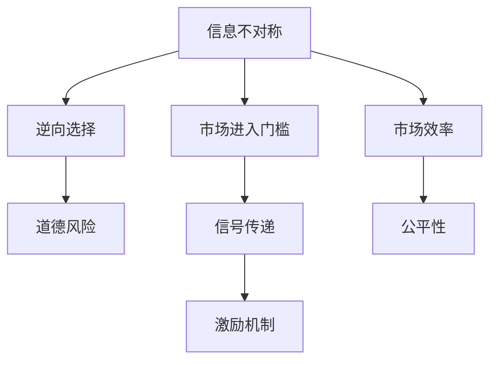

                 

# 信息差：信息不对称与市场进入门槛

信息差，即信息不对称，是指信息在信息提供者和信息接收者之间存在差异，导致市场参与者难以获得全面的市场信息。这种信息不对称现象，在不同领域、不同层面上，对市场行为和经济效率产生深远影响，特别是在市场中存在进入门槛的情况下。本文旨在探讨信息差与市场进入门槛之间的关系，揭示其对市场效率和公平性的影响，并提出相应的解决策略。

## 1. 背景介绍

信息不对称是经济学中研究市场行为的重要概念，通常在买卖双方信息不对等的情况下产生。在市场交易中，卖家通常比买家掌握更多的产品信息，这种信息不对称会导致逆向选择和道德风险问题。例如，二手车的卖家通常知道车辆的真实状况，但买家很难准确判断，导致买家支付过高或过低的交易价格。

市场进入门槛是另一个重要的经济概念，它指出了新企业进入市场的障碍。较高的市场进入门槛会限制竞争，影响市场效率和公平性。例如，专利保护、许可证要求、品牌忠诚度等都是常见的市场进入门槛。

信息差与市场进入门槛相互交织，共同影响市场行为和资源配置。信息不对称会导致新企业难以进入市场，进一步加剧市场垄断和不公平现象。同时，市场进入门槛也会增加新企业获取信息、展示自身能力的难度，形成恶性循环。

## 2. 核心概念与联系

### 2.1 核心概念概述

- **信息不对称（Information Asymmetry）**：指交易双方对交易信息掌握的不平衡，导致信息占优的一方可以利用信息优势获得利益。
- **市场进入门槛（Market Entry Barriers）**：指新企业进入市场时面临的各类障碍，包括经济、政策、技术等限制。
- **逆向选择（Adverse Selection）**：指信息不对称导致市场参与者选择不利交易的风险。
- **道德风险（Moral Hazard）**：指市场参与者在获得信息优势后，采取不利于对方利益的行为。
- **信号传递（Signaling）**：指信息不对称条件下，企业通过信息传递来降低信息差，提高市场信任。
- **激励机制（Incentive Mechanism）**：指通过设计合理的激励措施，促使市场参与者发出真实信号，减少信息不对称带来的不利影响。

### 2.2 核心概念原理和架构的 Mermaid 流程图



### 2.3 核心概念之间的关系

信息不对称、市场进入门槛、逆向选择、道德风险、信号传递、激励机制之间的关系可以概括如下：

- **信息不对称**导致**逆向选择**和**道德风险**，影响市场效率和公平性。
- **市场进入门槛**增加了企业获取信息和展示自身能力的难度，加剧信息不对称。
- **信号传递**和**激励机制**是缓解信息不对称和市场进入门槛的常用方法，通过这些机制，市场参与者可以更好地传递真实信息，促使其他参与者采取有利行为。

## 3. 核心算法原理 & 具体操作步骤

### 3.1 算法原理概述

缓解信息不对称和市场进入门槛的影响，需要设计合理的信号传递和激励机制。本文主要介绍两种常见的机制：

1. **信号传递机制（Signaling Mechanism）**：通过某种信号（如信誉、证明等）传递真实信息，减少信息不对称。
2. **激励机制（Incentive Mechanism）**：设计合理的激励措施，促使市场参与者发出真实信号。

### 3.2 算法步骤详解

**步骤1：定义信号传递模型**

假设市场上有两类企业，其中一类是高成本企业（低质量），另一类是低成本企业（高质量）。高成本企业难以通过价格低廉等方式吸引消费者，因此需要设计有效的信号传递机制。

**步骤2：设计信号传递策略**

信号传递策略应具备如下特征：
- 信号传递成本应低于低成本企业的生产成本。
- 信号传递成本应高于低成本企业的平均成本，以区分企业类型。
- 信号传递应能够被消费者识别，且与企业质量正相关。

**步骤3：评估信号传递效果**

评估信号传递效果的关键在于信号识别率和信号误报率。信号识别率越高，信号传递机制越有效。

**步骤4：设计激励机制**

激励机制应具备以下特征：
- 激励措施应能够促使市场参与者发出真实信号。
- 激励措施应公平透明，确保参与者都有同等机会。
- 激励措施应与市场效率和公平性相协调。

**步骤5：实施并评估激励机制**

在实施激励机制后，评估其效果，根据反馈进行调整，确保机制的有效性。

### 3.3 算法优缺点

信号传递机制和激励机制的优点在于能够降低信息不对称，提高市场效率和公平性。其缺点在于设计难度较大，成本较高，且效果可能受外部环境影响。

### 3.4 算法应用领域

信息差与市场进入门槛的问题广泛存在于金融、保险、医疗、就业等多个领域。例如：

- **金融行业**：贷款申请中的逆向选择问题，银行需要通过信号传递和激励机制来筛选优质客户。
- **保险行业**：健康保险中的道德风险问题，保险公司需设计合理的激励机制，促使投保人报告真实健康状况。
- **医疗行业**：医生与患者之间的信息不对称问题，医院需设计合理的激励机制，确保医疗服务质量。
- **就业市场**：企业招聘中的逆向选择问题，企业需设计信号传递机制，吸引高素质人才。

## 4. 数学模型和公式 & 详细讲解

### 4.1 数学模型构建

假设市场上有两类企业，高成本企业（低质量）的固定成本为 $C_1$，低成本企业（高质量）的固定成本为 $C_2$。市场价格为 $P$，高成本企业的平均成本为 $A_1$，低成本企业的平均成本为 $A_2$。企业面临的消费者数量为 $N$，信号传递成本为 $S$。

企业的信号传递策略为，高成本企业支付 $S$，低成本企业不支付。信号识别成本为 $C$，识别率为 $r$。

企业的激励机制为，高成本企业获得 $B$ 的激励，低成本企业获得 $B$ 的激励。

### 4.2 公式推导过程

企业的高质量（低成本）和低质量（高成本）的期望利润分别为：

$$
\pi_H = P \cdot N \cdot r \cdot B - S - C
$$

$$
\pi_L = P \cdot N \cdot r \cdot B - C
$$

企业的期望利润为：

$$
\pi = \pi_H \cdot P(H) + \pi_L \cdot P(L) = (P \cdot N \cdot r \cdot B - S - C) \cdot P(H) + (P \cdot N \cdot r \cdot B - C) \cdot P(L)
$$

其中 $P(H)$ 和 $P(L)$ 分别为高成本企业和低成本企业的概率，根据市场价格 $P$ 和成本 $A_1$、$A_2$ 求解。

### 4.3 案例分析与讲解

以医疗行业为例，医生与患者之间的信息不对称会导致医生过度医疗。为了缓解这一问题，可以设计信号传递和激励机制，如使用医疗记录、医疗保险等手段。

- **信号传递**：医生记录详细的医疗记录，并在保险单上标明，患者可以根据医疗记录选择医生。
- **激励机制**：保险公司设计合理的激励措施，如给予低成本（高质量）医生更高的赔偿比例。

通过信号传递和激励机制，可以有效降低信息不对称，提高医疗服务质量。

## 5. 项目实践：代码实例和详细解释说明

### 5.1 开发环境搭建

在Python环境中搭建开发环境，安装所需的库：

```python
pip install numpy scipy sympy pandas matplotlib
```

### 5.2 源代码详细实现

以金融贷款为例，使用信号传递机制设计贷款审批流程：

```python
import numpy as np

def signal_propagation(cost1, cost2, price, a1, a2, sig_cost, recog_cost, b):
    # 计算高成本企业和低成本企业的概率
    p_h = cost2 / (cost2 + cost1)
    p_l = cost1 / (cost2 + cost1)
    
    # 计算企业利润
    pi_h = price * recog_cost * b - sig_cost - cost1
    pi_l = price * recog_cost * b - cost1
    
    # 计算市场均衡价格
    eq_price = (p_h * pi_h + p_l * pi_l) / (p_h + p_l)
    
    return eq_price

# 定义参数
cost1 = 100  # 高成本企业的固定成本
cost2 = 50  # 低成本企业的固定成本
price = 100  # 市场价格
a1 = 90  # 高成本企业的平均成本
a2 = 70  # 低成本企业的平均成本
sig_cost = 20  # 信号传递成本
recog_cost = 0.9  # 信号识别率
b = 5  # 激励措施

# 调用函数计算市场均衡价格
eq_price = signal_propagation(cost1, cost2, price, a1, a2, sig_cost, recog_cost, b)
print("市场均衡价格为:", eq_price)
```

### 5.3 代码解读与分析

该代码实现了一个简单的信号传递机制，通过信号传递成本和激励措施，计算市场均衡价格。代码逻辑如下：

1. 定义高成本企业和低成本企业的固定成本、平均成本、市场价格等参数。
2. 根据市场价格和成本，计算高成本企业和低成本企业的概率。
3. 根据信号传递成本和激励措施，计算企业利润。
4. 通过企业利润和概率，计算市场均衡价格。

## 6. 实际应用场景

### 6.1 金融行业

在金融行业中，贷款申请中的逆向选择问题广泛存在。通过设计合理的信号传递和激励机制，可以有效降低信息不对称，提高贷款审批效率和质量。例如：

- **信号传递机制**：银行可以通过信用评分系统、抵押品评估等方式传递企业信用信息。
- **激励机制**：银行可以设计合理的激励措施，如低利率贷款、担保措施等，吸引优质企业申请贷款。

### 6.2 保险行业

保险行业中，健康保险和车险中的道德风险问题尤为突出。保险公司需通过信号传递和激励机制，减少道德风险，提高保险质量。例如：

- **信号传递机制**：保险公司可以要求申请人提供健康检查报告、车辆检测报告等，传递真实健康和车辆状况。
- **激励机制**：保险公司可以设计合理的激励措施，如提供保险优惠、限制理赔金额等，促使申请人如实报告信息。

### 6.3 医疗行业

医疗行业中的信息不对称问题严重影响了医疗服务质量。医院和医生需通过信号传递和激励机制，缓解这一问题。例如：

- **信号传递机制**：医院可以记录详细病例记录，并在患者查询时提供，传递医生诊疗信息。
- **激励机制**：医院可以设计合理的激励措施，如给予高素质医生更高的诊疗费、优秀医生评选等，激励医生提供高质量服务。

### 6.4 未来应用展望

随着信息技术的发展，信号传递和激励机制的实现成本将进一步降低，应用范围将更广泛。未来，信息差与市场进入门槛的问题将得到更大程度的缓解。例如：

- **智能合约**：通过区块链技术，智能合约可以自动执行信号传递和激励机制，提高效率和透明度。
- **大数据分析**：通过大数据分析，可以更准确地识别信号传递和激励措施的效果，及时调整策略。
- **人工智能**：通过人工智能技术，可以自动化设计信号传递和激励机制，提高效果和公平性。

## 7. 工具和资源推荐

### 7.1 学习资源推荐

- **《博弈论与信息经济学》**：清华大学出版社，详细介绍了信号传递和激励机制的数学模型和应用案例。
- **《信号传递与信息经济学》**：中国人民大学出版社，系统讲解了信息不对称对市场效率的影响和缓解方法。
- **Coursera上的《经济学原理》课程**：由耶鲁大学教授设计，介绍信息不对称和市场效率的经济学原理。

### 7.2 开发工具推荐

- **Python**：Python是信息传递和激励机制设计的首选语言，具备强大的数学计算和数据处理能力。
- **MATLAB**：MATLAB是信号传递和激励机制设计和分析的常用工具，具备强大的数学建模和仿真能力。
- **R语言**：R语言在统计分析和数据可视化方面具有优势，适合进行大数据分析和信息传递效果评估。

### 7.3 相关论文推荐

- **《信号传递与激励机制：理论、实践与挑战》**：国外期刊《Journal of Economic Behavior and Organization》，深入探讨了信号传递和激励机制的理论和应用。
- **《大数据技术在信号传递和激励机制中的应用》**：国内期刊《大数据时代》，介绍大数据技术在信息传递和激励机制设计中的应用案例。
- **《人工智能与激励机制》**：国外期刊《Journal of Artificial Intelligence Research》，讨论人工智能技术在设计激励机制中的潜力。

## 8. 总结：未来发展趋势与挑战

### 8.1 研究成果总结

本文系统介绍了信息不对称与市场进入门槛的问题，探讨了信号传递和激励机制的应用。通过数学模型和案例分析，揭示了信息不对称对市场效率和公平性的影响，提出了缓解方法。

### 8.2 未来发展趋势

未来，信息不对称和市场进入门槛的问题将得到更大程度的缓解，市场效率和公平性将进一步提升。具体趋势如下：

- **智能化和自动化**：随着人工智能和大数据技术的发展，信号传递和激励机制将更加智能化和自动化，提高效率和公平性。
- **透明化和可操作化**：通过区块链和智能合约技术，信号传递和激励机制将更加透明化和可操作化，减少人为干预和操作风险。
- **全球化和本地化**：随着全球化进程的加快，信号传递和激励机制将更多地考虑全球化和本地化的平衡，适应不同市场的特点。

### 8.3 面临的挑战

尽管信息不对称和市场进入门槛的问题得到了缓解，但仍面临以下挑战：

- **数据隐私和安全**：信号传递和激励机制的设计和应用需要大量数据，如何保护数据隐私和安全是重大挑战。
- **技术复杂性**：信号传递和激励机制的设计需要复杂的数学模型和算法，对技术要求较高，需要更多研究和实践。
- **伦理和法律问题**：信号传递和激励机制的应用可能带来伦理和法律问题，如数据滥用、隐私泄露等，需要制定相应的规范和政策。

### 8.4 研究展望

未来的研究需要在以下几个方面寻求新的突破：

- **多层次信号传递机制**：设计多层次、多维度的信号传递机制，适应不同市场环境，提高效果和公平性。
- **多模态激励机制**：结合金融、保险、医疗等多个领域的激励机制，设计更加综合和多模态的激励措施，缓解信息不对称问题。
- **跨学科研究**：加强经济学、统计学、计算机科学等多个学科的交叉研究，推动信号传递和激励机制的创新和应用。

## 9. 附录：常见问题与解答

**Q1：信号传递机制和激励机制的实际应用有哪些？**

A: 信号传递机制和激励机制在金融、保险、医疗、就业等多个领域都有实际应用。例如，银行通过信用评分系统传递企业信用信息，保险公司通过健康检查报告传递真实健康状况，医院通过详细病例记录传递医生诊疗信息。

**Q2：设计信号传递机制和激励机制时，如何平衡成本和效果？**

A: 设计信号传递机制和激励机制时，需要综合考虑成本和效果。一般而言，信号传递成本应低于低成本企业的生产成本，但高于低成本企业的平均成本，以区分企业类型。同时，激励措施应设计合理，促使市场参与者发出真实信号，减少信息不对称带来的不利影响。

**Q3：信号传递机制和激励机制的实施效果如何评估？**

A: 信号传递机制和激励机制的实施效果可以通过多种方式评估。例如，金融行业中可以通过贷款违约率来评估信号传递机制的效果，保险行业中可以通过理赔率和赔付金额来评估激励机制的效果，医疗行业中可以通过患者满意度来评估信号传递机制的效果。

**Q4：信号传递机制和激励机制设计中，如何处理数据隐私和安全问题？**

A: 信号传递机制和激励机制设计中，数据隐私和安全问题尤为重要。可以通过加密技术、匿名化处理、数据隔离等方式来保护数据隐私和安全。同时，制定相应的法律规范和政策，确保数据使用的合法性和合规性。

**Q5：信号传递机制和激励机制的实施过程中，如何应对技术复杂性问题？**

A: 信号传递机制和激励机制的设计和实施需要复杂的数学模型和算法，技术要求较高。可以通过团队协作、跨学科合作、技术培训等方式来应对技术复杂性问题，确保机制的有效性和公平性。

