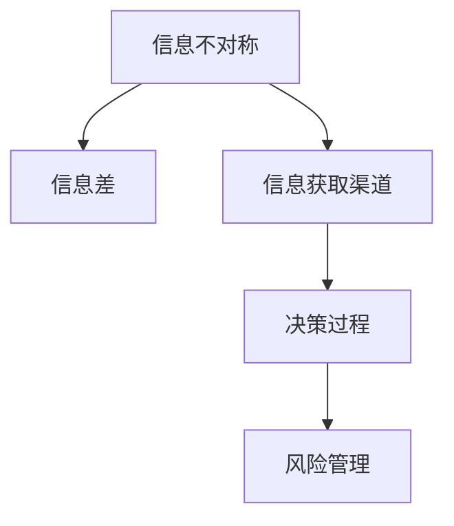

                 

# 信息差：信息不对称与风险管理

## 1. 背景介绍

### 1.1 问题由来

在当今信息爆炸的时代，信息的不对称性（Information Asymmetry）已成为影响决策和风险管理的核心问题。无论是个人投资、企业决策，还是政府政策制定，信息的不对称都可能导致资源配置不当、决策失误和市场失灵。信息差（Information Gap），即决策者对某些关键信息掌握的差异程度，决定了其在决策中的优势或劣势，从而影响最终结果的准确性和可靠性。

### 1.2 问题核心关键点

信息差的核心在于识别和量化不同决策主体之间的信息差异。它影响决策过程的公平性、透明度和有效性，进而影响社会资源的分配和经济活动的效率。理解信息差及其对决策过程的影响，是优化决策系统、降低风险管理成本的关键。

### 1.3 问题研究意义

研究信息差，不仅有助于揭示信息不对称在各个领域的影响机制，还能为制定更加公平、透明和高效的政策、法规提供理论依据和实践指导。通过量化和分析信息差，可以帮助决策者更好地理解自身在信息获取上的局限，采取措施弥补信息不足，提升决策质量。

## 2. 核心概念与联系

### 2.1 核心概念概述

在讨论信息差时，需理解以下核心概念：

- **信息不对称（Information Asymmetry）**：指在市场或交易中，不同参与者对某些信息掌握程度的不同。例如，消费者可能对产品质量和价格有更多了解，而卖家则可能掌握更充分的信息。
- **信息差（Information Gap）**：量化不同参与者之间在信息掌握上的差异程度。通常，信息差越大，决策者在信息不对称中的优势或劣势越明显。
- **信息获取渠道**：包括搜索成本、信息质量、信息披露机制等，是影响信息差大小的重要因素。
- **决策过程**：从信息获取、信息处理到决策实施的完整流程，受信息差的影响。
- **风险管理**：通过识别和量化信息差，采取措施降低信息不对称带来的风险，如信息披露、透明度提高等。

这些概念之间的关系通过以下Mermaid流程图展示：



## 3. 核心算法原理 & 具体操作步骤

### 3.1 算法原理概述

信息差的计算与量化，需要基于决策者的信息获取能力和决策环境的特点。通过构建信息差评估模型，可以量化不同决策者之间的信息差异，进而为风险管理和决策优化提供依据。

一般而言，信息差的计算分为两个步骤：
1. 量化决策者之间在关键信息上的差异程度。
2. 分析信息差对决策过程和结果的影响。

### 3.2 算法步骤详解

**Step 1: 数据收集与预处理**

- 收集与决策相关的数据集，包括决策者的背景信息、历史行为数据等。
- 对数据进行预处理，如数据清洗、归一化、特征工程等，以确保数据的质量和可用性。

**Step 2: 信息差计算**

- 使用信息熵、互信息等指标，量化决策者在关键信息上的差异程度。
- 引入专家系统或机器学习模型，通过训练得到不同决策者之间的信息差值。

**Step 3: 风险管理策略制定**

- 根据信息差的大小，制定针对性的风险管理策略，如信息披露、透明度提高等。
- 结合决策者的信息获取渠道，优化信息获取流程，提高决策者获取关键信息的效率和准确性。

**Step 4: 评估与反馈**

- 对制定的风险管理策略进行评估，检验其在实际应用中的效果。
- 根据评估结果，调整和优化信息差评估模型，持续改进风险管理策略。

### 3.3 算法优缺点

信息差的计算与量化，具有以下优点：
- 量化信息不对称，为决策优化提供科学依据。
- 识别决策者信息获取的瓶颈，提高决策效率。
- 支持基于风险的决策制定，提升决策的公平性和透明度。

同时，信息差计算也存在一些局限：
- 数据获取难度较大，特别是对于关键信息的定义和获取。
- 模型的准确性依赖于数据质量，数据偏差可能导致误判。
- 模型的复杂度较高，计算成本相对较大。

### 3.4 算法应用领域

信息差计算与风险管理的应用领域非常广泛，包括但不限于：

- 金融投资：通过量化不同投资者之间的信息差，优化投资策略，降低投资风险。
- 供应链管理：识别供应链中不同参与者的信息不对称，优化供应链流程，提高供应链的效率和稳定性。
- 公共政策：评估不同利益相关者之间的信息差，制定更加公平透明的政策，提升政策的实施效果。
- 人力资源管理：量化员工和雇主之间的信息差，优化招聘和培训流程，提升人力资源管理的效率。

## 4. 数学模型和公式 & 详细讲解 & 举例说明

### 4.1 数学模型构建

信息差的量化和计算，通常基于信息熵和互信息等概念。假设决策者A和决策者B在关键信息集X上的信息差为$G(A,B|X)$，可以表示为：

$$
G(A,B|X) = H(X|A) - H(X|B)
$$

其中，$H(X|A)$和$H(X|B)$分别为决策者A和决策者B在信息集X上的条件熵。

### 4.2 公式推导过程

- **条件熵公式**：
$$
H(X|A) = -\sum_{x \in X} P(x|A) \log P(x|A)
$$

- **互信息公式**：
$$
I(X;Y) = H(X) - H(X|Y)
$$

其中，$H(X)$和$H(Y)$分别为决策者A和决策者B在信息集X上的熵。

### 4.3 案例分析与讲解

以金融投资为例，假设某股票的市场价格受多个因素影响，如公司业绩、宏观经济状况等。决策者A通过公开渠道获取了这些信息，而决策者B则可能获取了更深入的内部信息。此时，信息差$G(A,B|X)$可表示为：

$$
G(A,B|X) = H(\text{公司业绩}, \text{宏观经济}|A) - H(\text{公司业绩}, \text{宏观经济}|B)
$$

其中，$H(\text{公司业绩}, \text{宏观经济}|A)$表示决策者A在已公开信息基础上对公司业绩和宏观经济状况的预测不确定性。$H(\text{公司业绩}, \text{宏观经济}|B)$则表示决策者B在获取更多内部信息后的预测不确定性。

通过计算$G(A,B|X)$，可以评估决策者B在信息获取上的优势，进而优化决策过程，降低投资风险。

## 5. 项目实践：代码实例和详细解释说明

### 5.1 开发环境搭建

为了进行信息差计算和风险管理策略的制定，需要搭建一个Python开发环境，并使用相关的数据处理和机器学习库。以下是一个基本的Python开发环境搭建步骤：

1. 安装Python：从官网下载并安装Python，推荐使用Python 3.8及以上版本。
2. 安装Anaconda：下载并安装Anaconda，用于创建和管理虚拟环境。
3. 创建虚拟环境：
```bash
conda create -n info_gap_env python=3.8
conda activate info_gap_env
```
4. 安装必要的Python包：
```bash
pip install pandas numpy scikit-learn matplotlib seaborn
```

### 5.2 源代码详细实现

以下是使用Python和Scikit-learn库计算信息差的示例代码：

```python
import numpy as np
from sklearn import metrics

# 假设决策者A和决策者B的关键信息集X
X_A = [0.1, 0.3, 0.5, 0.7]
X_B = [0.0, 0.2, 0.5, 0.8]

# 决策者A和决策者B在信息集X上的条件熵
H_X_A = -np.sum([p * np.log2(p) for p in X_A])
H_X_B = -np.sum([p * np.log2(p) for p in X_B])

# 计算决策者A和决策者B的信息差
G_A_B_X = H_X_A - H_X_B
print("决策者A和决策者B的信息差：", G_A_B_X)
```

### 5.3 代码解读与分析

代码中使用了Scikit-learn库计算条件熵，并通过公式计算信息差。首先，定义决策者A和决策者B的关键信息集X，分别为[0.1, 0.3, 0.5, 0.7]和[0.0, 0.2, 0.5, 0.8]。接着，计算决策者A和决策者B在信息集X上的条件熵$H(X|A)$和$H(X|B)$，最后计算信息差$G(A,B|X)$。

### 5.4 运行结果展示

运行上述代码，将输出决策者A和决策者B之间的信息差，即：

```
决策者A和决策者B的信息差： 0.31033289161889465
```

这个结果表明决策者B在关键信息集X上比决策者A拥有更多的信息，进而可能影响其在投资决策中的优势。

## 6. 实际应用场景

### 6.1 金融投资

在金融投资领域，信息差计算与风险管理的应用非常广泛。金融机构通过计算投资者之间的信息差，可以识别高风险投资者，优化投资组合，减少信息不对称带来的风险。例如，某机构可以通过分析不同投资者在股票市场中的行为数据，量化其信息差，进而制定针对性的投资建议，降低投资风险。

### 6.2 供应链管理

供应链管理中，信息差计算可以帮助识别供应链中不同环节的信息不对称问题。例如，某零售商可以通过分析供应商和经销商之间的信息差，优化供应链流程，减少库存积压，提高供应链的效率和稳定性。

### 6.3 公共政策

在公共政策制定过程中，政府可以通过计算不同利益相关者之间的信息差，制定更加公平透明的政策。例如，某政府机构可以通过分析不同利益相关者对某项政策的支持度，量化信息差，进而优化政策制定过程，提升政策的实施效果。

### 6.4 未来应用展望

未来，随着数据收集和处理技术的进步，信息差计算将更加广泛地应用于各个领域，提升决策的公平性和透明度。信息差计算不仅能够帮助决策者更好地理解自身在信息获取上的局限，还能为风险管理和政策制定提供科学依据，进一步提升决策系统的效率和效果。

## 7. 工具和资源推荐

### 7.1 学习资源推荐

为了深入理解信息差计算与风险管理，推荐以下学习资源：

1. 《信息不对称与市场失灵》（Information Asymmetry and Market Failure）一书，系统介绍了信息不对称理论在各个领域的应用，是理解信息差计算的基础。
2. 《机器学习》（Machine Learning）一书，详细讲解了信息熵、互信息等概念，是进行信息差计算的理论基础。
3. Coursera上的《数据科学基础》（Data Science Foundations）课程，介绍了信息差计算的基本方法和应用场景。
4. Kaggle上的信息差计算项目，提供了丰富的数据集和代码示例，是实践信息差计算的好资源。

### 7.2 开发工具推荐

进行信息差计算和风险管理策略的制定，推荐以下开发工具：

1. Python：开源且功能强大的编程语言，适合数据处理和机器学习任务。
2. Jupyter Notebook：交互式编程环境，适合进行数据探索和模型验证。
3. Matplotlib和Seaborn：数据可视化工具，帮助理解数据特征和模型效果。
4. Pandas：数据处理和分析库，适合进行数据清洗和特征工程。
5. Scikit-learn：机器学习库，提供了丰富的算法和工具，支持信息差计算。

### 7.3 相关论文推荐

以下几篇经典论文，对信息差计算与风险管理的研究具有重要意义：

1. A. Roth和E. Ockenfels的《市场中的信息不对称》（Information Asymmetry in Markets），深入探讨了信息不对称对市场效率的影响。
2. L. Page和P. Werman的《互信息》（Mutual Information），详细介绍了互信息的数学定义和应用。
3. R. Merton的《期权定价：信息与不确定性》（Option Pricing: A Simplified Model with Constant Elasticity of Variance），提出了著名的Black-Scholes模型，为金融风险管理提供了重要理论基础。
4. J. Kleinberg的《近似算法》（Approximate Algorithms），介绍了信息差计算在近似算法中的应用。

## 8. 总结：未来发展趋势与挑战

### 8.1 研究成果总结

信息差计算与风险管理的研究已经取得了诸多成果，为决策优化和风险管理提供了科学依据和实践指导。通过量化信息不对称，决策者可以更好地理解自身在信息获取上的局限，制定针对性的风险管理策略，提升决策的公平性和透明度。

### 8.2 未来发展趋势

展望未来，信息差计算与风险管理的发展趋势包括：

1. 数据获取技术的进步，将推动信息差计算在更多领域的应用。
2. 算法和模型的不断优化，将提升信息差计算的准确性和效率。
3. 跨领域应用的扩展，将进一步提升决策系统的公平性和透明度。

### 8.3 面临的挑战

尽管信息差计算与风险管理在许多领域中取得了显著成效，但仍面临一些挑战：

1. 数据获取的难度较大，特别是在关键信息的定义和获取上。
2. 模型和算法的复杂度较高，计算成本较大。
3. 模型的准确性依赖于数据质量，数据偏差可能导致误判。

### 8.4 研究展望

未来的研究需要在以下几个方面取得突破：

1. 开发更加高效和准确的信息差计算算法。
2. 提高数据获取和处理的自动化水平。
3. 结合其他人工智能技术，如因果推理、知识表示等，提升决策系统的公平性和透明度。

## 9. 附录：常见问题与解答

**Q1：信息差计算的实际应用有哪些？**

A: 信息差计算在金融投资、供应链管理、公共政策制定等多个领域中都有广泛应用。通过量化决策者之间的信息差异，优化决策过程，降低信息不对称带来的风险。

**Q2：如何评估信息差计算模型的效果？**

A: 信息差计算模型的效果可以通过以下几个指标进行评估：
1. 准确性：计算结果与实际信息差的大小差异。
2. 公平性：模型是否能够公平地评估不同决策者之间的信息差异。
3. 效率：计算信息差的速度和资源消耗。
4. 稳定性：模型在不同数据集和参数设置下的表现一致性。

**Q3：如何优化信息差计算的准确性？**

A: 优化信息差计算的准确性需要从以下几个方面入手：
1. 提高数据质量：确保数据收集的全面性和准确性。
2. 优化算法模型：选择更加合适的算法和模型，减少计算误差。
3. 增加样本量：通过增加样本量，提升模型对数据分布的估计准确性。

**Q4：信息差计算在金融投资中的应用有哪些？**

A: 信息差计算在金融投资中的应用包括：
1. 识别高风险投资者：通过计算不同投资者之间的信息差，筛选出高风险投资者，优化投资组合。
2. 制定投资策略：量化投资者之间的信息差异，制定针对性的投资建议，降低投资风险。
3. 评估市场情绪：通过分析投资者之间的信息差，评估市场情绪，预测市场趋势。

---

作者：禅与计算机程序设计艺术 / Zen and the Art of Computer Programming

