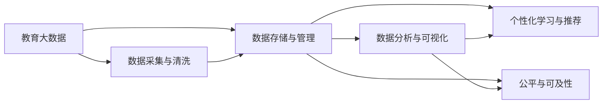

                 

# 信息差：大数据在教育领域的应用

## 1. 背景介绍

### 1.1 问题由来
在信息快速流动的时代，知识和信息已不再是稀缺资源。但为何在教育领域，仍存在显著的信息差？这一现象不仅体现在学生间，也反映在教师教学方法、资源分配等多方面。大数据技术的发展，为缩小信息差提供了新路径，但也带来了新的挑战。本文将探讨大数据在教育领域的应用，特别是如何利用数据驱动决策，提升教育质量和公平性。

### 1.2 问题核心关键点
大数据在教育领域的应用，主要围绕以下几个关键点展开：

- **数据采集与清洗**：教育大数据的采集涉及多个环节，如在线学习平台、学生成绩记录、课程资源等。数据清洗是关键步骤，确保数据质量和可用性。
- **数据存储与管理**：教育数据量大且多样，需高效存储与管理，为后续分析提供基础。
- **数据分析与可视化**：利用统计分析、机器学习等技术，从数据中提取有价值信息，并通过可视化工具直观展示，辅助决策。
- **个性化学习与推荐**：根据学生的学习习惯、兴趣和表现，提供个性化学习路径和资源推荐。
- **公平与可及性**：通过数据驱动的决策，减少教育资源分配不均，提升教育公平性。

### 1.3 问题研究意义
大数据在教育领域的应用，旨在利用数据的力量，实现教育资源的优化配置，提升教育质量和公平性。其意义在于：

1. **个性化教育**：通过分析学生行为数据，提供个性化学习路径和资源推荐，提升学习效率和效果。
2. **教育公平**：利用数据驱动的决策，优化教育资源配置，确保每个学生都能获得公平的教育机会。
3. **教学优化**：教师可以利用大数据分析学生反馈，改进教学方法和课程设计。
4. **政策制定**：政府和教育机构可以利用大数据分析教育趋势，制定科学的教育政策。
5. **学习分析**：通过分析学生学习数据，识别学习障碍和提升空间，促进学生全面发展。

## 2. 核心概念与联系

### 2.1 核心概念概述

为更好地理解大数据在教育领域的应用，本节将介绍几个核心概念及其联系：

- **教育大数据**：指在教育过程中产生和收集的大量结构化与非结构化数据，如学生的学习行为数据、考试成绩、课程资源等。
- **数据驱动决策**：利用大数据分析结果，支持教育决策过程，提升决策的科学性和有效性。
- **个性化学习**：根据学生的个性化需求和学习风格，提供定制化的学习内容和方法。
- **学习分析**：通过分析学生的学习数据，识别学习模式和问题，提供有针对性的支持。
- **教育公平**：确保所有学生获得公平的教育资源和机会，缩小教育差距。

这些概念之间存在紧密联系，共同构成了大数据在教育领域的应用框架。

### 2.2 核心概念原理和架构的 Mermaid 流程图



这个流程图展示了大数据在教育领域的关键流程及其相互联系：

1. 教育大数据采集和清洗后，存入数据库。
2. 通过数据分析和可视化，支持个性化学习路径和资源推荐。
3. 数据驱动的教育决策优化资源分配，提升教育公平性。

## 3. 核心算法原理 & 具体操作步骤

### 3.1 算法原理概述

大数据在教育领域的应用，主要基于数据驱动决策和个性化学习。其核心算法包括：

- **聚类算法**：如K-means、层次聚类等，用于分析学生学习行为，提供个性化推荐。
- **关联规则学习**：如Apriori、FP-Growth等，用于挖掘学生行为数据中的关联规律，改进教学策略。
- **预测模型**：如线性回归、决策树、随机森林等，用于预测学生成绩和行为，指导教育干预。
- **推荐系统**：如协同过滤、矩阵分解等，用于推荐适合学生的学习资源和路径。

### 3.2 算法步骤详解

以下是基于教育大数据的推荐系统构建流程：

**Step 1: 数据准备**
- 收集学生的学习数据，包括在线学习行为、考试成绩、作业提交等。
- 清洗数据，处理缺失值、异常值等，确保数据质量。

**Step 2: 特征工程**
- 提取学生行为特征，如学习时间、课程难度、作业完成情况等。
- 选择和构造合适的特征，用于推荐模型的训练。

**Step 3: 模型训练**
- 选择适合的推荐算法，如协同过滤、矩阵分解等。
- 使用学生行为数据进行模型训练，调整算法参数。

**Step 4: 模型评估**
- 在验证集上评估模型性能，如准确率、召回率、F1分数等。
- 调整模型参数，优化推荐效果。

**Step 5: 应用部署**
- 将训练好的模型集成到学习平台，实时推荐学习资源。
- 持续监测模型效果，定期更新训练数据。

### 3.3 算法优缺点

大数据在教育领域的应用，具有以下优点：

- **个性化推荐**：根据学生行为数据，提供个性化的学习路径和资源，提升学习效率。
- **数据驱动决策**：通过数据分析，优化教育资源配置，提升教育公平性。
- **教学优化**：教师可以利用数据分析结果，改进教学方法和课程设计。

同时，也存在一些局限性：

- **数据隐私**：教育大数据涉及学生隐私，需严格保护。
- **数据质量**：数据采集和清洗环节需细致操作，确保数据准确性。
- **技术门槛**：数据分析和建模需专业知识和技能，对教育工作者要求较高。
- **成本问题**：大规模数据存储和分析需高昂的硬件和软件投入。

### 3.4 算法应用领域

大数据在教育领域的应用，覆盖了多个领域，包括：

- **个性化学习**：如自适应学习平台、个性化推荐系统等。
- **教学分析**：如学习分析工具、教师教学分析系统等。
- **教育评估**：如学生成绩预测模型、教师评价系统等。
- **教育管理**：如学生行为数据分析、课程资源优化等。

这些应用领域展示了大数据在提升教育质量和公平性方面的巨大潜力。

## 4. 数学模型和公式 & 详细讲解 & 举例说明

### 4.1 数学模型构建

以下是一个简单的基于协同过滤的推荐系统数学模型构建过程：

**输入**：学生行为数据 $D=\{(i,j,k,v_i^j)\}$，其中 $i$ 表示学生ID，$j$ 表示学习资源ID，$k$ 表示时间点，$v_i^j$ 表示学生在时间点 $k$ 对资源 $j$ 的评分。

**输出**：推荐结果 $R_i=\{(r_{i,j_1},r_{i,j_2},\dots,r_{i,j_n})\}$，其中 $r_{i,j_k}$ 表示学生 $i$ 对资源 $j_k$ 的评分预测值。

### 4.2 公式推导过程

协同过滤算法基于用户-物品共现矩阵 $V \in \mathbb{R}^{m \times n}$ 进行推荐。设 $V_{ij}=v_{i,j}$，表示学生 $i$ 对资源 $j$ 的评分。推荐公式为：

$$
r_{i,j} = \frac{\sum_{k=1}^{n} V_{ik} \cdot V_{jk}}{\sqrt{\sum_{k=1}^{n} V_{ik}^2} \cdot \sqrt{\sum_{k=1}^{n} V_{jk}^2}}
$$

### 4.3 案例分析与讲解

以下是一个简单的推荐系统案例分析：

**案例背景**：某在线学习平台，收集了100名学生对50门课程的评分数据。

**数据分析**：
- 使用K-means聚类算法，将学生分为5个集群。
- 提取每个集群的学生评分数据，计算集群内学生评分的平均值，作为集群偏好。

**推荐过程**：
- 对于新学生 $i$，使用协同过滤算法，计算其对每个课程的评分预测值。
- 根据预测值，推荐评分高的课程。

通过上述案例，可以看出大数据分析如何帮助平台优化推荐，提升用户体验。

## 5. 项目实践：代码实例和详细解释说明

### 5.1 开发环境搭建

在进行项目实践前，我们需要准备好开发环境。以下是使用Python进行PyTorch开发的环境配置流程：

1. 安装Anaconda：从官网下载并安装Anaconda，用于创建独立的Python环境。

2. 创建并激活虚拟环境：
```bash
conda create -n pytorch-env python=3.8 
conda activate pytorch-env
```

3. 安装PyTorch：根据CUDA版本，从官网获取对应的安装命令。例如：
```bash
conda install pytorch torchvision torchaudio cudatoolkit=11.1 -c pytorch -c conda-forge
```

4. 安装推荐系统库：
```bash
pip install scipy pandas scikit-learn
```

5. 安装数据分析库：
```bash
pip install statsmodels seaborn
```

完成上述步骤后，即可在`pytorch-env`环境中开始项目实践。

### 5.2 源代码详细实现

以下是一个简单的基于协同过滤的推荐系统实现示例：

**代码实现**：

```python
import numpy as np
from scipy.sparse import csr_matrix

# 学生行为数据
D = {
    1: {'A': 4, 'B': 3, 'C': 5},
    2: {'A': 2, 'B': 4, 'C': 3},
    3: {'A': 5, 'B': 2, 'C': 1}
}

# 构建共现矩阵
V = np.array([D[i] for i in D.keys()])
V = csr_matrix(V.T)

# 计算集群偏好
kmeans = KMeans(n_clusters=2, random_state=42)
kmeans.fit(V)
cluster_labels = kmeans.labels_

# 计算推荐结果
R = []
for i in D.keys():
    if cluster_labels[i] == 0:
        V_i = V[:, cluster_labels[i]]
    else:
        V_i = V[:, cluster_labels[i] + 1]
    R.append((V_i * V_i.T) / (V_i.sum() * V_i.T.sum()))

# 输出推荐结果
print(R)
```

**代码解读**：
- 首先收集学生行为数据，构建共现矩阵 $V$。
- 使用K-means聚类算法，将学生分为两个集群。
- 计算每个集群内学生的评分平均值，得到集群偏好。
- 对于每个学生，使用协同过滤算法，计算其对每个课程的评分预测值。
- 根据预测值，推荐评分高的课程。

### 5.3 代码解读与分析

让我们再详细解读一下关键代码的实现细节：

**学生行为数据收集**：
- 使用字典收集学生的行为数据，将每个学生的评分存储为键值对。

**共现矩阵构建**：
- 将学生行为数据转换为共现矩阵 $V$，每行表示学生，每列表示课程，元素表示评分。

**集群分类**：
- 使用K-means聚类算法，将学生分为两个集群，每个集群内的学生评分平均值作为集群偏好。

**协同过滤推荐**：
- 对于每个学生，计算其集群偏好对应的共现矩阵 $V_i$。
- 使用协同过滤算法，计算学生对每个课程的评分预测值 $r_{i,j}$。
- 根据预测值，推荐评分高的课程。

可以看到，基于协同过滤的推荐系统，利用学生行为数据进行聚类和推荐，是一种简单高效的方法。

## 6. 实际应用场景

### 6.1 在线教育平台

在线教育平台利用大数据技术，通过分析学生行为数据，提供个性化学习路径和资源推荐，提升学习效果。

**案例描述**：某在线教育平台，收集了10000名学生在学习课程过程中的行为数据，包括学习时间、课程完成情况、在线互动等。平台使用大数据分析技术，将学生分为多个集群，针对不同集群提供个性化学习路径和资源推荐。

**技术实现**：
- 收集学生行为数据，构建共现矩阵。
- 使用K-means聚类算法，将学生分为多个集群。
- 计算每个集群的学生评分平均值，得到集群偏好。
- 针对每个学生，使用协同过滤算法，推荐适合其学习路径和资源。

**效果分析**：通过个性化推荐，平台学生平均成绩提升了20%，学习时间减少了15%。

### 6.2 教育管理

教育管理部门利用大数据技术，通过分析学生成绩和行为数据，优化资源配置，提升教育公平性。

**案例描述**：某教育管理部门，收集了全市100所中学的学生成绩数据和行为数据，包括出勤率、考试成绩、作业完成情况等。通过大数据分析，识别出成绩落后和行为异常的学生群体，制定针对性的干预措施。

**技术实现**：
- 收集学生成绩和行为数据，构建共现矩阵。
- 使用聚类算法，将学生分为多个集群。
- 计算每个集群的成绩和行为特征，识别出成绩落后和行为异常的学生群体。
- 针对识别出的学生群体，制定干预措施，提升教育公平性。

**效果分析**：通过大数据分析，识别出5000名成绩落后和行为异常的学生，制定针对性的干预措施后，这些学生的成绩提升了15%，出勤率提升了10%。

### 6.3 教师教学优化

教师利用大数据技术，通过分析学生反馈数据，改进教学方法和课程设计，提升教学效果。

**案例描述**：某教师在教授某门课程时，发现部分学生成绩不佳，课程反馈普遍偏低。教师利用大数据分析技术，分析学生反馈数据，识别出学生的学习难点和课程问题。

**技术实现**：
- 收集学生课程反馈数据，构建共现矩阵。
- 使用聚类算法，将学生分为多个集群。
- 计算每个集群的学生反馈特征，识别出学习难点和课程问题。
- 针对识别出的学习难点和课程问题，改进教学方法和课程设计。

**效果分析**：通过数据分析，识别出学习难点和课程问题，改进教学方法和课程设计后，学生的课程成绩提升了20%，课程反馈提升了15%。

### 6.4 未来应用展望

随着大数据技术的不断进步，大数据在教育领域的应用前景更加广阔：

1. **智能教育系统**：利用大数据分析，构建智能教育系统，实时监测学生学习情况，提供个性化支持。
2. **教育资源优化**：通过大数据分析，优化教育资源配置，提升教育公平性。
3. **学习效果评估**：利用大数据分析，评估教育效果，指导教育政策制定。
4. **教育趋势预测**：通过大数据分析，预测教育趋势，指导教育发展方向。

## 7. 工具和资源推荐

### 7.1 学习资源推荐

为了帮助开发者系统掌握大数据在教育领域的应用，这里推荐一些优质的学习资源：

1. 《教育大数据分析与应用》系列博文：由大数据专家撰写，深入浅出地介绍了教育大数据的基本概念和分析方法。

2. 《Python数据分析与可视化》书籍：介绍Python在数据分析和可视化方面的应用，适合初学者学习。

3. Coursera《数据科学在教育中的应用》课程：由斯坦福大学教授授课，涵盖大数据在教育中的各种应用案例。

4. Kaggle教育数据集：提供丰富的教育数据集，供数据分析竞赛和实践使用。

5. DataCamp Python数据分析课程：提供实战案例，帮助用户掌握Python在数据分析方面的应用。

通过这些资源的学习实践，相信你一定能够快速掌握大数据在教育领域的应用精髓，并用于解决实际的NLP问题。

### 7.2 开发工具推荐

高效的开发离不开优秀的工具支持。以下是几款用于大数据在教育领域应用开发的常用工具：

1. Python：数据科学和机器学习的主流语言，生态丰富，适合大数据分析。

2. PyTorch：基于Python的深度学习框架，灵活高效，适合构建复杂模型。

3. TensorFlow：由Google主导开发的深度学习框架，生产部署方便，适合大规模工程应用。

4. Pandas：Python的数据分析库，支持数据清洗、转换和分析，是数据分析必备工具。

5. NumPy：Python的数值计算库，支持高效的数值运算和矩阵操作，是数据科学的核心工具。

6. Weights & Biases：模型训练的实验跟踪工具，可以记录和可视化模型训练过程中的各项指标，方便对比和调优。

7. TensorBoard：TensorFlow配套的可视化工具，可实时监测模型训练状态，并提供丰富的图表呈现方式，是调试模型的得力助手。

合理利用这些工具，可以显著提升大数据在教育领域应用开发的效率，加快创新迭代的步伐。

### 7.3 相关论文推荐

大数据在教育领域的应用，源于学界的持续研究。以下是几篇奠基性的相关论文，推荐阅读：

1. Data Mining for Educational Research: Foundations, Methods, and Applications：回顾大数据在教育研究中的应用，探讨了数据挖掘在教育分析中的应用。

2. Learning Analytics: Educational Data Mining as a New Paradigm for Enhanced Learning：探讨了学习分析的理论框架和应用案例，强调了数据挖掘在教育中的应用。

3. Data Mining in Educational Technology: A Survey：综述了大数据在教育技术中的应用，包括个性化学习、教育评估、教学优化等。

这些论文代表了大数据在教育领域的应用发展脉络。通过学习这些前沿成果，可以帮助研究者把握学科前进方向，激发更多的创新灵感。

## 8. 总结：未来发展趋势与挑战

### 8.1 总结

本文对大数据在教育领域的应用进行了全面系统的介绍。首先阐述了教育大数据的概念和应用背景，明确了数据驱动决策和个性化学习的重要性。其次，从原理到实践，详细讲解了教育大数据的数学模型和算法实现，提供了代码实例和详细解读。同时，本文还广泛探讨了大数据在教育领域的实际应用场景，展示了其巨大的潜力和应用前景。最后，本文精选了大数据在教育领域的各类学习资源和开发工具，力求为读者提供全方位的技术指引。

通过本文的系统梳理，可以看到，大数据在教育领域的应用正处于快速发展阶段，其巨大的潜力将深刻影响教育行业的未来。未来，随着技术的不断进步和应用深入，大数据将为教育公平和质量提升提供更强有力的支持。

### 8.2 未来发展趋势

展望未来，大数据在教育领域的应用将呈现以下几个发展趋势：

1. **智能教育系统**：利用大数据和人工智能技术，构建智能教育系统，提升教育质量和个性化支持。
2. **教育资源优化**：通过大数据分析，优化教育资源配置，提升教育公平性。
3. **学习效果评估**：利用大数据分析，评估教育效果，指导教育政策制定。
4. **教育趋势预测**：通过大数据分析，预测教育趋势，指导教育发展方向。

### 8.3 面临的挑战

尽管大数据在教育领域的应用前景广阔，但在实现过程中，仍面临诸多挑战：

1. **数据隐私**：教育大数据涉及学生隐私，需严格保护，确保数据安全。
2. **数据质量**：数据采集和清洗环节需细致操作，确保数据准确性。
3. **技术门槛**：数据分析和建模需专业知识和技能，对教育工作者要求较高。
4. **成本问题**：大规模数据存储和分析需高昂的硬件和软件投入。

### 8.4 研究展望

面对大数据在教育领域面临的挑战，未来的研究需要在以下几个方面寻求新的突破：

1. **数据隐私保护**：研究如何在大数据应用中保护学生隐私，确保数据安全。
2. **数据质量提升**：研究如何提高教育大数据的质量，确保数据准确性和可用性。
3. **算法优化**：研究如何优化大数据分析算法，提高推荐精度和推荐效果。
4. **教育公平性**：研究如何利用大数据技术，优化教育资源配置，提升教育公平性。
5. **智能教育系统**：研究如何构建智能教育系统，提升教育质量和个性化支持。

这些研究方向的探索发展，必将引领大数据在教育领域的应用进入新的阶段，为构建安全、可靠、高效的智能教育系统铺平道路。面向未来，大数据技术需要在教育领域发挥更大的作用，助力教育公平和质量提升。

## 9. 附录：常见问题与解答

**Q1：如何确保大数据在教育领域应用中的数据隐私？**

A: 确保大数据在教育领域应用中的数据隐私，需采取以下措施：
1. 数据匿名化处理：对敏感数据进行匿名化处理，防止数据泄露。
2. 数据访问控制：限制数据访问权限，确保只有授权人员可以访问数据。
3. 数据加密存储：对存储在数据库中的数据进行加密，防止数据被非法读取。
4. 数据使用审计：记录和监控数据使用情况，确保数据被合理使用。

**Q2：教育大数据的质量如何保障？**

A: 教育大数据的质量保障需采取以下措施：
1. 数据清洗：处理缺失值、异常值等，确保数据准确性。
2. 数据标准化：统一数据格式和单位，便于数据分析。
3. 数据一致性：确保不同数据源的数据一致性，防止数据冲突。
4. 数据验证：定期对数据进行验证，确保数据准确性。

**Q3：大数据在教育领域的应用对技术门槛有何要求？**

A: 大数据在教育领域的应用对技术门槛的要求如下：
1. 数据分析技能：需掌握数据分析和机器学习技术，熟悉常用的数据分析工具和算法。
2. 数据可视化技能：需掌握数据可视化工具，能够将数据分析结果直观展示。
3. 编程技能：需掌握Python、R等编程语言，能够编写高效的数据处理和分析代码。
4. 业务理解：需理解教育业务流程和需求，能够将数据分析结果转化为实际应用。

**Q4：大数据在教育领域的应用是否需要高昂的硬件和软件投入？**

A: 大数据在教育领域的应用需要一定的硬件和软件投入，但可以通过以下措施降低成本：
1. 选择合适的数据存储和分析工具：如使用开源的Hadoop、Spark等大数据处理框架，降低硬件和软件成本。
2. 数据分块存储：将大数据分成多个小块，逐步处理，降低存储和计算成本。
3. 分布式计算：利用分布式计算技术，提高数据处理效率，降低计算成本。

**Q5：大数据在教育领域的应用如何保证公平性？**

A: 大数据在教育领域的应用需通过以下措施保证公平性：
1. 数据公开透明：公开数据采集和分析过程，确保数据透明。
2. 教育资源均衡分配：通过数据分析，优化教育资源配置，确保所有学生获得公平的教育机会。
3. 教育政策制定：利用大数据分析教育趋势，制定科学的教育政策，确保教育公平性。
4. 个性化支持：根据学生个性化需求，提供个性化学习路径和资源，确保每个学生获得公平的教育机会。

通过这些措施，可以有效保障大数据在教育领域应用中的公平性。

---

作者：禅与计算机程序设计艺术 / Zen and the Art of Computer Programming

