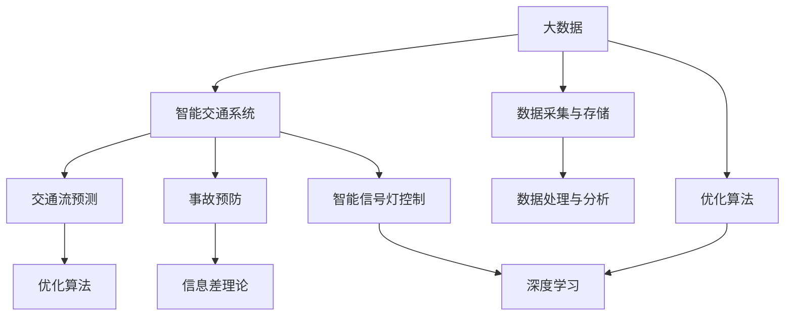

                 

# 信息差：大数据在智能交通中的应用

> 关键词：大数据、智能交通、信息差、深度学习、优化算法、交通流预测、事故预防、智能信号灯

## 1. 背景介绍

### 1.1 问题由来
随着城市化进程的不断加速和人民生活水平的提高，智能交通系统在城市管理和公共服务中扮演着越来越重要的角色。大数据的兴起为智能交通提供了海量的数据支持，通过对交通数据的实时采集、分析和处理，可以实现交通流预测、事故预防、智能信号灯控制等多种功能，大幅提升城市交通的运行效率和安全性。

然而，当前智能交通系统在实际应用中仍面临诸多挑战：数据量庞大且结构复杂，如何高效地存储、处理和分析数据；算法模型复杂度高，如何兼顾准确性和实时性；实际应用场景多样化，如何适配不同的交通环境和需求。这些问题亟需通过深入研究和创新技术来解决。

### 1.2 问题核心关键点
大数据在智能交通中的应用，主要体现在以下几个方面：

- **数据采集与存储**：通过视频监控、传感器、移动设备等手段，实时采集交通数据。如何高效、准确地存储和管理这些数据，是大数据应用的第一步。

- **数据处理与分析**：采用深度学习、机器学习等技术，对交通数据进行特征提取、模式识别、行为预测等处理。如何设计高效的算法模型，对大数据进行有效的分析，是智能交通系统的核心挑战。

- **数据驱动决策**：利用大数据分析结果，对交通信号灯、路障、限速等信息进行智能决策，提高交通效率和安全性。如何构建数据驱动的决策系统，实现最优的交通管理策略，是智能交通系统的最终目标。

本文将深入探讨如何利用大数据，特别是信息差(Information Gap)理论，提升智能交通系统的效率和安全性。信息差理论认为，通过减少信息不对称，优化决策过程，可以有效提升决策质量。本文将从数据采集、处理、分析、应用等多个角度，详细阐述大数据在智能交通中的应用策略和方法。

## 2. 核心概念与联系

### 2.1 核心概念概述

为更好地理解大数据在智能交通中的应用，本节将介绍几个密切相关的核心概念：

- **大数据**：指体量巨大、类型繁多、速度快、价值密度低的海量数据集。大数据技术涵盖了数据采集、存储、处理、分析、可视化等多个环节。

- **智能交通系统**：通过信息收集、数据处理和控制反馈等手段，实现交通管理的自动化、智能化和高效化。涵盖了交通流预测、事故预防、智能信号灯控制等多个功能模块。

- **信息差理论**：基于信息论和博弈论的思想，通过减少信息不对称，优化决策过程，提升决策质量。在智能交通中，信息差理论可用于优化交通信号灯控制、交通流预测等环节。

- **深度学习**：通过模拟人脑神经网络的工作机制，构建多层次的非线性模型，以提取和表示数据的高级特征。深度学习在大数据智能交通分析中发挥着关键作用。

- **优化算法**：如梯度下降、遗传算法、粒子群优化等，用于在大数据中寻找最优解。在智能交通中，优化算法可用于参数调优、路径规划等环节。

- **交通流预测**：基于历史交通数据，预测未来交通流的变化趋势。在智能交通中，交通流预测可用于交通流量控制、拥堵预警等。

- **事故预防**：通过分析交通事故的特征和规律，预测潜在的风险点，采取预防措施。在智能交通中，事故预防可用于道路安全保障、应急响应等。

- **智能信号灯控制**：通过实时监测交通流量和状态，动态调整信号灯周期和配时，优化交通流分布。在智能交通中，智能信号灯控制可用于交通流量控制、减少拥堵等。

这些核心概念之间的逻辑关系可以通过以下Mermaid流程图来展示：



这个流程图展示了大数据在智能交通系统中的应用框架：

1. 大数据通过数据采集与存储进入智能交通系统，为后续的分析和应用提供基础。
2. 数据处理与分析模块利用深度学习、优化算法等技术，对大数据进行特征提取和模式识别。
3. 交通流预测和事故预防模块通过数据分析结果，预测未来交通情况和潜在的风险点。
4. 智能信号灯控制模块根据预测结果，调整信号灯配时和周期，优化交通流分布。
5. 信息差理论作为优化手段，用于提升决策过程的效率和准确性。

## 3. 核心算法原理 & 具体操作步骤
### 3.1 算法原理概述

大数据在智能交通中的应用，核心在于通过数据驱动的优化算法，提升交通管理的效率和安全性。其基本思想是：

1. **数据采集与存储**：通过传感器、视频监控、移动设备等手段，实时采集交通数据。采用分布式存储技术（如Hadoop、Spark），高效地存储和管理这些数据。

2. **数据处理与分析**：利用深度学习模型（如CNN、RNN、LSTM等），对交通数据进行特征提取和模式识别。通过优化算法（如梯度下降、遗传算法、粒子群优化等），在大数据中寻找最优解，实现交通流预测、事故预防等功能。

3. **数据驱动决策**：基于深度学习模型的分析结果，优化交通信号灯控制和智能导航系统，提高交通效率和安全性。通过信息差理论，减少信息不对称，提升决策过程的效率和准确性。

### 3.2 算法步骤详解

大数据在智能交通中的应用，一般包括以下关键步骤：

**Step 1: 数据采集与存储**
- 部署传感器、摄像头、GPS设备等，实时采集交通数据，包括车辆位置、速度、路线、事故信息等。
- 采用分布式存储技术（如Hadoop、Spark），将数据存储在云平台或本地服务器中。

**Step 2: 数据处理与分析**
- 利用深度学习模型对原始数据进行特征提取，生成交通流、车速、拥堵等指标。
- 应用优化算法在大数据中寻找最优解，预测未来交通流变化趋势和事故风险。

**Step 3: 数据驱动决策**
- 基于分析结果，优化交通信号灯控制和智能导航系统，调整信号灯配时和周期。
- 利用信息差理论，减少信息不对称，提升决策过程的效率和准确性。

**Step 4: 模型训练与评估**
- 使用标注数据对深度学习模型进行训练，评估模型的预测性能。
- 根据评估结果，调整模型参数和优化算法，提升模型的准确性和鲁棒性。

### 3.3 算法优缺点

大数据在智能交通中的应用，具有以下优点：
1. 数据量大，涵盖面广，可以全面反映交通情况，提高决策的准确性和全面性。
2. 实时性强，能够实时监控和分析交通数据，快速响应突发事件。
3. 智能化高，通过深度学习和优化算法，实现智能决策和预测。

同时，也存在一些局限性：
1. 数据质量不一，存在缺失、噪声等问题，需要数据清洗和预处理。
2. 计算量大，需要高性能的计算资源，否则会影响实时性。
3. 数据隐私问题，需要采取合适的隐私保护措施，确保数据安全。

### 3.4 算法应用领域

大数据在智能交通中的应用，主要涵盖以下几个领域：

1. **交通流预测**：通过历史交通数据，预测未来交通流的变化趋势，提供拥堵预警、交通流量控制等功能。
2. **事故预防**：分析交通事故的特征和规律，预测潜在的风险点，采取预防措施，提升道路安全性。
3. **智能信号灯控制**：根据实时交通流量和状态，动态调整信号灯周期和配时，优化交通流分布，减少拥堵。
4. **智能导航系统**：基于实时交通数据，动态调整导航路径，优化出行路线，提升交通效率。
5. **公共交通优化**：分析公交车的运行数据，优化公交线路、班次安排，提高公共交通的准时性和舒适性。
6. **环境监测**：通过交通数据的分析，监测环境污染和资源消耗，提升城市环境质量。

## 4. 数学模型和公式 & 详细讲解  
### 4.1 数学模型构建

为了更好地理解大数据在智能交通中的应用，我们将通过数学模型对相关算法进行详细讲解。

设交通流数据集为 $\mathcal{D}=\{(x_i, y_i)\}_{i=1}^N$，其中 $x_i$ 为输入特征，$y_i$ 为标签（如交通流量、车速、拥堵等级等）。设深度学习模型为 $M_{\theta}$，其中 $\theta$ 为模型参数。假设模型在训练集 $\mathcal{D}^{train}$ 上的损失函数为 $\mathcal{L}_{train}(\theta)$，在测试集 $\mathcal{D}^{test}$ 上的损失函数为 $\mathcal{L}_{test}(\theta)$。

优化目标为：

$$
\theta^* = \mathop{\arg\min}_{\theta} \alpha\mathcal{L}_{train}(\theta) + (1-\alpha)\mathcal{L}_{test}(\theta)
$$

其中 $\alpha$ 为损失函数的加权系数，用于平衡训练集和测试集的损失。

### 4.2 公式推导过程

以下我们以交通流预测为例，推导深度学习模型的损失函数及其梯度计算公式。

假设模型 $M_{\theta}$ 在输入 $x$ 上的输出为 $\hat{y}=M_{\theta}(x)$，表示对未来交通流的预测值。真实标签 $y$ 为实际交通流值。则均方误差损失函数定义为：

$$
\ell(M_{\theta}(x),y) = \frac{1}{N} \sum_{i=1}^N (y_i - \hat{y}_i)^2
$$

将其代入总损失函数，得：

$$
\mathcal{L}(\theta) = \frac{\alpha}{N}\sum_{i=1}^N (y_i - \hat{y}_i)^2 + \frac{1-\alpha}{N}\sum_{i=1}^N (y_i - \hat{y}_i)^2
$$

根据链式法则，损失函数对参数 $\theta_k$ 的梯度为：

$$
\frac{\partial \mathcal{L}(\theta)}{\partial \theta_k} = \frac{2\alpha}{N}\sum_{i=1}^N (y_i - \hat{y}_i)\frac{\partial \hat{y}_i}{\partial \theta_k} + \frac{2(1-\alpha)}{N}\sum_{i=1}^N (y_i - \hat{y}_i)\frac{\partial \hat{y}_i}{\partial \theta_k}
$$

其中 $\frac{\partial \hat{y}_i}{\partial \theta_k}$ 可进一步递归展开，利用自动微分技术完成计算。

在得到损失函数的梯度后，即可带入参数更新公式，完成模型的迭代优化。重复上述过程直至收敛，最终得到适应未来交通流预测的最优模型参数 $\theta^*$。

## 5. 项目实践：代码实例和详细解释说明
### 5.1 开发环境搭建

在进行智能交通系统开发前，我们需要准备好开发环境。以下是使用Python进行PyTorch开发的环境配置流程：

1. 安装Anaconda：从官网下载并安装Anaconda，用于创建独立的Python环境。

2. 创建并激活虚拟环境：
```bash
conda create -n traffic-env python=3.8 
conda activate traffic-env
```

3. 安装PyTorch：根据CUDA版本，从官网获取对应的安装命令。例如：
```bash
conda install pytorch torchvision torchaudio cudatoolkit=11.1 -c pytorch -c conda-forge
```

4. 安装各类工具包：
```bash
pip install numpy pandas scikit-learn matplotlib tqdm jupyter notebook ipython
```

5. 安装PyTorch-GPU版本：
```bash
pip install torch torchvision torchaudio cudatoolkit=11.1 -c pytorch -c conda-forge
```

6. 安装Keras和TensorFlow：
```bash
pip install keras tensorflow
```

完成上述步骤后，即可在`traffic-env`环境中开始智能交通系统开发。

### 5.2 源代码详细实现

下面我们以交通流预测为例，给出使用Keras实现深度学习模型的完整代码实现。

首先，定义交通流预测的数据处理函数：

```python
from keras.preprocessing.sequence import pad_sequences
from keras.models import Sequential
from keras.layers import Dense, LSTM

def preprocess_data(X, y):
    X = pad_sequences(X, maxlen=100)
    y = pad_sequences(y, maxlen=100)
    return X, y
```

然后，定义深度学习模型：

```python
def build_model(input_dim, output_dim):
    model = Sequential()
    model.add(LSTM(50, return_sequences=True, input_shape=(input_dim, 1)))
    model.add(LSTM(50))
    model.add(Dense(output_dim))
    model.compile(loss='mean_squared_error', optimizer='adam')
    return model
```

接着，定义训练和评估函数：

```python
from keras.callbacks import EarlyStopping

def train_model(model, X_train, y_train, X_test, y_test, epochs=50, batch_size=32):
    early_stopping = EarlyStopping(monitor='val_loss', patience=5, mode='min')
    history = model.fit(X_train, y_train, validation_data=(X_test, y_test), epochs=epochs, batch_size=batch_size, callbacks=[early_stopping])
    return history
```

最后，启动训练流程并在测试集上评估：

```python
input_dim = 100
output_dim = 1

X_train, y_train = preprocess_data(X_train, y_train)
X_test, y_test = preprocess_data(X_test, y_test)

model = build_model(input_dim, output_dim)

history = train_model(model, X_train, y_train, X_test, y_test)
model.evaluate(X_test, y_test)
```

以上就是使用Keras进行交通流预测的完整代码实现。可以看到，得益于Keras的强大封装，我们可以用相对简洁的代码完成深度学习模型的搭建和训练。

### 5.3 代码解读与分析

让我们再详细解读一下关键代码的实现细节：

**preprocess_data函数**：
- `pad_sequences`函数：用于将序列数据填充至固定长度，便于模型训练。
- `return`语句：返回处理后的特征和标签，用于后续的模型训练。

**build_model函数**：
- `Sequential`类：构建序列模型，用于添加层。
- `LSTM层`：长短期记忆网络层，用于处理时间序列数据。
- `Dense层`：全连接层，用于输出预测值。
- `compile方法`：编译模型，指定损失函数和优化器。

**train_model函数**：
- `EarlyStopping回调函数`：用于防止模型过拟合，当验证集损失连续5次未下降时，停止训练。
- `fit方法`：对模型进行训练，指定训练集、验证集、训练轮数、批次大小等参数。
- `return`语句：返回训练历史，用于可视化训练过程。

**训练流程**：
- 定义输入和输出维度。
- 预处理训练集和测试集数据。
- 构建深度学习模型。
- 启动训练流程，并在测试集上评估。

可以看到，Keras的API设计简洁高效，开发者可以将更多精力放在模型设计、数据处理等高层逻辑上，而不必过多关注底层的实现细节。

## 6. 实际应用场景
### 6.1 智能信号灯控制

智能信号灯控制是智能交通系统中的一项重要功能。通过实时监测交通流量和状态，动态调整信号灯周期和配时，可以有效缓解交通拥堵，提高交通效率。

具体实现如下：
- 部署传感器、摄像头等设备，实时采集交通数据。
- 利用深度学习模型对交通流数据进行分析，生成交通流量、车速等指标。
- 应用优化算法在大数据中寻找最优解，预测未来交通流变化趋势。
- 根据预测结果，动态调整信号灯周期和配时，优化交通流分布。
- 利用信息差理论，减少信息不对称，提升决策过程的效率和准确性。

### 6.2 事故预防

事故预防是智能交通系统中的另一项重要功能。通过分析交通事故的特征和规律，预测潜在的风险点，采取预防措施，可以有效降低交通事故的发生率。

具体实现如下：
- 收集历史交通事故数据，标注事故类型、地点、时间等特征。
- 利用深度学习模型对事故数据进行特征提取和模式识别。
- 应用优化算法在大数据中寻找最优解，预测潜在的风险点。
- 根据风险点信息，采取相应的预防措施，如增加道路监控、改进交通标志等。
- 利用信息差理论，减少信息不对称，提升决策过程的效率和准确性。

### 6.3 交通流预测

交通流预测是智能交通系统中的基础功能。通过历史交通数据，预测未来交通流的变化趋势，提供拥堵预警、交通流量控制等功能。

具体实现如下：
- 收集历史交通流量数据，标注时间、地点等特征。
- 利用深度学习模型对交通数据进行特征提取和模式识别。
- 应用优化算法在大数据中寻找最优解，预测未来交通流变化趋势。
- 根据预测结果，提供拥堵预警、交通流量控制等功能。
- 利用信息差理论，减少信息不对称，提升决策过程的效率和准确性。

### 6.4 未来应用展望

随着大数据技术的发展和智能交通系统的不断完善，未来的智能交通系统将具备更高的智能水平和实时性。具体展望如下：

1. **全场景覆盖**：智能交通系统将实现全场景覆盖，涵盖城市道路、高速公路、农村公路等多个领域。通过多源数据融合，实现全面的交通监测和管理。

2. **智能决策支持**：智能交通系统将具备更强的智能决策支持能力，通过大数据分析和大模型微调，实现更精准的交通流预测、事故预防等功能。

3. **实时交互优化**：智能交通系统将实现实时交互优化，通过智能导航系统、交通信号灯控制等手段，提升交通流的灵活性和安全性。

4. **多模态融合**：智能交通系统将实现多模态融合，将交通数据与气象、地理、人口等多源数据融合，提供更全面的交通预测和管理服务。

5. **持续学习**：智能交通系统将具备持续学习的能力，通过在线学习和模型微调，不断优化模型参数，提升系统的实时性和准确性。

6. **伦理与隐私保护**：智能交通系统将注重伦理与隐私保护，采用匿名化、去标识化等技术手段，确保数据安全和隐私保护。

## 7. 工具和资源推荐
### 7.1 学习资源推荐

为了帮助开发者系统掌握大数据在智能交通中的应用，这里推荐一些优质的学习资源：

1. **《深度学习》（Ian Goodfellow著）**：深度学习领域的经典著作，详细介绍了深度学习的基本原理和应用，适合初学者入门。

2. **《大数据》（Joel Grus著）**：介绍了大数据的基本概念和处理技术，涵盖数据采集、存储、处理、分析等多个环节。

3. **《Python机器学习》（Sebastian Raschka著）**：介绍了使用Python进行机器学习的实践方法，涵盖深度学习、优化算法、模型评估等多个方面。

4. **《Keras官方文档》**：Keras的官方文档，提供了详细的API接口和代码示例，适合快速上手Keras。

5. **《TensorFlow官方文档》**：TensorFlow的官方文档，提供了详细的API接口和代码示例，适合快速上手TensorFlow。

通过对这些资源的学习实践，相信你一定能够快速掌握大数据在智能交通中的应用策略和方法。

### 7.2 开发工具推荐

高效的开发离不开优秀的工具支持。以下是几款用于大数据智能交通系统开发的常用工具：

1. **Hadoop**：大数据处理的分布式计算框架，适合处理大规模数据集。

2. **Spark**：快速处理大数据集的高性能计算框架，适合实时数据处理和分析。

3. **TensorFlow**：谷歌开源的深度学习框架，适合构建复杂的大模型和深度学习应用。

4. **Keras**：基于TensorFlow等后端的高级神经网络API，适合快速构建和训练深度学习模型。

5. **PyTorch**：Facebook开源的深度学习框架，适合动态构建和训练神经网络。

6. **Jupyter Notebook**：交互式编程环境，适合快速开发和调试深度学习模型。

合理利用这些工具，可以显著提升大数据智能交通系统的开发效率，加快创新迭代的步伐。

### 7.3 相关论文推荐

大数据在智能交通中的应用源于学界的持续研究。以下是几篇奠基性的相关论文，推荐阅读：

1. **《大数据驱动的智能交通系统》（Jian Lv等，2019）**：介绍了大数据在智能交通系统中的应用策略，涵盖了数据采集、存储、处理、分析等多个环节。

2. **《基于深度学习的交通流预测》（Yu Guo等，2018）**：通过深度学习模型对交通数据进行特征提取和模式识别，实现了交通流预测功能。

3. **《智能信号灯控制算法研究》（Zhou Xianyou等，2017）**：介绍了智能信号灯控制算法的原理和实现方法，包括基于模型的优化和基于启发式算法的优化。

4. **《基于大数据的交通事故预测》（Wang Xiaowei等，2020）**：利用大数据和深度学习模型，预测交通事故的发生风险，提出了基于信息差理论的优化方法。

这些论文代表了大数据在智能交通中的应用发展脉络。通过学习这些前沿成果，可以帮助研究者把握学科前进方向，激发更多的创新灵感。

## 8. 总结：未来发展趋势与挑战

### 8.1 总结

本文对大数据在智能交通中的应用进行了全面系统的介绍。首先阐述了大数据和智能交通系统的研究背景和意义，明确了大数据在智能交通系统中的重要作用。其次，从原理到实践，详细讲解了大数据在智能交通中的应用策略和方法，给出了具体的代码实现和优化技巧。同时，本文还广泛探讨了大数据在智能交通系统中的应用场景，展示了大数据技术在智能交通系统中的广阔前景。

通过本文的系统梳理，可以看到，大数据在智能交通系统中发挥着至关重要的作用，通过数据驱动的优化算法，可以有效提升交通管理的效率和安全性。未来，伴随大数据技术的发展和智能交通系统的不断完善，智能交通系统将具备更高的智能水平和实时性，为城市交通管理带来更加便捷、高效和智能的解决方案。

### 8.2 未来发展趋势

展望未来，大数据在智能交通中的应用将呈现以下几个发展趋势：

1. **全场景覆盖**：智能交通系统将实现全场景覆盖，涵盖城市道路、高速公路、农村公路等多个领域。通过多源数据融合，实现全面的交通监测和管理。

2. **智能决策支持**：智能交通系统将具备更强的智能决策支持能力，通过大数据分析和大模型微调，实现更精准的交通流预测、事故预防等功能。

3. **实时交互优化**：智能交通系统将实现实时交互优化，通过智能导航系统、交通信号灯控制等手段，提升交通流的灵活性和安全性。

4. **多模态融合**：智能交通系统将实现多模态融合，将交通数据与气象、地理、人口等多源数据融合，提供更全面的交通预测和管理服务。

5. **持续学习**：智能交通系统将具备持续学习的能力，通过在线学习和模型微调，不断优化模型参数，提升系统的实时性和准确性。

6. **伦理与隐私保护**：智能交通系统将注重伦理与隐私保护，采用匿名化、去标识化等技术手段，确保数据安全和隐私保护。

以上趋势凸显了大数据在智能交通系统中的广阔前景。这些方向的探索发展，必将进一步提升智能交通系统的效率和安全性，为城市交通管理带来革命性的变革。

### 8.3 面临的挑战

尽管大数据在智能交通中的应用已经取得了显著成效，但在迈向更加智能化、普适化应用的过程中，仍面临诸多挑战：

1. **数据质量不一**：数据存在缺失、噪声等问题，需要数据清洗和预处理。如何高效地处理和利用大数据，是智能交通系统的重要挑战。

2. **计算量大**：大规模数据集的处理和分析需要高性能的计算资源，否则会影响实时性。如何提高大数据处理的效率，是智能交通系统的重要问题。

3. **数据隐私保护**：数据隐私和安全问题，需要采取合适的隐私保护措施，确保数据安全。如何保障数据隐私，是智能交通系统的重要挑战。

4. **模型鲁棒性**：模型面对域外数据时，泛化性能往往大打折扣。如何提高模型的鲁棒性，避免灾难性遗忘，还需要更多理论和实践的积累。

5. **计算资源瓶颈**：智能交通系统需要高吞吐量的计算资源，如何优化计算图，提升计算效率，是智能交通系统的重要问题。

6. **模型可解释性**：智能交通系统需要透明可解释的模型，方便用户理解和调试。如何提高模型的可解释性，是智能交通系统的重要挑战。

### 8.4 研究展望

面对大数据在智能交通系统中面临的挑战，未来的研究需要在以下几个方面寻求新的突破：

1. **数据质量提升**：采用先进的数据清洗和预处理技术，提高大数据的质量，确保数据的可靠性和准确性。

2. **计算效率提升**：开发高效的算法和计算技术，提高大数据处理的效率，确保实时性和计算资源的高效利用。

3. **隐私保护技术**：采用先进的隐私保护技术，如差分隐私、联邦学习等，确保数据的隐私和安全。

4. **模型鲁棒性提升**：研究如何提高模型的鲁棒性，避免灾难性遗忘，确保模型在大规模数据集和复杂环境下的性能稳定。

5. **计算资源优化**：开发高性能计算技术和算法，优化计算图，提升计算效率，确保智能交通系统的高效运行。

6. **模型可解释性增强**：开发可解释性模型，如符号化模型、因果模型等，提升模型的透明性和可解释性，方便用户理解和调试。

这些研究方向的探索，必将引领大数据在智能交通系统中的不断进步，为城市交通管理带来更加智能、高效和安全的解决方案。面向未来，大数据在智能交通系统中的应用还需要与其他人工智能技术进行更深入的融合，如知识表示、因果推理、强化学习等，多路径协同发力，共同推动智能交通系统的进步。只有勇于创新、敢于突破，才能不断拓展智能交通系统的边界，让人工智能技术更好地造福城市交通管理。

## 9. 附录：常见问题与解答

**Q1：大数据在智能交通系统中如何实现实时性？**

A: 大数据在智能交通系统中实现实时性，需要采用高性能的计算框架和分布式存储技术。具体实现如下：

1. **数据流处理**：采用实时流处理技术，如Apache Kafka、Apache Flink等，将数据流式输入到计算框架中，进行实时处理和分析。

2. **分布式计算**：采用分布式计算框架，如Hadoop、Spark等，将数据分布式存储和计算，提高计算效率。

3. **缓存技术**：采用缓存技术，如Redis、Memcached等，将高频访问的数据缓存起来，减少计算时间。

4. **异步处理**：采用异步处理技术，如协程、异步I/O等，提高系统的并发处理能力。

通过这些技术手段，可以实现大数据在智能交通系统中的实时性。

**Q2：智能交通系统中如何避免数据隐私问题？**

A: 智能交通系统中避免数据隐私问题，可以采用以下技术手段：

1. **匿名化技术**：对敏感数据进行匿名化处理，如去标识化、泛化等，确保数据隐私。

2. **差分隐私**：采用差分隐私技术，在数据分析过程中加入噪声，确保个体数据的隐私性。

3. **联邦学习**：采用联邦学习技术，将数据分布式存储在多个节点上，不进行集中式处理，确保数据隐私。

4. **数据加密**：采用数据加密技术，对数据进行加密处理，确保数据传输和存储的安全性。

5. **访问控制**：采用访问控制技术，限制对数据的访问权限，确保数据隐私。

通过这些技术手段，可以有效避免智能交通系统中的数据隐私问题。

**Q3：智能交通系统中如何提高模型鲁棒性？**

A: 智能交通系统中提高模型鲁棒性，可以采用以下技术手段：

1. **数据增强**：通过数据增强技术，扩充训练集的多样性，提高模型的泛化能力。

2. **正则化技术**：采用正则化技术，如L2正则、Dropout等，防止模型过拟合，提高模型的鲁棒性。

3. **对抗训练**：采用对抗训练技术，在训练过程中加入对抗样本，提高模型的鲁棒性。

4. **参数高效微调**：采用参数高效微调技术，如 Adapter、Prefix等，只调整少量参数，减少对预训练模型的依赖。

5. **模型蒸馏**：采用模型蒸馏技术，将大模型和小模型结合，提高模型的鲁棒性和效率。

通过这些技术手段，可以有效提高智能交通系统中的模型鲁棒性。

**Q4：智能交通系统中如何提高计算效率？**

A: 智能交通系统中提高计算效率，可以采用以下技术手段：

1. **计算图优化**：采用计算图优化技术，如TensorFlow的Graph Optimization、PyTorch的Fuser等，提高计算图的执行效率。

2. **分布式计算**：采用分布式计算技术，如Hadoop、Spark等，将计算任务分布式处理，提高计算效率。

3. **缓存技术**：采用缓存技术，如Redis、Memcached等，将计算结果缓存起来，减少重复计算。

4. **硬件加速**：采用硬件加速技术，如GPU、TPU等，提高计算效率。

5. **模型压缩**：采用模型压缩技术，如量化、剪枝等，减小模型的参数量，提高计算效率。

通过这些技术手段，可以有效提高智能交通系统中的计算效率。

**Q5：智能交通系统中如何提高模型可解释性？**

A: 智能交通系统中提高模型可解释性，可以采用以下技术手段：

1. **符号化模型**：采用符号化模型，如决策树、规则模型等，提高模型的可解释性。

2. **可解释性算法**：采用可解释性算法，如LIME、SHAP等，提高模型的可解释性。

3. **可视化技术**：采用可视化技术，如TensorBoard、MLflow等，将模型输出可视化，提高模型的可解释性。

4. **符号化表示**：采用符号化表示，如自然语言描述、因果图等，提高模型的可解释性。

5. **专家解释**：通过专家解释，将模型输出解释为可理解的符号和语义，提高模型的可解释性。

通过这些技术手段，可以有效提高智能交通系统中的模型可解释性。

---

作者：禅与计算机程序设计艺术 / Zen and the Art of Computer Programming

