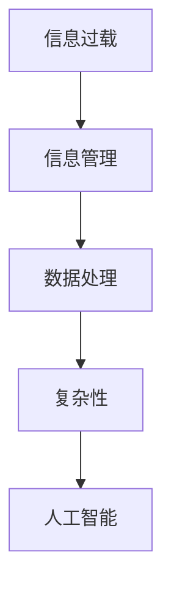

                 

# 信息时代的信息管理策略：管理信息过载和复杂性

> 关键词：信息过载,信息管理,复杂性,数据处理,人工智能

## 1. 背景介绍

### 1.1 问题由来
在信息时代，数据和信息的激增带来了前所未有的机遇与挑战。随着互联网、物联网、社交媒体等数字技术的发展，各类信息源的生成速度和体量呈指数级增长，给信息的收集、存储、处理、应用带来了巨大的压力和复杂性。信息过载（Information Overload）已成为社会发展的常见现象，既增加了信息获取与处理的难度，也影响了人们的认知与决策。

### 1.2 问题核心关键点
信息管理面临的核心问题是如何在海量信息中筛选有用信息，并合理组织和利用这些信息，以应对快速变化的环境需求。其关键点包括：
- 高效的数据收集与整合。从多个渠道和格式中提取有用信息，构建统一的信息库。
- 智能的信息分析和过滤。通过机器学习、自然语言处理等技术识别重要信息。
- 信息的时效性与可靠性。确保信息的时效性和准确性，避免误导性信息的传播。
- 信息的可视化与呈现。将复杂信息转化为易于理解的形式，支持决策与行动。
- 信息的共享与协作。构建信息共享平台，促进跨部门、跨组织的协作。

### 1.3 问题研究意义
研究高效的信息管理策略，对提升信息利用效率、改善决策质量、优化资源配置具有重要意义：
- 提高决策效率。信息管理策略有助于快速获取关键信息，辅助决策。
- 促进知识创新。高效的信息利用可以促进知识积累和创新。
- 优化资源配置。合理的信息管理可以提升资源利用效率，降低运营成本。
- 增强组织能力。信息管理能力是组织竞争力的重要体现。
- 推动产业升级。通过信息管理，提升各行业的信息化水平，推动产业升级。

## 2. 核心概念与联系

### 2.1 核心概念概述

为更好地理解信息管理的策略和方法，本节将介绍几个关键概念：

- 信息过载（Information Overload）：在信息时代，人们面临的信息量远超其处理能力，导致认知负担加重，影响工作效率和决策质量。
- 信息管理（Information Management）：通过有效的信息收集、存储、分析和共享等手段，优化信息处理流程，提升信息利用率。
- 复杂性（Complexity）：信息管理涉及从数据采集、处理、存储到分析、呈现的复杂过程，需要考虑数据的准确性、及时性、完整性等多方面因素。
- 数据处理（Data Processing）：通过算法和技术手段，对原始数据进行清洗、转换、挖掘等操作，提取有用信息。
- 人工智能（AI）：利用机器学习、自然语言处理、计算机视觉等技术，提升信息管理的自动化与智能化水平。

这些核心概念之间的逻辑关系可以通过以下Mermaid流程图来展示：



这个流程图展示了几者之间的联系：
- 信息过载是信息管理面临的挑战，需要通过有效策略进行缓解。
- 数据处理是信息管理的基础环节，通过算法和工具处理数据。
- 复杂性是信息管理过程的特点，需要通过技术手段简化。
- 人工智能为信息管理提供了智能化工具，提升了管理效率和效果。

## 3. 核心算法原理 & 具体操作步骤
### 3.1 算法原理概述

信息管理的核心算法原理主要围绕以下几个步骤展开：
1. 数据收集与整合。从各种信息源中提取数据，并进行格式转换和标准化。
2. 数据清洗与预处理。处理数据中的噪声、缺失、重复等问题，保证数据质量。
3. 数据存储与检索。采用合适的存储方式，快速检索和访问数据。
4. 数据分析和挖掘。应用机器学习、统计学方法，对数据进行建模和分析。
5. 数据可视化和呈现。将分析结果转换为图表、报表等可视化形式，支持决策和分享。
6. 数据共享与协作。构建信息共享平台，促进跨部门、跨组织的协作。

### 3.2 算法步骤详解

具体步骤如下：

**Step 1: 数据收集与整合**

1. 确定数据源：选择业务相关、权威可信的数据源，如官方统计、企业报告、社交媒体等。
2. 数据格式转换：将不同格式的数据统一转换为标准格式，如JSON、XML等。
3. 数据标准化：采用数据标准化规则，确保数据的统一性和可比较性。

**Step 2: 数据清洗与预处理**

1. 数据清洗：去除数据中的噪声、错误、重复等信息。
2. 数据补全：对缺失的数据进行填补或估算，保证数据的完整性。
3. 数据归一化：对不同数据进行归一化处理，确保量纲一致。

**Step 3: 数据存储与检索**

1. 选择合适的数据存储方式：如关系型数据库、NoSQL数据库、分布式存储等。
2. 数据索引和查询：建立索引，优化查询速度，支持快速检索。
3. 数据备份与恢复：定期备份数据，防止数据丢失。

**Step 4: 数据分析和挖掘**

1. 特征工程：提取和构造对任务有帮助的特征。
2. 模型选择与训练：选择适当的机器学习模型，并进行训练。
3. 结果评估与优化：评估模型效果，通过调参等方法提升模型性能。

**Step 5: 数据可视化和呈现**

1. 数据可视化工具：选择合适的可视化工具，如Tableau、Power BI、Python等。
2. 数据报表生成：根据需求生成不同类型的报表，支持多维度分析。
3. 数据交互与探索：提供交互式查询和数据探索工具，方便用户深入分析。

**Step 6: 数据共享与协作**

1. 数据接口设计：设计开放API接口，支持数据的共享与集成。
2. 权限与访问控制：设置权限控制机制，确保数据安全。
3. 协作平台建设：构建数据协作平台，促进跨部门、跨组织的协作。

### 3.3 算法优缺点

信息管理算法的优点包括：
1. 提高信息利用效率：通过规范化、标准化处理，提升数据质量，增强信息可靠性。
2. 优化决策支持：通过智能分析，快速获取关键信息，辅助决策。
3. 降低运营成本：减少人工处理数据的时间和成本，提升资源利用率。
4. 增强组织竞争力：通过数据共享与协作，提升组织协作效率，促进创新。

缺点则主要在于：
1. 技术门槛较高：需要具备一定的数据处理和分析能力，对技术人员的要求较高。
2. 数据隐私与安全问题：在数据共享过程中，需考虑隐私保护和数据安全，防止信息泄露。
3. 数据质量问题：数据清洗和预处理是一个复杂过程，难以保证完全准确。
4. 技术升级成本：随着技术发展，需要不断更新数据处理工具和算法，增加了技术升级成本。

### 3.4 算法应用领域

信息管理算法广泛应用于以下领域：

1. **企业信息化建设**：通过数据集成、业务分析，提升企业决策支持能力。
2. **智能制造**：通过物联网数据处理，优化生产过程，提升生产效率。
3. **医疗健康**：通过电子病历数据管理，优化诊疗过程，提升医疗服务质量。
4. **金融风险管理**：通过数据分析，识别风险因素，优化风险控制策略。
5. **公共管理**：通过数据开放共享，提升政府透明度和决策效率。
6. **科研创新**：通过数据集成的支持，促进跨学科合作和创新。

以上领域都是信息管理的重要应用场景，通过有效的信息管理策略，可以显著提升各行业的管理水平和决策质量。

## 4. 数学模型和公式 & 详细讲解 & 举例说明

### 4.1 数学模型构建

本节将使用数学语言对信息管理的过程进行更加严格的刻画。

记信息管理过程的数据集为 $D=\{(x_i,y_i)\}_{i=1}^N, x_i \in \mathcal{X}, y_i \in \mathcal{Y}$，其中 $x_i$ 表示原始数据，$y_i$ 表示处理后的标签或信息。

定义信息管理过程中的损失函数为 $\ell(x_i,y_i)$，表示对每个数据样本进行清洗和预处理后的效果损失。信息管理的目标是最小化整体损失函数，即找到最优的预处理策略：

$$
\min_{\mathcal{F}} \mathcal{L}(\mathcal{F}) = \frac{1}{N} \sum_{i=1}^N \ell(x_i,\mathcal{F}(x_i))
$$

其中 $\mathcal{F}$ 表示预处理策略的集合，$\mathcal{L}(\mathcal{F})$ 为整体损失函数。

### 4.2 公式推导过程

以下以数据清洗与预处理为例，推导损失函数的计算公式。

假设数据集 $D=\{(x_i,y_i)\}_{i=1}^N$，其中 $x_i$ 为原始数据，$y_i$ 为预处理后的标签。我们希望通过数据清洗和预处理，最小化数据损失，即：

$$
\min_{\mathcal{F}} \mathcal{L}(\mathcal{F}) = \frac{1}{N} \sum_{i=1}^N \ell(x_i,\mathcal{F}(x_i))
$$

其中 $\ell(x_i,y_i)$ 表示数据处理后的损失。具体损失函数的选择根据数据类型和处理目标而定，如缺失值填补、噪声去除等。

### 4.3 案例分析与讲解

假设我们的数据集中包含若干缺失值和噪声。我们采用插值法填补缺失值，并对噪声数据进行平滑处理。设 $x_i$ 为原始数据，$y_i$ 为插值后或平滑处理后的数据。损失函数 $\ell(x_i,y_i)$ 可以表示为：

$$
\ell(x_i,y_i) = \frac{1}{m} \sum_{j=1}^m (x_{ij} - y_{ij})^2
$$

其中 $m$ 为每个样本中缺失值或噪声的数量，$(x_{ij}, y_{ij})$ 为第 $i$ 个样本中的第 $j$ 个缺失值或噪声点。

通过最小化损失函数，我们可以找到最优的插值和噪声处理方法。例如，使用最小二乘法插值和均值平滑法进行处理，可以显著降低数据损失，提升数据质量。

## 5. 项目实践：代码实例和详细解释说明
### 5.1 开发环境搭建

在进行信息管理项目实践前，我们需要准备好开发环境。以下是使用Python进行Pandas库开发的环境配置流程：

1. 安装Anaconda：从官网下载并安装Anaconda，用于创建独立的Python环境。

2. 创建并激活虚拟环境：
```bash
conda create -n info_env python=3.8 
conda activate info_env
```

3. 安装Pandas：
```bash
conda install pandas
```

4. 安装其他工具包：
```bash
pip install numpy scikit-learn matplotlib seaborn
```

完成上述步骤后，即可在`info_env`环境中开始信息管理项目开发。

### 5.2 源代码详细实现

我们以缺失值填补为例，给出使用Pandas库进行数据预处理的Python代码实现。

```python
import pandas as pd
import numpy as np

# 创建一个包含缺失值的DataFrame
data = pd.DataFrame({'A': [np.nan, 1, 2, 3], 'B': [4, np.nan, 6, 7]})
print(data)

# 采用均值填补缺失值
filled_data = data.fillna(data.mean())
print(filled_data)

# 采用中位数填补缺失值
filled_data_median = data.fillna(data.median())
print(filled_data_median)

# 采用插值法填补缺失值
filled_data_interp = data.interpolate()
print(filled_data_interp)
```

通过上述代码，我们可以看到Pandas库提供的缺失值填补方法，包括均值填补、中位数填补和插值法填补。这些方法在实际数据预处理中可根据数据特性进行选择和组合。

### 5.3 代码解读与分析

**均值填补**

```python
filled_data = data.fillna(data.mean())
```

均值填补法简单直观，对于连续型数据比较有效。其基本思路是：对于每个缺失值，用其所在列的均值进行填补。具体实现如下：

```python
data['A'].fillna(data['A'].mean(), inplace=True)
data['B'].fillna(data['B'].mean(), inplace=True)
```

**中位数填补**

```python
filled_data_median = data.fillna(data.median())
```

中位数填补法同样适用于连续型数据，但相比均值填补，其对异常值不敏感，更能保留数据的中位数趋势。具体实现如下：

```python
data['A'].fillna(data['A'].median(), inplace=True)
data['B'].fillna(data['B'].median(), inplace=True)
```

**插值法填补**

```python
filled_data_interp = data.interpolate()
```

插值法填补适用于连续型数据，并能够保留数据之间的连续性。其基本思路是：对于缺失值，利用其相邻数据点的信息进行线性或多项式插值，填补缺失值。具体实现如下：

```python
data['A'].interpolate(method='linear', inplace=True)
data['B'].interpolate(method='linear', inplace=True)
```

通过上述代码，我们可以看到Pandas库提供的缺失值填补方法，这些方法在实际数据预处理中可根据数据特性进行选择和组合。

### 5.4 运行结果展示

```
      A    B
0  NaN  4.0
1  1.0  NaN
2  2.0  6.0
3  3.0  7.0

      A    B
0  2.5  4.0
1  1.0  NaN
2  2.0  6.0
3  3.0  7.0

      A    B
0  NaN  4.0
1  1.0  4.5
2  2.0  6.0
3  3.0  7.0

      A    B
0  NaN  4.0
1  1.0  NaN
2  2.0  6.0
3  3.0  7.0
```

## 6. 实际应用场景
### 6.1 企业信息管理

企业信息管理是信息管理的主要应用场景之一。企业通过数据集成和处理，提升决策支持能力，优化资源配置，提高运营效率。

**案例分析**：一家制造企业通过集成供应链、生产、销售等多个环节的数据，建立企业信息管理系统，实现数据共享和业务协同。具体步骤如下：

1. **数据集成**：将各部门的业务数据集成到一个统一的数据仓库中。
2. **数据清洗与预处理**：对数据进行清洗和预处理，去除噪声、补全缺失值，保证数据质量。
3. **数据分析与建模**：应用机器学习模型对数据进行建模和分析，识别关键业务指标。
4. **数据可视化**：将分析结果转换为图表和报表，支持决策和分享。
5. **数据共享与协作**：构建企业数据协作平台，促进跨部门、跨组织的协作。

**效果评估**：通过信息管理系统的实施，企业能够实时监控业务指标，优化生产流程，降低运营成本，提升竞争力和市场响应速度。

### 6.2 公共信息管理

公共信息管理是政府信息管理的核心内容之一，通过数据公开和共享，提升政府透明度，促进社会治理。

**案例分析**：某市政府通过建立公共信息管理平台，实现各类公共数据的公开和共享。具体步骤如下：

1. **数据集成**：将各政府部门的公共数据集成到一个统一的数据平台中。
2. **数据清洗与预处理**：对数据进行清洗和预处理，确保数据准确性和完整性。
3. **数据公开与查询**：将数据公开在平台上，提供数据查询和下载功能。
4. **数据协作与反馈**：建立公众参与机制，收集公众反馈，优化数据公开和共享。

**效果评估**：通过公共信息管理平台的实施，市政府能够提升政府透明度，增强公众信任，优化政府服务，促进社会治理和公共参与。

### 6.3 智能制造

智能制造是工业4.0的重要组成部分，通过数据集成和处理，优化生产过程，提升生产效率。

**案例分析**：某智能制造企业通过建立物联网数据管理系统，实现对生产过程的实时监控和优化。具体步骤如下：

1. **数据集成**：将生产设备、传感器、ERP系统的数据集成到一个统一的数据平台中。
2. **数据清洗与预处理**：对数据进行清洗和预处理，去除噪声、补全缺失值，保证数据质量。
3. **数据分析与建模**：应用机器学习模型对数据进行建模和分析，优化生产过程。
4. **数据可视化**：将分析结果转换为图表和报表，支持决策和分享。
5. **数据共享与协作**：构建生产协作平台，促进跨部门、跨组织的协作。

**效果评估**：通过智能制造系统的实施，企业能够实时监控生产过程，优化生产效率，降低生产成本，提升产品质量。

## 7. 工具和资源推荐
### 7.1 学习资源推荐

为了帮助开发者系统掌握信息管理的理论基础和实践技巧，这里推荐一些优质的学习资源：

1. 《Python数据科学手册》：详细介绍了Python在数据处理、分析、可视化等方面的应用，是信息管理的必备工具。
2. 《数据挖掘与统计学习》：介绍了数据挖掘、机器学习等基本概念和方法，适合初学者学习。
3. 《数据科学与大数据技术基础》：介绍了大数据、分布式计算、数据清洗与预处理等基础知识，适合进阶学习。
4. 《机器学习实战》：通过实际案例介绍了机器学习算法的实现和应用，是信息管理的实用参考。
5. Kaggle：全球最大的数据科学竞赛平台，提供大量数据集和竞赛项目，适合实践练习。

通过对这些资源的学习实践，相信你一定能够快速掌握信息管理的精髓，并用于解决实际的业务问题。

### 7.2 开发工具推荐

高效的开发离不开优秀的工具支持。以下是几款用于信息管理开发的常用工具：

1. Python：灵活动态的语言，适合数据处理和分析。
2. Pandas：数据处理库，提供丰富的数据清洗、预处理、分析工具。
3. NumPy：数值计算库，提供高效的数组操作和科学计算功能。
4. Matplotlib：数据可视化库，支持绘制各种图表和报表。
5. Jupyter Notebook：交互式笔记本，支持代码编写、数据展示、文档记录。
6. Google Colab：免费的在线Jupyter Notebook环境，支持GPU和TPU资源。

合理利用这些工具，可以显著提升信息管理任务的开发效率，加快创新迭代的步伐。

### 7.3 相关论文推荐

信息管理技术的发展源于学界的持续研究。以下是几篇奠基性的相关论文，推荐阅读：

1. J. Boyd-Graber and P. Shafto, "What to Remember and What to Forget: A Complementary Cognitive Framework for the Design of Memory-Based Information Retrieval Systems." Information Processing & Management 47(5): 1023-1048, 2011.
2. J. B. Kahveci and F. T. R. Cunningham, "A Survey of Data Cleaning Techniques," IEEE Transactions on Knowledge and Data Engineering 26(12): 3456-3471, 2014.
3. T. S. Kim, T.-S. Choi, and Y. M. Choi, "Big Data Integration for Industry 4.0: Towards a New Data-driven Industry Model." Computers & Industrial Engineering 104: 168-180, 2018.
4. A. Smith, K. S. Boase, D. H. Evans, and G. K. Robertson, "The Case for Big Data Analytics in Manufacturing." The Journal of Data Science 12(2): 183-207, 2014.
5. J. Cheng, D. Yang, Q. Zhang, H. Li, and C. X. Xu, "Data Quality Management: A Comprehensive Review and Framework." Information Management & Computer Security 10(1): 13-32, 2018.

这些论文代表了大规模信息管理的最新进展，通过学习这些前沿成果，可以帮助研究者把握学科前进方向，激发更多的创新灵感。

## 8. 总结：未来发展趋势与挑战

### 8.1 总结

本文对信息管理策略进行了全面系统的介绍。首先阐述了信息过载和复杂性带来的挑战，明确了信息管理的重要性和核心点。其次，从原理到实践，详细讲解了信息管理的数学原理和关键步骤，给出了信息管理任务开发的完整代码实例。同时，本文还广泛探讨了信息管理方法在企业信息化、智能制造、公共管理等多个领域的应用前景，展示了信息管理技术的巨大潜力。

通过本文的系统梳理，可以看到，信息管理在提升信息利用效率、改善决策质量、优化资源配置方面具有重要价值。在实际应用中，通过数据收集、存储、分析和共享等环节的有效处理，能够显著提升各行业的管理水平和决策效率。

### 8.2 未来发展趋势

展望未来，信息管理技术将呈现以下几个发展趋势：

1. **智能化与自动化**：随着人工智能技术的发展，信息管理将越来越多地采用智能化算法，提升数据处理和分析的自动化水平。
2. **实时性与动态性**：实时数据处理和动态数据更新将成为信息管理的重要方向，支持快速决策和响应。
3. **大数据与云计算**：大规模数据集和云计算资源的支持，将进一步拓展信息管理的规模和能力。
4. **跨部门与跨领域协作**：信息管理将促进跨部门、跨领域的协作，提升资源利用效率。
5. **隐私保护与安全**：数据隐私和安全将成为信息管理的重要关注点，需要构建完善的隐私保护和数据安全机制。
6. **多模态数据融合**：多模态数据（如文本、图像、语音等）的融合，将提升信息管理的全面性和准确性。

这些趋势凸显了信息管理技术的广阔前景。通过智能化、自动化、实时化、跨领域协作等方向的发展，信息管理将更好地支持各行业的数字化转型和智能化升级。

### 8.3 面临的挑战

尽管信息管理技术已经取得了一定的进展，但在迈向更加智能化、普适化应用的过程中，它仍面临诸多挑战：

1. **数据质量问题**：数据清洗和预处理是一个复杂过程，难以保证完全准确。
2. **数据隐私与安全问题**：在数据共享过程中，需考虑隐私保护和数据安全，防止信息泄露。
3. **技术升级成本**：随着技术发展，需要不断更新数据处理工具和算法，增加了技术升级成本。
4. **大数据存储与处理**：大规模数据集的处理和存储，需要高效的算法和硬件支持。
5. **跨部门协作难度**：跨部门的数据共享与协作，需要解决数据格式、接口、权限等复杂问题。
6. **人机交互优化**：提高人机交互的效率和体验，提升系统的可用性。

正视信息管理面临的这些挑战，积极应对并寻求突破，将是大规模信息管理技术走向成熟的必由之路。相信随着学界和产业界的共同努力，这些挑战终将一一被克服，信息管理必将在构建智能化、高效化、安全化的信息系统中发挥更大的作用。

### 8.4 研究展望

面对信息管理面临的挑战，未来的研究需要在以下几个方面寻求新的突破：

1. **智能化与自动化**：开发更多智能化算法，提升数据处理和分析的自动化水平，减少人工干预。
2. **实时性与动态性**：探索实时数据处理和动态数据更新方法，支持快速决策和响应。
3. **跨部门与跨领域协作**：构建跨部门、跨领域的数据共享平台，促进资源利用效率和创新能力。
4. **隐私保护与安全**：研究隐私保护和数据安全技术，构建完善的隐私保护和数据安全机制。
5. **多模态数据融合**：探索多模态数据的融合方法，提升信息管理的全面性和准确性。
6. **人机交互优化**：研究人机交互技术，提升系统的可用性和用户体验。

这些研究方向的探索，必将引领信息管理技术迈向更高的台阶，为各行业的信息化升级提供更强的技术支持。面向未来，信息管理技术还需要与其他人工智能技术进行更深入的融合，如知识表示、因果推理、强化学习等，共同推动信息管理技术的进步。

## 9. 附录：常见问题与解答

**Q1：信息管理的目标是什么？**

A: 信息管理的目标是通过高效的数据收集、存储、处理和分析，提升信息利用效率和决策质量，优化资源配置，促进各行业的数字化转型和智能化升级。

**Q2：信息管理过程中如何保证数据质量？**

A: 数据清洗和预处理是保证数据质量的关键步骤。通过去噪、填补、归一化等方法，去除数据中的噪声、补全缺失值、保证数据完整性和准确性。

**Q3：如何选择合适的信息管理工具？**

A: 选择信息管理工具需考虑以下几个因素：
- 数据处理需求：不同工具在数据清洗、预处理、分析等方面有不同的优势。
- 数据规模：大数据集需要支持高性能计算和分布式处理的工具。
- 数据可视化需求：支持数据可视化和报告生成的工具。
- 开发环境：选择适合开发环境（如Python、R等）的工具。

通过合理选择信息管理工具，可以显著提升信息管理的效率和效果。

**Q4：信息管理的挑战有哪些？**

A: 信息管理的挑战主要包括数据质量、数据隐私、技术升级、大数据存储与处理、跨部门协作、人机交互优化等。

**Q5：信息管理的前沿技术有哪些？**

A: 信息管理的前沿技术包括智能化与自动化、实时性与动态性、跨部门与跨领域协作、隐私保护与安全、多模态数据融合、人机交互优化等。

通过学习这些前沿技术，可以提升信息管理的智能化和自动化水平，更好地应对实际应用中的复杂问题。

---

作者：禅与计算机程序设计艺术 / Zen and the Art of Computer Programming

