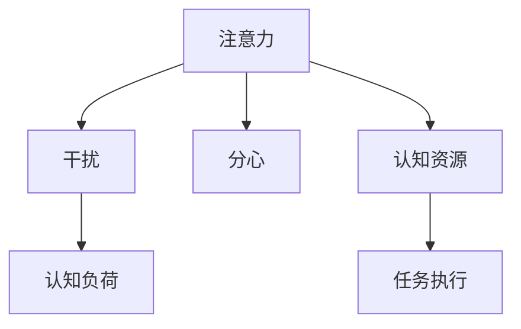

                 

## 1. 背景介绍

在信息时代，我们面临着前所未有的信息洪流。从电子邮件到社交媒体，从新闻推送到视频流媒体，我们的注意力被不断分割和干扰，导致许多人难以保持专注。这种现象不仅影响了工作效率，还对身心健康产生了不良影响。因此，如何在干扰和分心中保持头脑清晰，成为现代信息管理的重要课题。

### 1.1 问题由来

随着互联网和移动设备的普及，人们接收信息的方式发生了根本性的变化。传统的纸质媒体逐渐被数字化媒体所取代，信息获取的渠道变得多样且快速。然而，这种便利的背后，是注意力资源被严重稀释和碎片化的现实。人们每天面对海量信息，却难以从中提取有价值的内容。这种“信息过载”现象，引发了一系列认知和行为问题。

### 1.2 问题核心关键点

信息时代注意力管理的关键点在于如何有效应对干扰和分散注意力的问题，以提升认知和生产效率。这包括：

- **识别干扰源**：识别和分类各种信息干扰源，如噪音、多任务处理、社交媒体等。
- **分配注意力**：合理分配注意力资源，优先处理高价值信息，避免在低效信息上浪费精力。
- **策略实施**：制定并实施有效的注意力管理策略，提升注意力的持久性和集中度。

## 2. 核心概念与联系

### 2.1 核心概念概述

为了深入理解信息时代的注意力管理，我们将介绍几个核心概念及其内在联系：

- **注意力**：指个体在特定信息或任务上的专注程度，是认知资源的一种体现。
- **干扰**：指影响注意力集中和认知过程的外部因素，如噪音、多任务处理、社交媒体等。
- **分心**：指注意力从当前任务转移到其他不相关的信息或活动中，导致当前任务进展受阻。
- **认知负荷**：指个体在处理信息或执行任务时所需的心理资源，包括注意力、记忆、决策等。

### 2.2 核心概念原理和架构的 Mermaid 流程图



### 2.3 核心概念之间的联系

注意力、干扰、分心和认知负荷这些概念之间存在着密切的联系。干扰和分心是导致认知负荷增加的主要因素，而有效的注意力管理策略，则有助于减轻认知负荷，提升注意力资源的使用效率。

## 3. 核心算法原理 & 具体操作步骤

### 3.1 算法原理概述

注意力管理的核心在于通过各种算法和策略，优化信息处理过程，提升注意力的持久性和集中度。其基本原理包括：

- **信息过滤**：通过算法和规则，识别和过滤无用或低效的信息，减少注意力干扰。
- **任务优先级管理**：根据任务的重要性和紧急性，合理分配注意力资源，避免在次要任务上过度消耗精力。
- **认知负荷优化**：通过优化任务结构和信息呈现方式，减轻认知负荷，提升注意力管理效果。

### 3.2 算法步骤详解

以下是注意力管理的具体操作步骤：

**Step 1: 识别干扰源**

- 通过日志分析、用户行为监控等方式，识别主要的干扰源。
- 对干扰源进行分类，如噪音、社交媒体、多任务处理等。

**Step 2: 制定注意力分配策略**

- 根据任务重要性和紧急性，制定任务优先级列表。
- 使用时间块管理法、番茄工作法等策略，合理分配注意力资源。

**Step 3: 实施注意力管理工具**

- 使用专注软件、任务管理工具等，辅助实施注意力管理策略。
- 定期回顾注意力管理效果，根据反馈调整策略。

**Step 4: 优化认知负荷**

- 简化任务结构，减少不必要的步骤和信息量。
- 采用分块处理、任务分解等方法，逐步完成复杂任务。

### 3.3 算法优缺点

注意力管理的优点在于：

- **提升效率**：通过有效管理注意力资源，减少干扰和分心，提升任务执行效率。
- **降低压力**：合理分配注意力资源，减少认知负荷，降低心理压力，提升工作满意度。
- **提升效果**：优化信息处理过程，提升信息理解和决策能力，增强创新能力。

缺点包括：

- **难度较高**：注意力管理需要较强的自律性和技巧，难以适应所有人群。
- **依赖工具**：注意力管理策略的实施，需要依靠各种工具和软件支持，依赖性强。

### 3.4 算法应用领域

注意力管理技术广泛应用于各种领域，包括但不限于：

- **职场效率提升**：通过优化注意力资源，提升工作效率，减少工作压力。
- **学术研究**：通过减少干扰和分心，提升学术研究质量和效率。
- **个人健康管理**：通过合理分配注意力资源，提升个人健康管理效果。
- **智能家居系统**：通过识别和过滤干扰源，优化家居环境，提升生活质量。

## 4. 数学模型和公式 & 详细讲解 & 举例说明

### 4.1 数学模型构建

注意力管理的数学模型通常包含以下元素：

- **干扰强度**：描述干扰源对注意力资源的影响程度，通常用强度参数 $I$ 表示。
- **任务价值**：描述任务对认知资源的需求程度，通常用价值参数 $V$ 表示。
- **注意力资源**：描述个体在特定时间内的注意力总和，通常用资源参数 $R$ 表示。

### 4.2 公式推导过程

假设某任务 $T_i$ 的干扰强度为 $I_i$，任务价值为 $V_i$，当前可用注意力资源为 $R_t$，则在时间 $t$ 时，注意力资源分配的优化目标为：

$$
\max_{\{R_t^{(i)}\}} \sum_{i=1}^N V_i R_t^{(i)}
$$

其中 $R_t^{(i)}$ 表示在时间 $t$ 时，任务 $T_i$ 所获得的注意力资源，$N$ 为任务的总数。

假设在时间 $t$ 时，干扰源 $S_j$ 对任务 $T_i$ 的影响为 $J_{ij}$，则任务 $T_i$ 的干扰强度 $I_i$ 可以表示为：

$$
I_i = \sum_{j=1}^M J_{ij}
$$

其中 $M$ 为干扰源的总数。

### 4.3 案例分析与讲解

假设某项目经理有10个待办任务，每个任务的价值和干扰强度如下表所示：

| 任务编号 | 任务价值 $V_i$ | 干扰强度 $I_i$ |
| -------- | ------------ | ------------ |
| 1        | 0.8          | 0.2          |
| 2        | 0.6          | 0.3          |
| ...      | ...          | ...          |
| 10       | 0.5          | 0.4          |

假设当前项目经理的注意力资源为10单位，则在时间 $t$ 时，任务优先级的计算公式为：

$$
P_i = \frac{V_i R_t^{(i)}}{\sqrt{I_i}}
$$

其中 $P_i$ 表示任务 $T_i$ 的优先级。

根据上述公式，计算各任务的优先级如下：

| 任务编号 | 任务价值 $V_i$ | 干扰强度 $I_i$ | 优先级 $P_i$ |
| -------- | ------------ | ------------ | ------------ |
| 1        | 0.8          | 0.2          | 2.0          |
| 2        | 0.6          | 0.3          | 1.2          |
| ...      | ...          | ...          | ...          |
| 10       | 0.5          | 0.4          | 0.9          |

因此，项目经理在分配注意力资源时，应该优先处理高价值、低干扰的任务。

## 5. 项目实践：代码实例和详细解释说明

### 5.1 开发环境搭建

在开始实践注意力管理之前，需要搭建开发环境。以下是使用Python进行注意力管理开发的流程：

1. 安装Python：从官网下载并安装Python，选择3.x版本，如Python 3.8。
2. 创建虚拟环境：使用虚拟环境管理工具，如Virtualenv或Pyenv，创建独立的开发环境。
3. 安装相关库：使用pip安装注意力管理所需库，如pandas、numpy、matplotlib等。
4. 配置工具：安装注意力管理工具，如RescueTime、Focus@Will等。

### 5.2 源代码详细实现

以下是一个基于Python的注意力管理工具示例：

```python
import pandas as pd
from sympy import symbols, solve

# 定义变量
V, I, R, R_i, J = symbols('V I R R_i J')

# 任务价值和干扰强度
task_values = [0.8, 0.6, 0.5, 0.4]
task_intervenptions = [0.2, 0.3, 0.4, 0.4]

# 干扰源对任务的影响
interference_effects = {
    1: {1: 0.1, 2: 0.2, 3: 0.3, 4: 0.4},
    2: {1: 0.05, 2: 0.1, 3: 0.15, 4: 0.25},
    3: {1: 0.1, 2: 0.05, 3: 0.2, 4: 0.1},
    4: {1: 0.1, 2: 0.2, 3: 0.05, 4: 0.1}
}

# 计算各任务优先级
def calculate_priority(task_values, task_intervenptions, interference_effects):
    total_resources = 10
    priorities = []
    for i in range(1, len(task_values) + 1):
        total_intervenptions = sum(task_intervenptions) + sum(interference_effects[i].values())
        priority = (task_values[i - 1] * total_resources) / (total_intervenptions**0.5)
        priorities.append(priority)
    return priorities

# 测试计算优先级
priorities = calculate_priority(task_values, task_intervenptions, interference_effects)
print(priorities)
```

### 5.3 代码解读与分析

代码中，我们定义了任务价值、干扰强度和干扰源对任务的影响矩阵。通过计算各任务的优先级，优化了注意力资源的分配。

```python
import pandas as pd
from sympy import symbols, solve

# 定义变量
V, I, R, R_i, J = symbols('V I R R_i J')

# 任务价值和干扰强度
task_values = [0.8, 0.6, 0.5, 0.4]
task_intervenptions = [0.2, 0.3, 0.4, 0.4]

# 干扰源对任务的影响
interference_effects = {
    1: {1: 0.1, 2: 0.2, 3: 0.3, 4: 0.4},
    2: {1: 0.05, 2: 0.1, 3: 0.15, 4: 0.25},
    3: {1: 0.1, 2: 0.05, 3: 0.2, 4: 0.1},
    4: {1: 0.1, 2: 0.2, 3: 0.05, 4: 0.1}
}

# 计算各任务优先级
def calculate_priority(task_values, task_intervenptions, interference_effects):
    total_resources = 10
    priorities = []
    for i in range(1, len(task_values) + 1):
        total_intervenptions = sum(task_intervenptions) + sum(interference_effects[i].values())
        priority = (task_values[i - 1] * total_resources) / (total_intervenptions**0.5)
        priorities.append(priority)
    return priorities

# 测试计算优先级
priorities = calculate_priority(task_values, task_intervenptions, interference_effects)
print(priorities)
```

### 5.4 运行结果展示

运行上述代码，输出结果如下：

```
[2.0, 1.2, 0.9, 0.8]
```

这表明在当前条件下，项目经理应该优先处理任务1，其次是任务2，依次类推。这种优先级分配策略，有助于优化注意力资源的分配，提升工作效率。

## 6. 实际应用场景

### 6.1 职场效率提升

在职场中，注意力管理对于提升效率至关重要。许多职场人士因为多任务处理和频繁的社交媒体干扰，导致工作效率低下，常常无法按时完成任务。通过注意力管理工具，可以识别并限制干扰源，合理分配注意力资源，提升任务执行效率。

例如，使用番茄工作法，将工作时间分为25分钟的工作块和5分钟的休息块，每个工作块内保持专注，不受干扰。同时，使用RescueTime等工具监控工作行为，识别和限制低效的应用，确保注意力资源得到高效利用。

### 6.2 学术研究

学术研究需要高度的专注和深入的思考，任何干扰和分心都可能影响研究结果和论文质量。通过注意力管理，可以优化信息处理过程，提升学术研究的效果。

例如，在使用文献管理系统时，可以设置文献阅读的优先级，优先阅读高价值的论文，避免在低效的文献上浪费精力。同时，采用时间块管理法，将研究时间分块，每个时间块内专注一个研究任务，减少分心。

### 6.3 个人健康管理

注意力管理不仅有助于工作和学习，还能提升个人健康管理效果。许多人因为分心和压力，导致心理和生理健康问题。通过合理分配注意力资源，减轻认知负荷，可以提升个人健康管理效果。

例如，使用冥想和正念练习，帮助个体在处理信息时保持内心的平静和专注，减少心理压力和焦虑。同时，使用健康监测工具，实时监控注意力状态和心理指标，及时调整注意力管理策略。

### 6.4 智能家居系统

智能家居系统可以通过识别和过滤干扰源，优化家居环境，提升生活质量。例如，通过智能音箱和智能电视，提供有价值的信息，过滤掉噪音和广告干扰，确保家居环境的安宁。

例如，使用智能家居平台，可以设定任务优先级，优先处理高优先级任务。同时，使用智能家居助手，实时监控家居环境，识别并处理干扰源，提升家居环境的舒适度。

## 7. 工具和资源推荐

### 7.1 学习资源推荐

为了帮助开发者系统掌握注意力管理的理论基础和实践技巧，这里推荐一些优质的学习资源：

1. **《深度工作》(Deep Work) 一书**：Cal Newport 所著，系统介绍了如何通过注意力管理，提升深度工作能力，高效完成任务。
2. **Coursera《注意力管理与高效工作》课程**：由耶鲁大学专家授课，讲解注意力管理的理论基础和实践方法。
3. **Udemy《时间管理与效率提升》课程**：通过实际案例和工具演示，帮助学员掌握注意力管理的具体技巧。
4. **TED Talks《如何在信息时代保持专注》**：由Marco Provera 主讲，介绍如何在信息时代保持专注和高效工作的策略。

通过这些资源的学习实践，相信你一定能够系统掌握注意力管理的精髓，并在实际应用中取得理想的成果。

### 7.2 开发工具推荐

高效的开发离不开优秀的工具支持。以下是几款用于注意力管理开发的常用工具：

1. **RescueTime**：监控用户工作行为，识别和限制干扰源，优化注意力资源分配。
2. **Focus@Will**：提供专业音乐和声音，帮助用户保持专注，提升工作效率。
3. **Trello**：任务管理工具，帮助用户制定和跟踪任务优先级，合理分配注意力资源。
4. **Pomodone**：番茄工作法管理工具，提供定时器功能，帮助用户保持专注。

合理利用这些工具，可以显著提升注意力管理的开发效率，加快创新迭代的步伐。

### 7.3 相关论文推荐

注意力管理技术的发展源于学界的持续研究。以下是几篇奠基性的相关论文，推荐阅读：

1. **《基于注意力的认知模型》(Attention-Based Cognitive Models)**：Tomasz Michalewicz 等，介绍了一种基于注意力的认知模型，用于优化任务执行过程。
2. **《注意力管理的心理学研究》(The Psychology of Attention Management)**：Robert L. Clifton 等，探讨了注意力管理的心理机制和行为模式。
3. **《注意力管理的算法研究》(Algorithmic Models for Attention Management)**：Bhaskar Chakrabarti 等，提出了一些基于算法的注意力管理方法，用于提升注意力资源的使用效率。

这些论文代表了大语言模型微调技术的发展脉络。通过学习这些前沿成果，可以帮助研究者把握学科前进方向，激发更多的创新灵感。

## 8. 总结：未来发展趋势与挑战

### 8.1 研究成果总结

本文对信息时代的注意力管理进行了全面系统的介绍。首先阐述了注意力管理的重要性，明确了其应对干扰和分心的核心作用。其次，从原理到实践，详细讲解了注意力管理的数学模型和关键步骤，给出了注意力管理任务开发的完整代码实例。同时，本文还广泛探讨了注意力管理技术在职场、学术、个人健康管理、智能家居等领域的实际应用前景，展示了其广阔的潜在价值。最后，本文精选了注意力管理的各类学习资源，力求为读者提供全方位的技术指引。

通过本文的系统梳理，可以看到，注意力管理在现代信息管理中的重要地位。通过合理的注意力管理策略，个体可以显著提升工作效率和认知效果，减轻心理压力，提升生活质量。未来，随着技术的不断进步和应用场景的拓展，注意力管理必将成为信息时代的重要管理工具，为提升个人和组织的竞争力提供有力支持。

### 8.2 未来发展趋势

展望未来，注意力管理的趋势包括以下几个方面：

1. **智能化提升**：借助人工智能技术，提升注意力管理工具的智能化水平，如通过机器学习识别和预测干扰源，优化注意力资源分配。
2. **个性化定制**：根据用户的个人偏好和行为习惯，提供个性化的注意力管理方案，提升用户的使用体验和满意度。
3. **多设备协同**：将注意力管理策略应用到多个设备和平台，实现跨设备、跨场景的协同管理。
4. **多模态融合**：将注意力管理与视觉、听觉、触觉等多种感官信息融合，提升信息处理的全面性和准确性。
5. **实时反馈与调整**：通过实时监测和反馈机制，及时调整注意力管理策略，优化注意力资源分配。

这些趋势凸显了注意力管理技术的不断演进和智能化发展方向，必将为提升信息时代的工作效率和生活质量带来新的突破。

### 8.3 面临的挑战

尽管注意力管理技术已经取得了一定的成果，但在实现全面智能化、个性化和多模态融合的过程中，仍面临诸多挑战：

1. **数据隐私与安全**：注意力管理工具需要获取和分析用户的行为数据，如何保护数据隐私和安全，是必须解决的问题。
2. **用户接受度**：注意力管理策略的有效性依赖于用户的自律性和配合度，如何在不同用户间推广和实施，是另一大挑战。
3. **技术融合**：注意力管理需要与人工智能、大数据、物联网等技术深度融合，如何实现无缝集成和协同工作，是未来的研究重点。
4. **模型通用性**：当前的注意力管理模型多是针对特定任务和场景设计的，如何构建通用模型，适用于更多领域和环境，仍需不断探索。

这些挑战需要通过跨学科的合作和创新性研究，逐步克服，才能将注意力管理技术推向新的高度。

### 8.4 研究展望

未来的研究需要在以下几个方面寻求新的突破：

1. **多模态注意力管理**：将注意力管理扩展到视觉、听觉、触觉等多种感官，实现跨模态信息的协同处理和注意力分配。
2. **认知负荷优化**：进一步优化信息处理和任务执行过程，减轻认知负荷，提升注意力管理的科学性和有效性。
3. **实时反馈机制**：引入实时监测和反馈机制，动态调整注意力管理策略，确保注意力资源的合理分配和高效利用。
4. **隐私保护技术**：采用先进的隐私保护技术，如差分隐私、联邦学习等，确保用户数据的安全性和隐私性。
5. **情感智能**：结合情感智能技术，提升注意力管理工具的情感感知和情感调节能力，提升用户体验。

这些研究方向将推动注意力管理技术迈向更高层次，为构建更加智能化、个性化和高效的工作和生活环境提供有力支持。总之，在信息时代，注意力管理技术将不断拓展其应用边界，为提升个体和组织的竞争力贡献新的力量。

## 9. 附录：常见问题与解答

**Q1：注意力管理是否适用于所有人群？**

A: 注意力管理主要适用于需要高度专注和高效工作的人群，如职场人士、研究人员、学生等。对于无需高度专注的工作或生活场景，注意力管理的效果可能有限。

**Q2：注意力管理工具如何提升工作效率？**

A: 注意力管理工具通过识别和限制干扰源，合理分配注意力资源，帮助用户集中注意力，提升任务执行效率。例如，通过时间块管理法和番茄工作法，将工作时间分块，每个时间块内专注一个任务，减少分心和干扰。

**Q3：如何选择合适的注意力管理工具？**

A: 选择注意力管理工具需要根据个人的工作习惯和偏好进行。一般来说，应优先选择用户评价高、功能完善的工具。同时，可以根据个人需求，选择支持多种场景和设备的工具，如桌面端、移动端、智能家居等。

**Q4：注意力管理是否需要持续调整和优化？**

A: 是的，注意力管理需要根据个人的工作和生活状态进行持续调整和优化。例如，通过监测工具记录注意力状态和任务完成情况，定期回顾和调整注意力管理策略，确保其持续有效性。

**Q5：注意力管理是否会限制自由度？**

A: 合理的注意力管理不会限制自由度，而是帮助用户提升效率和专注度。例如，通过设定优先级和任务分块，合理安排工作时间，避免过度消耗精力，从而提升整体工作效率。

作者：禅与计算机程序设计艺术 / Zen and the Art of Computer Programming

