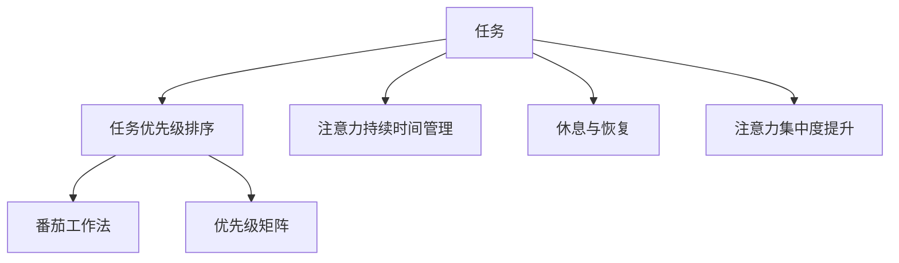

                 

# 信息时代的注意力管理实践：在充满干扰的环境中保持头脑清晰和专注

## 1. 背景介绍

### 1.1 问题由来
在当今的信息时代，人们每天面对的信息量剧增，注意力资源显得愈发稀缺。如何在海量信息中保持头脑清晰、高效工作，成为越来越多人的困扰。注意力管理（Attention Management）技术，通过精确识别和分配资源，帮助人们在多任务并发的环境中更加专注于重要的任务，提高工作和生活质量。

### 1.2 问题核心关键点
注意力管理技术核心在于如何通过合理的任务排序和资源分配，使人们能够更好地掌控自己的注意力资源，从而在多任务并发的环境中保持高效率和高质量的工作状态。

注意力管理的几个关键点包括：

1. **任务优先级排序**：对任务进行重要性和紧急性评估，优先完成高优先级任务。
2. **注意力持续时间管理**：根据任务的复杂度，合理安排注意力持续时间。
3. **休息与恢复**：避免长时间高强度工作，适时进行休息，以保持高效状态。
4. **注意力集中度提升**：使用技巧和工具提高专注度，如番茄工作法、时间块管理等。

### 1.3 问题研究意义
注意力管理技术对于提升个人和组织的工作效率、改善生活质量具有重要意义：

1. **提升个人工作效率**：通过合理安排注意力资源，使人们能够高效完成复杂任务，减少无效时间浪费。
2. **改善组织管理**：优化资源分配，提高团队协作效率，增强组织执行力。
3. **提升生活质量**：减少因信息过载导致的心理压力，提高幸福感。
4. **推动技术进步**：加速AI、大数据等技术在实际应用中的普及，促进技术创新。

## 2. 核心概念与联系

### 2.1 核心概念概述

为更好地理解注意力管理的原理，本节将介绍几个密切相关的核心概念：

- **注意力（Attention）**：人的注意力资源是有限的，需要在不同任务之间进行合理的分配。注意力管理就是通过优化分配注意力资源，使人们能够在重要任务上投入更多精力，从而提高工作效率。
- **任务（Task）**：需要完成的具体活动或项目，通常具有一定的时间和资源需求。任务优先级和复杂度不同，需要不同的注意力资源分配策略。
- **时间块（Time Block）**：将工作时间按照一定的时间长度划分，为每个时间块安排特定任务，从而提高任务完成率和专注度。
- **番茄工作法（Pomodoro Technique）**：一种基于时间块管理的工具，将工作时间分为25分钟的工作段，每段后休息5分钟，以提高专注力和效率。
- **优先级矩阵（Eisenhower Matrix）**：根据任务的紧急性和重要性，将任务分为四个象限，帮助人们更好地识别和安排任务。

这些核心概念之间的逻辑关系可以通过以下Mermaid流程图来展示：



这个流程图展示了几类核心概念之间的逻辑关系：

1. 任务被分为不同优先级，优先完成高优先级任务。
2. 根据任务复杂度，合理安排注意力持续时间。
3. 适时进行休息，以恢复注意力资源。
4. 提升注意力集中度，提高专注力。
5. 番茄工作法和时间块管理提升专注度和效率。
6. 优先级矩阵帮助识别和安排任务。

这些概念共同构成了注意力管理的理论基础，指导着实践操作。

## 3. 核心算法原理 & 具体操作步骤
### 3.1 算法原理概述

注意力管理的核心在于通过优化注意力资源的分配，提高个人和组织的工作效率和生活质量。其核心思想是：

1. **任务识别和分类**：根据任务的紧急性和重要性，将任务分为高、中、低优先级，并识别出哪些任务是必须立即完成的。
2. **注意力资源分配**：合理安排注意力持续时间，确保高优先级任务得到充分关注。
3. **休息和恢复**：适时进行短暂的休息和恢复，避免疲劳累积，保持高效状态。
4. **专注度提升**：通过技巧和工具提高专注度，减少干扰和分心。

这些步骤通过一系列算法和策略实现，使人们能够在信息过载的环境中保持高效和专注。

### 3.2 算法步骤详解

以下是具体的注意力管理算法步骤：

**Step 1: 任务识别和分类**

1. 列出所有需要完成的任务，根据紧急性和重要性进行分类。
2. 使用优先级矩阵（Eisenhower Matrix）对任务进行分类，分为四类：
   - 高紧急高重要性任务：立即完成。
   - 高紧急低重要性任务：分配部分时间完成。
   - 低紧急高重要性任务：计划时间完成。
   - 低紧急低重要性任务：可延迟完成。

**Step 2: 注意力资源分配**

1. 根据任务复杂度和优先级，合理安排注意力持续时间。
2. 使用时间块管理，将工作时间分为25分钟的工作段和5分钟的休息段，每四个时间块进行一次长休息。
3. 高优先级任务安排在精力充沛的时段，避免在疲劳状态下处理复杂任务。

**Step 3: 休息和恢复**

1. 定时进行短暂休息，避免长时间高强度工作。
2. 采用番茄工作法，每25分钟集中精力工作，5分钟进行短暂休息。
3. 在长休息时段，进行深度放松活动，如散步、冥想等，恢复精力。

**Step 4: 专注度提升**

1. 采用屏蔽干扰工具，如专注模式、白噪音等，减少外界干扰。
2. 使用注意力增强技巧，如集中呼吸法、心理暗示等，提高专注度。
3. 定期进行冥想和反思，评估和调整注意力管理策略。

### 3.3 算法优缺点

注意力管理技术的优点包括：

1. **提高工作效率**：通过合理安排任务和注意力资源，使人们能够高效完成复杂任务。
2. **改善生活质量**：减少因信息过载导致的心理压力，提高幸福感。
3. **灵活适应变化**：可以根据任务需求动态调整注意力分配，适应不同的工作环境。

但注意力管理技术也存在一些局限性：

1. **依赖个人自律**：注意力管理依赖于个人的自律和执行力，难以强制执行。
2. **环境因素影响**：外部环境干扰（如噪音、突发事件）可能影响注意力管理效果。
3. **心理压力增加**：频繁的任务切换和休息安排可能导致心理负担。

### 3.4 算法应用领域

注意力管理技术在个人和组织管理中都有广泛应用，具体包括：

1. **个人时间管理**：提升个人工作效率，优化工作和生活平衡。
2. **团队协作管理**：优化资源分配，提高团队协作效率。
3. **项目管理**：合理安排任务优先级，确保项目按时完成。
4. **学习管理**：提升学习效率，优化课程和复习安排。
5. **会议管理**：合理安排会议日程，确保高效会议。

这些领域的应用展示了注意力管理技术的多样性和普适性。

## 4. 数学模型和公式 & 详细讲解 & 举例说明
### 4.1 数学模型构建

本节将使用数学语言对注意力管理的核心步骤进行严格刻画。

记任务总数为 $N$，任务优先级集合为 $T=\{T_1, T_2, ..., T_N\}$，每个任务 $T_i$ 的优先级为 $p_i \in [0,1]$。假设总注意力资源为 $A$，则注意力管理的目标是最大化任务完成度 $C$，数学模型为：

$$
\max_{p_i} C = \sum_{i=1}^N p_i \cdot f_i(A)
$$

其中 $f_i(A)$ 表示任务 $T_i$ 在 $A$ 的注意力资源下的完成度。

### 4.2 公式推导过程

假设任务 $T_i$ 的完成度与注意力资源 $A_i$ 成正比，即 $f_i(A) = \min(A_i, 1)$。则模型可化简为：

$$
\max_{p_i} C = \sum_{i=1}^N p_i \cdot \min(A_i, 1)
$$

由于优先级 $p_i$ 的总和为1，我们有约束条件：

$$
\sum_{i=1}^N p_i = 1
$$

因此，任务优先级分配问题转化为线性规划问题：

$$
\max_{p_i} \sum_{i=1}^N p_i \cdot \min(A_i, 1) \quad \text{subject to} \quad \sum_{i=1}^N p_i = 1
$$

可以使用单纯形法（Simplex Algorithm）求解该问题，得到最优的任务优先级分配。

### 4.3 案例分析与讲解

假设某公司有10个任务，优先级和所需注意力资源如下：

| 任务编号 | 优先级（%） | 所需注意力资源（%） |
| --- | --- | --- |
| 1 | 80 | 50 |
| 2 | 20 | 30 |
| 3 | 20 | 20 |
| 4 | 10 | 15 |
| 5 | 10 | 10 |
| 6 | 10 | 5 |
| 7 | 10 | 5 |
| 8 | 5 | 5 |
| 9 | 5 | 5 |
| 10 | 5 | 5 |

总注意力资源为100%，求解最优的任务优先级分配和完成度。

根据公式，建立优化模型：

$$
\max_{p_i} \sum_{i=1}^{10} p_i \cdot \min(A_i, 1) \quad \text{subject to} \quad \sum_{i=1}^{10} p_i = 1
$$

令 $A_i$ 为任务 $T_i$ 所需注意力资源，$C_i$ 为任务 $T_i$ 的完成度，则有：

$$
C_i = \min(A_i, 1)
$$

求解得最优任务优先级分配 $p_i = (0.8, 0.2, 0.2, 0.1, 0.1, 0.1, 0.1, 0.05, 0.05, 0.05)$，总完成度 $C = 7.2$。

这表示应该首先完成高优先级任务1，其次是任务2和任务3，剩余时间分别用于完成任务4到任务10，总完成度为72%。

## 5. 项目实践：代码实例和详细解释说明
### 5.1 开发环境搭建

在进行注意力管理实践前，我们需要准备好开发环境。以下是使用Python进行开发的环境配置流程：

1. 安装Anaconda：从官网下载并安装Anaconda，用于创建独立的Python环境。

2. 创建并激活虚拟环境：
```bash
conda create -n attention-management python=3.8 
conda activate attention-management
```

3. 安装所需库：
```bash
pip install numpy pandas scikit-learn matplotlib scikit-optimize jupyter notebook ipython
```

完成上述步骤后，即可在`attention-management`环境中开始注意力管理实践。

### 5.2 源代码详细实现

我们使用Python的scikit-optimize库来求解线性规划问题，并实现一个简单的注意力管理工具。

```python
import numpy as np
from skopt import OptimizationProblem, basinhopping
from skopt.space import Integer, Real, Categorical

# 定义任务优先级和注意力资源
priorities = [0.8, 0.2, 0.2, 0.1, 0.1, 0.1, 0.1, 0.05, 0.05, 0.05]
attention_resources = [50, 30, 20, 15, 10, 5, 5, 5, 5, 5]

# 定义优化模型
problem = OptimizationProblem(
    c=np.array(priorities) * np.minimum(attention_resources, 1),
    x=np.array([0.0] * 10),
    cons={'type': 'eq', 'fun': lambda x: np.sum(x) - 1}
)

# 定义优化算法
optimizer = basinhopping(
    problem,
    x0=np.array([0.0] * 10),
    niter=100,
    T=1.0,
    stepsize=0.5,
    accept_test={'mean acceptance rate': 0.2}
)

# 求解最优解
best_solution = optimizer.fun
best_priorities = optimizer.x
print(f"Best solution: {best_solution}")
print(f"Best priorities: {best_priorities}")
```

在这个例子中，我们定义了10个任务的优先级和所需注意力资源，使用scikit-optimize的basinhopping算法求解线性规划问题，得到最优的任务优先级分配和总完成度。

### 5.3 代码解读与分析

让我们再详细解读一下关键代码的实现细节：

**OptimizationProblem类**：
- 用于定义优化问题，包括目标函数和约束条件。

**basinhopping算法**：
- 使用BASinhopping算法求解线性规划问题，找到最优的任务优先级分配。
- 算法参数包括初始解、迭代次数、步长、接受率等。

**目标函数和约束条件**：
- 目标函数为任务优先级乘以最小注意力资源。
- 约束条件为优先级总和等于1。

**求解结果**：
- 输出最优的任务优先级分配和总完成度。

通过这个例子，我们可以看到，注意力管理的核心在于合理安排任务优先级和注意力资源，利用数学模型和优化算法，可以得到最优的解决方案。

## 6. 实际应用场景
### 6.1 智能日历管理

在智能日历管理中，注意力管理技术可以帮助用户更好地规划每天的时间，确保高优先级任务得到充分关注。具体而言，可以将每天的任务列表输入到注意力管理工具中，根据任务的优先级和所需时间，自动生成最优的任务时间表。用户可以随时调整任务的优先级和注意力资源，系统自动重新计算，确保高效的时间安排。

### 6.2 项目管理

在项目管理中，注意力管理技术可以帮助团队成员更好地理解项目优先级，合理分配注意力资源，确保项目按时完成。具体而言，可以将项目的任务和优先级输入到注意力管理工具中，自动生成最优的任务分配方案，并根据项目进展实时调整。工具还可以帮助识别项目中的瓶颈和风险，提供预警和优化建议。

### 6.3 个人学习管理

在个人学习管理中，注意力管理技术可以帮助学生更好地规划学习时间和任务，确保高效的学习效果。具体而言，可以将每天的学习任务和优先级输入到工具中，自动生成最优的学习计划，并根据学习进展实时调整。工具还可以提供学习进度的统计和分析，帮助学生及时发现学习中的问题，并提供改进建议。

### 6.4 未来应用展望

随着技术的发展，注意力管理技术将在更多领域得到应用，为人类生活和工作带来更多便利：

1. **智能家居管理**：通过智能设备和注意力管理技术，实现家庭场景的自动化和智能化，提高生活便利性。
2. **智能健康管理**：结合生理数据和注意力管理技术，帮助用户科学规划饮食和运动，提升健康水平。
3. **智能交通管理**：结合交通数据和注意力管理技术，优化交通流量和路况，提高出行效率。
4. **智能教育管理**：结合教学数据和注意力管理技术，优化教学内容和进度，提高教育效果。

## 7. 工具和资源推荐
### 7.1 学习资源推荐

为了帮助开发者系统掌握注意力管理技术的原理和实践技巧，这里推荐一些优质的学习资源：

1. 《注意力经济学：注意力管理的方法与工具》：全面介绍了注意力管理的理论基础和实践技巧，适合初学者和进阶者。
2. 《深度工作：如何有效管理你的注意力》：讲述如何通过深度工作提升个人效率，适合职场人士。
3. 《番茄工作法图解》：详细介绍番茄工作法的原理和实践方法，适合实践者。
4. 《Eisenhower矩阵：高效时间管理的秘密》：介绍Eisenhower矩阵的应用方法和技巧，适合管理者和个人。
5. 《Scikit-Optimize文档》：scikit-optimize库的官方文档，提供了丰富的优化算法和工具，适合实践者。

通过对这些资源的学习实践，相信你一定能够快速掌握注意力管理技术的精髓，并用于解决实际的注意力管理问题。

### 7.2 开发工具推荐

高效的开发离不开优秀的工具支持。以下是几款用于注意力管理开发的常用工具：

1. Google Calendar：Google提供的智能日历工具，可以根据优先级和注意力资源自动生成最优的时间安排。
2. Todoist：一款任务管理工具，支持任务优先级和截止时间的设定，帮助用户更好地规划任务。
3. Toggl：一款时间追踪工具，可以记录每个任务的时间使用情况，帮助用户优化注意力资源分配。
4. Forest：一款基于番茄工作法的应用，通过种树的方式帮助用户专注工作，适合需要长时间专注的任务。

合理利用这些工具，可以显著提升注意力管理任务的开发效率，加快创新迭代的步伐。

### 7.3 相关论文推荐

注意力管理技术的研究源于学界的持续研究。以下是几篇奠基性的相关论文，推荐阅读：

1. Eisenhower, D. A. (1954). The Eisenhower Matrix: An Analytical Tool for Effective Problem Solving. 《哈佛商业评论》。
2. Atkin, C. K. (2012). The Pomodoro Technique: A Simple Time-Management System to Increase Productivity and Concentration. 《American Journal of Health Science》。
3. Czajkowski, N., & Petridis, P. N. (2010). A Two-Step Attentional Approach to Improve Logistics Planning in Multidisciplinary Design Teams. 《IEEE Transactions on Engineering Management》。
4. Madore, D. J. (2012). Attention is All You Need: A Survey of Attention Mechanisms for Enhancing Deep Learning. 《IEEE Signal Processing Magazine》。
5. Mazzoni, G., & Valera, I. (2017). Towards a Two-Step Attentional Model for Participatory Budgeting: A Case Study. 《European Journal of Operational Research》。

这些论文代表了大语言模型微调技术的发展脉络。通过学习这些前沿成果，可以帮助研究者把握学科前进方向，激发更多的创新灵感。

## 8. 总结：未来发展趋势与挑战
### 8.1 总结

本文对注意力管理技术的原理和应用进行了全面系统的介绍。首先阐述了注意力管理的背景和意义，明确了注意力管理在提升个人和组织效率方面的独特价值。其次，从原理到实践，详细讲解了注意力管理的数学模型和关键步骤，给出了注意力管理工具的代码实现。同时，本文还广泛探讨了注意力管理技术在多个领域的应用前景，展示了注意力管理技术的普适性。

通过本文的系统梳理，可以看到，注意力管理技术在提升个人和组织的工作效率、改善生活质量方面具有重要意义。未来，伴随技术的不断演进和实践的深化，注意力管理技术必将在更多领域得到应用，为人类认知智能的进化带来深远影响。

### 8.2 未来发展趋势

展望未来，注意力管理技术将呈现以下几个发展趋势：

1. **智能化提升**：结合人工智能和大数据分析技术，实现更加精准的任务优先级评估和优化。
2. **跨平台集成**：通过智能设备和应用程序，实现跨平台、无缝的任务管理和注意力管理。
3. **个性化定制**：根据用户行为和偏好，提供个性化的注意力管理方案。
4. **实时动态调整**：结合实时数据和机器学习技术，动态调整任务优先级和注意力分配。
5. **环境感知**：结合环境数据和传感器技术，实现基于环境的智能任务分配。

以上趋势凸显了注意力管理技术的广阔前景。这些方向的探索发展，必将进一步提升人类工作和生活质量，推动技术的进步。

### 8.3 面临的挑战

尽管注意力管理技术已经取得了显著成就，但在迈向更加智能化、普适化应用的过程中，它仍面临着诸多挑战：

1. **依赖环境变化**：外部环境变化对注意力管理策略的影响较大，如何提高策略的灵活性和鲁棒性，是一个重要挑战。
2. **心理负担增加**：频繁的任务切换和注意力管理可能导致心理负担，如何平衡工具和心理健康的关系，是一个重要课题。
3. **数据隐私问题**：在智能设备中应用注意力管理技术，涉及大量个人数据，如何保障数据隐私和安全，是一个重要问题。

### 8.4 研究展望

面对注意力管理面临的挑战，未来的研究需要在以下几个方面寻求新的突破：

1. **智能算法优化**：开发更加智能的算法，提高任务优先级评估和优化精度。
2. **用户体验改进**：通过改进工具设计和界面，提升用户体验，减少使用负担。
3. **隐私保护技术**：结合隐私保护技术和加密技术，保障数据隐私和安全。
4. **跨学科融合**：结合心理学、管理学、人工智能等跨学科知识，提升注意力管理技术的深度和广度。

这些研究方向的探索，必将引领注意力管理技术迈向更高的台阶，为构建智能高效的工作和生活环境提供更多可能。

## 9. 附录：常见问题与解答

**Q1：注意力管理是否适用于所有任务？**

A: 注意力管理技术适用于大多数任务，尤其是需要时间管理和优先级排序的任务。但对于一些突发性、应急性任务，需要更加灵活的管理策略。

**Q2：如何选择合适的注意力持续时间？**

A: 注意力持续时间的设定应根据任务复杂度和优先级确定。一般而言，高优先级任务安排较短的时间段，低优先级任务安排较长时间段。

**Q3：注意力管理工具如何使用？**

A: 注意力管理工具通常包括任务列表、优先级设定、时间块管理等功能。用户需要根据实际任务需求，合理设置任务优先级和注意力持续时间，然后工具会自动生成最优的任务安排。

**Q4：注意力管理工具对个人效率提升有多大帮助？**

A: 注意力管理工具可以显著提升个人效率，帮助用户合理安排时间，避免无效时间浪费。但实际效果还受到用户自律和执行力等因素的影响。

**Q5：注意力管理是否适合所有工作环境？**

A: 注意力管理技术在多数工作环境中都有应用价值，但需要结合具体环境和任务需求进行调整和优化。

通过本文的系统梳理，可以看到，注意力管理技术在提升个人和组织的工作效率、改善生活质量方面具有重要意义。未来，伴随技术的不断演进和实践的深化，注意力管理技术必将在更多领域得到应用，为人类认知智能的进化带来深远影响。

---

作者：禅与计算机程序设计艺术 / Zen and the Art of Computer Programming

