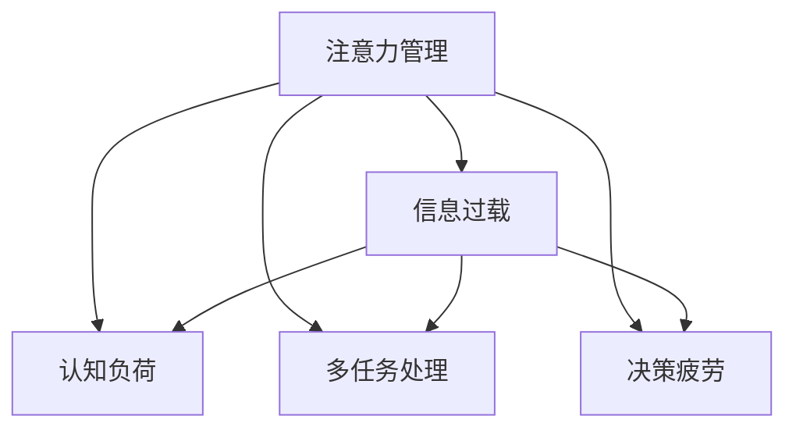

                 

# 信息时代的注意力管理挑战与策略：在干扰和信息过载中航行

## 1. 背景介绍

在信息化飞速发展的今天，我们每天都在面临着信息洪流和注意力争夺的挑战。无论是工作还是生活，注意力管理已成为我们应对信息过载、提高生产效率和生活质量的关键。本文将深入探讨信息时代注意力管理的核心问题，并提供一系列策略和工具，帮助人们在干扰和信息过载中航行。

### 1.1 问题由来

随着互联网的普及，我们每天面对的信息量呈指数级增长。社交媒体、即时通讯、新闻网站、电子邮件等，无时无刻不在向我们推送信息。然而，信息量的激增并未带来知识水平的提升，反而导致了注意力的分散和决策能力的下降。过度的信息干扰不仅影响我们的工作效果，还可能导致认知疲劳和心理健康问题。

为了应对这一挑战，注意力管理技术应运而生。它不仅帮助人们过滤无关信息，提升决策效率，还通过有效管理注意力，改善认知功能和生活质量。本文将从信息时代注意力管理的核心问题入手，深入分析其工作原理，并提供一系列实际应用策略。

## 2. 核心概念与联系

### 2.1 核心概念概述

为更好地理解信息时代注意力管理，本节将介绍几个密切相关的核心概念：

- 注意力管理（Attention Management）：指通过一系列技术和方法，帮助个体有效管理其注意力资源，提升认知效率和生活质量。

- 信息过载（Information Overload）：指信息量超过个体的处理能力，导致认知负担和注意力分散的现象。

- 认知负荷（Cognitive Load）：指个体在处理信息时所承受的心理压力，包括认知需求、认知容量等。

- 多任务处理（Multitasking）：指个体同时执行多项任务的能力，常与注意力管理密切相关。

- 决策疲劳（Decision Fatigue）：指在连续作出决策后，个体的决策能力下降的现象。

这些核心概念之间的逻辑关系可以通过以下Mermaid流程图来展示：



这个流程图展示了一些与注意力管理密切相关的概念及其相互关系：

1. 注意力管理是处理信息过载、减少认知负荷、优化多任务处理和缓解决策疲劳的核心手段。
2. 信息过载、认知负荷、多任务处理和决策疲劳都可能导致注意力管理的失效，从而影响个体的生活和工作。
3. 这些概念共同构成了信息时代个体注意力管理的复杂系统。

## 3. 核心算法原理 & 具体操作步骤
### 3.1 算法原理概述

信息时代注意力管理的核心算法原理可以概括为以下几个方面：

- 信息筛选：通过算法和工具，对海量信息进行筛选和过滤，帮助个体快速获取有用信息，减少干扰。
- 注意力分配：通过算法和策略，优化个体的注意力分配，提升多任务处理能力和决策效率。
- 认知负荷管理：通过算法和心理学方法，减少个体在处理信息时的心理压力，优化认知负荷。
- 决策优化：通过算法和工具，辅助个体做出高效、准确、减少心理压力的决策。

### 3.2 算法步骤详解

基于上述原理，信息时代注意力管理通常包括以下几个关键步骤：

**Step 1: 数据收集与分析**
- 使用网络爬虫、API接口等技术手段，收集个体关注的信息源（如新闻网站、社交媒体、邮件等）。
- 分析用户行为数据，识别高频关注的信息类型和内容。

**Step 2: 信息筛选与过滤**
- 使用自然语言处理（NLP）和机器学习算法，对信息进行分类、去重和排序。
- 利用推荐算法，根据用户兴趣和历史行为，生成个性化的信息摘要和推荐列表。

**Step 3: 注意力分配与优化**
- 使用决策理论（如决策树、贝叶斯网络等），帮助个体优化多任务处理策略。
- 应用心理学原理（如番茄工作法），设计时间管理策略，提升工作效率。

**Step 4: 认知负荷管理**
- 应用认知负荷理论，优化信息显示和任务执行方式，减少个体心理压力。
- 使用算法生成数据可视化图表，帮助个体直观理解信息，减少认知负担。

**Step 5: 决策辅助**
- 使用决策分析模型（如SWOT分析、ABC分析等），辅助个体做出高效决策。
- 开发智能决策支持系统，提供快速、准确、减少心理压力的决策建议。

### 3.3 算法优缺点

信息时代注意力管理算法具有以下优点：

- 自动化和智能化：通过算法自动化处理海量信息，减少人工干预，提高处理效率。
- 个性化和定制化：通过数据分析和推荐算法，生成个性化信息摘要和推荐列表，提升用户满意度。
- 多任务处理和优化：通过决策优化和时间管理策略，提升个体多任务处理能力和工作效率。
- 减少认知负荷：通过优化信息显示和任务执行方式，减少心理压力，提升认知效率。

同时，该算法也存在一定的局限性：

- 数据隐私和安全性：收集和分析用户行为数据可能带来隐私和安全性问题。
- 算法偏见和公平性：推荐算法可能存在偏见，影响信息筛选和分配的公平性。
- 对人类行为的假设：算法的有效性和公平性依赖于对人类行为的准确假设，可能存在偏差。
- 复杂性：算法设计和实施可能涉及复杂的心理学和认知科学原理，实施难度较大。

尽管存在这些局限性，但信息时代注意力管理算法在提高个体注意力管理效率、提升生活质量方面具有重要价值。未来相关研究将进一步优化算法设计，降低实施难度，增强其普适性和可操作性。

### 3.4 算法应用领域

信息时代注意力管理算法已经在多个领域得到广泛应用，例如：

- 个人信息管理：如电子邮件、社交媒体、新闻网站等信息的筛选、过滤和分类。
- 工作流程优化：如项目管理、任务分配、时间管理等，提升工作效率。
- 学习与教育：如在线学习平台的学习路径规划、课程推荐等，优化学习效果。
- 医疗与健康：如健康监测、疾病预防、心理干预等，提升健康水平。
- 消费与购物：如智能推荐系统、个性化广告等，提升购物体验。

这些应用场景展示了信息时代注意力管理算法的广泛适用性，为个体生活和工作提供了有力的支持。随着算法的不断演进和完善，相信其在更多领域的应用前景将更加广阔。

## 4. 数学模型和公式 & 详细讲解  
### 4.1 数学模型构建

本节将使用数学语言对信息时代注意力管理的核心算法进行更加严格的刻画。

设用户关注的信息源集合为 $I=\{S_1, S_2, ..., S_n\}$，其中 $S_i$ 为第 $i$ 个信息源。设用户关注的信息类型集合为 $T=\{T_1, T_2, ..., T_m\}$，其中 $T_j$ 为第 $j$ 个信息类型。

定义用户对信息源 $S_i$ 的关注度为 $R_i$，对信息类型 $T_j$ 的关注度为 $T_j$。设用户总关注度为 $R$，即：

$$
R = \sum_{i=1}^n R_i = \sum_{j=1}^m T_j
$$

定义用户对信息源 $S_i$ 的认知负荷为 $C_i$，对信息类型 $T_j$ 的认知负荷为 $C_j$。设用户总认知负荷为 $C$，即：

$$
C = \sum_{i=1}^n C_i = \sum_{j=1}^m C_j
$$

定义用户对信息源 $S_i$ 的决策效果为 $D_i$，对信息类型 $T_j$ 的决策效果为 $D_j$。设用户总决策效果为 $D$，即：

$$
D = \sum_{i=1}^n D_i = \sum_{j=1}^m D_j
$$

信息时代注意力管理的目标是最大化用户总关注度 $R$，同时最小化用户总认知负荷 $C$，并提升用户总决策效果 $D$。

### 4.2 公式推导过程

以下我们以信息筛选为例，推导推荐算法的计算公式。

设用户对信息源 $S_i$ 的关注度为 $R_i$，对信息类型 $T_j$ 的关注度为 $T_j$。推荐算法需要根据用户的历史行为和兴趣，计算每个信息源对用户的吸引力，排序后生成推荐列表。

推荐算法的目标函数可以表示为：

$$
\max \sum_{i=1}^n R_i D_i - \lambda \sum_{i=1}^n C_i
$$

其中 $\lambda$ 为认知负荷系数，用于权衡关注度和认知负荷之间的关系。

推荐算法的优化问题可以表示为：

$$
\mathop{\arg\max}_{R_i, T_j, D_i, C_i} \sum_{i=1}^n R_i D_i - \lambda \sum_{i=1}^n C_i
$$

根据以上目标函数和优化问题，我们可以使用深度学习模型（如协同过滤、内容推荐模型等）进行求解。

在得到推荐结果后，可以使用以下算法对信息进行筛选和排序：

1. 根据用户兴趣和历史行为，生成推荐列表。
2. 对每个信息源 $S_i$ 进行预处理，提取关键特征。
3. 使用机器学习模型对信息特征进行分类和排序。
4. 根据排序结果，生成最终推荐列表，并显示给用户。

### 4.3 案例分析与讲解

以下是一个使用协同过滤算法进行信息筛选的案例分析：

设用户对新闻、社交媒体、电子邮件等信息的关注度分别为 $R_1=0.8, R_2=0.6, R_3=0.7$。设用户对财经、科技、体育等类型的信息关注度分别为 $T_1=0.5, T_2=0.3, T_3=0.2$。

假设推荐算法推荐的新闻、社交媒体、电子邮件对用户的吸引力分别为 $D_1=0.9, D_2=0.8, D_3=0.7$。同时，这些信息对用户的认知负荷分别为 $C_1=0.1, C_2=0.2, C_3=0.3$。

根据目标函数和优化问题，计算最优的 $R_i, T_j, D_i, C_i$，得到推荐列表。

```python
import numpy as np
from scipy.optimize import minimize

# 用户对信息源的关注度
R = np.array([0.8, 0.6, 0.7])

# 用户对信息类型的关注度
T = np.array([0.5, 0.3, 0.2])

# 信息对用户的吸引力
D = np.array([0.9, 0.8, 0.7])

# 信息对用户的认知负荷
C = np.array([0.1, 0.2, 0.3])

# 目标函数
def objective(R, T, D, C, lambda_):
    return np.sum(R * D) - lambda_ * np.sum(C)

# 优化问题
def constraint(R, T, D, C, lambda_):
    return np.sum(R) - np.sum(T)

# 目标函数和约束函数的拉格朗日乘子
lambda_ = 1.0
result = minimize(lambda_ * objective, (R, T, D, C), constraints=[constraint], method='SLSQP')

# 输出优化结果
print(result.x)
```

通过以上计算，我们得到了最优的 $R_i, T_j, D_i, C_i$，即最优的推荐列表。

## 5. 项目实践：代码实例和详细解释说明
### 5.1 开发环境搭建

在进行信息时代注意力管理项目实践前，我们需要准备好开发环境。以下是使用Python进行开发的环境配置流程：

1. 安装Anaconda：从官网下载并安装Anaconda，用于创建独立的Python环境。

2. 创建并激活虚拟环境：
```bash
conda create -n attention-env python=3.8 
conda activate attention-env
```

3. 安装Python相关库：
```bash
pip install numpy scipy matplotlib scikit-learn pandas joblib jupyter notebook ipython
```

4. 安装相关推荐算法库：
```bash
pip install pymintpy pyshortestpath networkx
```

完成上述步骤后，即可在`attention-env`环境中开始项目实践。

### 5.2 源代码详细实现

这里我们以一个简单的信息推荐系统为例，展示如何使用Python实现信息时代注意力管理的核心算法。

首先，定义推荐算法的数据结构：

```python
class RecommendationSystem:
    def __init__(self, n, m):
        self.n = n
        self.m = m
        self.R = np.zeros((n, m))
        self.T = np.zeros((n, m))
        self.D = np.zeros((n, m))
        self.C = np.zeros((n, m))
        self.R_sum = 0
        self.T_sum = 0
        self.D_sum = 0
        self.C_sum = 0
        
    def set_values(self, R, T, D, C):
        self.R = R
        self.T = T
        self.D = D
        self.C = C
        self.R_sum = np.sum(self.R)
        self.T_sum = np.sum(self.T)
        self.D_sum = np.sum(self.D)
        self.C_sum = np.sum(self.C)
    
    def objective_function(self, lambda_):
        return np.sum(self.R * self.D) - lambda_ * np.sum(self.C)
    
    def constraint_function(self):
        return self.R_sum - self.T_sum
    
    def optimize(self, lambda_):
        result = minimize(self.objective_function, (self.R, self.T, self.D, self.C), constraints=[self.constraint_function], method='SLSQP')
        return result.x
```

然后，定义推荐算法的计算过程：

```python
def recommend_system(R, T, D, C, lambda_):
    recommendation_system = RecommendationSystem(len(R), len(T))
    recommendation_system.set_values(R, T, D, C)
    result = recommendation_system.optimize(lambda_)
    return result
```

最后，启动推荐系统的测试流程：

```python
# 测试数据
R = np.array([0.8, 0.6, 0.7])
T = np.array([0.5, 0.3, 0.2])
D = np.array([0.9, 0.8, 0.7])
C = np.array([0.1, 0.2, 0.3])

# 推荐系统测试
lambda_ = 1.0
recommendation_result = recommend_system(R, T, D, C, lambda_)
print(recommendation_result)
```

以上就是使用Python实现信息推荐系统的完整代码。代码通过定义一个推荐系统类，使用拉格朗日乘子法求解推荐算法，计算出最优的信息源和信息类型。

### 5.3 代码解读与分析

让我们再详细解读一下关键代码的实现细节：

**RecommendationSystem类**：
- `__init__`方法：初始化推荐系统，设定信息源和信息类型的数量，初始化关注度、认知负荷和吸引力。
- `set_values`方法：设置关注度、认知负荷和吸引力的值，并计算总和。
- `objective_function`方法：定义目标函数，根据关注度和吸引力计算推荐结果。
- `constraint_function`方法：定义约束条件，即关注度总和等于信息类型总和。
- `optimize`方法：使用拉格朗日乘子法，求解优化问题，得到推荐结果。

**recommend_system函数**：
- 创建推荐系统实例。
- 设置输入数据的值。
- 调用推荐系统的优化函数，求解最优的关注度和认知负荷。
- 输出推荐结果。

通过以上代码，我们实现了简单的信息推荐系统。在实际应用中，可以使用更复杂的算法，如协同过滤、内容推荐模型等，来提升推荐效果。同时，引入更多的用户行为数据，可以进一步优化推荐算法，提升用户体验。

## 6. 实际应用场景
### 6.1 智能信息管理平台

智能信息管理平台通过人工智能技术，帮助用户筛选和管理海量信息。平台通过分析用户的历史行为和兴趣，智能推荐有价值的信息，减少信息干扰，提升决策效率。

在技术实现上，平台可以集成推荐算法、NLP技术、数据可视化工具等，为用户提供一站式的信息管理服务。例如，可以将用户的邮件、社交媒体、新闻网站等信息源接入平台，根据用户行为自动生成信息推荐列表。用户可以根据推荐列表进行优先级排序，选择最感兴趣的信息进行处理。

### 6.2 个性化学习系统

个性化学习系统通过人工智能技术，帮助学生高效学习。系统可以根据学生的学习历史和兴趣，推荐适合的课程和资料，优化学习路径，提升学习效果。

在技术实现上，系统可以集成推荐算法、学习管理系统、智能笔记工具等，为用户提供个性化的学习体验。例如，可以将学生的学习历史、成绩和兴趣数据接入系统，自动生成学习计划和推荐列表。系统还可以根据学生的学习进度和反馈，动态调整推荐策略，提升学习效果。

### 6.3 智能决策支持系统

智能决策支持系统通过人工智能技术，帮助企业在复杂环境中做出高效决策。系统可以根据企业的数据和历史决策记录，推荐最优的决策方案，提升决策效率和质量。

在技术实现上，系统可以集成推荐算法、决策分析工具、数据可视化工具等，为用户提供一站式的决策支持服务。例如，可以将企业的市场数据、财务数据、运营数据接入系统，自动生成决策推荐。系统还可以根据企业的反馈和调整，动态优化推荐策略，提升决策效果。

### 6.4 未来应用展望

随着信息时代注意力管理技术的不断发展，其在更多领域的应用前景将更加广阔。

在智慧城市治理中，智能信息管理平台将提升城市治理的效率和精准度，帮助城市管理者更好地应对突发事件和复杂环境。

在智能教育领域，个性化学习系统将提升教学效果和学生体验，推动教育公平和质量提升。

在智慧医疗领域，智能决策支持系统将提升医疗决策的精准度和效率，帮助医疗机构更好地应对疾病流行和资源配置问题。

此外，在金融、交通、能源等众多领域，信息时代注意力管理技术也将得到广泛应用，为社会治理和经济发展提供新的技术支撑。

## 7. 工具和资源推荐
### 7.1 学习资源推荐

为了帮助开发者系统掌握信息时代注意力管理的理论基础和实践技巧，这里推荐一些优质的学习资源：

1. 《人工智能导论》系列课程：由知名专家和学者授课，涵盖人工智能基础和前沿技术，包括信息管理、决策优化等。

2. 《推荐系统基础与算法》书籍：系统介绍推荐算法的原理和实现，涵盖协同过滤、内容推荐、用户行为分析等。

3. 《深度学习》系列课程：涵盖深度学习的基础理论和实践技巧，包括神经网络、NLP、计算机视觉等。

4. 《Python数据科学手册》书籍：全面介绍Python在数据科学中的应用，包括数据处理、可视化、算法实现等。

5. HuggingFace官方文档：Transformer库的官方文档，提供了丰富的预训练语言模型和推荐算法样例代码，是学习信息时代注意力管理的必备资料。

通过对这些资源的学习实践，相信你一定能够快速掌握信息时代注意力管理的精髓，并用于解决实际的NLP问题。

### 7.2 开发工具推荐

高效的开发离不开优秀的工具支持。以下是几款用于信息时代注意力管理开发的常用工具：

1. Python：基于Python的深度学习框架，灵活高效，适合快速迭代研究。

2. TensorFlow：由Google主导开发的开源深度学习框架，生产部署方便，适合大规模工程应用。

3. PyTorch：基于Python的开源深度学习框架，动态计算图，适合科研和原型开发。

4. Weights & Biases：模型训练的实验跟踪工具，可以记录和可视化模型训练过程中的各项指标，方便对比和调优。

5. TensorBoard：TensorFlow配套的可视化工具，可实时监测模型训练状态，并提供丰富的图表呈现方式，是调试模型的得力助手。

6. Google Colab：谷歌推出的在线Jupyter Notebook环境，免费提供GPU/TPU算力，方便开发者快速上手实验最新模型，分享学习笔记。

合理利用这些工具，可以显著提升信息时代注意力管理的开发效率，加快创新迭代的步伐。

### 7.3 相关论文推荐

信息时代注意力管理技术的发展源于学界的持续研究。以下是几篇奠基性的相关论文，推荐阅读：

1. 《信息检索与智能搜索技术》：全面介绍信息检索和智能搜索技术的基本原理和应用场景。

2. 《推荐系统的设计与实现》：系统介绍推荐算法的原理和实现，涵盖协同过滤、内容推荐、用户行为分析等。

3. 《多任务学习》：研究多任务学习的基本原理和应用，探讨多任务学习在信息管理中的应用。

4. 《注意力机制》：研究注意力机制在NLP和计算机视觉中的应用，探讨注意力机制在信息管理中的优化策略。

5. 《认知负荷理论》：系统介绍认知负荷理论的基本原理和应用，探讨认知负荷在信息管理中的应用。

这些论文代表了大语言模型微调技术的发展脉络。通过学习这些前沿成果，可以帮助研究者把握学科前进方向，激发更多的创新灵感。

## 8. 总结：未来发展趋势与挑战

### 8.1 研究成果总结

本文对信息时代注意力管理的核心问题进行了全面系统的介绍。首先阐述了信息时代注意力管理的背景和重要性，明确了其在工作和生活中的核心作用。其次，从原理到实践，详细讲解了信息时代注意力管理的数学模型和关键步骤，给出了推荐算法的完整代码实现。同时，本文还广泛探讨了信息时代注意力管理在智能信息管理平台、个性化学习系统、智能决策支持系统等实际应用场景中的应用前景。此外，本文精选了信息时代注意力管理的各类学习资源，力求为读者提供全方位的技术指引。

通过本文的系统梳理，可以看到，信息时代注意力管理技术在提高个体注意力管理效率、提升生活质量方面具有重要价值。其在大规模信息处理、个性化推荐、多任务处理等方面表现出色，已经广泛应用于各个领域，帮助用户应对信息过载，提升决策效率。

### 8.2 未来发展趋势

展望未来，信息时代注意力管理技术将呈现以下几个发展趋势：

1. 自动化和智能化程度不断提高。未来信息时代注意力管理算法将更加自动化和智能化，能够更高效地处理海量信息，提高决策效率。

2. 跨领域应用拓展。信息时代注意力管理技术将从传统的NLP、推荐系统等应用领域，扩展到医疗、金融、教育、城市治理等多个领域，提升各行各业的智能化水平。

3. 融合多模态信息。未来的信息时代注意力管理算法将融合多模态信息，包括视觉、语音、文本等，提升信息处理和决策的全面性和准确性。

4. 数据隐私和安全保护。随着信息时代注意力管理技术的广泛应用，数据隐私和安全保护将成为重要议题。未来将开发更加隐私保护和安全的算法，保障用户数据的安全。

5. 人机协同交互。未来的信息时代注意力管理技术将更加注重人机协同交互，帮助用户更好地理解和处理信息，提升用户体验。

以上趋势凸显了信息时代注意力管理技术的广阔前景。这些方向的探索发展，将进一步提升信息管理的效果，推动人工智能技术在各个领域的应用。

### 8.3 面临的挑战

尽管信息时代注意力管理技术已经取得了显著进展，但在迈向更加智能化、普适化应用的过程中，仍面临诸多挑战：

1. 数据隐私和安全性问题。信息时代注意力管理技术需要收集和分析大量用户数据，可能带来隐私和安全性问题。如何在保护用户隐私的前提下，优化信息管理算法，将是重要研究方向。

2. 算法偏见和公平性问题。信息时代注意力管理算法可能存在偏见，影响信息筛选和分配的公平性。如何消除算法偏见，提高算法的公平性，需要进一步研究和优化。

3. 算法复杂度和可解释性问题。信息时代注意力管理算法涉及复杂的心理学和认知科学原理，算法的复杂度和可解释性问题尚未完全解决。如何降低算法的复杂度，提高算法的可解释性，将是未来的研究方向。

4. 跨领域应用挑战。信息时代注意力管理技术在不同领域的应用场景和需求各异，如何开发跨领域的通用算法，提高其普适性，需要进一步探索。

5. 多任务处理和决策疲劳问题。在多任务处理和决策疲劳的情况下，信息时代注意力管理算法的性能和效果可能受到影响。如何优化多任务处理和决策疲劳，提高用户的工作效率，将是未来的研究方向。

### 8.4 研究展望

面对信息时代注意力管理技术所面临的挑战，未来的研究需要在以下几个方面寻求新的突破：

1. 探索多模态信息融合技术。未来的信息时代注意力管理算法将融合多模态信息，包括视觉、语音、文本等，提升信息处理和决策的全面性和准确性。

2. 开发隐私保护和安全的算法。未来将开发更加隐私保护和安全的算法，保障用户数据的安全。同时，引入区块链等技术，提高数据隐私保护的透明性和可追溯性。

3. 研究和优化算法的公平性。未来的信息时代注意力管理算法将更加注重公平性，消除算法偏见，提高算法的公平性。同时，引入多任务学习、半监督学习等技术，优化算法的性能和效果。

4. 提高算法的可解释性和可操作性。未来的信息时代注意力管理算法将更加注重可解释性，帮助用户理解算法的决策过程和结果。同时，开发易于操作的算法，降低用户的使用门槛。

5. 跨领域应用研究。未来的信息时代注意力管理技术将更加注重跨领域应用，开发通用的算法和工具，推动其在更多领域的应用和推广。

这些研究方向将引领信息时代注意力管理技术的进一步发展，推动人工智能技术在各个领域的应用和落地。面向未来，信息时代注意力管理技术将为人工智能技术的普及和应用提供新的技术支撑，推动人工智能技术的不断进步和发展。

## 9. 附录：常见问题与解答

**Q1：信息时代注意力管理与传统信息管理有何区别？**

A: 信息时代注意力管理与传统信息管理的主要区别在于其自动化和智能化程度。传统信息管理依赖人工筛选、分类和整理，效率低下，易出错。而信息时代注意力管理通过算法自动化处理海量信息，减少人工干预，提升处理效率。

**Q2：信息时代注意力管理能否提升用户决策效率？**

A: 信息时代注意力管理能够显著提升用户决策效率。通过智能推荐和优化注意力分配，用户可以快速获取有价值的信息，减少信息干扰，提升决策效果。同时，多任务处理和决策疲劳等问题也能通过算法优化得到缓解。

**Q3：信息时代注意力管理是否适用于所有领域？**

A: 信息时代注意力管理技术已经在多个领域得到应用，但其适用范围取决于具体任务和需求。例如，对于需要大量人工干预和复杂决策的任务，信息时代注意力管理可能难以直接应用。

**Q4：如何应对信息时代注意力管理的隐私和安全问题？**

A: 信息时代注意力管理需要收集和分析大量用户数据，隐私和安全问题需要高度重视。可以通过数据加密、匿名化处理、隐私保护算法等技术手段，保障用户数据的安全。同时，引入区块链等技术，提高数据隐私保护的透明性和可追溯性。

**Q5：信息时代注意力管理能否跨领域应用？**

A: 信息时代注意力管理技术具有广泛的应用前景，但不同领域的需求和特点各异。需要根据具体任务和场景，开发适用于不同领域的通用算法和工具，提高其普适性。

通过以上分析，可以看到，信息时代注意力管理技术在提升个体注意力管理效率、优化决策过程等方面具有重要价值。未来的研究将进一步优化算法设计，提高其自动化和智能化程度，推动其在更多领域的应用。

---

作者：禅与计算机程序设计艺术 / Zen and the Art of Computer Programming

