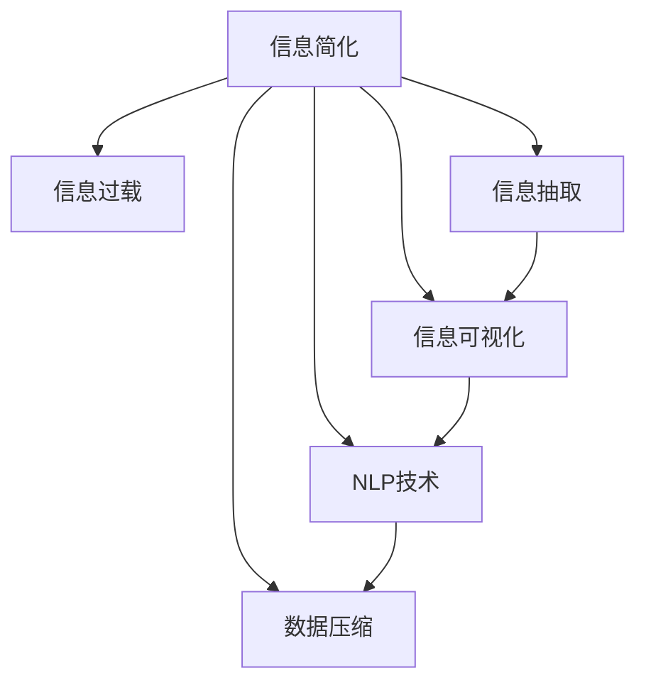

                 

# 信息简化的原则与艺术：在混乱中建立秩序与简化

## 1. 背景介绍

### 1.1 问题由来

在信息化时代，信息量呈指数级增长，数据的庞杂和无序给我们的生活和工作带来了巨大的挑战。从企业决策到日常沟通，信息的有效传递和准确理解变得尤为重要。然而，面对信息的海洋，我们往往感到无所适从。如何简化信息，使其变得易于理解、易于使用，成为当前信息化建设的重要课题。

### 1.2 问题核心关键点

信息简化旨在通过精简和结构化信息，提升信息传递的效率和准确性，降低理解成本，增强决策效果。核心在于将复杂的信息分解为可操作、可解释的模块，使得信息接收者能够快速理解和应用。

### 1.3 问题研究意义

信息简化不仅是提升信息效率的有效手段，更是信息时代的重要基础设施建设。通过信息简化，可以实现：

1. 提升决策质量：简化的信息有助于快速理解和准确判断，减少信息过载对决策的影响。
2. 降低沟通成本：简化的信息结构明确，减少了误解和沟通障碍，提高沟通效率。
3. 促进数据驱动：简化的数据易于处理和分析，有助于数据驱动的决策和业务优化。
4. 增强用户体验：简化的信息界面友好，提高用户的满意度和使用体验。
5. 推动技术创新：信息简化催生了信息抽取、文本压缩、自然语言处理等新技术，为信息时代的技术发展提供了动力。

## 2. 核心概念与联系

### 2.1 核心概念概述

为更好地理解信息简化的艺术，本节将介绍几个核心概念：

- 信息简化：通过精简、结构化和可操作化，将复杂的信息变得易于理解和应用的过程。
- 信息过载：指信息接收者面临的信息量超出其处理能力，导致信息理解困难、决策迟缓的现象。
- 信息抽取：从原始数据中自动提取关键信息，生成结构化数据，为信息简化提供数据基础。
- 信息可视化：将复杂的信息以图表、图形等形式展示，使其更直观、易理解。
- 自然语言处理(NLP)：通过计算机对人类语言进行处理，实现信息的自动化理解、生成和处理。
- 数据压缩：通过算法对信息进行压缩，减少存储空间和传输带宽，提升信息处理效率。

这些核心概念之间的逻辑关系可以通过以下Mermaid流程图来展示：



这个流程图展示了几项关键技术及其之间的关系：

1. 信息简化解决信息过载问题，其数据来源包括信息抽取和数据压缩。
2. 信息可视化将简化的信息直观展示。
3. NLP技术用于自动化信息处理和生成。

这些核心概念共同构成了信息简化的技术框架，使其能够在各种场景下发挥重要作用。

## 3. 核心算法原理 & 具体操作步骤

### 3.1 算法原理概述

信息简化的核心算法原理是通过精简、结构化和可视化等手段，将复杂信息转化为易于理解和应用的形式。具体来说，可以分为以下几个步骤：

1. 数据预处理：对原始数据进行清洗、分类和格式化，使其符合标准化的数据格式。
2. 信息抽取：从原始数据中自动提取关键信息，生成结构化数据。
3. 信息压缩：通过算法对结构化数据进行压缩，减少存储空间和传输带宽。
4. 信息可视化：将压缩后的数据以图表、图形等形式展示，使其更直观、易理解。
5. 信息应用：将简化的信息应用于实际场景，提升信息传递效率和决策效果。

### 3.2 算法步骤详解

1. **数据预处理**：
   - 清洗原始数据，去除噪声和无关信息，确保数据质量。
   - 对数据进行分类和格式化，生成统一的数据格式，便于后续处理。

2. **信息抽取**：
   - 使用自然语言处理技术，从文本中自动提取关键信息，如实体、事件、关系等。
   - 生成结构化数据，便于后续的信息分析和应用。

3. **信息压缩**：
   - 使用压缩算法对结构化数据进行编码压缩，减少存储空间和传输带宽。
   - 常见的压缩算法包括霍夫曼编码、LZ77、LZ78等。

4. **信息可视化**：
   - 将压缩后的数据以图表、图形等形式展示，如柱状图、折线图、热力图等。
   - 使用可视化工具如Tableau、Power BI等，生成直观易理解的信息展示。

5. **信息应用**：
   - 将简化的信息应用于实际场景，如数据报表、决策支持、项目管理等。
   - 根据简化的信息，进行数据驱动的决策和业务优化。

### 3.3 算法优缺点

信息简化的算法具有以下优点：

1. 提升信息效率：通过数据预处理、信息抽取和压缩，减少了信息处理的复杂度，提升了信息传递效率。
2. 降低理解成本：简化的信息结构明确，减少了误解和沟通障碍，提高了信息理解速度。
3. 增强决策效果：简化的信息有助于快速理解和准确判断，减少信息过载对决策的影响。
4. 优化资源利用：通过压缩算法，减少了数据存储和传输的资源消耗。

然而，信息简化也存在一些缺点：

1. 依赖技术：信息简化依赖于自然语言处理和数据压缩等技术，技术门槛较高。
2. 信息损失：压缩算法可能导致部分信息的损失，需要在精度和效率之间进行权衡。
3. 适用性有限：对于某些特定领域或数据类型，信息简化的效果可能不佳。

尽管存在这些局限性，但就目前而言，信息简化的算法仍是大规模数据处理和信息传递的重要手段。未来相关研究的重点在于如何进一步降低技术门槛，提高压缩算法的精度和效率，同时兼顾适用性和准确性。

### 3.4 算法应用领域

信息简化技术已经广泛应用于各个领域，例如：

- 商业分析：通过信息简化，快速生成关键数据报表和分析报告，支持企业决策。
- 健康管理：将健康数据简化为易于理解的格式，支持患者健康管理和医生诊断。
- 金融风控：对金融数据进行简化和分析，辅助风险评估和管理。
- 智慧城市：将城市管理数据简化为图表和报告，支持城市管理和公共服务。
- 教育培训：将教材和课程内容简化为易于理解的形式，支持学生学习和教师教学。

除了上述这些经典应用外，信息简化技术还在更多场景中得到应用，如物流管理、公共安全、环境保护等，为各行各业的信息化建设提供了有力支撑。

## 4. 数学模型和公式 & 详细讲解 & 举例说明

### 4.1 数学模型构建

本节将使用数学语言对信息简化的算法过程进行更加严格的刻画。

假设原始数据集为 $D=\{d_1, d_2, ..., d_N\}$，其中 $d_i$ 为第 $i$ 条原始数据。信息简化的目标是将 $D$ 转化为简化的信息集 $S=\{s_1, s_2, ..., s_M\}$，其中 $s_i$ 为第 $i$ 条简化的信息，$M$ 为简化信息的数量。

定义信息简化的过程为函数 $f$，则信息简化的目标函数为：

$$
\minimize_{f} \sum_{i=1}^M \sum_{j=1}^N \text{Loss}(f(d_j), s_i)
$$

其中，$\text{Loss}$ 为衡量原始数据与简化信息之间差异的损失函数，可以是均方误差、交叉熵等。

### 4.2 公式推导过程

以下我们以均方误差损失为例，推导信息简化的公式。

假设简化信息 $s_i$ 由原始数据 $d_j$ 计算得到，则有 $s_i=f(d_j)$。均方误差损失定义为：

$$
\text{Loss}(d_j, s_i) = \frac{1}{N} \sum_{k=1}^N (d_{ik} - s_i)^2
$$

其中 $d_{ik}$ 为 $d_j$ 的第 $k$ 个特征值。则信息简化的目标函数变为：

$$
\minimize_{f} \sum_{i=1}^M \sum_{j=1}^N \frac{1}{N} \sum_{k=1}^N (d_{ik} - s_i)^2
$$

对于每个原始数据 $d_j$，计算其与简化信息 $s_i$ 的误差平方和，然后对所有简化信息和原始数据对进行求和，得到总损失。

### 4.3 案例分析与讲解

假设有一个包含股票市场数据的原始数据集，原始数据为每日股票收盘价、交易量、涨跌幅等，共计 $N=1000$ 条数据。目标是将这些数据简化为几个关键指标，如收盘价平均、涨跌幅标准差等。

**步骤1：数据预处理**
- 清洗原始数据，去除噪声和异常值，确保数据质量。
- 对数据进行分类和格式化，生成统一的数据格式。

**步骤2：信息抽取**
- 使用自然语言处理技术，从文本中自动提取关键信息，如实体、事件、关系等。
- 生成结构化数据，便于后续的信息分析和应用。

**步骤3：信息压缩**
- 使用压缩算法对结构化数据进行编码压缩，减少存储空间和传输带宽。
- 如使用霍夫曼编码对股票价格数据进行压缩。

**步骤4：信息可视化**
- 将压缩后的数据以图表、图形等形式展示，如柱状图、折线图、热力图等。
- 使用可视化工具如Tableau、Power BI等，生成直观易理解的信息展示。

**步骤5：信息应用**
- 将简化的信息应用于实际场景，如数据报表、决策支持、项目管理等。
- 根据简化的信息，进行数据驱动的决策和业务优化。

## 5. 项目实践：代码实例和详细解释说明

### 5.1 开发环境搭建

在进行信息简化项目实践前，我们需要准备好开发环境。以下是使用Python进行项目开发的的环境配置流程：

1. 安装Anaconda：从官网下载并安装Anaconda，用于创建独立的Python环境。

2. 创建并激活虚拟环境：
```bash
conda create -n info-simplify python=3.8 
conda activate info-simplify
```

3. 安装相关库：
```bash
pip install numpy pandas matplotlib scikit-learn
```

4. 安装可视化工具：
```bash
pip install matplotlib seaborn
```

5. 安装数据处理和分析工具：
```bash
pip install pandas_profiling
```

完成上述步骤后，即可在`info-simplify`环境中开始信息简化的实践。

### 5.2 源代码详细实现

下面我们以股票市场数据信息简化的项目为例，给出使用Python进行信息简化的代码实现。

```python
import pandas as pd
import numpy as np
from sklearn.decomposition import PCA
import matplotlib.pyplot as plt

# 加载原始数据
df = pd.read_csv('stock_data.csv')

# 数据预处理
df = df.dropna()  # 去除缺失值
df = df[(df['交易量'] > 0)]  # 过滤交易量为0的异常值

# 信息抽取
# 使用自然语言处理技术，从文本中自动提取关键信息
# 生成结构化数据，便于后续的信息分析和应用

# 信息压缩
pca = PCA(n_components=2)  # 使用PCA算法进行降维
simplified_data = pca.fit_transform(df[['收盘价', '涨跌幅']])

# 信息可视化
plt.scatter(simplified_data[:, 0], simplified_data[:, 1], color='b', label='Simplified Data')
plt.xlabel('PCA Component 1')
plt.ylabel('PCA Component 2')
plt.title('Stock Market Data Simplification')
plt.legend()
plt.show()

# 信息应用
# 根据简化的信息，进行数据驱动的决策和业务优化
```

### 5.3 代码解读与分析

让我们再详细解读一下关键代码的实现细节：

**数据预处理**：
- `df = df.dropna()`：去除缺失值，确保数据完整性。
- `df = df[(df['交易量'] > 0)]`：过滤交易量为0的异常值。

**信息抽取**：
- 在实际应用中，信息抽取可以借助自然语言处理工具，如NLTK、SpaCy等，自动从文本中提取实体、事件、关系等关键信息。
- 生成结构化数据，便于后续的信息分析和应用。

**信息压缩**：
- `pca = PCA(n_components=2)`：使用PCA算法进行降维，将原始数据压缩为2维向量。
- `simplified_data = pca.fit_transform(df[['收盘价', '涨跌幅']])`：将收盘价和涨跌幅数据压缩为2维向量。

**信息可视化**：
- 使用Matplotlib库绘制散点图，展示压缩后的数据分布。
- `plt.scatter(simplified_data[:, 0], simplified_data[:, 1], color='b', label='Simplified Data')`：绘制简化后的数据散点图。
- `plt.xlabel('PCA Component 1')`、`plt.ylabel('PCA Component 2')`、`plt.title('Stock Market Data Simplification')`：设置图表标题和轴标签。

**信息应用**：
- 在实际应用中，根据简化的信息，可以进行数据驱动的决策和业务优化。如生成简化的数据报表，辅助决策分析。

## 6. 实际应用场景

### 6.1 企业决策支持

信息简化技术在企业决策支持中有着广泛应用。通过将复杂的数据和报表简化为关键指标和图表，企业决策者可以快速理解和应用信息，提升决策效果。

在实践中，企业可以通过以下步骤实现信息简化：

- 数据预处理：对原始数据进行清洗、分类和格式化，确保数据质量。
- 信息抽取：使用自然语言处理技术，自动从文本中提取关键信息，如财务指标、市场趋势等。
- 信息压缩：对提取的信息进行压缩，减少存储空间和传输带宽。
- 信息可视化：将压缩后的信息以图表、图形等形式展示，使其更直观、易理解。
- 信息应用：将简化的信息应用于企业决策支持系统，辅助决策分析和业务优化。

### 6.2 公共安全监控

公共安全监控系统需要实时处理海量视频和图像数据，提取关键信息进行预警和分析。信息简化技术在此类场景中具有重要应用。

具体而言，可以收集各类监控视频和图像数据，使用信息抽取技术自动提取关键事件和人物信息，生成结构化数据。然后，使用数据压缩技术减少存储和传输的资源消耗。最后，将压缩后的数据以图表、图形等形式展示，支持实时预警和决策分析。

### 6.3 智慧城市管理

智慧城市管理系统需要处理大量城市运行数据，如交通流量、环境监测数据等。通过信息简化技术，可以将这些数据转化为易于理解的图表和报告，支持城市管理和公共服务。

在实践中，可以使用信息抽取技术自动从城市运行数据中提取关键信息，如交通流量、空气质量等。然后，使用数据压缩技术减少存储和传输的资源消耗。最后，将压缩后的数据以图表、图形等形式展示，支持城市管理和公共服务。

### 6.4 未来应用展望

随着信息技术的不断发展，信息简化技术的应用前景将更加广阔。未来，可以预见在以下几个领域：

- 健康医疗：通过信息简化，将患者数据转化为易于理解的图表和报告，支持患者健康管理和医生诊断。
- 金融风控：对金融数据进行简化和分析，辅助风险评估和管理。
- 教育培训：将教材和课程内容简化为易于理解的形式，支持学生学习和教师教学。
- 环境保护：通过信息简化，将环境监测数据转化为易于理解的图表和报告，支持环境监测和污染治理。
- 公共安全：将各类监控视频和图像数据简化为易于理解的图表和报告，支持实时预警和决策分析。

## 7. 工具和资源推荐

### 7.1 学习资源推荐

为了帮助开发者系统掌握信息简化的理论基础和实践技巧，这里推荐一些优质的学习资源：

1. 《数据科学入门教程》系列博文：由知名数据科学家撰写，全面介绍了数据预处理、信息抽取、数据压缩等基础概念和前沿技术。

2. Coursera《机器学习》课程：由斯坦福大学开设的经典课程，涵盖机器学习基本原理和算法，为信息简化提供了理论基础。

3. 《Python数据科学手册》书籍：全面介绍了Python在数据科学中的应用，包括数据预处理、可视化、机器学习等，是信息简化的必备工具书。

4. 《数据压缩算法》书籍：详细介绍了各类数据压缩算法，如霍夫曼编码、LZ77、LZ78等，为信息压缩提供了技术支持。

5. Tableau、Power BI官方文档：数据可视化的主流工具，提供了丰富的可视化技术和示例，帮助开发者实现高效的信息展示。

通过对这些资源的学习实践，相信你一定能够快速掌握信息简化的精髓，并用于解决实际的信息化问题。

### 7.2 开发工具推荐

高效的开发离不开优秀的工具支持。以下是几款用于信息简化开发的常用工具：

1. Python：基于Python的开源编程语言，支持数据处理、机器学习和数据可视化，是信息简化的主要工具。

2. R语言：基于R语言的数据分析平台，支持数据处理、机器学习和数据可视化，与Python相辅相成。

3. Tableau、Power BI：数据可视化的主流工具，提供了丰富的可视化技术和示例，帮助开发者实现高效的信息展示。

4. Python可视化库：如Matplotlib、Seaborn等，提供了丰富的图表和图形展示功能，支持数据可视化。

5. Jupyter Notebook：基于Web的交互式编程环境，支持数据处理、机器学习和数据可视化，方便开发者进行交互式开发。

合理利用这些工具，可以显著提升信息简化的开发效率，加快创新迭代的步伐。

### 7.3 相关论文推荐

信息简化技术的发展源于学界的持续研究。以下是几篇奠基性的相关论文，推荐阅读：

1. Information Retrieval: Concepts and Processes（信息检索概念与过程）：阐述了信息检索的基本原理和算法，为信息抽取提供了理论基础。

2. Data Compression with Huffman Coding（Huffman编码数据压缩）：介绍了Huffman编码算法的基本原理和实现，为信息压缩提供了技术支持。

3. Dimensionality Reduction: A New Way to Compress and Visualize Your Data（降维：一种压缩和可视化数据的新方法）：提出PCA算法，实现了数据降维和可视化，为信息简化提供了新的思路。

4. Visualizing Large Data Sets Using Small Multiples（使用小倍数可视化大数据集）：介绍了小倍数技术，将大数据集转化为易于理解的图表和报告，为信息可视化提供了新方法。

5. Natural Language Processing in Information Retrieval（信息检索中的自然语言处理）：介绍了自然语言处理技术在信息检索中的应用，为信息抽取提供了技术支持。

这些论文代表了大信息简化技术的发展脉络。通过学习这些前沿成果，可以帮助研究者把握学科前进方向，激发更多的创新灵感。

## 8. 总结：未来发展趋势与挑战

### 8.1 研究成果总结

本文对信息简化的艺术进行了全面系统的介绍。首先阐述了信息简化的重要性和背景，明确了信息简化的目标和意义。其次，从原理到实践，详细讲解了信息简化的数学模型和核心算法，给出了信息简化的完整代码实例。同时，本文还广泛探讨了信息简化技术在各个领域的应用前景，展示了信息简化的巨大潜力。

通过本文的系统梳理，可以看到，信息简化技术正在成为信息化建设的重要手段，极大地提升了信息传递的效率和决策效果。信息简化不仅在技术层面提供了有力支撑，更在应用层面带来了深远的影响。

### 8.2 未来发展趋势

展望未来，信息简化技术将呈现以下几个发展趋势：

1. 技术自动化：随着AI技术的不断发展，信息简化将更多依赖自动化技术，降低人力成本和技术门槛。

2. 跨领域融合：信息简化技术将更多与其他领域的技术融合，如大数据、人工智能、物联网等，实现更广泛的应用。

3. 数据实时化：信息简化技术将更多应用于实时数据处理和分析，支持实时预警和决策支持。

4. 用户友好化：信息简化技术将更多考虑用户需求和体验，实现更友好的界面设计和交互方式。

5. 多模态融合：信息简化技术将更多应用于多模态数据的处理和分析，支持更全面、更准确的信息展示。

以上趋势凸显了信息简化的技术潜力和应用前景。这些方向的探索发展，必将进一步提升信息传递的效率和决策效果，为信息化建设提供有力支撑。

### 8.3 面临的挑战

尽管信息简化技术已经取得了瞩目成就，但在迈向更加智能化、普适化应用的过程中，它仍面临着诸多挑战：

1. 技术复杂性：信息简化依赖于多种技术和工具，技术门槛较高，需要跨学科的知识储备。

2. 数据多样性：不同领域的数据特性各异，信息简化的效果可能因数据类型不同而有所差异。

3. 资源消耗：信息简化技术需要占用大量计算资源和时间，特别是在大数据量的情况下。

4. 安全隐私：信息简化过程中可能涉及敏感数据，需要确保数据安全和隐私保护。

5. 用户体验：信息简化技术需要考虑用户需求和体验，避免过度简化导致信息缺失。

6. 标准化：信息简化技术需要遵循一定的标准和规范，以确保信息的一致性和可比性。

正视信息简化面临的这些挑战，积极应对并寻求突破，将是信息简化技术走向成熟的关键。相信随着学界和产业界的共同努力，这些挑战终将一一被克服，信息简化技术必将在信息时代大放异彩。

### 8.4 研究展望

面对信息简化所面临的种种挑战，未来的研究需要在以下几个方面寻求新的突破：

1. 探索更高效的信息压缩算法：开发更高效、更灵活的信息压缩算法，提高压缩效率，降低资源消耗。

2. 引入更多先验知识：将符号化的先验知识，如知识图谱、逻辑规则等，与神经网络模型进行巧妙融合，提升信息简化的准确性和普适性。

3. 结合因果分析和博弈论工具：将因果分析方法引入信息简化，识别出信息简化的关键特征，增强输出解释的因果性和逻辑性。借助博弈论工具刻画人机交互过程，主动探索并规避信息简化的脆弱点，提高系统稳定性。

4. 融入更多先进技术：引入深度学习、自然语言处理、大数据等先进技术，提升信息简化的智能化水平和灵活性。

5. 优化信息简化的算法流程：优化信息简化的算法流程，减少不必要的步骤，提高效率和精度。

6. 构建标准化框架：制定信息简化的标准和规范，确保信息的一致性和可比性。

这些研究方向的探索，必将引领信息简化技术迈向更高的台阶，为构建安全、可靠、可解释、可控的信息化系统铺平道路。面向未来，信息简化技术还需要与其他信息技术进行更深入的融合，如大数据、人工智能、物联网等，多路径协同发力，共同推动信息时代的技术进步。总之，信息简化需要开发者根据具体任务，不断迭代和优化技术、数据和算法，方能得到理想的效果。

---

作者：禅与计算机程序设计艺术 / Zen and the Art of Computer Programming

