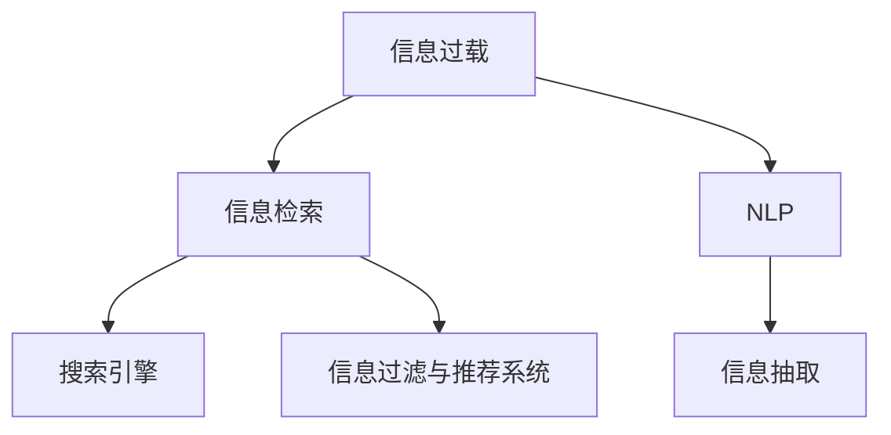

                 

## 1. 背景介绍

### 1.1 问题由来
随着互联网的迅猛发展和信息技术的不断进步，我们生活在一个被海量信息所淹没的时代。据统计，目前全球互联网上的数据量已经超过了2.8泽字节（ZB），并且以每年44.7泽字节的速度增长。在如此庞大的信息海洋中，如何高效、准确地获取所需信息，成为了现代社会中的一大挑战。信息过载现象，即人们面对过多的信息输入，难以有效处理和利用，导致注意力分散和决策困难，正成为困扰人们学习和工作的普遍问题。

### 1.2 问题核心关键点
信息搜索和筛选过程的复杂性和难度是导致信息过载的主要原因之一。如何设计有效的信息搜索策略，利用自动化技术，在海量信息中精准定位所需信息，是一个亟待解决的问题。本文旨在探索高效的信息搜索策略与指南，帮助人们在信息海洋中找到所需的信息。

### 1.3 问题研究意义
掌握高效的信息搜索策略，不仅能提高个人和企业的决策效率，还能促进知识的有效积累和创新。信息搜索策略的研究，对现代社会的科技进步、经济活动、教育培训、科学研究等领域都有着重要的实际意义。本文旨在提供系统化、可行的解决方案，助力信息时代的知识发现和应用创新。

## 2. 核心概念与联系

### 2.1 核心概念概述

为更好地理解信息搜索策略的科学原理和实际应用，本节将介绍几个密切相关的核心概念：

- **信息过载**：由于信息量过于庞大，难以在有限的时间内消化和理解所有信息，导致信息处理能力和效率下降的现象。
- **信息检索**：利用计算机技术和数据库系统，自动地从大量信息源中检索出所需信息的过程。
- **自然语言处理**（Natural Language Processing, NLP）：让计算机理解、分析、处理和生成自然语言的技术。
- **搜索引擎**：如Google、Bing等，通过算法和索引技术，快速响应用户的查询请求。
- **信息抽取**：从文本数据中自动抽取结构化信息，如实体、关系等。
- **信息过滤与推荐系统**：通过机器学习算法，根据用户的历史行为和兴趣，推荐相关信息。

这些核心概念之间的逻辑关系可以通过以下Mermaid流程图来展示：



这个流程图展示了一系列信息搜索的核心环节：

1. 由于信息过载，需要信息检索技术帮助快速定位所需信息。
2. 信息检索基于自然语言处理技术，将非结构化文本转化为计算机可处理的信息。
3. 信息检索的结果通过搜索引擎进行展现和排序。
4. 信息抽取技术从检索结果中提取出结构化信息。
5. 信息过滤与推荐系统通过机器学习算法，进一步精炼检索结果，提升用户体验。

这些概念共同构成了信息搜索与处理的基础框架，为进一步探索高效的信息搜索策略提供了理论支持。

## 3. 核心算法原理 & 具体操作步骤
### 3.1 算法原理概述

高效的信息搜索策略建立在以下基本原理之上：

- **信息检索模型**：通过构建索引和倒排索引表，加速信息的检索速度。
- **信息检索算法**：如向量空间模型、隐式语义索引、基于图的检索算法等，用于提升检索的准确性和效率。
- **自然语言处理技术**：通过分词、词性标注、句法分析等技术，解析查询语句，转化为计算机可处理的信息。
- **信息抽取技术**：利用实体识别、关系抽取等技术，从文本中提取结构化信息。
- **信息过滤与推荐算法**：如协同过滤、内容过滤、混合过滤等，根据用户兴趣和行为，优化检索结果的展示顺序。

### 3.2 算法步骤详解

以下是一套高效的信息搜索策略与具体操作步骤：

**Step 1: 定义明确的信息需求**

- 确定查询目标：如查找学术论文、新闻报道、企业信息等。
- 细化查询要求：如文献的主题、发表时间、作者等。

**Step 2: 选择合适的信息检索工具**

- 选择搜索引擎：如Google Scholar、ResearchGate、Web of Science等。
- 选择信息抽取工具：如NLP工具包NLTK、spaCy、Stanford NER等。
- 选择信息过滤与推荐工具：如Amazon的推荐系统、LinkedIn的个性化推荐等。

**Step 3: 构建查询语句**

- 明确查询关键词：使用“关键词+同义词”扩展查询范围。
- 利用布尔逻辑运算符：如AND、OR、NOT，精细化查询条件。

**Step 4: 应用自然语言处理技术**

- 分词处理：使用分词工具，将查询语句分割成词语。
- 词性标注：标注每个词的词性，如名词、动词等。
- 句法分析：分析查询语句的语法结构，提取主谓宾关系。

**Step 5: 信息检索与过滤**

- 提交查询请求：将处理后的查询语句提交给搜索引擎。
- 检索结果展示：根据算法优化检索结果，展现给用户。
- 信息抽取：从检索结果中抽取所需信息，如作者、发表时间、摘要等。
- 信息过滤与推荐：利用机器学习算法，对信息进行过滤和推荐，提升检索准确性。

**Step 6: 评估与调整**

- 评估检索结果：根据信息的相关性和准确性，评估查询效果。
- 调整查询策略：根据评估结果，调整查询关键词、逻辑运算符等，优化搜索策略。

通过上述步骤，可以构建一个高效、准确的信息搜索流程，帮助用户在信息海洋中找到所需信息。

### 3.3 算法优缺点

高效的信息搜索策略与指南具有以下优点：

- 精准定位：通过自然语言处理和信息检索技术，快速定位所需信息。
- 提升效率：自动化的信息检索和过滤，减少了人工干预，提高了信息处理效率。
- 个性推荐：根据用户行为和兴趣，提供个性化的信息推荐，提升用户体验。

然而，该策略也存在一定的局限性：

- 对初始查询要求高：需要用户明确表达查询意图，否则可能返回不相关结果。
- 检索质量依赖工具：检索工具的质量直接影响信息检索的效果。
- 信息过载问题仍存：即便是高效算法，也无法完全避免信息过载问题。

尽管存在这些局限性，但总体而言，信息搜索策略与指南在大规模信息处理和知识发现中发挥了重要作用，显著提升了信息检索的效率和准确性。

### 3.4 算法应用领域

信息搜索策略与指南在多个领域中得到了广泛应用，例如：

- **科研领域**：科研人员通过Google Scholar、Web of Science等搜索引擎，快速检索相关论文和文献。
- **企业信息管理**：企业利用CRM系统、ERP系统等，进行客户、供应商、产品等信息的管理和检索。
- **新闻和媒体**：新闻机构通过新闻聚合平台，快速获取和筛选新闻报道。
- **电子商务**：电商平台如Amazon、淘宝等，通过个性化推荐系统，提升用户体验，增加销售额。
- **教育和培训**：在线教育平台如Coursera、edX等，通过推荐系统和搜索技术，提供个性化学习资源。

这些应用领域展示了信息搜索策略与指南在实际生活中的广泛应用和重要价值。

## 4. 数学模型和公式 & 详细讲解 & 举例说明

### 4.1 数学模型构建

本节将使用数学语言对信息搜索策略进行更加严格的刻画。

假设用户输入的查询语句为 $Q$，信息库中的文档集为 $D=\{d_1, d_2, ..., d_n\}$，其中每个文档 $d_i$ 包含若干关键词 $k_i$。

定义信息检索模型为 $M(Q, D)$，该模型将查询 $Q$ 映射到文档集 $D$ 中，返回与查询最相关的文档集 $R$。

信息检索模型的目标是最小化查询 $Q$ 与文档 $d_i$ 的语义距离，即：

$$
\min_{R \subseteq D} \sum_{q \in Q} \sum_{d_i \in R} \text{similarity}(q, d_i)
$$

其中，$\text{similarity}(q, d_i)$ 表示查询 $q$ 与文档 $d_i$ 的相似度，通常使用余弦相似度、Jaccard相似度等。

### 4.2 公式推导过程

假设查询 $Q$ 包含 $m$ 个词，文档 $d_i$ 包含 $n_i$ 个词，查询与文档的余弦相似度定义为：

$$
\text{similarity}(Q, d_i) = \frac{\sum_{q \in Q} \sum_{j=1}^{n_i} q_j \times d_{ij}}{\sqrt{\sum_{q \in Q} q^2} \times \sqrt{\sum_{j=1}^{n_i} d_{ij}^2}}
$$

其中，$q_j$ 表示查询 $Q$ 中第 $j$ 个词的权重，$d_{ij}$ 表示文档 $d_i$ 中第 $j$ 个词的权重。

通过上述公式，可以将查询 $Q$ 与文档 $d_i$ 的语义相似度转化为数值，从而进行排序和筛选。

### 4.3 案例分析与讲解

假设我们查询一篇关于“人工智能伦理”的论文，查询语句为“人工智能 伦理 道德”，信息库包含1000篇文档，每篇文档的关键词如下：

| 文档ID | 关键词 |
| --- | --- |
| 1 | 人工智能 伦理 道德 |
| 2 | 人工智能 算法 优化 |
| 3 | 人工智能 大数据 分析 |
| ... | ... |
| 1000 | 人工智能 深度学习 神经网络 |

使用余弦相似度公式，计算查询语句与每篇文档的相似度，并对结果进行排序。

对于文档1，余弦相似度为：

$$
\text{similarity}(1, \text{人工智能 伦理 道德}) = \frac{1 \times 1 + 1 \times 1 + 1 \times 1}{\sqrt{1^2 + 1^2 + 1^2} \times \sqrt{1^2 + 1^2 + 1^2}} = 1
$$

对于文档2，余弦相似度为：

$$
\text{similarity}(2, \text{人工智能 伦理 道德}) = \frac{0 \times 1 + 1 \times 1 + 0 \times 1}{\sqrt{0^2 + 1^2 + 0^2} \times \sqrt{1^2 + 1^2 + 0^2}} = 0
$$

因此，文档1与查询的相似度最高，应优先展示给用户。通过这种方法，可以高效地找到所需信息。

## 5. 项目实践：代码实例和详细解释说明
### 5.1 开发环境搭建

在进行信息搜索策略的实践前，我们需要准备好开发环境。以下是使用Python进行信息检索的开发环境配置流程：

1. 安装Anaconda：从官网下载并安装Anaconda，用于创建独立的Python环境。

2. 创建并激活虚拟环境：
```bash
conda create -n information_retrieval_env python=3.8 
conda activate information_retrieval_env
```

3. 安装PyTorch：根据CUDA版本，从官网获取对应的安装命令。例如：
```bash
conda install pytorch torchvision torchaudio cudatoolkit=11.1 -c pytorch -c conda-forge
```

4. 安装Natural Language Toolkit (NLTK)：
```bash
pip install nltk
```

5. 安装spaCy：
```bash
pip install spacy
```

6. 安装BeautifulSoup：
```bash
pip install beautifulsoup4
```

7. 安装Scrapy：
```bash
pip install scrapy
```

完成上述步骤后，即可在`information_retrieval_env`环境中开始信息检索实践。

### 5.2 源代码详细实现

这里我们以一个简单的网页爬虫为例，展示如何使用Python进行信息检索。

首先，定义一个简单的爬虫函数：

```python
import scrapy
import requests
from bs4 import BeautifulSoup

class InformationRetrievalSpider(scrapy.Spider):
    name = 'information_retrieval'
    start_urls = ['https://www.example.com']

    def parse(self, response):
        soup = BeautifulSoup(response.text, 'html.parser')
        # 提取网页标题和内容
        title = soup.find('title').text
        content = soup.find_all('p', class_='content')[0].text
        # 返回结果
        yield {'title': title, 'content': content}
```

然后，使用Scrapy框架启动爬虫：

```python
scrapy crawl information_retrieval -o results.json
```

这个爬虫会爬取指定网页，提取网页标题和内容，并返回一个包含网页信息的结果列表。

### 5.3 代码解读与分析

让我们再详细解读一下关键代码的实现细节：

**InformationRetrievalSpider类**：
- `__init__`方法：定义爬虫名称和起始URL。
- `parse`方法：解析网页内容，提取网页标题和内容，并返回结果字典。

**BeautifulSoup模块**：
- 使用BeautifulSoup解析HTML文档，提取文本信息。
- 在解析过程中，使用标签和属性定位文本内容。

**Scrapy框架**：
- 使用Scrapy启动爬虫，指定输出格式为JSON。
- 通过Spider类定义爬虫行为，从指定URL开始爬取网页内容。

**代码示例**：
- 在实际应用中，可以将爬取到的网页信息存入数据库，供后续信息检索使用。
- 可以利用搜索引擎API，对爬取到的网页进行索引和检索。

通过以上代码示例，可以初步了解信息检索的基本流程和实现方法。

## 6. 实际应用场景
### 6.1 科学研究

信息搜索策略在科学研究中有着广泛的应用，科研人员可以通过搜索引擎快速检索相关文献，了解最新的科研成果和技术进展。

### 6.2 企业信息管理

企业通过信息检索和推荐系统，管理客户、供应商、产品等海量信息，提高信息检索的效率和准确性，帮助企业决策。

### 6.3 新闻和媒体

新闻机构利用搜索引擎和推荐系统，快速获取和筛选新闻报道，提升新闻发布的速度和质量。

### 6.4 电子商务

电子商务平台如Amazon、淘宝等，通过个性化推荐系统，提升用户体验，增加销售额。

### 6.5 教育和培训

在线教育平台如Coursera、edX等，通过推荐系统和搜索技术，提供个性化学习资源，提升教育效果。

### 6.6 医疗健康

医疗机构通过信息检索技术，快速获取相关医学文献和研究成果，提升医疗服务水平。

### 6.7 法律咨询

律师事务所通过信息检索和推荐系统，快速检索相关法律条文和案例，提升法律服务的效率和准确性。

## 7. 工具和资源推荐
### 7.1 学习资源推荐

为了帮助开发者系统掌握信息搜索策略的理论基础和实践技巧，这里推荐一些优质的学习资源：

1. **《信息检索与自然语言处理》**：一本介绍信息检索和自然语言处理的经典教材，涵盖了信息检索的基础理论、算法和应用。

2. **Coursera的自然语言处理课程**：由斯坦福大学和宾夕法尼亚大学等知名高校开设，提供从基础到高级的自然语言处理课程。

3. **CS224N《自然语言处理与深度学习》**：斯坦福大学开设的NLP明星课程，涵盖自然语言处理的经典理论和深度学习在NLP中的应用。

4. **自然语言处理与信息检索技术教程**：提供从信息检索、自然语言处理到文本挖掘等全方位的学习资源，适合初学者和进阶者。

5. **Kaggle的信息检索竞赛**：参加Kaggle的信息检索竞赛，通过实战锻炼信息检索的能力。

通过这些资源的学习实践，相信你一定能够快速掌握信息检索的核心技术，并用于解决实际的NLP问题。

### 7.2 开发工具推荐

高效的开发离不开优秀的工具支持。以下是几款用于信息检索开发的常用工具：

1. **BeautifulSoup**：用于解析HTML和XML文档，提取网页文本信息。

2. **Scrapy**：Python爬虫框架，用于自动化网页抓取。

3. **NLTK**：Python自然语言处理工具包，提供分词、词性标注、句法分析等基础功能。

4. **spaCy**：Python自然语言处理工具包，提供高效的词性标注、命名实体识别等功能。

5. **Elasticsearch**：分布式搜索引擎，支持实时检索和查询分析。

6. **TensorFlow**：用于构建深度学习模型的开源框架，支持自然语言处理和信息检索任务。

7. **Amazon SageMaker**：AWS提供的机器学习平台，支持信息检索和推荐系统的开发。

合理利用这些工具，可以显著提升信息检索任务的开发效率，加快创新迭代的步伐。

### 7.3 相关论文推荐

信息检索技术的发展源于学界的持续研究。以下是几篇奠基性的相关论文，推荐阅读：

1. **《The PageRank Algorithm》**：由Google创始人提出，介绍PageRank算法的原理和实现，奠定了现代搜索引擎的基础。

2. **《Semantic Search: Beyond Keyword Matching》**：介绍了语义搜索的概念和算法，探讨了如何利用语义信息提升信息检索的准确性。

3. **《IR Tools: A Survey》**：综述了信息检索工具和算法的发展历程，介绍了当前流行的信息检索技术。

4. **《Evaluating and Comparing Information Retrieval Systems》**：探讨了信息检索系统的评价标准和评估方法，为信息检索系统的优化提供了理论指导。

这些论文代表了大规模信息检索技术的发展脉络。通过学习这些前沿成果，可以帮助研究者把握学科前进方向，激发更多的创新灵感。

## 8. 总结：未来发展趋势与挑战
### 8.1 总结

本文对信息搜索策略进行了全面系统的介绍。首先阐述了信息过载现象的背景和原因，明确了信息检索技术的核心作用。其次，从原理到实践，详细讲解了信息检索模型的构建和操作流程，给出了具体的代码示例。同时，本文还广泛探讨了信息检索策略在科研、企业、新闻媒体、电子商务、教育培训、医疗健康、法律咨询等众多领域的应用前景，展示了信息检索技术的广泛应用价值。此外，本文精选了信息检索技术的各类学习资源，力求为读者提供全方位的技术指引。

通过本文的系统梳理，可以看到，信息搜索策略在海量信息处理和知识发现中发挥了重要作用，显著提升了信息检索的效率和准确性。未来，伴随信息检索技术的不断演进，相信信息检索技术必将在更广阔的应用领域大放异彩，为人类认知智能的进化带来深远影响。

### 8.2 未来发展趋势

展望未来，信息搜索技术将呈现以下几个发展趋势：

1. **深度学习在信息检索中的应用**：利用深度学习算法，提升信息检索的准确性和泛化能力。

2. **跨模态信息检索**：结合文本、图像、音频等多模态数据，提升信息检索的全面性和准确性。

3. **自适应信息检索**：根据用户的历史行为和偏好，动态调整检索策略，提供个性化的信息检索服务。

4. **联邦学习和分布式检索**：利用边缘计算和分布式系统，提升信息检索的效率和隐私保护水平。

5. **跨语言信息检索**：实现跨语言的信息检索和翻译，拓展信息检索技术的国际应用范围。

这些趋势凸显了信息搜索技术的广阔前景。这些方向的探索发展，必将进一步提升信息检索的效果和用户体验，为人类信息处理能力的提升贡献力量。

### 8.3 面临的挑战

尽管信息搜索技术已经取得了显著成果，但在迈向更加智能化、普适化应用的过程中，它仍面临着诸多挑战：

1. **数据质量和标注问题**：大规模数据集的构建和标注需要大量的时间和资源，可能存在标注不准确、数据不平衡等问题。

2. **计算资源需求高**：信息检索和深度学习算法需要大量的计算资源，可能面临算力不足的问题。

3. **隐私和安全问题**：信息检索过程中可能涉及用户隐私信息，如何保护用户数据安全是一个重要问题。

4. **信息过载仍存**：即便是高效算法，也无法完全避免信息过载问题，如何提升信息检索的效率和准确性是一个长期课题。

5. **跨语言障碍**：跨语言信息检索和翻译仍存在语言和文化障碍，如何提升跨语言信息检索的效果，是一个挑战性的问题。

6. **用户界面和体验**：信息检索系统的界面和用户体验需要不断优化，才能更好地满足用户需求。

正视信息搜索面临的这些挑战，积极应对并寻求突破，将是大规模信息检索技术走向成熟的必由之路。相信随着学界和产业界的共同努力，这些挑战终将一一被克服，信息搜索技术必将在构建人机协同的智能时代中扮演越来越重要的角色。

### 8.4 研究展望

面向未来，信息搜索技术的探索方向包括以下几个方面：

1. **优化信息检索算法**：改进信息检索算法，提升检索的效率和准确性。

2. **融合多模态信息**：结合文本、图像、音频等多模态数据，实现更加全面、准确的信息检索。

3. **利用深度学习**：利用深度学习算法，提升信息检索的泛化能力和准确性。

4. **强化隐私保护**：研究隐私保护算法，确保信息检索过程中用户数据的安全。

5. **提升跨语言检索能力**：实现跨语言的信息检索和翻译，拓展信息检索技术的国际应用范围。

6. **增强用户界面和体验**：优化信息检索系统的界面和用户体验，提升系统的易用性和便捷性。

这些方向的研究和创新，必将进一步推动信息搜索技术的发展，为人类信息处理能力的提升贡献力量。相信伴随技术的不断进步，信息搜索技术必将在构建人机协同的智能时代中扮演越来越重要的角色。

## 9. 附录：常见问题与解答

**Q1：如何提高信息检索的效率和准确性？**

A: 提高信息检索的效率和准确性，可以从以下几个方面入手：

1. **选择适当的检索算法**：选择合适的信息检索算法，如向量空间模型、隐式语义索引等。
2. **优化查询语句**：使用布尔逻辑运算符、通配符等优化查询语句，提高检索的精确度。
3. **构建高质量的索引**：通过分词、词性标注、句法分析等技术，构建高质量的索引。
4. **利用深度学习技术**：利用深度学习算法，提升信息检索的泛化能力和准确性。

通过以上方法，可以显著提高信息检索的效率和准确性，满足用户对信息检索的实时性和精准性需求。

**Q2：如何保护用户隐私和数据安全？**

A: 保护用户隐私和数据安全，可以从以下几个方面入手：

1. **匿名化处理**：对用户数据进行匿名化处理，确保用户隐私不被泄露。
2. **数据加密**：对用户数据进行加密处理，防止数据被非法访问和篡改。
3. **访问控制**：通过身份验证、权限控制等技术，确保只有授权用户才能访问敏感数据。
4. **隐私保护算法**：研究隐私保护算法，如差分隐私、联邦学习等，保护用户数据隐私。

通过以上方法，可以有效保护用户隐私和数据安全，确保信息检索系统的可信性和安全性。

**Q3：如何应对信息过载问题？**

A: 应对信息过载问题，可以从以下几个方面入手：

1. **信息过滤与推荐**：利用推荐系统，根据用户兴趣和行为，过滤和推荐相关信息，减少用户的信息负担。
2. **智能摘要与抽取**：利用摘要技术和信息抽取技术，自动提取和展示信息的关键部分，减少用户阅读负担。
3. **多源信息融合**：结合多个信息源，提供多角度的信息检索结果，帮助用户快速获取所需信息。

通过以上方法，可以显著减少用户的信息负担，提升信息检索的效果和用户体验。

**Q4：如何提升跨语言信息检索的效果？**

A: 提升跨语言信息检索的效果，可以从以下几个方面入手：

1. **跨语言索引构建**：利用跨语言索引技术，构建跨语言的索引数据库。
2. **机器翻译技术**：利用机器翻译技术，将不同语言的文本转换为统一的语言格式。
3. **多语言信息抽取**：结合多语言信息抽取技术，提取不同语言的实体和关系。

通过以上方法，可以实现跨语言的信息检索和翻译，提升信息检索的全面性和准确性。

**Q5：如何优化信息检索系统的用户界面和体验？**

A: 优化信息检索系统的用户界面和体验，可以从以下几个方面入手：

1. **直观的查询界面**：提供简洁、直观的查询界面，方便用户输入查询语句。
2. **可视化结果展示**：利用图表、标签云等可视化技术，展示检索结果，提升用户理解。
3. **个性化推荐系统**：根据用户的历史行为和兴趣，推荐相关内容，提升用户满意度。
4. **交互式查询功能**：提供交互式查询功能，如自动补全、纠错建议等，提升用户使用体验。

通过以上方法，可以显著优化信息检索系统的用户界面和体验，提升系统的易用性和便捷性。

---

作者：禅与计算机程序设计艺术 / Zen and the Art of Computer Programming

