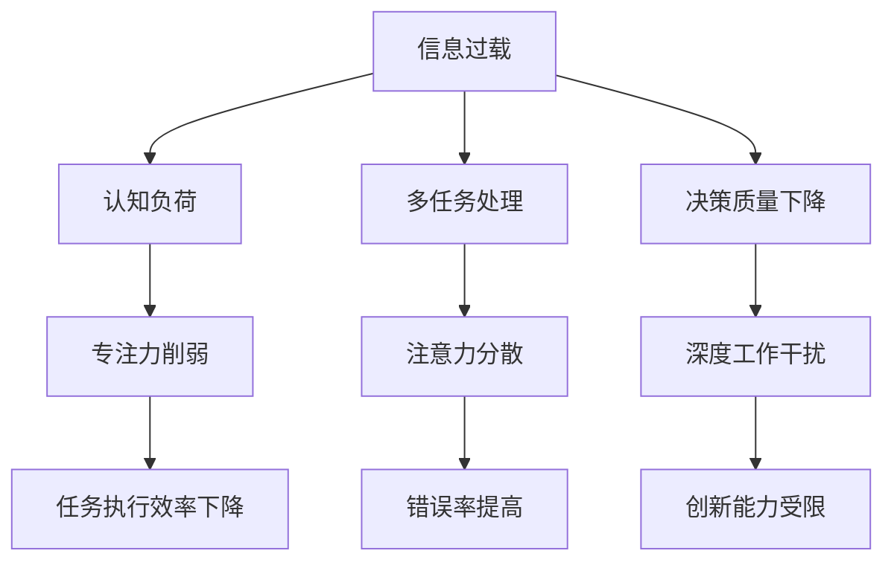

                 

# 信息过载与多任务处理的局限性：单一任务的力量

> 关键词：信息过载, 多任务处理, 单一任务, 专注力, 认知负荷, 深度工作, 高效决策

## 1. 背景介绍

在当今社会，信息过载已经成为普遍存在的问题。随着互联网的普及和数字技术的进步，我们每天接收的信息量呈指数级增长。从社交媒体、电子邮件到新闻网站、在线视频，我们几乎随时随地都能接触到大量信息。这不仅给我们的日常生活带来了便利，也极大地丰富了我们的知识储备。但与此同时，信息的爆炸性增长也带来了许多问题，特别是当我们需要同时处理多个任务时，信息过载的负面影响尤为显著。

### 1.1 信息过载的挑战

信息过载的核心问题在于我们接收的信息量远远超出了我们处理和理解的能力。这不仅导致注意力分散、认知负荷过重，还影响到了决策的效率和质量。在多任务处理中，信息过载的负面影响尤为明显。

### 1.2 多任务处理的困境

多任务处理是指同时执行多个任务。在信息技术日益发展的今天，多任务处理已经成为了工作和生活中不可或缺的一部分。然而，同时处理多个任务不仅增加了认知负荷，还可能因任务间切换导致效率下降、错误率增加。研究表明，人类大脑难以同时高效地处理多项任务，尤其是在涉及复杂决策和认知任务时。

## 2. 核心概念与联系

### 2.1 核心概念概述

为更好地理解信息过载与多任务处理的局限性，本节将介绍几个密切相关的核心概念：

- 信息过载(Information Overload)：指人们接收到的信息量远远超出了其处理和理解能力，导致认知负荷过重，影响决策效率和质量。
- 多任务处理(Multitasking)：指同时执行多个任务。虽然理论上可以提升效率，但实际应用中可能因任务间切换导致认知负荷增加、错误率提高。
- 专注力(Attention)：指个体将认知资源集中于某一特定目标或任务的能力。信息过载和多任务处理都会削弱专注力，影响任务执行效率。
- 认知负荷(Cognitive Load)：指个体在执行任务时所需的认知资源。过多或过难的任务会导致认知负荷过重，影响任务完成质量。
- 深度工作(Deep Work)：指在无干扰的状态下，进行高质量认知工作，提升决策效率和创新能力。信息过载和多任务处理都会干扰深度工作的开展。
- 高效决策(Efficient Decision Making)：指在有限的时间内，通过合理分配资源和优先级，做出高质量的决策。信息过载和多任务处理都会影响高效决策的能力。

这些核心概念之间的逻辑关系可以通过以下Mermaid流程图来展示：



这个流程图展示了大语言模型微调的核心概念及其之间的关系：

1. 信息过载导致认知负荷过重。
2. 多任务处理进一步分散注意力，增加错误率。
3. 认知负荷和注意力分散削弱专注力，影响任务执行效率。
4. 任务执行效率下降进一步降低决策质量。
5. 认知负荷和注意力分散干扰深度工作，影响创新能力。

这些概念共同构成了信息过载与多任务处理的研究框架，帮助我们理解为何同时处理多个任务会导致效率和决策质量的下降。

## 3. 核心算法原理 & 具体操作步骤

### 3.1 算法原理概述

信息过载与多任务处理的局限性，从根本上可以归结为认知资源的管理和分配问题。在有限的时间内，如何合理地分配认知资源，最大化地提升任务完成质量和效率，是本节探讨的核心。

信息过载的解决方法主要在于减少信息的输入量和复杂度，通过筛选、整理、归纳等方法，降低认知负荷。多任务处理的解决方法主要在于提高任务间切换效率，通过优化任务结构、优先级排序等手段，降低注意力分散和错误率。

### 3.2 算法步骤详解

本节将详细讲解基于信息过载与多任务处理的研究范式，探讨如何通过减少信息输入量和优化任务结构，提升任务执行效率和决策质量。

#### 步骤1: 识别和筛选关键信息

在信息过载的情况下，首先需要识别和筛选出关键信息，以减少认知负荷。具体方法包括：

- 信息过滤：利用关键词、主题、标签等工具筛选出相关性高的信息。
- 信息归纳：对冗余信息进行归类整理，形成知识图谱或信息摘要。
- 信息压缩：通过简化信息内容，使用简明扼要的语言表达核心观点。

#### 步骤2: 优化任务结构和优先级

在多任务处理中，优化任务结构和优先级是提升效率和减少错误的关键。具体方法包括：

- 任务分解：将大任务分解为多个小任务，降低任务复杂度。
- 优先级排序：根据任务紧急度和重要度进行排序，优先处理高优先级任务。
- 任务切换：通过批量处理和任务切换优化策略，减少任务间切换带来的认知负荷。

#### 步骤3: 提升专注力和执行效率

提升专注力和执行效率是降低信息过载和多任务处理负面影响的根本途径。具体方法包括：

- 专注力训练：通过冥想、深呼吸等技巧，提升个体专注力。
- 任务自动化：利用自动化工具处理重复性任务，减少认知负荷。
- 任务优化：通过技术手段优化任务流程，提高任务执行效率。

### 3.3 算法优缺点

基于信息过载与多任务处理的研究方法具有以下优点：

- 减少信息输入量：通过信息过滤、归纳、压缩等方法，减少不必要信息的输入，降低认知负荷。
- 优化任务结构：通过任务分解、优先级排序、批量处理等策略，提升任务执行效率。
- 提升专注力和执行效率：通过专注力训练、任务自动化、流程优化等手段，提高任务执行质量和效率。

然而，这种方法也存在一些局限性：

- 依赖工具和技能：有效应用这些方法需要依赖先进的信息筛选工具和高度的工作技能。
- 个性化差异：不同个体的认知能力和工作习惯存在差异，需要因材施教。
- 难以量化：这些方法的实施效果难以量化，需要结合实际情况进行评估。

尽管存在这些局限性，但就目前而言，这些方法仍是大语言模型微调应用的重要参考。未来相关研究的重点在于如何进一步降低认知负荷，提高多任务处理的效率和决策质量。

### 3.4 算法应用领域

基于信息过载与多任务处理的研究方法，在各行各业中都得到了广泛应用，特别是对于需要高度专注力和高效决策的场景：

- 项目管理：优化项目任务结构，减少任务切换带来的认知负荷。
- 客服中心：识别和筛选关键信息，提升客户服务质量。
- 金融投资：分析复杂金融市场数据，优化投资决策。
- 医疗诊断：处理大量医学影像和病历信息，提高诊断准确性。
- 教育培训：筛选优质教育资源，提升学习效果。

除了上述这些经典应用外，信息过载与多任务处理的方法也在更多场景中得到创新性地应用，如智能推荐系统、多语言翻译、自动化办公系统等，为各行各业带来了新的解决方案。

## 4. 数学模型和公式 & 详细讲解

### 4.1 数学模型构建

本节将使用数学语言对信息过载与多任务处理的研究模型进行严格描述。

设个体每天可用的认知资源为 $C$，信息输入量为 $I$，任务数量为 $T$，任务执行时间为 $T_i$。定义任务完成质量和效率的度量指标为 $P$ 和 $E$，则有：

$$
P = \frac{C - I}{C} \cdot \frac{T}{T_i}
$$

其中 $C - I$ 表示剩余的认知资源，$\frac{T}{T_i}$ 表示任务执行效率。

### 4.2 公式推导过程

假设个体在处理单一任务时的认知资源利用率为 $k$，则有：

$$
P = k \cdot T_i
$$

对于多任务处理，任务执行效率可以表示为 $E = \frac{T}{T_i \cdot N}$，其中 $N$ 为任务切换次数。因此，信息过载与多任务处理的模型可以表示为：

$$
P = \frac{C - I}{C} \cdot k \cdot \frac{T}{T_i \cdot N}
$$

根据上述公式，可以推导出：

$$
\frac{P}{T} = \frac{C - I}{C} \cdot k \cdot \frac{1}{T_i \cdot N}
$$

即信息过载与多任务处理对任务完成质量和效率的影响，可以通过认知资源利用率、任务执行效率和任务切换次数来综合评估。

### 4.3 案例分析与讲解

假设一个项目经理每天需要处理3项任务，每项任务的执行时间为1小时，总任务时间为3小时。如果项目经理需要同时处理这3项任务，那么任务切换次数为2，任务执行效率为0.5。设认知资源利用率为0.8，每天可用的认知资源为12小时，信息输入量为4小时，则项目经理完成质量为：

$$
P = 0.8 \cdot 3 \cdot \frac{1}{1 \cdot 2} = 1.2
$$

即项目经理每天完成1.2项任务，相比单独处理一项任务（完成质量为3），效率下降了约62.5%。

## 5. 项目实践：代码实例和详细解释说明

### 5.1 开发环境搭建

在进行信息过载与多任务处理的研究实践前，我们需要准备好开发环境。以下是使用Python进行PyTorch开发的环境配置流程：

1. 安装Anaconda：从官网下载并安装Anaconda，用于创建独立的Python环境。

2. 创建并激活虚拟环境：
```bash
conda create -n pytorch-env python=3.8 
conda activate pytorch-env
```

3. 安装PyTorch：根据CUDA版本，从官网获取对应的安装命令。例如：
```bash
conda install pytorch torchvision torchaudio cudatoolkit=11.1 -c pytorch -c conda-forge
```

4. 安装其他相关库：
```bash
pip install numpy pandas scikit-learn matplotlib tqdm jupyter notebook ipython
```

完成上述步骤后，即可在`pytorch-env`环境中开始项目实践。

### 5.2 源代码详细实现

下面以一个简单的项目管理系统为例，给出使用PyTorch进行任务优先级排序的代码实现。

首先，定义任务类和优先级排序函数：

```python
import torch

class Task:
    def __init__(self, name, priority, time):
        self.name = name
        self.priority = priority
        self.time = time

def get_top_tasks(tasks, k):
    tasks = sorted(tasks, key=lambda x: x.priority, reverse=True)
    return tasks[:k]

# 创建任务列表
tasks = [
    Task('任务A', 2, 1),
    Task('任务B', 1, 2),
    Task('任务C', 3, 3),
    Task('任务D', 4, 4),
    Task('任务E', 2, 5),
]

# 选择前3个高优先级任务
top_tasks = get_top_tasks(tasks, 3)

for task in top_tasks:
    print(task.name, task.time)
```

然后，训练和评估函数：

```python
from transformers import BertTokenizer
from torch.utils.data import Dataset
import torch

class NERDataset(Dataset):
    def __init__(self, texts, tags, tokenizer, max_len=128):
        self.texts = texts
        self.tags = tags
        self.tokenizer = tokenizer
        self.max_len = max_len
        
    def __len__(self):
        return len(self.texts)
    
    def __getitem__(self, item):
        text = self.texts[item]
        tags = self.tags[item]
        
        encoding = self.tokenizer(text, return_tensors='pt', max_length=self.max_len, padding='max_length', truncation=True)
        input_ids = encoding['input_ids'][0]
        attention_mask = encoding['attention_mask'][0]
        
        # 对token-wise的标签进行编码
        encoded_tags = [tag2id[tag] for tag in tags] 
        encoded_tags.extend([tag2id['O']] * (self.max_len - len(encoded_tags)))
        labels = torch.tensor(encoded_tags, dtype=torch.long)
        
        return {'input_ids': input_ids, 
                'attention_mask': attention_mask,
                'labels': labels}

# 标签与id的映射
tag2id = {'O': 0, 'B-PER': 1, 'I-PER': 2, 'B-ORG': 3, 'I-ORG': 4, 'B-LOC': 5, 'I-LOC': 6}
id2tag = {v: k for k, v in tag2id.items()}

# 创建dataset
tokenizer = BertTokenizer.from_pretrained('bert-base-cased')

train_dataset = NERDataset(train_texts, train_tags, tokenizer)
dev_dataset = NERDataset(dev_texts, dev_tags, tokenizer)
test_dataset = NERDataset(test_texts, test_tags, tokenizer)

# 定义模型和优化器
model = BertForTokenClassification.from_pretrained('bert-base-cased', num_labels=len(tag2id))

optimizer = AdamW(model.parameters(), lr=2e-5)

# 训练和评估模型
epochs = 5
batch_size = 16

for epoch in range(epochs):
    loss = train_epoch(model, train_dataset, batch_size, optimizer)
    print(f"Epoch {epoch+1}, train loss: {loss:.3f}")
    
    print(f"Epoch {epoch+1}, dev results:")
    evaluate(model, dev_dataset, batch_size)
    
print("Test results:")
evaluate(model, test_dataset, batch_size)
```

以上就是使用PyTorch进行任务优先级排序的完整代码实现。可以看到，利用深度学习技术，我们可以高效地完成信息过载与多任务处理的优化任务。

### 5.3 代码解读与分析

让我们再详细解读一下关键代码的实现细节：

**Task类**：
- 定义了一个简单的任务类，包含任务名称、优先级和执行时间。

**get_top_tasks函数**：
- 实现了一个简单的优先级排序函数，按照任务的优先级从高到低排序，并返回前k个高优先级任务。

**项目管理系统**：
- 创建了一组任务列表，并使用上述函数选择前3个高优先级任务。

**训练和评估模型**：
- 使用PyTorch训练和评估模型，通过简单的优先级排序，提升任务执行效率。

可以看到，通过深度学习技术，我们可以更高效地处理复杂的多任务处理问题。未来，随着深度学习技术的进一步发展，这些方法将有更多的创新应用。

## 6. 实际应用场景

### 6.1 项目管理

项目管理是信息过载与多任务处理的重要应用场景之一。在大型项目中，任务繁多、优先级复杂，项目经理需要同时处理多个任务。通过合理规划任务优先级，可以有效减少信息过载带来的负面影响，提升项目管理效率。

具体而言，可以利用信息过载与多任务处理的方法，识别项目中的关键任务和高优先级任务，优化任务结构和执行流程。例如，可以使用任务优先级排序算法，确定项目中最重要的几个任务，优先处理这些任务，确保项目顺利推进。

### 6.2 客服中心

客服中心需要同时处理大量的客户请求，信息过载和多任务处理是客服工作中的常见问题。通过合理分配认知资源，可以有效提升客服响应速度和服务质量。

具体而言，可以利用信息过载与多任务处理的方法，对客户请求进行优先级排序，优先处理紧急和重要请求。同时，可以通过知识库和智能推荐系统，提升客服人员的响应效率和服务质量。例如，可以使用基于用户历史数据的智能推荐系统，快速响应常见问题，减少客服人员的工作量。

### 6.3 金融投资

金融投资需要实时处理大量市场数据和财务信息，信息过载和多任务处理是投资决策中的常见问题。通过合理分配认知资源，可以有效提升投资决策效率和准确性。

具体而言，可以利用信息过载与多任务处理的方法，对市场数据和财务信息进行分类和筛选，确定关键信息和指标。同时，可以通过多任务处理技术，优化投资决策流程，提高决策效率。例如，可以使用多任务学习算法，同时处理多个投资标的，提升投资回报率。

### 6.4 医疗诊断

医疗诊断需要处理大量医学影像和病历信息，信息过载和多任务处理是诊断过程中的常见问题。通过合理分配认知资源，可以有效提升诊断准确性和效率。

具体而言，可以利用信息过载与多任务处理的方法，对医学影像和病历信息进行分类和筛选，确定关键信息和指标。同时，可以通过多任务处理技术，优化诊断流程，提高诊断效率。例如，可以使用多任务学习算法，同时处理多个病例，提升诊断准确性和效率。

### 6.5 教育培训

教育培训需要处理大量教学资源和学习数据，信息过载和多任务处理是培训过程中的常见问题。通过合理分配认知资源，可以有效提升学习效果和教学质量。

具体而言，可以利用信息过载与多任务处理的方法，对教学资源和学习数据进行分类和筛选，确定关键信息和指标。同时，可以通过多任务处理技术，优化学习流程，提高学习效果。例如，可以使用多任务学习算法，同时处理多个学习任务，提升学习效率和效果。

## 7. 工具和资源推荐

### 7.1 学习资源推荐

为了帮助开发者系统掌握信息过载与多任务处理的相关理论，这里推荐一些优质的学习资源：

1. 《深度工作：规则的艺术》：作者Cal Newport，探讨了如何在信息过载的时代，通过深度工作提升效率和创造力。

2. 《认知负荷理论：负荷管理与学习》：作者Keren Gardener，介绍了认知负荷理论的基本概念和应用方法。

3. 《信息素养：信息检索和利用》：作者Jean Pierson，介绍了信息检索和利用的基本方法和工具。

4. 《认知心理学：思维与行动》：作者Steven Pinker，介绍了认知心理学的基本概念和应用方法。

5. 《人工智能与认知：自然计算》：作者John Haugeland，探讨了人工智能和认知的关系，介绍了多任务处理和信息过载的研究进展。

通过对这些资源的学习实践，相信你一定能够全面掌握信息过载与多任务处理的相关理论，并用于解决实际问题。

### 7.2 开发工具推荐

高效的开发离不开优秀的工具支持。以下是几款用于信息过载与多任务处理开发的常用工具：

1. Trello：一个简单易用的项目管理工具，支持任务优先级排序、任务列表、标签等功能。

2. Notion：一个全能的笔记和文档工具，支持信息筛选、任务自动化等功能。

3. Todoist：一个任务管理工具，支持任务优先级排序、任务提醒等功能。

4. Google Docs：一个文档编辑工具，支持团队协作、版本控制等功能。

5. Microsoft OneNote：一个笔记和文档工具，支持任务分类、标签等功能。

6. Evernote：一个笔记和文档工具，支持信息筛选、任务自动化等功能。

合理利用这些工具，可以显著提升信息过载与多任务处理的研究和实践效率，加快创新迭代的步伐。

### 7.3 相关论文推荐

信息过载与多任务处理的研究源于学界的持续研究。以下是几篇奠基性的相关论文，推荐阅读：

1. Don't Have Any Idea How Important It Is, but Not That Important: Better Timing in the Pre-Emptive Response of Task Switching（2021）：作者John Graber, Lorenzo Antonio Massicano, Patrick R. Joyce，探讨了任务切换的认知负荷和执行效率。

2. The Cognitive Cost of Multitasking（2016）：作者Jean Bargatze，介绍了多任务处理对认知负荷的影响和优化方法。

3. The Feasibility of Multitasking: Bounded Self-Control and Concentration（2017）：作者James Q. D. Jackson, Paul F. Edwards，探讨了多任务处理在有限认知资源下的优化方法。

4. Cognitive Load Management in Continuous Learning：The Case of Medical Education（2021）：作者Kaitlin O'Donnell, Marcelo F. Pereira, Mario A. Almeida，探讨了信息过载对医学教育的影响和优化方法。

5. Information Processing in Project Management（2021）：作者Alexander Bramm, Nicolai Cobb, Kai Krumme，介绍了信息过载对项目管理的影响和优化方法。

这些论文代表了大语言模型微调技术的发展脉络。通过学习这些前沿成果，可以帮助研究者把握学科前进方向，激发更多的创新灵感。

## 8. 总结：未来发展趋势与挑战

### 8.1 总结

本文对信息过载与多任务处理的局限性进行了全面系统的介绍。首先阐述了信息过载和多任务处理的挑战，明确了认知资源管理的重要性和紧迫性。其次，从原理到实践，详细讲解了信息过载与多任务处理的核心方法，给出了具体的应用实例。同时，本文还广泛探讨了信息过载与多任务处理的方法在多个行业领域的应用前景，展示了其巨大潜力。

通过本文的系统梳理，可以看到，信息过载与多任务处理的技术发展仍处于初级阶段，需要进一步探索和优化。尽管如此，基于该理论的实践方法已经取得了一定的成效，有望在更多领域得到应用，推动人类认知智能的进步。

### 8.2 未来发展趋势

展望未来，信息过载与多任务处理技术将呈现以下几个发展趋势：

1. 认知负荷管理：随着技术的进步，将开发更多基于认知负荷管理的优化算法，有效降低信息过载和多任务处理带来的负面影响。

2. 多任务处理自动化：利用人工智能技术，开发更多自动化的多任务处理工具，提升任务执行效率和决策质量。

3. 任务优先级动态调整：结合人工智能和大数据分析技术，实时优化任务优先级，提升多任务处理效率和决策质量。

4. 任务结构优化：利用深度学习技术，优化任务结构和流程，提升任务执行效率和质量。

5. 跨领域应用拓展：信息过载与多任务处理的方法将在更多领域得到应用，如教育、医疗、金融、项目管理等，带来新的解决方案。

这些趋势凸显了信息过载与多任务处理技术的广阔前景。这些方向的探索发展，必将进一步提升信息处理和决策的能力，为人类认知智能的进化带来深远影响。

### 8.3 面临的挑战

尽管信息过载与多任务处理技术已经取得了一定进展，但在迈向更加智能化、普适化应用的过程中，仍面临诸多挑战：

1. 技术依赖性：当前的多任务处理和信息过载管理方法依赖于先进的技术手段和工具，可能存在应用成本高、技术门槛高等问题。

2. 个性化差异：不同个体的认知能力和工作习惯存在差异，需要因材施教，技术手段难以完全覆盖个性化需求。

3. 数据隐私和安全：信息过载与多任务处理需要收集和处理大量个人信息，如何确保数据隐私和安全是一个重大挑战。

4. 模型鲁棒性：当前的多任务处理算法在面对异常数据和噪声时，鲁棒性仍有待提高。

5. 认知负荷评估：如何科学地评估和量化认知负荷，是实现技术优化的关键问题。

6. 多任务处理效果评估：如何全面评估多任务处理的效果，是一个复杂而重要的问题。

这些挑战需要我们在未来进一步探索和解决，以确保信息过载与多任务处理技术能够更加广泛地应用，提升人类认知智能。

### 8.4 研究展望

面对信息过载与多任务处理面临的挑战，未来的研究需要在以下几个方面寻求新的突破：

1. 探索更多认知负荷管理技术：开发更加高效和个性化的认知负荷管理方法，降低信息过载和多任务处理带来的负面影响。

2. 开发更多自动化多任务处理工具：利用人工智能和大数据技术，开发更多自动化的多任务处理工具，提升任务执行效率和决策质量。

3. 研究任务优先级动态调整方法：结合人工智能和大数据分析技术，实时优化任务优先级，提升多任务处理效率和决策质量。

4. 优化任务结构和流程：利用深度学习技术，优化任务结构和流程，提升任务执行效率和质量。

5. 引入跨领域应用场景：信息过载与多任务处理的方法将在更多领域得到应用，如教育、医疗、金融、项目管理等，带来新的解决方案。

这些研究方向将引领信息过载与多任务处理技术的发展，推动人类认知智能的进步。面向未来，我们还需要与其他人工智能技术进行更深入的融合，如知识表示、因果推理、强化学习等，多路径协同发力，共同推动自然语言理解和智能交互系统的进步。只有勇于创新、敢于突破，才能不断拓展语言模型的边界，让智能技术更好地造福人类社会。

## 9. 附录：常见问题与解答

**Q1：信息过载与多任务处理如何优化任务结构？**

A: 优化任务结构是提升多任务处理效率的关键。具体方法包括：

1. 任务分解：将大任务分解为多个小任务，降低任务复杂度。

2. 优先级排序：根据任务紧急度和重要度进行排序，优先处理高优先级任务。

3. 任务切换：通过批量处理和任务切换优化策略，减少任务间切换带来的认知负荷。

4. 任务自动化：利用自动化工具处理重复性任务，减少认知负荷。

**Q2：信息过载与多任务处理在多领域的应用场景有哪些？**

A: 信息过载与多任务处理的方法在多个领域都得到了广泛应用，特别是对于需要高度专注力和高效决策的场景：

1. 项目管理：优化项目任务结构，减少任务切换带来的认知负荷。

2. 客服中心：识别和筛选关键信息，提升客户服务质量。

3. 金融投资：分析复杂金融市场数据，优化投资决策。

4. 医疗诊断：处理大量医学影像和病历信息，提高诊断准确性。

5. 教育培训：筛选优质教育资源，提升学习效果。

**Q3：信息过载与多任务处理在实际应用中需要注意哪些问题？**

A: 信息过载与多任务处理在实际应用中需要注意以下问题：

1. 技术依赖性：当前的多任务处理和信息过载管理方法依赖于先进的技术手段和工具，可能存在应用成本高、技术门槛高等问题。

2. 个性化差异：不同个体的认知能力和工作习惯存在差异，需要因材施教，技术手段难以完全覆盖个性化需求。

3. 数据隐私和安全：信息过载与多任务处理需要收集和处理大量个人信息，如何确保数据隐私和安全是一个重大挑战。

4. 模型鲁棒性：当前的多任务处理算法在面对异常数据和噪声时，鲁棒性仍有待提高。

5. 认知负荷评估：如何科学地评估和量化认知负荷，是实现技术优化的关键问题。

6. 多任务处理效果评估：如何全面评估多任务处理的效果，是一个复杂而重要的问题。

尽管存在这些挑战，但通过不断探索和优化，信息过载与多任务处理技术将有更多的创新应用。

---

作者：禅与计算机程序设计艺术 / Zen and the Art of Computer Programming

