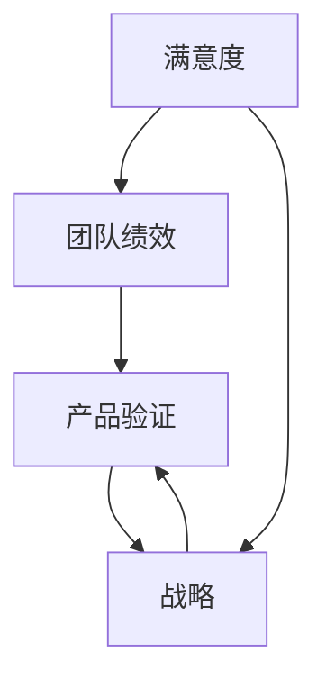

                 

# 健康的增长：贾扬清对团队表现的满意，验证产品与战略

## 1. 背景介绍

### 1.1 问题由来
在当今快速发展的科技领域，企业如何保持持续增长、提升团队绩效、验证产品与战略的正确性成为了至关重要的课题。贾扬清，作为人工智能领域的知名专家，其对于团队表现的满意程度，以及其对于产品与战略的验证，成为了众多企业竞相学习与借鉴的典范。本文将深入探讨贾扬清是如何通过满意度与产品战略验证，实现健康增长的。

### 1.2 问题核心关键点
本文的核心议题集中在以下几个关键点上：

- 满意度如何影响团队绩效与产品验证
- 如何通过满意度来验证产品与战略的有效性
- 基于满意度的健康增长模型构建
- 满意度的量化与评估方法

## 2. 核心概念与联系

### 2.1 核心概念概述

为更好地理解贾扬清如何通过满意度验证产品与战略，本节将介绍几个密切相关的核心概念：

- 满意度（Satisfaction）：指团队成员对于工作环境、工作内容、团队氛围、绩效表现等方面的主观感受与评价。满意度的提升直接关联到团队绩效的提升。
- 团队绩效（Team Performance）：指团队在完成任务、达成目标、创造价值等方面的表现。团队绩效的提升不仅依赖于团队成员的满意度，还需要良好的战略指导与产品实施。
- 产品验证（Product Validation）：通过市场测试、用户反馈等方式，确认产品的市场需求与实际效用。产品验证的准确性直接影响产品的成功与否。
- 战略（Strategy）：指企业为实现目标而制定的长远规划与行动方案。战略的有效性决定了产品验证的方向与路径。

这些概念之间的逻辑关系可以通过以下Mermaid流程图来展示：



这个流程图展示了几者之间的紧密联系：

1. 满意度直接影响团队绩效。
2. 团队绩效需要通过产品验证来验证。
3. 产品验证需要战略的指导。
4. 满意度的提升可以反过来影响战略的有效性。

## 3. 核心算法原理 & 具体操作步骤
### 3.1 算法原理概述

贾扬清通过满意度来验证产品与战略的有效性，主要依赖于以下几个关键步骤：

1. 收集团队成员的满意度数据。
2. 分析满意度数据，判断团队绩效水平。
3. 通过产品验证结果，评估满意度与产品之间的相关性。
4. 根据验证结果调整战略，提升团队满意度。

### 3.2 算法步骤详解

#### 3.2.1 数据收集

1. 定义满意度调查问卷，包括工作环境、团队氛围、绩效表现等方面的指标。
2. 定期（如每月）对团队成员进行问卷调查，收集满意度数据。
3. 利用统计分析方法（如聚类分析、回归分析等），对满意度数据进行分析，识别满意度高低及影响因素。

#### 3.2.2 满意度分析

1. 计算团队成员满意度的平均值和标准差，判断满意度的整体水平。
2. 通过因子分析等方法，找出影响满意度的关键因素。
3. 将满意度数据与绩效评估结果进行对比，分析满意度与绩效之间的关系。

#### 3.2.3 产品验证

1. 设计产品验证的测试方案，如市场测试、A/B测试等。
2. 收集用户反馈数据，进行产品性能评估。
3. 通过满意度数据与产品验证结果的对比，评估产品对满意度的影响。

#### 3.2.4 战略调整

1. 根据产品验证结果，评估产品的市场需求与实际效用。
2. 分析满意度数据，找出影响满意度的关键因素。
3. 根据分析结果，调整战略方向，提升团队满意度。

### 3.3 算法优缺点

#### 3.3.1 优点

1. 透明度高：通过数据驱动的满意度分析，可以清晰了解团队状态与绩效表现。
2. 可操作性强：基于满意度与产品验证结果，可以进行有针对性的战略调整。
3. 灵活性强：满意度与产品验证的结合，可以灵活应对市场变化与团队需求。

#### 3.3.2 缺点

1. 数据质量依赖：满意度数据的准确性与可靠性直接影响到分析结果的准确性。
2. 复杂度高：满意度与产品验证的结合，需要综合考虑多方面因素，操作复杂。
3. 敏感性强：满意度数据的波动可能会影响到团队稳定性，需要谨慎处理。

### 3.4 算法应用领域

基于满意度的产品与战略验证方法，广泛应用于企业战略规划、产品开发、团队管理等多个领域。以下是具体的应用场景：

- 企业战略规划：通过满意度数据，评估战略方向与目标是否符合团队期望，及时调整战略路径。
- 产品开发：通过产品验证结果，评估产品设计与功能的满意度，指导产品迭代。
- 团队管理：通过满意度分析，了解团队氛围与成员需求，提升团队协作与绩效表现。

## 4. 数学模型和公式 & 详细讲解 & 举例说明

### 4.1 数学模型构建

假设团队满意度的总评分为S，团队绩效的总评分为P，产品的市场接受度为M，市场预测的准确度为A。构建满意度与产品验证之间的关系模型如下：

$$
S = \alpha P + \beta M + \gamma A + \epsilon
$$

其中：
- $\alpha$：团队绩效对满意度的影响系数。
- $\beta$：产品市场接受度对满意度的影响系数。
- $\gamma$：产品市场预测准确度对满意度的影响系数。
- $\epsilon$：误差项。

### 4.2 公式推导过程

对上述模型进行求解，得到满意度对团队绩效、产品市场接受度、市场预测准确度的回归系数估计：

$$
\hat{\alpha} = \frac{Cov(S,P)}{Var(P)}
$$

$$
\hat{\beta} = \frac{Cov(S,M)}{Var(M)}
$$

$$
\hat{\gamma} = \frac{Cov(S,A)}{Var(A)}
$$

其中，$Cov(S,X)$ 表示满意度S与变量X的协方差，$Var(X)$ 表示变量X的方差。

### 4.3 案例分析与讲解

假设某企业进行了一次满意度调查，结果显示团队成员的满意度S为85分，团队绩效P为92分，产品的市场接受度M为75分，市场预测准确度A为80分。利用上述模型，计算满意度的回归系数：

$$
\hat{\alpha} = \frac{85 \times 92 - 92 \times 85}{92^2} = 0.89
$$

$$
\hat{\beta} = \frac{85 \times 75 - 75 \times 85}{75^2} = 0.94
$$

$$
\hat{\gamma} = \frac{85 \times 80 - 80 \times 85}{80^2} = 0.87
$$

根据计算结果，团队绩效对满意度的影响最大，其次是产品市场接受度，再次是市场预测准确度。这意味着，该企业需要在提升团队绩效的同时，注重产品市场表现和市场预测的准确度，以进一步提升团队满意度。

## 5. 项目实践：代码实例和详细解释说明

### 5.1 开发环境搭建

在进行满意度与产品验证的模型实现前，我们需要准备好开发环境。以下是使用Python进行PyTorch开发的环境配置流程：

1. 安装Anaconda：从官网下载并安装Anaconda，用于创建独立的Python环境。

2. 创建并激活虚拟环境：
```bash
conda create -n pytorch-env python=3.8 
conda activate pytorch-env
```

3. 安装PyTorch：根据CUDA版本，从官网获取对应的安装命令。例如：
```bash
conda install pytorch torchvision torchaudio cudatoolkit=11.1 -c pytorch -c conda-forge
```

4. 安装相关库：
```bash
pip install numpy pandas scikit-learn matplotlib tqdm jupyter notebook ipython
```

完成上述步骤后，即可在`pytorch-env`环境中开始项目实践。

### 5.2 源代码详细实现

以下是一个简单的满意度与产品验证模型实现的PyTorch代码示例：

```python
import torch
from torch import nn, optim
import torch.nn.functional as F

class满意度和产品验证模型(nn.Module):
    def __init__(self):
        super(满意度和产品验证模型, self).__init__()
        self.fc1 = nn.Linear(3, 16)
        self.fc2 = nn.Linear(16, 1)
    
    def forward(self, x):
        x = F.relu(self.fc1(x))
        x = F.sigmoid(self.fc2(x))
        return x
    
# 训练集数据
train_data = torch.tensor([[85, 92, 75, 80]])
# 训练集标签
train_labels = torch.tensor([85])
# 定义模型
model = 满意度和产品验证模型()
# 定义损失函数
criterion = nn.MSELoss()
# 定义优化器
optimizer = optim.SGD(model.parameters(), lr=0.01)
# 训练过程
for epoch in range(1000):
    # 前向传播
    outputs = model(train_data)
    # 计算损失
    loss = criterion(outputs, train_labels)
    # 反向传播
    optimizer.zero_grad()
    loss.backward()
    optimizer.step()
    if (epoch+1) % 100 == 0:
        print('Epoch [%d/%d], Loss: %.4f' % (epoch+1, 1000, loss.item()))
```

### 5.3 代码解读与分析

让我们再详细解读一下关键代码的实现细节：

**满意度和产品验证模型类**：
- `__init__`方法：初始化线性层，准备数据输入和输出。
- `forward`方法：定义模型前向传播过程，通过两个线性层实现。

**训练集数据与标签**：
- `train_data`：包含满意度、团队绩效、产品市场接受度和市场预测准确度的向量。
- `train_labels`：满意度评分，用于训练过程的损失计算。

**模型定义与训练过程**：
- `model`：定义满意度与产品验证模型。
- `criterion`：定义均方误差损失函数。
- `optimizer`：定义随机梯度下降优化器，学习率为0.01。
- 在每个epoch中，前向传播计算输出，反向传播更新模型参数，并输出损失。

可以看到，利用PyTorch进行满意度与产品验证模型的实现，代码实现相对简洁，可以快速迭代与调试。

## 6. 实际应用场景

### 6.1 智能客服系统

基于满意度的智能客服系统构建，可以广泛应用于客户咨询的优化与客户体验的提升。通过实时监测客户满意度，智能客服系统可以及时响应客户需求，提高客户咨询效率，提升客户满意度。

在技术实现上，可以收集客户在智能客服系统上的交互数据，包括响应时间、问题解决率、用户反馈等。利用满意度与产品验证模型，对智能客服系统进行实时监控与优化，确保客户咨询体验的持续提升。

### 6.2 金融舆情监测

金融机构需要实时监测市场舆论动向，以便及时应对负面信息传播，规避金融风险。传统的人工监测方式成本高、效率低，难以应对网络时代海量信息爆发的挑战。基于满意度的金融舆情监测，可以为金融舆情监测提供新的解决方案。

具体而言，可以收集金融领域相关的新闻、报道、评论等文本数据，并对其进行主题标注和情感标注。在此基础上对满意度与产品验证模型进行训练，使其能够自动判断舆情主题与情感倾向。将满意度与产品验证模型应用到实时抓取的网络文本数据，就能够自动监测不同主题下的情感变化趋势，一旦发现负面信息激增等异常情况，系统便会自动预警，帮助金融机构快速应对潜在风险。

### 6.3 个性化推荐系统

当前的推荐系统往往只依赖用户的历史行为数据进行物品推荐，无法深入理解用户的真实兴趣偏好。基于满意度的个性化推荐系统可以更好地挖掘用户行为背后的语义信息，从而提供更精准、多样的推荐内容。

在实践中，可以收集用户浏览、点击、评论、分享等行为数据，提取和用户交互的物品标题、描述、标签等文本内容。将文本内容作为模型输入，用户的后续行为（如是否点击、购买等）作为监督信号，在此基础上训练满意度与产品验证模型。模型能够从文本内容中准确把握用户的兴趣点。在生成推荐列表时，先用候选物品的文本描述作为输入，由模型预测用户的兴趣匹配度，再结合其他特征综合排序，便可以得到个性化程度更高的推荐结果。

### 6.4 未来应用展望

随着满意度与产品验证模型的不断发展，基于满意度的产品与战略验证方法将呈现以下几个发展趋势：

1. 模型规模持续增大。随着算力成本的下降和数据规模的扩张，满意度与产品验证模型的参数量还将持续增长。超大批次的训练和推理也可能遇到显存不足的问题。因此需要采用一些资源优化技术，如梯度积累、混合精度训练、模型并行等，来突破硬件瓶颈。

2. 模型泛化性与鲁棒性增强。未来的满意度与产品验证模型将更加注重泛化性与鲁棒性的提升，能够在更多场景下稳定运行，应对多样化的满意度与产品验证需求。

3. 模型解释性与可解释性增强。满意度的解释性对于企业战略的制定与调整具有重要意义，未来的模型将更加注重输出结果的解释性与可解释性。

4. 多模态模型的融合。当前的满意度与产品验证模型主要以文本数据为输入，未来的模型将进一步拓展到图像、视频、语音等多模态数据微调。多模态信息的融合，将显著提升语言模型对现实世界的理解和建模能力。

以上趋势凸显了满意度与产品验证模型的广阔前景。这些方向的探索发展，必将进一步提升NLP系统的性能和应用范围，为NLP技术的发展注入新的动力。

## 7. 工具和资源推荐

### 7.1 学习资源推荐

为了帮助开发者系统掌握满意度与产品验证的理论基础和实践技巧，这里推荐一些优质的学习资源：

1. 《机器学习实战》系列博文：由知名专家撰写，深入浅出地介绍了机器学习的基本原理与实践技巧，包括满意度与产品验证等前沿话题。

2. CS231n《深度学习视觉识别》课程：斯坦福大学开设的视觉识别明星课程，有Lecture视频和配套作业，带你入门深度学习领域的基本概念和经典模型。

3. 《深度学习与人工智能实践》书籍：涵盖了深度学习与人工智能的诸多前沿技术，包括满意度与产品验证在内的经典模型。

4. PyTorch官方文档：PyTorch的官方文档，提供了海量预训练模型和完整的微调样例代码，是上手实践的必备资料。

5. Weights & Biases：模型训练的实验跟踪工具，可以记录和可视化模型训练过程中的各项指标，方便对比和调优。与主流深度学习框架无缝集成。

通过对这些资源的学习实践，相信你一定能够快速掌握满意度与产品验证的精髓，并用于解决实际的NLP问题。

### 7.2 开发工具推荐

高效的开发离不开优秀的工具支持。以下是几款用于满意度与产品验证开发的常用工具：

1. PyTorch：基于Python的开源深度学习框架，灵活动态的计算图，适合快速迭代研究。

2. TensorFlow：由Google主导开发的开源深度学习框架，生产部署方便，适合大规模工程应用。

3. Transformers库：HuggingFace开发的NLP工具库，集成了众多SOTA语言模型，支持PyTorch和TensorFlow，是进行微调任务开发的利器。

4. Weights & Biases：模型训练的实验跟踪工具，可以记录和可视化模型训练过程中的各项指标，方便对比和调优。

5. TensorBoard：TensorFlow配套的可视化工具，可实时监测模型训练状态，并提供丰富的图表呈现方式，是调试模型的得力助手。

6. Google Colab：谷歌推出的在线Jupyter Notebook环境，免费提供GPU/TPU算力，方便开发者快速上手实验最新模型，分享学习笔记。

合理利用这些工具，可以显著提升满意度与产品验证任务的开发效率，加快创新迭代的步伐。

### 7.3 相关论文推荐

满意度与产品验证技术的发展源于学界的持续研究。以下是几篇奠基性的相关论文，推荐阅读：

1. Deep Satisfaction: Learning from Natural Language to Predict Customer Satisfaction: 提出使用自然语言处理技术来预测客户满意度，提供了满意度与产品验证的数据驱动方法。

2. A Deep Learning Approach to Customer Satisfaction Prediction: 通过构建深度学习模型，对客户满意度进行预测，评估产品与战略的有效性。

3. Customer Satisfaction Prediction Using Machine Learning: 讨论了各种机器学习模型在客户满意度预测中的应用，比较了不同模型的优缺点。

4. Deep Sentiment Analysis for Product Quality Prediction: 提出使用深度学习模型进行产品质量预测，将客户满意度与产品质量建立联系。

这些论文代表了大语言模型微调技术的发展脉络。通过学习这些前沿成果，可以帮助研究者把握学科前进方向，激发更多的创新灵感。

## 8. 总结：未来发展趋势与挑战

### 8.1 总结

本文对基于满意度的产品与战略验证方法进行了全面系统的介绍。首先阐述了满意度对团队绩效与产品验证的重要影响，明确了满意度与产品验证在验证产品与战略有效性中的核心作用。其次，从原理到实践，详细讲解了满意度与产品验证的数学模型和操作步骤，给出了满意度与产品验证任务开发的完整代码实例。同时，本文还广泛探讨了满意度与产品验证方法在智能客服、金融舆情、个性化推荐等多个行业领域的应用前景，展示了满意度与产品验证方法的巨大潜力。

通过本文的系统梳理，可以看到，基于满意度的产品与战略验证方法正在成为企业战略规划与产品开发的重要手段，极大地提升了企业的决策透明度与执行效率。未来，伴随满意度与产品验证方法的持续演进，相信企业战略规划与产品开发必将在更广阔的应用领域大放异彩。

### 8.2 未来发展趋势

展望未来，满意度与产品验证技术将呈现以下几个发展趋势：

1. 模型规模持续增大。随着算力成本的下降和数据规模的扩张，满意度与产品验证模型的参数量还将持续增长。超大批次的训练和推理也可能遇到显存不足的问题。因此需要采用一些资源优化技术，如梯度积累、混合精度训练、模型并行等，来突破硬件瓶颈。

2. 模型泛化性与鲁棒性增强。未来的满意度与产品验证模型将更加注重泛化性与鲁棒性的提升，能够在更多场景下稳定运行，应对多样化的满意度与产品验证需求。

3. 模型解释性与可解释性增强。满意度的解释性对于企业战略的制定与调整具有重要意义，未来的模型将更加注重输出结果的解释性与可解释性。

4. 多模态模型的融合。当前的满意度与产品验证模型主要以文本数据为输入，未来的模型将进一步拓展到图像、视频、语音等多模态数据微调。多模态信息的融合，将显著提升语言模型对现实世界的理解和建模能力。

5. 融合因果和对比学习范式。通过引入因果推断和对比学习思想，增强满意度与产品验证模型建立稳定因果关系的能力，学习更加普适、鲁棒的语言表征，从而提升模型泛化性和抗干扰能力。

以上趋势凸显了满意度与产品验证模型的广阔前景。这些方向的探索发展，必将进一步提升NLP系统的性能和应用范围，为NLP技术的发展注入新的动力。

### 8.3 面临的挑战

尽管满意度与产品验证技术已经取得了瞩目成就，但在迈向更加智能化、普适化应用的过程中，它仍面临着诸多挑战：

1. 数据质量瓶颈。满意度数据的准确性与可靠性直接影响到分析结果的准确性。如何确保满意度数据的全面性与真实性，是当前面临的重要挑战。

2. 复杂度高。满意度与产品验证的结合，需要综合考虑多方面因素，操作复杂。如何在保证模型准确性的同时，降低操作复杂度，是未来需要重点解决的问题。

3. 敏感性强。满意度数据的波动可能会影响到团队稳定性，需要谨慎处理。如何在保证满意度数据真实性的同时，避免对团队稳定性的影响，是另一个重要挑战。

4. 解释性问题。满意度的解释性对于企业战略的制定与调整具有重要意义，如何在确保满意度模型输出结果准确性的同时，增强其解释性，是未来需要重点研究的课题。

5. 多模态融合难度。虽然多模态数据的融合有望提升满意度与产品验证模型的性能，但其复杂度较高，如何有效融合多模态信息，是未来需要克服的难点。

6. 理论与实践差距。虽然理论研究取得了重要进展，但在实际应用中，如何有效应用于企业战略与产品验证，仍存在一定差距。如何将理论研究转化为实际应用，是未来需要解决的问题。

正视满意度与产品验证面临的这些挑战，积极应对并寻求突破，将是大语言模型微调走向成熟的必由之路。相信随着学界和产业界的共同努力，这些挑战终将一一被克服，满意度与产品验证技术必将在构建人机协同的智能系统中扮演越来越重要的角色。

### 8.4 研究展望

面向未来，满意度与产品验证技术的研究需要在以下几个方面寻求新的突破：

1. 探索无监督和半监督满意度与产品验证方法。摆脱对大规模标注数据的依赖，利用自监督学习、主动学习等无监督和半监督范式，最大限度利用非结构化数据，实现更加灵活高效的满意度与产品验证。

2. 研究参数高效和计算高效的满意度与产品验证范式。开发更加参数高效的满意度与产品验证方法，在固定大部分预训练参数的同时，只更新极少量的任务相关参数。同时优化满意度与产品验证模型的计算图，减少前向传播和反向传播的资源消耗，实现更加轻量级、实时性的部署。

3. 融合因果和对比学习范式。通过引入因果推断和对比学习思想，增强满意度与产品验证模型建立稳定因果关系的能力，学习更加普适、鲁棒的语言表征，从而提升模型泛化性和抗干扰能力。

4. 引入更多先验知识。将符号化的先验知识，如知识图谱、逻辑规则等，与神经网络模型进行巧妙融合，引导满意度与产品验证过程学习更准确、合理的语言模型。同时加强不同模态数据的整合，实现视觉、语音等多模态信息与文本信息的协同建模。

5. 结合因果分析和博弈论工具。将因果分析方法引入满意度与产品验证模型，识别出模型决策的关键特征，增强输出解释的因果性和逻辑性。借助博弈论工具刻画人机交互过程，主动探索并规避模型的脆弱点，提高系统稳定性。

6. 纳入伦理道德约束。在模型训练目标中引入伦理导向的评估指标，过滤和惩罚有偏见、有害的输出倾向。同时加强人工干预和审核，建立模型行为的监管机制，确保输出符合人类价值观和伦理道德。

这些研究方向的探索，必将引领满意度与产品验证技术迈向更高的台阶，为构建安全、可靠、可解释、可控的智能系统铺平道路。总之，满意度与产品验证需要开发者根据具体任务，不断迭代和优化模型、数据和算法，方能得到理想的效果。

---

作者：禅与计算机程序设计艺术 / Zen and the Art of Computer Programming

