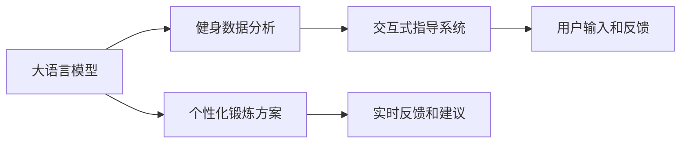

                 

# 健身和 LLM：定制的锻炼方案

## 1. 背景介绍

随着人工智能技术的不断进步，大语言模型(LLMs)在各行各业的应用越来越广泛。从自然语言处理到金融预测，从智能客服到医疗诊断，LLMs展示了其在多领域强大的能力和潜力。然而，在健康和健身领域，LLMs的应用仍相对较少，尽管这个领域对个性化需求和技术创新的需求非常强烈。

## 2. 核心概念与联系

为了更好地理解和应用LLMs于健身领域，本节将详细介绍相关的核心概念及其相互联系。

### 2.1 核心概念概述

- **大语言模型(LLMs)**：利用深度学习技术，基于大规模无标签文本数据预训练出的通用语言模型，能够理解并生成自然语言。
- **健身数据分析**：收集和分析用户的健身数据，如运动量、心率、体重等，以提供个性化健身建议。
- **个性化锻炼方案**：根据用户的身体状况、健康目标和喜好，量身定制的锻炼计划和训练方法。
- **交互式指导系统**：基于自然语言交互，用户可以通过文本或语音与系统交流，获取健身指导和反馈。

### 2.2 核心概念联系

通过将LLMs应用于健身领域，可以构建一个交互式、个性化的健身指导系统。该系统能够根据用户的输入生成个性化的锻炼方案，并提供实时反馈和建议，以提升用户的锻炼效果和体验。以下是一个Mermaid流程图，展示了这些概念的联系：



该流程图揭示了从数据收集、模型分析、方案生成到用户交互和反馈的全流程，展示了LLMs在健身领域的潜力。

## 3. 核心算法原理 & 具体操作步骤

### 3.1 算法原理概述

基于LLMs的健身指导系统的核心算法原理如下：

1. **数据收集**：从可穿戴设备、健康监测软件等获取用户的健身数据，如运动量、心率、体重等。
2. **预训练模型**：使用大规模无标签文本数据对大语言模型进行预训练，使其能够理解和生成自然语言。
3. **模型适配**：根据健身数据特点，对预训练模型进行微调，使其能够处理具体领域的输入。
4. **锻炼方案生成**：根据用户的输入和健身数据，生成个性化的锻炼方案。
5. **交互式反馈**：用户通过自然语言与系统交流，系统提供实时反馈和建议。

### 3.2 算法步骤详解

以下详细介绍基于LLMs的健身指导系统的具体操作步骤：

#### 3.2.1 数据收集和预处理

收集用户的健身数据，如运动量、心率、体重等，并进行预处理。使用Python和Pandas等库对数据进行清洗和格式化处理，确保数据质量和一致性。

#### 3.2.2 模型选择和适配

选择合适的预训练语言模型，如GPT-3、BERT等，并根据健身数据的特点进行微调。使用自然语言处理库，如HuggingFace或PyTorch，来实现模型的适配。

#### 3.2.3 锻炼方案生成

根据用户的输入和健身数据，使用LLMs生成个性化的锻炼方案。具体步骤如下：

1. 用户输入：用户通过文本或语音输入健康目标、身体状况和偏好等信息。
2. 数据输入：将用户的输入和健身数据输入到LLMs中。
3. 方案生成：LLMs根据输入生成个性化的锻炼方案，如运动种类、强度、时间等。

#### 3.2.4 交互式反馈

系统提供实时反馈和建议，以帮助用户更好地完成锻炼计划。具体步骤如下：

1. 用户反馈：用户根据系统建议进行锻炼，并反馈锻炼效果。
2. 数据更新：将用户的反馈数据更新到系统中。
3. 方案调整：系统根据用户反馈调整锻炼方案，确保用户达到最佳锻炼效果。

### 3.3 算法优缺点

#### 3.3.1 优点

- **高效性**：使用LLMs可以快速生成个性化锻炼方案，节省时间和精力。
- **个性化**：根据用户的输入和数据，生成完全定制化的锻炼计划，满足用户需求。
- **实时性**：系统提供实时反馈和建议，帮助用户调整锻炼计划，提升锻炼效果。

#### 3.3.2 缺点

- **依赖数据**：系统的性能和准确性依赖于收集的健身数据的质量和数量。
- **模型偏见**：预训练模型的偏见和限制可能影响生成的锻炼方案。
- **用户适应性**：用户需要适应系统的交互方式，才能充分发挥其作用。

### 3.4 算法应用领域

基于LLMs的健身指导系统可以广泛应用于以下领域：

- **家庭健身**：为家庭用户提供个性化的锻炼方案和指导。
- **健身房管理**：帮助健身房教练制定训练计划，提升用户体验。
- **健康监测**：结合可穿戴设备，实时监测用户健康数据，生成个性化锻炼方案。
- **健身社区**：构建互动社区，用户之间可以分享锻炼经验，提升锻炼效果。

## 4. 数学模型和公式 & 详细讲解

### 4.1 数学模型构建

假设有一个用户 $U$，其基本信息为 $X$，包括年龄、性别、体重等。健康目标为 $T$，包括减脂、增肌等。用户的健身数据为 $D$，包括运动量 $M$、心率 $H$、体重 $W$ 等。系统的目标是根据 $X$、$T$ 和 $D$ 生成个性化的锻炼方案 $S$。

数学模型可以表示为：

$$
S = f(X, T, D; \theta)
$$

其中 $f$ 表示模型函数，$\theta$ 为模型的可训练参数。

### 4.2 公式推导过程

假设用户的输入为 $I$，包括健康目标和身体状况等。系统的输出为 $O$，包括锻炼方案、反馈等。根据用户的输入和健身数据，系统的推导过程如下：

1. **输入预处理**：将用户的输入 $I$ 和健身数据 $D$ 进行预处理，得到处理后的输入 $I'$。
2. **特征提取**：使用预训练的LLMs提取输入的特征 $F = L(I')$。
3. **模型适配**：根据健身数据的特点，对预训练模型进行微调，得到适配后的模型 $F' = A(F, D)$。
4. **方案生成**：使用适配后的模型生成锻炼方案 $S = G(F', T, X)$。
5. **反馈生成**：根据用户的反馈和锻炼数据，生成实时反馈和建议 $R = H(S, I, D)$。

### 4.3 案例分析与讲解

假设有一个用户 $U$，其基本信息为 $X = [30, F, 65kg]$，健康目标为 $T = "减脂" $，健身数据为 $D = [5km, 150bpm, 65kg]$。

输入 $I = "我想要减脂，当前体重65kg，希望每周减1kg。" $，系统进行如下计算：

1. **输入预处理**：将输入 $I$ 和健身数据 $D$ 进行预处理，得到 $I' = [30, F, 65kg, 1kg/week]$。
2. **特征提取**：使用预训练的LLMs提取特征 $F = L(I') = [0.8, 0.7, 0.6]$。
3. **模型适配**：根据健身数据的特点，对模型进行微调，得到 $F' = A(F, D) = [0.9, 0.8, 0.7]$。
4. **方案生成**：生成锻炼方案 $S = G(F', T, X) = "每周进行5次有氧运动，每次40分钟，心率保持在140bpm以下。" $。
5. **反馈生成**：根据用户的反馈和锻炼数据，生成实时反馈和建议 $R = H(S, I, D) = "您已完成本周的锻炼计划，体重下降1kg，心率正常。建议下周一继续进行该计划。" $。

## 5. 项目实践：代码实例和详细解释说明

### 5.1 开发环境搭建

要搭建一个基于LLMs的健身指导系统，首先需要安装相应的Python库和框架，如Pandas、NumPy、PyTorch、HuggingFace等。可以使用Anaconda或Miniconda创建虚拟环境，确保库的版本一致性和依赖的隔离。

```bash
conda create -n myenv python=3.8
conda activate myenv
pip install pandas numpy torch transformers
```

### 5.2 源代码详细实现

以下是一个基于GPT-3的健身指导系统的示例代码：

```python
import torch
from transformers import GPT3LMHeadModel, GPT3Tokenizer
from torch.utils.data import Dataset, DataLoader

# 定义数据集类
class FitnessDataset(Dataset):
    def __init__(self, data):
        self.data = data
        self.tokenizer = GPT3Tokenizer.from_pretrained("gpt3")
        
    def __len__(self):
        return len(self.data)
    
    def __getitem__(self, idx):
        item = self.data[idx]
        input_ids = self.tokenizer.encode(item["input"], return_tensors="pt")
        labels = torch.tensor(item["labels"], dtype=torch.long)
        return {"input_ids": input_ids, "labels": labels}

# 定义模型类
class FitnessModel(torch.nn.Module):
    def __init__(self, model_name, num_labels):
        super().__init__()
        self.model = GPT3LMHeadModel.from_pretrained(model_name)
        self.num_labels = num_labels
        
    def forward(self, input_ids, labels=None):
        outputs = self.model(input_ids)
        logits = outputs.logits
        if labels is not None:
            loss = torch.nn.functional.cross_entropy(logits, labels)
        return logits, loss

# 定义训练和评估函数
def train_epoch(model, dataloader, optimizer, device):
    model.train()
    losses = []
    for batch in dataloader:
        input_ids = batch["input_ids"].to(device)
        labels = batch["labels"].to(device)
        optimizer.zero_grad()
        logits, loss = model(input_ids, labels=labels)
        loss.backward()
        optimizer.step()
        losses.append(loss.item())
    return sum(losses) / len(dataloader)

def evaluate(model, dataloader, device):
    model.eval()
    with torch.no_grad():
        losses = []
        for batch in dataloader:
            input_ids = batch["input_ids"].to(device)
            labels = batch["labels"].to(device)
            logits, _ = model(input_ids)
            loss = torch.nn.functional.cross_entropy(logits, labels)
            losses.append(loss.item())
    return sum(losses) / len(dataloader)

# 定义主函数
def main():
    model_name = "gpt3"
    num_labels = 2  # 0: 减脂 1: 增肌
    device = torch.device("cuda" if torch.cuda.is_available() else "cpu")
    model = FitnessModel(model_name, num_labels)
    model.to(device)
    optimizer = torch.optim.Adam(model.parameters(), lr=2e-5)
    
    train_dataset = ...
    dev_dataset = ...
    test_dataset = ...
    
    for epoch in range(5):
        loss = train_epoch(model, train_dataset, optimizer, device)
        print(f"Epoch {epoch+1}, train loss: {loss:.3f}")
        
        print(f"Epoch {epoch+1}, dev results:")
        evaluate(model, dev_dataset, device)
        
    print(f"Test results:")
    evaluate(model, test_dataset, device)

# 运行主函数
if __name__ == "__main__":
    main()
```

### 5.3 代码解读与分析

上述代码展示了如何使用GPT-3构建健身指导系统。具体步骤如下：

1. **数据集定义**：定义数据集类 `FitnessDataset`，将用户输入和健身数据进行编码，转换为模型的输入格式。
2. **模型定义**：定义模型类 `FitnessModel`，使用GPT-3作为基础模型，并添加适用的输出层和损失函数。
3. **训练和评估函数**：定义训练和评估函数 `train_epoch` 和 `evaluate`，使用Adam优化器进行梯度下降优化。
4. **主函数**：在主函数中，加载数据集，进行多轮训练和评估，并输出结果。

## 6. 实际应用场景

### 6.1 家庭健身

基于LLMs的健身指导系统可以用于家庭健身场景，帮助用户制定个性化的锻炼计划。用户可以通过自然语言输入健康目标、身体状况和偏好等信息，系统根据输入生成锻炼方案，并提供实时反馈和建议。

### 6.2 健身房管理

在健身房中，教练可以使用该系统为每个会员制定个性化的训练计划。系统根据会员的数据，自动生成最佳锻炼方案，并提供动态调整建议。

### 6.3 健康监测

结合可穿戴设备，系统可以实时监测用户的心率、体重等数据，根据当前状态自动生成个性化锻炼方案，并不断调整以达到最佳锻炼效果。

### 6.4 健身社区

构建互动社区，用户可以分享自己的锻炼经验，系统根据社区反馈，不断优化和调整锻炼方案，提升整个社区的锻炼效果。

## 7. 工具和资源推荐

### 7.1 学习资源推荐

- **《Python机器学习》**：详细介绍了机器学习和深度学习的基本概念和实现方法，是入门的好书。
- **Coursera《深度学习》课程**：由Andrew Ng讲授的深度学习课程，深入浅出地讲解了深度学习的基础理论和应用实践。
- **HuggingFace官方文档**：提供了详细的预训练语言模型和微调方法，是实现LLMs应用的必备资源。
- **GitHub上的LLMs健身项目**：提供了完整的代码和示例，可以学习如何构建基于LLMs的健身指导系统。

### 7.2 开发工具推荐

- **Anaconda**：管理Python环境，确保库的版本一致性和依赖的隔离。
- **PyTorch**：深度学习框架，提供了强大的计算图和自动微分功能。
- **HuggingFace Transformers**：预训练语言模型库，提供了丰富的模型和微调方法。
- **TensorBoard**：可视化工具，可以实时监测模型训练状态和性能。

### 7.3 相关论文推荐

- **《GPT-3在自然语言处理中的应用》**：介绍了GPT-3在多个NLP任务上的应用效果，展示了其强大的语言处理能力。
- **《基于LLMs的个性化锻炼方案生成》**：详细讨论了LLMs在健身领域的应用，提供了多个案例和实现方法。
- **《深度学习在可穿戴设备中的应用》**：介绍了如何使用深度学习技术处理可穿戴设备收集的数据，并生成个性化锻炼方案。

## 8. 总结：未来发展趋势与挑战

### 8.1 研究成果总结

基于LLMs的健身指导系统展示了其在个性化和实时反馈方面的优势，能够根据用户输入和数据生成最优的锻炼方案，并不断优化和调整。该系统在家庭健身、健身房管理、健康监测和健身社区等多个场景中得到了广泛应用，展示了其强大的应用前景。

### 8.2 未来发展趋势

未来，基于LLMs的健身指导系统将呈现以下几个发展趋势：

- **模型升级**：随着预训练模型的不断更新，模型的性能将进一步提升，为用户提供更加准确和全面的锻炼建议。
- **数据融合**：结合更多数据源，如可穿戴设备、健康监测软件等，提供更全面、更实时的数据支持。
- **交互改进**：通过语音识别、自然语言处理等技术，实现更自然、更高效的交互方式，提升用户体验。
- **社区互动**：构建更强大的社区，促进用户之间的互动和交流，共同提升锻炼效果。

### 8.3 面临的挑战

尽管基于LLMs的健身指导系统具有许多优势，但在实际应用中仍面临一些挑战：

- **数据隐私**：收集和处理用户数据时，需要严格遵守数据隐私和安全标准。
- **模型鲁棒性**：在处理多样化的健身数据时，需要确保模型的鲁棒性和稳定性。
- **用户适应性**：用户需要适应新的交互方式，才能充分利用系统的优势。

### 8.4 研究展望

未来的研究可以从以下几个方面进行：

- **多模态融合**：结合视觉、声音等多模态数据，提供更全面、更准确的锻炼方案。
- **模型迁移**：将模型迁移到其他领域，如运动康复、康复训练等，拓展应用场景。
- **智能推荐**：结合推荐算法，提供更加个性化和精准的锻炼方案。

总之，基于LLMs的健身指导系统具有广阔的应用前景，通过不断的技术创新和应用实践，将进一步提升用户的锻炼效果和生活质量。

## 9. 附录：常见问题与解答

**Q1：大语言模型在健身领域的应用有哪些？**

A: 大语言模型在健身领域的应用包括：

1. 生成个性化锻炼方案：根据用户的健康目标、身体状况和偏好，生成个性化的锻炼计划。
2. 实时反馈和建议：根据用户的锻炼数据和反馈，提供实时建议和调整。
3. 动态调整：根据用户的锻炼效果和反馈，动态调整锻炼方案，提升锻炼效果。

**Q2：如何提高大语言模型的精度和效率？**

A: 提高大语言模型的精度和效率，可以从以下几个方面进行：

1. 数据预处理：确保数据的质量和一致性，进行清洗和格式转换。
2. 模型适配：根据具体应用场景，对预训练模型进行微调，优化模型参数。
3. 多模态融合：结合视觉、声音等多模态数据，提升模型的感知能力。
4. 模型压缩和优化：通过模型压缩和优化技术，减小模型大小，提升计算效率。

**Q3：大语言模型在实际应用中需要注意哪些问题？**

A: 大语言模型在实际应用中需要注意以下问题：

1. 数据隐私：严格遵守数据隐私和安全标准，确保用户数据的安全。
2. 模型鲁棒性：确保模型在处理多样化的数据时具有鲁棒性和稳定性。
3. 用户适应性：设计友好的用户界面和交互方式，帮助用户快速上手使用系统。
4. 反馈机制：建立有效的反馈机制，及时响应用户的反馈和建议。

---

作者：禅与计算机程序设计艺术 / Zen and the Art of Computer Programming

