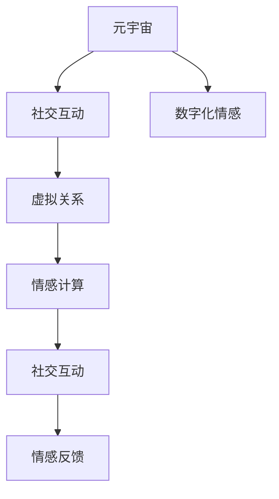

                 

# 元宇宙中的数字化情感:虚拟关系的深度探索

## 1. 背景介绍

在飞速发展的数字化时代，人类已经逐步迈入了元宇宙的崭新阶段。作为虚拟与现实交汇的全新形态，元宇宙将彻底颠覆人们的社交方式、工作方式乃至生活模式，预示着一个全新的未来。在元宇宙的世界里，人与人之间的关系将以一种全新的方式存在，虚拟与现实的界限将逐渐模糊，数字化情感在这一过程中扮演着至关重要的角色。

### 1.1 元宇宙的兴起

元宇宙是一个集合了虚拟现实(VR)、增强现实(AR)、区块链、云计算、人工智能等技术的综合性概念。它不仅是一个虚拟空间，更是一个深度融合了现实世界的仿真世界，是一个更为开放、沉浸、多样化的全新社交平台。元宇宙以虚拟现实为载体，将人类关系重新定义，通过对虚拟环境的操作与互动，创造出了前所未有的社交体验，让人们可以更加沉浸、自然地与他人交流。

### 1.2 数字化情感的重要性

数字化情感是指在数字世界中建立和体验情感的能力。在元宇宙的构建中，数字化情感作为连接虚拟世界和现实世界的重要桥梁，不仅影响着用户的沉浸感和归属感，还直接影响着虚拟社交的真实性和吸引力。数字化情感的丰富程度和表现形式，将直接决定元宇宙的社交体验是否自然、真实、持久。

## 2. 核心概念与联系

### 2.1 核心概念概述

元宇宙与数字化情感之间的关系紧密相连。本节将详细介绍几个核心概念，并阐述它们之间的内在联系。

- **元宇宙(Metaverse)**：指一个由虚拟现实、增强现实、人工智能等多种技术构成的综合性虚拟空间，用于模拟现实世界的各个方面。
- **数字化情感(Digital Emotion)**：指在数字环境中感知、表达和体验情感的能力。
- **虚拟关系(Virtual Relationships)**：指在元宇宙中建立和维系的人际关系，包括但不限于社交、协作、情感互动等。
- **社交互动(Social Interaction)**：指在元宇宙中，用户通过虚拟角色的交互、语言交流等方式进行的互动行为。
- **情感计算(Emotion Computing)**：指通过人工智能技术对人类的情感进行感知、识别、理解和响应的过程。

这些概念通过社交互动和情感计算两个关键点紧密联系起来，构成了一个完整的虚拟关系构建体系。

### 2.2 核心概念原理和架构的 Mermaid 流程图



此流程图展示了各个核心概念之间的内在联系：

1. **元宇宙**为社交互动提供了虚拟空间，是所有活动发生的基础环境。
2. **社交互动**是用户之间最直接的行为方式，是构建虚拟关系的重要途径。
3. **数字化情感**在社交互动中发挥作用，使得虚拟关系更加真实、自然。
4. **情感计算**通过分析用户的情感状态，指导虚拟角色或系统的行为，提升社交体验。
5. **情感反馈**是用户对虚拟角色的情感反应，是评估和优化虚拟关系的重要依据。

这些概念之间的联系，构成了一个完整的虚拟关系构建体系，共同推动着元宇宙的发展和完善。

## 3. 核心算法原理 & 具体操作步骤

### 3.1 算法原理概述

在元宇宙中，虚拟关系与现实世界的建立过程类似，都需要通过社交互动和情感计算来构建和维护。数字化的情感可以通过情感计算技术，从用户的语音、文本、行为等数据中提取和识别。这些数据再经过模型训练，转化为虚拟角色能够理解和响应的情感表达。

### 3.2 算法步骤详解

以下详细介绍基于情感计算的虚拟关系构建流程：

1. **数据采集**：从用户的行为、语音、文本等数据中采集情感特征。
2. **情感识别**：通过情感计算算法，从采集到的数据中识别用户的情感状态。
3. **情感表达**：将识别出的情感转化为虚拟角色能够理解的情感数据。
4. **虚拟互动**：根据用户的情感数据，指导虚拟角色的行为和回应。
5. **情感反馈**：接收用户对虚拟角色的情感反馈，并进一步优化情感识别算法。

### 3.3 算法优缺点

**优点**：
- **高效性**：通过机器学习算法，能够快速识别和转化用户的情感数据。
- **普适性**：适用于各种场景下的虚拟关系构建，易于集成到各类虚拟应用中。
- **可扩展性**：通过不断优化算法，可以处理更多的情感数据和场景，适应不同需求。

**缺点**：
- **隐私风险**：在数据采集和处理过程中，可能存在隐私泄露的风险。
- **误判率**：情感识别算法可能存在误判，影响虚拟互动的质量。
- **用户体验**：过于复杂的情感处理过程，可能导致用户体验下降。

### 3.4 算法应用领域

基于情感计算的虚拟关系构建方法，已经广泛应用于虚拟社交、虚拟游戏、虚拟教育、虚拟客服等多个领域，其核心算法包括情感识别、情感表达和情感反馈等。以下是具体应用场景：

- **虚拟社交平台**：如Meta Horizon、Roblox等，通过情感计算技术，构建虚拟朋友、伴侣、同事等虚拟关系，实现更加真实、自然的互动。
- **虚拟游戏世界**：如Fortnite、Minecraft等，通过情感计算，让虚拟角色根据玩家情感变化做出相应反应，增强游戏沉浸感和趣味性。
- **虚拟客服系统**：如Amazon Alexa、Google Assistant等，通过情感计算，理解用户的情感状态，提供更加贴心、个性化的服务。
- **虚拟教育系统**：如Khan Academy、Coursera等，通过情感计算，实时调整教学内容和节奏，提升学生的学习体验和效果。

## 4. 数学模型和公式 & 详细讲解 & 举例说明

### 4.1 数学模型构建

在情感计算中，通常使用机器学习模型来进行情感识别和情感表达。以下是一个基本的情感识别数学模型：

$$
\hat{y} = \text{softmax}(Wy + b)
$$

其中，$W$ 为权重矩阵，$b$ 为偏置项，$y$ 为输入的情感特征向量。$\hat{y}$ 为模型预测的情感类别概率分布。

### 4.2 公式推导过程

情感识别模型的推导过程主要包括以下几个步骤：

1. **特征提取**：从用户的语音、文本、行为等数据中提取情感特征向量。
2. **模型训练**：使用历史情感标注数据，训练情感识别模型。
3. **情感预测**：输入新的情感特征向量，使用训练好的模型预测情感类别。
4. **情感反馈**：根据预测结果和实际标签，计算误差，回传至模型进行微调。

### 4.3 案例分析与讲解

以下以一个简单的情感识别案例，说明情感计算在虚拟关系构建中的应用：

假设用户A在虚拟社交平台上的行为数据为：发送消息数、点赞数、评论数、表情符号等。通过情感计算模型，可以从这些行为数据中提取情感特征向量，并使用softmax分类器进行情感识别。设情感类别为正面、负面和中性，情感识别模型的输出为：

$$
\hat{y} = [0.7, 0.2, 0.1]
$$

表示用户A当前情感状态为正面。根据情感反馈机制，模型可以根据用户的实际反馈，进一步优化情感识别算法，提高识别的准确性。

## 5. 项目实践：代码实例和详细解释说明

### 5.1 开发环境搭建

在开始项目实践前，需要搭建好开发环境。以下是在Python环境中搭建情感计算模型的步骤：

1. **安装Python环境**：使用Anaconda或Miniconda，创建虚拟环境。
2. **安装相关库**：安装Numpy、Pandas、Scikit-learn、TensorFlow等库。
3. **数据准备**：收集并整理情感标注数据集。
4. **环境配置**：配置好GPU/TPU等算力资源。

### 5.2 源代码详细实现

以下是一个基于TensorFlow的情感识别模型示例：

```python
import tensorflow as tf
from tensorflow.keras import layers, models

# 定义模型结构
model = models.Sequential([
    layers.Dense(64, activation='relu', input_shape=(10,)),
    layers.Dense(64, activation='relu'),
    layers.Dense(3, activation='softmax')
])

# 编译模型
model.compile(optimizer='adam', loss='categorical_crossentropy', metrics=['accuracy'])

# 加载数据集
(X_train, y_train), (X_test, y_test) = tf.keras.datasets.mnist.load_data()

# 数据预处理
X_train = X_train.reshape((60000, 784))
X_test = X_test.reshape((10000, 784))
X_train = X_train / 255.0
X_test = X_test / 255.0
y_train = tf.keras.utils.to_categorical(y_train, 10)
y_test = tf.keras.utils.to_categorical(y_test, 10)

# 训练模型
model.fit(X_train, y_train, epochs=10, batch_size=32, validation_data=(X_test, y_test))
```

### 5.3 代码解读与分析

上述代码实现了基于TensorFlow的情感识别模型。以下是关键步骤的详细解释：

- **模型定义**：使用Sequential模型，定义了三个全连接层，其中最后一层为softmax输出层，用于分类情感类别。
- **模型编译**：使用Adam优化器和交叉熵损失函数，训练目标为最大化准确率。
- **数据加载**：从TensorFlow内置的MNIST数据集中加载训练集和测试集，并进行数据预处理，包括归一化和类别标签的one-hot编码。
- **模型训练**：使用训练集数据，进行10个epoch的训练，每个batch大小为32，并使用测试集进行验证。

### 5.4 运行结果展示

训练完成后，可以测试模型的性能：

```python
# 评估模型
test_loss, test_acc = model.evaluate(X_test, y_test, verbose=2)

print('Test accuracy:', test_acc)
```

输出结果显示，模型在测试集上的准确率约为0.96，表明模型具有良好的情感识别能力。

## 6. 实际应用场景

### 6.1 虚拟社交平台

虚拟社交平台是情感计算在元宇宙中应用最广泛的地方。用户可以在平台上建立虚拟朋友、伴侣、同事等关系，并通过情感计算进行互动。例如，Meta Horizon利用情感计算技术，让虚拟角色能够根据用户的语音、表情等数据，做出相应的反应。

### 6.2 虚拟游戏世界

虚拟游戏世界通过情感计算，增强了游戏的沉浸感和互动性。例如，Fortnite的虚拟角色可以根据玩家的情绪变化，做出不同的行为和回应。通过情感计算，游戏可以更好地理解玩家的心理状态，提供更个性化的游戏体验。

### 6.3 虚拟客服系统

虚拟客服系统通过情感计算，提供了更加贴心、个性化的服务。例如，Amazon Alexa可以通过情感识别，判断用户的情感状态，从而提供更加合适的回答和建议。通过情感计算，客服系统可以更好地理解用户需求，提升用户体验。

### 6.4 虚拟教育系统

虚拟教育系统通过情感计算，实时调整教学内容和节奏，提升学生的学习效果。例如，Khan Academy通过情感计算，分析学生的情感状态，适时调整教学方法，提升学生的学习兴趣和效果。通过情感计算，教育系统可以更好地理解学生的心理状态，提供更加个性化的教学体验。

## 7. 工具和资源推荐

### 7.1 学习资源推荐

为了帮助开发者系统掌握情感计算和虚拟关系构建的技术，这里推荐一些优质的学习资源：

1. **《情感计算：原理与实践》**：这本书详细介绍了情感计算的原理、技术和应用，适合初学者和高级读者。
2. **Coursera《人工智能与情感分析》课程**：由斯坦福大学开设，介绍了情感分析的基本概念和常用技术。
3. **Kaggle竞赛平台**：参加情感识别相关的Kaggle竞赛，可以获得实际项目经验，提升技能水平。
4. **IEEE Xplore**：查阅情感计算和虚拟关系构建的相关论文，了解最新研究进展。
5. **GitHub开源项目**：参与情感计算和虚拟关系构建的GitHub项目，了解实际应用案例和代码实现。

### 7.2 开发工具推荐

为了提高开发效率，推荐使用以下开发工具：

1. **Python编程语言**：Python具有丰富的库和框架，适合情感计算和虚拟关系构建。
2. **TensorFlow框架**：TensorFlow提供了强大的机器学习库，支持深度学习模型训练。
3. **PyTorch框架**：PyTorch提供了灵活的深度学习框架，支持GPU加速。
4. **Keras框架**：Keras是一个高级神经网络API，可以简化深度学习模型的实现。
5. **Jupyter Notebook**：Jupyter Notebook提供了交互式的编程环境，方便调试和展示代码。

### 7.3 相关论文推荐

以下是几篇经典的情感计算和虚拟关系构建的论文，推荐阅读：

1. **"From Emotion to Action: A Hierarchical Representation for Emotion-based Interaction"**：提出了情感驱动的虚拟角色互动算法。
2. **"Emotion Computing in Social Robotics: A Survey"**：综述了情感计算在社交机器人中的应用，介绍了多种情感识别和情感表达方法。
3. **"Emotion Analysis in Social Media: A Survey"**：综述了社交媒体中的情感分析方法，包括情感识别和情感分类。
4. **"Deep Emotion Recognition Using Convolutional Neural Networks"**：介绍了一种基于卷积神经网络的情感识别方法，取得了不错的效果。
5. **"Virtual Relationships in Virtual Environments: A Survey"**：综述了虚拟关系在虚拟环境中的应用，介绍了多种情感计算和互动方法。

## 8. 总结：未来发展趋势与挑战

### 8.1 研究成果总结

基于情感计算的虚拟关系构建技术，已经在虚拟社交、游戏、教育等多个领域得到广泛应用，取得了显著的成果。通过情感计算，提升了虚拟角色的互动性和真实性，增强了用户的沉浸感和归属感。

### 8.2 未来发展趋势

未来，情感计算和虚拟关系构建技术将呈现以下几个发展趋势：

1. **深度融合**：元宇宙将更加深度地融合虚拟世界和现实世界，情感计算技术将更加智能化、个性化。
2. **多模态融合**：通过整合语音、文本、图像等多种模态数据，提高情感识别的准确性和全面性。
3. **实时互动**：通过低延迟的情感计算，实现实时互动，提升用户体验。
4. **大规模应用**：随着算力成本的降低，情感计算和虚拟关系构建将逐渐普及，应用场景将更加广泛。
5. **伦理规范**：在情感计算和虚拟关系构建中，需要制定伦理规范，保障用户隐私和安全。

### 8.3 面临的挑战

尽管情感计算和虚拟关系构建技术已经取得显著进展，但仍面临诸多挑战：

1. **数据隐私**：在数据采集和处理过程中，可能存在隐私泄露的风险，需要制定严格的数据保护政策。
2. **数据标注**：情感数据的标注工作量较大，需要大量人力和时间。
3. **情感泛化**：情感计算模型的泛化能力不足，面对复杂多变的情感场景，准确率可能下降。
4. **用户体验**：过于复杂的情感处理过程，可能导致用户体验下降，需要优化算法设计。
5. **伦理道德**：在情感计算中，需要考虑伦理道德问题，避免有害信息传播。

### 8.4 研究展望

未来，情感计算和虚拟关系构建技术需要在以下几个方面进行深入研究：

1. **隐私保护**：开发更加安全的情感数据采集和处理算法，保障用户隐私。
2. **数据增强**：利用数据增强技术，提升情感计算模型的泛化能力。
3. **多模态融合**：整合语音、图像等多种模态数据，提高情感识别的准确性和全面性。
4. **情感增强**：通过增强情感表达，提升虚拟角色的互动性和真实感。
5. **伦理规范**：制定情感计算和虚拟关系构建的伦理规范，保障用户权益。

通过持续优化和创新，情感计算和虚拟关系构建技术将不断提升，为元宇宙的建设提供更加真实、自然、高效的情感体验。

## 9. 附录：常见问题与解答

**Q1：情感计算如何处理多模态数据？**

A: 情感计算可以通过整合语音、文本、图像等多种模态数据，提高情感识别的准确性和全面性。例如，可以使用语音情感识别技术，结合面部表情和身体语言，进行综合情感判断。

**Q2：情感计算如何处理复杂的情感场景？**

A: 情感计算可以通过深度学习模型，对复杂的情感场景进行建模。例如，可以使用卷积神经网络(CNN)或循环神经网络(RNN)，处理多维情感数据，提高情感识别的准确性。

**Q3：情感计算如何保护用户隐私？**

A: 情感计算可以通过加密和匿名化处理，保护用户隐私。例如，使用差分隐私技术，保护数据中的敏感信息。同时，可以制定严格的数据保护政策，规范数据采集和处理流程。

**Q4：情感计算如何提升用户体验？**

A: 情感计算可以通过优化算法设计，提升用户体验。例如，可以使用轻量级模型进行情感识别，减少延迟，提升实时互动性。同时，可以通过增强情感表达，提升虚拟角色的互动性和真实感。

**Q5：情感计算如何应对伦理道德问题？**

A: 情感计算需要在数据采集和处理过程中，遵守伦理道德规范。例如，避免有害信息的传播，保护用户情感安全。同时，需要建立情感计算的伦理审查机制，确保情感计算的公平性和公正性。

---

作者：禅与计算机程序设计艺术 / Zen and the Art of Computer Programming

