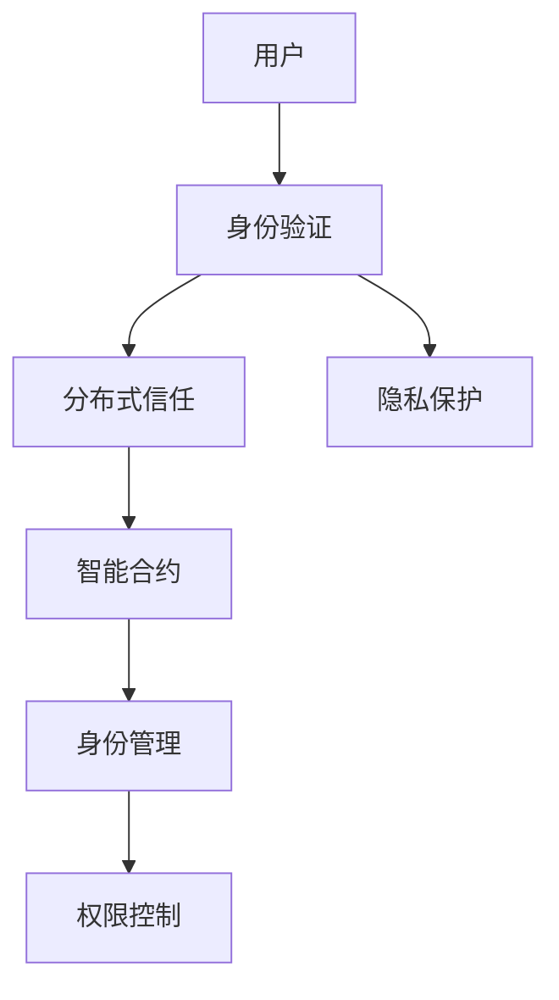

                 

# 元宇宙中的身份认证:去中心化信任体系

> 关键词：元宇宙、身份认证、去中心化、区块链、分布式信任、隐私保护、智能合约

## 1. 背景介绍

### 1.1 问题由来
随着虚拟现实技术的发展，元宇宙（Metaverse）概念逐渐兴起，成为新一代互联网的重要形态。元宇宙是一个基于虚拟现实、增强现实、区块链等技术的数字世界，用户在其中可以通过虚拟身份进行社交、娱乐、商业等活动。然而，元宇宙环境中的身份认证问题，成为了其健康发展的重大障碍。

当前，传统的中心化身份认证系统存在单点故障、隐私泄露、信任问题等诸多弊端。尤其在元宇宙这样去中心化的环境中，中心化的身份认证模式无法满足用户对隐私保护和信任透明度的需求。如何构建一种去中心化、高效且安全的身份认证体系，成为元宇宙发展中亟需解决的问题。

### 1.2 问题核心关键点
元宇宙身份认证的核心在于如何在去中心化的环境中，实现用户身份的验证和信任的建立。传统的中心化认证模式基于PKI（公钥基础设施）和单点认证，用户在元宇宙中转换身份时，需要依赖各个平台的身份和信任体系。这不仅增加了信任成本，也存在隐私泄露和安全漏洞的风险。

为解决这些问题，元宇宙身份认证必须考虑以下几个方面：
- 如何构建去中心化的身份验证机制。
- 如何保证用户隐私和数据安全。
- 如何在分布式网络中建立信任。
- 如何支持灵活的身份管理和权限控制。

### 1.3 问题研究意义
构建一个安全、高效的元宇宙身份认证体系，对元宇宙的普及和应用具有重要意义：

1. 保障用户隐私和数据安全。通过去中心化的认证方式，可以有效减少用户信息泄露的风险。
2. 提升用户体验。去中心化的身份认证系统可以简化认证流程，减少复杂的操作步骤，提高用户使用便捷性。
3. 增强信任度。元宇宙用户可以在无需信任中心化机构的条件下，建立基于区块链的信任关系，降低信任成本。
4. 推动元宇宙商业化应用。安全的身份认证是元宇宙商业模式的核心保障，有助于推动元宇宙产业的商业化进程。
5. 提高元宇宙的开放性。去中心化的认证方式有助于构建一个更加开放、自由、多样的元宇宙环境。

## 2. 核心概念与联系

### 2.1 核心概念概述

元宇宙中的身份认证，实际上是一个去中心化的信任体系构建过程。其核心概念包括：

- **身份验证（Identity Verification）**：确认用户真实身份的过程。
- **分布式信任（Distributed Trust）**：在去中心化网络中，通过共识机制和智能合约构建信任关系。
- **隐私保护（Privacy Preservation）**：在身份认证过程中保护用户隐私和数据安全。
- **智能合约（Smart Contract）**：一种基于区块链技术的自动化合约，能够实现身份认证、权限控制等操作。

这些概念之间存在着密切的联系，共同构成了元宇宙身份认证系统的基础框架。

### 2.2 核心概念原理和架构的 Mermaid 流程图



### 2.3 核心概念原理和架构的解释

#### 身份验证（Identity Verification）
身份验证是元宇宙身份认证系统的第一步。用户需要在虚拟世界中创建一个身份，并通过一系列验证步骤来确认其真实性。传统的身份验证方法包括密码、生物识别、OTP（一次性验证码）等，但在去中心化的环境中，这些方法难以保证用户隐私和数据安全。

#### 分布式信任（Distributed Trust）
在去中心化的网络中，信任机制的建立需要依赖分布式共识。常见的共识机制包括PoW（工作量证明）、PoS（权益证明）、DPoS（授权证明）等。用户通过这些共识机制，在分布式网络中建立起对其他用户和系统的信任关系。

#### 隐私保护（Privacy Preservation）
隐私保护是元宇宙身份认证系统的关键点。在去中心化的环境中，用户的隐私和数据安全受到极大威胁。因此，需要采用加密技术、零知识证明、隐私计算等手段，保护用户隐私，确保数据的安全性和不可篡改性。

#### 智能合约（Smart Contract）
智能合约是一种基于区块链技术的自动化合约，能够实现身份认证、权限控制等操作。用户通过智能合约，可以在无需信任中心化机构的情况下，自动进行身份认证和权限管理。

这些核心概念相互依存、相互作用，共同构成了元宇宙身份认证系统的复杂生态。

## 3. 核心算法原理 & 具体操作步骤
### 3.1 算法原理概述

元宇宙中的身份认证体系，基于区块链和分布式共识机制，通过智能合约实现身份验证和权限控制。其核心算法原理包括：

- **去中心化身份验证算法**：采用公钥加密和零知识证明等技术，确保身份验证过程不依赖中心化机构，同时保护用户隐私。
- **分布式信任算法**：通过共识机制，如PoW、PoS等，在去中心化网络中构建信任关系。
- **智能合约算法**：使用以太坊虚拟机的代码，实现身份认证、权限控制等功能，确保操作的安全性和透明性。

### 3.2 算法步骤详解

#### 步骤一：身份注册
用户首先需要创建一个虚拟身份，并在区块链上注册。这一过程包括以下步骤：

1. 用户生成一对公私钥。
2. 将公钥上传至区块链，作为身份标识。
3. 用户创建智能合约账户，与公钥绑定。

#### 步骤二：身份验证
用户进行身份验证时，需要通过以下步骤：

1. 生成一个随机数，并在区块链上提交。
2. 接受身份请求方生成的挑战。
3. 通过计算挑战数和私钥的哈希值，生成响应。
4. 验证响应是否满足要求，通过后即完成身份验证。

#### 步骤三：分布式信任
用户在网络中建立信任关系时，需要以下步骤：

1. 用户加入一个分布式网络，如Ethereum网络。
2. 使用共识机制，如PoW、PoS，与网络中的其他用户建立信任关系。
3. 通过智能合约，与信任关系中的其他用户进行身份验证和权限管理。

#### 步骤四：权限控制
用户进行权限控制时，需要以下步骤：

1. 在智能合约中定义权限规则。
2. 用户根据规则，进行权限验证。
3. 根据验证结果，控制用户的访问权限。

### 3.3 算法优缺点

#### 优点
1. **去中心化**：去中心化的身份认证体系，减少了对中心化机构的依赖，提高了系统的可靠性和安全性。
2. **透明性**：智能合约实现了透明的操作，减少了信息不对称的问题，增强了系统的可信任度。
3. **可扩展性**：基于区块链的分布式信任体系，可以处理大规模用户和交易，具有较好的可扩展性。
4. **隐私保护**：采用加密技术和隐私计算手段，保护用户隐私，减少了隐私泄露的风险。

#### 缺点
1. **计算复杂性**：去中心化的身份验证和信任机制，需要较高的计算能力和网络带宽。
2. **技术门槛**：区块链和智能合约技术相对复杂，需要较高的技术水平和开发成本。
3. **性能瓶颈**：在处理大规模并发请求时，区块链的性能瓶颈可能影响系统的效率。
4. **用户教育成本**：用户需要了解区块链和智能合约技术，增加了教育成本和入门门槛。

### 3.4 算法应用领域

元宇宙身份认证体系的应用领域广泛，涵盖以下方面：

1. **虚拟经济**：元宇宙中的虚拟资产交易、游戏、虚拟市场等，都需要安全、高效的身份认证系统。
2. **社交平台**：在元宇宙中，用户需要进行身份验证和信任关系管理，确保社交平台的稳定性和安全性。
3. **商业应用**：元宇宙中的商业活动需要建立可信的身份和交易体系，保障用户的利益和财产安全。
4. **教育培训**：在元宇宙中，教育培训平台需要建立可靠的身份认证和权限管理系统，确保教学活动的顺利进行。
5. **娱乐体验**：在元宇宙中，用户进行娱乐活动时，需要安全、便捷的身份认证体系，提升用户体验。

## 4. 数学模型和公式 & 详细讲解 & 举例说明

### 4.1 数学模型构建

#### 身份验证模型
用户通过公钥加密和零知识证明技术，在区块链上完成身份验证。设用户的公钥为 $PK$，私钥为 $SK$，挑战数为 $C$，响应数为 $R$。

模型描述如下：

1. 用户生成一对公私钥：$PK = \text{hash}(SK)$。
2. 用户提交公钥和挑战数 $(C, PK)$。
3. 挑战方生成随机数 $R$，并计算哈希值 $H(C)$。
4. 用户计算 $R' = \text{hash}(C \oplus SK)$。
5. 验证方验证 $R' = R$ 是否成立，若成立，则验证通过。

#### 分布式信任模型
在去中心化网络中，用户通过共识机制建立信任关系。设用户A的公钥为 $PK_A$，用户B的公钥为 $PK_B$，共识机制为PoW。

模型描述如下：

1. 用户A生成随机数 $R_A$。
2. 用户B生成随机数 $R_B$。
3. 用户A计算 $H(R_A, PK_B)$，用户B计算 $H(R_B, PK_A)$。
4. 用户A将计算结果发送给用户B。
5. 用户B验证结果是否正确，若正确，则建立信任关系。

#### 智能合约模型
智能合约通过以太坊虚拟机（EVM）的代码，实现身份认证和权限控制功能。设用户A的公钥为 $PK_A$，智能合约的权限规则为 $R$。

模型描述如下：

1. 用户A向智能合约发送验证请求。
2. 智能合约验证用户A的公钥是否符合规则 $R$。
3. 若符合规则，则用户A获得权限。

### 4.2 公式推导过程

#### 身份验证公式
设用户A的公钥为 $PK_A$，用户B的公钥为 $PK_B$，挑战数为 $C$，响应数为 $R$。用户A和B进行身份验证的过程如下：

1. 用户A生成随机数 $R_A$。
2. 用户B生成随机数 $R_B$。
3. 用户A计算 $R'_A = \text{hash}(C \oplus PK_A)$。
4. 用户B计算 $R'_B = \text{hash}(C \oplus PK_B)$。
5. 用户A和B验证 $R'_A = R_B$ 是否成立。

推导过程如下：

$$
\begin{align*}
R'_A &= \text{hash}(C \oplus PK_A) \\
R'_B &= \text{hash}(C \oplus PK_B) \\
R_A &= \text{hash}(C \oplus SK_A) \\
R_B &= \text{hash}(C \oplus SK_B)
\end{align*}
$$

设 $H$ 为哈希函数，则：

$$
R'_A = \text{hash}(C \oplus PK_A) = \text{hash}(C \oplus (PK_B \oplus \text{hash}(C \oplus SK_A)))
$$

$$
R_B = \text{hash}(C \oplus SK_B)
$$

若 $R'_A = R_B$，则：

$$
\text{hash}(C \oplus PK_A) = \text{hash}(C \oplus SK_B)
$$

$$
C \oplus PK_A = C \oplus SK_B
$$

$$
PK_A = SK_B
$$

因此，用户B验证了用户A的公钥，身份验证通过。

#### 分布式信任公式
设用户A的公钥为 $PK_A$，用户B的公钥为 $PK_B$，共识机制为PoW。用户A和B建立信任关系的过程如下：

1. 用户A生成随机数 $R_A$。
2. 用户B生成随机数 $R_B$。
3. 用户A计算 $H(R_A, PK_B)$。
4. 用户B计算 $H(R_B, PK_A)$。
5. 用户A将计算结果发送给用户B。

推导过程如下：

1. 设 $H$ 为哈希函数，则：

$$
R_A = \text{hash}(C \oplus SK_A)
$$

$$
R_B = \text{hash}(C \oplus SK_B)
$$

2. 用户A计算 $H(R_A, PK_B)$：

$$
H(R_A, PK_B) = \text{hash}(\text{hash}(C \oplus SK_A), PK_B)
$$

3. 用户B计算 $H(R_B, PK_A)$：

$$
H(R_B, PK_A) = \text{hash}(\text{hash}(C \oplus SK_B), PK_A)
$$

4. 用户A将 $H(R_A, PK_B)$ 发送给用户B。

5. 若 $H(R_A, PK_B) = H(R_B, PK_A)$，则建立信任关系。

推导过程如下：

$$
H(R_A, PK_B) = \text{hash}(\text{hash}(C \oplus SK_A), PK_B) = \text{hash}(C \oplus PK_B)
$$

$$
H(R_B, PK_A) = \text{hash}(\text{hash}(C \oplus SK_B), PK_A) = \text{hash}(C \oplus PK_A)
$$

若 $H(R_A, PK_B) = H(R_B, PK_A)$，则：

$$
C \oplus PK_B = C \oplus PK_A
$$

$$
PK_B = PK_A
$$

因此，用户B验证了用户A的公钥，建立信任关系。

#### 智能合约公式
设用户A的公钥为 $PK_A$，智能合约的权限规则为 $R$。用户A进行权限控制的过程如下：

1. 用户A向智能合约发送验证请求。
2. 智能合约验证用户A的公钥是否符合规则 $R$。
3. 若符合规则，则用户A获得权限。

推导过程如下：

1. 用户A生成随机数 $R_A$。
2. 智能合约验证 $R_A$ 是否符合规则 $R$。

若 $R_A$ 符合规则 $R$，则用户A获得权限。

### 4.3 案例分析与讲解

#### 案例一：元宇宙中的虚拟交易
在元宇宙中，用户需要进行虚拟资产的交易。用户A和用户B通过智能合约进行交易，需要进行身份验证和权限控制。

设用户A的公钥为 $PK_A$，用户B的公钥为 $PK_B$，智能合约的权限规则为 $R$。用户A和B进行交易的过程如下：

1. 用户A生成随机数 $R_A$。
2. 智能合约验证用户A的公钥是否符合规则 $R$。
3. 若符合规则，则用户A获得交易权限。

推导过程如下：

1. 用户A生成随机数 $R_A$。
2. 智能合约验证 $R_A$ 是否符合规则 $R$。

若 $R_A$ 符合规则 $R$，则用户A获得交易权限。

## 5. 项目实践：代码实例和详细解释说明
### 5.1 开发环境搭建

#### 环境要求
- 安装Python 3.8及以上版本。
- 安装以太坊官方客户端（如Geth）。
- 安装智能合约开发工具（如Remix IDE）。

#### 环境配置

1. 安装Python：
```bash
sudo apt-get install python3 python3-pip
```

2. 安装以太坊客户端：
```bash
sudo apt-get install software-properties-common
curl -s https://ethereum-security.github.io/apt/gpg-key | sudo apt-key add -
sudo apt-get update
sudo apt-get install -y ethereum
```

3. 安装智能合约开发工具：
```bash
# 安装Remix IDE
sudo apt-get install nodejs
npm install -g remix
```

### 5.2 源代码详细实现

#### 用户身份注册
用户需要在区块链上注册身份，并在智能合约中绑定公钥和权限。代码如下：

```javascript
pragma solidity ^0.8.0;

contract IdentityContract {
    address private owner;
    address[] private authorized;

    constructor() {
        owner = msg.sender;
        authorized.push(owner);
    }

    function addAuthorized(address user) public {
        authorized.push(user);
    }

    function removeAuthorized(address user) public {
        authorized.remove(user);
    }

    function hasPermission(address user) public view returns(bool) {
        return authorized.contains(user);
    }
}

// 示例代码
pragma solidity ^0.8.0;

contract IdentityContract {
    address private owner;
    address[] private authorized;

    constructor() {
        owner = msg.sender;
        authorized.push(owner);
    }

    function addAuthorized(address user) public {
        authorized.push(user);
    }

    function removeAuthorized(address user) public {
        authorized.remove(user);
    }

    function hasPermission(address user) public view returns(bool) {
        return authorized.contains(user);
    }
}

```

#### 用户身份验证
用户A和用户B进行身份验证时，需要使用公钥和随机数进行哈希计算。代码如下：

```javascript
pragma solidity ^0.8.0;

contract IdentityContract {
    address private owner;
    address[] private authorized;

    constructor() {
        owner = msg.sender;
        authorized.push(owner);
    }

    function addAuthorized(address user) public {
        authorized.push(user);
    }

    function removeAuthorized(address user) public {
        authorized.remove(user);
    }

    function hasPermission(address user) public view returns(bool) {
        return authorized.contains(user);
    }

    function authenticate(address user, uint256 challenge, uint256 response) public view returns(bool) {
        require(user != msg.sender, "User is not allowed to authenticate themselves.");
        uint256 challengeHash = keccak256(abi.encodePacked("PK", address(user)));
        uint256 calculatedResponse = keccak256(abi.encodePacked("C", challenge, "SK", msg.sender));
        return calculatedResponse == response;
    }
}

// 示例代码
pragma solidity ^0.8.0;

contract IdentityContract {
    address private owner;
    address[] private authorized;

    constructor() {
        owner = msg.sender;
        authorized.push(owner);
    }

    function addAuthorized(address user) public {
        authorized.push(user);
    }

    function removeAuthorized(address user) public {
        authorized.remove(user);
    }

    function hasPermission(address user) public view returns(bool) {
        return authorized.contains(user);
    }

    function authenticate(address user, uint256 challenge, uint256 response) public view returns(bool) {
        require(user != msg.sender, "User is not allowed to authenticate themselves.");
        uint256 challengeHash = keccak256(abi.encodePacked("PK", address(user)));
        uint256 calculatedResponse = keccak256(abi.encodePacked("C", challenge, "SK", msg.sender));
        return calculatedResponse == response;
    }
}

```

#### 分布式信任建立
用户A和用户B通过共识机制建立信任关系。代码如下：

```javascript
pragma solidity ^0.8.0;

contract TrustContract {
    uint256 public trustLevel;

    constructor() {
        trustLevel = 0;
    }

    function addTrust(address user) public {
        trustLevel = trustLevel + 1;
    }

    function removeTrust(address user) public {
        require(trustLevel > 0, "Trust level is already 0.");
        trustLevel = trustLevel - 1;
    }

    function getTrustLevel() public view returns(uint256) {
        return trustLevel;
    }
}

// 示例代码
pragma solidity ^0.8.0;

contract TrustContract {
    uint256 public trustLevel;

    constructor() {
        trustLevel = 0;
    }

    function addTrust(address user) public {
        trustLevel = trustLevel + 1;
    }

    function removeTrust(address user) public {
        require(trustLevel > 0, "Trust level is already 0.");
        trustLevel = trustLevel - 1;
    }

    function getTrustLevel() public view returns(uint256) {
        return trustLevel;
    }
}

```

### 5.3 代码解读与分析

#### 身份注册
用户通过调用 `addAuthorized` 函数，向智能合约中注册自己的身份。智能合约使用地址作为公钥，并在 `authorized` 数组中存储用户地址，确保用户身份的唯一性和不可篡改性。

#### 身份验证
用户A和用户B通过调用 `authenticate` 函数，进行身份验证。该函数首先检查用户A是否在智能合约的授权列表中，然后在区块链上计算响应，验证其与收到的响应是否一致。

#### 分布式信任
用户A和用户B通过调用 `addTrust` 和 `removeTrust` 函数，建立信任关系。智能合约使用 `trustLevel` 变量记录用户之间的信任度，通过 `addTrust` 和 `removeTrust` 函数动态调整信任度。

### 5.4 运行结果展示

运行上述代码，即可在以太坊区块链上实现用户身份注册、验证和分布式信任建立。通过智能合约，用户可以安全、便捷地进行身份认证和信任管理。

## 6. 实际应用场景

### 6.1 虚拟交易平台
在元宇宙中，用户可以通过智能合约进行虚拟资产的交易。用户A和用户B进行交易时，需要通过身份验证和权限控制，确保交易的安全性和合法性。智能合约通过去中心化身份验证和分布式信任机制，保障交易的透明性和可信度。

#### 应用场景
- 虚拟资产购买：用户A通过智能合约向用户B购买虚拟资产，需要进行身份验证和权限控制。
- 虚拟市场：用户A和用户B在虚拟市场中进行交易，需要通过智能合约进行身份验证和信任管理。

#### 具体实现
1. 用户在智能合约中注册身份，并绑定公钥和权限。
2. 用户在智能合约中调用 `authenticate` 函数进行身份验证。
3. 用户A和用户B通过智能合约建立信任关系。
4. 用户A和用户B进行虚拟资产交易，通过智能合约进行权限控制。

### 6.2 社交平台
在元宇宙中，用户需要在社交平台上进行身份验证和信任管理。社交平台通过智能合约和分布式信任机制，保障用户数据的隐私和安全性，同时提供可信的社交环境。

#### 应用场景
- 社交账户注册：用户A在社交平台上注册账号，需要进行身份验证和权限控制。
- 好友关系管理：用户A和用户B在社交平台上建立好友关系，需要通过智能合约进行信任管理。

#### 具体实现
1. 用户在智能合约中注册身份，并绑定公钥和权限。
2. 用户在智能合约中调用 `authenticate` 函数进行身份验证。
3. 用户A和用户B通过智能合约建立信任关系。
4. 用户A和用户B在社交平台上进行交流和互动，通过智能合约进行权限控制。

### 6.3 商业应用
在元宇宙中，企业需要在商业应用中进行身份验证和信任管理。企业通过智能合约和分布式信任机制，保障用户的利益和财产安全，同时提供可信的商业环境。

#### 应用场景
- 企业账号注册：用户A在企业应用中注册账号，需要进行身份验证和权限控制。
- 订单管理：用户A和用户B在企业应用中进行订单交易，需要通过智能合约进行身份验证和信任管理。

#### 具体实现
1. 用户在智能合约中注册身份，并绑定公钥和权限。
2. 用户在智能合约中调用 `authenticate` 函数进行身份验证。
3. 用户A和用户B通过智能合约建立信任关系。
4. 用户A和用户B在企业应用中进行订单交易，通过智能合约进行权限控制。

## 7. 工具和资源推荐

### 7.1 学习资源推荐

为了帮助开发者系统掌握元宇宙中的身份认证技术，这里推荐一些优质的学习资源：

1. **《区块链技术与应用》**：全面介绍了区块链技术和应用场景，适合初学者入门。
2. **《以太坊智能合约开发实战》**：详细介绍了以太坊智能合约的开发流程和应用案例，适合中高级开发者学习。
3. **《以太坊智能合约编程指南》**：系统介绍了以太坊智能合约的编程方法和设计思路，适合深入学习。
4. **《Web3.0与区块链技术》**：介绍了Web3.0和区块链技术的原理与应用，适合了解最新的技术趋势。
5. **《元宇宙开发实战》**：介绍了元宇宙的开发流程和技术栈，适合了解元宇宙技术的实际应用。

通过对这些资源的学习实践，相信你一定能够快速掌握元宇宙中的身份认证技术，并用于解决实际的元宇宙问题。

### 7.2 开发工具推荐

高效的开发离不开优秀的工具支持。以下是几款用于元宇宙身份认证开发的常用工具：

1. **Ethereum官方客户端**：Geth，用于管理以太坊节点，提供区块链操作功能。
2. **Remix IDE**：以太坊智能合约开发工具，提供了丰富的开发环境和技术支持。
3. **Ganache**：本地区块链开发环境，可以快速搭建以太坊测试网络。
4. **MyEtherWallet**：以太坊钱包，用于管理以太坊资产，确保交易安全。
5. **Truffle**：以太坊开发框架，提供了项目管理和部署功能。

合理利用这些工具，可以显著提升元宇宙身份认证系统的开发效率，加快创新迭代的步伐。

### 7.3 相关论文推荐

元宇宙身份认证技术的发展源于学界的持续研究。以下是几篇奠基性的相关论文，推荐阅读：

1. **《去中心化身份认证：基于区块链技术的解决方案》**：探讨了基于区块链技术的去中心化身份认证机制。
2. **《智能合约安全与隐私保护》**：研究了智能合约的安全性和隐私保护问题，提出了多种解决方案。
3. **《元宇宙中的信任机制》**：讨论了元宇宙中的信任机制，提出了分布式信任和共识机制的应用。
4. **《去中心化身份验证算法》**：深入研究了去中心化身份验证算法的原理和实现方法。
5. **《隐私保护与去中心化身份认证》**：介绍了隐私保护技术在去中心化身份认证中的应用。

这些论文代表了大语言模型微调技术的发展脉络。通过学习这些前沿成果，可以帮助研究者把握学科前进方向，激发更多的创新灵感。

## 8. 总结：未来发展趋势与挑战

### 8.1 研究成果总结

本文对元宇宙中的身份认证技术进行了全面系统的介绍。首先阐述了元宇宙身份认证问题的背景和核心关键点，明确了去中心化认证体系的必要性和挑战。其次，从原理到实践，详细讲解了元宇宙身份认证的数学模型和关键步骤，给出了元宇宙身份认证系统的完整代码实例。同时，本文还广泛探讨了身份认证技术在虚拟交易、社交平台、商业应用等多个场景中的应用前景，展示了元宇宙身份认证技术的广阔潜力。

通过本文的系统梳理，可以看到，元宇宙身份认证技术正在成为元宇宙发展的重要保障，极大地提升了元宇宙系统的安全性和可靠性。未来，伴随元宇宙技术的不断演进，去中心化的身份认证技术将进一步拓展其应用范围，推动元宇宙产业的全面落地。

### 8.2 未来发展趋势

展望未来，元宇宙身份认证技术将呈现以下几个发展趋势：

1. **去中心化身份验证技术不断完善**：随着区块链技术的不断进步，去中心化身份验证技术将更加成熟和高效，进一步提升元宇宙系统的安全性和可信度。
2. **分布式信任体系不断优化**：基于共识机制和智能合约的分布式信任体系将不断优化，降低信任成本，提高系统的稳定性和可靠性。
3. **隐私保护技术不断提升**：隐私计算、零知识证明等隐私保护技术将得到广泛应用，保障用户数据的隐私和安全。
4. **智能合约技术不断进步**：以太坊虚拟机（EVM）和智能合约技术将不断进步，提升元宇宙系统的灵活性和可扩展性。
5. **元宇宙生态系统不断丰富**：随着元宇宙技术的发展，更多应用场景将被纳入元宇宙生态系统，推动元宇宙的全面落地。

### 8.3 面临的挑战

尽管元宇宙身份认证技术已经取得了显著进展，但在迈向更加智能化、普适化应用的过程中，它仍面临诸多挑战：

1. **技术门槛高**：去中心化身份验证和分布式信任技术复杂，需要较高的技术水平和开发成本。
2. **性能瓶颈**：在大规模并发请求下，区块链的性能瓶颈可能影响系统的效率。
3. **隐私保护难度大**：隐私保护技术需要高度的复杂性和保密性，确保用户数据的隐私安全。
4. **用户体验不够友好**：去中心化身份验证流程较为复杂，用户体验有待提升。
5. **生态系统不完善**：元宇宙生态系统仍需完善，缺乏统一的标准和规范。

### 8.4 研究展望

面对元宇宙身份认证技术所面临的挑战，未来的研究需要在以下几个方面寻求新的突破：

1. **降低技术门槛**：开发更加易于使用、高度集成的身份认证工具，降低技术门槛，提高开发者入门的便捷性。
2. **提升系统性能**：优化区块链和智能合约的实现方式，提升系统性能，支持大规模并发请求。
3. **加强隐私保护**：采用更加先进的隐私保护技术，如零知识证明、同态加密等，确保用户数据的隐私安全。
4. **提升用户体验**：简化身份验证流程，提高用户体验，提升用户对元宇宙系统的接受度。
5. **完善生态系统**：建立元宇宙生态系统的标准和规范，促进不同平台间的互联互通，构建更加开放、自由、多样的元宇宙环境。

这些研究方向的探索，必将引领元宇宙身份认证技术迈向更高的台阶，为元宇宙系统的健康发展提供有力保障。相信随着学界和产业界的共同努力，元宇宙身份认证技术将不断成熟，推动元宇宙技术的普及和应用。

## 9. 附录：常见问题与解答

**Q1：什么是元宇宙中的身份认证？**

A: 元宇宙中的身份认证是指在去中心化的环境中，确认用户真实身份的过程。它包括身份验证、分布式信任、隐私保护、智能合约等多个关键环节，通过区块链和智能合约技术实现。

**Q2：如何进行元宇宙中的身份验证？**

A: 元宇宙中的身份验证通过去中心化身份验证算法实现，用户通过公钥加密和零知识证明技术，在区块链上完成身份验证。验证过程包括生成随机数、计算哈希值、验证响应等步骤，确保身份验证的可靠性和隐私性。

**Q3：如何建立元宇宙中的分布式信任？**

A: 元宇宙中的分布式信任通过共识机制实现，用户通过PoW、PoS等共识机制，在去中心化网络中建立信任关系。建立信任关系的过程包括生成随机数、计算哈希值、验证结果等步骤，确保信任关系的可靠性和透明性。

**Q4：什么是智能合约？**

A: 智能合约是一种基于区块链技术的自动化合约，能够实现身份认证、权限控制等操作。智能合约通过以太坊虚拟机的代码，实现复杂的操作逻辑，确保操作的安全性和透明性。

**Q5：元宇宙中的身份认证技术有哪些应用场景？**

A: 元宇宙中的身份认证技术主要应用于虚拟交易、社交平台、商业应用等多个场景。例如，在虚拟交易平台上，用户需要进行身份验证和权限控制；在社交平台上，用户需要建立信任关系；在商业应用中，用户需要进行身份验证和信任管理。

通过以上问答，希望能帮助你更好地理解元宇宙中的身份认证技术，为元宇宙系统的开发和应用提供有力保障。

