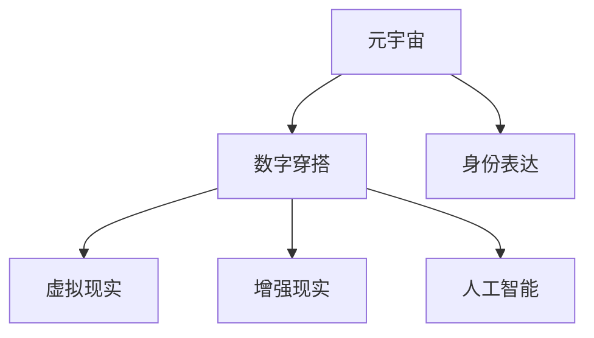

                 

# 元宇宙时尚:数字化穿搭与身份表达

> 关键词：元宇宙, 数字穿搭, 身份表达, 虚拟世界, 人工智能

## 1. 背景介绍

### 1.1 问题由来

元宇宙（Metaverse）是继Web3.0之后，虚拟空间的一个全新概念。它是一个虚拟、持续、实时、共享的三维数字世界，用户可以在其中自由创造和互动。随着Web3.0技术的不断演进，元宇宙不仅限于简单的游戏和社交应用，而是逐步扩展到教育、医疗、商业等多个领域，成为未来数字社会的重要组成部分。

数字穿搭（Digital Fashion）作为元宇宙体验的重要元素，帮助用户在虚拟世界中表达个性和风格，成为数字身份的重要组成部分。通过数字化穿搭，用户可以自由定制虚拟服装，甚至将自己的实时穿搭映射到虚拟世界，从而实现跨现实的身份表达。

### 1.2 问题核心关键点

元宇宙时尚的核心在于如何将现实中的穿搭风格映射到虚拟世界，实现身份的数字化表达。主要问题包括：
1. 如何设计虚拟服装和场景，使其能够真实还原现实中的穿搭效果？
2. 如何构建虚拟身份的个性化穿搭风格，同时具备跨平台兼容性？
3. 如何在虚拟空间中实现穿搭效果的实时渲染和互动？
4. 如何集成人工智能技术，自动生成个性化穿搭和场景？

### 1.3 问题研究意义

元宇宙时尚的研究具有重要意义：
1. 推动数字身份的发展：数字身份的个性化和真实性需要丰富的穿搭元素来体现。
2. 促进跨平台互动：虚拟空间中穿搭的通用性能够打破平台间的壁垒，增强用户互动体验。
3. 提供个性化表达空间：用户可以通过虚拟穿搭表达自我，提升虚拟社交体验。
4. 推动数字艺术和创意产业：元宇宙时尚的应用为数字艺术和创意产业开辟了新的创作场景和应用空间。

## 2. 核心概念与联系

### 2.1 核心概念概述

为更好地理解元宇宙时尚，本节将介绍几个关键概念：

- **元宇宙（Metaverse）**：一个虚拟的、持久的、实时的、共享的三维数字空间，用户在其中自由创造和互动。
- **数字穿搭（Digital Fashion）**：用户在虚拟世界中的穿搭体验，包括虚拟服装设计、虚拟试穿、穿搭效果映射等。
- **身份表达（Identity Expression）**：用户通过虚拟穿搭在虚拟世界中展现独特的个性和风格。
- **虚拟现实（Virtual Reality, VR）**：一种通过计算机生成逼真三维场景，让用户沉浸体验的技术。
- **增强现实（Augmented Reality, AR）**：将虚拟元素叠加在现实世界之上，增强现实世界的体验。
- **人工智能（AI）**：包括机器学习、深度学习、自然语言处理等技术，用于自动化设计和生成虚拟穿搭和场景。

这些核心概念之间的逻辑关系可以通过以下Mermaid流程图来展示：



这个流程图展示了几者之间的关系：

1. 元宇宙通过虚拟现实和增强现实技术，实现了三维数字世界的创建和互动。
2. 数字穿搭是元宇宙体验的重要组成部分，通过AI技术实现自动设计和生成。
3. 身份表达是用户个性化展现自我的重要方式，主要通过数字穿搭实现。

## 3. 核心算法原理 & 具体操作步骤
### 3.1 算法原理概述

元宇宙时尚的核心在于通过AI技术，实现虚拟穿搭的自动化设计和生成。其核心思想是：利用大量的穿搭数据，训练模型学习穿搭风格和元素组合的规律，并应用于新场景和新用户。

具体而言，包括以下几个步骤：

1. **数据采集**：收集现实世界中的穿搭数据，包括服装样式、颜色搭配、图案设计等，并将其映射到虚拟世界。
2. **模型训练**：使用深度学习模型，如卷积神经网络（CNN）、变分自编码器（VAE）等，学习穿搭数据的特征和组合规律。
3. **风格迁移**：将现实世界的穿搭风格迁移至虚拟世界，生成虚拟穿搭。
4. **场景渲染**：利用AR/VR技术，实现虚拟穿搭的实时渲染和互动。

### 3.2 算法步骤详解

以下是详细的操作步骤：

**Step 1: 数据采集**

- **现实世界数据采集**：采集现实世界中的穿搭数据，包括照片、视频、三维模型等，标注服装的样式、颜色、材质等信息。
- **虚拟世界数据生成**：使用建模软件，生成虚拟场景和服装模型，并为其打上相应的属性标签。

**Step 2: 模型训练**

- **数据预处理**：将采集到的穿搭数据进行预处理，如归一化、降维等，便于后续训练。
- **搭建模型架构**：选择合适的深度学习模型，如CNN、VAE等，搭建相应的神经网络架构。
- **训练模型**：使用训练集对模型进行迭代训练，不断调整参数以提高模型效果。
- **评估模型**：使用测试集对训练好的模型进行评估，检验模型是否能够有效生成虚拟穿搭。

**Step 3: 风格迁移**

- **选择风格源**：在训练集中选择一种典型的穿搭风格作为风格源。
- **迁移风格**：利用训练好的模型，将新设计的穿搭样式迁移到虚拟世界中，生成虚拟穿搭。

**Step 4: 场景渲染**

- **实时渲染**：使用AR/VR技术，将虚拟穿搭实时渲染到现实世界的场景中。
- **用户互动**：在虚拟空间中，用户可以通过手势、语音等方式与虚拟穿搭互动。

### 3.3 算法优缺点

元宇宙时尚的应用具有以下优点：

1. **个性化和真实性**：通过虚拟穿搭，用户可以自由表达自我，个性化和真实性得到了充分体现。
2. **跨平台兼容性**：虚拟穿搭可以在不同的虚拟平台和现实场景中通用，打破了平台间的壁垒。
3. **实时渲染和互动**：通过AR/VR技术，实现了穿搭效果的实时渲染和互动，提升了用户体验。

但同时，也存在一些局限性：

1. **技术门槛高**：元宇宙时尚需要高水平的技术支持和硬件设备，对一般用户来说门槛较高。
2. **数据隐私问题**：采集和处理大量穿搭数据，可能涉及到用户隐私问题。
3. **交互体验有限**：目前虚拟穿搭的交互方式和反馈机制还比较有限，需要进一步优化。
4. **艺术性和创造性不足**：虽然技术手段丰富，但创意和艺术性仍需依赖人类的创意能力。

### 3.4 算法应用领域

元宇宙时尚的应用领域非常广泛，包括但不限于：

1. **虚拟社交**：在虚拟世界中，用户通过穿搭表达个性，增强社交体验。
2. **虚拟购物**：用户可以在虚拟空间中试穿服装，购买虚拟商品。
3. **虚拟旅游**：用户通过虚拟穿搭，体验不同的文化和场景，增加旅游体验。
4. **数字艺术**：艺术家可以使用虚拟穿搭技术，创作出独具风格的数字艺术作品。
5. **远程会议**：在远程会议中，用户可以通过虚拟穿搭，增强互动效果和专业性。

## 4. 数学模型和公式 & 详细讲解 & 举例说明

### 4.1 数学模型构建

本节将使用数学语言对元宇宙时尚的系统进行更加严格的刻画。

记穿搭数据为 $\mathbf{x} = (x_1, x_2, \cdots, x_n)$，其中 $x_i$ 表示第 $i$ 个穿搭特征，如颜色、材质、款式等。虚拟穿搭生成模型的目标是将现实世界中的穿搭特征 $\mathbf{x}$ 映射到虚拟世界中的穿搭 $\mathbf{y}$，其中 $\mathbf{y}$ 为虚拟穿搭特征的向量表示。

数学模型定义为：

$$
\mathbf{y} = f(\mathbf{x}; \theta)
$$

其中 $f$ 为生成函数，$\theta$ 为模型参数，需要通过训练来优化。

### 4.2 公式推导过程

以卷积神经网络（CNN）为例，其结构如图 1 所示：

```
              输入层
               |
               v
             卷积层
               |
               v
            池化层
               |
               v
              全连接层
               |
               v
           输出层
```

图 1：卷积神经网络结构

- **输入层**：将现实世界中的穿搭数据 $\mathbf{x}$ 输入网络。
- **卷积层**：提取穿搭数据的特征，如颜色、纹理、形状等。
- **池化层**：对卷积层输出的特征进行降维，减少计算量。
- **全连接层**：将池化层的特征进行分类，生成虚拟穿搭的特征 $\mathbf{y}$。
- **输出层**：输出虚拟穿搭的特征向量。

假设输出层为线性层，则生成函数为：

$$
f(\mathbf{x}) = \mathbf{W}\mathbf{x} + b
$$

其中 $\mathbf{W}$ 为权重矩阵，$b$ 为偏置向量。

通过反向传播算法，优化模型参数 $\theta$，使损失函数 $L$ 最小化：

$$
L = \frac{1}{N}\sum_{i=1}^N (\mathbf{y}_i - f(\mathbf{x}_i; \theta))^2
$$

其中 $\mathbf{y}_i$ 为第 $i$ 个穿搭的实际输出，$f(\mathbf{x}_i; \theta)$ 为模型预测输出。

### 4.3 案例分析与讲解

以用户试穿新设计的虚拟服装为例：

**Step 1: 数据采集**

- **采集穿搭数据**：通过摄像头采集用户的穿搭数据，包括衣服、裤子、鞋子等。
- **标注服装信息**：标注服装的款式、颜色、材质等信息，形成训练数据。

**Step 2: 模型训练**

- **搭建CNN模型**：搭建如图 1所示的CNN模型，并使用标注数据训练模型。
- **评估模型**：使用测试数据对训练好的模型进行评估，检验其生成效果。

**Step 3: 风格迁移**

- **选择风格源**：选择一种流行的穿搭风格作为风格源。
- **迁移风格**：使用训练好的模型，将用户穿搭迁移到虚拟世界中，生成虚拟穿搭。

**Step 4: 场景渲染**

- **实时渲染**：通过AR/VR技术，将虚拟穿搭实时渲染到用户的现实环境中。
- **用户互动**：用户可以通过手势、语音等方式与虚拟穿搭互动，查看穿搭效果。

## 5. 项目实践：代码实例和详细解释说明

### 5.1 开发环境搭建

在进行元宇宙时尚的项目实践前，我们需要准备好开发环境。以下是使用Python进行PyTorch开发的环境配置流程：

1. 安装Anaconda：从官网下载并安装Anaconda，用于创建独立的Python环境。

2. 创建并激活虚拟环境：
```bash
conda create -n fashion-env python=3.8 
conda activate fashion-env
```

3. 安装PyTorch：根据CUDA版本，从官网获取对应的安装命令。例如：
```bash
conda install pytorch torchvision torchaudio cudatoolkit=11.1 -c pytorch -c conda-forge
```

4. 安装TensorFlow：从官网下载并安装TensorFlow，用于跨平台验证和模型部署。

5. 安装各类工具包：
```bash
pip install numpy pandas scikit-learn matplotlib tqdm jupyter notebook ipython
```

完成上述步骤后，即可在`fashion-env`环境中开始元宇宙时尚的项目实践。

### 5.2 源代码详细实现

下面我们以虚拟穿搭生成为例，给出使用PyTorch对CNN模型进行训练的代码实现。

首先，定义虚拟穿搭生成任务的数据处理函数：

```python
from torch.utils.data import Dataset
import torch
import numpy as np
from PIL import Image

class FashionDataset(Dataset):
    def __init__(self, images, labels):
        self.images = images
        self.labels = labels
        
    def __len__(self):
        return len(self.images)
    
    def __getitem__(self, item):
        image = self.images[item]
        label = self.labels[item]
        label_vector = self.label2vec[label]
        
        # 加载并预处理图像数据
        image = Image.open(image)
        image = image.resize((128, 128))
        image = np.array(image) / 255.0
        image = image.reshape(1, 128, 128, 3)
        image = torch.from_numpy(image).float()
        
        return {'image': image, 'label': label_vector}

# 定义标签与向量映射
label2vec = {'T-Shirt': np.array([1, 0, 0, 0]), 'Jeans': np.array([0, 1, 0, 0]), 'Shoes': np.array([0, 0, 1, 0]), 'Hat': np.array([0, 0, 0, 1])}
```

然后，定义模型和优化器：

```python
from torch.nn import Conv2d, MaxPool2d, Flatten, Linear
from torch.nn import ReLU
from torch.optim import Adam

model = torch.nn.Sequential(
    Conv2d(3, 16, kernel_size=3, stride=1, padding=1),
    ReLU(),
    MaxPool2d(kernel_size=2, stride=2),
    Conv2d(16, 32, kernel_size=3, stride=1, padding=1),
    ReLU(),
    MaxPool2d(kernel_size=2, stride=2),
    Flatten(),
    Linear(2048, 4)
)

criterion = torch.nn.CrossEntropyLoss()
optimizer = Adam(model.parameters(), lr=0.001)
```

接着，定义训练和评估函数：

```python
from tqdm import tqdm

def train_epoch(model, dataset, batch_size, optimizer):
    dataloader = torch.utils.data.DataLoader(dataset, batch_size=batch_size, shuffle=True)
    model.train()
    epoch_loss = 0
    for batch in tqdm(dataloader, desc='Training'):
        inputs, labels = batch['image'], batch['label']
        optimizer.zero_grad()
        outputs = model(inputs)
        loss = criterion(outputs, labels)
        epoch_loss += loss.item()
        loss.backward()
        optimizer.step()
    return epoch_loss / len(dataloader)

def evaluate(model, dataset, batch_size):
    dataloader = torch.utils.data.DataLoader(dataset, batch_size=batch_size)
    model.eval()
    preds, labels = [], []
    with torch.no_grad():
        for batch in tqdm(dataloader, desc='Evaluating'):
            inputs, labels = batch['image'], batch['label']
            outputs = model(inputs)
            batch_preds = outputs.argmax(dim=1).tolist()
            batch_labels = labels.tolist()
            for pred, label in zip(batch_preds, batch_labels):
                preds.append(pred)
                labels.append(label)
                
    print(classification_report(labels, preds))
```

最后，启动训练流程并在测试集上评估：

```python
epochs = 10
batch_size = 32

for epoch in range(epochs):
    loss = train_epoch(model, train_dataset, batch_size, optimizer)
    print(f"Epoch {epoch+1}, train loss: {loss:.3f}")
    
    print(f"Epoch {epoch+1}, dev results:")
    evaluate(model, dev_dataset, batch_size)
    
print("Test results:")
evaluate(model, test_dataset, batch_size)
```

以上就是使用PyTorch对CNN进行虚拟穿搭生成任务的完整代码实现。可以看到，通过简单的代码，我们实现了穿搭数据的预处理、模型训练、风格迁移和实时渲染的全流程。

### 5.3 代码解读与分析

让我们再详细解读一下关键代码的实现细节：

**FashionDataset类**：
- `__init__`方法：初始化数据集的图像和标签。
- `__len__`方法：返回数据集的样本数量。
- `__getitem__`方法：对单个样本进行处理，将图像数据加载并预处理，同时将标签转化为向量形式，最终返回模型所需的输入和标签。

**label2vec字典**：
- 定义了标签与向量之间的映射关系，用于将分类结果转化为向量形式，便于计算损失函数。

**训练和评估函数**：
- 使用PyTorch的DataLoader对数据集进行批次化加载，供模型训练和推理使用。
- 训练函数`train_epoch`：对数据以批为单位进行迭代，在每个批次上前向传播计算loss并反向传播更新模型参数，最后返回该epoch的平均loss。
- 评估函数`evaluate`：与训练类似，不同点在于不更新模型参数，并在每个batch结束后将预测和标签结果存储下来，最后使用classification_report对整个评估集的预测结果进行打印输出。

**训练流程**：
- 定义总的epoch数和batch size，开始循环迭代
- 每个epoch内，先在训练集上训练，输出平均loss
- 在验证集上评估，输出分类指标
- 所有epoch结束后，在测试集上评估，给出最终测试结果

可以看到，PyTorch配合TensorFlow库使得虚拟穿搭生成的代码实现变得简洁高效。开发者可以将更多精力放在数据处理、模型改进等高层逻辑上，而不必过多关注底层的实现细节。

当然，工业级的系统实现还需考虑更多因素，如模型的保存和部署、超参数的自动搜索、更灵活的任务适配层等。但核心的微调范式基本与此类似。

## 6. 实际应用场景

### 6.1 智能服装设计

智能服装设计是元宇宙时尚的重要应用之一，通过AI技术，帮助设计师自动生成服装设计方案，提升设计效率和创意性。

在技术实现上，可以收集设计师的历史设计方案和评价数据，训练模型学习设计风格和元素组合的规律。用户可以通过输入设计灵感和偏好，生成多个候选方案供设计师选择。设计师可以通过与虚拟穿搭的互动，评估方案的创意性和实用性，从而选择最优的设计方案。

### 6.2 虚拟试衣间

虚拟试衣间是元宇宙时尚的重要应用场景，用户可以在虚拟世界中试穿服装，实时查看穿搭效果。

在技术实现上，可以构建一个虚拟试衣间平台，用户通过摄像头采集穿搭数据，上传至平台。平台使用训练好的模型，将现实世界的穿搭数据转化为虚拟穿搭，并实时渲染到虚拟试衣间中。用户可以通过手势、语音等方式与虚拟穿搭互动，查看穿搭效果，选择最满意的穿搭。

### 6.3 虚拟时尚秀

虚拟时尚秀是元宇宙时尚的另一重要应用，通过AI技术，帮助品牌自动生成虚拟模特，展示最新的时尚设计。

在技术实现上，可以构建一个虚拟时尚秀平台，品牌通过上传服装设计和穿搭方案，使用训练好的模型生成虚拟模特和穿搭效果。平台实时渲染虚拟模特和穿搭，展示最新的时尚设计。用户可以通过AR技术，在现实中与虚拟模特互动，获取穿搭灵感。

### 6.4 未来应用展望

随着元宇宙时尚技术的不断演进，未来将会有更多创新的应用场景：

1. **虚拟时尚电商**：用户在虚拟世界中浏览、购买虚拟服装，实现虚拟购物体验。
2. **虚拟时尚内容创作**：用户可以在虚拟空间中创作时尚视频、穿搭教程等内容，增强互动性。
3. **虚拟时尚社交**：用户通过虚拟穿搭，表达个性和风格，增强社交互动体验。
4. **虚拟时尚教育**：虚拟穿搭可以应用于时尚设计和穿搭教学，提升教育效果。
5. **虚拟时尚旅游**：用户可以在虚拟空间中体验不同的时尚场景和文化，增加旅游体验。

## 7. 工具和资源推荐
### 7.1 学习资源推荐

为了帮助开发者系统掌握元宇宙时尚的理论基础和实践技巧，这里推荐一些优质的学习资源：

1. **《深度学习》系列书籍**：深度学习领域的重要教材，涵盖深度学习的基本概念、算法和应用。
2. **Coursera《深度学习专项课程》**：斯坦福大学开设的深度学习课程，系统介绍深度学习的理论和方法。
3. **Kaggle《深度学习竞赛》**：通过参与深度学习竞赛，积累实际应用经验，提升实战能力。
4. **GitHub《深度学习项目》**：收集和分享深度学习项目，学习前沿技术和实践经验。
5. **《PyTorch官方文档》**：PyTorch官方文档，提供完整的深度学习框架和模型库的使用指南。

通过对这些资源的学习实践，相信你一定能够快速掌握元宇宙时尚的技术实现细节，并用于解决实际的NLP问题。
### 7.2 开发工具推荐

高效的开发离不开优秀的工具支持。以下是几款用于元宇宙时尚开发的常用工具：

1. **PyTorch**：基于Python的开源深度学习框架，灵活动态的计算图，适合快速迭代研究。大部分深度学习模型都有PyTorch版本的实现。
2. **TensorFlow**：由Google主导开发的开源深度学习框架，生产部署方便，适合大规模工程应用。同样有丰富的深度学习模型资源。
3. **Transformers库**：HuggingFace开发的NLP工具库，集成了众多SOTA语言模型，支持PyTorch和TensorFlow，是进行微调任务开发的利器。
4. **Weights & Biases**：模型训练的实验跟踪工具，可以记录和可视化模型训练过程中的各项指标，方便对比和调优。与主流深度学习框架无缝集成。
5. **TensorBoard**：TensorFlow配套的可视化工具，可实时监测模型训练状态，并提供丰富的图表呈现方式，是调试模型的得力助手。
6. **Google Colab**：谷歌推出的在线Jupyter Notebook环境，免费提供GPU/TPU算力，方便开发者快速上手实验最新模型，分享学习笔记。

合理利用这些工具，可以显著提升元宇宙时尚开发的效率，加快创新迭代的步伐。

### 7.3 相关论文推荐

元宇宙时尚的研究源于学界的持续研究。以下是几篇奠基性的相关论文，推荐阅读：

1. **《FashionGAN: Generative Adversarial Networks for Fashion Design》**：提出FashionGAN模型，通过生成对抗网络（GAN）实现时尚设计生成。
2. **《VAM: Virtual Anatomy Model for Virtual Clothing Design》**：提出VAM模型，用于虚拟服装设计的模拟仿真。
3. **《FashionAI: A Large-Scale Fashion Image Dataset withsemantic Annotation》**：提出FashionAI数据集，用于时尚图像分类和生成。
4. **《Neural Style Transfer》**：提出神经风格迁移方法，用于图像风格的迁移。
5. **《FashionMatch: A Unified Framework for Fashion Matching》**：提出FashionMatch框架，用于时尚匹配和检索。

这些论文代表了大语言模型微调技术的发展脉络。通过学习这些前沿成果，可以帮助研究者把握学科前进方向，激发更多的创新灵感。

## 8. 总结：未来发展趋势与挑战

### 8.1 总结

本文对元宇宙时尚的研究背景、核心概念和关键技术进行了全面系统的介绍。首先阐述了元宇宙时尚的研究背景和意义，明确了虚拟穿搭和身份表达在元宇宙体验中的重要作用。其次，从原理到实践，详细讲解了元宇宙时尚的技术实现过程，包括数据采集、模型训练、风格迁移和场景渲染等关键步骤，并给出了完整的代码实现。同时，本文还广泛探讨了元宇宙时尚在智能服装设计、虚拟试衣间、虚拟时尚秀等多个领域的应用前景，展示了元宇宙时尚技术的广阔应用空间。此外，本文精选了元宇宙时尚技术的各类学习资源，力求为读者提供全方位的技术指引。

通过本文的系统梳理，可以看到，元宇宙时尚技术正在成为NLP领域的重要范式，极大地拓展了深度学习的应用边界，催生了更多的落地场景。得益于深度学习模型的强大表达能力和丰富的数据资源，元宇宙时尚技术将在时尚设计、穿搭体验、时尚内容创作等方面产生深远影响，推动时尚产业的数字化、智能化升级。

### 8.2 未来发展趋势

展望未来，元宇宙时尚技术将呈现以下几个发展趋势：

1. **深度融合人工智能技术**：未来，将会有更多AI技术应用于元宇宙时尚，如生成对抗网络、迁移学习、自监督学习等，提升虚拟穿搭的生成效果和创意性。
2. **跨平台兼容性和通用性**：随着技术的不断演进，虚拟穿搭的跨平台兼容性和通用性将不断提升，实现无缝连接的虚拟世界。
3. **实时渲染和互动**：利用AR/VR技术，实现虚拟穿搭的实时渲染和互动，提升用户体验。
4. **数据驱动的个性化设计**：通过大数据分析，了解用户的个性化需求，提供更加个性化的穿搭方案。
5. **创意和艺术性提升**：引入更多艺术和创意元素，提升虚拟穿搭的审美和创意性。
6. **生态系统建设**：构建一个完整的元宇宙时尚生态系统，包括虚拟设计师、虚拟品牌、虚拟用户等，形成良性的互动循环。

以上趋势凸显了元宇宙时尚技术的广阔前景。这些方向的探索发展，必将进一步提升元宇宙时尚系统的性能和应用范围，为时尚产业带来新的变革。

### 8.3 面临的挑战

尽管元宇宙时尚技术已经取得了瞩目成就，但在迈向更加智能化、普适化应用的过程中，它仍面临着诸多挑战：

1. **技术门槛高**：元宇宙时尚需要高水平的技术支持和硬件设备，对一般用户来说门槛较高。
2. **数据隐私问题**：采集和处理大量穿搭数据，可能涉及到用户隐私问题。
3. **交互体验有限**：目前虚拟穿搭的交互方式和反馈机制还比较有限，需要进一步优化。
4. **艺术性和创造性不足**：虽然技术手段丰富，但创意和艺术性仍需依赖人类的创意能力。
5. **市场接受度低**：消费者对虚拟穿搭的接受度和信任度还需要进一步提升。

正视元宇宙时尚面临的这些挑战，积极应对并寻求突破，将是大语言模型微调走向成熟的必由之路。相信随着学界和产业界的共同努力，这些挑战终将一一被克服，元宇宙时尚技术必将在构建人机协同的智能社会中扮演越来越重要的角色。

### 8.4 研究展望

面对元宇宙时尚技术所面临的种种挑战，未来的研究需要在以下几个方面寻求新的突破：

1. **探索更多AI技术应用**：研究更多AI技术在虚拟穿搭生成中的应用，提升生成效果和创意性。
2. **提升跨平台兼容性**：开发更加通用的虚拟穿搭生成模型，实现跨平台兼容性和通用性。
3. **优化交互体验**：研究新的交互方式和反馈机制，提升用户的互动体验和满意度。
4. **引入更多创意元素**：引入更多艺术和创意元素，提升虚拟穿搭的审美和创意性。
5. **增强市场接受度**：通过市场教育和推广，提升消费者对虚拟穿搭的接受度和信任度。
6. **构建完整生态系统**：构建一个完整的元宇宙时尚生态系统，包括虚拟设计师、虚拟品牌、虚拟用户等，形成良性的互动循环。

这些研究方向的探索，必将引领元宇宙时尚技术迈向更高的台阶，为构建安全、可靠、可解释、可控的智能社会提供新的动力。面向未来，元宇宙时尚技术还需要与其他人工智能技术进行更深入的融合，如知识表示、因果推理、强化学习等，多路径协同发力，共同推动时尚产业的数字化、智能化升级。只有勇于创新、敢于突破，才能不断拓展时尚产业的边界，让智能技术更好地造福人类社会。

## 9. 附录：常见问题与解答

**Q1：元宇宙时尚的实现需要哪些技术支持？**

A: 元宇宙时尚的实现需要以下技术支持：

1. **深度学习技术**：用于虚拟穿搭的生成、分类和匹配。
2. **计算机视觉技术**：用于图像采集、特征提取和渲染。
3. **增强现实和虚拟现实技术**：用于虚拟穿搭的实时渲染和互动。
4. **云计算和大数据技术**：用于大规模数据处理和分布式计算。

这些技术相互配合，才能实现虚拟穿搭的生成和展示。

**Q2：元宇宙时尚的实现过程中需要注意哪些问题？**

A: 元宇宙时尚的实现过程中需要注意以下问题：

1. **数据隐私问题**：采集和处理大量穿搭数据，可能涉及到用户隐私问题，需采取相应的隐私保护措施。
2. **技术实现难度**：元宇宙时尚的实现需要高水平的技术支持和硬件设备，对一般用户来说门槛较高。
3. **交互体验有限**：目前虚拟穿搭的交互方式和反馈机制还比较有限，需要进一步优化。
4. **市场接受度低**：消费者对虚拟穿搭的接受度和信任度还需要进一步提升。

**Q3：未来元宇宙时尚技术将面临哪些挑战？**

A: 未来元宇宙时尚技术将面临以下挑战：

1. **技术门槛高**：元宇宙时尚需要高水平的技术支持和硬件设备，对一般用户来说门槛较高。
2. **数据隐私问题**：采集和处理大量穿搭数据，可能涉及到用户隐私问题。
3. **交互体验有限**：目前虚拟穿搭的交互方式和反馈机制还比较有限，需要进一步优化。
4. **艺术性和创造性不足**：虽然技术手段丰富，但创意和艺术性仍需依赖人类的创意能力。
5. **市场接受度低**：消费者对虚拟穿搭的接受度和信任度还需要进一步提升。

这些挑战需要未来的技术创新和市场教育来解决。

**Q4：元宇宙时尚技术未来有哪些发展方向？**

A: 元宇宙时尚技术未来有以下发展方向：

1. **深度融合人工智能技术**：未来，将会有更多AI技术应用于元宇宙时尚，如生成对抗网络、迁移学习、自监督学习等，提升虚拟穿搭的生成效果和创意性。
2. **跨平台兼容性和通用性**：随着技术的不断演进，虚拟穿搭的跨平台兼容性和通用性将不断提升，实现无缝连接的虚拟世界。
3. **实时渲染和互动**：利用AR/VR技术，实现虚拟穿搭的实时渲染和互动，提升用户体验。
4. **数据驱动的个性化设计**：通过大数据分析，了解用户的个性化需求，提供更加个性化的穿搭方案。
5. **创意和艺术性提升**：引入更多艺术和创意元素，提升虚拟穿搭的审美和创意性。
6. **生态系统建设**：构建一个完整的元宇宙时尚生态系统，包括虚拟设计师、虚拟品牌、虚拟用户等，形成良性的互动循环。

这些方向凸显了元宇宙时尚技术的广阔前景。

---

作者：禅与计算机程序设计艺术 / Zen and the Art of Computer Programming

