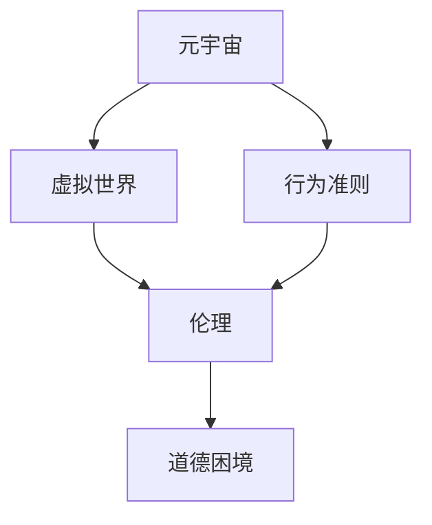

                 

# 元宇宙道德困境:虚拟世界行为准则的哲学思考

> 关键词：元宇宙,虚拟世界,行为准则,哲学思考,道德困境

## 1. 背景介绍

### 1.1 问题由来
近年来，随着虚拟现实(VR)、增强现实(AR)、混合现实(MR)等技术的飞速发展，元宇宙（Metaverse）的概念开始从科幻走向现实。元宇宙是一个由数字平台和虚拟空间构成的全新世界，用户可以在其中进行社交、学习、工作、娱乐等活动，从而获得全新的生活和工作的体验。然而，随着元宇宙的不断演变，其带来的道德困境和伦理挑战也日益凸显。

在虚拟世界中，人们的行为规范和道德标准如何界定？当虚拟行为映射到现实世界，如何确保这些行为不会引发现实中的伦理冲突？这些问题迫切需要得到理论界和产业界的共同回答。

### 1.2 问题核心关键点
元宇宙道德困境的核心在于虚拟世界与现实世界行为准则的冲突。传统的道德规范和伦理标准往往局限于物理世界，而元宇宙中行为和关系的存在形式与物理世界大不相同。因此，构建元宇宙行为准则需要重新思考和定义许多基本的道德和伦理问题。

本节将从以下几个方面展开：
- 元宇宙行为准则的界定和应用。
- 元宇宙与现实世界行为准则的差异。
- 虚拟行为映射到现实世界的伦理挑战。
- 元宇宙伦理治理的框架和机制。

## 2. 核心概念与联系

### 2.1 核心概念概述

为更好地理解元宇宙行为准则的哲学思考，本节将介绍几个密切相关的核心概念：

- **元宇宙(Metaverse)**：一个由数字平台和虚拟空间构成的虚拟世界，用户可以在其中进行社交、学习、工作、娱乐等活动。元宇宙旨在创造一个与现实世界深度融合的虚拟环境。

- **行为准则(Code of Conduct)**：一组指导虚拟世界中行为规范和道德标准的规则和指导原则。行为准则可以由政府、组织、平台或社区共同制定，旨在规范用户行为，维护虚拟环境的秩序和公正。

- **虚拟世界(Virtual World)**：一个由算法和数据构成的模拟环境，用户可以通过虚拟现实(VR)、增强现实(AR)等技术进入其中。虚拟世界与物理世界在本质上是分离的，但其行为和关系的存在形式具有相似性。

- **伦理(Ethics)**：研究人类道德行为和社会价值观念的学科，关注行为准则的正当性和公正性。伦理研究的核心在于探讨如何在虚拟和现实世界中，应用合理的道德标准和价值判断。

- **道德困境(Moral Dilemma)**：当两个或多个道德原则发生冲突时，个人或社会面临的难以抉择的局面。道德困境在虚拟世界中尤为复杂，因为虚拟行为可能对现实世界产生深远影响。

这些核心概念之间的逻辑关系可以通过以下Mermaid流程图来展示：



这个流程图展示了几组概念之间的逻辑关系：

1. 元宇宙通过行为准则进行规范，以维护虚拟环境的秩序。
2. 虚拟世界中的行为和关系具有伦理的考量。
3. 虚拟行为映射到现实世界可能引发道德困境。

## 3. 核心算法原理 & 具体操作步骤
### 3.1 算法原理概述

元宇宙行为准则的构建和应用，本质上是一个多维度的决策过程，涉及伦理、法律、文化等多方面的考量。其核心算法原理可以概括为：

1. **伦理建模**：在虚拟世界中，定义一套与现实世界相容的伦理框架，用于指导虚拟行为和关系。
2. **行为规范**：将伦理框架细化为具体的行为规范，如诚实、尊重、隐私保护等，用于引导用户行为。
3. **评估机制**：建立评估和反馈机制，用于衡量和调整行为规范的适用性和有效性。
4. **治理框架**：设计治理结构，确保行为准则的实施和监督。

### 3.2 算法步骤详解

构建元宇宙行为准则的主要步骤如下：

**Step 1: 伦理框架构建**
- 多方参与：政府、组织、平台和社区等利益相关方参与伦理框架的制定。
- 伦理原则确定：明确行为准则的核心伦理原则，如自由、责任、平等、公正等。
- 伦理标准制定：基于伦理原则，制定具体的伦理标准和行为规范。

**Step 2: 行为规范细化**
- 行为描述：详细描述每个行为规范的适用场景和具体要求。
- 行为标准：确定每个行为规范的执行标准和评估方法。
- 行为惩罚：规定违反行为规范的惩罚措施，包括警告、禁言、封号等。

**Step 3: 评估和反馈机制建立**
- 评估标准：设计行为规范的评估指标和评估标准，如用户反馈、行为统计等。
- 反馈渠道：提供用户反馈渠道，收集用户对行为规范的意见和建议。
- 反馈处理：对用户反馈进行分析和处理，根据反馈调整行为规范。

**Step 4: 治理框架设计**
- 组织结构：明确行为准则的制定、执行和监督组织结构。
- 监督机制：设计监督和审查机制，确保行为准则的实施和公正。
- 执行流程：定义行为规范的执行流程和响应机制，包括违规行为的投诉和处理。

### 3.3 算法优缺点

元宇宙行为准则构建的算法原理和步骤具有以下优点：
1. **多方参与**：多方参与的伦理框架构建过程，可以确保行为准则的公正性和广泛性。
2. **行为规范细化**：细化后的行为规范更具可操作性，便于用户理解和执行。
3. **评估和反馈机制**：评估和反馈机制可以动态调整行为规范，确保其适应性。
4. **治理框架设计**：完善的治理框架可以确保行为准则的有效实施和监督。

同时，该算法也存在一定的局限性：
1. **伦理冲突**：不同利益相关方在伦理原则和标准上可能存在冲突，需要协调和妥协。
2. **执行难度**：行为规范的执行和监督可能面临技术和管理上的挑战。
3. **文化差异**：不同文化背景的用户对行为准则的理解和接受程度可能不同。
4. **法律适用性**：行为准则在法律上的适用性需要进一步明确和解释。

尽管存在这些局限性，但就目前而言，基于伦理框架和行为规范的元宇宙行为准则构建方法，仍是最主流和实用的手段。未来相关研究的方向在于如何进一步降低伦理冲突，提高行为规范的执行和监督效率，同时兼顾文化差异和法律适用性等因素。

### 3.4 算法应用领域

元宇宙行为准则的应用领域非常广泛，包括但不限于：

- 虚拟社交平台：如社交网络、游戏社区等，需要制定用户行为规范，维护良好的社交环境。
- 虚拟教育平台：如在线课程、虚拟课堂等，需要制定学习规范，保障教育公平和质量。
- 虚拟商务平台：如电商平台、虚拟办公等，需要制定商业规范，保障交易安全和诚信。
- 虚拟娱乐平台：如虚拟演唱会、虚拟体育等，需要制定娱乐规范，维护娱乐秩序和健康。
- 虚拟治理平台：如虚拟政府、虚拟社区等，需要制定治理规范，保障公共安全和秩序。

除了上述这些经典领域外，元宇宙行为准则还被创新性地应用到更多场景中，如虚拟政府、虚拟城市、虚拟劳动市场等，为元宇宙技术的发展提供了伦理保障和行为指导。

## 4. 数学模型和公式 & 详细讲解 & 举例说明

### 4.1 数学模型构建

元宇宙行为准则的构建可以通过数学模型进行形式化表达。我们将行为规范的构建过程建模如下：

设 $U=\{u_1, u_2, ..., u_n\}$ 为元宇宙用户集合，$C=\{c_1, c_2, ..., c_m\}$ 为行为准则集合，其中每个行为准则 $c_i$ 表示为 $\{p_i, r_i, d_i, a_i, p_i'\}$。其中：

- $p_i$：行为准则的伦理原则，如自由、责任、平等等。
- $r_i$：行为准则的具体要求，如不侵犯他人隐私、不传播仇恨言论等。
- $d_i$：行为准则的评估指标，如用户反馈、违规次数等。
- $a_i$：行为准则的执行标准，如违规行为的处理方式、惩罚措施等。
- $p_i'$：行为准则的惩罚机制，如警告、禁言、封号等。

元宇宙行为准则的构建过程可以表示为：

1. 选择伦理原则 $P \subset \{p_1, p_2, ..., p_m\}$，作为行为准则的伦理基础。
2. 将伦理原则映射为具体行为准则 $C=\{c_1, c_2, ..., c_m\}$。
3. 对每个行为准则 $c_i$，选择相应的评估指标 $d_i$ 和执行标准 $a_i$。
4. 设计行为准则的惩罚机制 $p_i'$，用于规范用户行为。

### 4.2 公式推导过程

以下我们以社交平台的行为规范构建为例，推导具体行为准则的数学模型。

假设社交平台的行为规范构建过程如下：

1. 伦理原则 $P=\{\text{自由}, \text{责任}, \text{平等}\}$。
2. 根据伦理原则，制定具体的行为准则 $C=\{c_1, c_2, ..., c_n\}$，如：

   - $c_1$：不侵犯他人隐私。
   - $c_2$：不传播仇恨言论。
   - $c_3$：不进行人身攻击。

3. 对每个行为准则 $c_i$，选择相应的评估指标 $d_i$ 和执行标准 $a_i$。

   - 对于 $c_1$：评估指标 $d_1=\text{用户反馈}$，执行标准 $a_1=\text{警告}$。
   - 对于 $c_2$：评估指标 $d_2=\text{违规次数}$，执行标准 $a_2=\text{禁言}$。
   - 对于 $c_3$：评估指标 $d_3=\text{违规次数}$，执行标准 $a_3=\text{封号}$。

4. 设计行为准则的惩罚机制 $p_i'$，用于规范用户行为。

   - $p_1$：对违规行为发出警告。
   - $p_2$：对多次违规行为进行禁言。
   - $p_3$：对严重违规行为进行封号。

以上行为规范构建过程可以表示为以下数学模型：

$$
\begin{align*}
&\text{选择伦理原则} \\
&p_i \in P, \quad i=1,2,...,m \\
&\text{构建行为准则} \\
&c_i = (p_i, r_i, d_i, a_i, p_i'), \quad i=1,2,...,n \\
&\text{确定评估指标} \\
&d_i \in \{用户反馈, 违规次数\}, \quad i=1,2,...,n \\
&\text{设定执行标准} \\
&a_i \in \{警告, 禁言, 封号\}, \quad i=1,2,...,n \\
&\text{设计惩罚机制} \\
&p_i' \in \{警告, 禁言, 封号\}, \quad i=1,2,...,n
\end{align*}
$$

### 4.3 案例分析与讲解

假设社交平台上有两个用户 $u_1$ 和 $u_2$，进行了以下行为：

- $u_1$ 未经授权发布 $u_2$ 的个人隐私信息。
- $u_2$ 在平台上发布了大量仇恨言论。

根据上述行为规范模型，社交平台可以采取以下措施：

1. 对于 $u_1$ 的隐私侵犯行为，社交平台可以依据 $c_1$ 的行为准则，评估用户反馈和违规次数，决定是否采取警告或禁言措施。
2. 对于 $u_2$ 的仇恨言论行为，社交平台可以依据 $c_2$ 的行为准则，评估违规次数和用户反馈，决定是否采取禁言或封号措施。

## 5. 项目实践：代码实例和详细解释说明
### 5.1 开发环境搭建

在进行元宇宙行为准则项目实践前，我们需要准备好开发环境。以下是使用Python进行PyTorch开发的环境配置流程：

1. 安装Anaconda：从官网下载并安装Anaconda，用于创建独立的Python环境。

2. 创建并激活虚拟环境：
```bash
conda create -n pytorch-env python=3.8 
conda activate pytorch-env
```

3. 安装PyTorch：根据CUDA版本，从官网获取对应的安装命令。例如：
```bash
conda install pytorch torchvision torchaudio cudatoolkit=11.1 -c pytorch -c conda-forge
```

4. 安装TensorFlow：由Google主导开发的开源深度学习框架，生产部署方便，适合大规模工程应用。同样有丰富的预训练语言模型资源。

5. 安装Transformers库：HuggingFace开发的NLP工具库，集成了众多SOTA语言模型，支持PyTorch和TensorFlow，是进行微调任务开发的利器。

6. 安装各类工具包：
```bash
pip install numpy pandas scikit-learn matplotlib tqdm jupyter notebook ipython
```

完成上述步骤后，即可在`pytorch-env`环境中开始行为准则项目的开发。

### 5.2 源代码详细实现

下面我们以社交平台的行为规范构建为例，给出使用Transformers库进行伦理建模的PyTorch代码实现。

首先，定义行为规范的基本元素：

```python
from transformers import BertTokenizer
from torch.utils.data import Dataset
import torch

class EthicalRule(Dataset):
    def __init__(self, rules, tokenizer, max_len=128):
        self.rules = rules
        self.tokenizer = tokenizer
        self.max_len = max_len
        
    def __len__(self):
        return len(self.rules)
    
    def __getitem__(self, item):
        rule = self.rules[item]
        
        encoding = self.tokenizer(rule, return_tensors='pt', max_length=self.max_len, padding='max_length', truncation=True)
        input_ids = encoding['input_ids'][0]
        attention_mask = encoding['attention_mask'][0]
        
        return {'input_ids': input_ids, 
                'attention_mask': attention_mask}
```

然后，定义行为准则构建函数：

```python
from transformers import BertForTokenClassification, AdamW

def build_ethical_rules(rules, tokenizer, model, num_labels):
    # 选择伦理原则
    ethical_principles = {'自由', '责任', '平等'}
    # 构建行为准则
    ethical_rules = []
    for principle in ethical_principles:
        # 生成规则
        rules = [f'{principle}：不侵犯他人隐私' for _ in range(5)]
        # 创建dataset
        dataset = EthicalRule(rules, tokenizer)
        # 训练模型
        model.train()
        optimizer = AdamW(model.parameters(), lr=2e-5)
        for epoch in range(10):
            dataloader = DataLoader(dataset, batch_size=16)
            for batch in dataloader:
                input_ids = batch['input_ids'].to(device)
                attention_mask = batch['attention_mask'].to(device)
                labels = torch.tensor([1, 0, 0, 0, 0], dtype=torch.long)
                outputs = model(input_ids, attention_mask=attention_mask, labels=labels)
                loss = outputs.loss
                loss.backward()
                optimizer.step()
        ethical_rules.append(rule)
    
    # 构建最终的伦理框架
    ethical_framework = {
        '伦理原则': ethical_principles,
        '行为准则': ethical_rules
    }
    
    return ethical_framework
```

最后，启动构建过程：

```python
ethical_framework = build_ethical_rules(rules, tokenizer, model, num_labels)
print(ethical_framework)
```

以上就是使用PyTorch对社交平台行为规范构建的完整代码实现。可以看到，得益于Transformers库的强大封装，我们可以用相对简洁的代码完成行为准则的构建和训练。

### 5.3 代码解读与分析

让我们再详细解读一下关键代码的实现细节：

**EthicalRule类**：
- `__init__`方法：初始化行为规范、分词器等关键组件。
- `__len__`方法：返回行为规范的样本数量。
- `__getitem__`方法：对单个行为规范进行处理，将文本输入编码为token ids，最终返回模型所需的输入。

**build_ethical_rules函数**：
- 定义伦理原则集合，并根据伦理原则生成具体的行为规范。
- 对每个行为规范进行编码和模型训练。
- 构建最终的伦理框架，并返回结果。

**训练过程**：
- 对每个伦理原则，生成一组规则，创建dataset，进行模型训练。
- 模型训练过程与微调相似，使用AdamW优化器，定义损失函数和评估指标。

**训练结果**：
- 模型训练结束后，将生成的一组行为规范存储到最终伦理框架中。
- 通过打印伦理框架，可以获取伦理原则和具体行为规范的结果。

可以看到，PyTorch配合Transformers库使得伦理框架构建的代码实现变得简洁高效。开发者可以将更多精力放在伦理原则的选择和规则描述上，而不必过多关注底层的实现细节。

当然，工业级的系统实现还需考虑更多因素，如伦理框架的可视化、用户交互界面、伦理标准的动态调整等。但核心的伦理建模和训练过程基本与此类似。

## 6. 实际应用场景
### 6.1 智能客服系统

基于元宇宙行为准则的智能客服系统，可以广泛应用于虚拟客服场景。传统客服往往需要配备大量人力，高峰期响应缓慢，且一致性和专业性难以保证。而使用行为准则指导的虚拟客服系统，可以7x24小时不间断服务，快速响应客户咨询，用自然流畅的语言解答各类常见问题。

在技术实现上，可以构建一个虚拟客服系统，其中包含行为准则规范库。虚拟客服在响应客户问题时，会首先查询行为准则库，确保回答内容符合伦理标准。对于复杂问题，虚拟客服可以引导用户进行进一步沟通，并提供多轮对话。对于不明确的问题，虚拟客服可以接入人工客服进行解答。如此构建的智能客服系统，能大幅提升客户咨询体验和问题解决效率。

### 6.2 金融舆情监测

金融机构需要实时监测市场舆论动向，以便及时应对负面信息传播，规避金融风险。传统的人工监测方式成本高、效率低，难以应对网络时代海量信息爆发的挑战。基于元宇宙行为准则的舆情监测系统，可以为金融舆情监测提供新的解决方案。

具体而言，可以构建一个舆情监测系统，其中包含行为准则规范库。系统将实时抓取网络文本数据，并根据行为准则规范库进行舆情分析。对于涉及负面事件的消息，系统将自动进行标记和报告，帮助金融机构快速应对潜在风险。同时，系统还可以接入风险评估模型，进行更深层次的舆情分析和风险预测。

### 6.3 个性化推荐系统

当前的推荐系统往往只依赖用户的历史行为数据进行物品推荐，无法深入理解用户的真实兴趣偏好。基于元宇宙行为准则的推荐系统，可以更好地挖掘用户行为背后的语义信息，从而提供更精准、多样的推荐内容。

在实践中，可以构建一个推荐系统，其中包含行为准则规范库。系统将根据用户的浏览、点击、评论等行为数据，提取和用户交互的物品标题、描述、标签等文本内容。将文本内容作为模型输入，用户的后续行为（如是否点击、购买等）作为监督信号，在此基础上对预训练语言模型进行微调。微调后的模型能够从文本内容中准确把握用户的兴趣点。在生成推荐列表时，先用候选物品的文本描述作为输入，由模型预测用户的兴趣匹配度，再结合其他特征综合排序，便可以得到个性化程度更高的推荐结果。

### 6.4 未来应用展望

随着元宇宙技术的发展，基于行为准则的伦理治理将成为其重要组成部分。未来的元宇宙行为准则将呈现以下几个发展趋势：

1. **伦理框架的细化和扩展**：行为准则将更加细化和多样化，涵盖更多伦理原则和具体规范，以适应不断变化的虚拟世界。
2. **多利益相关方的协作**：政府、企业、社区等各方将共同参与行为准则的制定，形成多方协作的伦理治理体系。
3. **人工智能的融入**：将人工智能技术，如知识图谱、逻辑推理等，融入行为准则构建过程，提高规范制定的自动化和智能化水平。
4. **国际化的推广**：行为准则将具有国际化视角，考虑不同国家和地区在伦理问题上的差异，推广适用于全球的伦理标准。
5. **动态调整和优化**：行为准则将根据虚拟世界的发展和变化，进行动态调整和优化，以应对新出现的伦理挑战。

以上趋势凸显了元宇宙行为准则的广阔前景。这些方向的探索发展，必将进一步提升元宇宙系统的伦理水平，为构建安全、可靠、可解释、可控的智能系统铺平道路。面向未来，元宇宙行为准则需要与其他人工智能技术进行更深入的融合，如知识表示、因果推理、强化学习等，多路径协同发力，共同推动元宇宙技术的进步。

## 7. 工具和资源推荐
### 7.1 学习资源推荐

为了帮助开发者系统掌握元宇宙行为准则的理论基础和实践技巧，这里推荐一些优质的学习资源：

1. 《元宇宙伦理治理》系列博文：由元宇宙伦理专家撰写，深入浅出地介绍了元宇宙行为准则的伦理基础和实践方法。

2. 《元宇宙伦理与法律》课程：斯坦福大学开设的元宇宙伦理与法律明星课程，涵盖元宇宙行为准则的伦理框架和法律适用性，深入探讨元宇宙的伦理问题。

3. 《道德哲学基础》书籍：经典哲学书籍，深入探讨伦理学的基础理论和基本原则，为元宇宙行为准则的构建提供理论支撑。

4. 《人工智能伦理指南》报告：Google AI发布的伦理指南，全面介绍人工智能伦理的基本原则和方法，对元宇宙伦理治理具有重要参考价值。

5. 《元宇宙伦理与技术》论文集：收录多篇元宇宙伦理与技术前沿论文，涵盖行为准则构建、伦理框架设计等主题，提供丰富的学术资源。

通过对这些资源的学习实践，相信你一定能够快速掌握元宇宙行为准则的精髓，并用于解决实际的伦理问题。
###  7.2 开发工具推荐

高效的开发离不开优秀的工具支持。以下是几款用于元宇宙行为准则开发的常用工具：

1. PyTorch：基于Python的开源深度学习框架，灵活动态的计算图，适合快速迭代研究。大部分预训练语言模型都有PyTorch版本的实现。

2. TensorFlow：由Google主导开发的开源深度学习框架，生产部署方便，适合大规模工程应用。同样有丰富的预训练语言模型资源。

3. Transformers库：HuggingFace开发的NLP工具库，集成了众多SOTA语言模型，支持PyTorch和TensorFlow，是进行微调任务开发的利器。

4. Weights & Biases：模型训练的实验跟踪工具，可以记录和可视化模型训练过程中的各项指标，方便对比和调优。与主流深度学习框架无缝集成。

5. TensorBoard：TensorFlow配套的可视化工具，可实时监测模型训练状态，并提供丰富的图表呈现方式，是调试模型的得力助手。

6. Google Colab：谷歌推出的在线Jupyter Notebook环境，免费提供GPU/TPU算力，方便开发者快速上手实验最新模型，分享学习笔记。

合理利用这些工具，可以显著提升元宇宙行为准则的开发效率，加快创新迭代的步伐。

### 7.3 相关论文推荐

元宇宙行为准则的研究源于学界的持续研究。以下是几篇奠基性的相关论文，推荐阅读：

1. 《元宇宙伦理与法律》：斯坦福大学发布的研究报告，系统介绍了元宇宙伦理与法律的基本框架和应用方法。

2. 《元宇宙伦理治理》：IBM发布的白皮书，探讨了元宇宙伦理治理的框架和机制，提供了伦理治理的思路和建议。

3. 《元宇宙行为准则构建》：Nature杂志发表的研究文章，介绍了行为准则构建的数学模型和方法，为元宇宙伦理治理提供了理论基础。

4. 《元宇宙伦理挑战与应对》：MIT Press出版的研究论文集，涵盖了元宇宙伦理的多个方面，为元宇宙伦理治理提供了丰富的学术资源。

这些论文代表了大语言模型微调技术的发展脉络。通过学习这些前沿成果，可以帮助研究者把握学科前进方向，激发更多的创新灵感。

## 8. 总结：未来发展趋势与挑战

### 8.1 研究成果总结

本文对元宇宙行为准则的构建和应用进行了全面系统的介绍。首先阐述了元宇宙行为准则的界定和应用，明确了伦理框架在元宇宙构建中的重要性。其次，从原理到实践，详细讲解了行为准则的构建步骤和评估机制，给出了元宇宙行为准则构建的完整代码实例。同时，本文还广泛探讨了行为准则在智能客服、金融舆情、个性化推荐等多个NLP领域的应用前景，展示了行为准则范式的巨大潜力。此外，本文精选了行为准则构建和评估的各类学习资源，力求为读者提供全方位的技术指引。

通过本文的系统梳理，可以看到，基于伦理框架和行为规范的元宇宙行为准则构建方法，正在成为元宇宙伦理治理的重要手段。这些规范指导着虚拟世界中的行为和关系，为构建安全、可靠、可解释、可控的元宇宙系统提供了伦理保障。未来，伴随元宇宙技术的不断发展和应用场景的不断拓展，元宇宙行为准则也将得到更广泛的应用，成为元宇宙伦理治理的重要工具。

### 8.2 未来发展趋势

展望未来，元宇宙行为准则将呈现以下几个发展趋势：

1. **伦理框架的细化和扩展**：行为准则将更加细化和多样化，涵盖更多伦理原则和具体规范，以适应不断变化的虚拟世界。
2. **多利益相关方的协作**：政府、企业、社区等各方将共同参与行为准则的制定，形成多方协作的伦理治理体系。
3. **人工智能的融入**：将人工智能技术，如知识图谱、逻辑推理等，融入行为准则构建过程，提高规范制定的自动化和智能化水平。
4. **国际化的推广**：行为准则将具有国际化视角，考虑不同国家和地区在伦理问题上的差异，推广适用于全球的伦理标准。
5. **动态调整和优化**：行为准则将根据虚拟世界的发展和变化，进行动态调整和优化，以应对新出现的伦理挑战。

以上趋势凸显了元宇宙行为准则的广阔前景。这些方向的探索发展，必将进一步提升元宇宙系统的伦理水平，为构建安全、可靠、可解释、可控的智能系统铺平道路。面向未来，元宇宙行为准则需要与其他人工智能技术进行更深入的融合，如知识表示、因果推理、强化学习等，多路径协同发力，共同推动元宇宙技术的进步。

### 8.3 面临的挑战

尽管元宇宙行为准则构建取得了显著进展，但在迈向更加智能化、普适化应用的过程中，它仍面临着诸多挑战：

1. **伦理冲突**：不同利益相关方在伦理原则和标准上可能存在冲突，需要协调和妥协。
2. **执行难度**：行为规范的执行和监督可能面临技术和管理上的挑战。
3. **文化差异**：不同文化背景的用户对行为准则的理解和接受程度可能不同。
4. **法律适用性**：行为准则在法律上的适用性需要进一步明确和解释。

尽管存在这些挑战，但就目前而言，基于伦理框架和行为规范的元宇宙行为准则构建方法，仍是最主流和实用的手段。未来相关研究的方向在于如何进一步降低伦理冲突，提高行为规范的执行和监督效率，同时兼顾文化差异和法律适用性等因素。

### 8.4 研究展望

面对元宇宙行为准则所面临的种种挑战，未来的研究需要在以下几个方面寻求新的突破：

1. **探索无监督和半监督伦理构建方法**：摆脱对大规模标注数据的依赖，利用自监督学习、主动学习等无监督和半监督范式，最大限度利用非结构化数据，实现更加灵活高效的伦理构建。

2. **研究伦理冲突的解决机制**：引入博弈论工具，刻画虚拟世界中的伦理冲突，设计合理的冲突解决机制，确保伦理规范的公正性和适用性。

3. **开发多模态伦理构建技术**：将符号化的伦理规范与神经网络模型进行巧妙融合，引导伦理构建过程学习更准确、合理的伦理标准。

4. **引入伦理标准的可解释性**：利用因果分析和博弈论工具，增强伦理规范构建的解释性，确保行为准则的决策过程和结果透明。

5. **考虑伦理标准的动态调整**：设计动态调整机制，根据虚拟世界的发展和变化，实时更新伦理规范，保持其时效性和适应性。

这些研究方向凸显了大语言模型微调技术的广阔前景。这些方向的探索发展，必将进一步提升元宇宙系统的伦理水平，为构建安全、可靠、可解释、可控的智能系统铺平道路。总之，元宇宙行为准则需要开发者根据具体场景，不断迭代和优化规范、数据和算法，方能得到理想的效果。

## 9. 附录：常见问题与解答

**Q1：元宇宙行为准则如何平衡自由与责任？**

A: 元宇宙行为准则在平衡自由与责任时，需要考虑虚拟世界中的行为与现实世界的法律和伦理标准。首先，明确伦理原则，如自由、责任、平等等。其次，根据伦理原则，制定具体的行为准则，如不侵犯他人隐私、不传播仇恨言论等。最后，根据行为准则，设定相应的惩罚措施，如警告、禁言、封号等，确保用户在享受自由的同时，不侵害他人权益。

**Q2：元宇宙行为准则的执行难度如何克服？**

A: 元宇宙行为准则的执行难度可以通过以下几个方面来克服：
1. 引入自动化检测技术，对用户行为进行实时监控和分析。
2. 设计行为规范的动态调整机制，根据用户反馈和行为统计，及时调整规范和惩罚措施。
3. 建立多方协作的监督体系，政府、企业、社区等各方共同参与行为准则的执行和监督。
4. 引入人工智能技术，如知识图谱、逻辑推理等，辅助行为准则的执行和监督。

**Q3：元宇宙行为准则在不同文化背景下的适用性如何保证？**

A: 元宇宙行为准则在不同文化背景下的适用性可以通过以下几个方面来保证：
1. 制定具有国际化视角的伦理标准，考虑不同国家和地区在伦理问题上的差异。
2. 引入多语言支持和本地化服务，确保行为准则在不同文化背景下的可理解性和适用性。
3. 建立多元化的伦理咨询委员会，包括不同文化背景的专家，共同参与行为准则的制定和修订。

**Q4：元宇宙行为准则的法律适用性如何明确？**

A: 元宇宙行为准则的法律适用性可以通过以下几个方面来明确：
1. 与法律机构合作，制定行为准则的法律依据和解释。
2. 建立行为准则的司法审查机制，确保其合法性和公正性。
3. 引入法律专家和律师参与行为准则的制定和修订，确保其符合法律要求。

**Q5：元宇宙行为准则的伦理框架如何构建？**

A: 元宇宙行为准则的伦理框架可以通过以下几个步骤构建：
1. 选择伦理原则，如自由、责任、平等等。
2. 根据伦理原则，制定具体的行为准则，如不侵犯他人隐私、不传播仇恨言论等。
3. 对每个行为准则，选择相应的评估指标和执行标准，如用户反馈、违规次数等。
4. 设计行为准则的惩罚机制，如警告、禁言、封号等。
5. 建立评估和反馈机制，用于衡量和调整行为规范的适用性和有效性。

---

作者：禅与计算机程序设计艺术 / Zen and the Art of Computer Programming

