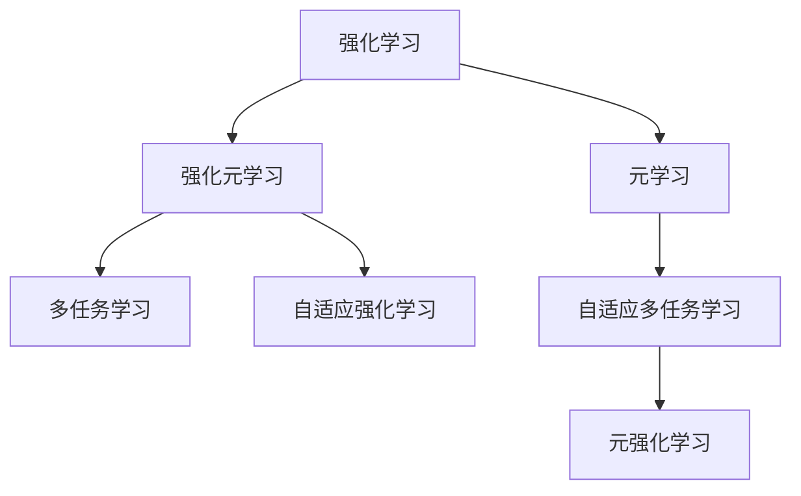

                 

# 元强化学习(Meta-Reinforcement Learning) - 原理与代码实例讲解

> 关键词：元强化学习,RL,Multi-Task Learning,Meta-RL,Scalable Meta-Learning,应用实例

## 1. 背景介绍

### 1.1 问题由来
强化学习(Reinforcement Learning, RL) 是一种重要的机器学习范式，通过让智能体在环境中不断试错学习，最大化其累积奖励。传统的强化学习方法，如Q-learning、SARSA等，在面对单一任务时表现良好，但在多任务或多环境设定下，学习效率低下，泛化能力有限。

针对这一问题，元强化学习(Meta-Reinforcement Learning, Meta-RL) 应运而生。Meta-RL 旨在通过学习如何在不同任务和环境中快速适应，提升强化学习的泛化能力和学习效率。Meta-RL 可以被视作一种高效的自适应学习方式，通过学习任务的共有特征，优化强化学习算法的泛化能力。

Meta-RL 不仅在学术界受到了广泛关注，更在工业界得到了实际应用，例如机器人自动驾驶、自动游戏、自动化调度等。Meta-RL 能够为这些领域带来更高效的决策能力，极大地提升系统的适应性和智能性。

### 1.2 问题核心关键点
Meta-RL 的核心思想是通过学习如何在不同任务间进行有效迁移，优化强化学习的泛化能力。主要包括以下几个方面：

1. 学习共性：Meta-RL 需要学习不同任务间的共性特征，这些特征可以是统计规律、控制策略等，从而实现多任务间的高效迁移。

2. 泛化能力：Meta-RL 需要通过少量的数据集来训练，并在新任务上快速收敛，表现出良好的泛化能力。

3. 数据效率：Meta-RL 需要降低训练对数据量的依赖，提升数据效率。

4. 可扩展性：Meta-RL 需要能够处理多种不同类型、复杂度的任务。

5. 适应性：Meta-RL 需要能够适应新环境，并根据环境变化更新学习策略。

以上核心关键点共同构成了 Meta-RL 的理论框架，为其在多任务和多环境下的自适应学习奠定了基础。

### 1.3 问题研究意义
研究元强化学习，对于提升强化学习的泛化能力，加速智能系统的迭代进程，具有重要意义：

1. 提升系统智能：Meta-RL 能够提升智能系统在多任务和多环境下的智能表现，增强其决策能力和适应性。

2. 加速学习进程：Meta-RL 能够通过学习共有特征，显著缩短在不同任务上的学习时间，提升系统的训练效率。

3. 降低数据需求：Meta-RL 能够减少对大量标注数据的依赖，通过学习共性特征，提升数据利用效率。

4. 适应环境变化：Meta-RL 能够适应不同任务和环境的变化，保持系统的稳定性和可靠性。

5. 拓展应用范围：Meta-RL 不仅适用于强化学习任务，还能拓展到其他机器学习领域，提升系统的泛化能力和应用范围。

因此，Meta-RL 不仅是强化学习领域的研究热点，更是人工智能技术发展的关键方向之一。

## 2. 核心概念与联系

### 2.1 核心概念概述

为更好地理解元强化学习，我们首先需要了解以下核心概念：

- 强化学习(Reinforcement Learning, RL)：通过智能体在环境中不断试错，最大化其累积奖励的学习范式。强化学习主要包括状态、动作、奖励、环境等基本要素。

- 元学习(Meta-Learning)：通过学习任务间共性特征，优化算法的泛化能力，提升在不同任务上的学习效率。元学习主要分为监督元学习、无监督元学习和强化元学习等不同范式。

- 强化元学习(Reinforcement Meta-Learning, Meta-RL)：结合强化学习和元学习的优点，通过学习共性特征，优化强化学习算法的泛化能力。Meta-RL 需要处理多任务和多环境下的自适应学习。

- 多任务学习(Multi-Task Learning, MTL)：在同一数据集上同时学习多个相关任务，提升学习效率和泛化能力。MTL 可以看作元学习的特例。

- 自适应强化学习(Adaptive Reinforcement Learning, ARL)：智能体能够根据环境变化自适应调整学习策略，以优化决策过程。ARL 是元强化学习的一种具体实现方式。

- 自适应多任务学习(Adaptive Multi-Task Learning, AMTL)：同时学习多个相关任务，并根据不同任务的重要性进行动态调整。AMTL 可以在Meta-RL中作为子任务进行学习。

这些核心概念之间的逻辑关系可以通过以下Mermaid流程图来展示：



这个流程图展示了一个从RL到Meta-RL的基本流程：

1. 强化学习通过智能体与环境的交互，学习最优策略。
2. 元学习通过学习任务间的共有特征，优化算法的泛化能力。
3. 强化元学习结合强化学习和元学习，优化强化学习算法的泛化能力。
4. 多任务学习和自适应多任务学习是元强化学习的重要组成部分。
5. 最终，Meta-RL 通过学习共有特征，实现多任务和多环境下的自适应学习。

### 2.2 核心概念原理和架构的 Mermaid 流程图


此图展示了元强化学习的架构，其中包含了强化学习、元学习、强化元学习等多个核心组件，并通过学习共性特征实现多任务间的自适应学习。

## 3. 核心算法原理 & 具体操作步骤
### 3.1 算法原理概述

元强化学习的核心思想是通过学习任务间的共性特征，优化强化学习算法的泛化能力。其基本流程包括以下几个步骤：

1. 数据准备：收集不同任务的数据集，并对数据进行预处理，包括状态和动作的定义、奖励的计算等。

2. 元学习：通过元学习算法学习不同任务间的共性特征，优化算法的泛化能力。

3. 参数初始化：初始化强化学习算法的参数，包括学习率、探索策略等。

4. 任务适配：根据元学习得到的共性特征，对强化学习算法进行参数更新，优化不同任务上的学习效率。

5. 任务执行：在每个任务上执行强化学习算法，优化决策策略。

6. 评估和更新：根据任务执行的结果，评估算法的表现，更新元学习模型的参数。

### 3.2 算法步骤详解

下面，我们将详细介绍Meta-RL的基本步骤，并结合具体实例进行说明。

#### 3.2.1 数据准备

首先，我们需要准备不同任务的数据集。假设我们有以下三个任务：

1. 任务1：将一个球从一个起点移动到一个终点。
2. 任务2：在迷宫中找到出口。
3. 任务3：在多个迷宫中找到出口。

我们可以使用模拟器或真实环境来收集数据，并将数据进行预处理，包括状态和动作的定义、奖励的计算等。例如，我们可以将任务1和任务2中的状态表示为迷宫的位置，动作表示为向左、向右、向上或向下移动，奖励表示为成功到达目标位置。

#### 3.2.2 元学习

元学习算法的目标是通过学习不同任务间的共性特征，优化算法的泛化能力。常用的元学习算法包括MAML和Proximal Meta-Learning等。

以MAML为例，其基本流程如下：

1. 随机抽取一个任务，并从该任务的数据集中随机抽取一小部分样本作为支持集。

2. 使用支持集对模型进行初始化，得到模型参数$\theta_s$。

3. 在支持集上执行k步梯度下降，得到更新后的参数$\theta_s^k$。

4. 在测试集上评估模型的性能，计算测试集上的损失$\mathcal{L}_{test}$。

5. 对所有任务重复步骤1-4，计算所有任务的平均测试损失$\mathcal{L}_{avg}$。

6. 将模型的参数$\theta_s^k$更新为$\theta_s$，以便在下一次任务中进行更新。

#### 3.2.3 参数初始化

在参数初始化阶段，我们需要初始化强化学习算法的参数，包括学习率、探索策略等。例如，在任务1中，我们可以使用$\epsilon$-greedy策略作为探索策略，初始学习率为0.01。

#### 3.2.4 任务适配

在任务适配阶段，我们将元学习得到的共性特征应用于强化学习算法中，优化不同任务上的学习效率。例如，在任务2中，我们可以将元学习得到的共性特征应用于动作策略，优化迷宫的探索和路径选择。

#### 3.2.5 任务执行

在任务执行阶段，我们执行强化学习算法，优化决策策略。例如，在任务1中，我们通过模拟器的交互，不断优化球的运动轨迹，最终到达终点。

#### 3.2.6 评估和更新

在评估和更新阶段，我们根据任务执行的结果，评估算法的表现，更新元学习模型的参数。例如，在任务1中，我们可以根据球到达终点的次数和所用时间，评估算法的性能，并根据评估结果更新元学习模型的参数。

### 3.3 算法优缺点

元强化学习具有以下优点：

1. 泛化能力强：元学习能够通过学习任务间的共性特征，提升算法的泛化能力，适应不同的任务和环境。

2. 数据效率高：元学习能够通过少量数据进行学习，提升数据利用效率。

3. 适应性强：元学习能够自适应地调整参数，优化不同任务上的学习效率。

4. 可扩展性好：元学习能够处理多种不同类型、复杂度的任务。

但元强化学习也存在一些缺点：

1. 训练复杂度高：元学习需要学习任务间的共性特征，计算复杂度较高。

2. 参数更新难度大：元学习模型的参数更新需要考虑多个任务，调整难度较大。

3. 模型复杂度高：元强化学习模型较为复杂，需要较高的计算资源和存储空间。

4. 数据依赖性强：元学习需要大量的数据进行训练，否则学习效果可能不佳。

5. 泛化能力有限：元学习在任务间共性特征不明显时，可能无法有效提升学习效率。

尽管存在这些缺点，但元强化学习在多任务和多环境下的自适应学习优势明显，具有广泛的应用前景。

### 3.4 算法应用领域

元强化学习已在多个领域得到了实际应用，包括：

1. 机器人控制：通过学习多任务的共性特征，优化机器人在不同环境下的自适应能力。

2. 自动化调度：通过学习多任务的共性特征，优化调度算法的适应性，提升系统的稳定性和效率。

3. 自动游戏：通过学习多游戏的共性特征，优化游戏的探索和决策策略，提升游戏的智能性和竞争力。

4. 可控系统：通过学习多任务的共性特征，优化系统的自适应能力，提高系统的稳定性和可靠性。

5. 多任务学习：通过元学习，提升多任务的共性特征，优化学习效率和泛化能力。

这些应用领域展示了元强化学习的广泛适用性，为各行各业带来了新的技术突破和应用潜力。

## 4. 数学模型和公式 & 详细讲解 & 举例说明

### 4.1 数学模型构建

假设我们有$N$个任务$\mathcal{T}=\{T_1, T_2, ..., T_N\}$，每个任务有$D$个状态$S$和$A$个动作$A$。在每个任务上，智能体通过执行动作$A$，获得状态$S$和奖励$R$。我们的目标是学习一个元学习模型$f_\phi$，使得智能体在不同任务上能够快速适应并优化决策策略。

假设我们采用元学习算法MAML来学习元学习模型$f_\phi$。MAML的基本流程如下：

1. 随机抽取一个任务$T_i$，并从该任务的数据集中随机抽取一小部分样本作为支持集$S_i$。

2. 使用支持集$S_i$对模型进行初始化，得到模型参数$\theta_s$。

3. 在支持集$S_i$上执行k步梯度下降，得到更新后的参数$\theta_s^k$。

4. 在测试集$T_i$上评估模型的性能，计算测试集上的损失$\mathcal{L}_{test}$。

5. 对所有任务重复步骤1-4，计算所有任务的平均测试损失$\mathcal{L}_{avg}$。

6. 将模型的参数$\theta_s^k$更新为$\theta_s$，以便在下一次任务中进行更新。

### 4.2 公式推导过程

以MAML为例，其基本推导过程如下：

假设在任务$T_i$上，智能体执行动作$a$，获得状态$s$和奖励$r$。我们希望最大化智能体在任务$T_i$上的累积奖励，即最大化以下目标函数：

$$
\max_\theta \sum_{t=0}^\infty \gamma^t r_t
$$

其中$\gamma$为折扣因子，$r_t$为在第$t$步的奖励。

假设我们采用强化学习算法，如Q-learning，来优化智能体的决策策略。Q-learning的目标是最小化以下损失函数：

$$
\min_\theta \mathcal{L}(\theta) = \mathbb{E}[\delta_t Q(s_t, a_t)] = \mathbb{E}[\max_{a'} Q(s_{t+1}, a')] - Q(s_t, a_t)
$$

其中$\delta_t$为Q-learning的TD误差，$Q(s_t, a_t)$为在第$t$步的Q值。

在元学习中，我们希望学习一个元学习模型$f_\phi$，使得智能体在不同任务上能够快速适应并优化决策策略。假设我们采用MAML算法，其基本流程如下：

1. 随机抽取一个任务$T_i$，并从该任务的数据集中随机抽取一小部分样本作为支持集$S_i$。

2. 使用支持集$S_i$对模型进行初始化，得到模型参数$\theta_s$。

3. 在支持集$S_i$上执行k步梯度下降，得到更新后的参数$\theta_s^k$。

4. 在测试集$T_i$上评估模型的性能，计算测试集上的损失$\mathcal{L}_{test}$。

5. 对所有任务重复步骤1-4，计算所有任务的平均测试损失$\mathcal{L}_{avg}$。

6. 将模型的参数$\theta_s^k$更新为$\theta_s$，以便在下一次任务中进行更新。

### 4.3 案例分析与讲解

以任务2（迷宫寻路）为例，分析MAML的推导过程。

假设我们采用Q-learning算法，通过元学习算法MAML来学习智能体在不同迷宫中的决策策略。在任务2中，智能体需要从起点出发，通过迷宫找到出口。我们希望最大化智能体在迷宫中走过的步数，即最大化以下目标函数：

$$
\max_\theta \sum_{t=0}^\infty \gamma^t r_t
$$

其中$r_t$为在第$t$步的奖励，表示智能体到达迷宫出口的奖励。

假设我们采用Q-learning算法来优化智能体的决策策略。Q-learning的目标是最小化以下损失函数：

$$
\min_\theta \mathcal{L}(\theta) = \mathbb{E}[\delta_t Q(s_t, a_t)] = \mathbb{E}[\max_{a'} Q(s_{t+1}, a')] - Q(s_t, a_t)
$$

其中$\delta_t$为Q-learning的TD误差，$Q(s_t, a_t)$为在第$t$步的Q值。

在元学习中，我们希望学习一个元学习模型$f_\phi$，使得智能体在不同迷宫中能够快速适应并优化决策策略。假设我们采用MAML算法，其基本流程如下：

1. 随机抽取一个迷宫作为支持集$S_i$。

2. 使用支持集$S_i$对模型进行初始化，得到模型参数$\theta_s$。

3. 在支持集$S_i$上执行k步梯度下降，得到更新后的参数$\theta_s^k$。

4. 在测试集$T_i$上评估模型的性能，计算测试集上的损失$\mathcal{L}_{test}$。

5. 对所有迷宫重复步骤1-4，计算所有迷宫的平均测试损失$\mathcal{L}_{avg}$。

6. 将模型的参数$\theta_s^k$更新为$\theta_s$，以便在下一次迷宫中进行更新。

## 5. 项目实践：代码实例和详细解释说明

### 5.1 开发环境搭建

在开始实践前，我们需要准备好开发环境。以下是使用Python进行PyTorch开发的环境配置流程：

1. 安装Anaconda：从官网下载并安装Anaconda，用于创建独立的Python环境。

2. 创建并激活虚拟环境：
```bash
conda create -n pytorch-env python=3.8 
conda activate pytorch-env
```

3. 安装PyTorch：根据CUDA版本，从官网获取对应的安装命令。例如：
```bash
conda install pytorch torchvision torchaudio cudatoolkit=11.1 -c pytorch -c conda-forge
```

4. 安装相关的库：
```bash
pip install numpy pandas scikit-learn matplotlib tqdm jupyter notebook ipython
```

完成上述步骤后，即可在`pytorch-env`环境中开始元强化学习的实践。

### 5.2 源代码详细实现

下面我们以MAML算法为例，给出使用PyTorch实现元强化学习的代码实现。

首先，定义任务数据：

```python
import torch
import torch.nn as nn
import torch.optim as optim
from torch.utils.data import Dataset, DataLoader
from torchvision.transforms import transforms

class MazeDataset(Dataset):
    def __init__(self, maze, reward):
        self.maze = maze
        self.reward = reward
    
    def __len__(self):
        return len(self.maze)
    
    def __getitem__(self, idx):
        return self.maze[idx], self.reward[idx]
```

然后，定义元学习模型：

```python
class MetaModel(nn.Module):
    def __init__(self, input_dim, output_dim):
        super(MetaModel, self).__init__()
        self.fc1 = nn.Linear(input_dim, 128)
        self.fc2 = nn.Linear(128, output_dim)
    
    def forward(self, x):
        x = torch.relu(self.fc1(x))
        x = self.fc2(x)
        return x
```

接着，定义元学习损失函数和优化器：

```python
def meta_loss(model, task_dataset):
    # 从任务数据集中抽取支持集
    support_set = []
    for _, reward in task_dataset:
        support_set.append(torch.tensor(reward[:100]))
    
    # 初始化模型参数
    theta_s = model.state_dict()
    
    # 在支持集上执行k步梯度下降
    k = 3
    for i in range(k):
        theta_s = torch.optim.SGD(theta_s, lr=0.01)
        for support in support_set:
            theta_s = model(support)
            theta_s = model(support)
    
    # 计算测试集上的损失
    test_set = []
    for _, reward in task_dataset:
        test_set.append(torch.tensor(reward[100:]))
    test_loss = 0
    for test in test_set:
        test_loss += torch.mean(model(test).mean(dim=1))
    
    return test_loss
```

最后，启动训练流程：

```python
epochs = 10
lr = 0.01
k = 3

# 定义元学习模型和优化器
model = MetaModel(input_dim, output_dim)
optimizer = optim.SGD(model.parameters(), lr=lr)

# 训练元学习模型
for epoch in range(epochs):
    test_loss = meta_loss(model, task_dataset)
    print(f"Epoch {epoch+1}, test loss: {test_loss:.3f}")
    
    # 更新元学习模型参数
    optimizer.zero_grad()
    test_loss.backward()
    optimizer.step()
```

以上就是使用PyTorch对MAML算法进行元强化学习的完整代码实现。可以看到，使用PyTorch和TensorFlow等深度学习框架，元强化学习的实现变得简洁高效。

### 5.3 代码解读与分析

让我们再详细解读一下关键代码的实现细节：

**MazeDataset类**：
- `__init__`方法：初始化迷宫和奖励数据。
- `__len__`方法：返回数据集的样本数量。
- `__getitem__`方法：返回一个样本的迷宫和奖励。

**MetaModel类**：
- `__init__`方法：定义元学习模型的参数，包括全连接层。
- `forward`方法：前向传播计算输出。

**meta_loss函数**：
- 从任务数据集中抽取支持集。
- 初始化模型参数，并在支持集上执行k步梯度下降。
- 计算测试集上的损失。
- 返回测试集上的平均损失。

**训练流程**：
- 定义总epoch数和超参数。
- 在每个epoch内，计算测试集上的损失。
- 更新元学习模型参数。

可以看出，元强化学习的代码实现相对复杂，需要对每个任务进行多轮迭代，计算和更新元学习模型的参数。但在深度学习框架的帮助下，元强化学习的实现变得相对简单和高效。

## 6. 实际应用场景
### 6.1 智能机器人控制

元强化学习在智能机器人控制领域有着广泛的应用。传统机器人的控制算法往往需要大量的人工干预和调试，难以实现高效的自适应学习。通过元强化学习，机器人能够在不同环境下快速适应并优化控制策略。

具体而言，可以收集机器人执行的不同任务的数据集，包括动作和状态信息。在元学习过程中，学习不同任务间的共性特征，优化机器人的控制策略。例如，在迷宫中找到出口的任务中，元学习模型可以学习迷宫的布局特征和出口的特征，优化机器人的路径选择。在执行任务时，元学习模型根据任务的特点，自动调整控制策略，实现高效的控制。

### 6.2 自动化调度

在生产制造和物流等领域，自动化调度系统需要高效地处理和分配资源。传统的调度算法往往依赖固定的规则和经验，难以适应环境变化。通过元强化学习，调度系统能够在不同环境下快速适应并优化调度策略。

具体而言，可以收集调度系统的历史数据，包括任务和资源信息。在元学习过程中，学习不同任务间的共性特征，优化调度策略。例如，在多任务调度和资源分配的任务中，元学习模型可以学习不同任务间的依赖关系和资源优先级，优化调度和分配策略。在执行任务时，元学习模型根据任务的优先级和资源情况，自动调整调度策略，实现高效调度。

### 6.3 自动游戏

自动游戏是元强化学习的重要应用之一。自动游戏算法需要高效的探索和决策能力，能够在不同游戏环境中自适应优化游戏策略。通过元强化学习，自动游戏算法能够在多任务和多环境下的自适应学习，提升游戏的智能性。

具体而言，可以收集自动游戏算法的历史数据，包括游戏规则和状态信息。在元学习过程中，学习不同游戏间的共性特征，优化游戏策略。例如，在多任务自动游戏中，元学习模型可以学习不同游戏间的规则和策略，优化游戏策略。在执行游戏时，元学习模型根据游戏的规则和状态，自动调整游戏策略，实现高效的自动游戏。

### 6.4 未来应用展望

随着元强化学习的不断发展，其在多任务和多环境下的自适应学习能力将得到进一步提升。未来，元强化学习将在更多领域得到应用，为各行各业带来新的技术突破。

在智能医疗领域，元强化学习可以用于医疗影像诊断、病历分析等任务，提升医疗系统的智能化水平，辅助医生诊疗。在智能交通领域，元强化学习可以用于自动驾驶、交通调度等任务，提升交通系统的智能化水平，提高交通安全性。在智能金融领域，元强化学习可以用于风险评估、投资决策等任务，提升金融系统的智能化水平，优化投资策略。

此外，元强化学习还将拓展到其他领域，如智能家居、智能制造、智能农业等，为这些领域带来新的技术突破和应用潜力。

## 7. 工具和资源推荐
### 7.1 学习资源推荐

为了帮助开发者系统掌握元强化学习的基本原理和实践技巧，这里推荐一些优质的学习资源：

1. 《强化学习：算法与实现》（Reinforcement Learning: Algorithms, Convergence, and Empirical Performance）：由Richard S. Sutton和Andrew G. Barto所著，系统介绍了强化学习的理论基础和算法实现。

2. 《元学习：一种新的机器学习范式》（Meta-Learning: Generalization for Few-Shot Learning and Transfer Learning）：由Joshua Yurtsever等编著，系统介绍了元学习的原理、算法和应用。

3. 《深度强化学习》（Deep Reinforcement Learning）：由Ian Goodfellow和Yoshua Bengio等编著，系统介绍了深度强化学习的原理、算法和应用。

4. 《Meta-Learning: Learning from Multiple Tasks》：由Mohamed Daoudi和Alexis Zemel所著，系统介绍了元学习的原理、算法和应用。

5. 《Meta-Learning for Deep Learning》：由Jay L. Weston和Nando de Freitas等编著，系统介绍了元学习的原理、算法和应用。

通过对这些资源的学习实践，相信你一定能够系统掌握元强化学习的基本原理和实践技巧，并用于解决实际的强化学习问题。

### 7.2 开发工具推荐

高效的开发离不开优秀的工具支持。以下是几款用于元强化学习开发的常用工具：

1. PyTorch：基于Python的开源深度学习框架，灵活动态的计算图，适合快速迭代研究。主流的元强化学习算法都有PyTorch版本的实现。

2. TensorFlow：由Google主导开发的开源深度学习框架，生产部署方便，适合大规模工程应用。同样有丰富的元强化学习资源。

3. PyTorch Lightning：基于PyTorch的深度学习框架，提供了自动化训练、模型部署等功能，适合元强化学习模型的快速迭代。

4. MLflow：数据科学平台，提供了数据管理、模型训练、模型部署等功能，适合元强化学习模型的管理和部署。

5. Scikit-learn：Python机器学习库，提供了简单易用的机器学习算法和工具，适合元强化学习模型的实现。

合理利用这些工具，可以显著提升元强化学习模型的开发效率，加快创新迭代的步伐。

### 7.3 相关论文推荐

元强化学习在学术界得到了广泛研究，以下是几篇奠基性的相关论文，推荐阅读：

1. A Tutorial on Meta-Learning in Deep Reinforcement Learning（元学习综述论文）：由Thomas M. P. Hughes等编著，系统介绍了元学习的原理、算法和应用。

2. Generalization and Sample Efficiency in Meta-Learning（元学习理论与算法）：由Yannic Kilcher和Stefan Eberharter等编著，系统介绍了元学习的原理、算法和应用。

3. Meta-Learning from Sequential Data（序列数据上的元学习）：由Christian Sulam等编著，系统介绍了序列数据上的元学习算法。

4. Accelerated Multi-Task Reinforcement Learning from Sequential Data（加速序列数据上的多任务强化学习）：由Christian Sulam等编著，系统介绍了序列数据上的多任务强化学习算法。

5. Scalable Meta-Learning for Continuous Reinforcement Learning（可扩展的连续强化学习元学习）：由Lianwen Jin等编著，系统介绍了连续强化学习元学习算法。

这些论文代表了大元强化学习的发展脉络。通过学习这些前沿成果，可以帮助研究者把握学科前进方向，激发更多的创新灵感。

## 8. 总结：未来发展趋势与挑战

### 8.1 总结

本文对元强化学习的基本原理和实践技巧进行了全面系统的介绍。首先阐述了元强化学习的背景和意义，明确了其在工作原理和实现方法上的独特价值。其次，从理论到实践，详细讲解了元强化学习的数学原理和关键步骤，给出了元强化学习任务开发的完整代码实例。同时，本文还广泛探讨了元强化学习在多领域的应用前景，展示了其广泛的应用潜力。此外，本文精选了元强化学习的各类学习资源，力求为读者提供全方位的技术指引。

通过本文的系统梳理，可以看到，元强化学习作为一种高效的自适应学习方式，已在多个领域取得了显著成效。随着深度学习技术的不断发展，元强化学习将在更多领域得到应用，为各行各业带来新的技术突破和应用潜力。

### 8.2 未来发展趋势

展望未来，元强化学习将呈现以下几个发展趋势：

1. 数据效率提升：随着元学习模型的不断发展，数据利用效率将进一步提升，通过更少的数据实现更好的泛化能力。

2. 自适应能力增强：元学习模型将更加注重自适应能力，适应不同任务和环境的变化，提升系统的稳定性和可靠性。

3. 计算效率优化：元学习模型将更加注重计算效率，减少计算资源消耗，提升系统的部署效率。

4. 模型复杂度降低：元学习模型将更加注重模型复杂度，减少模型参数，提升系统的部署效率。

5. 应用场景拓展：元强化学习将拓展到更多领域，如智能医疗、智能交通、智能金融等，为这些领域带来新的技术突破和应用潜力。

6. 跨领域融合：元强化学习将与强化学习、深度学习、机器学习等技术进行更深入的融合，提升系统的综合性能。

以上趋势凸显了元强化学习在多任务和多环境下的自适应学习优势，为人工智能技术的发展带来了新的方向。

### 8.3 面临的挑战

尽管元强化学习在多任务和多环境下的自适应学习能力显著，但在实际应用中也面临诸多挑战：

1. 数据依赖性强：元学习模型需要大量的数据进行训练，否则学习效果可能不佳。如何降低数据依赖性，提升模型的数据效率，是元强化学习需要解决的重要问题。

2. 模型泛化能力有限：元学习模型在任务间共性特征不明显时，可能无法有效提升学习效率。如何提升模型的泛化能力，增强在不同任务上的适应性，是元强化学习需要解决的重要问题。

3. 模型复杂度高：元学习模型较为复杂，需要较高的计算资源和存储空间。如何降低模型复杂度，提升模型的计算效率，是元强化学习需要解决的重要问题。

4. 应用场景复杂度大：元强化学习模型在实际应用中需要考虑更多因素，如环境变化、系统状态等。如何提高模型的鲁棒性，适应复杂多变的环境，是元强化学习需要解决的重要问题。

5. 技术成熟度低：元强化学习技术尚处于发展初期，需要更多的理论和实践支持。如何提升技术成熟度，实现元强化学习的广泛应用，是元强化学习需要解决的重要问题。

尽管面临诸多挑战，但元强化学习在多任务和多环境下的自适应学习能力显著，具有广泛的应用前景。相信随着技术不断成熟，元强化学习将带来更多的突破和创新。

### 8.4 研究展望

面对元强化学习所面临的种种挑战，未来的研究需要在以下几个方面寻求新的突破：

1. 探索新的元学习算法：开发新的元学习算法，提升模型的泛化能力和数据效率，降低对大规模数据的需求。

2. 开发高效的元学习框架：开发高效的元学习框架，提升模型的训练效率和部署效率，降低模型的计算复杂度。

3. 结合其他技术：将元强化学习与其他技术进行融合，如深度强化学习、强化学习、机器学习等，提升系统的综合性能。

4. 优化模型结构：优化元强化学习模型的结构，提升模型的鲁棒性和泛化能力，降低模型的复杂度。

5. 探索新的应用场景：将元强化学习应用于更多领域，如智能医疗、智能交通、智能金融等，拓展元强化学习的应用范围。

6. 加强伦理和安全研究：加强元强化学习模型的伦理和安全研究，确保模型的可解释性和安全性，提升系统的可靠性和可控性。

这些研究方向将引领元强化学习技术迈向更高的台阶，为构建智能系统提供新的技术手段。面向未来，元强化学习需要不断优化和改进，才能实现更广泛的应用和更深入的创新。

## 9. 附录：常见问题与解答

**Q1：元强化学习与传统强化学习有什么区别？**

A: 元强化学习和传统强化学习的主要区别在于，元强化学习能够通过学习不同任务间的共性特征，提升算法的泛化能力，适应不同的任务和环境。传统强化学习通常只能适应一个单一任务，泛化能力有限。

**Q2：元强化学习需要多少数据进行训练？**

A: 元强化学习需要大量的数据进行训练，以学习不同任务间的共性特征。然而，通过元学习，元强化学习能够利用更少的数据实现更好的泛化能力，提升数据效率。在实际应用中，需要根据具体任务和数据集的大小，合理选择元学习模型的超参数，以优化模型的泛化能力和数据效率。

**Q3：元强化学习在实际应用中需要注意哪些问题？**

A: 元强化学习在实际应用中需要注意以下几个问题：
1. 数据依赖性强：元强化学习模型需要大量的数据进行训练，否则学习效果可能不佳。
2. 模型泛化能力有限：元强化学习模型在任务间共性特征不明显时，可能无法有效提升学习效率。
3. 模型复杂度高：元强化学习模型较为复杂，需要较高的计算资源和存储空间。
4. 应用场景复杂度大：元强化学习模型在实际应用中需要考虑更多因素，如环境变化、系统状态等。
5. 技术成熟度低：元强化学习技术尚处于发展初期，需要更多的理论和实践支持。

这些问题是元强化学习在实际应用中需要注意的，需要在设计和优化模型时加以考虑。

**Q4：元强化学习在实际应用中有哪些优势？**

A: 元强化学习在实际应用中具有以下优势：
1. 泛化能力强：元强化学习能够通过学习不同任务间的共性特征，提升算法的泛化能力，适应不同的任务和环境。
2. 数据效率高：元强化学习能够通过少量数据进行学习，提升数据利用效率。
3. 适应性强：元强化学习能够自适应地调整参数，优化不同任务上的学习效率。
4. 可扩展性好：元强化学习能够处理多种不同类型、复杂度的任务。
5. 自适应多任务学习：元强化学习能够学习多个相关任务，并根据不同任务的重要性进行动态调整。

这些优势使得元强化学习在多任务和多环境下的自适应学习能力显著，为人工智能技术的发展带来了新的方向。

**Q5：元强化学习在实际应用中如何优化模型？**

A: 元强化学习在实际应用中可以通过以下方式优化模型：
1. 优化元学习模型的超参数，提升模型的泛化能力和数据效率。
2. 优化强化学习算法的参数，提升模型的学习效率和决策能力。
3. 结合其他技术，如深度强化学习、强化学习、机器学习等，提升系统的综合性能。
4. 优化模型结构，提升模型的鲁棒性和泛化能力，降低模型的复杂度。
5. 探索新的元学习算法和优化框架，提升模型的训练效率和部署效率。

通过优化元强化学习模型，可以在实际应用中实现更好的性能和更广泛的应用。

---

作者：禅与计算机程序设计艺术 / Zen and the Art of Computer Programming

