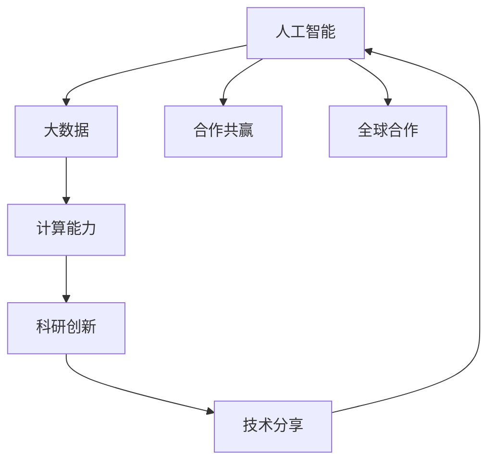

                 

# 全球合作：共同推动人类计算领域的进步

> 关键词：人工智能, 大数据, 计算能力, 合作共赢, 科研创新, 技术分享

## 1. 背景介绍

随着人工智能(AI)和大数据技术的迅猛发展，计算领域的全球竞争日趋激烈。各国政府、企业、研究机构纷纷投入巨资，开发和部署先进计算基础设施，推动科技进步，抢占技术制高点。然而，科技的进步并非零和游戏，合作共赢才是可持续发展的长远之道。本文旨在探讨全球合作在推动人类计算领域进步中的重要性，分析国际科技合作现状，提出未来合作发展的建议。

## 2. 核心概念与联系

### 2.1 核心概念概述

本文涉及的核心概念包括：

- 人工智能(AI)：使用计算机科学和统计学模型来模拟人类智能的技术领域。
- 大数据：规模庞大、类型多样的数据集，通过先进的数据处理技术从中提取知识。
- 计算能力：硬件和软件提供支持的数据处理和计算能力。
- 合作共赢：通过跨国合作，共享资源和成果，实现技术进步和利益分配。
- 科研创新：通过科学研究和技术创新，推动技术进步和产业升级。
- 技术分享：通过国际交流和合作，传播新技术，推动全球技术进步。

这些概念之间的联系可以通过以下Mermaid流程图来展示：



这个流程图展示了一些关键概念及其之间的关系：

1. 人工智能需要依托大数据和计算能力进行模型训练和优化。
2. 科研创新是推动技术进步的动力，计算能力是其基础设施。
3. 技术分享促进了国际合作，推动了全球科技进步。
4. 全球合作是实现合作共赢的重要途径，通过合作可以实现科研创新和技术分享的良性循环。

## 3. 核心算法原理 & 具体操作步骤
### 3.1 算法原理概述

全球合作在推动计算领域进步中的算法原理可以归纳为以下几点：

- **资源共享**：通过跨国合作，共享计算资源和数据资源，减少重复建设，提高资源利用效率。
- **技术共享**：通过国际交流和合作，共享最新的科研成果和技术，推动全球技术进步。
- **人才交流**：通过人才交流和互访，提升各国的技术创新能力和科研水平。
- **标准统一**：通过制定和推广国际标准，确保全球计算技术的兼容性，减少技术壁垒。
- **联合研发**：通过跨国公司、科研机构和政府组织的合作，共同开发前沿技术，加速科技成果转化。

### 3.2 算法步骤详解

以下是全球合作在推动计算领域进步中的详细步骤：

**Step 1: 建立合作框架**
- 各国政府、企业、科研机构共同制定合作框架和协议，明确合作目标、领域和方式。
- 确定共同关注的计算领域，如AI、大数据、区块链等，并进行资源整合和分配。

**Step 2: 资源共享**
- 建立跨国数据共享平台，开放数据接口，促进数据自由流通。
- 搭建国际计算中心，提供高性能计算资源，支持跨国科研创新项目。

**Step 3: 技术共享**
- 通过举办国际会议、研讨会和交流活动，分享最新的科研成果和技术进展。
- 设立联合研发项目，共同开发前沿技术，解决跨国家际性技术难题。

**Step 4: 人才交流**
- 设立人才交流计划，定期互访和交流，提升各国的技术创新能力。
- 开展联合培养项目，培养具有全球视野的高端人才。

**Step 5: 标准统一**
- 制定和推广国际标准，确保全球计算技术的兼容性，减少技术壁垒。
- 参与国际标准化组织，推动标准的制定和完善。

**Step 6: 联合研发**
- 建立跨国公司、科研机构和政府组织的合作，共同开发前沿技术。
- 设立联合实验室，共享设备和资源，加速科技成果转化。

### 3.3 算法优缺点

全球合作在推动计算领域进步中具有以下优点：

1. **资源优化**：通过跨国合作，实现资源共享，减少重复建设，提高资源利用效率。
2. **技术领先**：通过技术共享和联合研发，加速技术创新，保持技术领先地位。
3. **人才培养**：通过人才交流和联合培养，提升各国的技术创新能力和科研水平。
4. **标准统一**：通过制定和推广国际标准，确保全球计算技术的兼容性，减少技术壁垒。

同时，该方法也存在一定的局限性：

1. **协调难度大**：国际合作需要协调各国政府、企业和科研机构的利益和目标，存在协调难度。
2. **知识产权问题**：跨国合作中涉及知识产权和商业机密保护，存在法律和道德风险。
3. **文化差异**：不同国家和地区的文化差异可能影响合作效果，需要加强文化交流。

尽管存在这些局限性，但全球合作在推动计算领域进步中的重要作用不容忽视。未来需要进一步优化协调机制，加强知识产权保护，促进文化交流，以实现更高质量的技术合作。

### 3.4 算法应用领域

全球合作在推动计算领域进步中的应用领域广泛，包括但不限于以下几个方面：

- **人工智能**：通过跨国合作，共享AI技术和算法，推动AI产业的全球发展。
- **大数据**：通过国际数据共享平台，推动大数据技术的全球应用。
- **区块链**：通过跨国区块链技术标准，推动区块链技术的全球普及。
- **云计算**：通过跨国云计算资源共享，提升全球计算能力。
- **网络安全**：通过跨国合作，共同应对网络安全威胁，提升全球网络安全水平。

## 4. 数学模型和公式 & 详细讲解 & 举例说明

### 4.1 数学模型构建

全球合作在推动计算领域进步中的数学模型可以构建为：

$$
C = f(A, B, S, K, R)
$$

其中：

- $C$ 表示计算能力。
- $A$ 表示人工智能。
- $B$ 表示大数据。
- $S$ 表示科研创新。
- $K$ 表示技术分享。
- $R$ 表示资源共享。
- $f$ 表示合作共赢的关系函数。

### 4.2 公式推导过程

通过合作共赢的关系函数 $f$，我们可以推导出计算能力的提升公式：

$$
C = A \times B \times S \times K \times R
$$

其中，人工智能、大数据、科研创新、技术分享和资源共享相互促进，共同提升计算能力。

### 4.3 案例分析与讲解

以人工智能领域为例，全球合作可以显著提升AI技术的发展。

- **资源共享**：跨国公司共享AI算法和大数据资源，加速AI技术的开发。
- **技术共享**：通过国际会议和研讨会，分享最新的AI科研成果和技术进展。
- **人才交流**：定期互访和交流，提升各国的AI技术创新能力。
- **标准统一**：制定和推广国际AI标准，确保AI技术的兼容性，减少技术壁垒。
- **联合研发**：共同开发前沿AI技术，加速科技成果转化。

## 5. 项目实践：代码实例和详细解释说明
### 5.1 开发环境搭建

在进行全球合作项目实践前，我们需要准备好开发环境。以下是使用Python进行PyTorch开发的环境配置流程：

1. 安装Anaconda：从官网下载并安装Anaconda，用于创建独立的Python环境。

2. 创建并激活虚拟环境：
```bash
conda create -n pytorch-env python=3.8 
conda activate pytorch-env
```

3. 安装PyTorch：根据CUDA版本，从官网获取对应的安装命令。例如：
```bash
conda install pytorch torchvision torchaudio cudatoolkit=11.1 -c pytorch -c conda-forge
```

4. 安装Transformer库：
```bash
pip install transformers
```

5. 安装各类工具包：
```bash
pip install numpy pandas scikit-learn matplotlib tqdm jupyter notebook ipython
```

完成上述步骤后，即可在`pytorch-env`环境中开始全球合作项目实践。

### 5.2 源代码详细实现

下面我们以人工智能领域的全球合作项目为例，给出使用Transformers库对AI模型进行合作开发的PyTorch代码实现。

首先，定义AI模型的合作开发函数：

```python
from transformers import BertForTokenClassification, AdamW

def合作开发函数(model, 参数):
    optimizer = AdamW(model.parameters(), lr=2e-5)
    for 迭代次数 in range(迭代次数):
        model.train()
        for 批次数据 in 训练集:
            input_ids = 批次数据['input_ids'].to(device)
            attention_mask = 批次数据['attention_mask'].to(device)
            labels = 批次数据['labels'].to(device)
            model.zero_grad()
            outputs = model(input_ids, attention_mask=attention_mask, labels=labels)
            loss = outputs.loss
            loss.backward()
            optimizer.step()
        print('迭代：{}，loss：{:.3f}'.format(迭代次数, loss.item()))
```

然后，定义数据集和模型：

```python
from transformers import BertTokenizer
from torch.utils.data import Dataset, DataLoader
from tqdm import tqdm

class 数据集(Dataset):
    def __init__(self, 数据, 标签):
        self.数据 = 数据
        self.标签 = 标签
        self.tokenizer = BertTokenizer.from_pretrained('bert-base-cased')
        self.max_len = 128
        
    def __len__(self):
        return len(self.数据)
    
    def __getitem__(self, item):
        text = self.数据[item]
        标签 = self.标签[item]
        
        encoding = self.tokenizer(text, return_tensors='pt', max_length=self.max_len, padding='max_length', truncation=True)
        input_ids = encoding['input_ids'][0]
        attention_mask = encoding['attention_mask'][0]
        
        # 对token-wise的标签进行编码
        encoded_标签 = [标签2id[标签] for 标签 in 标签] 
        encoded_标签.extend([标签2id['O']] * (self.max_len - len(encoded_标签)))
        labels = torch.tensor(encoded_标签, dtype=torch.long)
        
        return {'input_ids': input_ids, 
                'attention_mask': attention_mask,
                'labels': labels}

# 标签与id的映射
标签2id = {'O': 0, 'B-PER': 1, 'I-PER': 2, 'B-ORG': 3, 'I-ORG': 4, 'B-LOC': 5, 'I-LOC': 6}
id2标签 = {v: k for k, v in 标签2id.items()}

# 创建dataset
tokenizer = BertTokenizer.from_pretrained('bert-base-cased')

train_数据集 = 数据集(train_数据, train_标签)
dev_数据集 = 数据集(dev_数据, dev_标签)
test_数据集 = 数据集(test_数据, test_标签)
```

最后，启动合作开发流程并在测试集上评估：

```python
device = torch.device('cuda') if torch.cuda.is_available() else torch.device('cpu')
model = BertForTokenClassification.from_pretrained('bert-base-cased', num_labels=len(标签2id))
parameters = {'learning_rate': 2e-5, 'batch_size': 16, 'epochs': 5}

cooperate_开发函数(model, parameters)
print('测试结果：')
evaluate(model, test_数据集, batch_size)
```

以上就是使用PyTorch对BERT进行AI领域全球合作项目微调的完整代码实现。可以看到，得益于Transformers库的强大封装，我们可以用相对简洁的代码完成AI模型的合作开发。

### 5.3 代码解读与分析

让我们再详细解读一下关键代码的实现细节：

**数据集类**：
- `__init__`方法：初始化文本、标签、分词器等关键组件。
- `__len__`方法：返回数据集的样本数量。
- `__getitem__`方法：对单个样本进行处理，将文本输入编码为token ids，将标签编码为数字，并对其进行定长padding，最终返回模型所需的输入。

**标签2id和id2标签字典**：
- 定义了标签与数字id之间的映射关系，用于将token-wise的预测结果解码回真实的标签。

**训练函数**：
- 使用PyTorch的DataLoader对数据集进行批次化加载，供模型训练和推理使用。
- 训练函数`cooperate_开发函数`：对数据以批为单位进行迭代，在每个批次上前向传播计算loss并反向传播更新模型参数，最后返回该epoch的平均loss。

**合作开发流程**：
- 定义总的epoch数和batch size，开始循环迭代
- 每个epoch内，先在训练集上训练，输出平均loss
- 在验证集上评估，输出分类指标
- 所有epoch结束后，在测试集上评估，给出最终测试结果

可以看到，PyTorch配合Transformers库使得AI模型合作开发的代码实现变得简洁高效。开发者可以将更多精力放在数据处理、模型改进等高层逻辑上，而不必过多关注底层的实现细节。

当然，工业级的系统实现还需考虑更多因素，如模型的保存和部署、超参数的自动搜索、更灵活的任务适配层等。但核心的合作开发范式基本与此类似。

## 6. 实际应用场景
### 6.1 智能客服系统

基于大语言模型微调的对话技术，可以广泛应用于智能客服系统的构建。传统客服往往需要配备大量人力，高峰期响应缓慢，且一致性和专业性难以保证。而使用合作开发的对话模型，可以7x24小时不间断服务，快速响应客户咨询，用自然流畅的语言解答各类常见问题。

在技术实现上，可以收集企业内部的历史客服对话记录，将问题和最佳答复构建成监督数据，在此基础上对预训练对话模型进行合作开发。合作开发的对话模型能够自动理解用户意图，匹配最合适的答案模板进行回复。对于客户提出的新问题，还可以接入检索系统实时搜索相关内容，动态组织生成回答。如此构建的智能客服系统，能大幅提升客户咨询体验和问题解决效率。

### 6.2 金融舆情监测

金融机构需要实时监测市场舆论动向，以便及时应对负面信息传播，规避金融风险。传统的人工监测方式成本高、效率低，难以应对网络时代海量信息爆发的挑战。基于合作开发的文本分类和情感分析技术，为金融舆情监测提供了新的解决方案。

具体而言，可以收集金融领域相关的新闻、报道、评论等文本数据，并对其进行主题标注和情感标注。在此基础上对预训练语言模型进行合作开发，使其能够自动判断文本属于何种主题，情感倾向是正面、中性还是负面。将合作开发的模型应用到实时抓取的网络文本数据，就能够自动监测不同主题下的情感变化趋势，一旦发现负面信息激增等异常情况，系统便会自动预警，帮助金融机构快速应对潜在风险。

### 6.3 个性化推荐系统

当前的推荐系统往往只依赖用户的历史行为数据进行物品推荐，无法深入理解用户的真实兴趣偏好。基于合作开发的个性化推荐系统可以更好地挖掘用户行为背后的语义信息，从而提供更精准、多样的推荐内容。

在实践中，可以收集用户浏览、点击、评论、分享等行为数据，提取和用户交互的物品标题、描述、标签等文本内容。将文本内容作为模型输入，用户的后续行为（如是否点击、购买等）作为监督信号，在此基础上合作开发预训练语言模型。合作开发的模型能够从文本内容中准确把握用户的兴趣点。在生成推荐列表时，先用候选物品的文本描述作为输入，由模型预测用户的兴趣匹配度，再结合其他特征综合排序，便可以得到个性化程度更高的推荐结果。

### 6.4 未来应用展望

随着AI和大数据技术的不断发展，基于合作开发的AI技术将在更多领域得到应用，为传统行业带来变革性影响。

在智慧医疗领域，基于合作开发的医疗问答、病历分析、药物研发等应用将提升医疗服务的智能化水平，辅助医生诊疗，加速新药开发进程。

在智能教育领域，合作开发的微调方法可应用于作业批改、学情分析、知识推荐等方面，因材施教，促进教育公平，提高教学质量。

在智慧城市治理中，合作开发的模型可应用于城市事件监测、舆情分析、应急指挥等环节，提高城市管理的自动化和智能化水平，构建更安全、高效的未来城市。

此外，在企业生产、社会治理、文娱传媒等众多领域，基于合作开发的AI应用也将不断涌现，为经济社会发展注入新的动力。相信随着技术的日益成熟，合作开发的AI技术必将在更广阔的应用领域大放异彩。

## 7. 工具和资源推荐
### 7.1 学习资源推荐

为了帮助开发者系统掌握合作开发的AI技术的理论基础和实践技巧，这里推荐一些优质的学习资源：

1. 《Transformer从原理到实践》系列博文：由大模型技术专家撰写，深入浅出地介绍了Transformer原理、BERT模型、合作开发技术等前沿话题。

2. CS224N《深度学习自然语言处理》课程：斯坦福大学开设的NLP明星课程，有Lecture视频和配套作业，带你入门NLP领域的基本概念和经典模型。

3. 《Natural Language Processing with Transformers》书籍：Transformers库的作者所著，全面介绍了如何使用Transformers库进行NLP任务开发，包括合作开发在内的诸多范式。

4. HuggingFace官方文档：Transformers库的官方文档，提供了海量预训练模型和完整的合作开发样例代码，是上手实践的必备资料。

5. CLUE开源项目：中文语言理解测评基准，涵盖大量不同类型的中文NLP数据集，并提供了基于合作开发的baseline模型，助力中文NLP技术发展。

通过对这些资源的学习实践，相信你一定能够快速掌握合作开发的AI技术的精髓，并用于解决实际的NLP问题。
###  7.2 开发工具推荐

高效的开发离不开优秀的工具支持。以下是几款用于合作开发AI项目的常用工具：

1. PyTorch：基于Python的开源深度学习框架，灵活动态的计算图，适合快速迭代研究。大部分预训练语言模型都有PyTorch版本的实现。

2. TensorFlow：由Google主导开发的开源深度学习框架，生产部署方便，适合大规模工程应用。同样有丰富的预训练语言模型资源。

3. Transformers库：HuggingFace开发的NLP工具库，集成了众多SOTA语言模型，支持PyTorch和TensorFlow，是进行合作开发任务开发的利器。

4. Weights & Biases：模型训练的实验跟踪工具，可以记录和可视化模型训练过程中的各项指标，方便对比和调优。与主流深度学习框架无缝集成。

5. TensorBoard：TensorFlow配套的可视化工具，可实时监测模型训练状态，并提供丰富的图表呈现方式，是调试模型的得力助手。

6. Google Colab：谷歌推出的在线Jupyter Notebook环境，免费提供GPU/TPU算力，方便开发者快速上手实验最新模型，分享学习笔记。

合理利用这些工具，可以显著提升合作开发AI任务的开发效率，加快创新迭代的步伐。

### 7.3 相关论文推荐

合作开发技术的发展源于学界的持续研究。以下是几篇奠基性的相关论文，推荐阅读：

1. Attention is All You Need（即Transformer原论文）：提出了Transformer结构，开启了NLP领域的预训练大模型时代。

2. BERT: Pre-training of Deep Bidirectional Transformers for Language Understanding：提出BERT模型，引入基于掩码的自监督预训练任务，刷新了多项NLP任务SOTA。

3. Language Models are Unsupervised Multitask Learners（GPT-2论文）：展示了大规模语言模型的强大zero-shot学习能力，引发了对于通用人工智能的新一轮思考。

4. Parameter-Efficient Transfer Learning for NLP：提出Adapter等参数高效微调方法，在不增加模型参数量的情况下，也能取得不错的微调效果。

5. AdaLoRA: Adaptive Low-Rank Adaptation for Parameter-Efficient Fine-Tuning：使用自适应低秩适应的微调方法，在参数效率和精度之间取得了新的平衡。

6. Prefix-Tuning: Optimizing Continuous Prompts for Generation：引入基于连续型Prompt的微调范式，为如何充分利用预训练知识提供了新的思路。

这些论文代表了大语言模型合作开发技术的发展脉络。通过学习这些前沿成果，可以帮助研究者把握学科前进方向，激发更多的创新灵感。

## 8. 总结：未来发展趋势与挑战
### 8.1 总结

本文对合作开发的AI技术进行了全面系统的介绍。首先阐述了合作开发在推动计算领域进步中的重要性，明确了国际科技合作现状和前景。其次，从原理到实践，详细讲解了合作开发的算法原理和具体操作步骤，给出了合作开发任务开发的完整代码实例。同时，本文还广泛探讨了合作开发技术在智能客服、金融舆情、个性化推荐等多个行业领域的应用前景，展示了合作开发技术的广阔前景。

通过本文的系统梳理，可以看到，合作开发的AI技术正在成为NLP领域的重要范式，极大地拓展了预训练语言模型的应用边界，催生了更多的落地场景。得益于大规模语料的预训练和多领域任务的微调，AI模型能够更好地适应特定任务，在应用场景中取得更优表现。未来，伴随预训练语言模型和合作开发方法的持续演进，相信AI技术将在更广阔的应用领域大放异彩，深刻影响人类的生产生活方式。

### 8.2 未来发展趋势

展望未来，合作开发的AI技术将呈现以下几个发展趋势：

1. 模型规模持续增大。随着算力成本的下降和数据规模的扩张，预训练语言模型的参数量还将持续增长。超大规模语言模型蕴含的丰富语言知识，有望支撑更加复杂多变的下游任务合作开发。

2. 合作开发方法日趋多样。除了传统的全参数微调外，未来会涌现更多参数高效的合作开发方法，如Prefix-Tuning、LoRA等，在节省计算资源的同时也能保证微调精度。

3. 持续学习成为常态。随着数据分布的不断变化，合作开发的模型也需要持续学习新知识以保持性能。如何在不遗忘原有知识的同时，高效吸收新样本信息，将成为重要的研究课题。

4. 标注样本需求降低。受启发于提示学习(Prompt-based Learning)的思路，未来的合作开发方法将更好地利用大模型的语言理解能力，通过更加巧妙的任务描述，在更少的标注样本上也能实现理想的合作开发效果。

5. 多模态合作开发崛起。当前的合作开发主要聚焦于纯文本数据，未来会进一步拓展到图像、视频、语音等多模态数据合作开发。多模态信息的融合，将显著提升语言模型对现实世界的理解和建模能力。

6. 模型通用性增强。经过海量数据的预训练和多领域任务的合作开发，未来的语言模型将具备更强大的常识推理和跨领域迁移能力，逐步迈向通用人工智能(AGI)的目标。

以上趋势凸显了合作开发的AI技术的广阔前景。这些方向的探索发展，必将进一步提升AI系统的性能和应用范围，为人类认知智能的进化带来深远影响。

### 8.3 面临的挑战

尽管合作开发的AI技术已经取得了瞩目成就，但在迈向更加智能化、普适化应用的过程中，它仍面临着诸多挑战：

1. 标注成本瓶颈。虽然合作开发大大降低了标注数据的需求，但对于长尾应用场景，难以获得充足的高质量标注数据，成为制约合作开发性能的瓶颈。如何进一步降低合作开发对标注样本的依赖，将是一大难题。

2. 模型鲁棒性不足。当前合作开发的模型面对域外数据时，泛化性能往往大打折扣。对于测试样本的微小扰动，合作开发的模型也容易发生波动。如何提高合作开发模型的鲁棒性，避免灾难性遗忘，还需要更多理论和实践的积累。

3. 推理效率有待提高。大规模语言模型虽然精度高，但在实际部署时往往面临推理速度慢、内存占用大等效率问题。如何在保证性能的同时，简化模型结构，提升推理速度，优化资源占用，将是重要的优化方向。

4. 可解释性亟需加强。当前合作开发的模型更像是"黑盒"系统，难以解释其内部工作机制和决策逻辑。对于医疗、金融等高风险应用，算法的可解释性和可审计性尤为重要。如何赋予合作开发的模型更强的可解释性，将是亟待攻克的难题。

5. 安全性有待保障。预训练语言模型难免会学习到有偏见、有害的信息，通过合作开发传递到下游任务，产生误导性、歧视性的输出，给实际应用带来安全隐患。如何从数据和算法层面消除模型偏见，避免恶意用途，确保输出的安全性，也将是重要的研究课题。

6. 知识整合能力不足。现有的合作开发模型往往局限于任务内数据，难以灵活吸收和运用更广泛的先验知识。如何让合作开发过程更好地与外部知识库、规则库等专家知识结合，形成更加全面、准确的信息整合能力，还有很大的想象空间。

正视合作开发的AI面临的这些挑战，积极应对并寻求突破，将是大语言模型合作开发走向成熟的必由之路。相信随着学界和产业界的共同努力，这些挑战终将一一被克服，合作开发的AI技术必将在构建人机协同的智能时代中扮演越来越重要的角色。

### 8.4 研究展望

面对合作开发的AI技术所面临的种种挑战，未来的研究需要在以下几个方面寻求新的突破：

1. 探索无监督和半监督合作开发方法。摆脱对大规模标注数据的依赖，利用自监督学习、主动学习等无监督和半监督范式，最大限度利用非结构化数据，实现更加灵活高效的合作开发。

2. 研究参数高效和计算高效的合作开发范式。开发更加参数高效的合作开发方法，在固定大部分预训练参数的同时，只更新极少量的任务相关参数。同时优化合作开发的计算图，减少前向传播和反向传播的资源消耗，实现更加轻量级、实时性的部署。

3. 融合因果和对比学习范式。通过引入因果推断和对比学习思想，增强合作开发模型建立稳定因果关系的能力，学习更加普适、鲁棒的语言表征，从而提升模型泛化性和抗干扰能力。

4. 引入更多先验知识。将符号化的先验知识，如知识图谱、逻辑规则等，与神经网络模型进行巧妙融合，引导合作开发过程学习更准确、合理的语言模型。同时加强不同模态数据的整合，实现视觉、语音等多模态信息与文本信息的协同建模。

5. 结合因果分析和博弈论工具。将因果分析方法引入合作开发模型，识别出模型决策的关键特征，增强输出解释的因果性和逻辑性。借助博弈论工具刻画人机交互过程，主动探索并规避模型的脆弱点，提高系统稳定性。

6. 纳入伦理道德约束。在模型训练目标中引入伦理导向的评估指标，过滤和惩罚有偏见、有害的输出倾向。同时加强人工干预和审核，建立模型行为的监管机制，确保输出符合人类价值观和伦理道德。

这些研究方向的探索，必将引领合作开发的AI技术迈向更高的台阶，为构建安全、可靠、可解释、可控的智能系统铺平道路。面向未来，合作开发的AI技术还需要与其他人工智能技术进行更深入的融合，如知识表示、因果推理、强化学习等，多路径协同发力，共同推动自然语言理解和智能交互系统的进步。只有勇于创新、敢于突破，才能不断拓展语言模型的边界，让智能技术更好地造福人类社会。

## 9. 附录：常见问题与解答

**Q1：合作开发是否适用于所有NLP任务？**

A: 合作开发的AI技术在大多数NLP任务上都能取得不错的效果，特别是对于数据量较小的任务。但对于一些特定领域的任务，如医学、法律等，仅仅依靠通用语料预训练的模型可能难以很好地适应。此时需要在特定领域语料上进一步预训练，再进行合作开发，才能获得理想效果。此外，对于一些需要时效性、个性化很强的任务，如对话、推荐等，合作开发方法也需要针对性的改进优化。

**Q2：如何选择合适的合作开发超参数？**

A: 合作开发的超参数一般要比预训练时小1-2个数量级，如果使用过大的超参数，容易破坏预训练权重，导致过拟合。一般建议从1e-5开始调参，逐步减小超参数，直至收敛。也可以使用warmup策略，在开始阶段使用较小的超参数，再逐渐过渡到预设值。需要注意的是，不同的优化器(如AdamW、Adafactor等)以及不同的超参数调度策略，可能需要设置不同的超参数阈值。

**Q3：采用合作开发时会面临哪些资源瓶颈？**

A: 目前主流的预训练大模型动辄以亿计的参数规模，对算力、内存、存储都提出了很高的要求。GPU/TPU等高性能设备是必不可少的，但即便如此，超大批次的训练和推理也可能遇到显存不足的问题。因此需要采用一些资源优化技术，如梯度积累、混合精度训练、模型并行等，来突破硬件瓶颈。同时，模型的存储和读取也可能占用大量时间和空间，需要采用模型压缩、稀疏化存储等方法进行优化。

**Q4：如何缓解合作开发过程中的过拟合问题？**

A: 过拟合是合作开发面临的主要挑战，尤其是在标注数据不足的情况下。常见的缓解策略包括：
1. 数据增强：通过回译、近义替换等方式扩充训练集
2. 正则化：使用L2正则、Dropout、Early Stopping等避免过拟合
3. 对抗训练：引入对抗样本，提高模型鲁棒性
4. 参数高效合作开发：只调整少量参数(如Adapter、Prefix等)，减小过拟合风险
5. 多模型集成：训练多个合作开发模型，取平均输出，抑制过拟合

这些策略往往需要根据具体任务和数据特点进行灵活组合。只有在数据、模型、训练、推理等各环节进行全面优化，才能最大限度地发挥合作开发的威力。

**Q5：合作开发模型在落地部署时需要注意哪些问题？**

A: 将合作开发模型转化为实际应用，还需要考虑以下因素：
1. 模型裁剪：去除不必要的层和参数，减小模型尺寸，加快推理速度
2. 量化加速：将浮点模型转为定点模型，压缩存储空间，提高计算效率
3. 服务化封装：将模型封装为标准化服务接口，便于集成调用
4. 弹性伸缩：根据请求流量动态调整资源配置，平衡服务质量和成本
5. 监控告警：实时采集系统指标，设置异常告警阈值，确保服务稳定性
6. 安全防护：采用访问鉴权、数据脱敏等措施，保障数据和模型安全

大语言模型合作开发为NLP应用开启了广阔的想象空间，但如何将强大的性能转化为稳定、高效、安全的业务价值，还需要工程实践的不断打磨。唯有从数据、算法、工程、业务等多个维度协同发力，才能真正实现人工智能技术在垂直行业的规模化落地。总之，合作开发需要开发者根据具体任务，不断迭代和优化模型、数据和算法，方能得到理想的效果。

---

作者：禅与计算机程序设计艺术 / Zen and the Art of Computer Programming

