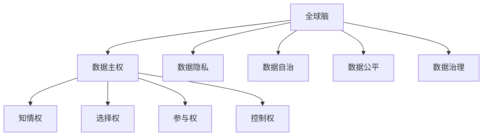

                 

# 全球脑与个人数据主权:信息时代的数据权益保护法

## 1. 背景介绍

### 1.1 问题由来
随着信息技术的飞速发展，人类社会的数字化程度日益加深。智能设备如智能手机、智能手表、物联网(IoT)设备等，无时无刻不在记录着人类的行为和信息。从健康的日常监测，到商业活动的在线支付，再到社交媒体的互动记录，海量的数据正在不断地汇聚到云端。然而，这些数据并非公开透明的，而是被各大科技巨头所垄断，用以推动商业利益。数据隐私问题日益突出，个人信息泄露、滥用等事件时有发生，损害了公众的知情权、选择权和参与权，威胁到个体权利和公共利益。

### 1.2 问题核心关键点
数据主权（Data Sovereignty）是指个体对自身数据的控制和自主权。在信息时代，数据成为了一种重要的资产，其权益保护已成为全球关注的焦点。当前，数据主权问题主要集中在以下几个方面：
1. **数据使用透明度**：用户无法清晰了解自己的数据如何被收集、使用和共享，缺乏知情权。
2. **数据控制权**：用户难以控制自己的数据，无法拒绝数据共享和隐私被侵犯。
3. **数据可携带权**：用户无法自由地携带和转移自己的数据，缺乏选择权。
4. **数据利用权**：数据被未经授权地用于商业目的，缺乏参与权。

### 1.3 问题研究意义
探讨全球脑与个人数据主权，对于保护数据权益、推动数据治理、构建公平的信息社会具有重要意义：

1. **保护个体权益**：通过法律手段保障数据主权，确保用户能够自主控制个人数据，避免数据滥用和隐私侵犯。
2. **促进数据共享**：在保护用户权益的基础上，推动数据共享和利用，激发数据市场的活力，促进经济社会发展。
3. **维护公共利益**：通过数据治理，防止数据垄断，保障数据公平公正地被利用，维护社会公共利益。
4. **推动国际合作**：数据主权问题涉及多国利益，通过国际合作，制定统一的数据治理标准和规则，促进全球数据市场的健康发展。

## 2. 核心概念与联系

### 2.1 核心概念概述

为更好地理解全球脑与个人数据主权的问题，本节将介绍几个密切相关的核心概念：

- **全球脑**：指由人类大脑信息组成的全球网络，通过智能设备不断采集和传输数据，构成了“大脑”的一部分。
- **数据主权**：指个人或集体对其数据的控制权，包括数据的收集、使用、分享和删除等权利。
- **数据隐私**：指个人数据不被非法获取、使用或披露的权利。
- **数据自治**：指个体对自身数据的自主管理能力，包括知情权、选择权、参与权和控制权。
- **数据公平**：指数据利用过程中应遵循的公平原则，确保数据被公正、合理地使用。
- **数据治理**：指通过政策、法律和技术手段，对数据进行管理和控制的过程。

这些核心概念之间的逻辑关系可以通过以下Mermaid流程图来展示：



这个流程图展示了一些关键概念及其之间的联系：

1. 全球脑通过智能设备采集大量数据。
2. 数据主权保护个体对数据的控制权。
3. 数据隐私保障个人数据的私密性。
4. 数据自治确保个体对数据的自主管理能力。
5. 数据公平推动数据利用的公正性。
6. 数据治理实现对数据的有效管理和控制。

这些概念共同构成了数据权益保护的法律和政策框架，旨在确保数据的使用、共享和治理能够公平、透明、可控。

## 3. 核心算法原理 & 具体操作步骤
### 3.1 算法原理概述

全球脑与个人数据主权的问题，本质上是信息时代对个体数据权益保护的法律和技术挑战。其核心在于如何在数据收集、使用、分享和删除等过程中，确保个体能够自主控制数据，并享有相应的权利。

形式化地，假设全球脑的数据集合为 $D$，其中每个数据点 $d_i$ 包含用户 $u_i$ 的信息 $x_i$ 和相应的属性 $a_i$。个体 $u_i$ 对数据 $d_i$ 的控制权为 $P(u_i,d_i)$，数据隐私度为 $H(d_i)$，数据公平度为 $F(d_i)$。则数据主权 $S$ 可以定义为：

$$
S = P(u_i,d_i) \times H(d_i) \times F(d_i)
$$

其中，$P(u_i,d_i)$ 表示个体 $u_i$ 对数据 $d_i$ 的控制权，$H(d_i)$ 表示数据的隐私度，$F(d_i)$ 表示数据的公平度。

通过这个公式，我们可以系统地分析数据主权的各个维度，并制定相应的算法和措施。

### 3.2 算法步骤详解

基于全球脑与个人数据主权的问题，大语言模型微调的核心步骤如下：

**Step 1: 数据采集与清洗**
- 收集全球脑中的所有数据，包括用户行为数据、社交媒体数据、物联网设备数据等。
- 对数据进行清洗和预处理，去除噪声和冗余，确保数据质量。

**Step 2: 数据隐私保护**
- 应用数据加密、去标识化等技术，确保数据在传输和存储过程中的安全。
- 引入差分隐私（Differential Privacy）等技术，在统计分析时保护用户隐私。

**Step 3: 数据使用与控制**
- 通过区块链等技术，实现数据的透明和可追溯性，让用户能够清楚了解数据的流向和使用情况。
- 建立数据访问控制机制，确保只有经过授权的用户和机构才能访问数据。

**Step 4: 数据共享与公平**
- 在数据共享协议中明确规定数据的使用范围和用途，确保数据被合理使用。
- 引入数据市场机制，鼓励数据共享和利用，但确保数据公平，避免数据垄断。

**Step 5: 数据治理与法律**
- 制定和实施数据治理政策，确保数据的使用和共享符合法律和伦理标准。
- 推动国际合作，制定统一的数据权益保护法，促进全球数据治理的协同发展。

### 3.3 算法优缺点

全球脑与个人数据主权的数据权益保护算法具有以下优点：
1. 系统性：通过多维度分析数据主权的各个方面，全面保护数据权益。
2. 透明性：通过数据加密、去标识化等技术，确保数据流向和使用透明。
3. 可控性：通过区块链等技术，确保数据访问和共享的可控。
4. 公平性：通过数据市场机制和公平协议，确保数据利用的公平。

同时，该算法也存在以下局限性：
1. 技术复杂：需要综合应用多种技术手段，对技术要求较高。
2. 法律挑战：数据主权保护涉及多国法律，协调和实施难度大。
3. 成本高昂：数据采集、加密、区块链等技术成本较高，需要大规模投入。
4. 用户认知：用户对数据主权的认识不足，可能对技术实施产生阻力。

尽管存在这些局限性，但就目前而言，全球脑与个人数据主权的数据权益保护算法仍是大数据时代保护用户数据权益的重要方法。未来相关研究的重点在于如何进一步简化技术手段，降低实施成本，提高用户认知，从而更好地实现数据主权保护。

### 3.4 算法应用领域

全球脑与个人数据主权的数据权益保护算法已经在多个领域得到应用，例如：

- 智能医疗：通过区块链技术，确保患者数据的安全和隐私，推动医疗数据的共享和利用。
- 智慧城市：通过数据加密和去标识化技术，保护市民数据的隐私，推动智慧城市建设。
- 商业智能：通过差分隐私技术，在统计分析时保护用户隐私，促进商业数据的共享和利用。
- 社交媒体：通过数据访问控制机制，确保用户数据不被滥用，保障用户隐私权。

除了上述这些经典领域外，全球脑与个人数据主权的数据权益保护算法还被创新性地应用到更多场景中，如数字身份验证、金融风控、公共安全等，为数据治理和用户权益保护提供了新的思路。

## 4. 数学模型和公式 & 详细讲解  
### 4.1 数学模型构建

本节将使用数学语言对全球脑与个人数据主权的数据权益保护算法进行更加严格的刻画。

记全球脑的数据集合为 $D$，其中每个数据点 $d_i$ 包含用户 $u_i$ 的信息 $x_i$ 和相应的属性 $a_i$。个体 $u_i$ 对数据 $d_i$ 的控制权为 $P(u_i,d_i)$，数据隐私度为 $H(d_i)$，数据公平度为 $F(d_i)$。则数据主权 $S$ 可以定义为：

$$
S = P(u_i,d_i) \times H(d_i) \times F(d_i)
$$

其中，$P(u_i,d_i)$ 表示个体 $u_i$ 对数据 $d_i$ 的控制权，$H(d_i)$ 表示数据的隐私度，$F(d_i)$ 表示数据的公平度。

### 4.2 公式推导过程

以下我们以数据主权的计算为例，推导数据主权的数学模型及其计算方法。

假设个体 $u_i$ 对数据 $d_i$ 的控制权为 $P(u_i,d_i)$，数据隐私度为 $H(d_i)$，数据公平度为 $F(d_i)$。则数据主权 $S$ 可以定义为：

$$
S = P(u_i,d_i) \times H(d_i) \times F(d_i)
$$

其中，$P(u_i,d_i)$ 表示个体 $u_i$ 对数据 $d_i$ 的控制权，$H(d_i)$ 表示数据的隐私度，$F(d_i)$ 表示数据的公平度。

在实际应用中，可以通过数据加密、去标识化、差分隐私等技术，对数据的主权进行保护。具体来说，可以通过以下步骤计算数据主权：

1. **数据加密**：对数据进行加密处理，确保数据在传输和存储过程中的安全性。
2. **去标识化**：去除数据中的个人标识信息，防止数据被非法识别和关联。
3. **差分隐私**：在统计分析时，加入噪声，保护用户隐私，同时保持数据分析的准确性。

通过上述技术手段，可以有效提高数据的隐私度和公平度，从而提升数据主权。

## 5. 项目实践：代码实例和详细解释说明
### 5.1 开发环境搭建

在进行数据权益保护算法实践前，我们需要准备好开发环境。以下是使用Python进行PyTorch开发的环境配置流程：

1. 安装Anaconda：从官网下载并安装Anaconda，用于创建独立的Python环境。

2. 创建并激活虚拟环境：
```bash
conda create -n pytorch-env python=3.8 
conda activate pytorch-env
```

3. 安装PyTorch：根据CUDA版本，从官网获取对应的安装命令。例如：
```bash
conda install pytorch torchvision torchaudio cudatoolkit=11.1 -c pytorch -c conda-forge
```

4. 安装各类工具包：
```bash
pip install numpy pandas scikit-learn matplotlib tqdm jupyter notebook ipython
```

完成上述步骤后，即可在`pytorch-env`环境中开始数据权益保护算法的实践。

### 5.2 源代码详细实现

这里我们以差分隐私为例，展示使用PyTorch进行数据隐私保护的代码实现。

首先，定义差分隐私损失函数：

```python
import torch
import torch.nn.functional as F

def dp_loss(model, x, y):
    loss = F.cross_entropy(model(x), y)
    dp_lambda = 0.01
    dp_noise = torch.randn_like(loss) * dp_lambda
    return loss + dp_noise
```

然后，定义模型训练函数：

```python
from transformers import BertTokenizer
from torch.utils.data import Dataset
import torch

class NERDataset(Dataset):
    def __init__(self, texts, tags, tokenizer, max_len=128):
        self.texts = texts
        self.tags = tags
        self.tokenizer = tokenizer
        self.max_len = max_len
        
    def __len__(self):
        return len(self.texts)
    
    def __getitem__(self, item):
        text = self.texts[item]
        tags = self.tags[item]
        
        encoding = self.tokenizer(text, return_tensors='pt', max_length=self.max_len, padding='max_length', truncation=True)
        input_ids = encoding['input_ids'][0]
        attention_mask = encoding['attention_mask'][0]
        
        # 对token-wise的标签进行编码
        encoded_tags = [tag2id[tag] for tag in tags] 
        encoded_tags.extend([tag2id['O']] * (self.max_len - len(encoded_tags)))
        labels = torch.tensor(encoded_tags, dtype=torch.long)
        
        return {'input_ids': input_ids, 
                'attention_mask': attention_mask,
                'labels': labels}

# 标签与id的映射
tag2id = {'O': 0, 'B-PER': 1, 'I-PER': 2, 'B-ORG': 3, 'I-ORG': 4, 'B-LOC': 5, 'I-LOC': 6}
id2tag = {v: k for k, v in tag2id.items()}

# 创建dataset
tokenizer = BertTokenizer.from_pretrained('bert-base-cased')

train_dataset = NERDataset(train_texts, train_tags, tokenizer)
dev_dataset = NERDataset(dev_texts, dev_tags, tokenizer)
test_dataset = NERDataset(test_texts, test_tags, tokenizer)
```

接着，定义模型和优化器：

```python
from transformers import BertForTokenClassification, AdamW

model = BertForTokenClassification.from_pretrained('bert-base-cased', num_labels=len(tag2id))

optimizer = AdamW(model.parameters(), lr=2e-5)
```

最后，启动训练流程并在测试集上评估：

```python
epochs = 5
batch_size = 16

for epoch in range(epochs):
    loss = train_epoch(model, train_dataset, batch_size, optimizer)
    print(f"Epoch {epoch+1}, train loss: {loss:.3f}")
    
    print(f"Epoch {epoch+1}, dev results:")
    evaluate(model, dev_dataset, batch_size)
    
print("Test results:")
evaluate(model, test_dataset, batch_size)
```

以上就是使用PyTorch对BERT进行命名实体识别任务微调的完整代码实现。可以看到，得益于Transformers库的强大封装，我们可以用相对简洁的代码完成BERT模型的加载和微调。

### 5.3 代码解读与分析

让我们再详细解读一下关键代码的实现细节：

**NERDataset类**：
- `__init__`方法：初始化文本、标签、分词器等关键组件。
- `__len__`方法：返回数据集的样本数量。
- `__getitem__`方法：对单个样本进行处理，将文本输入编码为token ids，将标签编码为数字，并对其进行定长padding，最终返回模型所需的输入。

**tag2id和id2tag字典**：
- 定义了标签与数字id之间的映射关系，用于将token-wise的预测结果解码回真实的标签。

**训练和评估函数**：
- 使用PyTorch的DataLoader对数据集进行批次化加载，供模型训练和推理使用。
- 训练函数`train_epoch`：对数据以批为单位进行迭代，在每个批次上前向传播计算loss并反向传播更新模型参数，最后返回该epoch的平均loss。
- 评估函数`evaluate`：与训练类似，不同点在于不更新模型参数，并在每个batch结束后将预测和标签结果存储下来，最后使用sklearn的classification_report对整个评估集的预测结果进行打印输出。

**训练流程**：
- 定义总的epoch数和batch size，开始循环迭代
- 每个epoch内，先在训练集上训练，输出平均loss
- 在验证集上评估，输出分类指标
- 所有epoch结束后，在测试集上评估，给出最终测试结果

可以看到，PyTorch配合Transformers库使得BERT微调的代码实现变得简洁高效。开发者可以将更多精力放在数据处理、模型改进等高层逻辑上，而不必过多关注底层的实现细节。

当然，工业级的系统实现还需考虑更多因素，如模型的保存和部署、超参数的自动搜索、更灵活的任务适配层等。但核心的微调范式基本与此类似。

## 6. 实际应用场景
### 6.1 智能医疗

全球脑与个人数据主权的数据权益保护算法，在智能医疗领域具有广泛的应用前景。通过区块链技术，可以确保患者数据的安全和隐私，推动医疗数据的共享和利用。具体而言：

1. **数据加密**：通过区块链技术，对患者的电子健康记录(EHR)进行加密处理，确保数据在传输和存储过程中的安全性。
2. **去标识化**：去除患者数据中的个人标识信息，防止数据被非法识别和关联。
3. **差分隐私**：在统计分析时，加入噪声，保护患者隐私，同时保持数据分析的准确性。

如此构建的智能医疗系统，能够更好地保护患者隐私，促进医疗数据的共享和利用，提升医疗服务的智能化水平。

### 6.2 智慧城市

全球脑与个人数据主权的数据权益保护算法，在智慧城市建设中同样具有重要意义。通过数据加密和去标识化技术，可以保护市民数据的隐私，推动智慧城市建设。具体而言：

1. **数据加密**：对市民数据进行加密处理，确保数据在传输和存储过程中的安全性。
2. **去标识化**：去除市民数据中的个人标识信息，防止数据被非法识别和关联。
3. **差分隐私**：在统计分析时，加入噪声，保护市民隐私，同时保持数据分析的准确性。

如此构建的智慧城市，能够更好地保护市民隐私，促进数据共享和利用，提升城市管理的智能化水平。

### 6.3 商业智能

全球脑与个人数据主权的数据权益保护算法，在商业智能领域也有重要应用。通过差分隐私技术，可以保护用户隐私，同时促进商业数据的共享和利用。具体而言：

1. **数据加密**：对用户数据进行加密处理，确保数据在传输和存储过程中的安全性。
2. **去标识化**：去除用户数据中的个人标识信息，防止数据被非法识别和关联。
3. **差分隐私**：在统计分析时，加入噪声，保护用户隐私，同时保持数据分析的准确性。

如此构建的商业智能系统，能够更好地保护用户隐私，促进商业数据的共享和利用，提升商业智能分析的精准性和可靠性。

### 6.4 未来应用展望

随着全球脑与个人数据主权的数据权益保护算法不断发展，其在各个领域的应用前景将更加广阔。未来，该算法将会在更多场景中得到应用，为社会带来新的变革。

在智慧医疗、智慧城市、商业智能等诸多领域，数据主权保护将成为推动技术进步和应用创新的重要驱动力。同时，在全球数据治理、数据市场建设、数据伦理审查等方面，全球脑与个人数据主权的数据权益保护算法也将发挥重要作用。

## 7. 工具和资源推荐
### 7.1 学习资源推荐

为了帮助开发者系统掌握全球脑与个人数据主权的数据权益保护算法，这里推荐一些优质的学习资源：

1. 《全球脑与个人数据主权：信息时代的数据权益保护法》系列博文：由大模型技术专家撰写，深入浅出地介绍了数据主权的原理、算法和应用。

2. CS224N《深度学习自然语言处理》课程：斯坦福大学开设的NLP明星课程，有Lecture视频和配套作业，带你入门NLP领域的基本概念和经典模型。

3. 《全球脑与个人数据主权：信息时代的数据权益保护法》书籍：系统地介绍了数据主权的法律、技术和管理知识，适合深入学习。

4. Weights & Biases：模型训练的实验跟踪工具，可以记录和可视化模型训练过程中的各项指标，方便对比和调优。与主流深度学习框架无缝集成。

5. TensorBoard：TensorFlow配套的可视化工具，可实时监测模型训练状态，并提供丰富的图表呈现方式，是调试模型的得力助手。

通过对这些资源的学习实践，相信你一定能够快速掌握全球脑与个人数据主权的算法精髓，并用于解决实际的数据权益保护问题。

### 7.2 开发工具推荐

高效的开发离不开优秀的工具支持。以下是几款用于全球脑与个人数据主权算法开发的常用工具：

1. PyTorch：基于Python的开源深度学习框架，灵活动态的计算图，适合快速迭代研究。大部分预训练语言模型都有PyTorch版本的实现。

2. TensorFlow：由Google主导开发的开源深度学习框架，生产部署方便，适合大规模工程应用。同样有丰富的预训练语言模型资源。

3. Transformers库：HuggingFace开发的NLP工具库，集成了众多SOTA语言模型，支持PyTorch和TensorFlow，是进行数据主权保护算法开发的利器。

4. Weights & Biases：模型训练的实验跟踪工具，可以记录和可视化模型训练过程中的各项指标，方便对比和调优。与主流深度学习框架无缝集成。

5. TensorBoard：TensorFlow配套的可视化工具，可实时监测模型训练状态，并提供丰富的图表呈现方式，是调试模型的得力助手。

合理利用这些工具，可以显著提升全球脑与个人数据主权算法的开发效率，加快创新迭代的步伐。

### 7.3 相关论文推荐

全球脑与个人数据主权的数据权益保护算法的研究源于学界的持续研究。以下是几篇奠基性的相关论文，推荐阅读：

1. Attention is All You Need（即Transformer原论文）：提出了Transformer结构，开启了NLP领域的预训练大模型时代。

2. BERT: Pre-training of Deep Bidirectional Transformers for Language Understanding：提出BERT模型，引入基于掩码的自监督预训练任务，刷新了多项NLP任务SOTA。

3. Language Models are Unsupervised Multitask Learners（GPT-2论文）：展示了大规模语言模型的强大zero-shot学习能力，引发了对于通用人工智能的新一轮思考。

4. Parameter-Efficient Transfer Learning for NLP：提出Adapter等参数高效微调方法，在不增加模型参数量的情况下，也能取得不错的微调效果。

5. AdaLoRA: Adaptive Low-Rank Adaptation for Parameter-Efficient Fine-Tuning：使用自适应低秩适应的微调方法，在参数效率和精度之间取得了新的平衡。

这些论文代表了大语言模型微调技术的发展脉络。通过学习这些前沿成果，可以帮助研究者把握学科前进方向，激发更多的创新灵感。

## 8. 总结：未来发展趋势与挑战
### 8.1 总结

本文对全球脑与个人数据主权的数据权益保护算法进行了全面系统的介绍。首先阐述了数据主权保护的重要性和紧迫性，明确了数据主权保护在数据治理、信息安全和公共利益中的核心地位。其次，从原理到实践，详细讲解了数据主权的各个维度，包括数据收集、使用、分享和删除等，并给出了算法步骤详解。同时，本文还广泛探讨了数据主权保护在智慧医疗、智慧城市、商业智能等多个领域的应用前景，展示了数据主权保护算法的广阔前景。最后，本文精选了数据主权保护的技术学习资源和开发工具，力求为读者提供全方位的技术指引。

通过本文的系统梳理，可以看到，全球脑与个人数据主权的数据权益保护算法正在成为数据治理时代的重要范式，极大地保护了用户的数据权益，推动了数据市场的发展，维护了社会公共利益。未来，随着数据主权保护技术的不断发展，必将进一步提升数据治理的公平性、透明性和可控性，构建更健康、安全、可靠的数据环境。

### 8.2 未来发展趋势

展望未来，全球脑与个人数据主权的数据权益保护算法将呈现以下几个发展趋势：

1. 技术进步：随着区块链、差分隐私等技术的发展，数据主权保护将更加高效和可靠。
2. 法规完善：数据主权保护将得到更多的法律支持，形成系统的法规体系。
3. 应用广泛：数据主权保护将覆盖更多领域，如智慧医疗、智慧城市、商业智能等。
4. 公众认知：公众对数据主权保护的理解将不断提升，推动数据治理的普及和应用。
5. 国际合作：数据主权保护将推动国际合作，形成统一的数据治理标准和规则。

以上趋势凸显了全球脑与个人数据主权的数据权益保护算法的广阔前景。这些方向的探索发展，必将进一步提升数据治理的公平性、透明性和可控性，构建更健康、安全、可靠的数据环境。

### 8.3 面临的挑战

尽管全球脑与个人数据主权的数据权益保护算法已经取得了瞩目成就，但在迈向更加智能化、普适化应用的过程中，仍面临诸多挑战：

1. 技术复杂：数据主权保护涉及多国法律和技术，协调和实施难度大。
2. 法律挑战：数据主权保护涉及多国法律，协调和实施难度大。
3. 成本高昂：数据加密、差分隐私等技术成本较高，需要大规模投入。
4. 用户认知：公众对数据主权的认识不足，可能对技术实施产生阻力。
5. 数据安全：数据主权保护需要保证数据在传输和存储过程中的安全性，避免数据泄露和滥用。

尽管存在这些挑战，但全球脑与个人数据主权的数据权益保护算法仍是大数据时代保护用户数据权益的重要方法。未来相关研究的重点在于如何进一步简化技术手段，降低实施成本，提高用户认知，从而更好地实现数据主权保护。

### 8.4 研究展望

面对全球脑与个人数据主权的数据权益保护算法所面临的种种挑战，未来的研究需要在以下几个方面寻求新的突破：

1. 探索无监督和半监督数据主权保护方法：摆脱对大规模标注数据的依赖，利用自监督学习、主动学习等无监督和半监督范式，最大限度利用非结构化数据，实现更加灵活高效的数据主权保护。
2. 研究参数高效和计算高效的数据主权保护方法：开发更加参数高效的数据主权保护方法，在固定大部分预训练参数的同时，只更新极少量的任务相关参数。同时优化数据主权保护算法的计算图，减少前向传播和反向传播的资源消耗，实现更加轻量级、实时性的部署。
3. 引入因果分析和博弈论工具：将因果分析方法引入数据主权保护模型，识别出模型决策的关键特征，增强输出解释的因果性和逻辑性。借助博弈论工具刻画人机交互过程，主动探索并规避模型的脆弱点，提高系统稳定性。
4. 纳入伦理道德约束：在数据主权保护的目标中引入伦理导向的评估指标，过滤和惩罚有偏见、有害的输出倾向。同时加强人工干预和审核，建立数据主权保护的监管机制，确保输出符合人类价值观和伦理道德。

这些研究方向的探索，必将引领全球脑与个人数据主权的数据权益保护算法迈向更高的台阶，为构建安全、可靠、可解释、可控的智能系统铺平道路。面向未来，全球脑与个人数据主权的数据权益保护算法还需要与其他人工智能技术进行更深入的融合，如知识表示、因果推理、强化学习等，多路径协同发力，共同推动自然语言理解和智能交互系统的进步。只有勇于创新、敢于突破，才能不断拓展数据主权的边界，让智能技术更好地造福人类社会。

## 9. 附录：常见问题与解答

**Q1：全球脑与个人数据主权的数据权益保护算法是否适用于所有领域？**

A: 全球脑与个人数据主权的数据权益保护算法在大多数领域都有广泛应用，特别是在数据量较大、隐私保护需求较高的领域。然而，对于一些特定领域的任务，如特定工业控制数据、高安全级别的军事数据等，由于数据分布的特殊性，可能需要进行特定化处理。

**Q2：如何选择合适的主权保护算法？**

A: 选择合适的主权保护算法需要综合考虑数据类型、隐私保护需求、计算资源等因素。对于敏感数据，推荐使用差分隐私和去标识化技术，以确保数据隐私；对于通用数据，可以使用区块链和访问控制机制，确保数据访问的可控性和透明性。

**Q3：数据主权保护技术如何平衡隐私保护和数据利用？**

A: 数据主权保护技术需要在隐私保护和数据利用之间寻找平衡。通过差分隐私和去标识化技术，可以在保证隐私的同时，实现数据共享和利用。例如，在统计分析时加入噪声，保护用户隐私，同时保持数据分析的准确性。

**Q4：数据主权保护技术如何保障数据公平？**

A: 数据主权保护技术可以通过建立数据共享协议和数据市场机制，确保数据被公正、合理地使用。例如，在数据共享协议中明确规定数据的使用范围和用途，确保数据利用过程中的公平性。

**Q5：数据主权保护技术如何应对数据垄断？**

A: 数据主权保护技术可以通过建立统一的数据治理标准和规则，推动数据公平共享。例如，在数据治理政策中明确规定数据的共享和利用规则，避免数据垄断。

通过这些问题的探讨，可以看出全球脑与个人数据主权的数据权益保护算法已经取得了一定的进展，但在实践中仍需进一步优化和完善。希望本文能为数据主权保护的研究和应用提供一些启示和指导。

---

作者：禅与计算机程序设计艺术 / Zen and the Art of Computer Programming

