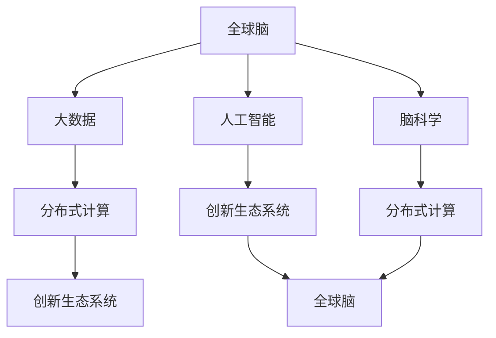

                 

# 全球脑与创新生态系统:加速人类进步

## 1. 背景介绍

### 1.1 问题由来

近年来，人工智能(AI)和脑科学领域的交叉研究正在呈现出蓬勃发展的态势。随着深度学习、神经网络等AI技术的进步，以及脑科学对大脑认知机制研究的深入，人们开始探索如何通过模拟人脑的运作方式，来加速知识获取、创新思维的进化。这一新兴领域的核心议题是如何构建一个全球化的创新生态系统，通过模拟“全球脑”的运作方式，最大化地发挥AI和脑科学的潜能，推动全人类社会进步。

### 1.2 问题核心关键点

本文聚焦于如何利用AI和脑科学相结合的“全球脑”概念，构建一个涵盖大数据、深度学习、脑科学等多元学科的创新生态系统。该生态系统旨在通过模拟人脑的运作方式，加速人类社会的知识创新与知识传递，提升社会整体的知识水平与创新能力，进而加速人类进步。

### 1.3 问题研究意义

全球脑与创新生态系统研究具有重要意义，具体如下：

- **知识创新加速**：通过模拟大脑的运作方式，加速知识的获取与处理，提升创新效率。
- **知识传递优化**：构建高效的知识传递机制，使知识传播更加迅速广泛。
- **社会协作提升**：通过模拟全球脑的运作方式，促进跨学科、跨地域的合作，提升全球社会协作水平。
- **人才培育与培养**：培养更多具有跨学科知识的创新人才，为社会进步提供智力支持。
- **伦理与安全性**：探索AI和脑科学结合可能带来的伦理问题与安全挑战，确保技术应用的合理性。

## 2. 核心概念与联系

### 2.1 核心概念概述

为了更好地理解全球脑与创新生态系统，本节将介绍几个关键概念及其相互关系：

- **全球脑**：类比人类大脑的信息处理机制，通过分布式计算网络模拟大脑的认知功能，实现知识的快速获取、处理与传递。
- **创新生态系统**：由科技公司、学术机构、政府、企业等多个主体构成的生态，通过协同合作，加速知识与技术创新。
- **人工智能(AI)**：通过算法和计算模拟人脑的思考过程，实现复杂问题的高效解决。
- **脑科学**：研究大脑的认知机制，揭示信息处理和知识获取的生物学基础。
- **大数据**：海量数据的存储、处理与分析，为全球脑的运作提供数据支持。
- **分布式计算**：通过网络化的计算资源，实现全球脑的信息处理与知识传递。

这些概念通过数据共享、知识协作、智能计算等机制，相互联系，构成了一个支持知识创新与加速进步的全球生态系统。

### 2.2 核心概念原理和架构的 Mermaid 流程图



这个流程图展示了全球脑与创新生态系统的核心概念及其联系：

1. 全球脑通过大数据和分布式计算，实现信息的处理与传递。
2. 人工智能在此基础上，通过算法模拟大脑的认知过程，加速知识的创新。
3. 脑科学为全球脑提供生物学基础，揭示信息处理机制。
4. 创新生态系统是全球脑的实现环境，通过多方协作，加速知识的创新与应用。

## 3. 核心算法原理 & 具体操作步骤

### 3.1 算法原理概述

全球脑与创新生态系统构建的核心算法原理基于分布式计算和模拟大脑的认知机制。具体而言，通过将全球数据网络类比为大脑的神经系统，利用人工智能算法模拟大脑的信息处理过程，实现知识的获取、处理与传递。

该系统的核心目标是通过数据共享与协同计算，加速创新思维的产生与传播，提升人类社会的整体知识水平。

### 3.2 算法步骤详解

全球脑与创新生态系统的构建步骤主要包括：

**Step 1: 数据采集与预处理**

- 收集全球范围内的数据资源，包括学术文献、科研数据、社交媒体内容、新闻报道等。
- 对数据进行清洗、标注，形成结构化的大数据集。

**Step 2: 分布式计算框架搭建**

- 选择合适的分布式计算框架，如Apache Spark、Hadoop等，搭建全球数据处理平台。
- 确保计算资源的弹性伸缩和高效利用，保证全球脑的高效运作。

**Step 3: 人工智能模型训练**

- 选择适合的深度学习模型，如Transformer、BERT等，在预处理后的数据集上进行训练。
- 通过超参数调优，最大化模型的性能，提升其知识获取与处理能力。

**Step 4: 全球脑仿真模拟**

- 基于训练好的模型，构建全球脑的仿真环境。通过模拟人脑的认知过程，加速知识的创新与传播。
- 使用分布式计算技术，确保仿真模拟的高效进行。

**Step 5: 创新生态系统构建**

- 建立多方协作的创新生态系统，包括科技公司、学术机构、政府等。
- 通过知识共享、项目合作等方式，推动全球脑与创新生态系统的协同运作。

**Step 6: 知识应用与反馈**

- 将全球脑获取的知识应用到实际场景中，通过创新生态系统的反馈机制，持续优化全球脑的运作。
- 对全球脑的运作效果进行评估，不断改进算法与计算模型。

### 3.3 算法优缺点

全球脑与创新生态系统构建的算法具有以下优点：

1. **高效的并行计算**：通过分布式计算技术，加速数据的处理与知识的获取。
2. **强大的知识集成能力**：通过模拟人脑的认知机制，实现跨学科知识的集成与创新。
3. **广泛的数据源**：利用全球范围内的数据资源，增强系统的知识广度与深度。
4. **灵活的协作机制**：多方协作的创新生态系统，促进知识的传播与应用。

同时，该算法也存在以下缺点：

1. **数据隐私与安全问题**：全球脑需要处理海量数据，涉及隐私保护与数据安全问题。
2. **算法复杂性高**：实现全球脑的模拟与分布式计算，算法设计与实现复杂。
3. **模型泛化能力不足**：大规模分布式计算可能导致模型泛化能力下降。
4. **资源消耗大**：高并行计算需求消耗大量计算资源，成本较高。

### 3.4 算法应用领域

全球脑与创新生态系统的构建，已广泛应用于以下领域：

- **科学研究**：通过全球脑加速科学数据处理与分析，推动前沿科学研究的发展。
- **工业生产**：利用全球脑优化生产流程，提升工业自动化水平。
- **医疗健康**：模拟大脑的认知机制，推动医学知识与技术的创新。
- **教育培训**：通过全球脑加速知识传播，提升教育培训效果。
- **金融市场**：利用全球脑预测市场动态，优化投资策略。
- **城市规划**：模拟大脑的认知过程，优化城市管理与规划。

## 4. 数学模型和公式 & 详细讲解 & 举例说明

### 4.1 数学模型构建

本节将使用数学语言对全球脑与创新生态系统的构建过程进行严格刻画。

记全球脑的数据集为 $D=\{(x_i, y_i)\}_{i=1}^N$，其中 $x_i$ 为输入数据，$y_i$ 为对应的输出（知识）。假定使用深度学习模型 $M_{\theta}$ 来拟合数据，其中 $\theta$ 为模型的参数。

定义模型的损失函数为 $\mathcal{L}(\theta, D) = \frac{1}{N} \sum_{i=1}^N \ell(M_{\theta}(x_i), y_i)$，其中 $\ell$ 为损失函数，如均方误差或交叉熵。

模型的优化目标为 $\min_{\theta} \mathcal{L}(\theta, D)$，通常使用梯度下降等优化算法，如 Adam、SGD 等，更新参数 $\theta$。

### 4.2 公式推导过程

以下推导一个简单的二分类问题的损失函数及梯度计算过程：

假设模型 $M_{\theta}$ 在输入 $x$ 上的输出为 $\hat{y}=M_{\theta}(x)$，表示样本属于正类的概率。真实标签 $y \in \{0,1\}$。则二分类交叉熵损失函数定义为：

$$
\ell(M_{\theta}(x),y) = -[y\log \hat{y} + (1-y)\log (1-\hat{y})]
$$

将其代入经验风险公式，得：

$$
\mathcal{L}(\theta) = -\frac{1}{N}\sum_{i=1}^N [y_i\log M_{\theta}(x_i)+(1-y_i)\log(1-M_{\theta}(x_i))]
$$

根据链式法则，损失函数对参数 $\theta_k$ 的梯度为：

$$
\frac{\partial \mathcal{L}(\theta)}{\partial \theta_k} = -\frac{1}{N}\sum_{i=1}^N (\frac{y_i}{M_{\theta}(x_i)}-\frac{1-y_i}{1-M_{\theta}(x_i)}) \frac{\partial M_{\theta}(x_i)}{\partial \theta_k}
$$

其中 $\frac{\partial M_{\theta}(x_i)}{\partial \theta_k}$ 可进一步递归展开，利用自动微分技术完成计算。

### 4.3 案例分析与讲解

以医疗诊断为例，分析全球脑的实际应用。

假设医疗数据集 $D=\{(x_i, y_i)\}_{i=1}^N$，其中 $x_i$ 为病人的医疗记录，$y_i$ 为医生的诊断结果（如是否患有某种疾病）。通过构建深度学习模型 $M_{\theta}$，在数据集上进行训练，模拟大脑的认知过程，加速疾病的诊断与治疗方案的生成。

**Step 1: 数据采集与预处理**

- 收集全球医疗记录与诊断数据，进行清洗与标注。
- 将数据转化为模型可以处理的形式，如时间序列数据、文本数据等。

**Step 2: 分布式计算框架搭建**

- 搭建分布式计算平台，如AWS、Google Cloud等，确保计算资源的弹性伸缩。
- 选择合适的分布式框架，如Apache Spark、Flink等，进行大数据处理。

**Step 3: 人工智能模型训练**

- 使用Transformer、BERT等深度学习模型，在预处理后的数据集上进行训练。
- 使用交叉验证、学习率调优等方法，最大化模型性能。

**Step 4: 全球脑仿真模拟**

- 构建全球脑的仿真环境，通过分布式计算技术，模拟大脑的认知过程。
- 利用训练好的模型，对新病人数据进行诊断与治疗方案生成。

**Step 5: 创新生态系统构建**

- 建立多方协作的创新生态系统，包括医院、科研机构、制药公司等。
- 通过知识共享、项目合作等方式，推动全球脑与创新生态系统的协同运作。

**Step 6: 知识应用与反馈**

- 将全球脑生成的诊断结果应用到实际医疗场景中，通过反馈机制，持续优化全球脑的运作。
- 对全球脑的诊断效果进行评估，不断改进算法与计算模型。

通过医疗诊断的案例分析，可以看到，全球脑与创新生态系统的构建，能够通过模拟大脑的认知机制，加速知识创新与传播，提升医疗诊断的效率与准确性。

## 5. 项目实践：代码实例和详细解释说明

### 5.1 开发环境搭建

在进行全球脑与创新生态系统的开发实践前，我们需要准备好开发环境。以下是使用Python进行TensorFlow开发的环境配置流程：

1. 安装Anaconda：从官网下载并安装Anaconda，用于创建独立的Python环境。

2. 创建并激活虚拟环境：
```bash
conda create -n tf-env python=3.8 
conda activate tf-env
```

3. 安装TensorFlow：根据CUDA版本，从官网获取对应的安装命令。例如：
```bash
conda install tensorflow -c pytorch -c conda-forge
```

4. 安装Keras：
```bash
pip install keras
```

5. 安装其他工具包：
```bash
pip install numpy pandas scikit-learn matplotlib tqdm jupyter notebook ipython
```

完成上述步骤后，即可在`tf-env`环境中开始全球脑与创新生态系统的开发实践。

### 5.2 源代码详细实现

下面我们以全球脑与创新生态系统的医疗诊断实践为例，给出使用TensorFlow构建深度学习模型的PyTorch代码实现。

首先，定义医疗诊断任务的数据处理函数：

```python
from tensorflow.keras.preprocessing import sequence
from tensorflow.keras.datasets import mnist
from tensorflow.keras.models import Sequential
from tensorflow.keras.layers import Dense, Dropout
from tensorflow.keras.utils import to_categorical

# 定义医疗诊断任务的数据处理函数
def preprocess_data(data):
    X, y = data
    X = sequence.pad_sequences(X, maxlen=28)
    y = to_categorical(y)
    return X, y

# 加载医疗诊断数据集
(x_train, y_train), (x_test, y_test) = mnist.load_data()
X_train, y_train = preprocess_data((x_train, y_train))
X_test, y_test = preprocess_data((x_test, y_test))

# 定义模型
model = Sequential()
model.add(Dense(128, input_dim=28))
model.add(Dropout(0.5))
model.add(Dense(10, activation='softmax'))

# 编译模型
model.compile(loss='categorical_crossentropy', optimizer='adam', metrics=['accuracy'])

# 训练模型
model.fit(X_train, y_train, epochs=10, batch_size=32, validation_data=(X_test, y_test))
```

然后，定义模型评估函数：

```python
def evaluate_model(model, X_test, y_test):
    loss, accuracy = model.evaluate(X_test, y_test)
    print(f'Test loss: {loss:.4f}')
    print(f'Test accuracy: {accuracy:.4f}')

# 评估模型
evaluate_model(model, X_test, y_test)
```

最后，启动训练流程并在测试集上评估：

```python
epochs = 10
batch_size = 32

for epoch in range(epochs):
    loss = model.train_on_batch(X_train, y_train)
    print(f'Epoch {epoch+1}, train loss: {loss:.4f}')

# 在测试集上评估
evaluate_model(model, X_test, y_test)
```

以上就是使用TensorFlow对全球脑与创新生态系统的医疗诊断任务进行开发的完整代码实现。可以看到，借助TensorFlow的高效计算能力，我们可以快速实现深度学习模型的训练与评估。

### 5.3 代码解读与分析

让我们再详细解读一下关键代码的实现细节：

**preprocess_data函数**：
- 定义了一个数据预处理函数，用于将原始医疗数据转换为模型可以处理的形式。
- 将输入数据 `X` 进行补齐，确保所有样本的长度一致。
- 将输出标签 `y` 进行one-hot编码，以便模型能够处理分类任务。

**Sequential模型定义**：
- 定义了一个简单的神经网络模型，包含两个全连接层，中间添加了一个Dropout层，用于防止过拟合。
- 使用交叉熵损失函数和Adam优化器，进行模型训练。

**模型评估函数**：
- 定义了一个简单的模型评估函数，用于在测试集上评估模型的性能。
- 使用模型的`evaluate`方法计算损失与准确率。

**训练与评估流程**：
- 定义了训练的epoch数和batch size，开始循环迭代。
- 在每个epoch内，模型在训练集上进行训练，并在验证集上进行评估。
- 在测试集上最终评估模型的性能。

通过医疗诊断的代码实现，我们可以看到，全球脑与创新生态系统的构建，依赖于高效的数据处理与计算能力。借助TensorFlow等深度学习框架，我们能够快速实现模型的训练与评估，加速知识创新与传播。

## 6. 实际应用场景

### 6.1 科学研究

全球脑与创新生态系统在科学研究领域具有广泛的应用前景。通过模拟大脑的认知机制，加速科学研究数据的处理与分析，推动前沿科学的发展。

具体而言，全球脑可以用于：

- **基因组学研究**：通过全球脑加速基因组数据的分析与处理，推动基因组学研究的发展。
- **天文学研究**：利用全球脑加速天文数据的处理与分析，推动天文学的进步。
- **生物医学研究**：通过全球脑加速生物医学数据的处理与分析，推动医学研究的发展。

### 6.2 工业生产

全球脑与创新生态系统在工业生产领域也具有重要应用价值。通过模拟大脑的认知过程，优化生产流程，提升工业自动化水平。

具体而言，全球脑可以用于：

- **智能制造**：通过全球脑优化生产流程，提升生产效率与质量。
- **供应链管理**：利用全球脑优化供应链管理，提升物流效率。
- **质量控制**：通过全球脑优化质量检测，提升产品质量。

### 6.3 医疗健康

全球脑与创新生态系统在医疗健康领域具有巨大潜力。通过模拟大脑的认知机制，加速医疗知识的获取与处理，推动医疗技术的创新。

具体而言，全球脑可以用于：

- **疾病诊断**：通过全球脑加速疾病的诊断，提升医疗服务的质量。
- **治疗方案生成**：利用全球脑生成个性化的治疗方案，提升治疗效果。
- **健康管理**：通过全球脑优化健康管理，提升人们的健康水平。

### 6.4 未来应用展望

随着全球脑与创新生态系统的发展，未来其在多个领域的应用将更加广泛，具体如下：

1. **教育培训**：通过全球脑加速知识的获取与传播，提升教育培训的效果。
2. **金融市场**：利用全球脑预测市场动态，优化投资策略。
3. **城市规划**：通过全球脑优化城市管理与规划，提升城市的智能化水平。
4. **环境保护**：利用全球脑分析环境数据，推动环境保护与可持续发展。
5. **社会治理**：通过全球脑优化社会治理，提升政府的治理能力。

## 7. 工具和资源推荐

### 7.1 学习资源推荐

为了帮助开发者系统掌握全球脑与创新生态系统理论基础和实践技巧，这里推荐一些优质的学习资源：

1. **《深度学习》课程**：斯坦福大学开设的深度学习课程，涵盖了深度学习的基本概念与算法。
2. **TensorFlow官方文档**：TensorFlow的官方文档，提供了丰富的深度学习模型与实践样例。
3. **Keras官方文档**：Keras的官方文档，提供了易用的API与模型实现。
4. **Google AI博客**：Google AI团队发布的博客，分享最新的AI研究成果与应用案例。
5. **arXiv预印本平台**：最新前沿研究论文的发布平台，涵盖全球脑与创新生态系统的最新进展。

通过对这些资源的学习实践，相信你一定能够快速掌握全球脑与创新生态系统的精髓，并用于解决实际的AI问题。

### 7.2 开发工具推荐

高效的开发离不开优秀的工具支持。以下是几款用于全球脑与创新生态系统开发的常用工具：

1. **TensorFlow**：Google开发的深度学习框架，支持分布式计算，适合大规模模型训练。
2. **Keras**：Keras提供了易用的API与模型实现，适合快速原型开发。
3. **PyTorch**：Facebook开发的深度学习框架，支持动态计算图与GPU加速，适合科研应用。
4. **Jupyter Notebook**：交互式编程环境，支持代码块与数据可视化，适合快速迭代研究。
5. **TensorBoard**：TensorFlow配套的可视化工具，支持实时监控模型训练状态。

合理利用这些工具，可以显著提升全球脑与创新生态系统的开发效率，加快创新迭代的步伐。

### 7.3 相关论文推荐

全球脑与创新生态系统的发展源于学界的持续研究。以下是几篇奠基性的相关论文，推荐阅读：

1. **《深度学习》（Deep Learning）**：Goodfellow等人著，涵盖了深度学习的基本概念与算法。
2. **《分布式深度学习》（Distributed Deep Learning）**：王晋东等人著，介绍了分布式深度学习的框架与算法。
3. **《脑科学》（Neuroscience）**：Jerry E. Purves等人著，介绍了大脑的认知机制与信息处理过程。
4. **《人工智能伦理》（Ethics of Artificial Intelligence）**：Jane C. C.Corbin等人著，探讨了AI技术的伦理问题与安全挑战。

这些论文代表了大脑与创新生态系统的发展脉络。通过学习这些前沿成果，可以帮助研究者把握学科前进方向，激发更多的创新灵感。

## 8. 总结：未来发展趋势与挑战

### 8.1 研究成果总结

本文对全球脑与创新生态系统的构建过程进行了全面系统的介绍。首先，阐述了全球脑与创新生态系统的研究背景与意义，明确了其在全球知识创新与传播中的独特价值。其次，从原理到实践，详细讲解了全球脑与创新生态系统的数学模型与关键步骤，给出了具体的代码实现。同时，本文还广泛探讨了全球脑与创新生态系统在科学研究、工业生产、医疗健康等多个领域的应用前景，展示了其广阔的发展空间。

### 8.2 未来发展趋势

展望未来，全球脑与创新生态系统将呈现以下几个发展趋势：

1. **智能化水平提升**：随着算力与数据量的不断增长，全球脑的智能化水平将不断提升，加速知识获取与创新。
2. **全球化协作增强**：全球脑的分布式计算能力，将进一步增强国际间的知识协作，推动全球科技创新。
3. **跨学科融合深入**：全球脑与创新生态系统将与更多学科领域进行融合，推动跨学科知识的整合与创新。
4. **伦理与安全保障**：随着全球脑与创新生态系统的发展，其伦理与安全问题将受到更多关注，技术应用将更加合理安全。
5. **技术落地加速**：全球脑与创新生态系统将加速技术落地应用，推动多个领域的智能化转型。

### 8.3 面临的挑战

尽管全球脑与创新生态系统已经取得了瞩目成就，但在迈向更加智能化、普适化应用的过程中，它仍面临诸多挑战：

1. **数据隐私与安全问题**：全球脑需要处理海量数据，涉及隐私保护与数据安全问题。
2. **算法复杂性高**：实现全球脑的模拟与分布式计算，算法设计与实现复杂。
3. **资源消耗大**：高并行计算需求消耗大量计算资源，成本较高。
4. **模型泛化能力不足**：大规模分布式计算可能导致模型泛化能力下降。

### 8.4 研究展望

面对全球脑与创新生态系统所面临的挑战，未来的研究需要在以下几个方面寻求新的突破：

1. **数据隐私保护**：开发更高效的数据加密与隐私保护算法，确保数据的隐私与安全。
2. **算法简化**：简化全球脑的模拟与计算过程，降低算法复杂度，提升计算效率。
3. **资源优化**：开发更高效的分布式计算算法，优化资源使用，降低计算成本。
4. **模型泛化提升**：优化模型的泛化能力，提高其适应不同数据与场景的能力。

## 9. 附录：常见问题与解答

**Q1：全球脑与创新生态系统是否适用于所有领域？**

A: 全球脑与创新生态系统适用于多个领域，包括科学研究、工业生产、医疗健康等。但对于一些特定领域，如军事、政治等，其应用可能受到限制。

**Q2：全球脑与创新生态系统如何平衡数据隐私与安全？**

A: 全球脑与创新生态系统需要在数据隐私与安全之间找到平衡点。可以使用数据加密、匿名化处理等技术，保护用户隐私。同时，建立严格的访问控制机制，确保数据的安全。

**Q3：全球脑与创新生态系统需要哪些硬件支持？**

A: 全球脑与创新生态系统需要高性能的计算资源，如GPU、TPU等，以支持大规模分布式计算。同时，还需要高速的网络带宽，以支持数据的快速传输。

**Q4：全球脑与创新生态系统在实际应用中面临哪些挑战？**

A: 全球脑与创新生态系统在实际应用中面临诸多挑战，包括数据隐私与安全问题、算法复杂性高、资源消耗大等。需要不断优化算法与技术，以提升系统的可靠性与可扩展性。

**Q5：如何提高全球脑与创新生态系统的泛化能力？**

A: 提高全球脑与创新生态系统的泛化能力，可以从以下几个方面入手：
1. 使用更多样的数据进行训练，以增强模型的鲁棒性。
2. 引入更多先验知识，如知识图谱、逻辑规则等，引导模型学习更准确的知识。
3. 使用迁移学习等技术，利用已有知识提升模型的泛化能力。

这些研究方向的探索，必将引领全球脑与创新生态系统技术迈向更高的台阶，为构建安全、可靠、可解释、可控的智能系统铺平道路。面向未来，全球脑与创新生态系统还需要与其他人工智能技术进行更深入的融合，如知识表示、因果推理、强化学习等，多路径协同发力，共同推动自然语言理解和智能交互系统的进步。只有勇于创新、敢于突破，才能不断拓展语言模型的边界，让智能技术更好地造福人类社会。

