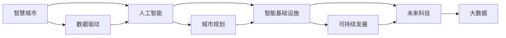

                 

# 全球脑与城市规划:智慧城市的终极形态

> 关键词：智慧城市, 城市规划, 数据驱动, 人工智能, 可持续发展, 未来科技, 大数据, 智能基础设施

## 1. 背景介绍

### 1.1 问题由来
在人类历史上，城市一直是文明与进步的象征。城市的规划与建设，不仅仅关乎居住、交通、工业、商业等物质文明的发展，更关乎社会的进步与文化的繁荣。随着信息时代的到来，数字化、网络化、智能化技术逐渐渗透到城市的各个角落，城市规划与建设进入了一个全新的发展阶段——智慧城市。

智慧城市旨在利用信息通信技术（ICT）和大数据，优化城市资源配置，提升城市管理效率，改善居民生活质量，增强城市竞争力。城市规划则是智慧城市建设的核心，其目标是通过科学合理的规划，使城市功能得到充分发挥，实现可持续发展。

### 1.2 问题核心关键点
智慧城市的核心在于通过数据驱动、技术赋能，实现高效、智能的城市管理。然而，目前智慧城市规划与建设仍面临诸多挑战，如数据质量不高、治理模式落后、公众参与度低等。这些问题亟需解决，才能真正实现智慧城市的理想状态。

为解决这些问题，本文将深入探讨智慧城市的核心概念和原理，介绍最新的大数据、人工智能等技术，并分析其实际应用中的具体步骤和关键算法，为未来的城市规划提供理论和技术支撑。

### 1.3 问题研究意义
智慧城市是未来城市发展的方向，其核心在于数据驱动、智能分析和精准决策。通过深入研究智慧城市的规划与建设，可以提升城市治理水平，改善民生福祉，推动经济社会可持续发展。本文的研究将为智慧城市的实践提供理论指导和参考，助力其在全球范围内实现普及和深化。

## 2. 核心概念与联系

### 2.1 核心概念概述

智慧城市：以信息通信技术（ICT）为支撑，通过物联网、大数据、云计算、人工智能等技术手段，实现城市管理和服务智能化、精细化的城市形态。

城市规划：指城市发展的战略构思和实施过程，包括城市的功能定位、空间布局、交通系统、公共服务设施、环境保护等各个方面。

数据驱动：指通过收集、处理、分析城市运行过程中产生的大量数据，支持城市决策和管理，提升城市治理水平。

人工智能：一种模拟人类智能的计算技术，通过学习、推理、自然语言处理、图像识别、自动驾驶等技术手段，提高城市运行效率和服务质量。

可持续发展：指在满足当代人需求的同时，不损害后代人满足其需求的能力，实现经济、社会、环境的协调发展。

未来科技：指在现有技术基础上，通过创新驱动，不断拓展技术应用领域，解决人类面临的重大问题，提升人类生活质量的技术集合。

大数据：指规模巨大、复杂多变、形式多样的数据集合，通过对这些数据的分析和应用，能够揭示出蕴含在数据背后的规律和趋势。

智能基础设施：指采用物联网、云计算、人工智能等技术手段，实现城市基础设施智能化、互联化的物理空间。

### 2.2 核心概念原理和架构的 Mermaid 流程图



这个流程图展示了智慧城市各核心概念之间的联系。智慧城市以数据驱动为核心，通过人工智能技术进行智能分析，依托城市规划和智能基础设施，实现可持续发展，并运用未来科技推动技术创新和应用。大数据作为智慧城市的基础，支撑着各个环节的运行。

## 3. 核心算法原理 & 具体操作步骤

### 3.1 算法原理概述

智慧城市的构建基于数据驱动和人工智能技术，核心算法包括以下几个方面：

- 数据集成与融合：通过集成各类城市数据，包括交通流量、环境监测、公共服务、居民需求等，实现数据的融合与共享。
- 数据清洗与预处理：清洗和处理数据中的噪声和错误，提取有用的信息，确保数据质量。
- 数据分析与挖掘：运用统计分析、机器学习、深度学习等技术手段，从海量数据中挖掘出规律和趋势，支持决策。
- 智能决策支持：基于分析结果，通过专家系统和模型，为城市管理提供决策支持，优化资源配置。

### 3.2 算法步骤详解

智慧城市的构建步骤如下：

1. **数据收集**：通过传感器、监控摄像头、居民反馈等方式，收集城市运行过程中产生的数据，包括交通流量、环境质量、公共服务设施使用情况等。

2. **数据清洗与预处理**：清洗数据中的噪声和错误，进行格式统一和标准化，确保数据质量。

3. **数据分析与挖掘**：运用数据分析和挖掘技术，对数据进行统计分析、聚类、分类、预测等处理，提取有用的信息和规律。

4. **智能决策支持**：基于分析结果，通过专家系统和模型，为城市管理提供决策支持，优化资源配置。

5. **系统集成与优化**：将各个子系统集成，实现数据共享和协同运作，不断优化系统性能和用户体验。

### 3.3 算法优缺点

智慧城市的数据驱动和人工智能算法具有以下优点：

- 高效性：通过数据驱动和人工智能技术，实现城市管理的智能化、精细化，提升城市运行效率和服务质量。
- 准确性：基于数据分析和挖掘，能够揭示数据背后的规律和趋势，提供准确的决策支持。
- 灵活性：能够快速响应城市运行中的各种变化，调整资源配置和策略。

然而，也存在一些缺点：

- 数据质量问题：数据量大、来源多样，数据质量难以保证，可能会影响决策的准确性。
- 技术复杂性：需要掌握多种先进技术，对技术人才的需求较高，实施难度较大。
- 成本高昂：数据收集、处理和分析需要大量人力、物力和财力投入，初期投资较大。
- 隐私和安全风险：数据收集和处理过程中涉及大量个人隐私信息，数据安全问题不容忽视。

### 3.4 算法应用领域

智慧城市的数据驱动和人工智能算法已经广泛应用于以下几个领域：

- 交通管理：通过大数据和人工智能技术，优化交通信号控制、路网规划，提升交通效率。
- 环境监测：运用传感器和数据分析技术，实时监测环境质量，预测环境变化趋势，改善城市环境。
- 公共服务：通过智能分析，优化公共服务设施的布局和配置，提升公共服务质量。
- 社会治理：利用人工智能技术，预测犯罪行为、灾害风险，提高城市治理能力。
- 医疗健康：运用数据分析和人工智能，提升医疗服务质量，促进健康事业发展。

## 4. 数学模型和公式 & 详细讲解 & 举例说明

### 4.1 数学模型构建

智慧城市的核心算法基于数据驱动和人工智能技术，其数学模型构建如下：

设城市运行数据集为 $D=\{(x_i, y_i)\}_{i=1}^N$，其中 $x_i$ 为输入变量，$y_i$ 为输出变量，$N$ 为样本数量。智慧城市的核心算法可以通过以下数学模型进行建模：

$$
\min_{\theta} \frac{1}{N} \sum_{i=1}^N \ell(f_{\theta}(x_i), y_i)
$$

其中 $\ell$ 为损失函数，$f_{\theta}(x_i)$ 为模型预测输出，$\theta$ 为模型参数。

### 4.2 公式推导过程

以交通流量预测为例，设 $x_i$ 为时间、天气、节假日等输入变量，$y_i$ 为交通流量输出变量。模型可以采用线性回归、支持向量机（SVM）、随机森林等算法进行构建。假设采用线性回归模型，则模型形式为：

$$
y_i = \theta_0 + \theta_1 x_{i1} + \theta_2 x_{i2} + \ldots + \theta_n x_{in}
$$

其中 $\theta_0, \theta_1, \ldots, \theta_n$ 为模型参数。

通过最小二乘法或梯度下降法，对模型参数进行优化，使预测输出与真实输出尽量接近。具体推导过程如下：

设损失函数为均方误差损失函数：

$$
\ell(y_i, \hat{y_i}) = \frac{1}{2} (y_i - \hat{y_i})^2
$$

则模型参数优化问题可以表示为：

$$
\min_{\theta} \frac{1}{N} \sum_{i=1}^N \frac{1}{2} (y_i - \hat{y_i})^2
$$

对上式进行求导，并令导数为零，得到模型参数的更新公式：

$$
\theta_k = \theta_k - \eta \frac{1}{N} \sum_{i=1}^N (y_i - \hat{y_i}) x_{ik}
$$

其中 $\eta$ 为学习率，$k=0,1,\ldots,n$。

### 4.3 案例分析与讲解

以智慧城市中的环境监测为例，通过传感器实时监测环境质量数据，并结合历史数据，利用时间序列分析模型预测未来环境变化趋势。假设数据集为 $D=\{(t_i, x_i)\}_{i=1}^N$，其中 $t_i$ 为时间，$x_i$ 为环境质量指标。假设采用自回归积分滑动平均模型（ARIMA）进行建模，则模型形式为：

$$
x_i = \theta_0 + \theta_1 x_{i-1} + \theta_2 x_{i-2} + \ldots + \theta_d x_{i-d} + \epsilon_i
$$

其中 $\theta_0, \theta_1, \ldots, \theta_d$ 为模型参数，$\epsilon_i$ 为误差项。

通过最小化预测误差，对模型参数进行优化，得到最优的预测模型。

## 5. 项目实践：代码实例和详细解释说明

### 5.1 开发环境搭建

在智慧城市项目开发中，需要搭建合适的开发环境。以下是一些常用开发工具和环境搭建流程：

1. **Python环境搭建**：使用Anaconda或Miniconda创建Python虚拟环境，安装必要的依赖包，如NumPy、Pandas、SciPy、TensorFlow等。

2. **数据处理环境搭建**：搭建Hadoop、Spark等大数据处理平台，处理和存储海量城市数据。

3. **云计算环境搭建**：使用AWS、Google Cloud、阿里云等云服务，搭建云平台，实现数据的分布式存储和计算。

4. **可视化环境搭建**：使用Tableau、Power BI、QlikView等工具，实现数据的可视化展示和分析。

### 5.2 源代码详细实现

以下是一个基于Python和TensorFlow的智慧城市交通流量预测模型代码实现示例：

```python
import tensorflow as tf
from tensorflow.keras.models import Sequential
from tensorflow.keras.layers import Dense, Dropout

# 定义模型
model = Sequential()
model.add(Dense(64, activation='relu', input_dim=n_features))
model.add(Dropout(0.5))
model.add(Dense(64, activation='relu'))
model.add(Dropout(0.5))
model.add(Dense(1))

# 编译模型
model.compile(optimizer='adam', loss='mse')

# 训练模型
model.fit(x_train, y_train, epochs=50, batch_size=32, validation_data=(x_val, y_val))

# 预测流量
predicted_flow = model.predict(x_test)
```

该模型使用一个简单的前馈神经网络，包含两个隐藏层，输出为交通流量预测值。在训练过程中，使用均方误差损失函数，优化器为Adam。

### 5.3 代码解读与分析

代码中，首先定义了一个包含两个隐藏层的神经网络模型，使用ReLU激活函数，并通过Dropout层防止过拟合。然后编译模型，使用均方误差损失函数和Adam优化器进行训练。在训练过程中，使用验证集进行模型评估，防止过拟合。最后，使用训练好的模型对测试集进行流量预测。

## 6. 实际应用场景

### 6.1 智慧交通管理

智慧城市中，交通管理是重要的应用场景。通过大数据和人工智能技术，可以实现交通信号控制、路网规划、交通事故预测等功能。

1. **交通信号控制**：通过传感器和摄像头实时监测交通流量，结合历史数据，优化信号灯配时，减少交通拥堵。

2. **路网规划**：利用数据分析技术，预测交通流量变化趋势，优化路网布局，提高通行效率。

3. **交通事故预测**：通过机器学习算法，预测事故发生的概率和位置，提前采取措施，避免事故发生。

### 6.2 智能电网

智慧城市中，智能电网也是重要的应用场景。通过大数据和人工智能技术，可以实现电网负荷预测、故障检测、能源优化等功能。

1. **电网负荷预测**：通过传感器和监测设备，实时监测电网负荷变化，结合历史数据，预测未来负荷，优化资源配置。

2. **故障检测**：利用机器学习算法，实时检测电网故障，快速定位和处理，提高电网运行稳定性。

3. **能源优化**：通过数据分析技术，优化能源配置，减少能源浪费，提高能源利用效率。

### 6.3 智慧医疗

智慧城市中，智慧医疗也是重要的应用场景。通过大数据和人工智能技术，可以实现疾病预测、医疗资源优化、医疗决策支持等功能。

1. **疾病预测**：通过数据分析技术，预测疾病发生概率和趋势，提前采取预防措施。

2. **医疗资源优化**：利用机器学习算法，优化医疗资源配置，提高医疗服务质量。

3. **医疗决策支持**：通过数据分析和人工智能技术，支持医疗决策，提升诊疗水平。

### 6.4 未来应用展望

未来，智慧城市将迎来更多新技术和新应用，如物联网、区块链、5G等。这些技术将进一步提升城市管理的智能化水平，推动智慧城市的发展。

1. **物联网**：通过物联网技术，实现城市基础设施的全面智能化，提升城市运行效率。

2. **区块链**：通过区块链技术，实现城市数据的透明化、去中心化管理，提高城市治理水平。

3. **5G**：通过5G技术，实现城市数据的实时传输和处理，提升城市运行效率和安全性。

4. **人工智能与大数据**：通过大数据和人工智能技术，实现智慧城市的深度融合，提升城市管理水平。

## 7. 工具和资源推荐

### 7.1 学习资源推荐

为帮助开发者系统掌握智慧城市的规划与建设，以下推荐一些优质学习资源：

1. **《智慧城市：大数据与物联网的应用》**：全面介绍了智慧城市的定义、构建和应用，涵盖数据驱动、人工智能技术等内容。

2. **Coursera《城市数据科学与智慧城市》课程**：由知名大学开设的课程，涵盖城市数据科学和智慧城市建设的内容，提供丰富的学习资源。

3. **IEEE Xplore《智慧城市期刊》**：收录了智慧城市领域的最新研究成果，涵盖城市规划、管理、建设等内容。

4. **Kaggle智慧城市数据集**：提供了丰富的智慧城市数据集，用于数据驱动和机器学习算法的实验和研究。

### 7.2 开发工具推荐

在智慧城市项目开发中，需要选择合适的开发工具。以下是一些常用工具和推荐理由：

1. **Python编程语言**：Python语言简洁高效，易于学习和使用，是数据科学和机器学习领域的主流语言。

2. **TensorFlow框架**：TensorFlow是谷歌开发的开源深度学习框架，具有强大的计算图功能和丰富的模型库，适用于智慧城市中的大数据和人工智能应用。

3. **Jupyter Notebook**：Jupyter Notebook是一个开源的Web应用，支持Python代码的编写、执行和展示，适合数据驱动和人工智能算法的开发和研究。

4. **Kaggle平台**：Kaggle是一个数据科学竞赛平台，提供了丰富的数据集和算法库，适合数据驱动和机器学习算法的实验和研究。

### 7.3 相关论文推荐

智慧城市领域的最新研究成果，可以通过以下论文进行学习：

1. **《智慧城市：理论与实践》**：由智慧城市领域知名专家撰写，全面介绍了智慧城市的定义、构建和应用。

2. **《数据驱动的城市管理：智能决策支持系统》**：介绍了基于大数据的城市管理智能决策支持系统，提供详细的算法和实现方法。

3. **《城市规划与智慧城市的融合》**：探讨了城市规划与智慧城市的融合，提供丰富的实践案例和成功经验。

## 8. 总结：未来发展趋势与挑战

### 8.1 研究成果总结

智慧城市的研究成果已经取得显著进展，主要体现在以下几个方面：

1. **数据驱动**：通过大数据技术，实现城市运行数据的实时采集和处理，提供科学决策支持。

2. **人工智能**：通过人工智能技术，实现城市管理和服务智能化、精细化，提升城市运行效率和服务质量。

3. **智能基础设施**：通过物联网、云计算等技术，实现城市基础设施的智能化、互联化，提升城市运行效率。

4. **可持续发展**：通过数据分析和人工智能技术，优化资源配置，实现经济、社会、环境的协调发展。

5. **未来科技**：通过前沿科技的不断创新，推动智慧城市的发展和应用，提升人类生活质量。

### 8.2 未来发展趋势

未来，智慧城市将呈现以下几个发展趋势：

1. **数据驱动和智能化**：通过数据驱动和人工智能技术，实现城市管理的智能化、精细化，提升城市运行效率和服务质量。

2. **多模态融合**：将物联网、大数据、人工智能等技术进行融合，实现城市管理的全面智能化。

3. **城市大脑**：通过城市大脑技术，实现城市数据的深度分析和智能化决策，提升城市治理水平。

4. **城市区块链**：通过区块链技术，实现城市数据的透明化、去中心化管理，提高城市治理水平。

5. **未来科技**：通过前沿科技的不断创新，推动智慧城市的发展和应用，提升人类生活质量。

### 8.3 面临的挑战

智慧城市的发展仍面临诸多挑战，主要体现在以下几个方面：

1. **数据质量问题**：数据量大、来源多样，数据质量难以保证，可能会影响决策的准确性。

2. **技术复杂性**：需要掌握多种先进技术，对技术人才的需求较高，实施难度较大。

3. **成本高昂**：数据收集、处理和分析需要大量人力、物力和财力投入，初期投资较大。

4. **隐私和安全风险**：数据收集和处理过程中涉及大量个人隐私信息，数据安全问题不容忽视。

### 8.4 研究展望

未来，智慧城市的研究将进一步深化，主要体现在以下几个方面：

1. **数据驱动和智能化**：通过数据驱动和人工智能技术，实现城市管理的智能化、精细化，提升城市运行效率和服务质量。

2. **多模态融合**：将物联网、大数据、人工智能等技术进行融合，实现城市管理的全面智能化。

3. **城市大脑**：通过城市大脑技术，实现城市数据的深度分析和智能化决策，提升城市治理水平。

4. **城市区块链**：通过区块链技术，实现城市数据的透明化、去中心化管理，提高城市治理水平。

5. **未来科技**：通过前沿科技的不断创新，推动智慧城市的发展和应用，提升人类生活质量。

## 9. 附录：常见问题与解答

### Q1：智慧城市建设需要哪些关键技术？

A: 智慧城市建设需要以下关键技术：

1. **大数据技术**：通过大数据技术，实现城市运行数据的实时采集和处理，提供科学决策支持。

2. **人工智能技术**：通过人工智能技术，实现城市管理和服务智能化、精细化，提升城市运行效率和服务质量。

3. **物联网技术**：通过物联网技术，实现城市基础设施的全面智能化，提升城市运行效率。

4. **云计算技术**：通过云计算技术，实现城市数据的分布式存储和计算，提供高效的数据服务。

5. **智能分析技术**：通过智能分析技术，实现城市数据的深度分析和智能化决策，提升城市治理水平。

### Q2：智慧城市建设需要考虑哪些因素？

A: 智慧城市建设需要考虑以下因素：

1. **数据质量**：数据量大、来源多样，数据质量难以保证，可能会影响决策的准确性。

2. **技术人才**：需要掌握多种先进技术，对技术人才的需求较高，实施难度较大。

3. **成本投入**：数据收集、处理和分析需要大量人力、物力和财力投入，初期投资较大。

4. **隐私保护**：数据收集和处理过程中涉及大量个人隐私信息，数据安全问题不容忽视。

5. **公众参与**：智慧城市的建设需要公众的广泛参与和支持，才能实现其可持续发展。

### Q3：智慧城市建设有哪些成功案例？

A: 智慧城市建设的成功案例包括：

1. **新加坡智慧国计划**：通过大数据和人工智能技术，实现城市管理的智能化、精细化，提升城市运行效率和服务质量。

2. **纽约智慧城市计划**：通过智慧交通、智慧医疗、智慧公共安全等应用，实现城市管理的智能化。

3. **深圳智慧城市计划**：通过智能交通、智慧医疗、智慧公共安全等应用，提升城市管理水平。

### Q4：智慧城市建设面临哪些挑战？

A: 智慧城市建设面临以下挑战：

1. **数据质量问题**：数据量大、来源多样，数据质量难以保证，可能会影响决策的准确性。

2. **技术复杂性**：需要掌握多种先进技术，对技术人才的需求较高，实施难度较大。

3. **成本高昂**：数据收集、处理和分析需要大量人力、物力和财力投入，初期投资较大。

4. **隐私和安全风险**：数据收集和处理过程中涉及大量个人隐私信息，数据安全问题不容忽视。

### Q5：未来智慧城市发展趋势是什么？

A: 未来智慧城市的发展趋势包括：

1. **数据驱动和智能化**：通过数据驱动和人工智能技术，实现城市管理的智能化、精细化，提升城市运行效率和服务质量。

2. **多模态融合**：将物联网、大数据、人工智能等技术进行融合，实现城市管理的全面智能化。

3. **城市大脑**：通过城市大脑技术，实现城市数据的深度分析和智能化决策，提升城市治理水平。

4. **城市区块链**：通过区块链技术，实现城市数据的透明化、去中心化管理，提高城市治理水平。

5. **未来科技**：通过前沿科技的不断创新，推动智慧城市的发展和应用，提升人类生活质量。

---

作者：禅与计算机程序设计艺术 / Zen and the Art of Computer Programming

