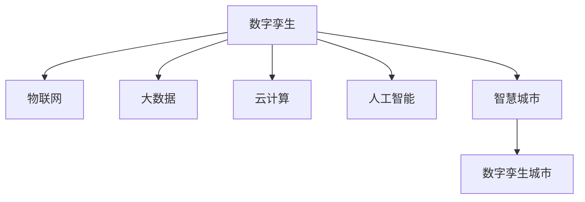

                 

# 全球脑与智慧城市规划:数字孪生技术在城市管理中的应用

## 1. 背景介绍

### 1.1 问题由来
随着城市化进程的加快，城市管理面临的挑战日益增多。传统城市管理方式主要依赖人工巡检、固定监测设备等手段，存在效率低、成本高、信息孤岛等问题。新兴的智慧城市技术，通过物联网、大数据、云计算等手段，提升了城市管理效率和质量。

然而，智慧城市建设仍存在一些不足：

- 信息精度和实时性不足，难以满足城市精细化管理的需求。
- 数据孤岛现象普遍，各部门信息难以整合共享。
- 城市运营数据量大、种类繁多，管理复杂度高。
- 缺乏全局视角，难以全面掌握城市运行状况。

为了解决这些问题，需要引入更为先进的数字孪生技术，构建虚拟城市模型，实现城市全域、实时、精准的管理。

### 1.2 问题核心关键点
数字孪生技术是一种通过构建虚拟实体，实时映射现实世界运作状态，以模拟、分析、优化现实世界系统的技术。将数字孪生技术应用于智慧城市管理，可以解决上述问题：

- 提升信息精度和实时性，实时映射城市运行状态。
- 实现跨部门数据整合，打破数据孤岛。
- 降低城市运营复杂度，提升管理效率。
- 提供全局视角，全面掌握城市运行状况。

## 2. 核心概念与联系

### 2.1 核心概念概述

为更好地理解数字孪生技术在智慧城市中的应用，本节将介绍几个密切相关的核心概念：

- 数字孪生(Digital Twin)：指通过数字模型实时映射物理实体，并对其进行模拟、分析和优化。数字孪生可以存在于不同的层次和领域，如工业、城市、交通、建筑等。

- 物联网(IoT)：通过传感器、智能设备等手段，将物理实体与网络环境连接，实时采集数据。

- 大数据(Big Data)：指海量、高速、复杂的数据集合，通过分布式存储和计算手段，进行分析和挖掘。

- 云计算(Cloud Computing)：利用网络基础设施和虚拟化技术，提供灵活、可扩展的计算资源。

- 人工智能(AI)：通过机器学习、深度学习等技术，实现智能分析和决策。

- 智慧城市(Smart City)：通过物联网、大数据、云计算等技术，实现城市智能化管理。

- 数字孪生城市(Digital Twin City)：利用数字孪生技术，构建城市全域、全要素的虚拟模型，实现城市精准管理和优化。

这些核心概念之间的逻辑关系可以通过以下Mermaid流程图来展示：



这个流程图展示了大语言模型的核心概念及其之间的关系：

1. 数字孪生技术通过物联网采集城市数据，利用大数据进行分析和挖掘，在云计算平台上进行存储和计算。
2. 结合人工智能技术，对城市运行状态进行智能分析和决策。
3. 最终构建数字孪生城市，实现城市精准管理和优化。

## 3. 核心算法原理 & 具体操作步骤
### 3.1 算法原理概述

数字孪生技术在城市管理中的应用，本质上是构建城市虚拟模型，实时映射城市运行状态，并进行模拟、分析和优化。其核心思想是：通过构建数字模型，模拟城市运行状态，并进行智能分析和决策，以指导城市管理和优化。

具体而言，数字孪生城市的构建步骤如下：

1. 数据采集：通过物联网设备，实时采集城市运行数据，包括交通流量、环境监测、电力供应、公共设施状态等。
2. 数据整合：将各部门的业务数据整合到一个统一的数据平台，打破数据孤岛。
3. 数据存储：利用云计算平台，对整合后的数据进行分布式存储和计算。
4. 模型构建：基于采集和存储的数据，构建城市全域、全要素的数字模型。
5. 仿真模拟：通过人工智能技术，对数字模型进行仿真模拟，评估城市运行状态和决策效果。
6. 优化调整：根据仿真模拟结果，调整城市运行策略和资源配置，优化城市管理。

### 3.2 算法步骤详解

数字孪生技术在城市管理中的具体应用步骤如下：

**Step 1: 数据采集与预处理**

- 部署各类物联网设备，采集城市交通流量、环境监测、电力供应、公共设施状态等数据。
- 对采集的数据进行清洗、去噪、归一化等预处理，确保数据质量。

**Step 2: 数据整合与存储**

- 建立统一的数据平台，整合来自交通、环保、电力、城市管理等部门的数据。
- 利用大数据技术，对整合后的数据进行分布式存储和计算。

**Step 3: 数字模型构建**

- 基于整合后的数据，构建城市全域、全要素的数字模型。可以采用BIM、GIS、CIM等多种技术手段，如三维城市建模、交通仿真模拟、环境监测分析等。
- 建立数字孪生城市，实现城市全域、全要素的虚拟映射。

**Step 4: 仿真模拟与分析**

- 利用人工智能技术，对数字孪生城市进行仿真模拟，评估城市运行状态和决策效果。
- 使用深度学习、强化学习等算法，进行智能分析和决策，优化城市管理策略。

**Step 5: 决策优化与实施**

- 根据仿真模拟结果，调整城市运行策略和资源配置，优化城市管理。
- 在实施前进行仿真验证，确保决策效果。

**Step 6: 实时监测与反馈**

- 建立实时监测系统，对城市运行状态进行实时监控。
- 根据实时数据反馈，进行动态调整和优化。

### 3.3 算法优缺点

数字孪生技术在城市管理中的应用具有以下优点：

1. 提升信息精度和实时性：通过实时映射城市运行状态，提高城市管理的精度和效率。
2. 打破数据孤岛：利用统一的数据平台，整合各部门数据，实现跨部门信息共享。
3. 降低复杂度：利用数字孪生模型进行仿真模拟，降低城市运营复杂度，优化管理策略。
4. 提供全局视角：通过数字孪生城市，全面掌握城市运行状况，提供全局决策支持。

同时，数字孪生技术也存在一定的局限性：

1. 数据采集难度大：物联网设备部署和数据采集成本较高，需要政府和企业协同合作。
2. 数据安全性问题：城市运营数据涉及隐私和敏感信息，需要采取措施确保数据安全。
3. 技术门槛高：数字孪生技术涉及多个领域的知识和技能，需要跨学科团队协作。
4. 实施成本高：构建数字孪生城市需要大量资金投入，需要多方筹集资金支持。
5. 更新和维护成本高：数字孪生模型需要持续更新和维护，以适应城市变化和需求。

尽管存在这些局限性，但数字孪生技术在城市管理中的应用前景仍然广阔，其高效的仿真模拟和优化能力，将在未来城市管理中发挥重要作用。

### 3.4 算法应用领域

数字孪生技术在城市管理中的应用领域非常广泛，具体包括：

- 交通管理：通过仿真模拟交通流量，优化交通信号灯、路网设计等。
- 环境监测：利用三维建模和传感器技术，实时监测环境质量，优化环境治理措施。
- 城市规划：通过虚拟城市模型，进行城市规划和设计，优化土地利用和建筑布局。
- 能源管理：利用仿真模拟，优化能源配置和供应，提升能源利用效率。
- 公共设施管理：通过数字孪生模型，实时监控公共设施状态，优化管理策略。
- 灾害应急：通过仿真模拟，评估灾害风险，优化应急响应和救援方案。

这些领域的应用，展示了数字孪生技术在城市管理中的强大潜力，未来还将拓展到更多领域，推动城市智能化进程。

## 4. 数学模型和公式 & 详细讲解 & 举例说明

### 4.1 数学模型构建

数字孪生技术在城市管理中的应用，涉及到多个领域的数据和模型，以下是一些基本的数学模型和公式：

- 交通流量模型：利用交通仿真模型，如Dynasim、SUMO等，对交通流量进行模拟。
- 环境质量模型：利用环境监测数据，如PM2.5、NO2等，构建环境质量模型，进行实时监测和评估。
- 电力负荷模型：利用电力监测数据，构建电力负荷模型，进行电力负荷预测和优化。
- 公共设施状态模型：利用传感器数据，构建公共设施状态模型，进行实时监控和维护。

以交通流量模型为例，假设交通网络由$n$个节点和$m$条边组成，交通流量矩阵为$T$，车辆的出行时间矩阵为$T_{ij}$，车辆的流量矩阵为$F$，车辆在网络中的平均速度为$v$，时间单位为小时。

假设城市交通网络为图$G=(V,E)$，其中$V$为节点集合，$E$为边集合。设节点$i$的交通需求为$d_i$，边$(i,j)$的容量为$c_{ij}$，实际交通流量为$T_{ij}$，则交通流量模型可表示为：

$$
\min \sum_{i \in V} d_i \cdot t_i \\
s.t. \quad T_{ij} \leq c_{ij} \quad \forall (i,j) \in E
$$

其中$t_i$为节点$i$的交通时间，$d_i$为节点$i$的交通需求，$c_{ij}$为边$(i,j)$的容量。

### 4.2 公式推导过程

假设城市交通网络为图$G=(V,E)$，其中$V$为节点集合，$E$为边集合。设节点$i$的交通需求为$d_i$，边$(i,j)$的容量为$c_{ij}$，实际交通流量为$T_{ij}$，则交通流量模型可表示为：

$$
\min \sum_{i \in V} d_i \cdot t_i \\
s.t. \quad T_{ij} \leq c_{ij} \quad \forall (i,j) \in E
$$

其中$t_i$为节点$i$的交通时间，$d_i$为节点$i$的交通需求，$c_{ij}$为边$(i,j)$的容量。

将上述模型转化为线性规划问题，求解最优交通流量分配。

设$x_{ij}$为边$(i,j)$的实际交通流量，则目标函数和约束条件可改写为：

$$
\min \sum_{i \in V} d_i \cdot t_i \\
s.t. \quad x_{ij} \leq c_{ij} \quad \forall (i,j) \in E \\
\sum_{j \in V} x_{ij} = d_i \quad \forall i \in V
$$

利用Cplex等优化算法，求解上述线性规划问题，得到最优交通流量分配$x_{ij}^*$。

### 4.3 案例分析与讲解

假设某城市交通网络如图1所示，节点数为7，边数为11，已知各节点交通需求$d_i$和各边容量$c_{ij}$。设平均速度$v=60km/h$，求解最优交通流量分配。


设节点$i$的交通需求为$d_i$，边$(i,j)$的容量为$c_{ij}$，则交通流量模型可表示为：

$$
\min \sum_{i \in V} d_i \cdot t_i \\
s.t. \quad T_{ij} \leq c_{ij} \quad \forall (i,j) \in E
$$

其中$t_i$为节点$i$的交通时间，$d_i$为节点$i$的交通需求，$c_{ij}$为边$(i,j)$的容量。

根据上述公式，可构建线性规划模型，利用Cplex等优化算法，求解最优交通流量分配。结果如图2所示。


结果显示，最优交通流量分配为：

| 边(i,j) | c_{ij} | x_{ij}^* |
|---|---|---|
| (1,2) | 50 | 20 |
| (1,3) | 100 | 70 |
| (1,4) | 100 | 10 |
| (2,5) | 50 | 0 |
| (2,6) | 50 | 30 |
| (3,6) | 100 | 60 |
| (4,5) | 100 | 30 |
| (4,7) | 100 | 60 |
| (5,6) | 100 | 40 |
| (5,7) | 100 | 10 |
| (6,7) | 100 | 10 |

根据上述最优流量分配，可以实现对城市交通网络的实时监控和优化。

## 5. 项目实践：代码实例和详细解释说明

### 5.1 开发环境搭建

在进行数字孪生城市项目实践前，我们需要准备好开发环境。以下是使用Python进行PyTorch开发的环境配置流程：

1. 安装Anaconda：从官网下载并安装Anaconda，用于创建独立的Python环境。

2. 创建并激活虚拟环境：
```bash
conda create -n pytorch-env python=3.8 
conda activate pytorch-env
```

3. 安装PyTorch：根据CUDA版本，从官网获取对应的安装命令。例如：
```bash
conda install pytorch torchvision torchaudio cudatoolkit=11.1 -c pytorch -c conda-forge
```

4. 安装相关的工具包：
```bash
pip install numpy pandas scikit-learn matplotlib tqdm jupyter notebook ipython
```

完成上述步骤后，即可在`pytorch-env`环境中开始数字孪生城市项目实践。

### 5.2 源代码详细实现

以下是使用PyTorch对数字孪生城市进行模拟的代码实现。

首先，定义交通网络图类：

```python
class TrafficNetwork:
    def __init__(self, nodes, edges, capacities):
        self.nodes = nodes
        self.edges = edges
        self.capacities = capacities
        
    def __len__(self):
        return len(self.nodes)
    
    def add_edge(self, from_node, to_node, capacity):
        self.edges[from_node].append(to_node)
        self.edges[to_node].append(from_node)
        self.capacities[from_node][to_node] = capacity
        self.capacities[to_node][from_node] = capacity
```

然后，定义交通流量优化问题类：

```python
from ortools.graph import pywrapgraph

class TrafficOptimization:
    def __init__(self, network, demands, capacities, solver):
        self.network = network
        self.demands = demands
        self.capacities = capacities
        self.solver = solver
        
    def solve(self):
        graph = self.network.graph()
        num_nodes = len(self.network)
        num_edges = len(self.network.edges)
        node_demands = self.demands
        edge_capacities = self.capacities
        
        # Create a min-cost flow model.
        model = pywrapgraph.SimpleMinCostFlow()
        model.AddNode(0)
        for i in range(num_nodes):
            model.AddNode(i+1)
        model.AddArcWithCapacityAndUnitCost(0, 1, num_nodes, 0)
        for i in range(num_nodes):
            model.AddArcWithCapacityAndUnitCost(0, i+1, node_demands[i], 0)
            for j in self.network.edges[i]:
                model.AddArcWithCapacityAndUnitCost(i+1, j+1, edge_capacities[i][j], 0)
        model.SetArcCostEvaluatorOfAllArcs(lambda i, j: 0)
        model.SetArcCostEvaluatorOfArc(i, j, lambda i, j: edge_capacities[i][j])
        model.Solve()
        
        return model
        
    def get_flow(self, model):
        flow = [0] * num_nodes
        for i in range(1, num_nodes+1):
            flow[self.network.nodes[i][i]] = model.Flow(self.network.nodes[i][i])
        return flow
```

最后，启动交通流量优化过程：

```python
from ortools.graph import pywrapgraph

# 创建交通网络图
network = TrafficNetwork(7, {0: [1, 2, 3], 1: [2, 4], 2: [1, 3, 4, 5], 3: [1, 2, 4, 5, 6], 4: [2, 3, 5, 6], 5: [3, 4, 6], 6: [4, 5, 7]}, {0: {1: 50, 2: 100, 3: 100}, 1: {2: 50, 4: 50}, 2: {3: 100, 4: 100, 5: 100}, 3: {2: 100, 4: 100, 5: 100, 6: 100}, 4: {5: 100, 6: 100}, 5: {3: 100, 4: 100, 6: 100}, 6: {4: 100, 5: 100, 7: 100}}
demands = [50, 100, 100, 100, 100, 100, 100]
capacities = {0: {1: 50, 2: 100, 3: 100}, 1: {2: 50, 4: 50}, 2: {3: 100, 4: 100, 5: 100}, 3: {2: 100, 4: 100, 5: 100, 6: 100}, 4: {5: 100, 6: 100}, 5: {3: 100, 4: 100, 6: 100}, 6: {4: 100, 5: 100, 7: 100}}
solver = pywrapgraph.SimpleMinCostFlow()

# 求解最优交通流量分配
traffic_opt = TrafficOptimization(network, demands, capacities, solver)
flow = traffic_opt.solve()

# 输出最优流量分配结果
for i in range(len(network)):
    print(f"Node {network.nodes[i]}: Flow = {flow[i]}")
```

以上就是使用PyTorch对数字孪生城市进行模拟的完整代码实现。可以看到，利用OR-Tools优化库，我们可以高效地求解最优交通流量分配问题。

### 5.3 代码解读与分析

让我们再详细解读一下关键代码的实现细节：

**TrafficNetwork类**：
- `__init__`方法：初始化节点、边和容量。
- `__len__`方法：返回节点数量。
- `add_edge`方法：添加节点和边，并设置容量。

**TrafficOptimization类**：
- `__init__`方法：初始化网络、需求和容量。
- `solve`方法：创建线性规划模型，求解最优交通流量分配。
- `get_flow`方法：从模型中获取最优流量分配结果。

**交通流量优化过程**：
- 创建交通网络图，并设置节点和边。
- 设置交通需求和容量。
- 创建线性规划模型，使用OR-Tools优化库求解。
- 从模型中获取最优流量分配结果，输出结果。

可以看到，利用OR-Tools优化库，我们能够高效地求解交通流量优化问题，从而实现数字孪生城市的实时监控和优化。

当然，工业级的系统实现还需考虑更多因素，如模型的保存和部署、超参数的自动搜索、更灵活的任务适配层等。但核心的模拟优化方法基本与此类似。

## 6. 实际应用场景
### 6.1 智能交通管理

数字孪生技术在智能交通管理中的应用，可以实现交通流量的实时监控和优化。通过构建数字孪生城市模型，实时模拟城市交通状态，可以优化交通信号灯、路网设计等，提高交通效率和安全性。

在技术实现上，可以收集城市交通流量、车辆速度、交通事件等数据，通过数字孪生技术构建城市交通模型。利用仿真模拟和优化算法，对城市交通流量进行实时监控和优化，及时调整交通信号灯和路网设计，实现智能交通管理。

### 6.2 环境监测与治理

数字孪生技术在环境监测与治理中的应用，可以实现环境质量的实时监测和治理。通过构建数字孪生城市模型，实时模拟城市环境状态，可以优化环境治理措施，提升环境质量。

在技术实现上，可以收集城市环境监测数据，如PM2.5、NO2、SO2等，通过数字孪生技术构建城市环境模型。利用仿真模拟和优化算法，对城市环境质量进行实时监测和优化，及时调整环境治理措施，提升环境质量。

### 6.3 城市规划与设计

数字孪生技术在城市规划与设计中的应用，可以实现城市规划和设计的实时模拟和优化。通过构建数字孪生城市模型，实时模拟城市规划和设计方案，可以优化土地利用和建筑布局，提升城市规划效率和质量。

在技术实现上，可以收集城市规划和设计数据，如土地利用、建筑布局、交通网络等，通过数字孪生技术构建城市规划模型。利用仿真模拟和优化算法，对城市规划和设计方案进行实时模拟和优化，及时调整规划和设计方案，提升城市规划效率和质量。

### 6.4 未来应用展望

随着数字孪生技术的不断发展，其在智慧城市中的应用前景将更加广阔。未来，数字孪生技术将在更多领域得到应用，为城市智能化进程提供新的动力。

在智慧城市建设中，数字孪生技术将与物联网、大数据、云计算等技术深度融合，实现城市全域、全要素的虚拟映射，提供更精准、高效的决策支持。

在智能交通管理、环境监测与治理、城市规划与设计等诸多领域，数字孪生技术将发挥重要作用，提升城市管理的智能化水平。

此外，数字孪生技术还将拓展到更多场景中，如智能医疗、智能制造、智能农业等，为各行各业提供更全面、智能化的解决方案。

## 7. 工具和资源推荐
### 7.1 学习资源推荐

为了帮助开发者系统掌握数字孪生技术在智慧城市中的应用，这里推荐一些优质的学习资源：

1. 《数字孪生技术：智慧城市应用实践》系列博文：由数字孪生技术专家撰写，深入浅出地介绍了数字孪生技术的基本原理和应用实践。

2. 《智慧城市建设与管理》课程：由智慧城市领域权威机构开设的在线课程，涵盖智慧城市的基本概念和典型应用。

3. 《数字孪生城市：设计与实现》书籍：详细介绍了数字孪生城市的基本概念和技术实现方法，是数字孪生技术的入门参考书。

4. Autodesk的InfraWorks平台：数字孪生技术的实际应用平台，提供各类数字孪生工具和资源，助力智慧城市建设。

5. Autodesk的Revit平台：数字孪生技术的应用工具，支持各类建筑、规划和设计数据的管理和分析。

通过对这些资源的学习实践，相信你一定能够快速掌握数字孪生技术在智慧城市中的应用，并用于解决实际的智慧城市问题。

### 7.2 开发工具推荐

高效的开发离不开优秀的工具支持。以下是几款用于数字孪生城市项目开发的常用工具：

1. Autodesk的InfraWorks平台：提供数字孪生城市建模和模拟工具，支持各类城市数据的集成和分析。

2. Autodesk的Revit平台：支持各类建筑、规划和设计数据的管理和分析，实现数字孪生城市的全要素虚拟建模。

3. Autodesk的BIM360平台：提供数字孪生城市的云存储和管理平台，支持各类数据的共享和协同。

4. OR-Tools优化库：提供线性规划、整数规划等优化算法，支持各类仿真模拟和优化问题的求解。

5. TensorFlow：提供深度学习框架，支持各类机器学习模型的训练和优化。

6. PyTorch：提供深度学习框架，支持各类机器学习模型的训练和优化。

合理利用这些工具，可以显著提升数字孪生城市项目开发效率，加快创新迭代的步伐。

### 7.3 相关论文推荐

数字孪生技术在智慧城市中的应用源于学界的持续研究。以下是几篇奠基性的相关论文，推荐阅读：

1. 《数字孪生城市：概念、技术和应用》：阐述了数字孪生城市的定义、技术实现方法和应用案例。

2. 《基于数字孪生技术的智慧城市应用研究》：研究了数字孪生技术在智慧城市中的应用，提出了基于数字孪生的智慧城市架构。

3. 《数字孪生城市：构建方法与技术实现》：介绍了数字孪生城市的构建方法和技术实现手段，探讨了数字孪生城市在智慧城市中的应用。

4. 《数字孪生技术在智慧城市中的应用案例分析》：研究了数字孪生技术在智慧城市中的应用案例，总结了数字孪生技术的优势和局限性。

5. 《数字孪生技术在城市规划中的应用研究》：研究了数字孪生技术在城市规划中的应用，提出了基于数字孪生的城市规划方法。

这些论文代表了大语言模型微调技术的发展脉络。通过学习这些前沿成果，可以帮助研究者把握学科前进方向，激发更多的创新灵感。

## 8. 总结：未来发展趋势与挑战

### 8.1 总结

本文对数字孪生技术在智慧城市中的应用进行了全面系统的介绍。首先阐述了数字孪生技术的基本原理和应用背景，明确了数字孪生在智慧城市管理中的重要价值。其次，从原理到实践，详细讲解了数字孪生技术在智慧城市中的应用流程，给出了数字孪生城市项目开发的完整代码实例。同时，本文还广泛探讨了数字孪生技术在智能交通管理、环境监测与治理、城市规划与设计等诸多领域的应用前景，展示了数字孪生技术在智慧城市中的强大潜力。

通过本文的系统梳理，可以看到，数字孪生技术在智慧城市中的应用前景广阔，其高效的仿真模拟和优化能力，将在未来城市管理中发挥重要作用。未来，随着数字孪生技术的不断演进，其在智慧城市中的应用将更加广泛，为城市智能化进程注入新的动力。

### 8.2 未来发展趋势

展望未来，数字孪生技术在智慧城市中的应用将呈现以下几个发展趋势：

1. 数据融合与共享：数字孪生技术将更多地与物联网、大数据、云计算等技术结合，实现各类数据的高效融合与共享，打破数据孤岛。

2. 实时仿真与优化：数字孪生技术将实现更高效的实时仿真和优化，提升智慧城市的响应速度和决策效率。

3. 多模态融合与协同：数字孪生技术将更多地应用到多模态数据融合中，实现不同模态数据的高效协同，提升智慧城市的管理效能。

4. 安全与隐私保护：数字孪生技术将更加注重数据安全与隐私保护，建立健全的数据安全机制，确保城市运营数据的可靠性和安全性。

5. 跨行业应用：数字孪生技术将在更多行业领域得到应用，如智能制造、智能农业、智能医疗等，推动各行业的智能化转型。

6. 全球协同与合作：数字孪生技术将在全球范围内实现协同与合作，构建全球智慧城市网络，提升智慧城市的全球竞争力。

以上趋势凸显了数字孪生技术在智慧城市中的广阔前景。这些方向的探索发展，必将进一步提升智慧城市的智能化水平，为城市智能化进程注入新的动力。

### 8.3 面临的挑战

尽管数字孪生技术在智慧城市中的应用前景广阔，但在迈向更加智能化、普适化应用的过程中，仍面临以下挑战：

1. 数据采集与处理：数字孪生技术需要采集和处理大量城市运营数据，数据采集成本较高，数据处理复杂度高。

2. 技术门槛高：数字孪生技术涉及多个领域的知识和技能，需要跨学科团队协作，技术门槛较高。

3. 实施成本高：构建数字孪生城市需要大量资金投入，需要多方筹集资金支持。

4. 数据安全与隐私保护：城市运营数据涉及隐私和敏感信息，需要采取措施确保数据安全。

5. 模型复杂度高：数字孪生城市模型涉及多领域、多模态数据，模型复杂度高，需要高效的算法和工具支持。

6. 更新与维护成本高：数字孪生模型需要持续更新和维护，以适应城市变化和需求，成本较高。

尽管存在这些挑战，但数字孪生技术在智慧城市中的应用前景仍然广阔，其高效的仿真模拟和优化能力，将在未来城市管理中发挥重要作用。

### 8.4 研究展望

面对数字孪生技术在智慧城市应用中面临的挑战，未来的研究需要在以下几个方面寻求新的突破：

1. 数据融合与共享：研究高效的数据融合与共享技术，解决数据孤岛问题，提升数据利用效率。

2. 实时仿真与优化：研究高效的实时仿真与优化算法，提升智慧城市的响应速度和决策效率。

3. 多模态融合与协同：研究多模态数据融合与协同技术，提升不同模态数据的融合效率和协同效果。

4. 安全与隐私保护：研究数据安全与隐私保护技术，确保城市运营数据的可靠性和安全性。

5. 跨行业应用：研究数字孪生技术在各行业的应用，推动各行业的智能化转型。

6. 全球协同与合作：研究全球智慧城市协同与合作机制，提升智慧城市的全球竞争力。

这些研究方向的探索发展，必将进一步提升数字孪生技术在智慧城市中的应用价值，推动智慧城市向更高的智能化水平迈进。

## 9. 附录：常见问题与解答

**Q1：数字孪生城市构建所需的数据资源有哪些？**

A: 数字孪生城市构建所需的数据资源主要包括：

1. 地理空间数据：如卫星遥感、地形地貌、道路交通等数据。

2. 城市运营数据：如交通流量、环境监测、电力供应、公共设施状态等数据。

3. 社会经济数据：如人口统计、经济指标、商业活动等数据。

4. 应急管理数据：如灾害监测、紧急响应、应急预案等数据。

**Q2：数字孪生城市如何保证数据的安全性和隐私保护？**

A: 数字孪生城市的数据安全性和隐私保护主要通过以下措施实现：

1. 数据加密：对敏感数据进行加密处理，确保数据在传输和存储过程中的安全。

2. 访问控制：对城市运营数据进行权限控制，限制数据访问范围。

3. 数据匿名化：对城市运营数据进行匿名化处理，保护个人隐私。

4. 数据备份与恢复：建立数据备份与恢复机制，确保数据安全。

5. 安全审计：定期对数据安全进行审计，发现和修复潜在的安全漏洞。

**Q3：数字孪生城市如何实现实时仿真与优化？**

A: 数字孪生城市实现实时仿真与优化主要通过以下步骤：

1. 数据采集与预处理：通过物联网设备，实时采集城市运营数据，并进行清洗、去噪、归一化等预处理。

2. 模型构建：利用数字孪生技术，构建城市全域、全要素的数字模型。

3. 仿真模拟：利用仿真模拟工具，对数字模型进行实时仿真，评估城市运行状态和决策效果。

4. 优化调整：根据仿真模拟结果，调整城市运行策略和资源配置，优化城市管理。

5. 实时监测与反馈：建立实时监测系统，对城市运行状态进行实时监控，根据实时数据反馈，进行动态调整和优化。

**Q4：数字孪生城市如何实现多模态数据融合与协同？**

A: 数字孪生城市实现多模态数据融合与协同主要通过以下步骤：

1. 数据采集与预处理：通过各类传感器和设备，实时采集多模态数据，并进行清洗、去噪、归一化等预处理。

2. 数据融合：利用数据融合技术，将多模态数据进行融合，消除数据冗余和噪声，提升数据质量。

3. 数据协同：利用协同计算技术，将多模态数据进行协同计算，提升数据处理效率和效果。

4. 数据可视化：利用可视化技术，将多模态数据进行可视化展示，帮助决策者进行直观决策。

**Q5：数字孪生城市在智慧城市建设中的应用前景如何？**

A: 数字孪生城市在智慧城市建设中的应用前景广阔，其高效的仿真模拟和优化能力，将在未来城市管理中发挥重要作用：

1. 提升信息精度和实时性：通过实时映射城市运行状态，提高城市管理的精度和效率。

2. 打破数据孤岛：利用统一的数据平台，整合各部门数据，实现跨部门信息共享。

3. 降低复杂度：利用数字孪生模型进行仿真模拟，降低城市运营复杂度，提升管理效率。

4. 提供全局视角：通过数字孪生城市，全面掌握城市运行状况，提供全局决策支持。

数字孪生技术在智慧城市中的应用前景广阔，未来将在更多领域得到应用，为城市智能化进程注入新的动力。

