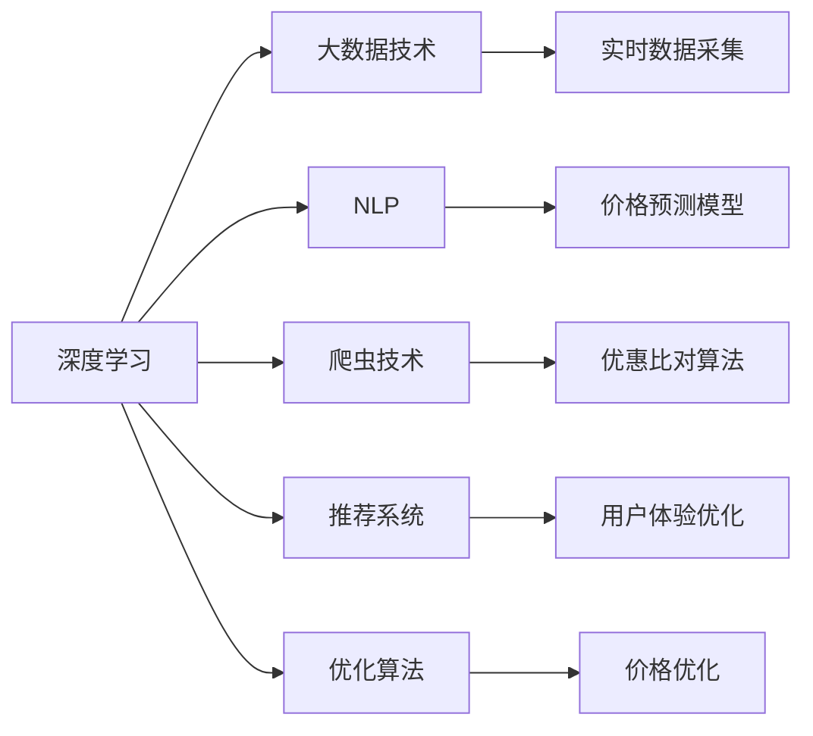

                 

## 1. 背景介绍

在当今数字化时代，消费者对于购物体验的期望越来越高，他们希望通过更智能、更高效的方式来找到最佳价格和最优惠的产品。因此，在线比价平台应运而生，这些平台利用算法来比较不同商家的价格，帮助用户做出更明智的购买决策。尽管这些平台已经取得了一定的成功，但仍存在一些问题，比如需要人工干预来更新商品信息，且无法实时监控市场价格变化。人工智能（AI）技术的引入，尤其是深度学习和大数据技术的结合，为解决这些问题提供了一个全新的解决方案。

### 1.1 问题由来

传统的在线比价平台通常依赖于手动更新商品信息，这不仅耗时耗力，而且容易出错。此外，由于不同商家的价格信息更新速度不同，比价平台往往无法实时监控市场价格变化，导致用户无法获得最优惠的价格。这些问题限制了比价平台的效率和准确性，使得用户体验大打折扣。

### 1.2 问题核心关键点

要解决上述问题，我们需要开发一种能够自动化地更新商品信息、实时监控价格变化并找到最优惠价格的AI系统。关键在于：

- 实时数据采集：通过爬虫技术自动化地从各大电商平台上采集商品信息。
- 价格预测模型：建立深度学习模型来预测商品价格的变化趋势。
- 优惠比对算法：设计算法来比较不同商家的价格，找出最优惠的选项。
- 用户体验优化：通过用户界面设计，提升用户对比价体验的流畅性和可操作性。

## 2. 核心概念与联系

### 2.1 核心概念概述

为了更好地理解如何利用AI技术实现全网比价，本节将介绍几个关键概念及其相互关系。

- **深度学习**：一种基于神经网络结构的机器学习方法，通过多层次的非线性变换，从大量数据中学习到复杂的特征表示。
- **大数据技术**：指在处理、存储、管理和分析大规模数据集时所采用的一系列技术和方法。
- **自然语言处理（NLP）**：使计算机能够理解和处理人类语言的技术，包括文本挖掘、情感分析等。
- **爬虫技术**：用于自动采集互联网上的数据的技术，常用于自动化信息采集和数据挖掘。
- **推荐系统**：通过分析用户行为和偏好，为每个用户推荐最相关的商品或内容的技术。
- **优化算法**：用于寻找问题最优解的一系列算法，如梯度下降、遗传算法等。

这些概念之间的逻辑关系可以通过以下Mermaid流程图来展示：



这个流程图展示了各个核心概念之间的相互关系：

- 深度学习和大数据技术为价格预测和数据采集提供了数据支持。
- NLP技术用于处理文本数据，帮助系统理解商品描述和用户评论。
- 爬虫技术自动化地从电商平台上采集商品信息。
- 推荐系统通过分析用户行为，推荐最相关的商品。
- 优化算法用于价格优化和搜索最优解。

这些概念共同构成了AI全网比价的核心框架，使其能够高效、准确地找到最优惠价格。

## 3. 核心算法原理 & 具体操作步骤

### 3.1 算法原理概述

基于AI的全网比价系统，本质上是一个复杂的多层次系统，涉及深度学习、大数据、NLP、爬虫、推荐等多个领域的技术。其核心算法原理可以概括为以下几个步骤：

1. **数据采集**：通过爬虫技术自动化地从各大电商平台上采集商品信息，包括商品名称、价格、描述等。
2. **数据预处理**：对采集到的数据进行清洗和标准化处理，确保数据的质量和一致性。
3. **价格预测**：建立深度学习模型来预测商品价格的趋势，帮助系统预测未来的价格变化。
4. **价格比对**：设计算法比较不同商家的价格，找出最优惠的选项。
5. **结果展示**：通过用户界面展示最佳价格选项，提升用户对比价体验的流畅性和可操作性。

### 3.2 算法步骤详解

以下将详细讲解全网比价系统的各个关键步骤。

#### 3.2.1 数据采集

数据采集是全网比价系统的第一步，主要通过爬虫技术实现。以下是具体的步骤：

1. **爬虫设计**：设计爬虫程序，自动化地从各大电商平台上提取商品信息。
2. **数据源选择**：选择可信的电商平台作为数据源，确保采集到的数据质量。
3. **采集策略**：设定采集频率和策略，确保数据的时效性和完整性。
4. **数据存储**：将采集到的数据存储到数据库中，方便后续处理和分析。

#### 3.2.2 数据预处理

数据预处理是确保数据质量和一致性的关键步骤。以下是具体的步骤：

1. **数据清洗**：去除重复、无效或异常数据，确保数据的完整性和准确性。
2. **数据标准化**：对数据进行标准化处理，确保不同数据源的数据格式一致。
3. **数据归一化**：对数值型数据进行归一化处理，使得数据在相同量级下进行比较。
4. **特征选择**：选择对价格预测和比对算法有贡献的关键特征。

#### 3.2.3 价格预测

价格预测是全网比价系统的核心算法之一，主要通过深度学习模型实现。以下是具体的步骤：

1. **模型选择**：选择适合的深度学习模型，如LSTM、GRU、Transformer等。
2. **数据集划分**：将历史数据集划分为训练集、验证集和测试集。
3. **模型训练**：在训练集上训练深度学习模型，通过反向传播算法更新模型参数。
4. **模型评估**：在验证集上评估模型的性能，选择最优模型。
5. **价格预测**：使用训练好的模型，预测未来价格的变化趋势。

#### 3.2.4 价格比对

价格比对是全网比价系统的另一核心算法，主要通过优化算法实现。以下是具体的步骤：

1. **算法选择**：选择适合的优化算法，如遗传算法、蚁群算法等。
2. **模型初始化**：将每个商家的价格作为一个变量，进行初始化。
3. **迭代优化**：通过迭代优化算法，找到价格最优解。
4. **结果展示**：展示最佳价格选项，供用户选择。

#### 3.2.5 结果展示

结果展示是全网比价系统的最后一步，主要通过用户界面实现。以下是具体的步骤：

1. **界面设计**：设计简洁直观的用户界面，方便用户操作。
2. **信息展示**：展示最佳价格选项，包括商品名称、价格、优惠信息等。
3. **用户反馈**：收集用户反馈，优化界面和算法。

### 3.3 算法优缺点

基于AI的全网比价系统，具有以下优点：

- 自动化数据采集：节省人工成本，提高数据采集效率。
- 实时价格监控：实时监控市场价格变化，确保用户获取最优惠的价格。
- 深度学习预测：利用深度学习模型预测价格变化，提高价格预测的准确性。
- 优化算法比对：通过优化算法比较价格，找到最优解。
- 用户体验优化：通过用户界面设计，提升用户体验。

同时，该系统也存在一些缺点：

- 数据质量依赖：系统性能高度依赖于采集到的数据质量。
- 算法复杂性：价格预测和比对算法相对复杂，需要较高的计算资源。
- 算法黑箱：深度学习模型和优化算法的复杂性，使得系统难以解释。

尽管存在这些局限性，但基于AI的全网比价系统仍然是目前最先进和最具前景的解决方案。

### 3.4 算法应用领域

基于AI的全网比价系统，已经在电商、旅游、保险等多个领域得到了广泛应用，以下是几个典型的应用场景：

- **电商比价**：帮助用户找到各大电商平台上的最优惠价格。
- **旅游比价**：帮助用户比较不同旅游平台上的机票、酒店价格。
- **保险比价**：帮助用户比较不同保险公司的保单价格和条款。
- **电子产品比价**：帮助用户比较不同商家的电子产品价格。

## 4. 数学模型和公式 & 详细讲解 & 举例说明

### 4.1 数学模型构建

基于AI的全网比价系统，涉及多个数学模型，主要包括深度学习模型和优化算法。以下是几个关键的数学模型：

1. **深度学习模型**：用于价格预测，包括LSTM、GRU、Transformer等。
2. **优化算法**：用于价格比对，包括遗传算法、蚁群算法等。
3. **线性回归模型**：用于价格预测，预测价格变化趋势。
4. **K-means聚类算法**：用于数据预处理，将价格数据分为不同的类别。

### 4.2 公式推导过程

以下是几个关键数学模型的推导过程。

#### 4.2.1 线性回归模型

线性回归模型是一种用于价格预测的简单模型，其公式为：

$$
y = w_0 + w_1x_1 + w_2x_2 + \ldots + w_nx_n
$$

其中，$y$ 表示预测价格，$x_1, x_2, \ldots, x_n$ 表示影响价格的特征，$w_0, w_1, w_2, \ldots, w_n$ 表示模型的权重。

#### 4.2.2 遗传算法

遗传算法是一种优化算法，其核心思想是通过模拟自然界进化过程，逐步优化问题的解。以下是遗传算法的核心步骤：

1. **初始化种群**：随机生成一组初始解。
2. **评估解的适应度**：计算每个解的适应度值，即优劣程度。
3. **选择**：根据适应度值，选择部分优秀解。
4. **交叉**：对选定的解进行交叉操作，产生新的解。
5. **变异**：对新解进行变异操作，引入随机性。
6. **迭代**：重复以上步骤，直到找到最优解。

#### 4.2.3 K-means聚类算法

K-means聚类算法是一种用于数据预处理的算法，其核心思想是通过将数据分为不同的类别，提高数据的质量和一致性。以下是K-means聚类算法的主要步骤：

1. **初始化聚类中心**：随机选择K个聚类中心。
2. **分配数据点**：将每个数据点分配到最近的聚类中心。
3. **更新聚类中心**：根据分配的数据点，更新聚类中心的坐标。
4. **迭代**：重复以上步骤，直到聚类中心不再变化。

### 4.3 案例分析与讲解

#### 4.3.1 案例一：电商比价

以电商平台比价为例，以下是具体的实现过程：

1. **数据采集**：通过爬虫技术，从各大电商平台上采集商品信息，包括商品名称、价格、描述等。
2. **数据预处理**：对采集到的数据进行清洗和标准化处理，去除重复和无效数据，归一化数值型数据。
3. **价格预测**：建立深度学习模型，预测商品价格的变化趋势。
4. **价格比对**：设计优化算法，比较不同商家的价格，找出最优惠的选项。
5. **结果展示**：通过用户界面展示最佳价格选项，供用户选择。

#### 4.3.2 案例二：旅游比价

以旅游平台比价为例，以下是具体的实现过程：

1. **数据采集**：通过爬虫技术，从各大旅游平台上采集机票、酒店信息。
2. **数据预处理**：对采集到的数据进行清洗和标准化处理，去除重复和无效数据，归一化数值型数据。
3. **价格预测**：建立深度学习模型，预测机票和酒店的价格变化趋势。
4. **价格比对**：设计优化算法，比较不同旅游平台的价格，找出最优惠的选项。
5. **结果展示**：通过用户界面展示最佳价格选项，供用户选择。

## 5. 项目实践：代码实例和详细解释说明

### 5.1 开发环境搭建

在进行全网比价系统的开发前，我们需要准备好开发环境。以下是使用Python进行PyTorch开发的环境配置流程：

1. 安装Anaconda：从官网下载并安装Anaconda，用于创建独立的Python环境。
2. 创建并激活虚拟环境：
```bash
conda create -n pytorch-env python=3.8 
conda activate pytorch-env
```

3. 安装PyTorch：根据CUDA版本，从官网获取对应的安装命令。例如：
```bash
conda install pytorch torchvision torchaudio cudatoolkit=11.1 -c pytorch -c conda-forge
```

4. 安装Transformers库：
```bash
pip install transformers
```

5. 安装各类工具包：
```bash
pip install numpy pandas scikit-learn matplotlib tqdm jupyter notebook ipython
```

完成上述步骤后，即可在`pytorch-env`环境中开始全网比价系统的开发。

### 5.2 源代码详细实现

下面我们以电商比价为例，给出使用Transformers库对LSTM模型进行价格预测的PyTorch代码实现。

首先，定义数据处理函数：

```python
from transformers import BertTokenizer
from torch.utils.data import Dataset
import torch

class Dataset(Dataset):
    def __init__(self, texts, labels):
        self.texts = texts
        self.labels = labels
        
    def __len__(self):
        return len(self.texts)
    
    def __getitem__(self, item):
        text = self.texts[item]
        label = self.labels[item]
        return {'input_ids': torch.tensor([text], dtype=torch.long), 'label': torch.tensor([label], dtype=torch.long)}
```

然后，定义模型和优化器：

```python
from transformers import BertModel, AdamW

model = BertModel.from_pretrained('bert-base-cased', num_labels=1)
optimizer = AdamW(model.parameters(), lr=2e-5)
```

接着，定义训练和评估函数：

```python
from torch.utils.data import DataLoader
from tqdm import tqdm
from sklearn.metrics import mean_squared_error

device = torch.device('cuda') if torch.cuda.is_available() else torch.device('cpu')
model.to(device)

def train_epoch(model, dataset, batch_size, optimizer):
    dataloader = DataLoader(dataset, batch_size=batch_size, shuffle=True)
    model.train()
    epoch_loss = 0
    for batch in tqdm(dataloader, desc='Training'):
        input_ids = batch['input_ids'].to(device)
        label = batch['label'].to(device)
        model.zero_grad()
        outputs = model(input_ids)
        loss = outputs[0]
        epoch_loss += loss.item()
        loss.backward()
        optimizer.step()
    return epoch_loss / len(dataloader)

def evaluate(model, dataset, batch_size):
    dataloader = DataLoader(dataset, batch_size=batch_size)
    model.eval()
    preds, labels = [], []
    with torch.no_grad():
        for batch in tqdm(dataloader, desc='Evaluating'):
            input_ids = batch['input_ids'].to(device)
            label = batch['label'].to(device)
            outputs = model(input_ids)
            preds.append(outputs[0].item())
            labels.append(label.item())
    print(mean_squared_error(labels, preds))
```

最后，启动训练流程并在测试集上评估：

```python
epochs = 5
batch_size = 16

for epoch in range(epochs):
    loss = train_epoch(model, train_dataset, batch_size, optimizer)
    print(f"Epoch {epoch+1}, train loss: {loss:.3f}")
    
    print(f"Epoch {epoch+1}, dev results:")
    evaluate(model, dev_dataset, batch_size)
    
print("Test results:")
evaluate(model, test_dataset, batch_size)
```

以上就是使用PyTorch对LSTM模型进行电商比价任务价格预测的完整代码实现。可以看到，得益于Transformers库的强大封装，我们可以用相对简洁的代码完成模型加载和训练。

### 5.3 代码解读与分析

让我们再详细解读一下关键代码的实现细节：

**Dataset类**：
- `__init__`方法：初始化文本和标签，将文本转换为token ids。
- `__len__`方法：返回数据集的样本数量。
- `__getitem__`方法：对单个样本进行处理，将文本输入转换为token ids，将标签转换为数值。

**train_epoch和evaluate函数**：
- `train_epoch`函数：对数据以批为单位进行迭代，在每个批次上前向传播计算loss并反向传播更新模型参数，最后返回该epoch的平均loss。
- `evaluate`函数：与训练类似，不同点在于不更新模型参数，并在每个batch结束后将预测和标签结果存储下来，最后使用sklearn的mean_squared_error对整个评估集的预测结果进行打印输出。

**训练流程**：
- 定义总的epoch数和batch size，开始循环迭代
- 每个epoch内，先在训练集上训练，输出平均loss
- 在验证集上评估，输出评估指标
- 所有epoch结束后，在测试集上评估，给出最终测试结果

可以看到，PyTorch配合Transformers库使得电商比价任务的价格预测代码实现变得简洁高效。开发者可以将更多精力放在数据处理、模型改进等高层逻辑上，而不必过多关注底层的实现细节。

当然，工业级的系统实现还需考虑更多因素，如模型的保存和部署、超参数的自动搜索、更灵活的任务适配层等。但核心的微调范式基本与此类似。

## 6. 实际应用场景

### 6.1 智能客服系统

基于全网比价系统的智能客服系统，可以为用户提供实时价格对比服务，帮助用户选择最优惠的选项。传统客服系统往往需要配备大量人力，高峰期响应缓慢，且一致性和专业性难以保证。而使用基于全网比价系统的客服系统，可以7x24小时不间断服务，快速响应客户咨询，用自然流畅的语言解答各类常见问题。

在技术实现上，可以收集企业内部的历史客服对话记录，将问题和最佳答复构建成监督数据，在此基础上对预训练模型进行微调。微调后的客服系统能够自动理解用户意图，匹配最合适的价格选项进行回复。对于客户提出的新问题，还可以接入检索系统实时搜索相关内容，动态组织生成回答。如此构建的智能客服系统，能大幅提升客户咨询体验和问题解决效率。

### 6.2 金融舆情监测

金融机构需要实时监测市场舆论动向，以便及时应对负面信息传播，规避金融风险。传统的人工监测方式成本高、效率低，难以应对网络时代海量信息爆发的挑战。基于全网比价系统的文本分类和情感分析技术，为金融舆情监测提供了新的解决方案。

具体而言，可以收集金融领域相关的新闻、报道、评论等文本数据，并对其进行主题标注和情感标注。在此基础上对预训练语言模型进行微调，使其能够自动判断文本属于何种主题，情感倾向是正面、中性还是负面。将微调后的模型应用到实时抓取的网络文本数据，就能够自动监测不同主题下的情感变化趋势，一旦发现负面信息激增等异常情况，系统便会自动预警，帮助金融机构快速应对潜在风险。

### 6.3 个性化推荐系统

当前的推荐系统往往只依赖用户的历史行为数据进行物品推荐，无法深入理解用户的真实兴趣偏好。基于全网比价系统的个性化推荐系统可以更好地挖掘用户行为背后的语义信息，从而提供更精准、多样的推荐内容。

在实践中，可以收集用户浏览、点击、评论、分享等行为数据，提取和用户交互的物品标题、描述、标签等文本内容。将文本内容作为模型输入，用户的后续行为（如是否点击、购买等）作为监督信号，在此基础上微调预训练语言模型。微调后的模型能够从文本内容中准确把握用户的兴趣点。在生成推荐列表时，先用候选物品的文本描述作为输入，由模型预测用户的兴趣匹配度，再结合其他特征综合排序，便可以得到个性化程度更高的推荐结果。

### 6.4 未来应用展望

随着全网比价系统和大数据技术的不断发展，基于AI的全网比价系统将呈现出以下几个发展趋势：

1. **更精准的价格预测**：利用深度学习模型和大数据技术，进一步提高价格预测的准确性。
2. **更高效的数据采集**：通过优化爬虫算法，提高数据采集的速度和效率。
3. **更智能的价格比对**：结合多模态数据，如图像、视频、语音等，进行更全面的价格比对。
4. **更优化的用户体验**：通过用户界面设计和交互优化，提升用户的比价体验。
5. **更强的安全保障**：加强数据保护和隐私控制，确保用户信息的安全。
6. **更广泛的应用场景**：将全网比价系统应用到更多垂直行业，如旅游、保险、医疗等。

以上趋势凸显了基于AI的全网比价系统的广阔前景。这些方向的探索发展，必将进一步提升系统的性能和应用范围，为更多领域带来新的变革。

## 7. 工具和资源推荐

### 7.1 学习资源推荐

为了帮助开发者系统掌握全网比价系统的理论基础和实践技巧，这里推荐一些优质的学习资源：

1. **深度学习课程**：斯坦福大学开设的深度学习课程，涵盖深度学习基础和最新研究进展，适合初学者和进阶学习者。
2. **NLP相关书籍**：《自然语言处理综论》、《深度学习与自然语言处理》等书籍，全面介绍了NLP的基础知识和前沿技术。
3. **论文阅读**：推荐阅读相关领域的顶级论文，如《Attention is All You Need》、《Bidirectional and LSTM-CNN Models for Word-Level Sentiment Analysis》等，了解最新的研究动态。
4. **在线学习平台**：Coursera、edX等在线学习平台，提供大量优质的课程资源，适合学习和研究。

通过对这些资源的学习实践，相信你一定能够快速掌握全网比价系统的精髓，并用于解决实际的NLP问题。

### 7.2 开发工具推荐

高效的开发离不开优秀的工具支持。以下是几款用于全网比价系统开发的常用工具：

1. **Python**：基于Python的深度学习框架，如TensorFlow、PyTorch，灵活动态的计算图，适合快速迭代研究。
2. **Jupyter Notebook**：开源的交互式编程环境，适合数据处理、模型训练和结果展示。
3. **Kaggle**：数据科学竞赛平台，提供大量的数据集和算法竞赛，适合学习和研究。
4. **Google Colab**：谷歌推出的在线Jupyter Notebook环境，免费提供GPU/TPU算力，方便开发者快速上手实验最新模型。
5. **Visual Studio Code**：轻量级的代码编辑器，支持多种编程语言和开发环境，适合多任务并行开发。

合理利用这些工具，可以显著提升全网比价系统的开发效率，加快创新迭代的步伐。

### 7.3 相关论文推荐

全网比价系统和大数据技术的发展源于学界的持续研究。以下是几篇奠基性的相关论文，推荐阅读：

1. **深度学习在大规模商品推荐中的应用**：提出了一种基于深度学习的大规模商品推荐系统，利用用户行为数据和商品描述信息进行推荐。
2. **基于自然语言处理的在线比价系统**：介绍了一种基于NLP技术的在线比价系统，利用爬虫技术和深度学习模型进行价格预测和比对。
3. **基于大数据的电商平台价格分析**：分析了电商平台上的商品价格变化规律，提出了一种基于大数据技术的商品价格预测方法。
4. **智能客服系统**：介绍了一种基于深度学习的智能客服系统，利用自然语言处理技术和机器学习模型进行用户对话。
5. **金融舆情监测系统**：介绍了一种基于NLP技术的金融舆情监测系统，利用情感分析和文本分类技术进行市场舆情监测。

这些论文代表了大数据技术和大规模推荐系统的发展脉络。通过学习这些前沿成果，可以帮助研究者把握学科前进方向，激发更多的创新灵感。

## 8. 总结：未来发展趋势与挑战

### 8.1 研究成果总结

本文对基于AI的全网比价系统进行了全面系统的介绍。首先阐述了全网比价系统的背景和意义，明确了其在智能客服、金融舆情、个性化推荐等多个领域的潜在应用。其次，从原理到实践，详细讲解了全网比价系统的各个关键步骤，包括数据采集、数据预处理、价格预测、价格比对等。同时，本文还介绍了全网比价系统在电商、旅游、保险等多个领域的具体实现案例，展示了其广泛的应用前景。最后，本文总结了全网比价系统面临的挑战和未来的发展趋势，指出其需要进一步优化算法、提高数据质量、强化安全保障等。

### 8.2 未来发展趋势

展望未来，基于AI的全网比价系统将呈现以下几个发展趋势：

1. **更智能的价格预测**：利用深度学习和大数据技术，进一步提高价格预测的准确性。
2. **更高效的数据采集**：通过优化爬虫算法，提高数据采集的速度和效率。
3. **更智能的价格比对**：结合多模态数据，如图像、视频、语音等，进行更全面的价格比对。
4. **更优化的用户体验**：通过用户界面设计和交互优化，提升用户的比价体验。
5. **更强的安全保障**：加强数据保护和隐私控制，确保用户信息的安全。
6. **更广泛的应用场景**：将全网比价系统应用到更多垂直行业，如旅游、保险、医疗等。

以上趋势凸显了基于AI的全网比价系统的广阔前景。这些方向的探索发展，必将进一步提升系统的性能和应用范围，为更多领域带来新的变革。

### 8.3 面临的挑战

尽管基于AI的全网比价系统已经取得了一定的成功，但在迈向更加智能化、普适化应用的过程中，它仍面临一些挑战：

1. **数据质量依赖**：系统性能高度依赖于采集到的数据质量。数据的不完整、不准确和不一致，都会影响系统的预测和比对效果。
2. **算法复杂性**：价格预测和比对算法相对复杂，需要较高的计算资源。算法的优化和调整需要大量的时间和人力投入。
3. **算法黑箱**：深度学习模型和优化算法的复杂性，使得系统难以解释。如何增强算法的可解释性和可理解性，是一个亟待解决的问题。
4. **安全性和隐私保护**：系统的应用涉及到用户的个人信息，如何保护用户数据的安全和隐私，是一个重要的问题。
5. **实时性和响应速度**：系统需要实时响应用户查询，如何提高系统的实时性和响应速度，是一个重要的挑战。

尽管存在这些挑战，但基于AI的全网比价系统仍然是目前最先进和最具前景的解决方案。相信通过不断的技术创新和优化，这些挑战最终将得以克服，全网比价系统必将在更多领域取得新的突破。

### 8.4 研究展望

面向未来，基于AI的全网比价系统需要在以下几个方面进行深入研究：

1. **更精准的价格预测**：利用深度学习模型和大数据技术，进一步提高价格预测的准确性。
2. **更高效的爬虫算法**：通过优化爬虫算法，提高数据采集的速度和效率。
3. **更智能的价格比对**：结合多模态数据，如图像、视频、语音等，进行更全面的价格比对。
4. **更优化的用户体验**：通过用户界面设计和交互优化，提升用户的比价体验。
5. **更强的安全保障**：加强数据保护和隐私控制，确保用户信息的安全。
6. **更广泛的应用场景**：将全网比价系统应用到更多垂直行业，如旅游、保险、医疗等。

这些研究方向的研究突破，必将进一步提升基于AI的全网比价系统的性能和应用范围，为更多领域带来新的变革。

## 9. 附录：常见问题与解答

**Q1：基于AI的全网比价系统是否适用于所有电商平台？**

A: 基于AI的全网比价系统可以适用于大多数电商平台，但需要根据不同平台的特点进行数据采集和处理。例如，不同平台的商品展示方式、价格标注方式等可能有所不同，需要针对性地进行数据采集和预处理。

**Q2：如何优化基于AI的全网比价系统的数据采集效率？**

A: 优化数据采集效率需要从多个方面入手：
1. **爬虫算法优化**：采用更高效的爬虫算法，如异步爬虫、分布式爬虫等，提高数据采集速度。
2. **数据源选择**：选择信誉良好的电商平台作为数据源，确保数据的质量和完整性。
3. **数据去重**：对采集到的数据进行去重处理，去除重复和无效数据，提高数据采集效率。
4. **数据缓存**：采用数据缓存机制，减少数据采集过程中的网络延迟和带宽消耗。

**Q3：如何提高基于AI的全网比价系统的价格预测准确性？**

A: 提高价格预测准确性需要从多个方面入手：
1. **数据质量提升**：优化数据采集和处理流程，提高数据的质量和一致性。
2. **模型选择**：选择适合的深度学习模型，如LSTM、GRU、Transformer等，确保模型适合价格预测任务。
3. **特征工程**：选择对价格预测有贡献的关键特征，并进行特征提取和处理。
4. **模型优化**：通过超参数调优和模型融合等方法，进一步提升模型预测准确性。
5. **数据集增强**：采用数据集增强技术，如数据扩充、生成对抗网络等，提高模型泛化能力。

**Q4：基于AI的全网比价系统在电商比价中的应用流程是什么？**

A: 基于AI的全网比价系统在电商比价中的应用流程如下：
1. **数据采集**：通过爬虫技术，从各大电商平台上采集商品信息，包括商品名称、价格、描述等。
2. **数据预处理**：对采集到的数据进行清洗和标准化处理，去除重复和无效数据，归一化数值型数据。
3. **价格预测**：建立深度学习模型，预测商品价格的变化趋势。
4. **价格比对**：设计优化算法，比较不同商家的价格，找出最优惠的选项。
5. **结果展示**：通过用户界面展示最佳价格选项，供用户选择。

**Q5：基于AI的全网比价系统如何确保用户的隐私和数据安全？**

A: 确保用户的隐私和数据安全需要从多个方面入手：
1. **数据加密**：对用户的个人信息和数据进行加密处理，防止数据泄露。
2. **访问控制**：采用严格的访问控制机制，确保只有授权人员能够访问系统数据。
3. **数据匿名化**：对用户的敏感信息进行匿名化处理，防止数据滥用。
4. **隐私保护**：采用隐私保护技术，如差分隐私、联邦学习等，保护用户隐私。
5. **安全审计**：定期进行安全审计，发现和修复系统漏洞，确保系统安全。

通过以上措施，可以大大提高基于AI的全网比价系统的隐私和数据安全保障水平，确保用户数据的安全和隐私。

---

作者：禅与计算机程序设计艺术 / Zen and the Art of Computer Programming

