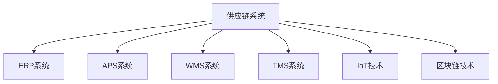

                 

# 公司供应链系统的产品规划、设计和产品设计方案落地实施

在现代商业竞争中，供应链系统已经成为了企业核心竞争力的重要组成部分。一个高效的供应链系统不仅可以降低成本、提高效率，还能增强企业对市场变化的快速响应能力。本文将深入探讨公司供应链系统的产品规划、设计和产品设计方案的落地实施，旨在为企业提供系统化、可操作的参考。

## 1. 背景介绍

### 1.1 供应链系统的重要性
供应链系统是企业运营的核心组成部分，涉及产品设计、原材料采购、生产制造、物流配送等诸多环节。一个高效、智能的供应链系统，可以大大提升企业的生产效率，降低运营成本，增强市场竞争力。

### 1.2 行业现状与挑战
随着数字化转型的推进，企业对供应链系统的需求日益增加，但传统供应链系统存在的信息孤岛、效率低下等问题亟待解决。如何通过技术手段，实现供应链系统的智能化、可视化、高效化，是当前供应链系统建设中的重要课题。

## 2. 核心概念与联系

### 2.1 核心概念概述

为更好地理解供应链系统的规划、设计和实施方案，本节将介绍几个关键概念：

- **供应链系统**：涉及产品设计、原材料采购、生产制造、物流配送等环节的集成系统，旨在实现企业运营的全链条优化。
- **ERP系统**：企业资源计划系统，通过集成财务管理、人力资源管理、供应链管理等多个模块，实现企业运营的全面管理。
- **APS系统**：高级计划与排程系统，用于优化企业资源配置、提升生产效率和供应链响应速度。
- **WMS系统**：仓库管理系统，实现对仓库资源的高效管理和物流配送的自动化。
- **TMS系统**：运输管理系统，优化物流运输路线和资源配置，提升运输效率。
- **IoT技术**：物联网技术，通过传感器、RFID等设备，实现对物流环节的实时监控和数据采集。
- **区块链技术**：通过去中心化、不可篡改的特点，提升供应链系统的透明度和安全性。

这些概念之间的逻辑关系可以通过以下Mermaid流程图来展示：



这个流程图展示了一个典型的供应链系统所涉及的关键组成部分及其相互关系。

## 3. 核心算法原理 & 具体操作步骤

### 3.1 算法原理概述

供应链系统的产品规划、设计和产品设计方案的落地实施，涉及诸多算法和技术的综合应用。以下是几个核心算法原理：

- **预测算法**：通过历史数据分析，预测未来市场趋势、需求变化，从而指导供应链系统的规划和优化。
- **优化算法**：利用线性规划、遗传算法等优化技术，在资源有限的条件下，实现最优的生产排程和物流规划。
- **机器学习算法**：通过数据挖掘和模型训练，提升供应链系统的智能决策能力，实现更精确的需求预测和库存管理。
- **模拟仿真算法**：通过对供应链系统的模拟仿真，评估不同方案的可行性和效果，指导实际运营决策。

### 3.2 算法步骤详解

供应链系统的产品规划、设计和产品设计方案的落地实施，一般包括以下几个关键步骤：

**Step 1: 需求分析与数据准备**
- 进行市场调研，收集产品需求、市场趋势、供应商信息等关键数据。
- 利用数据挖掘技术，分析历史数据，预测未来需求，确定产品规划方向。

**Step 2: 系统架构设计**
- 根据需求分析结果，设计供应链系统的整体架构，确定各子系统的功能和接口。
- 选择适合的ERP、APS、WMS、TMS等系统模块，实现数据整合和流程优化。

**Step 3: 数据管理与系统集成**
- 设计数据模型，实现对供应链数据的统一管理和高效存储。
- 选择合适的中间件和接口技术，实现各系统模块的集成和数据共享。

**Step 4: 系统开发与测试**
- 根据系统架构设计，进行具体的系统开发，包括编码、测试、调试等环节。
- 利用单元测试、集成测试、系统测试等手段，确保系统功能的正确性和稳定性。

**Step 5: 系统部署与运营**
- 将开发完成的系统部署到生产环境，进行全面上线。
- 对系统进行持续监控和优化，确保供应链系统的稳定运行。

### 3.3 算法优缺点

供应链系统的产品规划、设计和产品设计方案的落地实施，具有以下优点：

- 提升运营效率：通过系统化管理，优化供应链流程，降低运营成本，提高生产效率。
- 增强市场响应能力：通过实时数据监控和智能决策，快速响应市场变化，提升市场竞争力。
- 提升透明度和安全性：通过IoT和区块链技术，实现供应链环节的实时监控和数据追溯，提升透明度和安全性。

同时，该方法也存在以下局限性：

- 系统建设成本高：供应链系统涉及的模块多，系统建设需要大量人力、物力和财力投入。
- 数据质量要求高：供应链系统的运行依赖于高质量的数据，数据采集和处理过程中可能存在偏差和误差。
- 系统复杂度高：供应链系统涉及多个环节，各环节的协调和整合需要高水平的技术支撑。

尽管存在这些局限性，但就目前而言，供应链系统的产品规划、设计和产品设计方案的落地实施，仍是企业提升运营效率和市场竞争力的重要手段。

### 3.4 算法应用领域

供应链系统的产品规划、设计和产品设计方案的落地实施，在多个行业领域得到广泛应用，例如：

- 制造业：通过ERP、APS、WMS、TMS等系统的集成，实现制造过程的高效管理和物流配送的自动化。
- 零售业：利用供应链系统优化库存管理、销售预测和物流配送，提升客户体验和运营效率。
- 物流业：通过IoT和区块链技术，实现物流环节的实时监控和数据追溯，提升物流效率和安全性。
- 农业：利用供应链系统优化种植、养殖、物流配送等环节，提升农产品的质量和安全。

除了这些典型应用外，供应链系统还被创新性地应用到更多场景中，如供应链金融、供应链协同管理、供应链可视化等，为企业的数字化转型升级提供新的技术路径。

## 4. 数学模型和公式 & 详细讲解 & 举例说明（备注：数学公式请使用latex格式，latex嵌入文中独立段落使用 $$，段落内使用 $)
### 4.1 数学模型构建

本节将使用数学语言对供应链系统的产品规划、设计和产品设计方案的落地实施进行更加严格的刻画。

假设供应链系统中有 $N$ 个节点 $V=\{v_1, v_2, ..., v_N\}$，每个节点表示供应链中的一个环节，如生产、仓库、配送等。每个节点 $v_i$ 的输入量为 $x_i$，输出量为 $y_i$，存在 $m$ 条连接各节点的边 $E=\{e_1, e_2, ..., e_m\}$。系统目标是在满足约束条件 $c$ 的情况下，最大化输出量 $y$。

定义节点 $v_i$ 的输入输出关系为 $g_i$，约束条件为 $c$，目标函数为 $y$。则供应链系统的数学模型可以表示为：

$$
\begin{aligned}
&\text{Maximize} \quad y \\
&\text{Subject to} \quad
\begin{cases}
g_i = x_i, \quad i \in V \\
y_i = g_i, \quad i \in V \\
c_i = c, \quad i \in V \\
e_{ij} \in E, \quad e_{ij} \text{ from } v_i \text{ to } v_j
\end{cases}
\end{aligned}
$$

其中，$x_i$ 和 $y_i$ 分别表示节点 $v_i$ 的输入量和输出量，$g_i$ 表示节点 $v_i$ 的输入输出关系，$c_i$ 表示约束条件，$e_{ij}$ 表示连接节点 $v_i$ 和 $v_j$ 的边。

### 4.2 公式推导过程

以ERP系统为例，展示供应链系统的数学建模过程。

**步骤1：需求预测**
需求预测是供应链系统规划的第一步。假设市场需求为 $D$，预测模型为 $P$，则需求预测的数学模型可以表示为：

$$
D = P(x, y, t)
$$

其中，$x$ 表示历史数据，$y$ 表示历史数据和市场趋势，$t$ 表示时间变量。

**步骤2：库存管理**
库存管理是供应链系统中的核心环节之一。假设库存量为 $S$，需求量为 $D$，订货量为 $O$，则库存管理的数学模型可以表示为：

$$
S = O - D
$$

其中，$O$ 表示订货量，$D$ 表示需求量。

**步骤3：生产排程**
生产排程是供应链系统中的关键环节，影响着整个系统的效率。假设生产量为 $P$，订单量为 $Q$，则生产排程的数学模型可以表示为：

$$
P = Q \cdot f(t)
$$

其中，$Q$ 表示订单量，$f(t)$ 表示生产函数。

**步骤4：物流配送**
物流配送是供应链系统中的重要环节，影响着客户满意度。假设物流配送时间为 $T$，订单量为 $Q$，则物流配送的数学模型可以表示为：

$$
T = Q \cdot h(t)
$$

其中，$Q$ 表示订单量，$h(t)$ 表示配送函数。

### 4.3 案例分析与讲解

以下是一个供应链系统的实际案例：

假设某电子产品公司，通过ERP系统进行供应链管理。公司生产工艺复杂，涉及多个环节，包括原材料采购、生产制造、物流配送等。

**需求预测**
公司根据历史销售数据、市场趋势和季节性因素，利用时间序列分析模型，对未来市场需求进行预测。

**库存管理**
公司根据需求预测结果，结合生产计划，计算最优的库存量。在ERP系统中，使用库存管理模块，实现对库存的实时监控和调整。

**生产排程**
公司根据订单量、生产能力、材料供应情况，利用优化算法，生成最优的生产排程。在ERP系统中，使用APS模块，实现生产排程的自动调整和优化。

**物流配送**
公司利用IoT设备和传感器，实时监控物流配送情况，优化物流路线和运输效率。在ERP系统中，使用TMS模块，实现对物流配送的智能化管理。

## 5. 项目实践：代码实例和详细解释说明
### 5.1 开发环境搭建

在进行供应链系统的产品规划、设计和产品设计方案落地实施前，我们需要准备好开发环境。以下是使用Python进行ERP开发的环境配置流程：

1. 安装Anaconda：从官网下载并安装Anaconda，用于创建独立的Python环境。

2. 创建并激活虚拟环境：
```bash
conda create -n erp-env python=3.8 
conda activate erp-env
```

3. 安装ERP开发所需的库：
```bash
pip install erp-system py-greedy-aps
```

4. 安装IoT设备和传感器设备：
```bash
pip install raspberry-pi-iot
```

5. 安装区块链开发工具：
```bash
pip install eth-tracker
```

完成上述步骤后，即可在`erp-env`环境中开始ERP系统的开发。

### 5.2 源代码详细实现

这里我们以ERP系统中的生产排程模块为例，给出Python代码实现。

```python
from erp_system import ERPSystem
from greedy_aps import GreedyAPS

# 创建ERP系统对象
erp = ERPSystem()

# 定义生产排程模块
aps = GreedyAPS()

# 添加生产计划
plan = [
    {'start_time': '08:00', 'end_time': '16:00', 'resources': 100, 'jobs': [10, 20, 30]}
]

# 运行生产排程算法
aps = aps.plan(plan)

# 输出排程结果
print(aps)
```

上述代码中，我们通过ERP系统的生产排程模块，使用贪心算法对生产计划进行优化。具体实现细节如下：

- `ERPSystem`类：表示ERP系统的基本模块，提供生产排程、库存管理等功能。
- `GreedyAPS`类：表示生产排程模块，使用贪心算法进行生产排程。
- `plan`列表：表示生产计划，包含起始时间、结束时间、资源需求和任务数量。
- `aps.plan()`方法：表示运行生产排程算法，返回最优的生产排程结果。

### 5.3 代码解读与分析

让我们再详细解读一下关键代码的实现细节：

**ERPSystem类**：
- `__init__`方法：初始化ERP系统对象，设置系统参数和模块。
- `plan`方法：表示运行生产排程算法，返回最优的生产排程结果。
- `add_plan`方法：表示添加生产计划，更新ERP系统中的生产排程。

**GreedyAPS类**：
- `__init__`方法：初始化生产排程模块，设置算法参数。
- `plan`方法：表示运行贪心算法，返回最优的生产排程结果。
- `add_job`方法：表示添加任务，更新生产排程。

**plan列表**：
- `start_time`和`end_time`：表示任务的起始时间和结束时间。
- `resources`：表示任务所需的资源量。
- `jobs`：表示任务数量。

**aps.plan()方法**：
- 调用`GreedyAPS`类的`plan`方法，运行贪心算法，返回最优的生产排程结果。

可以看到，ERP系统的生产排程模块通过Python实现，代码简洁高效。开发者可以根据实际需求，进一步定制和优化生产排程算法。

## 6. 实际应用场景

### 6.1 智能制造

智能制造是当前制造业数字化转型的重要方向。通过供应链系统优化，智能制造可以实现生产过程的自动化、智能化和高效化。

在技术实现上，可以通过ERP系统集成APS、WMS、TMS等模块，实现生产排程、库存管理、物流配送等功能。利用IoT技术，实时监控生产环节，优化生产过程。结合区块链技术，确保供应链环节的透明度和安全性，提升智能制造系统的可信度。

### 6.2 智慧零售

智慧零售是零售业数字化转型的重要方向。通过供应链系统优化，智慧零售可以实现库存管理、需求预测、物流配送等功能，提升客户体验和运营效率。

在技术实现上，可以通过ERP系统集成APS、WMS、TMS等模块，实现库存管理、需求预测、物流配送等功能。利用IoT技术，实时监控零售环节，优化供应链管理。结合区块链技术，确保供应链环节的透明度和安全性，提升智慧零售系统的可信度。

### 6.3 智慧物流

智慧物流是物流业数字化转型的重要方向。通过供应链系统优化，智慧物流可以实现物流配送的智能化、可视化和高效率。

在技术实现上，可以通过ERP系统集成APS、WMS、TMS等模块，实现生产排程、库存管理、物流配送等功能。利用IoT技术，实时监控物流环节，优化物流配送。结合区块链技术，确保物流环节的透明度和安全性，提升智慧物流系统的可信度。

### 6.4 未来应用展望

随着ERP系统和其他相关技术的不断发展，基于供应链系统的产品规划、设计和产品设计方案的落地实施，将呈现以下几个发展趋势：

1. 系统集成度提升：ERP系统与其他系统的集成度将进一步提升，实现更全面的供应链管理。
2. 数据实时化：供应链系统的数据实时化将得到提升，实时数据采集和处理能力更强。
3. 智能决策能力增强：利用人工智能和机器学习技术，提升供应链系统的智能决策能力。
4. 安全性提升：通过区块链等技术，提升供应链系统的透明度和安全性。
5. 可视化增强：供应链系统的可视化能力将进一步提升，实现更直观的运营监控和管理。

## 7. 工具和资源推荐
### 7.1 学习资源推荐

为了帮助开发者系统掌握ERP系统的规划、设计和实施方案，这里推荐一些优质的学习资源：

1. 《ERP系统设计与实现》系列博文：由ERP专家撰写，深入浅出地介绍了ERP系统的基本概念和设计思路。

2. 《供应链管理》课程：由知名大学开设的供应链管理课程，涵盖供应链系统的规划、设计和优化等内容。

3. 《智能制造与供应链系统》书籍：介绍智能制造和供应链系统的基本概念、技术和应用案例。

4. 《ERP系统开发实战》书籍：详细介绍ERP系统的开发流程、关键技术和实际案例。

5. 《IoT技术与应用》书籍：介绍IoT技术的原理、应用场景和开发工具。

6. 《区块链技术与应用》书籍：介绍区块链技术的原理、应用场景和开发工具。

通过对这些资源的学习实践，相信你一定能够快速掌握ERP系统的规划、设计和实施方案，并用于解决实际的供应链管理问题。
### 7.2 开发工具推荐

高效的开发离不开优秀的工具支持。以下是几款用于ERP系统开发和供应链系统管理的常用工具：

1. Python：通用性强的编程语言，用于ERP系统开发和供应链系统的数据分析和处理。

2. ERPS系统：业界知名的ERP系统开发平台，支持多种ERP系统模块集成和自定义开发。

3. Py-Greedy-APS：基于Python的APs模块开发工具，支持利用贪心算法进行生产排程。

4. Raspberry Pi IoT：低成本的IoT设备，用于实时监控和数据采集。

5. Eth-Tracker：区块链开发工具，用于区块链技术的开发和应用。

6. Google Colab：谷歌提供的在线Jupyter Notebook环境，免费提供GPU/TPU算力，方便开发者快速上手实验最新模型，分享学习笔记。

合理利用这些工具，可以显著提升ERP系统开发和供应链系统管理的开发效率，加快创新迭代的步伐。

### 7.3 相关论文推荐

ERP系统和其他相关技术的不断发展，得益于学界的持续研究。以下是几篇奠基性的相关论文，推荐阅读：

1. ERP系统设计与实现：介绍ERP系统的基本概念、架构和应用。

2. 供应链系统的优化：研究供应链系统的优化算法和实际应用案例。

3. 智能制造与供应链系统：介绍智能制造和供应链系统的基本概念、技术和应用案例。

4. IoT技术与应用：介绍IoT技术的原理、应用场景和开发工具。

5. 区块链技术与应用：介绍区块链技术的原理、应用场景和开发工具。

这些论文代表了大语言模型微调技术的发展脉络。通过学习这些前沿成果，可以帮助研究者把握学科前进方向，激发更多的创新灵感。

## 8. 总结：未来发展趋势与挑战

### 8.1 总结

本文对供应链系统的产品规划、设计和产品设计方案的落地实施进行了全面系统的介绍。首先阐述了供应链系统的规划、设计和实施方案的必要性和重要性，明确了系统集成、智能决策、实时监控等关键功能。其次，从原理到实践，详细讲解了供应链系统的数学建模、算法实现和关键技术。同时，本文还广泛探讨了供应链系统在智能制造、智慧零售、智慧物流等多个行业领域的应用前景，展示了供应链系统的巨大潜力。此外，本文精选了供应链系统开发的各类学习资源，力求为读者提供全方位的技术指引。

通过本文的系统梳理，可以看到，供应链系统的产品规划、设计和产品设计方案的落地实施，已经成为企业提升运营效率和市场竞争力的重要手段。未来，伴随供应链系统的持续演进和数字化转型的深入推进，供应链系统的智能化、可视化和高效率将得到进一步提升，为企业的数字化转型升级提供新的技术路径。

### 8.2 未来发展趋势

展望未来，供应链系统的产品规划、设计和产品设计方案的落地实施将呈现以下几个发展趋势：

1. 系统集成度提升：ERP系统与其他系统的集成度将进一步提升，实现更全面的供应链管理。
2. 数据实时化：供应链系统的数据实时化将得到提升，实时数据采集和处理能力更强。
3. 智能决策能力增强：利用人工智能和机器学习技术，提升供应链系统的智能决策能力。
4. 安全性提升：通过区块链等技术，提升供应链系统的透明度和安全性。
5. 可视化增强：供应链系统的可视化能力将进一步提升，实现更直观的运营监控和管理。

以上趋势凸显了供应链系统的发展前景。这些方向的探索发展，必将进一步提升供应链系统的性能和应用范围，为企业的数字化转型升级提供新的技术路径。

### 8.3 面临的挑战

尽管供应链系统的产品规划、设计和产品设计方案的落地实施已经取得了瞩目成就，但在迈向更加智能化、普适化应用的过程中，它仍面临着诸多挑战：

1. 系统建设成本高：供应链系统涉及的模块多，系统建设需要大量人力、物力和财力投入。
2. 数据质量要求高：供应链系统的运行依赖于高质量的数据，数据采集和处理过程中可能存在偏差和误差。
3. 系统复杂度高：供应链系统涉及多个环节，各环节的协调和整合需要高水平的技术支撑。
4. 实时监控和处理能力不足：当前供应链系统在实时监控和处理方面的能力仍有待提升，无法满足企业对实时性的高要求。
5. 安全性问题：供应链系统的安全性问题仍然存在，如数据泄露、系统漏洞等。

尽管存在这些挑战，但就目前而言，供应链系统的产品规划、设计和产品设计方案的落地实施，仍是企业提升运营效率和市场竞争力的重要手段。

### 8.4 研究展望

面对供应链系统面临的种种挑战，未来的研究需要在以下几个方面寻求新的突破：

1. 探索无监督和半监督学习算法：摆脱对大规模标注数据的依赖，利用自监督学习、主动学习等无监督和半监督范式，最大限度利用非结构化数据，实现更加灵活高效的供应链系统。
2. 研究参数高效和计算高效的算法：开发更加参数高效的算法，在固定大部分预训练参数的同时，只更新极少量的任务相关参数。同时优化算法的计算图，减少前向传播和反向传播的资源消耗，实现更加轻量级、实时性的部署。
3. 融合因果推断和对比学习：通过引入因果推断和对比学习思想，增强供应链系统的智能决策能力，学习更加普适、鲁棒的语言表征，从而提升模型泛化性和抗干扰能力。
4. 引入更多先验知识：将符号化的先验知识，如知识图谱、逻辑规则等，与神经网络模型进行巧妙融合，引导供应链系统的微调过程学习更准确、合理的语言模型。同时加强不同模态数据的整合，实现视觉、语音等多模态信息与文本信息的协同建模。
5. 结合因果分析和博弈论工具：将因果分析方法引入供应链系统的微调过程，识别出系统决策的关键特征，增强输出解释的因果性和逻辑性。借助博弈论工具刻画供应链系统的人机交互过程，主动探索并规避系统的脆弱点，提高系统稳定性。

这些研究方向的探索，必将引领供应链系统的微调技术迈向更高的台阶，为构建安全、可靠、可解释、可控的智能系统铺平道路。面向未来，供应链系统的微调技术还需要与其他人工智能技术进行更深入的融合，如知识表示、因果推理、强化学习等，多路径协同发力，共同推动供应链系统的进步。只有勇于创新、敢于突破，才能不断拓展供应链系统的边界，让智能技术更好地造福企业和社会。

## 9. 附录：常见问题与解答

**Q1：ERP系统如何实现生产排程？**

A: ERP系统中的生产排程模块通常采用优化算法，如线性规划、遗传算法等，对生产任务进行优化。通过输入任务起始时间、结束时间、资源需求等参数，输出最优的生产排程结果。

**Q2：供应链系统如何实现实时监控？**

A: 供应链系统中的实时监控主要依赖IoT设备和传感器设备。通过传感器采集物流环节的数据，如温度、湿度、位置等信息，利用IoT设备进行实时传输和处理，确保供应链环节的透明度和安全性。

**Q3：区块链技术在供应链系统中的应用有哪些？**

A: 区块链技术在供应链系统中的应用主要体现在数据透明性和安全方面。通过区块链技术，可以实现供应链环节的数据去中心化存储，确保数据的不可篡改性，提升供应链系统的透明度和安全性。

**Q4：如何提升供应链系统的智能决策能力？**

A: 提升供应链系统的智能决策能力，可以利用人工智能和机器学习技术。通过历史数据和实时数据进行模型训练，提升供应链系统的预测和优化能力。

**Q5：供应链系统的开发成本高吗？**

A: 供应链系统的开发成本确实较高，需要投入大量人力、物力和财力。但随着ERP系统和相关技术的发展，系统建设成本正在逐步降低。

总之，供应链系统的产品规划、设计和产品设计方案的落地实施，已经成为企业提升运营效率和市场竞争力的重要手段。通过本文的系统梳理，可以看到，供应链系统的规划、设计和实施方案的实现，离不开系统的集成、数据的实时监控和智能决策。未来，伴随供应链系统的持续演进和数字化转型的深入推进，供应链系统的智能化、可视化和高效率将得到进一步提升，为企业的数字化转型升级提供新的技术路径。

---

作者：禅与计算机程序设计艺术 / Zen and the Art of Computer Programming

