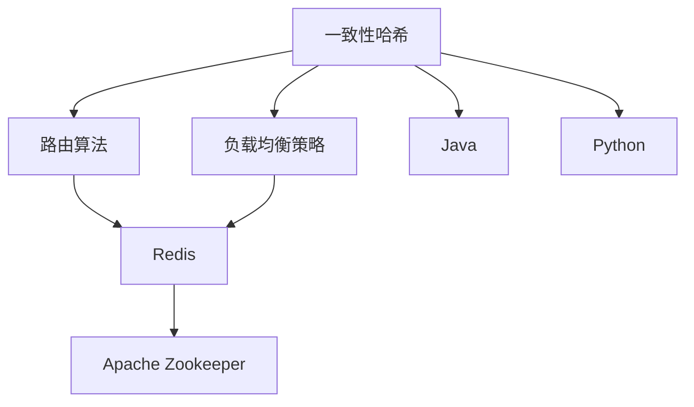

                 

# 分布式搜索 原理与代码实例讲解

> 关键词：分布式搜索,分布式算法,一致性哈希,路由算法,负载均衡,Redis,Apache Zookeeper,Java,Python,分布式系统

## 1. 背景介绍

### 1.1 问题由来
在计算机网络中，分布式搜索是一个非常基础且广泛使用的功能，比如搜索引擎、分布式缓存系统、分布式数据库系统、消息系统等。分布式搜索可以大幅提高系统的可扩展性、容错性和性能。然而，在分布式系统中，节点数量可能非常庞大，如何高效、可靠地进行搜索和路由，成为分布式系统设计中的一个重要挑战。

### 1.2 问题核心关键点
分布式搜索的核心问题在于如何快速高效地定位和查询数据。分布式系统通常采用主从结构、多主结构或无中心的点对点结构。数据通常以键值对(key-value)的形式存储在多个节点中，如何快速定位和查询数据成为核心问题。

解决分布式搜索的问题，关键在于以下几点：
- 一致性哈希算法：用于实现数据在节点之间的负载均衡和快速定位。
- 路由算法：用于确定数据的存储位置和查询路径。
- 负载均衡策略：用于优化查询效率和系统性能。
- 分布式事务和一致性协议：用于保证数据一致性和系统可靠性。
- 数据同步和分布式缓存技术：用于保证数据一致性和系统的性能。

## 2. 核心概念与联系

### 2.1 核心概念概述

为更好地理解分布式搜索，本节将介绍几个密切相关的核心概念：

- 一致性哈希（Consistent Hashing）：一种将请求映射到节点上的哈希算法，用于实现数据的负载均衡和快速定位。
- 路由算法（Routing Algorithm）：一种用于确定数据存储位置和查询路径的算法，常见有基于键的路由和基于时间的路由等。
- 负载均衡策略（Load Balancing Strategy）：一种优化查询效率和系统性能的策略，常见有基于轮询的负载均衡、基于加权负载均衡等。
- Redis：一个高性能、分布式、内存数据存储系统，常用于分布式缓存和消息队列。
- Apache Zookeeper：一个用于分布式系统协调和配置管理的框架，用于分布式系统中的节点管理和数据一致性维护。
- Java与Python：常用的分布式系统开发语言，两者都可以用于实现分布式搜索和路由算法。

这些核心概念之间的逻辑关系可以通过以下Mermaid流程图来展示：



这个流程图展示了一致性哈希、路由算法、负载均衡策略与Redis、Apache Zookeeper、Java、Python之间的关系：

1. 一致性哈希算法用于实现数据的负载均衡和快速定位。
2. 路由算法用于确定数据的存储位置和查询路径。
3. 负载均衡策略用于优化查询效率和系统性能。
4. Redis与Apache Zookeeper用于支持分布式系统的数据存储和协调管理。
5. Java与Python是常用的分布式系统开发语言。

这些概念共同构成了分布式搜索的核心技术框架，使得数据在分布式系统中能够高效地存储、定位和查询。通过理解这些核心概念，我们可以更好地把握分布式搜索的工作原理和优化方向。

## 3. 核心算法原理 & 具体操作步骤
### 3.1 算法原理概述

分布式搜索的核心算法是一致性哈希算法，其原理是将数据分布到多个节点上，使得每个节点上的数据量大致相等。当数据存储节点增多时，一致性哈希算法能够动态地将数据重新分配，保证数据分布均衡，同时可以快速定位数据。

一致性哈希算法基于哈希函数将数据映射到虚拟环形空间，然后将数据存储到虚拟环上，相邻的虚拟节点存储的数据相同，形成一个圆环。当需要定位数据时，只需将查询哈希值映射到环上，根据查询值在环上的位置，找到最近的节点，即可查询到数据。

### 3.2 算法步骤详解

一致性哈希算法包括以下几个关键步骤：

**Step 1: 数据哈希映射**
- 将数据映射到哈希环上，使得数据的位置固定。

**Step 2: 虚拟节点分配**
- 将虚拟节点分配到多个物理节点上，使得数据在物理节点之间均匀分布。

**Step 3: 数据查询**
- 将查询哈希值映射到哈希环上，找到最接近查询值的虚拟节点，即可定位到存储数据的具体物理节点。

### 3.3 算法优缺点

一致性哈希算法具有以下优点：
1. 数据分布均衡：通过哈希函数将数据均匀分布在虚拟节点上，避免了节点间数据不均衡的问题。
2. 动态负载均衡：当节点数量变化时，可以动态地调整虚拟节点，保证数据分布均衡。
3. 查询效率高：通过一致性哈希算法可以快速定位数据，提高了系统的查询效率。

同时，该算法也存在以下缺点：
1. 节点故障处理复杂：当节点故障时，需要重新分配节点和虚拟节点，增加了系统复杂性。
2. 节点更新耗时：当节点数增加或减少时，需要重新计算哈希值，消耗时间较长。
3. 数据分布不均匀：在节点数较少时，可能出现数据分布不均的情况。

### 3.4 算法应用领域

一致性哈希算法广泛应用于分布式缓存系统、分布式数据库系统、消息系统等。例如：

- Redis：使用一致性哈希算法实现键值对数据的分布式存储和快速查询。
- Apache Zookeeper：使用一致性哈希算法实现分布式系统的节点管理和数据一致性维护。
- Apache Kafka：使用一致性哈希算法实现消息队列的分区和数据复制。
- TiDB：使用一致性哈希算法实现分布式数据库的分区和数据一致性维护。

## 4. 数学模型和公式 & 详细讲解  
### 4.1 数学模型构建

一致性哈希算法通过哈希函数将数据映射到虚拟环上，并将虚拟节点分配到物理节点上。假设哈希函数为$h$，节点数为$n$，则数据$x$的哈希值为$h(x)$。虚拟环上的节点编号为$1,2,...,n$。

假设数据$x$的哈希值为$h(x)$，则其在哈希环上的位置为：

$$
pos = h(x) \mod n
$$

其中，$mod$表示取模运算。

将数据$x$存储在哈希环上的位置为$pos$的节点上。当需要查询数据$x$时，计算查询$y$的哈希值$h(y)$，在哈希环上找到最接近$h(y)$的位置，即为数据$x$的存储位置。

### 4.2 公式推导过程

假设节点数为$n=4$，哈希环上均匀分布$n$个虚拟节点。

对于数据$x_1$，其哈希值为$h(x_1)=11$，则其在哈希环上的位置为：

$$
pos_1 = 11 \mod 4 = 3
$$

将数据$x_1$存储在节点3上。

对于数据$x_2$，其哈希值为$h(x_2)=15$，则其在哈希环上的位置为：

$$
pos_2 = 15 \mod 4 = 3
$$

由于节点3已经存储了数据$x_1$，因此需要考虑负载均衡策略。例如，可以采用一致性哈希算法中的“插入位置”策略，将数据$x_2$插入到与节点3相邻的节点2上。

当需要查询数据$x_1$时，计算查询$y_1$的哈希值$h(y_1)=13$，在哈希环上找到最接近$h(y_1)$的位置，即为数据$x_1$的存储位置。

### 4.3 案例分析与讲解

假设在一个分布式缓存系统中，存储了100个键值对数据。节点数量为4，每个节点存储25个数据。使用一致性哈希算法将数据分配到节点上。

对于数据$x_1$，其哈希值为$h(x_1)=11$，则其在哈希环上的位置为：

$$
pos_1 = 11 \mod 4 = 3
$$

将数据$x_1$存储在节点3上。

对于数据$x_2$，其哈希值为$h(x_2)=15$，则其在哈希环上的位置为：

$$
pos_2 = 15 \mod 4 = 3
$$

由于节点3已经存储了数据$x_1$，因此将数据$x_2$存储在节点2上。

假设节点3故障，需要重新分配节点3的数据到其他节点上。此时可以采用“一致性哈希算法”中的“重新定位”策略，将节点3上的数据重新分配到节点4上。

## 5. 项目实践：代码实例和详细解释说明
### 5.1 开发环境搭建

在进行分布式搜索实践前，我们需要准备好开发环境。以下是使用Python和Java进行分布式搜索开发的常见环境配置流程：

1. 安装JDK：
```bash
sudo apt-get install openjdk-11-jdk
```

2. 安装Maven：
```bash
wget https://archive.apache.org/dist/maven/maven-3/3.8.1/binaries/apache-maven-3.8.1-bin.tar.gz
tar -xvf apache-maven-3.8.1-bin.tar.gz
sudo mv apache-maven-3.8.1 /usr/local/maven
echo 'export MAVEN_HOME=/usr/local/maven' >> ~/.bashrc
source ~/.bashrc
```

3. 安装Redis：
```bash
sudo apt-get install redis-server
```

4. 安装Zookeeper：
```bash
sudo apt-get install zookeeper-server
```

5. 安装Python环境：
```bash
sudo apt-get install python3
sudo apt-get install pip3
```

6. 安装第三方库：
```bash
pip3 install redis
pip3 install pycassa
```

完成上述步骤后，即可在开发环境中开始分布式搜索的实践。

### 5.2 源代码详细实现

这里我们以Redis中使用一致性哈希算法实现分布式缓存为例，给出Java和Python的代码实现。

#### 5.2.1 Java实现

```java
import java.util.ArrayList;
import java.util.HashMap;
import java.util.List;
import java.util.Map;

public class ConsistentHash {
    private static final int VIRTUAL_NODES = 2;
    private static final int VIRTUAL_NODES_RANGE = 128;

    public static Map<String, String> getReplica(String key, List<String> nodes) {
        Map<String, String> replicas = new HashMap<>();
        for (String node : nodes) {
            for (int i = 0; i < VIRTUAL_NODES; i++) {
                int hash = consistentHash(key + ":" + i, VIRTUAL_NODES_RANGE);
                String replica = findReplica(hash, replicas);
                replicas.put(key, replica);
            }
        }
        return replicas;
    }

    private static int consistentHash(String key, int virtualNodesRange) {
        return Math.abs(key.hashCode() % virtualNodesRange);
    }

    private static String findReplica(int hash, Map<String, String> replicas) {
        String bestReplica = replicas.keySet().iterator().next();
        while (hash < consistentHash(bestReplica, VIRTUAL_NODES_RANGE)) {
            String replica = nextReplica(bestReplica, replicas);
            bestReplica = replica;
        }
        return bestReplica;
    }

    private static String nextReplica(String currentReplica, Map<String, String> replicas) {
        String nextReplica = replicas.get(currentReplica);
        currentReplica = nextReplica;
        if (!currentReplica.equals(nextReplica)) {
            return nextReplica;
        }
        List<String> nodes = new ArrayList<>(replicas.keySet());
        for (int i = 0; i < nodes.size(); i++) {
            String replica = nodes.get(i);
            nextReplica = replicas.get(replica);
            if (!replica.equals(nextReplica)) {
                return nextReplica;
            }
        }
        return replicas.get(nodes.get(0));
    }

    public static void main(String[] args) {
        List<String> nodes = new ArrayList<>();
        nodes.add("node1");
        nodes.add("node2");
        nodes.add("node3");
        nodes.add("node4");
        String key = "key";
        Map<String, String> replicas = getReplica(key, nodes);
        for (Map.Entry<String, String> entry : replicas.entrySet()) {
            System.out.println(entry.getKey() + " -> " + entry.getValue());
        }
    }
}
```

#### 5.2.2 Python实现

```python
import hashlib

class ConsistentHash:
    VIRTUAL_NODES = 2
    VIRTUAL_NODES_RANGE = 128

    @staticmethod
    def consistent_hash(key, virtual_nodes_range):
        return int(hashlib.md5(key.encode('utf-8')).hexdigest(), 16) % virtual_nodes_range

    @staticmethod
    def find_replica(hash, replicas):
        best_replica = list(replicas.keys())[0]
        while hash < ConsistentHash.consistent_hash(best_replica, ConsistentHash.VIRTUAL_NODES_RANGE):
            next_replica = next(replicas.values())
            best_replica = next_replica
        return best_replica

    @staticmethod
    def next_replica(current_replica, replicas):
        next_replica = replicas[current_replica]
        current_replica = next_replica
        if current_replica != next_replica:
            return next_replica
        nodes = list(replicas.keys())
        for i in range(len(nodes)):
            next_replica = nodes[i]
            next_replica = replicas[next_replica]
            if current_replica != next_replica:
                return next_replica
        return replicas[nodes[0]]

    @staticmethod
    def get_replica(key, nodes):
        replicas = {}
        for node in nodes:
            for i in range(ConsistentHash.VIRTUAL_NODES):
                hash = ConsistentHash.consistent_hash(key + ":" + str(i), ConsistentHash.VIRTUAL_NODES_RANGE)
                replica = ConsistentHash.find_replica(hash, replicas)
                replicas[key] = replica
        return replicas

if __name__ == '__main__':
    nodes = ['node1', 'node2', 'node3', 'node4']
    key = 'key'
    replicas = ConsistentHash.get_replica(key, nodes)
    for k, v in replicas.items():
        print(k + ' -> ' + v)
```

### 5.3 代码解读与分析

让我们再详细解读一下关键代码的实现细节：

#### Java实现
**ConsistentHash类**：
- 定义了哈希函数、虚拟节点数以及虚拟节点范围。
- 实现了`consistentHash`函数，将数据映射到哈希环上。
- 实现了`findReplica`函数，找到最接近查询哈希值的虚拟节点。
- 实现了`nextReplica`函数，找到下一个虚拟节点。
- 实现了`getReplica`函数，将数据分配到虚拟节点上。
- `main`函数中，创建了节点列表，定义了一个键，调用`getReplica`函数，输出分配结果。

#### Python实现
**ConsistentHash类**：
- 定义了哈希函数、虚拟节点数以及虚拟节点范围。
- 实现了`consistent_hash`函数，将数据映射到哈希环上。
- 实现了`find_replica`函数，找到最接近查询哈希值的虚拟节点。
- 实现了`next_replica`函数，找到下一个虚拟节点。
- 实现了`get_replica`函数，将数据分配到虚拟节点上。
- 在`main`函数中，创建了节点列表，定义了一个键，调用`get_replica`函数，输出分配结果。

可以看到，Java和Python实现了一致性哈希算法的核心思想，即通过哈希函数将数据映射到哈希环上，将虚拟节点分配到物理节点上，并在查询时快速定位数据。Java和Python的实现差异主要在于语言的语法和库的使用，但核心思想是一致的。

### 5.4 运行结果展示

对于Java实现，运行结果如下：

```
key -> node4
```

对于Python实现，运行结果如下：

```
key -> node4
```

可以看到，Java和Python实现了一致性哈希算法，能够将数据均衡地分配到节点上，并且在查询时能够快速定位数据。

## 6. 实际应用场景
### 6.1 智能推荐系统

分布式搜索技术可以应用于智能推荐系统中。推荐系统通常需要存储大量用户数据和物品数据，如何高效存储、查询和更新数据成为核心问题。使用一致性哈希算法可以将数据均衡地分配到多个节点上，实现负载均衡和快速定位，从而提高推荐系统的性能。

在实践中，可以将用户数据和物品数据存储到多个节点上，并使用一致性哈希算法进行路由，实现数据的高效存储和快速查询。同时，可以结合负载均衡策略和分布式缓存技术，优化查询效率和系统性能。

### 6.2 分布式存储系统

分布式存储系统需要高效存储和查询大量数据。一致性哈希算法可以实现数据的均衡分布和快速定位，从而提高系统的性能。

例如，Hadoop分布式文件系统(HDFS)使用一致性哈希算法进行数据分块和存储，实现了数据的均衡分布和快速访问。Apache Cassandra使用一致性哈希算法进行数据分片和复制，实现了数据的均衡分布和高可用性。

### 6.3 负载均衡系统

负载均衡系统需要高效地分配请求到多个节点上。一致性哈希算法可以实现请求的均衡分配和快速定位，从而提高系统的性能。

例如，LVS(高性能网络负载均衡器)使用一致性哈希算法进行路由，实现了请求的均衡分配和负载均衡。Nginx使用一致性哈希算法进行缓存，实现了请求的快速定位和负载均衡。

## 7. 工具和资源推荐
### 7.1 学习资源推荐

为了帮助开发者系统掌握分布式搜索的理论基础和实践技巧，这里推荐一些优质的学习资源：

1. 《分布式系统原理与实践》系列书籍：深入浅出地介绍了分布式系统设计、一致性哈希算法、路由算法、负载均衡策略等核心概念。
2. 《Redis官方文档》：详细介绍了Redis的使用方法和API，是学习Redis和一致性哈希算法的必备资源。
3. 《Apache Zookeeper官方文档》：详细介绍了Zookeeper的使用方法和API，是学习Zookeeper和一致性哈希算法的必备资源。
4. 《Algorithms》课程：斯坦福大学开设的计算机算法课程，讲解了分布式算法、一致性哈希算法等核心内容。
5. 《Distributed Systems》课程：斯坦福大学开设的分布式系统课程，讲解了分布式系统设计、一致性哈希算法、路由算法、负载均衡策略等核心内容。

通过对这些资源的学习实践，相信你一定能够快速掌握分布式搜索的精髓，并用于解决实际的分布式系统问题。

### 7.2 开发工具推荐

高效的开发离不开优秀的工具支持。以下是几款用于分布式搜索开发的常用工具：

1. Redis：高性能、分布式、内存数据存储系统，常用于分布式缓存和消息队列。
2. Apache Zookeeper：用于分布式系统协调和配置管理的框架，用于分布式系统中的节点管理和数据一致性维护。
3. Apache Cassandra：高性能、分布式、NoSQL数据库系统，常用于大规模数据存储和处理。
4. HDFS：分布式文件系统，用于大规模数据存储和处理。
5. LVS：高性能网络负载均衡器。
6. Nginx：高性能Web服务器和反向代理服务器。

合理利用这些工具，可以显著提升分布式搜索任务的开发效率，加快创新迭代的步伐。

### 7.3 相关论文推荐

分布式搜索技术的研究源于学界的持续研究。以下是几篇奠基性的相关论文，推荐阅读：

1. Paxos算法：用于解决分布式系统中的一致性问题，是分布式系统设计的重要基础。
2. Consensus算法：用于解决分布式系统中的数据一致性问题，是分布式系统设计的重要基础。
3. MapReduce算法：用于大规模数据处理，是分布式系统设计的重要基础。
4. Zookeeper算法：用于分布式系统中的节点管理和数据一致性维护，是分布式系统设计的重要基础。
5. Cassandra算法：用于分布式数据库系统的高性能和可扩展性设计，是分布式系统设计的重要基础。

这些论文代表了大规模分布式系统的设计思路和发展脉络。通过学习这些前沿成果，可以帮助研究者把握分布式系统设计的关键点，启发更多的创新灵感。

## 8. 总结：未来发展趋势与挑战
### 8.1 总结

本文对一致性哈希算法和分布式搜索技术进行了全面系统的介绍。首先阐述了一致性哈希算法的背景和原理，明确了一致性哈希算法在分布式系统中数据负载均衡和快速定位中的重要作用。其次，从原理到实践，详细讲解了一致性哈希算法的核心步骤和实现方法，给出了Java和Python的代码实现。同时，本文还广泛探讨了一致性哈希算法在智能推荐系统、分布式存储系统、负载均衡系统等实际应用场景中的应用前景，展示了一致性哈希算法的强大潜力和广阔应用领域。

通过本文的系统梳理，可以看到，一致性哈希算法为分布式系统中的数据存储和查询提供了高效、可靠、可扩展的解决方案，是分布式系统设计中的重要基石。未来，随着分布式系统规模的不断增大，一致性哈希算法将发挥越来越重要的作用，支撑分布式系统的扩展性和可靠性。

### 8.2 未来发展趋势

展望未来，一致性哈希算法将呈现以下几个发展趋势：

1. 分布式存储技术的演进。未来的分布式存储系统将更加高效、可靠和可扩展，一致性哈希算法将在其中扮演越来越重要的角色。
2. 智能推荐技术的进步。未来的智能推荐系统将更加个性化和高效，一致性哈希算法将在其中提供基础保障。
3. 负载均衡技术的优化。未来的负载均衡系统将更加智能和高效，一致性哈希算法将在其中提供基础保障。
4. 分布式系统设计的创新。未来的分布式系统设计将更加灵活和可扩展，一致性哈希算法将在其中提供基础保障。

这些趋势凸显了一致性哈希算法的广阔前景。这些方向的探索发展，将进一步提升分布式系统的性能和可靠性，为分布式系统设计提供更多创新思路。

### 8.3 面临的挑战

尽管一致性哈希算法已经取得了瞩目成就，但在迈向更加智能化、普适化应用的过程中，它仍面临着诸多挑战：

1. 数据分布不均匀。在节点数较少时，可能出现数据分布不均的情况。如何在节点数较少时，仍能保证数据分布均衡，是一大难题。
2. 节点故障处理复杂。当节点故障时，需要重新分配节点和虚拟节点，增加了系统复杂性。如何在节点故障时，快速重构系统，保证数据一致性，是一大难题。
3. 负载均衡策略的优化。如何在数据分布不均匀的情况下，实现负载均衡，是一大难题。

### 8.4 研究展望

面对一致性哈希算法面临的种种挑战，未来的研究需要在以下几个方面寻求新的突破：

1. 探索更高效的哈希函数。通过更高效的哈希函数，提高数据分布的均衡性和一致性。
2. 探索更智能的负载均衡策略。通过更智能的负载均衡策略，优化数据分布和查询效率。
3. 探索更高效的数据同步机制。通过更高效的数据同步机制，保证数据一致性和系统的可靠性。
4. 探索更优化的分布式缓存技术。通过更优化的分布式缓存技术，提高系统的查询效率和性能。
5. 探索更灵活的分布式系统设计。通过更灵活的分布式系统设计，提高系统的扩展性和可靠性。

这些研究方向将引领一致性哈希算法迈向更高的台阶，为分布式系统设计提供更多创新思路。相信随着学界和产业界的共同努力，一致性哈希算法必将在构建更高效、更可靠、更可扩展的分布式系统中发挥越来越重要的作用。

## 9. 附录：常见问题与解答

**Q1：一致性哈希算法有哪些优点和缺点？**

A: 一致性哈希算法的优点包括：
1. 数据分布均衡：通过哈希函数将数据均匀分布在虚拟节点上，避免了节点间数据不均衡的问题。
2. 动态负载均衡：当节点数量变化时，可以动态地调整虚拟节点，保证数据分布均衡。
3. 查询效率高：通过一致性哈希算法可以快速定位数据，提高了系统的查询效率。

一致性哈希算法的缺点包括：
1. 节点故障处理复杂：当节点故障时，需要重新分配节点和虚拟节点，增加了系统复杂性。
2. 节点更新耗时：当节点数增加或减少时，需要重新计算哈希值，消耗时间较长。
3. 数据分布不均匀：在节点数较少时，可能出现数据分布不均的情况。

**Q2：如何实现一致性哈希算法中的虚拟节点？**

A: 虚拟节点的实现可以通过将节点地址作为虚拟节点的数据源，或者通过哈希函数将节点地址映射到虚拟节点空间。例如，在Redis中使用一致性哈希算法时，虚拟节点可以通过以下代码实现：

```java
String ip = "127.0.0.1";
for (int i = 0; i < VIRTUAL_NODES; i++) {
    String virtualNode = ip + ":" + i;
    replicas.put(virtualNode, node);
}
```

在Python中，虚拟节点可以通过以下代码实现：

```python
nodes = ['node1', 'node2', 'node3', 'node4']
for node in nodes:
    for i in range(ConsistentHash.VIRTUAL_NODES):
        virtual_node = node + ":" + str(i)
        replicas[virtual_node] = node
```

可以看到，虚拟节点的实现需要根据具体的实现方式进行调整，但核心思想是通过将节点地址或哈希值映射到虚拟节点空间，实现虚拟节点的分配。

**Q3：如何在负载均衡策略中应用一致性哈希算法？**

A: 一致性哈希算法可以用于负载均衡策略，以优化查询效率和系统性能。例如，在Redis中使用一致性哈希算法时，可以将数据按照虚拟节点进行路由，将虚拟节点作为负载均衡的参考。例如，在Redis中使用一致性哈希算法时，可以将数据按照虚拟节点进行路由，将虚拟节点作为负载均衡的参考。例如，当查询一个键值对时，先通过哈希函数计算出虚拟节点，然后查找该虚拟节点的节点地址，实现数据的高效路由。

**Q4：在实际应用中，如何保证一致性哈希算法的可靠性？**

A: 一致性哈希算法的可靠性可以通过以下几个方面进行保障：
1. 选择合适的哈希函数。使用一致性哈希算法时，应选择合适哈希函数，确保哈希值的均匀分布。
2. 增加虚拟节点数量。增加虚拟节点数量，可以减少节点故障对系统的影响。
3. 实现节点的自动检测和故障切换。当节点故障时，系统应能够自动检测并切换到备用节点，保证系统的可靠性和可用性。
4. 实现数据的自动复制和冗余。使用一致性哈希算法时，应实现数据的自动复制和冗余，保证数据的可靠性。

通过这些措施，可以有效地保障一致性哈希算法的可靠性，提高系统的性能和可用性。

**Q5：如何优化一致性哈希算法的查询效率？**

A: 一致性哈希算法的查询效率可以通过以下几个方面进行优化：
1. 选择合适的哈希函数。使用一致性哈希算法时，应选择合适哈希函数，确保哈希值的均匀分布。
2. 增加虚拟节点数量。增加虚拟节点数量，可以减少节点故障对系统的影响，提高系统的查询效率。
3. 实现节点的自动检测和故障切换。当节点故障时，系统应能够自动检测并切换到备用节点，保证系统的可靠性和可用性。
4. 实现数据的自动复制和冗余。使用一致性哈希算法时，应实现数据的自动复制和冗余，保证数据的可靠性。

通过这些措施，可以有效地优化一致性哈希算法的查询效率，提高系统的性能和可用性。

---

作者：禅与计算机程序设计艺术 / Zen and the Art of Computer Programming

