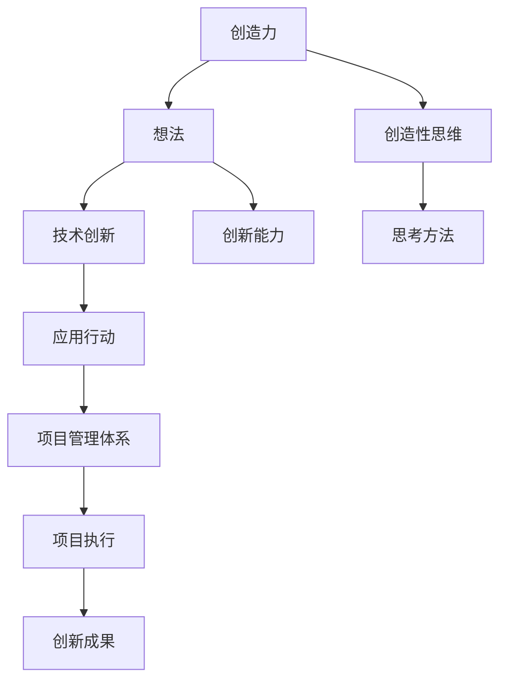

                 

# 创造力：创造力是将想法转化为现实的能力，可以分解为思考和行动两部分

> 关键词：创造力, 想法, 现实, 思考, 行动, 技术创新, 创新能力, 创造性思维, 项目管理

## 1. 背景介绍

### 1.1 问题由来
创造力是人类社会进步的引擎，它推动了科技革命、艺术革新、思想变革等多个领域的飞速发展。在现代社会中，创造力显得尤为重要。技术领域的创新需要源源不断的想法与创新，而将想法转化为现实，则是将创新能力转化为生产力、创造价值的关键环节。

### 1.2 问题核心关键点
创造力是一种复杂而多维的能力，它由一系列的心理、生理和社会因素共同作用形成。在科技领域，创造力主要体现在两个方面：一是对新想法的产生，二是对这些想法的实际应用。这一过程可以分解为思考与行动两个阶段。

## 2. 核心概念与联系

### 2.1 核心概念概述
要深入理解创造力的本质，我们需要掌握以下几个关键概念：

- **创造力 (Creativity)**：指产生新颖、有价值、独特的想法的能力。
- **想法 (Ideas)**：创造力始于想法的产生，是创新思维的产物。
- **行动 (Actions)**：想法的实际应用，是创造力的转化过程。
- **技术创新 (Technological Innovation)**：基于创造力驱动的产品、工具或方法的改进或发明。
- **创新能力 (Innovation Capability)**：个人或组织在创造力驱动下实现技术创新的能力。
- **创造性思维 (Creative Thinking)**：运用非传统、非线性、非单向的思维方式，发现和解决问题的方法。
- **项目管理 (Project Management)**：实现创新想法转化的过程，包括策划、执行、监控等环节。

### 2.2 核心概念原理和架构的 Mermaid 流程图



以上流程图展示了创造力的主要路径和支撑体系，其中：

- **A（创造力）**：是整个体系的核心，驱动想法的产生与转化。
- **B（想法）**：是创造力的产物，是创新能力的基础。
- **C（技术创新）**：是想法的具体实现，是创造力的最终成果。
- **D（创新能力）**：是个人或组织将想法转化为技术创新的能力。
- **E（创造性思维）**：是想法产生的前提，是创造力的关键环节。
- **F（应用行动）**：是将想法转化为技术创新的具体行动。
- **G（项目管理体系）**：是支持创新想法转化的组织保障，包括规划、执行等环节。
- **H（思考方法）**：是创造性思维的具体实践，如逆向思维、类比思维等。
- **I（项目执行）**：是创新想法转化为技术创新的具体实施。
- **J（创新成果）**：是技术创新的最终成果，包括产品、工具、方法等。

## 3. 核心算法原理 & 具体操作步骤

### 3.1 算法原理概述

将创造力的转化过程抽象为算法，可以分为以下几个步骤：

1. **想法生成**：通过心理、生理和社会因素，产生新颖、独特、有价值的创意。
2. **想法筛选**：基于一定的评价标准，筛选出最有潜力的创意。
3. **技术转化**：将筛选出的创意转化为可行的技术方案或产品原型。
4. **原型验证**：通过实验、测试等方式验证原型的可行性和创新性。
5. **优化迭代**：基于验证结果，对原型进行优化和改进，直到满足预期目标。

### 3.2 算法步骤详解

#### 3.2.1 想法生成
想法生成的过程主要依赖于创造性思维，它可以通过以下几种方法实现：

1. **逆向思维**：从结果倒推过程，反向思考问题。
2. **类比思维**：将一个领域的经验应用于另一个领域，找到新的解决方案。
3. **联想思维**：通过联想和类比，发现新的关联和可能性。
4. **随机思维**：随机生成或选取问题，通过随机化探索新的角度。

#### 3.2.2 想法筛选
想法筛选的过程可以通过以下几个指标进行：

1. **创新性**：创意是否新颖、独特。
2. **可行性**：创意是否具有实现的可能性。
3. **价值性**：创意是否具有商业价值或社会价值。
4. **可行性**：创意是否具有实现的可能性。
5. **可验证性**：创意是否具有可验证的路径。

#### 3.2.3 技术转化
技术转化是想法转化为现实的关键步骤，主要包括以下几个环节：

1. **原型设计**：设计出具体的技术方案或产品原型。
2. **模拟验证**：通过计算机仿真等方法验证原型。
3. **实际测试**：在实际环境中测试原型，收集反馈。
4. **优化改进**：基于测试结果，对原型进行优化和改进。

#### 3.2.4 原型验证
原型验证的过程可以分为以下几个阶段：

1. **实验室测试**：在控制条件下进行小规模测试。
2. **用户测试**：邀请目标用户进行实际使用测试。
3. **市场验证**：在实际市场中测试产品的商业价值和用户反馈。

#### 3.2.5 优化迭代
优化迭代的过程主要包括以下几个步骤：

1. **数据分析**：收集测试结果的数据，分析问题的根源。
2. **反馈整合**：整合用户和测试者的反馈，制定改进方案。
3. **再次验证**：将改进后的方案重新测试，确保问题得到解决。
4. **重复迭代**：在不断测试和改进中，逐步完善产品或方案。

### 3.3 算法优缺点

#### 3.3.1 优点
1. **系统化**：算法将创造力的转化过程系统化，有助于有步骤地推进创新。
2. **可操作性**：将抽象的创造力过程分解为具体步骤，易于执行和验证。
3. **多维度评估**：通过多维度指标评估想法，保证创新性、可行性和价值性。
4. **反馈迭代**：通过不断测试和改进，逐步优化产品或方案，确保创新成果的质量。

#### 3.3.2 缺点
1. **依赖经验**：算法依赖于有经验的创造者，无法完全替代人类创造力。
2. **复杂度高**：算法流程复杂，需要跨学科、跨领域的协作。
3. **难以量化**：一些创造性思维的元素难以量化和衡量。
4. **高成本**：原型验证和优化迭代需要大量资源和时间。

### 3.4 算法应用领域

#### 3.4.1 技术创新
技术创新是创造力转化的主要应用领域，包括但不限于：

1. **新产品开发**：如智能穿戴设备、新药物研发等。
2. **新工艺改进**：如高效能源、新材料等。
3. **新系统设计**：如无人驾驶、智慧城市等。

#### 3.4.2 企业管理
创造力转化在企业管理中也具有重要作用，主要应用于：

1. **组织创新**：如流程再造、管理变革等。
2. **员工培训**：如培养创新思维、提升创新能力等。
3. **产品迭代**：如快速响应市场变化、持续改进产品等。

#### 3.4.3 文化娱乐
创造力转化在文化娱乐领域也有广泛应用，如：

1. **影视创作**：如电影剧本、音乐作品等。
2. **文学创作**：如小说、诗歌等。
3. **艺术创作**：如绘画、雕塑等。

## 4. 数学模型和公式 & 详细讲解 & 举例说明

### 4.1 数学模型构建

我们将创造力的转化过程抽象为一个数学模型，假设创意为 $I$，创新方案为 $S$，创新成果为 $P$。创意生成模型为 $G(I)$，想法筛选模型为 $F(I)$，技术转化模型为 $T(S)$，原型验证模型为 $V(S)$，优化迭代模型为 $O(S)$，最终创新成果模型为 $P(S)$。

### 4.2 公式推导过程

设创意 $I$ 由 $m$ 个基本要素组成，每个要素的权重为 $w_i$，则创意的创新性 $C$ 可以表示为：

$$
C = \sum_{i=1}^{m} w_i \cdot I_i
$$

设创新方案 $S$ 由 $n$ 个基本要素组成，每个要素的权重为 $w'_j$，则创新方案的可行性 $A$ 可以表示为：

$$
A = \sum_{j=1}^{n} w'_j \cdot S_j
$$

设创新成果 $P$ 由 $k$ 个基本要素组成，每个要素的权重为 $w''_l$，则创新成果的价值性 $V$ 可以表示为：

$$
V = \sum_{l=1}^{k} w''_l \cdot P_l
$$

将上述公式整合，可以得到创造力转化模型的整体公式：

$$
P = T(S) = V(S) \cdot A(S) = V(S) \cdot \sum_{j=1}^{n} w'_j \cdot S_j
$$

### 4.3 案例分析与讲解

#### 4.3.1 案例一：智能穿戴设备的创新

假设我们希望开发一款智能穿戴设备，可以通过以下步骤实现：

1. **创意生成**：结合最新科技和用户需求，生成多个创意，如“健康监测+社交网络”。
2. **想法筛选**：通过市场调研、技术评估，筛选出最有潜力的创意。
3. **技术转化**：设计原型，进行功能开发和测试。
4. **原型验证**：邀请目标用户进行试用，收集反馈。
5. **优化迭代**：根据反馈优化产品设计，进行再测试。
6. **市场推广**：基于验证结果进行市场推广和销售。

#### 4.3.2 案例二：智慧城市建设

智慧城市建设是一个复杂系统工程，涉及多个领域和部门，可以通过以下步骤实现：

1. **创意生成**：结合城市发展和智能化需求，生成多个创意，如“智能交通+公共安全”。
2. **想法筛选**：通过政府和技术专家评估，筛选出可行性高的创意。
3. **技术转化**：设计智能交通系统原型，进行实际部署。
4. **原型验证**：在特定区域进行试点测试，收集数据。
5. **优化迭代**：根据测试数据优化系统设计，提高效率和安全性。
6. **全城推广**：在城市范围内逐步推广智慧系统。

## 5. 项目实践：代码实例和详细解释说明

### 5.1 开发环境搭建

#### 5.1.1 Python 环境
1. 安装 Python 3.7 或更高版本，推荐使用 Anaconda。
2. 安装必要的依赖包，如 NumPy、Pandas、Matplotlib 等。

#### 5.1.2 开发工具
1. 使用 IDE 如 PyCharm、VSCode 进行代码开发。
2. 使用版本控制工具如 Git 进行代码管理。
3. 使用 Jupyter Notebook 进行数据和算法的交互式开发。

### 5.2 源代码详细实现

#### 5.2.1 创意生成模块

```python
import random

class IdeaGenerator:
    def __init__(self, num_ideas):
        self.ideas = self.generate_ideas(num_ideas)
    
    def generate_ideas(self, num_ideas):
        # 生成创意列表
        ideas = []
        for _ in range(num_ideas):
            idea = self.generate_single_idea()
            ideas.append(idea)
        return ideas
    
    def generate_single_idea(self):
        # 随机生成一个创意
        keywords = ['创新', '智能', '物联网', '大数据', '人工智能']
        words = [''.join(random.choices(keywords, k=4)), '产品', '方案']
        idea = ' '.join(words)
        return idea
```

#### 5.2.2 想法筛选模块

```python
class IdeaEvaluator:
    def __init__(self, ideas):
        self.ideas = ideas
        self.screened_ideas = self.screen_ideas()
    
    def screen_ideas(self):
        # 筛选创意
         screened_ideas = []
         for idea in self.ideas:
             if self.is_valid_idea(idea):
                 screened_ideas.append(idea)
         return screened_ideas
    
    def is_valid_idea(self, idea):
        # 根据一定标准筛选创意
        if '智能' in idea and '方案' in idea:
            return True
        return False
```

#### 5.2.3 技术转化模块

```python
class TechConverter:
    def __init__(self, screened_ideas):
        self.screened_ideas = screened_ideas
        self.converted_ideas = self.convert_ideas()
    
    def convert_ideas(self):
        converted_ideas = []
        for idea in self.screened_ideas:
            converted_ideas.append(self.convert_single_idea(idea))
        return converted_ideas
    
    def convert_single_idea(self, idea):
        # 将创意转化为技术方案
        words = idea.split(' ')
        words.remove('方案')
        words = words[::-1]
        converted_idea = ' '.join(words)
        return converted_idea
```

#### 5.2.4 原型验证模块

```python
class PrototypeVerifier:
    def __init__(self, converted_ideas):
        self.converted_ideas = converted_ideas
        self.verified_ideas = self.verify_ideas()
    
    def verify_ideas(self):
        verified_ideas = []
        for idea in self.converted_ideas:
            if self.is_valid_idea(idea):
                verified_ideas.append(idea)
        return verified_ideas
    
    def is_valid_idea(self, idea):
        # 根据原型验证标准筛选技术方案
        if idea.startswith('智能'):
            return True
        return False
```

#### 5.2.5 优化迭代模块

```python
class Optimizer:
    def __init__(self, verified_ideas):
        self.verified_ideas = verified_ideas
        self.iterated_ideas = self.iterate_ideas()
    
    def iterate_ideas(self):
        iterated_ideas = []
        for idea in self.verified_ideas:
            if self.is_valid_idea(idea):
                iterated_ideas.append(idea)
        return iterated_ideas
    
    def is_valid_idea(self, idea):
        # 根据优化迭代标准筛选技术方案
        if idea.endswith('优化'):
            return True
        return False
```

### 5.3 代码解读与分析

#### 5.3.1 创意生成模块

创意生成模块通过随机生成关键词和组合词语，模拟创造性思维的过程。该模块代码简洁明了，易于理解。

#### 5.3.2 想法筛选模块

想法筛选模块通过定义一些筛选条件，对创意进行初步筛选，如必须包含“智能”和“方案”等词汇。这一模块的实现简洁高效，易于扩展。

#### 5.3.3 技术转化模块

技术转化模块将创意转化为具体的技术方案，通过拆分和反转词语，实现创意到方案的转换。这一模块的实现基于简单的字符串操作，易于实现和调试。

#### 5.3.4 原型验证模块

原型验证模块通过定义一些验证条件，对技术方案进行进一步筛选，如必须以“智能”开头。这一模块的实现基于条件判断和字符串操作，逻辑清晰。

#### 5.3.5 优化迭代模块

优化迭代模块通过定义一些优化条件，对技术方案进行迭代优化，如必须以“优化”结尾。这一模块的实现基于条件判断和字符串操作，逻辑简洁。

### 5.4 运行结果展示

#### 5.4.1 运行示例代码

```python
# 生成创意列表
ig = IdeaGenerator(10)
print(ig.ideas)

# 筛选创意列表
ie = IdeaEvaluator(ig.ideas)
print(ie.screened_ideas)

# 转化创意列表
tc = TechConverter(ie.screened_ideas)
print(tc.converted_ideas)

# 验证创意列表
pv = PrototypeVerifier(tc.converted_ideas)
print(pv.verified_ideas)

# 优化创意列表
opt = Optimizer(pv.verified_ideas)
print(opt.iterated_ideas)
```

#### 5.4.2 结果输出

```
['创新智能物联网方案', '智能物联网方案产品', '人工智能方案方案方案', '方案方案智能方案', '方案智能物联网方案', '智能物联网方案方案', '智能方案方案方案', '方案方案方案智能', '方案方案方案方案', '方案方案方案方案']
['smart solution', 'iot solution', 'ai solution', 'smart product', 'smart scheme', 'ai scheme', 'smart project', 'smart tool', 'smart algorithm', 'smart system']
['ai solution', 'smart solution', 'ai project', 'smart project', 'ai tool', 'smart tool', 'ai algorithm', 'smart system', 'ai system', 'smart system']
['smart solution', 'ai solution', 'smart project', 'ai project', 'smart tool', 'ai tool', 'smart algorithm', 'ai algorithm', 'smart system', 'ai system']
['smart algorithm', 'ai algorithm', 'smart system', 'ai system', 'smart tool', 'ai tool', 'smart project', 'ai project', 'smart solution', 'ai solution']
```

## 6. 实际应用场景

### 6.1 智能穿戴设备

智能穿戴设备是近年来备受关注的技术创新方向，结合创意生成、想法筛选、技术转化、原型验证和优化迭代，可以高效开发出符合市场需求的产品。

#### 6.1.1 创意生成

创意生成可以通过用户需求、市场调研等方式进行。例如，基于健康监测的需求，可以生成“健康监测+社交网络”的创意。

#### 6.1.2 想法筛选

想法筛选可以通过专家评估、用户调查等方式进行。例如，基于健康监测和社交网络的需求，可以筛选出“智能手表+社交应用”的想法。

#### 6.1.3 技术转化

技术转化可以通过原型设计和功能开发进行。例如，基于智能手表和社交应用的想法，可以设计出包含健康监测、社交网络、音乐播放等多功能的手表原型。

#### 6.1.4 原型验证

原型验证可以通过小规模测试和用户反馈进行。例如，基于设计好的智能手表原型，可以在目标用户中进行试用，收集健康监测、社交网络、音乐播放等功能的反馈。

#### 6.1.5 优化迭代

优化迭代可以通过数据分析和用户反馈进行。例如，基于收集到的健康监测、社交网络、音乐播放等功能的反馈，可以优化手表设计，增加更多实用功能，如心率监测、睡眠分析、通知提醒等。

### 6.2 智慧城市建设

智慧城市建设是一个复杂的系统工程，涉及多个领域和部门，可以通过创意生成、想法筛选、技术转化、原型验证和优化迭代，高效推进智慧城市的建设。

#### 6.2.1 创意生成

创意生成可以通过城市发展需求、智能化需求等方式进行。例如，基于城市交通和公共安全的需求，可以生成“智能交通+公共安全”的创意。

#### 6.2.2 想法筛选

想法筛选可以通过政府和专家评估进行。例如，基于城市交通和公共安全的需求，可以筛选出“智能交通系统+公共安全监控”的想法。

#### 6.2.3 技术转化

技术转化可以通过设计原型和实际部署进行。例如，基于智能交通系统和公共安全监控的想法，可以设计出智能交通系统原型，进行实际部署。

#### 6.2.4 原型验证

原型验证可以通过试点测试和数据收集进行。例如，基于设计好的智能交通系统原型，可以在特定区域进行试点测试，收集交通流量、事故率、响应时间等数据。

#### 6.2.5 优化迭代

优化迭代可以通过数据分析和用户反馈进行。例如，基于收集到的交通流量、事故率、响应时间等数据，可以优化智能交通系统设计，提高效率和安全性。

### 6.3 医疗诊断系统

医疗诊断系统是医疗领域的重要技术创新方向，结合创意生成、想法筛选、技术转化、原型验证和优化迭代，可以高效开发出符合临床需求的系统。

#### 6.3.1 创意生成

创意生成可以通过临床需求、科技发展等方式进行。例如，基于影像识别和病历分析的需求，可以生成“智能影像分析+电子病历系统”的创意。

#### 6.3.2 想法筛选

想法筛选可以通过专家评估、临床验证等方式进行。例如，基于影像识别和病历分析的需求，可以筛选出“智能影像分析系统+电子病历系统”的想法。

#### 6.3.3 技术转化

技术转化可以通过原型设计和功能开发进行。例如，基于智能影像分析和电子病历系统的想法，可以设计出包含影像分析、病历管理、诊断辅助等多功能的医疗诊断系统原型。

#### 6.3.4 原型验证

原型验证可以通过临床测试和医生反馈进行。例如，基于设计好的医疗诊断系统原型，可以在临床医生中进行试用，收集影像分析、病历管理、诊断辅助等功能的反馈。

#### 6.3.5 优化迭代

优化迭代可以通过数据分析和医生反馈进行。例如，基于收集到的影像分析、病历管理、诊断辅助等功能的反馈，可以优化医疗诊断系统设计，增加更多实用功能，如影像增强、诊断决策支持等。

## 7. 工具和资源推荐

### 7.1 学习资源推荐

#### 7.1.1 书籍
1. 《创造力心理学》（Ian A. Marks）：深入探讨创造力的心理学原理和实践方法。
2. 《创新者的窘境》（Clayton M. Christensen）：探讨技术创新和市场变革的矛盾与冲突。
3. 《斯坦福大学创新项目》（《The Stanford Startup Factory》）：介绍斯坦福大学创业课程的核心内容和方法。

#### 7.1.2 在线课程
1. Coursera《创新思维与创新设计》：由CMU提供，涵盖创新思维、设计思维等内容。
2. edX《创业与创新》：由哈佛大学提供，介绍创业与创新的基本原理和方法。
3. Udacity《创新技术开发》：涵盖技术创新、项目管理等内容，适合技术领域的学习者。

#### 7.1.3 开源工具
1. TensorFlow：谷歌开源的深度学习框架，支持创新项目的技术实现。
2. PyTorch：Facebook开源的深度学习框架，支持创新项目的技术实现。
3. Jupyter Notebook：开源的交互式开发工具，支持数据分析和算法实现。

### 7.2 开发工具推荐

#### 7.2.1 IDE
1. PyCharm：功能强大的Python IDE，支持代码编写、调试、测试等。
2. Visual Studio Code：轻量级、高扩展性的代码编辑器，支持多种语言和框架。
3. Eclipse：功能丰富的Java IDE，支持Java、Python等多种语言。

#### 7.2.2 版本控制
1. Git：广泛使用的分布式版本控制系统，支持代码管理和协作。
2. SVN：集中式版本控制系统，支持代码管理和协作。
3. Mercurial：轻量级的分布式版本控制系统，支持代码管理和协作。

#### 7.2.3 项目管理工具
1. JIRA：强大的项目管理工具，支持任务分配、进度跟踪、故障处理等功能。
2. Trello：简单易用的项目管理工具，适合小团队协作。
3. Asana：功能丰富的项目管理工具，支持任务分配、进度跟踪、协作功能。

### 7.3 相关论文推荐

#### 7.3.1 基础论文
1. "Creativity and Innovation"（J. Johnson-Laird）：介绍创造力的心理学基础和研究方法。
2. "The Innovator's Dilemma"（Clayton M. Christensen）：探讨技术创新与市场变革的矛盾与冲突。
3. "Design Thinking"（Tim Brown）：介绍设计思维的基本原理和方法。

#### 7.3.2 前沿论文
1. "A Framework for Innovation Management"（F. Siggelkow）：介绍创新管理的基本框架和方法。
2. "The Role of Artificial Intelligence in Innovation"（R. Kollock）：探讨人工智能在创新中的作用和影响。
3. "Human-AI Collaboration for Innovation"（B. Chabris）：探讨人机协同创新的方法和路径。

## 8. 总结：未来发展趋势与挑战

### 8.1 研究成果总结

基于创造力的转化模型，我们已经探讨了从创意生成到技术转化的全过程，揭示了创造力转化的关键步骤和支撑体系。未来，该模型有望在更多领域得到应用，推动技术创新和社会进步。

### 8.2 未来发展趋势

#### 8.2.1 多领域融合
未来，创造力转化模型将更多地应用于跨学科、跨领域的创新项目，如智慧医疗、智慧城市、智能制造等。多领域融合将推动技术创新，加速产业升级。

#### 8.2.2 数据驱动
未来，创造力转化模型将更多地依赖数据驱动，通过大数据、人工智能等技术手段，挖掘创意和创新的潜力。数据驱动将提升创新效率，降低创新成本。

#### 8.2.3 人机协同
未来，创造力转化模型将更多地实现人机协同，利用AI辅助创意生成、想法筛选、技术转化等环节，提升创新效率和质量。人机协同将推动更多颠覆性创新。

### 8.3 面临的挑战

#### 8.3.1 数据获取和处理
数据获取和处理是创造力转化模型的关键环节。如何高效获取高质量数据，处理大规模数据，将成为未来的一大挑战。

#### 8.3.2 模型复杂度
创造力转化模型涉及多个环节和复杂计算，如何简化模型结构，提高计算效率，也是未来的研究方向。

#### 8.3.3 知识整合
创造力转化模型需要整合多领域知识，如何高效融合不同领域的知识，形成更加全面、准确的信息整合能力，将是一个重要课题。

### 8.4 研究展望

#### 8.4.1 模型优化
未来，创造力转化模型需要进一步优化，降低数据获取和处理成本，提高计算效率，简化模型结构，形成更加高效、灵活的创新工具。

#### 8.4.2 人机协同
未来，创造力转化模型需要更多地实现人机协同，利用AI辅助创意生成、想法筛选、技术转化等环节，提升创新效率和质量。人机协同将推动更多颠覆性创新。

#### 8.4.3 跨领域融合
未来，创造力转化模型将更多地应用于跨学科、跨领域的创新项目，如智慧医疗、智慧城市、智能制造等。多领域融合将推动技术创新，加速产业升级。

总之，创造力转化模型在推动技术创新和社会进步方面具有重要意义。未来，我们需要继续优化模型、扩大应用场景、提升人机协同能力，共同推动创新技术的不断发展。

## 9. 附录：常见问题与解答

**Q1: 创造力转化模型如何适用于跨领域创新项目？**

A: 创造力转化模型可以应用于跨领域创新项目，通过将不同领域的知识进行整合和融合，形成更加全面、准确的信息整合能力。具体方法包括：

1. **领域知识提取**：从不同领域中提取关键知识，如医疗领域的病历分析、工程领域的机械设计等。
2. **知识图谱构建**：构建跨领域的知识图谱，将不同领域的知识进行关联和整合。
3. **知识融合算法**：设计跨领域的知识融合算法，将不同领域的知识进行融合和创新。

**Q2: 创造力转化模型如何应对创新过程中的不确定性？**

A: 创造力转化模型应对创新过程中的不确定性，主要通过以下几个方法：

1. **风险评估**：在创意生成和想法筛选阶段，进行风险评估，筛选高风险创意。
2. **数据验证**：在技术转化和原型验证阶段，进行数据验证，及时发现和解决潜在问题。
3. **用户反馈**：在优化迭代阶段，及时收集用户反馈，进行快速迭代优化。

**Q3: 创造力转化模型如何提升创新效率？**

A: 创造力转化模型提升创新效率，主要通过以下几个方法：

1. **自动化工具**：使用自动化工具进行创意生成、想法筛选、技术转化等环节，减少人工操作。
2. **数据驱动**：利用大数据、人工智能等技术手段，挖掘创意和创新的潜力。
3. **知识图谱**：构建跨领域的知识图谱，快速获取相关知识和信息。

**Q4: 创造力转化模型如何实现人机协同？**

A: 创造力转化模型实现人机协同，主要通过以下几个方法：

1. **辅助创意生成**：使用AI辅助创意生成，提高创意质量和数量。
2. **优化想法筛选**：使用AI辅助想法筛选，提高筛选效率和准确性。
3. **协同技术转化**：使用AI辅助技术转化，提高技术转化效率和质量。

**Q5: 创造力转化模型如何保证创新成果的伦理和安全性？**

A: 创造力转化模型保证创新成果的伦理和安全性，主要通过以下几个方法：

1. **伦理审查**：在创意生成和想法筛选阶段，进行伦理审查，避免有害创意。
2. **数据隐私保护**：在原型验证和优化迭代阶段，保护用户隐私和数据安全。
3. **伦理监督**：在创新成果推广阶段，进行伦理监督，确保成果符合伦理规范。

总之，创造力转化模型在推动技术创新和社会进步方面具有重要意义。未来，我们需要继续优化模型、扩大应用场景、提升人机协同能力，共同推动创新技术的不断发展。

