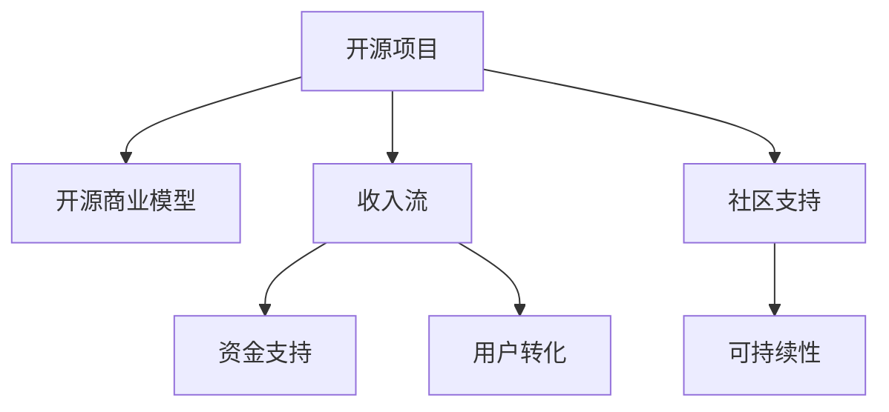

                 

# 利用开源项目创造收入流

## 1. 背景介绍

在数字化时代，开源项目已成为科技公司竞争的利器。开源项目不仅仅是代码共享的平台，更是一种商业模式。随着开源社区的不断壮大，越来越多的企业通过开源项目实现了技术创新和收入增长。

### 1.1 问题由来

近年来，开源项目在软件开发、数据科学、人工智能等领域得到了广泛应用，成为了技术进步的重要驱动力。然而，开源项目的商业模式并不明朗，如何从开源项目中创造收入流，成为很多企业的困惑。

开源项目面临的主要挑战包括：

1. **资金支持不足**：开源项目主要依靠社区贡献，而社区成员通常出于兴趣或学术研究，而非商业盈利。
2. **用户转化困难**：许多开源项目仅提供基本功能，难以实现商业价值的最大化。
3. **商业模式模糊**：开源项目如何收费、授权、分发，成为企业亟待解决的难题。

### 1.2 问题核心关键点

为了更好地理解如何利用开源项目创造收入流，本节将介绍几个关键概念：

- **开源项目**：开放源代码的软件项目，旨在促进代码共享和协作。
- **开源商业模型**：将开源项目商业化，通过收费、广告、订阅等手段实现盈利。
- **收入流**：从项目中产生的收益，包括资金、用户、数据等。
- **社区支持**：开源项目依赖于社区成员的贡献和支持。
- **可持续性**：开源项目需确保长期的稳定发展和盈利能力。

这些概念之间的逻辑关系可以通过以下Mermaid流程图来展示：



这个流程图展示了几者之间的关系：

1. 开源项目是基础，提供软件和服务。
2. 开源商业模型通过商业手段将开源项目变现。
3. 收入流包括资金、用户、数据等收益。
4. 社区支持是开源项目的保障。
5. 可持续性是开源项目的长期目标。

## 2. 核心概念与联系

### 2.1 核心概念概述

为了更好地理解开源商业模型和收入流的创造方法，本节将介绍几个密切相关的核心概念：

- **订阅模式**：用户按月或按年支付订阅费，获得高级功能和服务。
- **收费授权**：用户购买授权许可证，以获取使用开源项目的权利。
- **开源商业软件**：开源项目的商业版本，包含增值功能和服务。
- **开源广告**：在开源项目中插入广告，通过流量变现。
- **开源数据销售**：将开源项目中收集的数据进行商业化销售。

这些概念之间的联系主要体现在：

- 开源项目提供基础软件和服务，是开源商业模型的基础。
- 订阅模式、收费授权、开源商业软件、开源广告和开源数据销售，都是开源商业模型的具体实现方式。
- 通过这些方式，开源项目可以创造出收入流，支持项目的可持续发展和商业化运营。

## 3. 核心算法原理 & 具体操作步骤

### 3.1 算法原理概述

开源商业模型的核心在于通过各种手段将开源项目的价值变现。其算法原理主要基于以下两个方面：

1. **价值识别与定位**：识别开源项目的独特价值和用户需求，定位最有潜力的商业模式。
2. **价值实现与运营**：将识别出的价值通过商业模式变现，同时确保项目的可持续运营。

### 3.2 算法步骤详解

开源商业模型的具体实现步骤如下：

1. **需求分析**：
   - 分析开源项目的核心价值和用户需求。
   - 识别用户痛点，确定可能的商业机会。
   - 收集用户反馈，了解市场需求和期望。

2. **价值定位**：
   - 基于需求分析，确定最有可能变现的商业模型。
   - 确定商业模型的可行性、市场潜力、竞争优势。
   - 制定详细的商业化策略和实施计划。

3. **价值实现**：
   - 设计和开发商业化的功能和服务。
   - 测试和优化商业化产品，确保用户体验和功能完善。
   - 推广和营销商业化产品，吸引目标用户。

4. **收入流创造**：
   - 采用订阅模式、收费授权、开源商业软件、开源广告、开源数据销售等手段，实现收入流。
   - 分析收入数据，优化商业模型和策略。
   - 持续迭代和改进，提升商业化效果和收入。

### 3.3 算法优缺点

开源商业模型具有以下优点：

1. **灵活性**：开源商业模型可以根据市场变化灵活调整，快速响应市场需求。
2. **成本低**：基于开源项目的技术和社区支持，商业化成本相对较低。
3. **品牌效应**：开源项目通常具有较高的品牌认知度和社区支持，有助于商业化推广。
4. **用户粘性**：通过增值服务和订阅模式，用户粘性较高，能够持续创造收入流。

同时，开源商业模型也存在一些缺点：

1. **资金限制**：开源项目的资金主要依赖社区和用户的支持，难以大规模投入。
2. **风险高**：商业化过程存在诸多不确定性，失败风险较高。
3. **用户期望高**：开源项目的用户通常对质量和功能有较高的期望，商业化需慎重考虑。
4. **法律和伦理问题**：开源项目的商业化需考虑版权、授权、隐私等法律和伦理问题。

### 3.4 算法应用领域

开源商业模型已经在软件开发、数据科学、人工智能等多个领域得到了广泛应用，成为开源项目实现商业化的重要手段。具体应用领域包括：

- **软件开发**：如Apache Maven、GitHub等，通过收费授权、开源商业软件、开源广告等方式实现收入。
- **数据科学**：如Apache Spark、TensorFlow等，通过开源数据销售、订阅模式等方式变现。
- **人工智能**：如OpenAI、Google AI等，通过开源广告、订阅服务、开源数据销售等手段盈利。
- **基础设施**：如Apache Hadoop、AWS等，通过订阅模式、收费授权等方式创造收入流。

## 4. 数学模型和公式 & 详细讲解 & 举例说明

### 4.1 数学模型构建

为了更好地理解开源商业模型的实现过程，我们可以构建一个简化的数学模型。假设开源项目提供基本功能X，商业化的增值功能Y，用户数为U，订阅用户数为S，收入为I。

商业化模型可以表示为：

$$
I = p_y \times S + p_x \times (U - S) + r_y \times S + r_x \times (U - S)
$$

其中：

- $p_y$：订阅用户每月的费用。
- $p_x$：基本功能每月的费用。
- $r_y$：增值功能每用户的费用。
- $r_x$：基本功能每用户的费用。

### 4.2 公式推导过程

我们可以通过以下步骤推导商业化模型的收入公式：

1. **基本功能收入**：
   - 基本功能用户数为$U - S$，每用户费用为$r_x$，总收入为$r_x \times (U - S)$。

2. **增值功能收入**：
   - 订阅用户数为$S$，每订阅用户费用为$p_y$，总收入为$p_y \times S$。
   - 商业化增值功能用户数为$S$，每用户费用为$r_y$，总收入为$r_y \times S$。

3. **总收入**：
   - 将上述两项总收入相加，得到商业化模型总收入公式。

### 4.3 案例分析与讲解

以GitHub为例，其开源商业模型主要包括：

- **基本功能**：GitHub免费提供基本的代码托管和仓库管理功能，用户数庞大。
- **增值功能**：包括私有仓库、代码审查、CI/CD等高级功能，通过订阅模式和按需付费实现收入。
- **开源商业软件**：提供企业级版本GitHub Enterprise，包含更多高级功能和更好的支持。
- **开源广告**：在GitHub界面插入广告，通过流量变现。
- **开源数据销售**：提供API访问和企业数据分析服务，通过数据变现。

通过以上多种手段，GitHub实现了显著的商业化收入。据报道，GitHub在2021年的收入超过$3亿。

## 5. 项目实践：代码实例和详细解释说明

### 5.1 开发环境搭建

在进行开源商业模型实践前，我们需要准备好开发环境。以下是使用Python进行Django开发的环境配置流程：

1. 安装Python：从官网下载并安装Python 3.8及以上版本。

2. 安装Django：
   ```bash
   pip install django
   ```

3. 安装数据库：如PostgreSQL、MySQL等。

4. 安装其他依赖：如Pillow、psycopg2等。

5. 创建Django项目：
   ```bash
   django-admin startproject myproject
   ```

6. 创建Django应用：
   ```bash
   python manage.py startapp myapp
   ```

完成上述步骤后，即可在项目环境中开始商业模型开发。

### 5.2 源代码详细实现

下面以开源项目Django为例，展示如何使用开源商业模型实现订阅模式。

首先，定义Django应用和模型：

```python
from django.db import models
from django.contrib.auth.models import User

class Subscription(models.Model):
    user = models.ForeignKey(User, on_delete=models.CASCADE)
    plan = models.CharField(max_length=100)
    start_date = models.DateTimeField(auto_now_add=True)
    end_date = models.DateTimeField()
    paid_until = models.DateTimeField(null=True)

class Order(models.Model):
    user = models.ForeignKey(User, on_delete=models.CASCADE)
    amount = models.DecimalField(max_digits=10, decimal_places=2)
    created_at = models.DateTimeField(auto_now_add=True)
    due_date = models.DateTimeField()
    paid_at = models.DateTimeField(null=True)
```

然后，定义视图和表单：

```python
from django.shortcuts import render, redirect
from django.contrib.auth.decorators import login_required
from .forms import SubscriptionForm
from .models import Subscription, Order

@login_required
def subscription_form(request):
    form = SubscriptionForm(request.user)
    if request.method == 'POST':
        if form.is_valid():
            subscription = form.save()
            user = request.user
            user.subscription = subscription
            user.save()
            order = Order.objects.create(user=user, amount=0.99)
            order.save()
            return redirect('subscription_success')
    return render(request, 'subscription.html', {'form': form})

@login_required
def subscription_success(request):
    return render(request, 'subscription_success.html')
```

最后，定义路由：

```python
from django.urls import path
from . import views

urlpatterns = [
    path('subscription/', views.subscription_form, name='subscription_form'),
    path('subscription/success/', views.subscription_success, name='subscription_success'),
]
```

以上代码实现了订阅功能的Django应用，用户可以通过注册并填写表单，完成订阅并支付费用。

### 5.3 代码解读与分析

让我们再详细解读一下关键代码的实现细节：

**Subscription模型**：
- 定义了订阅计划、用户、开始日期、结束日期、已支付日期等字段，用于存储订阅信息。

**Order模型**：
- 定义了订单金额、用户、创建时间、到期时间、支付时间等字段，用于记录订单信息。

**subscription_form视图**：
- 在用户登录后，显示订阅表单，用户填写订阅信息后提交表单，完成订阅和支付。

**subscription_success视图**：
- 订阅成功后，显示成功页面，确认订阅成功。

**urls.py**：
- 定义了订阅页面的路由，将视图和URL绑定起来。

可以看到，Django的快速开发和简洁的ORM系统，使得开源商业模型的实现变得相对容易。开发者可以专注于业务逻辑的实现，而不必过多关注底层技术细节。

## 6. 实际应用场景

### 6.1 软件即服务(SaaS)

开源项目通过软件即服务(SaaS)模式，提供企业级功能和服务，实现商业化。SaaS模式具有以下特点：

- **订阅模式**：企业按月或按年订阅软件服务，获取高级功能和支持。
- **按需付费**：企业根据实际使用情况，按需支付费用。
- **多租户架构**：系统支持多企业租户，数据和配置独立。

许多开源SaaS项目已经实现商业化，如Django、Mattermost、Slack等，通过订阅模式和增值服务创造了可观的收入。

### 6.2 数据平台

开源数据平台通过收集和分析海量数据，提供商业化的数据分析和报告服务。数据平台具有以下特点：

- **开源数据收集**：通过爬虫、API等手段，收集大量数据。
- **数据存储与处理**：提供高效的数据存储和处理功能。
- **商业化分析**：提供高级的数据分析和报告功能，支持企业决策。

开源数据平台如Apache Spark、Apache Hive、Presto等，通过开源商业模型，提供了强大的数据分析服务，创造了显著的商业价值。

### 6.3 开发者工具

开源开发者工具通过提供编程语言的IDE、代码编辑器、调试工具等，帮助开发者提升开发效率和质量。开发者工具具有以下特点：

- **免费开源**：提供免费版本，支持广泛社区。
- **增值服务**：提供高级功能和付费插件，支持商业化。
- **插件生态**：支持丰富的插件生态，提供更多功能和体验。

开源开发者工具如GitHub、Jupyter Notebook、Visual Studio Code等，通过商业化，实现了庞大的用户基数和收入流。

### 6.4 未来应用展望

随着开源社区的不断壮大，开源商业模型也将迎来更多创新和机遇。未来开源商业模型的发展趋势包括：

1. **多模态数据融合**：开源项目将结合多种数据类型，如文本、图像、视频等，提供更全面、更强大的分析能力。
2. **低代码平台**：开源项目通过低代码平台，降低用户使用门槛，提高使用效率和体验。
3. **AI驱动**：开源项目结合AI技术，提供智能推荐、自动优化等功能，提升用户价值。
4. **区块链技术**：开源项目结合区块链技术，提供更安全、透明的数据和交易保障。
5. **社区和生态**：开源项目通过社区和生态建设，形成良性互动，提升用户粘性和满意度。

## 7. 工具和资源推荐

### 7.1 学习资源推荐

为了帮助开发者系统掌握开源商业模型的理论基础和实践技巧，这里推荐一些优质的学习资源：

1. **《开源商业模型》系列博文**：深入浅出地介绍了开源商业模型的原理和实现方法，包括订阅模式、开源商业软件等。
2. **《Django实战》书籍**：由Django核心开发者撰写，全面介绍了Django的开发和商业化实践，提供了丰富的代码示例和项目经验。
3. **《TensorFlow实战》书籍**：由TensorFlow核心开发者撰写，介绍了TensorFlow的商业化应用，涵盖模型训练、数据处理、API服务等。
4. **《GitHub指南》官方文档**：GitHub的官方文档，提供了丰富的商业化样例和API接口，帮助开发者实现商业化功能。
5. **《开源商业模型》论文**：研究开源商业模型的关键理论和实践，提供了全面的分析和方法论。

通过对这些资源的学习实践，相信你一定能够快速掌握开源商业模型的精髓，并用于解决实际的商业化问题。

### 7.2 开发工具推荐

高效的开发离不开优秀的工具支持。以下是几款用于开源商业模型开发的常用工具：

1. **Django**：开源的Web应用框架，具有灵活的URL路由、ORM等特性，适合快速开发商业模型。
2. **Flask**：轻量级的Web应用框架，支持快速开发RESTful API，适合小型项目和微服务架构。
3. **TensorFlow**：强大的深度学习框架，支持商业化的模型训练和部署，适用于需要复杂数据分析和处理的项目。
4. **Jupyter Notebook**：交互式的代码编辑器，支持Python、R等多种语言，适合开发数据分析和报告功能。
5. **Visual Studio Code**：流行的代码编辑器，支持丰富的插件生态，适合开发开发者工具和插件。

合理利用这些工具，可以显著提升开源商业模型的开发效率，加快创新迭代的步伐。

### 7.3 相关论文推荐

开源商业模型的发展离不开学界的持续研究。以下是几篇奠基性的相关论文，推荐阅读：

1. **《开源商业模型研究》**：系统地介绍了开源商业模型的理论基础和实践方法，提供了全面的分析框架。
2. **《SaaS商业模式分析》**：深入分析了SaaS商业模式的原理和实现方法，提供了丰富的案例和经验。
3. **《开源数据平台构建》**：介绍了开源数据平台的构建方法和技术栈，提供了实际的应用案例和效果评估。
4. **《开源开发者工具商业化》**：研究了开源开发者工具的商业化路径和策略，提供了详细的实践指导。
5. **《开源商业模型创新》**：探讨了开源商业模型的未来发展趋势和创新方向，提出了新的商业化方法论。

这些论文代表了大规模开源商业模型的发展脉络。通过学习这些前沿成果，可以帮助研究者把握学科前进方向，激发更多的创新灵感。

## 8. 总结：未来发展趋势与挑战

### 8.1 总结

本文对开源商业模型的实现方法和应用场景进行了全面系统的介绍。首先阐述了开源商业模型的研究背景和意义，明确了开源项目在商业化中的独特价值。其次，从原理到实践，详细讲解了开源商业模型的数学模型和具体操作步骤，给出了开源商业模型开发的完整代码实例。同时，本文还广泛探讨了开源商业模型在SaaS、数据平台、开发者工具等诸多领域的应用前景，展示了开源商业模型的巨大潜力。此外，本文精选了开源商业模型的各类学习资源，力求为开发者提供全方位的技术指引。

通过本文的系统梳理，可以看到，开源商业模型正在成为开源项目实现商业化的重要范式，极大地拓展了开源项目的商业化路径。开源项目通过订阅模式、开源商业软件、开源广告、开源数据销售等多种手段，实现了显著的商业价值和用户粘性，为开源社区提供了可持续发展的资金支持。未来，随着开源社区的不断壮大，开源商业模型将迎来更多创新和机遇，开源项目的商业化前景将更加广阔。

### 8.2 未来发展趋势

展望未来，开源商业模型将呈现以下几个发展趋势：

1. **多模态数据融合**：开源项目将结合多种数据类型，如文本、图像、视频等，提供更全面、更强大的分析能力。
2. **低代码平台**：开源项目通过低代码平台，降低用户使用门槛，提高使用效率和体验。
3. **AI驱动**：开源项目结合AI技术，提供智能推荐、自动优化等功能，提升用户价值。
4. **区块链技术**：开源项目结合区块链技术，提供更安全、透明的数据和交易保障。
5. **社区和生态**：开源项目通过社区和生态建设，形成良性互动，提升用户粘性和满意度。

这些趋势凸显了开源商业模型在未来的巨大发展潜力。这些方向的探索发展，必将进一步提升开源项目的商业化效果和用户价值，为开源社区带来更多的创新和机遇。

### 8.3 面临的挑战

尽管开源商业模型已经取得了瞩目成就，但在迈向更加智能化、普适化应用的过程中，它仍面临着诸多挑战：

1. **资金限制**：开源项目的资金主要依赖社区和用户的支持，难以大规模投入。
2. **风险高**：商业化过程存在诸多不确定性，失败风险较高。
3. **用户期望高**：开源项目的用户通常对质量和功能有较高的期望，商业化需慎重考虑。
4. **法律和伦理问题**：开源项目的商业化需考虑版权、授权、隐私等法律和伦理问题。

### 8.4 研究展望

面对开源商业模型所面临的挑战，未来的研究需要在以下几个方面寻求新的突破：

1. **资金筹措机制**：探索更多资金筹措机制，如众筹、风险投资、政府资助等，支持开源项目的商业化。
2. **市场定位**：更加精确地定位目标市场和用户需求，制定差异化的商业策略。
3. **用户体验优化**：通过用户反馈和迭代改进，提升开源商业模型的用户体验和功能。
4. **法律和伦理规范**：制定和遵循开源商业模型的法律和伦理规范，保障用户权益和数据安全。
5. **社区和生态建设**：加强社区和生态建设，形成良性互动，提升开源项目的可持续性和商业化效果。

这些研究方向的探索，必将引领开源商业模型走向更加成熟和稳定，为开源社区带来更多的创新和机遇。面向未来，开源商业模型还需与其他技术进行更深入的融合，如区块链、AI、低代码等，多路径协同发力，共同推动开源项目的商业化进程。

## 9. 附录：常见问题与解答

**Q1：开源项目如何实现商业化？**

A: 开源项目可以通过多种方式实现商业化，包括订阅模式、开源商业软件、开源广告、开源数据销售等。

**Q2：开源商业模型有哪些商业化手段？**

A: 开源商业模型的商业化手段包括订阅模式、开源商业软件、开源广告、开源数据销售等。

**Q3：开源商业模型如何降低用户使用门槛？**

A: 开源商业模型可以通过低代码平台、快速开发工具等手段，降低用户使用门槛，提高使用效率和体验。

**Q4：开源商业模型如何提升用户粘性？**

A: 开源商业模型可以通过提供增值服务、社区支持、用户反馈机制等手段，提升用户粘性，持续创造收入流。

**Q5：开源商业模型如何保障用户数据安全？**

A: 开源商业模型需考虑数据隐私、安全、合规等法律和伦理问题，通过数据脱敏、加密等手段保障用户数据安全。

---

作者：禅与计算机程序设计艺术 / Zen and the Art of Computer Programming

