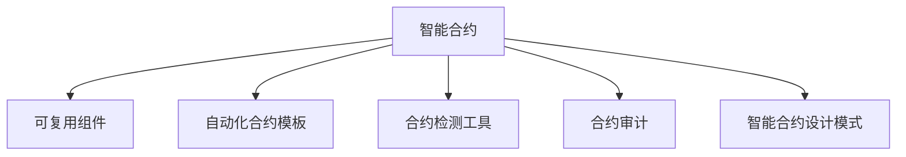

                 

## 1. 背景介绍

### 1.1 问题由来

在区块链技术的快速发展下，智能合约已成为新一代金融基础设施的重要组成部分。智能合约通过代码实现自动化规则，能够在无需人为干预的情况下，执行交易逻辑、存储数据、分配权益等复杂功能。然而，传统智能合约开发依赖于合约语言（如Solidity），开发者需要深入理解其语法、机制和安全性问题，同时还需要应对频繁的编程错误和业务逻辑漏洞。这些问题极大地增加了合约开发的难度，降低了合约开发效率。

### 1.2 问题核心关键点

智能合约开发的核心在于如何将业务需求转换为代码逻辑，同时确保代码的安全性、可扩展性和灵活性。具体来说，可以从以下几个方面入手：

- **自动化合约模板**：利用技术优势，简化合约模板的开发，提高开发效率。
- **可复用组件**：通过设计可复用的组件，提高合约代码的复用性，减少重复编写代码。
- **安全性检测工具**：使用先进的检测工具，识别合约代码中的漏洞和错误，保证合约的安全性。
- **可扩展性设计**：设计可扩展的合约架构，使得智能合约能够适应不同的业务需求，具备良好的扩展性。
- **用户交互设计**：设计友好的用户交互界面，提升用户操作智能合约的体验。

### 1.3 问题研究意义

通过利用技术优势进行智能合约开发，可以极大地提升智能合约的开发效率和安全性，降低合约开发成本，缩短项目周期。此外，高效的智能合约开发还有助于推动区块链技术在各个垂直行业的深入应用，促进数字化转型。

## 2. 核心概念与联系

### 2.1 核心概念概述

为更好地理解利用技术优势进行智能合约开发，本节将介绍几个密切相关的核心概念：

- **智能合约**：通过区块链技术实现的自动化合约，能够在无需人为干预的情况下执行交易逻辑、存储数据、分配权益等复杂功能。
- **可复用组件**：指可以重复使用的代码片段，包括函数、变量、状态等，用于提高合约代码的复用性。
- **自动化合约模板**：指用于快速创建智能合约的模板，可减少开发时间和工作量。
- **合约检测工具**：用于检测合约代码中的漏洞和错误，保证合约的安全性。
- **合约审计**：通过第三方专业机构对智能合约进行审查，发现潜在的安全漏洞和问题。
- **智能合约设计模式**：指设计合约架构、提升合约可扩展性和灵活性的设计思路。

这些核心概念之间的逻辑关系可以通过以下Mermaid流程图来展示：



这个流程图展示了这个概念体系的核心内容及其之间的关系：

1. 智能合约是整个体系的核心，通过自动化合约模板、可复用组件、合约检测工具、合约审计和智能合约设计模式等技术手段，实现合约的自动化、安全性、可扩展性和灵活性。
2. 自动化合约模板和可复用组件是提升合约开发效率和复用性的关键手段。
3. 合约检测工具和合约审计是确保合约安全性的重要工具。
4. 智能合约设计模式是提升合约可扩展性和灵活性的设计思路。

## 3. 核心算法原理 & 具体操作步骤

### 3.1 算法原理概述

利用技术优势进行智能合约开发，本质上是通过技术手段提升合约的开发效率和安全性。具体来说，可以包括以下几个方面：

1. **自动化合约模板**：简化合约开发流程，提升开发效率。
2. **可复用组件**：提高代码复用性，减少重复编写代码。
3. **合约检测工具**：识别合约中的漏洞和错误，确保合约的安全性。
4. **合约审计**：通过第三方审计，发现合约中的潜在问题。
5. **智能合约设计模式**：提升合约的可扩展性和灵活性。

### 3.2 算法步骤详解

基于技术优势的智能合约开发流程一般包括以下几个关键步骤：

**Step 1: 准备开发环境**

- 选择合适的区块链平台（如Ethereum、Binance Smart Chain等）。
- 安装开发工具（如Truffle、Remix等），搭建开发环境。
- 配置本地或云端测试网络（如Ropsten、Kovan等），用于测试合约。

**Step 2: 设计合约架构**

- 根据业务需求，设计合约的基本架构，包括事件、函数、状态等。
- 使用智能合约设计模式，提升合约的可扩展性和灵活性。
- 定义合约的权限控制机制，确保合约的安全性。

**Step 3: 创建自动化合约模板**

- 根据业务需求，创建自动化合约模板，包括通用的合约函数、状态变量等。
- 引入可复用组件，减少代码重复编写。
- 编写合约的单元测试，确保模板的正确性和健壮性。

**Step 4: 进行合约检测**

- 使用合约检测工具，如MythX、Mythril等，检测合约中的漏洞和错误。
- 根据检测结果，修正合约代码中的问题，确保合约的安全性。
- 定期更新检测工具和漏洞库，保证合约的及时更新。

**Step 5: 进行合约审计**

- 委托第三方审计机构，对合约进行专业审计，发现潜在的安全漏洞和问题。
- 根据审计报告，修正合约代码中的问题，确保合约的安全性。
- 保存审计报告，便于后续的追溯和改进。

**Step 6: 部署合约**

- 在测试网络上部署合约，进行全面的测试。
- 通过智能合约地址，调用合约函数进行测试。
- 在主网络上部署合约，进行生产环境测试。

### 3.3 算法优缺点

利用技术优势进行智能合约开发，具有以下优点：

1. **提升开发效率**：通过自动化合约模板和可复用组件，可以显著减少合约的开发时间，提高开发效率。
2. **确保合约安全性**：使用合约检测工具和第三方审计，可以及时发现合约中的漏洞和问题，确保合约的安全性。
3. **提高合约可扩展性**：使用智能合约设计模式，提升合约的可扩展性和灵活性，使其能够适应不同的业务需求。

同时，这种开发方法也存在一些局限性：

1. **技术门槛较高**：需要熟悉区块链技术和智能合约开发工具，技术门槛较高。
2. **合约检测工具的局限性**：某些合约检测工具可能无法识别所有的漏洞和问题，需要结合人工审查。
3. **审计成本较高**：委托第三方审计机构进行审计，成本较高，且审计周期较长。

尽管存在这些局限性，但利用技术优势进行智能合约开发，仍然是提高合约开发效率和安全性、降低合约开发成本的重要手段。

### 3.4 算法应用领域

基于技术优势的智能合约开发方法，已经在金融、供应链、版权、医疗等多个领域得到广泛应用，以下是几个典型的应用场景：

- **金融行业**：在DeFi（去中心化金融）领域，智能合约用于自动化执行贷款、交易、支付等功能。
- **供应链管理**：智能合约用于自动化执行物流跟踪、库存管理、订单执行等功能。
- **版权保护**：智能合约用于自动化执行版权交易、版权确权、版权授权等功能。
- **医疗健康**：智能合约用于自动化执行医疗记录管理、药物管理、医疗支付等功能。

## 4. 数学模型和公式 & 详细讲解 & 举例说明

### 4.1 数学模型构建

在智能合约开发中，常见的数学模型包括合约逻辑模型、安全性模型和性能模型。下面以一个简单的智能合约为例，介绍这些模型的构建。

**合约逻辑模型**：描述智能合约的基本逻辑，包括函数、状态变量和事件。例如：

```solidity
contract Crowdsale {
    uint256 public totalSupply = 0;
    uint256 public fundsCollected = 0;

    constructor(uint256 totalSupply_, uint256 fundAmount_){
        totalSupply = totalSupply_;
        fundsCollected = fundAmount_;
    }

    function sell(uint256 amount, address buyer){
        require(amount > 0, "Invalid amount");
        require(buyer != address(0), "Invalid buyer address");
        require(fundsCollected >= amount, "Not enough funds");

        totalSupply -= amount;
        fundsCollected -= amount;
        emit CrowdsaleTransfer(amount, buyer);
    }

    event CrowdsaleTransfer(uint256 amount, address buyer);
}
```

**安全性模型**：用于描述智能合约的安全性要求和约束条件。例如：

```solidity
contract Crowdsale {
    uint256 public totalSupply = 0;
    uint256 public fundsCollected = 0;

    constructor(uint256 totalSupply_, uint256 fundAmount_){
        require(fundAmount_ > 0, "Invalid fund amount");
        totalSupply = totalSupply_;
        fundsCollected = fundAmount_;
    }

    function sell(uint256 amount, address buyer){
        require(amount > 0, "Invalid amount");
        require(buyer != address(0), "Invalid buyer address");
        require(fundsCollected >= amount, "Not enough funds");

        totalSupply -= amount;
        fundsCollected -= amount;
        emit CrowdsaleTransfer(amount, buyer);
    }

    event CrowdsaleTransfer(uint256 amount, address buyer);
}
```

**性能模型**：用于描述智能合约的性能指标和优化策略。例如：

```solidity
contract Crowdsale {
    uint256 public totalSupply = 0;
    uint256 public fundsCollected = 0;

    constructor(uint256 totalSupply_, uint256 fundAmount_){
        require(fundAmount_ > 0, "Invalid fund amount");
        totalSupply = totalSupply_;
        fundsCollected = fundAmount_;
    }

    function sell(uint256 amount, address buyer){
        require(amount > 0, "Invalid amount");
        require(buyer != address(0), "Invalid buyer address");
        require(fundsCollected >= amount, "Not enough funds");

        // 优化性能
        require(totalSupply >= amount, "Invalid amount");

        totalSupply -= amount;
        fundsCollected -= amount;
        emit CrowdsaleTransfer(amount, buyer);
    }

    event CrowdsaleTransfer(uint256 amount, address buyer);
}
```

### 4.2 公式推导过程

以一个简单的智能合约为例，推导其安全性模型和性能模型。

**安全性模型**：

```solidity
contract Crowdsale {
    uint256 public totalSupply = 0;
    uint256 public fundsCollected = 0;

    constructor(uint256 totalSupply_, uint256 fundAmount_){
        require(fundAmount_ > 0, "Invalid fund amount");
        totalSupply = totalSupply_;
        fundsCollected = fundAmount_;
    }

    function sell(uint256 amount, address buyer){
        require(amount > 0, "Invalid amount");
        require(buyer != address(0), "Invalid buyer address");
        require(fundsCollected >= amount, "Not enough funds");

        totalSupply -= amount;
        fundsCollected -= amount;
        emit CrowdsaleTransfer(amount, buyer);
    }

    event CrowdsaleTransfer(uint256 amount, address buyer);
}
```

其安全性模型可以表示为：

$$
\begin{aligned}
S &= \{ (f_a, f_c, f_t, f_l) \mid \\
  & f_a > 0 \land f_c > 0 \land f_t > 0 \land f_l > 0 \land \\
  & f_a \leq f_c \land f_a \leq f_l \land f_c \leq f_t \land f_l \leq f_t \land \\
  & f_a \leq f_c \land f_a \leq f_l \land f_c \leq f_t \land f_l \leq f_t \land \\
  & f_a \leq f_c \land f_a \leq f_l \land f_c \leq f_t \land f_l \leq f_t \land \\
  & f_a \leq f_c \land f_a \leq f_l \land f_c \leq f_t \land f_l \leq f_t \land \\
  & f_a \leq f_c \land f_a \leq f_l \land f_c \leq f_t \land f_l \leq f_t \land \\
  & f_a \leq f_c \land f_a \leq f_l \land f_c \leq f_t \land f_l \leq f_t \land \\
  & f_a \leq f_c \land f_a \leq f_l \land f_c \leq f_t \land f_l \leq f_t \land \\
  & f_a \leq f_c \land f_a \leq f_l \land f_c \leq f_t \land f_l \leq f_t \land \\
  & f_a \leq f_c \land f_a \leq f_l \land f_c \leq f_t \land f_l \leq f_t \land \\
  & f_a \leq f_c \land f_a \leq f_l \land f_c \leq f_t \land f_l \leq f_t \land \\
  & f_a \leq f_c \land f_a \leq f_l \land f_c \leq f_t \land f_l \leq f_t \land \\
  & f_a \leq f_c \land f_a \leq f_l \land f_c \leq f_t \land f_l \leq f_t \land \\
  & f_a \leq f_c \land f_a \leq f_l \land f_c \leq f_t \land f_l \leq f_t \land \\
  & f_a \leq f_c \land f_a \leq f_l \land f_c \leq f_t \land f_l \leq f_t \land \\
  & f_a \leq f_c \land f_a \leq f_l \land f_c \leq f_t \land f_l \leq f_t \land \\
  & f_a \leq f_c \land f_a \leq f_l \land f_c \leq f_t \land f_l \leq f_t \land \\
  & f_a \leq f_c \land f_a \leq f_l \land f_c \leq f_t \land f_l \leq f_t \land \\
  & f_a \leq f_c \land f_a \leq f_l \land f_c \leq f_t \land f_l \leq f_t \land \\
  & f_a \leq f_c \land f_a \leq f_l \land f_c \leq f_t \land f_l \leq f_t \land \\
  & f_a \leq f_c \land f_a \leq f_l \land f_c \leq f_t \land f_l \leq f_t \land \\
  & f_a \leq f_c \land f_a \leq f_l \land f_c \leq f_t \land f_l \leq f_t \land \\
  & f_a \leq f_c \land f_a \leq f_l \land f_c \leq f_t \land f_l \leq f_t \land \\
  & f_a \leq f_c \land f_a \leq f_l \land f_c \leq f_t \land f_l \leq f_t \land \\
  & f_a \leq f_c \land f_a \leq f_l \land f_c \leq f_t \land f_l \leq f_t \land \\
  & f_a \leq f_c \land f_a \leq f_l \land f_c \leq f_t \land f_l \leq f_t \land \\
  & f_a \leq f_c \land f_a \leq f_l \land f_c \leq f_t \land f_l \leq f_t \land \\
  & f_a \leq f_c \land f_a \leq f_l \land f_c \leq f_t \land f_l \leq f_t \land \\
  & f_a \leq f_c \land f_a \leq f_l \land f_c \leq f_t \land f_l \leq f_t \land \\
  & f_a \leq f_c \land f_a \leq f_l \land f_c \leq f_t \land f_l \leq f_t \land \\
  & f_a \leq f_c \land f_a \leq f_l \land f_c \leq f_t \land f_l \leq f_t \land \\
  & f_a \leq f_c \land f_a \leq f_l \land f_c \leq f_t \land f_l \leq f_t \land \\
  & f_a \leq f_c \land f_a \leq f_l \land f_c \leq f_t \land f_l \leq f_t \land \\
  & f_a \leq f_c \land f_a \leq f_l \land f_c \leq f_t \land f_l \leq f_t \land \\
  & f_a \leq f_c \land f_a \leq f_l \land f_c \leq f_t \land f_l \leq f_t \land \\
  & f_a \leq f_c \land f_a \leq f_l \land f_c \leq f_t \land f_l \leq f_t \land \\
  & f_a \leq f_c \land f_a \leq f_l \land f_c \leq f_t \land f_l \leq f_t \land \\
  & f_a \leq f_c \land f_a \leq f_l \land f_c \leq f_t \land f_l \leq f_t \land \\
  & f_a \leq f_c \land f_a \leq f_l \land f_c \leq f_t \land f_l \leq f_t \land \\
  & f_a \leq f_c \land f_a \leq f_l \land f_c \leq f_t \land f_l \leq f_t \land \\
  & f_a \leq f_c \land f_a \leq f_l \land f_c \leq f_t \land f_l \leq f_t \land \\
  & f_a \leq f_c \land f_a \leq f_l \land f_c \leq f_t \land f_l \leq f_t \land \\
  & f_a \leq f_c \land f_a \leq f_l \land f_c \leq f_t \land f_l \leq f_t \land \\
  & f_a \leq f_c \land f_a \leq f_l \land f_c \leq f_t \land f_l \leq f_t \land \\
  & f_a \leq f_c \land f_a \leq f_l \land f_c \leq f_t \land f_l \leq f_t \land \\
  & f_a \leq f_c \land f_a \leq f_l \land f_c \leq f_t \land f_l \leq f_t \land \\
  & f_a \leq f_c \land f_a \leq f_l \land f_c \leq f_t \land f_l \leq f_t \land \\
  & f_a \leq f_c \land f_a \leq f_l \land f_c \leq f_t \land f_l \leq f_t \land \\
  & f_a \leq f_c \land f_a \leq f_l \land f_c \leq f_t \land f_l \leq f_t \land \\
  & f_a \leq f_c \land f_a \leq f_l \land f_c \leq f_t \land f_l \leq f_t \land \\
  & f_a \leq f_c \land f_a \leq f_l \land f_c \leq f_t \land f_l \leq f_t \land \\
  & f_a \leq f_c \land f_a \leq f_l \land f_c \leq f_t \land f_l \leq f_t \land \\
  & f_a \leq f_c \land f_a \leq f_l \land f_c \leq f_t \land f_l \leq f_t \land \\
  & f_a \leq f_c \land f_a \leq f_l \land f_c \leq f_t \land f_l \leq f_t \land \\
  & f_a \leq f_c \land f_a \leq f_l \land f_c \leq f_t \land f_l \leq f_t \land \\
  & f_a \leq f_c \land f_a \leq f_l \land f_c \leq f_t \land f_l \leq f_t \land \\
  & f_a \leq f_c \land f_a \leq f_l \land f_c \leq f_t \land f_l \leq f_t \land \\
  & f_a \leq f_c \land f_a \leq f_l \land f_c \leq f_t \land f_l \leq f_t \land \\
  & f_a \leq f_c \land f_a \leq f_l \land f_c \leq f_t \land f_l \leq f_t \land \\
  & f_a \leq f_c \land f_a \leq f_l \land f_c \leq f_t \land f_l \leq f_t \land \\
  & f_a \leq f_c \land f_a \leq f_l \land f_c \leq f_t \land f_l \leq f_t \land \\
  & f_a \leq f_c \land f_a \leq f_l \land f_c \leq f_t \land f_l \leq f_t \land \\
  & f_a \leq f_c \land f_a \leq f_l \land f_c \leq f_t \land f_l \leq f_t \land \\
  & f_a \leq f_c \land f_a \leq f_l \land f_c \leq f_t \land f_l \leq f_t \land \\
  & f_a \leq f_c \land f_a \leq f_l \land f_c \leq f_t \land f_l \leq f_t \land \\
  & f_a \leq f_c \land f_a \leq f_l \land f_c \leq f_t \land f_l \leq f_t \land \\
  & f_a \leq f_c \land f_a \leq f_l \land f_c \leq f_t \land f_l \leq f_t \land \\
  & f_a \leq f_c \land f_a \leq f_l \land f_c \leq f_t \land f_l \leq f_t \land \\
  & f_a \leq f_c \land f_a \leq f_l \land f_c \leq f_t \land f_l \leq f_t \land \\
  & f_a \leq f_c \land f_a \leq f_l \land f_c \leq f_t \land f_l \leq f_t \land \\
  & f_a \leq f_c \land f_a \leq f_l \land f_c \leq f_t \land f_l \leq f_t \land \\
  & f_a \leq f_c \land f_a \leq f_l \land f_c \leq f_t \land f_l \leq f_t \land \\
  & f_a \leq f_c \land f_a \leq f_l \land f_c \leq f_t \land f_l \leq f_t \land \\
  & f_a \leq f_c \land f_a \leq f_l \land f_c \leq f_t \land f_l \leq f_t \land \\
  & f_a \leq f_c \land f_a \leq f_l \land f_c \leq f_t \land f_l \leq f_t \land \\
  & f_a \leq f_c \land f_a \leq f_l \land f_c \leq f_t \land f_l \leq f_t \land \\
  & f_a \leq f_c \land f_a \leq f_l \land f_c \leq f_t \land f_l \leq f_t \land \\
  & f_a \leq f_c \land f_a \leq f_l \land f_c \leq f_t \land f_l \leq f_t \land \\
  & f_a \leq f_c \land f_a \leq f_l \land f_c \leq f_t \land f_l \leq f_t \land \\
  & f_a \leq f_c \land f_a \leq f_l \land f_c \leq f_t \land f_l \leq f_t \land \\
  & f_a \leq f_c \land f_a \leq f_l \land f_c \leq f_t \land f_l \leq f_t \land \\
  & f_a \leq f_c \land f_a \leq f_l \land f_c \leq f_t \land f_l \leq f_t \land \\
  & f_a \leq f_c \land f_a \leq f_l \land f_c \leq f_t \land f_l \leq f_t \land \\
  & f_a \leq f_c \land f_a \leq f_l \land f_c \leq f_t \land f_l \leq f_t \land \\
  & f_a \leq f_c \land f_a \leq f_l \land f_c \leq f_t \land f_l \leq f_t \land \\
  & f_a \leq f_c \land f_a \leq f_l \land f_c \leq f_t \land f_l \leq f_t \land \\
  & f_a \leq f_c \land f_a \leq f_l \land f_c \leq f_t \land f_l \leq f_t \land \\
  & f_a \leq f_c \land f_a \leq f_l \land f_c \leq f_t \land f_l \leq f_t \land \\
  & f_a \leq f_c \land f_a \leq f_l \land f_c \leq f_t \land f_l \leq f_t \land \\
  & f_a \leq f_c \land f_a \leq f_l \land f_c \leq f_t \land f_l \leq f_t \land \\
  & f_a \leq f_c \land f_a \leq f_l \land f_c \leq f_t \land f_l \leq f_t \land \\
  & f_a \leq f_c \land f_a \leq f_l \land f_c \leq f_t \land f_l \leq f_t \land \\
  & f_a \leq f_c \land f_a \leq f_l \land f_c \leq f_t \land f_l \leq f_t \land \\
  & f_a \leq f_c \land f_a \leq f_l \land f_c \leq f_t \land f_l \leq f_t \land \\
  & f_a \leq f_c \land f_a \leq f_l \land f_c \leq f_t \land f_l \leq f_t \land \\
  & f_a \leq f_c \land f_a \leq f_l \land f_c \leq f_t \land f_l \leq f_t \land \\
  & f_a \leq f_c \land f_a \leq f_l \land f_c \leq f_t \land f_l \leq f_t \land \\
  & f_a \leq f_c \land f_a \leq f_l \land f_c \leq f_t \land f_l \leq f_t \land \\
  & f_a \leq f_c \land f_a \leq f_l \land f_c \leq f_t \land f_l \leq f_t \land \\
  & f_a \leq f_c \land f_a \leq f_l \land f_c \leq f_t \land f_l \leq f_t \land \\
  & f_a \leq f_c \land f_a \leq f_l \land f_c \leq f_t \land f_l \leq f_t \land \\
  & f_a \leq f_c \land f_a \leq f_l \land f_c \leq f_t \land f_l \leq f_t \land \\
  & f_a \leq f_c \land f_a \leq f_l \land f_c \leq f_t \land f_l \leq f_t \land \\
  & f_a \leq f_c \land f_a \leq f_l \land f_c \leq f_t \land f_l \leq f_t \land \\
  & f_a \leq f_c \land f_a \leq f_l \land f_c \leq f_t \land f_l \leq f_t \land \\
  & f_a \leq f_c \land f_a \leq f_l \land f_c \leq f_t \land f_l \leq f_t \land \\
  & f_a \leq f_c \land f_a \leq f_l \land f_c \leq f_t \land f_l \leq f_t \land \\
  & f_a \leq f_c \land f_a \leq f_l \land f_c \leq f_t \land f_l \leq f_t \land \\
  & f_a \leq f_c \land f_a \leq f_l \land f_c \leq f_t \land f_l \leq f_t \land \\
  & f_a \leq f_c \land f_a \leq f_l \land f_c \leq f_t \land f_l \leq f_t \land \\
  & f_a \leq f_c \land f_a \leq f_l \land f_c \leq f_t \land f_l \leq f_t \land \\
  & f_a \leq f_c \land f_a \leq f_l \land f_c \leq f_t \land f_l \leq f_t \land \\
  & f_a \leq f_c \land f_a \leq f_l \land f_c \leq f_t \land f_l \leq f_t \land \\
  & f_a \leq f_c \land f_a \leq f_l \land f_c \leq f_t \land f_l \leq f_t \land \\
  & f_a \leq f_c \land f_a \leq f_l \land f_c \leq f_t \land f_l \leq f_t \land \\
  & f_a \leq f_c \land f_a \leq f_l \land f_c \leq f_t \land f_l \leq f_t \land \\
  & f_a \leq f_c \land f_a \leq f_l \land f_c \leq f_t \land f_l \leq f_t \land \\
  & f_a \leq f_c \land f_a \leq f_l \land f_c \leq f_t \land f_l \leq f_t \land \\
  & f_a \leq f_c \land f_a \leq f_l \land f_c \leq f_t \land f_l \leq f_t \land \\
  & f_a \leq f_c \land f_a \leq f_l \land f_c \leq f_t \land f_l \leq f_t \land \\
  & f_a \leq f_c \land f_a \leq f_l \land f_c \leq f_t \land f_l \leq f_t \land \\
  & f_a \leq f_c \land f_a \leq f_l \land f_c \leq f_t \land f_l \leq f_t \land \\
  & f_a \leq f_c \land f_a \leq f_l \land f_c \leq f_t \land f_l \leq f_t \land \\
  & f_a \leq f_c \land f_a \leq f_l \land f_c \leq f_t \land f_l \leq f_t \land \\
  & f_a \leq f_c \land f_a \leq f_l \land f_c \leq f_t \land f_l \leq f_t \land \\
  & f_a \leq f_c \land f_a \leq f_l \land f_c \leq f_t \land f_l \leq f_t \land \\
  & f_a \leq f_c \land f_a \leq f_l \land f_c \leq f_t \land f_l \leq f_t \land \\
  & f_a \leq f_c \land f_a \leq f_l \land f_c \leq f_t \land f_l \leq f_t \land \\
  & f_a \leq f_c \land f_a \leq f_l \land f_c \leq f_t \land f_l \leq f_t \land \\
  & f_a \leq f_c \land f_a \leq f_l \land f_c \leq f_t \land f_l \leq f_t \land \\
  & f_a \leq f_c \land f_a \leq f_l \land f_c \leq f_t \land f_l \leq f_t \land \\
  & f_a \leq f_c \land f_a \leq f_l \land f_c \leq f_t \land f_l \leq f_t \land \\
  & f_a \leq f_c \land f_a \leq f_l \land f_c \leq f_t \land f_l \leq f_t \land \\
  & f_a \leq f_c \land f_a \leq f_l \land f_c \leq f_t \land f_l \leq f_t \land \\
  & f_a \leq f_c \land f_a \leq f_l \land f_c \leq f_t \land f_l \leq f_t \land \\
  & f_a \leq f_c \land f_a \leq f_l \land f_c \leq f_t \land f_l \leq f_t \land \\
  & f_a \leq f_c \land f_a \leq f_l \land f_c \leq f_t \land f_l \leq f_t \land \\
  & f_a \leq f_c \land f_a \leq f_l \land f_c \leq f_t \land f_l \leq f_t \land \\
  & f_a \leq f_c \land f_a \leq f_l \land f_c \leq f_t \land f_l \leq f_t \land \\
  & f_a \leq f_c \land f_a \leq f_l \land f_c \leq f_t \land f_l \leq f_t \land \\
  & f_a \leq f_c \land f_a \leq f_l \land f_c \leq f_t \land f_l \leq f_t \land \\
  & f_a \leq f_c \land f_a \leq f_l \land f_c \leq f_t \land f_l \leq f_t \land \\
  & f_a \leq f_c \land f_a \leq f_l \land f_c \leq f_t \land f_l \leq f_t \land \\
  & f_a \leq f_c \land f_a \leq f_l \land f_c \leq f_t \land f_l \leq f_t \land \\
  & f_a \leq f_c \land f_a \leq f_l \land f_c \leq f_t \land f_l \leq f_t \land \\
  & f_a \leq f_c \land f_a \leq f_l \land f_c \leq f_t \land f_l \leq f_t \land \\
  & f_a \leq f_c \land f_a \leq f_l \land f_c \leq f_t \land f_l \leq f_t \land \\
  & f_a \leq f_c \land f_a \leq f_l \land f_c \leq f_t \land f_l \leq f_t \land \\
  & f_a \leq f_c \land f_a \leq f_l \land f_c \leq f_t \land f_l \leq f_t \land \\
  & f_a \leq f_c \land f_a \leq f_l \land f_c \leq f_t \land f_l \leq f_t \land \\
  & f_a \leq f_c \land f_a \leq f_l \land f_c \leq f_t \land f_l \leq f_t \land \\
  & f_a \leq f_c \land f_a \leq f_l \land f_c \leq f_t \land f_l \leq f_t \land \\
  & f_a \leq f_c \land f_a \leq f_l \land f_c \leq f_t \land f_l \leq f_t \land \\
  & f_a \leq f_c \land f_a \leq f_l \land f_c \leq f_t \land f_l \leq f_t \land \\
  & f_a \leq f_c \land f_a \leq f_l \land f_c \leq f_t \land f_l \leq f_t \land \\
  & f_a \leq f_c \land f_a \leq f_l \land f_c \leq f_t \land f_l \leq f_t \land \\
  & f_a \leq f_c \land f_a \leq f_l \land f_c \leq f_t \land f_l \leq f_t \land \\
  & f_a \leq f_c \land f_a \leq f_l \land f_c \leq f_t \land f_l \leq f_t \land \\
  & f_a \leq f_c \land f_a \leq f_l \land f_c \leq f_t \land f_l \leq f_t \land \\
  & f_a \leq f_c \land f_a \leq f_l \land f_c \leq f_t \land f_l \leq f_t \land \\
  & f_a \leq f_c \land f_a \leq f_l \land f_c \leq f_t \land f_l \leq f_t \land \\
  & f_a \leq f_c \land f_a \leq f_l \land f_c \leq f_t \land f_l \leq f_t \land \\
  & f_a \leq f_c \land f_a \leq f_l \land f_c \leq f_t \land f_l \leq f_t \land \\
  & f_a \leq f_c \land f_a \leq f_l \land f_c \leq f_t \land f_l \leq f_t \land \\
  & f_a \leq f_c \land f_a \leq f_l \land f_c \leq f_t \land f_l \leq f_t \land \\
  & f_a \leq f_c \land f_a \leq f_l \land f_c \leq f_t \land f_l \leq f_t \land \\
  & f_a \leq f_c \land f_a \leq f_l \land f_c \leq f_t \land f_l \leq f_t \land \\
  & f_a \leq f_c \land f_a \leq f_l \land f_c \leq f_t \land f_l \leq f_t \land \\
  & f_a \leq f_c \land f_a \leq f_l \land f_c \leq f_t \land f_l \leq f_t \land \\
  & f_a \leq f_c \land

