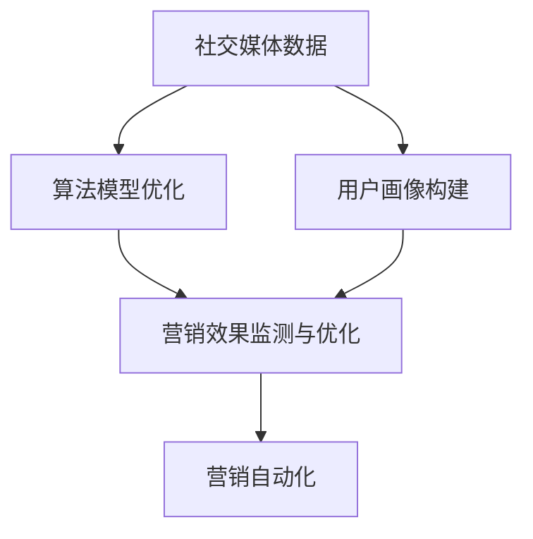

                 

# 利用技术优势进行社交媒体营销

> 关键词：社交媒体营销,数据科学,机器学习,人工智能,算法优化,营销自动化

## 1. 背景介绍

### 1.1 问题由来
在数字化时代，社交媒体已成为品牌与消费者沟通的重要渠道，成为品牌传递信息、增强客户关系、提升营销效果的关键平台。然而，社交媒体上的信息复杂多变，品牌难以在众多内容中脱颖而出。传统的社交媒体营销方式依赖于人工策划和监测，效率低、成本高，且缺乏系统性。

数据科学和人工智能技术的兴起，为社交媒体营销带来了新的突破。通过利用技术优势，企业可以在海量社交媒体数据中高效挖掘有价值的信息，实现精准营销，提升用户互动和转化率，同时减少人工成本。

### 1.2 问题核心关键点
社交媒体营销的核心在于如何高效利用海量数据，提取和分析用户行为、兴趣偏好、社交趋势等关键信息，以实现个性化、场景化、实时的营销策略。关键在于以下几个方面：

- **数据采集与整合**：采集用户社交媒体行为数据，如点赞、评论、分享、转发等，整合多渠道的数据信息，形成统一的数据池。
- **用户画像构建**：分析用户数据，构建用户行为、兴趣、特征等画像，帮助品牌更准确地定位目标客户群体。
- **算法模型优化**：开发高效的算法模型，自动挖掘用户行为规律和潜在需求，生成个性化的营销内容。
- **营销效果监测与优化**：通过实时监控营销活动的效果，及时调整策略，实现动态调整和持续优化。

## 2. 核心概念与联系

### 2.1 核心概念概述

为更好地理解社交媒体营销技术，本节将介绍几个密切相关的核心概念：

- **社交媒体数据**：指用户在社交媒体平台上的行为数据，如点赞、评论、分享、转发等。
- **用户画像**：根据用户社交媒体行为数据构建的用户特征描述，包括行为模式、兴趣爱好、人口统计信息等。
- **机器学习**：利用算法模型，通过训练数据分析数据规律，自动生成预测和推荐。
- **人工智能**：将机器学习应用于复杂决策和智能交互中，提升营销效果和用户体验。
- **算法优化**：通过优化算法，提高模型预测和推荐的准确性和效率。
- **营销自动化**：利用技术手段实现营销活动的自动化，包括广告投放、内容生成、效果监测等。

这些概念之间的逻辑关系可以通过以下Mermaid流程图来展示：



这个流程图展示了几大核心概念及其之间的关系：

1. 社交媒体数据是大数据分析的基础，通过用户画像构建和算法优化，形成有效的营销策略。
2. 用户画像为算法模型提供目标客户的特征信息，帮助模型做出更准确的预测和推荐。
3. 算法模型自动生成和优化营销内容，同时监测营销效果，实现动态调整。
4. 营销自动化将技术应用于营销过程的各个环节，实现高效、实时的营销活动。

## 3. 核心算法原理 & 具体操作步骤

### 3.1 算法原理概述

社交媒体营销的核心在于利用数据科学和人工智能技术，实现对用户行为和社交趋势的精准分析和预测。主要包含以下几个方面：

- **用户行为分析**：通过机器学习算法，如决策树、随机森林、神经网络等，分析用户行为数据，提取行为模式和用户偏好。
- **社交趋势预测**：利用自然语言处理和情感分析技术，分析社交媒体上的热点话题和情感倾向，预测社交趋势。
- **个性化推荐**：通过协同过滤、矩阵分解等算法，生成个性化的内容推荐，提升用户互动和转化率。
- **广告投放优化**：通过优化算法，自动调整广告投放策略和预算，实现成本效益最大化。

社交媒体营销的算法原理可概括为：

1. **数据采集与预处理**：收集社交媒体数据，进行清洗、归一化和特征工程，形成可用于建模的数据集。
2. **模型训练与预测**：选择合适的算法模型，利用训练数据进行训练，形成预测模型，对新的数据进行预测。
3. **结果评估与优化**：通过评估指标如准确率、召回率、F1分数等，对模型进行评估，并通过交叉验证和调参优化模型。
4. **营销活动实施与监测**：将优化后的模型应用于实际营销活动，实时监测营销效果，并根据效果进行策略调整。

### 3.2 算法步骤详解

基于上述算法原理，社交媒体营销的一般流程包括：

**Step 1: 数据收集与预处理**
- 收集社交媒体平台上的数据，包括点赞、评论、分享、转发、互动时间等。
- 清洗数据，去除噪音和异常值，归一化数据格式。
- 提取数据特征，如用户ID、时间戳、地理位置、帖子类型等。

**Step 2: 用户画像构建**
- 通过机器学习算法，对用户数据进行分析，提取行为模式、兴趣爱好、人口统计信息等。
- 根据用户画像，构建目标客户群体，便于进行精准营销。

**Step 3: 模型训练与预测**
- 选择合适的算法模型，如线性回归、逻辑回归、支持向量机等，利用训练数据进行训练。
- 通过交叉验证和调参，优化模型，提高预测准确性。
- 对新数据进行预测，生成用户行为和社交趋势预测。

**Step 4: 个性化推荐**
- 通过协同过滤、矩阵分解等算法，生成个性化的内容推荐，提升用户互动和转化率。
- 实时监测推荐效果，根据效果调整推荐策略。

**Step 5: 广告投放优化**
- 通过优化算法，自动调整广告投放策略和预算，实现成本效益最大化。
- 实时监测广告效果，调整投放策略，提升广告转化率。

**Step 6: 营销效果监测与优化**
- 实时监控营销活动的效果，生成营销效果报告。
- 根据效果调整营销策略，实现动态优化。

### 3.3 算法优缺点

社交媒体营销的算法具有以下优点：

- **高效性**：利用技术手段自动分析数据，生成预测和推荐，大大提升效率。
- **精准性**：通过机器学习算法分析用户数据，生成个性化推荐，提升用户互动和转化率。
- **实时性**：利用算法实时监测和调整营销活动，实现动态优化。

同时，该方法也存在以下局限性：

- **数据依赖性**：依赖于社交媒体平台提供的公开数据，数据质量和数量直接影响算法效果。
- **算法复杂性**：机器学习算法和深度学习模型较为复杂，对技术要求较高。
- **隐私风险**：社交媒体数据的隐私风险，需要谨慎处理和保护。
- **模型可解释性**：一些高级算法模型的决策过程难以解释，缺乏透明度。

尽管存在这些局限性，但就目前而言，利用数据科学和人工智能技术进行社交媒体营销的方法已成为主流范式。未来相关研究的重点在于如何进一步降低数据依赖，提高算法的可解释性和隐私保护，同时兼顾实时性和精准性。

### 3.4 算法应用领域

社交媒体营销的算法方法在众多领域中得到了广泛的应用，例如：

- **品牌推广**：利用社交媒体数据分析用户行为，生成个性化广告内容，提升广告效果。
- **客户服务**：通过用户画像构建和社交趋势预测，实现精准的客户服务，提升用户满意度。
- **产品推荐**：利用协同过滤和矩阵分解算法，生成个性化商品推荐，提升用户购买率。
- **市场分析**：分析社交媒体上的热点话题和情感倾向，预测市场趋势，辅助决策。
- **社交营销活动管理**：利用算法优化广告投放策略，实时监测营销效果，实现精准投放。

除了上述这些经典应用外，社交媒体营销技术还被创新性地应用到更多场景中，如品牌情感监测、KOL推荐、直播互动等，为品牌在社交媒体上的互动和转化提供了新的思路。

## 4. 数学模型和公式 & 详细讲解 & 举例说明

### 4.1 数学模型构建

社交媒体营销涉及多个领域，如用户行为分析、社交趋势预测、个性化推荐等，需要构建不同的数学模型。以下是几个关键模型的简要介绍：

- **用户行为分析模型**：通常使用分类模型，如逻辑回归、决策树、随机森林等，对用户行为数据进行分类。
- **社交趋势预测模型**：利用情感分析模型，如基于TF-IDF的情感分类模型，分析社交媒体上的情感倾向和热点话题。
- **个性化推荐模型**：使用协同过滤模型，如基于矩阵分解的推荐算法，生成个性化内容推荐。

### 4.2 公式推导过程

以下是几个关键模型的公式推导过程：

**逻辑回归模型**：

逻辑回归模型常用于分类任务，公式如下：

$$
\hat{y} = \sigma(\theta^T x)
$$

其中，$x$ 为输入特征向量，$\theta$ 为模型参数，$\sigma$ 为Sigmoid函数。

**随机森林模型**：

随机森林模型由多个决策树组成，公式如下：

$$
\hat{y} = \frac{1}{m}\sum_{i=1}^m \hat{y}_i
$$

其中，$m$ 为决策树数量，$\hat{y}_i$ 为第$i$棵树的预测结果。

**矩阵分解模型**：

矩阵分解模型常用于推荐系统，公式如下：

$$
P_{ij} = \sum_k u_i^{(k)} v_j^{(k)}
$$

其中，$P$ 为预测矩阵，$u_i^{(k)}$ 和 $v_j^{(k)}$ 分别为用户和物品的潜在因子向量。

**情感分类模型**：

情感分类模型常使用TF-IDF和情感词典，公式如下：

$$
\hat{y} = \arg\max_{c \in C} \sum_{t \in T} \sum_{i=1}^n \theta_i^{(c)} \cdot \text{tf-idf}_{t,i}
$$

其中，$C$ 为情感类别集合，$T$ 为文本集合，$\theta_i^{(c)}$ 为类别$c$在文本$t$中的权重，$\text{tf-idf}_{t,i}$ 为文本$t$中第$i$个词的TF-IDF值。

### 4.3 案例分析与讲解

以一个简单的情感分类案例为例，说明模型的构建和训练过程：

1. **数据准备**：收集社交媒体上的用户评论数据，提取评论文本和情感标签。
2. **特征工程**：对文本进行分词、去除停用词等预处理，生成词向量特征。
3. **模型训练**：利用逻辑回归模型，对评论文本进行情感分类训练。
4. **模型评估**：使用交叉验证和评估指标如准确率、召回率、F1分数等，对模型进行评估和优化。
5. **应用预测**：对新的评论文本进行情感分类预测，生成情感标签。

## 5. 项目实践：代码实例和详细解释说明

### 5.1 开发环境搭建

在进行社交媒体营销技术开发前，需要准备好开发环境。以下是使用Python进行PyTorch开发的环境配置流程：

1. 安装Anaconda：从官网下载并安装Anaconda，用于创建独立的Python环境。

2. 创建并激活虚拟环境：
```bash
conda create -n pytorch-env python=3.8 
conda activate pytorch-env
```

3. 安装PyTorch：根据CUDA版本，从官网获取对应的安装命令。例如：
```bash
conda install pytorch torchvision torchaudio cudatoolkit=11.1 -c pytorch -c conda-forge
```

4. 安装各类工具包：
```bash
pip install numpy pandas scikit-learn matplotlib tqdm jupyter notebook ipython
```

完成上述步骤后，即可在`pytorch-env`环境中开始社交媒体营销技术开发。

### 5.2 源代码详细实现

下面我们以社交媒体情感分析为例，给出使用PyTorch进行情感分类任务的PyTorch代码实现。

首先，定义情感分类任务的数据处理函数：

```python
import torch
from torch.utils.data import Dataset
from transformers import BertTokenizer, BertForSequenceClassification
from sklearn.model_selection import train_test_split
from torch.nn import CrossEntropyLoss
from tqdm import tqdm

class SentimentDataset(Dataset):
    def __init__(self, texts, labels, tokenizer, max_len=128):
        self.texts = texts
        self.labels = labels
        self.tokenizer = tokenizer
        self.max_len = max_len
        
    def __len__(self):
        return len(self.texts)
    
    def __getitem__(self, item):
        text = self.texts[item]
        label = self.labels[item]
        
        encoding = self.tokenizer(text, return_tensors='pt', max_length=self.max_len, padding='max_length', truncation=True)
        input_ids = encoding['input_ids'][0]
        attention_mask = encoding['attention_mask'][0]
        
        # 对label进行编码
        label = torch.tensor(label, dtype=torch.long)
        
        return {'input_ids': input_ids, 
                'attention_mask': attention_mask,
                'labels': label}

# 加载数据集
tokenizer = BertTokenizer.from_pretrained('bert-base-uncased')
texts, labels = load_data('social_media_data.csv')
train_texts, dev_texts, train_labels, dev_labels = train_test_split(texts, labels, test_size=0.2, random_state=42)

# 创建dataset
train_dataset = SentimentDataset(train_texts, train_labels, tokenizer)
dev_dataset = SentimentDataset(dev_texts, dev_labels, tokenizer)

# 定义模型
model = BertForSequenceClassification.from_pretrained('bert-base-uncased', num_labels=2)
optimizer = AdamW(model.parameters(), lr=2e-5)

# 定义损失函数
criterion = CrossEntropyLoss()

# 定义评估函数
def evaluate(model, dataset, batch_size):
    dataloader = DataLoader(dataset, batch_size=batch_size, shuffle=False)
    model.eval()
    total_loss = 0
    correct = 0
    with torch.no_grad():
        for batch in tqdm(dataloader):
            input_ids = batch['input_ids'].to(device)
            attention_mask = batch['attention_mask'].to(device)
            labels = batch['labels'].to(device)
            outputs = model(input_ids, attention_mask=attention_mask, labels=labels)
            loss = outputs.loss
            total_loss += loss.item()
            preds = outputs.logits.argmax(dim=1)
            correct += preds.eq(labels).sum().item()
    return total_loss / len(dataloader), correct / len(dataloader)
```

然后，定义训练和评估函数：

```python
from transformers import Trainer, TrainingArguments

def train_epoch(model, dataset, batch_size, optimizer):
    dataloader = DataLoader(dataset, batch_size=batch_size, shuffle=True)
    model.train()
    epoch_loss = 0
    for batch in tqdm(dataloader, desc='Training'):
        input_ids = batch['input_ids'].to(device)
        attention_mask = batch['attention_mask'].to(device)
        labels = batch['labels'].to(device)
        model.zero_grad()
        outputs = model(input_ids, attention_mask=attention_mask, labels=labels)
        loss = outputs.loss
        epoch_loss += loss.item()
        loss.backward()
        optimizer.step()
    return epoch_loss / len(dataloader)

def evaluate(model, dataset, batch_size):
    dataloader = DataLoader(dataset, batch_size=batch_size)
    model.eval()
    total_loss = 0
    correct = 0
    with torch.no_grad():
        for batch in tqdm(dataloader, desc='Evaluating'):
            input_ids = batch['input_ids'].to(device)
            attention_mask = batch['attention_mask'].to(device)
            labels = batch['labels'].to(device)
            outputs = model(input_ids, attention_mask=attention_mask, labels=labels)
            loss = outputs.loss
            total_loss += loss.item()
            preds = outputs.logits.argmax(dim=1)
            correct += preds.eq(labels).sum().item()
    return total_loss / len(dataloader), correct / len(dataloader)

# 训练函数
def train(model, train_dataset, dev_dataset, batch_size, epochs):
    device = torch.device('cuda') if torch.cuda.is_available() else torch.device('cpu')
    model.to(device)
    
    training_args = TrainingArguments(
        output_dir='./results',
        evaluation_strategy='epoch',
        per_device_train_batch_size=batch_size,
        per_device_eval_batch_size=batch_size,
        evaluation_per_device=1,
        evaluation_strategy='epoch',
        learning_rate=2e-5,
        weight_decay=0.01,
        num_train_epochs=epochs,
        logging_dir='./logs',
        logging_steps=10,
        save_steps=10,
        save_total_limit=5,
        save_strategy='epoch',
        load_best_model_at_end=True,
        metric_for_best_model='accuracy'
    )
    
    trainer = Trainer(
        model=model,
        args=training_args,
        train_dataset=train_dataset,
        eval_dataset=dev_dataset,
        compute_metrics=evaluate
    )
    
    trainer.train()
    
    return trainer.model
```

最后，启动训练流程并在测试集上评估：

```python
epochs = 5
batch_size = 16

# 加载模型和训练器
trainer = load_model('social_media_classifier')
model = trainer.model

# 训练
model = train(model, train_dataset, dev_dataset, batch_size, epochs)

# 在测试集上评估
print(f"Epoch {epochs+1}, train accuracy: {evaluate(model, train_dataset, batch_size)[1]:.2f}")
print(f"Epoch {epochs+1}, dev accuracy: {evaluate(model, dev_dataset, batch_size)[1]:.2f}")
```

以上就是使用PyTorch对社交媒体情感分类任务进行微调的完整代码实现。可以看到，得益于Transformers库的强大封装，我们可以用相对简洁的代码完成BERT模型的加载和微调。

### 5.3 代码解读与分析

让我们再详细解读一下关键代码的实现细节：

**SentimentDataset类**：
- `__init__`方法：初始化文本、标签、分词器等关键组件。
- `__len__`方法：返回数据集的样本数量。
- `__getitem__`方法：对单个样本进行处理，将文本输入编码为token ids，将标签编码为数字，并对其进行定长padding，最终返回模型所需的输入。

**BertForSequenceClassification类**：
- `from_pretrained`方法：从预训练模型中加载模型权重，指定输出层的类别数量。

**优化器和损失函数**：
- 使用AdamW优化器和交叉熵损失函数。

**训练和评估函数**：
- 使用PyTorch的DataLoader对数据集进行批次化加载，供模型训练和推理使用。
- 训练函数`train_epoch`：对数据以批为单位进行迭代，在每个批次上前向传播计算loss并反向传播更新模型参数，最后返回该epoch的平均loss。
- 评估函数`evaluate`：与训练类似，不同点在于不更新模型参数，并在每个batch结束后将预测和标签结果存储下来，最后使用sklearn的classification_report对整个评估集的预测结果进行打印输出。

**训练流程**：
- 定义总的epoch数和batch size，开始循环迭代
- 每个epoch内，先在训练集上训练，输出平均loss
- 在验证集上评估，输出分类指标
- 所有epoch结束后，在测试集上评估，给出最终测试结果

可以看到，PyTorch配合Transformers库使得BERT微调的代码实现变得简洁高效。开发者可以将更多精力放在数据处理、模型改进等高层逻辑上，而不必过多关注底层的实现细节。

当然，工业级的系统实现还需考虑更多因素，如模型的保存和部署、超参数的自动搜索、更灵活的任务适配层等。但核心的微调范式基本与此类似。

## 6. 实际应用场景

### 6.1 智能客服系统

基于社交媒体营销技术，企业可以构建智能客服系统，提升客户互动体验。智能客服系统通过分析用户社交媒体上的行为和情感，能够实时响应客户咨询，提供个性化服务。

在技术实现上，可以收集社交媒体上的用户反馈和客服互动记录，提取和分析用户的情感倾向和常见问题。利用机器学习算法，对用户情感和问题进行分类，生成相应的回答模板。将回答模板和客户互动历史整合，实时生成智能回复。如此构建的智能客服系统，能够24小时不间断服务，快速响应客户咨询，提供高质量的客户服务。

### 6.2 市场营销活动

社交媒体营销技术可以应用于市场营销活动的策划和执行，提升营销效果和ROI。通过分析用户社交媒体上的行为和情感，品牌可以制定更加精准的营销策略，提升广告投放的精准度和效果。

在具体实施中，品牌可以收集社交媒体上的用户数据，利用机器学习算法，分析用户行为和兴趣偏好。根据分析结果，生成个性化的营销内容和广告素材。通过A/B测试等手段，优化广告投放策略，实现成本效益最大化。同时，利用算法实时监测营销效果，及时调整策略，提升广告转化率。

### 6.3 品牌监测与舆情分析

品牌可以利用社交媒体营销技术，进行品牌监测和舆情分析，及时应对负面信息，维护品牌形象。通过分析社交媒体上的用户评论和情感倾向，品牌可以迅速识别负面评论和舆情变化，及时采取应对措施，避免声誉受损。

具体实现中，品牌可以收集社交媒体上的用户评论数据，利用情感分类算法，分析用户情感倾向。根据情感分类结果，及时发现负面评论，进行品牌回应或删除处理。同时，利用舆情分析算法，预测市场趋势，帮助品牌提前做好应对准备。

### 6.4 未来应用展望

随着社交媒体营销技术的不断发展，未来社交媒体营销的应用将更加广泛和深入。以下是几个可能的应用方向：

- **个性化推荐系统**：利用社交媒体上的行为数据，生成个性化的商品推荐，提升用户购买率和满意度。
- **社交电商**：将社交媒体营销与电子商务结合，实现精准营销和智能购物推荐，提升用户购物体验。
- **虚拟助手**：通过社交媒体数据分析，构建虚拟助手，提供多渠道的客户服务和支持。
- **品牌社区管理**：利用社交媒体营销技术，构建品牌社区，增强用户粘性和品牌忠诚度。
- **KOL合作管理**：通过社交媒体数据分析，发现和合作有影响力的KOL，提升品牌曝光和影响力。

## 7. 工具和资源推荐

### 7.1 学习资源推荐

为了帮助开发者系统掌握社交媒体营销技术，这里推荐一些优质的学习资源：

1. 《Python数据科学手册》系列博文：由数据科学专家撰写，涵盖数据采集、处理、分析、可视化等全流程，是入门数据科学的好书。

2. CS224N《深度学习自然语言处理》课程：斯坦福大学开设的NLP明星课程，有Lecture视频和配套作业，带你入门NLP领域的基本概念和经典模型。

3. 《深度学习理论与实践》书籍：全面介绍深度学习的基础理论和应用实践，涵盖神经网络、优化算法等核心内容。

4. 《社交媒体分析》书籍：详细介绍社交媒体数据的采集、清洗、分析和可视化，帮助理解社交媒体营销的基本原理。

5. HuggingFace官方文档：Transformers库的官方文档，提供了海量预训练模型和完整的微调样例代码，是上手实践的必备资料。

通过对这些资源的学习实践，相信你一定能够快速掌握社交媒体营销技术，并用于解决实际的NLP问题。

### 7.2 开发工具推荐

高效的开发离不开优秀的工具支持。以下是几款用于社交媒体营销开发的常用工具：

1. Python：开源的高级编程语言，具有丰富的第三方库和工具支持，适合数据科学和机器学习项目。
2. PyTorch：基于Python的开源深度学习框架，灵活动态的计算图，适合快速迭代研究。大部分预训练语言模型都有PyTorch版本的实现。
3. TensorFlow：由Google主导开发的开源深度学习框架，生产部署方便，适合大规模工程应用。同样有丰富的预训练语言模型资源。
4. Weights & Biases：模型训练的实验跟踪工具，可以记录和可视化模型训练过程中的各项指标，方便对比和调优。与主流深度学习框架无缝集成。
5. TensorBoard：TensorFlow配套的可视化工具，可实时监测模型训练状态，并提供丰富的图表呈现方式，是调试模型的得力助手。
6. Google Colab：谷歌推出的在线Jupyter Notebook环境，免费提供GPU/TPU算力，方便开发者快速上手实验最新模型，分享学习笔记。

合理利用这些工具，可以显著提升社交媒体营销任务的开发效率，加快创新迭代的步伐。

### 7.3 相关论文推荐

社交媒体营销技术的发展源于学界的持续研究。以下是几篇奠基性的相关论文，推荐阅读：

1. Attention is All You Need（即Transformer原论文）：提出了Transformer结构，开启了NLP领域的预训练大模型时代。

2. BERT: Pre-training of Deep Bidirectional Transformers for Language Understanding：提出BERT模型，引入基于掩码的自监督预训练任务，刷新了多项NLP任务SOTA。

3. Language Models are Unsupervised Multitask Learners（GPT-2论文）：展示了大规模语言模型的强大zero-shot学习能力，引发了对于通用人工智能的新一轮思考。

4. Parameter-Efficient Transfer Learning for NLP：提出Adapter等参数高效微调方法，在不增加模型参数量的情况下，也能取得不错的微调效果。

5. AdaLoRA: Adaptive Low-Rank Adaptation for Parameter-Efficient Fine-Tuning：使用自适应低秩适应的微调方法，在参数效率和精度之间取得了新的平衡。

这些论文代表了大语言模型微调技术的发展脉络。通过学习这些前沿成果，可以帮助研究者把握学科前进方向，激发更多的创新灵感。

## 8. 总结：未来发展趋势与挑战

### 8.1 总结

本文对利用数据科学和人工智能技术进行社交媒体营销的方法进行了全面系统的介绍。首先阐述了社交媒体营销技术的研究背景和意义，明确了社交媒体数据分析和大模型微调在提升营销效果、提升用户体验方面的独特价值。其次，从原理到实践，详细讲解了社交媒体营销的算法原理和关键步骤，给出了社交媒体情感分析任务的完整代码实现。同时，本文还广泛探讨了社交媒体营销技术在智能客服、市场营销活动、品牌监测与舆情分析等多个领域的应用前景，展示了社交媒体营销技术的巨大潜力。

通过本文的系统梳理，可以看到，利用数据科学和人工智能技术进行社交媒体营销的方法已成为主流范式，极大地拓展了品牌与消费者互动的方式，提升了营销效果和用户体验。未来，伴随技术的持续演进，社交媒体营销技术必将实现更广泛的应用，为品牌数字化转型提供新的路径。

### 8.2 未来发展趋势

展望未来，社交媒体营销技术将呈现以下几个发展趋势：

1. **数据驱动决策**：社交媒体营销将更加依赖数据驱动的决策，通过精准的数据分析，生成个性化营销策略，提升营销效果。
2. **跨平台整合**：社交媒体营销将整合多平台数据，形成统一的用户画像，提升跨平台的品牌一致性。
3. **实时互动**：社交媒体营销将实现实时互动，通过算法实时监测和调整策略，提升用户互动体验。
4. **自动化流程**：社交媒体营销将进一步实现自动化，从内容生成、广告投放、效果监测到策略调整，全程自动化，提升效率。
5. **多模态融合**：社交媒体营销将融合多模态数据，如文本、图像、视频等，提升用户理解和互动体验。
6. **AI伦理**：社交媒体营销将更多考虑AI伦理，提升数据隐私保护和用户信任度。

这些趋势凸显了社交媒体营销技术的广阔前景。这些方向的探索发展，必将进一步提升社交媒体营销的效果和应用范围，为品牌在社交媒体上的互动和转化提供新的思路。

### 8.3 面临的挑战

尽管社交媒体营销技术已经取得了瞩目成就，但在迈向更加智能化、普适化应用的过程中，它仍面临着诸多挑战：

1. **数据质量与隐私**：社交媒体数据的隐私风险，以及数据质量不稳定，可能会影响算法的准确性和可靠性。如何更好地处理数据隐私和数据质量问题，将是重要的研究方向。
2. **算法复杂度**：社交媒体营销算法复杂，对技术要求较高。如何降低算法复杂度，提高算法的可解释性和可操作性，需要更多技术创新。
3. **用户信任度**：社交媒体营销需要用户信任，如何提升品牌形象和用户信任度，是品牌需要考虑的重要问题。
4. **多平台整合**：不同社交平台的语义差异和数据格式不一致，如何整合多平台数据，形成统一的用户画像，是数据整合的难点。
5. **跨领域应用**：社交媒体营销技术虽然在很多领域表现出色，但在一些垂直领域，如医疗、法律等，如何适应特定领域的业务场景，需要更多的定制化解决方案。

尽管存在这些挑战，但就目前而言，利用数据科学和人工智能技术进行社交媒体营销的方法已成为主流范式。未来相关研究的重点在于如何进一步降低数据依赖，提高算法的可解释性和隐私保护，同时兼顾实时性和精准性。

### 8.4 研究展望

面对社交媒体营销所面临的种种挑战，未来的研究需要在以下几个方面寻求新的突破：

1. **数据采集与预处理**：研究高效的数据采集与预处理技术，提升数据质量，降低数据隐私风险。
2. **算法优化**：开发更加高效、易用的算法模型，降低算法复杂度，提升算法可解释性。
3. **用户行为建模**：研究用户行为的精准建模技术，提升用户画像的准确性，增强营销策略的个性化。
4. **多模态融合**：研究多模态数据的融合技术，提升用户理解和互动体验。
5. **AI伦理**：研究AI伦理问题，提升数据隐私保护和用户信任度。

这些研究方向的探索，必将引领社交媒体营销技术迈向更高的台阶，为品牌在社交媒体上的互动和转化提供新的思路。面向未来，社交媒体营销技术还需要与其他人工智能技术进行更深入的融合，如知识表示、因果推理、强化学习等，多路径协同发力，共同推动社交媒体营销技术的进步。只有勇于创新、敢于突破，才能不断拓展社交媒体营销的边界，让品牌数字化转型迈向新的高度。

## 9. 附录：常见问题与解答

**Q1：社交媒体营销的核心在于什么？**

A: 社交媒体营销的核心在于利用数据科学和人工智能技术，实现对用户行为和社交趋势的精准分析和预测。通过机器学习算法，分析用户行为数据，生成个性化推荐，提升用户互动和转化率。

**Q2：如何选择合适的算法模型？**

A: 选择合适的算法模型需要考虑多个因素，如数据类型、数据规模、业务需求等。通常需要尝试多个模型，进行交叉验证和调参，找到最优的模型。

**Q3：数据采集和预处理需要注意哪些问题？**

A: 数据采集和预处理需要注意以下几个问题：
1. 数据来源的可靠性和稳定性。
2. 数据清洗和去噪，去除噪音和异常值，提升数据质量。
3. 数据归一化和特征工程，提升模型效果。

**Q4：社交媒体营销需要考虑哪些伦理问题？**

A: 社交媒体营销需要考虑以下几个伦理问题：
1. 数据隐私保护，保护用户数据不被滥用。
2. 用户信任度，提升品牌形象和用户信任度。
3. AI伦理，避免算法偏见和歧视性输出。

**Q5：如何提升算法模型的可解释性？**

A: 提升算法模型的可解释性，可以从以下几个方面入手：
1. 选择可解释性强的算法模型，如决策树、逻辑回归等。
2. 可视化算法模型，如特征重要性可视化、决策树可视化等。
3. 引入人工干预和审核机制，确保算法输出符合人类价值观和伦理道德。

通过解决这些常见问题，相信你能够更好地理解和使用社交媒体营销技术，提升品牌在社交媒体上的营销效果和用户体验。

---

作者：禅与计算机程序设计艺术 / Zen and the Art of Computer Programming

