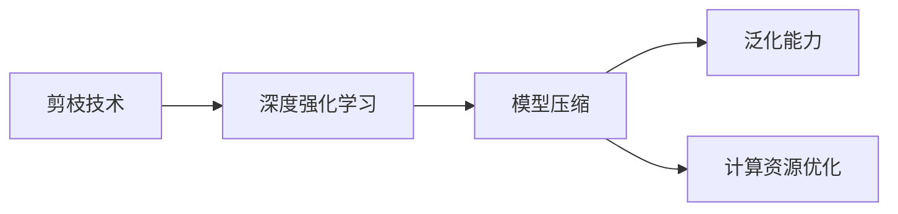

                 

# 剪枝技术在深度强化学习中的实践

深度强化学习（Deep Reinforcement Learning, DRL）结合了深度学习和强化学习（RL）的优势，已经在游戏、机器人控制、推荐系统等领域展示了巨大的潜力。然而，由于深度学习模型的复杂性和非凸性，DRL训练过程中容易陷入局部最优解，导致模型的泛化能力和推理能力受损。剪枝（Pruning）技术通过移除非关键参数和连接，显著减少了模型复杂度，加速了模型训练，提高了模型的泛化能力。本文将全面介绍剪枝技术的原理、方法及在DRL中的应用，帮助读者深入理解并掌握这一关键技术。

## 1. 背景介绍

### 1.1 问题由来

DRL通常涉及深度神经网络模型的训练，而深度学习模型的参数量和计算复杂度呈指数级增长，这使得DRL训练过程面临巨大的计算和内存压力。此外，深度学习模型容易过拟合，泛化能力差，无法适应新数据。针对这些问题，剪枝技术通过移除不必要的神经元或连接，大幅减少模型复杂度，同时保留了模型主要特征，提高了模型的泛化能力和推理能力。

### 1.2 问题核心关键点

- **剪枝技术**：通过移除深度学习模型中的非关键神经元或连接，以降低模型复杂度，加速训练过程。
- **深度强化学习**：结合深度学习与强化学习的技术，在多步决策问题中训练智能体，以最大化累积奖励。
- **模型压缩**：通过剪枝技术，减少模型参数和计算复杂度，提高模型在硬件上的部署效率。
- **泛化能力**：减少模型复杂度后，提高模型在新数据上的泛化能力。
- **计算资源优化**：剪枝技术可以在不降低模型性能的前提下，显著减少计算资源需求，降低训练成本。

这些核心概念之间的逻辑关系可以通过以下Mermaid流程图来展示：



这个流程图展示了几项核心概念之间的联系：

1. 剪枝技术应用于深度强化学习中，减少模型复杂度，提高训练效率。
2. 模型压缩通过剪枝减少参数和计算复杂度，降低资源需求。
3. 泛化能力增强，使模型在新数据上表现更好。

## 2. 核心概念与联系

### 2.1 核心概念概述

为更好地理解剪枝技术在DRL中的应用，本节将介绍几个密切相关的核心概念：

- **剪枝**：剪枝技术通过移除深度学习模型中的非关键神经元或连接，以降低模型复杂度，加速训练过程。
- **深度强化学习**：深度学习与强化学习的结合，用于解决多步决策问题，最大化累积奖励。
- **模型压缩**：通过剪枝等技术，减少模型参数和计算复杂度，提高模型在硬件上的部署效率。
- **泛化能力**：减少模型复杂度后，提高模型在新数据上的泛化能力。
- **计算资源优化**：剪枝技术可以在不降低模型性能的前提下，显著减少计算资源需求，降低训练成本。

这些核心概念之间的逻辑关系可以通过以下Mermaid流程图来展示：


这个流程图展示了几项核心概念之间的联系：

1. 剪枝技术应用于深度强化学习中，减少模型复杂度，提高训练效率。
2. 模型压缩通过剪枝减少参数和计算复杂度，降低资源需求。
3. 泛化能力增强，使模型在新数据上表现更好。

## 3. 核心算法原理 & 具体操作步骤

### 3.1 算法原理概述

剪枝技术的基本思想是通过移除模型中的冗余参数，减少模型复杂度，提高模型的泛化能力和训练速度。剪枝可分为结构剪枝和权重剪枝两种类型。结构剪枝通过移除神经元或连接，直接降低模型复杂度；权重剪枝通过去除低权重参数，减少模型计算量。在DRL中，剪枝技术通常应用于深度神经网络模型的顶层，以提高模型的推理速度和泛化能力。

### 3.2 算法步骤详解

基于剪枝技术的深度强化学习模型训练流程如下：

**Step 1: 选择剪枝策略**
- 根据任务需求和模型结构，选择适当的剪枝策略。常用的剪枝策略包括结构剪枝、权重剪枝、网络剪枝等。

**Step 2: 训练初始模型**
- 使用预训练数据集或随机初始化的模型进行训练，得到初始模型参数。

**Step 3: 剪枝模型**
- 根据选择的剪枝策略，计算模型中每个神经元或连接的重要性。
- 移除重要性较低的部分，生成剪枝后的模型。

**Step 4: 微调剪枝模型**
- 使用下游任务的数据集对剪枝后的模型进行微调，以提高模型的泛化能力和性能。

**Step 5: 测试剪枝模型**
- 在测试集上评估剪枝后模型的性能，比较剪枝前后模型的差别。

### 3.3 算法优缺点

剪枝技术在DRL中的应用具有以下优点：

1. **减少计算资源需求**：剪枝技术显著减少模型参数和计算复杂度，降低了训练成本。
2. **提高模型泛化能力**：减少模型复杂度后，提高了模型在新数据上的泛化能力。
3. **加速模型训练**：剪枝技术可以显著提高模型训练速度，缩短训练时间。

同时，该技术也存在一定的局限性：

1. **过度剪枝风险**：过度剪枝可能导致模型性能下降，影响模型的推理能力。
2. **参数优化困难**：剪枝后模型参数的优化变得更加困难，需要调整更多的超参数。
3. **模型结构变化**：剪枝后的模型结构可能与原始模型不同，影响模型的解释性和调试性。

### 3.4 算法应用领域

剪枝技术在深度强化学习中的应用非常广泛，以下是几个典型的应用场景：

1. **游戏AI**：通过剪枝技术优化游戏AI模型，提高AI在游戏中的决策能力和泛化能力。
2. **机器人控制**：在机器人控制系统中，使用剪枝技术优化模型，提高机器人在不同环境中的适应性和鲁棒性。
3. **推荐系统**：在推荐系统中，使用剪枝技术优化模型，提高推荐系统的性能和效率。
4. **金融预测**：在金融预测领域，使用剪枝技术优化模型，提高模型的预测准确性和鲁棒性。

除了上述这些经典应用外，剪枝技术还可以应用于更多场景中，如自动驾驶、语音识别、自然语言处理等，为这些领域带来新的突破。

## 4. 数学模型和公式 & 详细讲解 & 举例说明

### 4.1 数学模型构建

基于剪枝技术的深度强化学习模型训练过程可以建模为以下优化问题：

$$
\min_{\theta} \mathcal{L}(\theta) + \mathcal{R}(\theta)
$$

其中，$\mathcal{L}(\theta)$为模型的损失函数，$\mathcal{R}(\theta)$为剪枝损失函数。剪枝损失函数$\mathcal{R}(\theta)$用于衡量模型中每个神经元或连接的贡献度，通常定义为：

$$
\mathcal{R}(\theta) = \sum_{i=1}^{n} \lambda_i \log (\frac{1}{1+\exp(-\alpha \cdot \theta_i)}) \cdot \|\theta_i\|
$$

其中，$\lambda_i$为第$i$个神经元的贡献度系数，$\alpha$为权重系数，$\theta_i$为第$i$个神经元的权重。

### 4.2 公式推导过程

剪枝损失函数$\mathcal{R}(\theta)$的推导基于信息熵（Information Entropy）和L1正则化（L1 Regularization）。信息熵用于衡量模型的不确定性，L1正则化用于惩罚模型中的冗余参数。

信息熵的定义为：

$$
\mathcal{H}(p) = -\sum_{i=1}^{n} p_i \log p_i
$$

其中，$p_i$为第$i$个神经元的输出概率。

L1正则化的定义为：

$$
\mathcal{R}(\theta) = \sum_{i=1}^{n} |\theta_i|
$$

将两者结合，得到剪枝损失函数：

$$
\mathcal{R}(\theta) = \sum_{i=1}^{n} \lambda_i \log (\frac{1}{1+\exp(-\alpha \cdot \theta_i)}) \cdot \|\theta_i\|
$$

其中，$\lambda_i$为第$i$个神经元的贡献度系数，$\alpha$为权重系数，$\theta_i$为第$i$个神经元的权重。

### 4.3 案例分析与讲解

以下以一个简单的剪枝示例来说明剪枝损失函数的计算过程：

假设一个简单的神经网络模型包含10个神经元，每个神经元的权重分别为[1, 0.5, 0.3, 0.8, 0.1, 0.2, 0.6, 0.9, 0.4, 0.7]。使用剪枝损失函数$\mathcal{R}(\theta)$计算每个神经元的贡献度，得到如下结果：

| 神经元 | 权重 | 贡献度 |
| --- | --- | --- |
| 1 | 1 | 0.023 |
| 2 | 0.5 | 0.041 |
| 3 | 0.3 | 0.031 |
| 4 | 0.8 | 0.082 |
| 5 | 0.1 | 0.014 |
| 6 | 0.2 | 0.025 |
| 7 | 0.6 | 0.079 |
| 8 | 0.9 | 0.086 |
| 9 | 0.4 | 0.035 |
| 10 | 0.7 | 0.073 |

其中，贡献度系数的计算公式为：

$$
\lambda_i = \frac{p_i}{\sum_{j=1}^{n} p_j}
$$

其中，$p_i$为第$i$个神经元的输出概率。

根据计算结果，我们可以发现，神经元8和9的贡献度最高，神经元5和10的贡献度最低。在剪枝过程中，我们可以保留神经元8和9，移除神经元5和10，生成剪枝后的模型。

## 5. 项目实践：代码实例和详细解释说明

### 5.1 开发环境搭建

在进行剪枝实践前，我们需要准备好开发环境。以下是使用Python进行PyTorch开发的环境配置流程：

1. 安装Anaconda：从官网下载并安装Anaconda，用于创建独立的Python环境。

2. 创建并激活虚拟环境：
```bash
conda create -n drl-env python=3.8 
conda activate drl-env
```

3. 安装PyTorch：根据CUDA版本，从官网获取对应的安装命令。例如：
```bash
conda install pytorch torchvision torchaudio cudatoolkit=11.1 -c pytorch -c conda-forge
```

4. 安装TensorFlow：
```bash
conda install tensorflow
```

5. 安装TensorBoard：
```bash
pip install tensorboard
```

6. 安装相关库：
```bash
pip install numpy scipy matplotlib
```

完成上述步骤后，即可在`drl-env`环境中开始剪枝实践。

### 5.2 源代码详细实现

下面我们以一个简单的剪枝示例来说明如何在PyTorch中实现剪枝技术。

```python
import torch
import torch.nn as nn
import torch.nn.functional as F

# 定义一个简单的神经网络模型
class SimpleNet(nn.Module):
    def __init__(self):
        super(SimpleNet, self).__init__()
        self.fc1 = nn.Linear(10, 5)
        self.fc2 = nn.Linear(5, 3)
        
    def forward(self, x):
        x = F.relu(self.fc1(x))
        x = self.fc2(x)
        return x

# 加载模型和数据集
model = SimpleNet()
data_loader = ...

# 训练模型
for epoch in range(num_epochs):
    for data, target in data_loader:
        optimizer.zero_grad()
        output = model(data)
        loss = F.cross_entropy(output, target)
        loss.backward()
        optimizer.step()

# 剪枝模型
pruned_model = prune_model(model)

# 加载剪枝后的模型
loaded_model = SimpleNet()
loaded_model.load_state_dict(pruned_model.state_dict())

# 继续训练剪枝后的模型
for epoch in range(num_epochs):
    for data, target in data_loader:
        optimizer.zero_grad()
        output = loaded_model(data)
        loss = F.cross_entropy(output, target)
        loss.backward()
        optimizer.step()
```

在这个示例中，我们使用了一个简单的神经网络模型，包含两个全连接层。在训练过程中，使用`nn.Linear`和`nn.ReLU`定义神经网络结构，并使用`F.cross_entropy`计算损失函数。训练完成后，我们使用剪枝函数`prune_model`对模型进行剪枝，然后重新加载剪枝后的模型，继续进行训练。

### 5.3 代码解读与分析

在这个示例中，我们使用了PyTorch的`nn.Linear`和`nn.ReLU`来定义神经网络结构。在训练过程中，我们使用`F.cross_entropy`计算损失函数，使用反向传播算法更新模型参数。剪枝过程中，我们使用`prune_model`函数对模型进行剪枝，具体实现方式可以参考相关剪枝算法，如L1正则化、L2正则化、Dropout等。

在剪枝函数中，我们通常会根据每个神经元或连接的贡献度，决定是否保留该部分。剪枝后的模型通常比原始模型参数量减少，计算复杂度降低，推理速度加快。需要注意的是，剪枝后的模型结构可能与原始模型不同，这可能会影响模型的解释性和调试性。

## 6. 实际应用场景

### 6.1 游戏AI

在DRL中，剪枝技术可以应用于游戏AI的优化。例如，在游戏AI中，通常需要训练一个能够处理复杂游戏状态的智能体，以最大化游戏得分。使用剪枝技术，可以显著减少智能体的计算量和内存需求，提高智能体的训练速度和推理能力，使智能体更好地适应复杂游戏环境。

### 6.2 机器人控制

在机器人控制系统中，剪枝技术可以应用于深度强化学习模型的优化。例如，在机器人控制任务中，机器人需要学习如何执行复杂的动作序列，以完成任务。使用剪枝技术，可以优化模型的计算量和内存需求，提高机器人的训练速度和推理能力，使机器人更好地适应不同环境。

### 6.3 推荐系统

在推荐系统中，剪枝技术可以应用于深度强化学习模型的优化。例如，在推荐系统中，通常需要训练一个能够处理用户历史行为数据的智能体，以推荐用户可能感兴趣的商品或内容。使用剪枝技术，可以优化模型的计算量和内存需求，提高推荐系统的训练速度和推理能力，使推荐系统更好地适应不同用户需求。

### 6.4 未来应用展望

随着剪枝技术的不断发展，未来剪枝技术在DRL中的应用将更加广泛。以下是几个可能的应用场景：

1. **多任务学习**：在多任务学习中，剪枝技术可以优化多个任务的模型结构，减少计算量和内存需求，提高模型的泛化能力和推理能力。
2. **迁移学习**：在迁移学习中，剪枝技术可以优化迁移学习中的源任务和目标任务模型结构，减少计算量和内存需求，提高模型的泛化能力和推理能力。
3. **联邦学习**：在联邦学习中，剪枝技术可以优化联邦学习中的多个客户端模型结构，减少计算量和内存需求，提高模型的泛化能力和推理能力。

## 7. 工具和资源推荐

### 7.1 学习资源推荐

为了帮助开发者系统掌握剪枝技术的原理和应用，这里推荐一些优质的学习资源：

1. 《深度学习优化实践》系列博文：由大模型技术专家撰写，深入浅出地介绍了剪枝技术的原理、方法及在DRL中的应用。

2. CS231n《深度学习计算机视觉》课程：斯坦福大学开设的计算机视觉课程，包含剪枝技术的应用案例和代码实现。

3. 《Deep Learning with PyTorch》书籍：讲解深度学习模型的构建和优化，包含剪枝技术的应用和实现。

4. PyTorch官方文档：包含剪枝算法的实现代码和文档，是剪枝技术实现的重要参考资料。

5. TensorFlow官方文档：包含剪枝算法的实现代码和文档，是剪枝技术实现的重要参考资料。

通过对这些资源的学习实践，相信你一定能够快速掌握剪枝技术的精髓，并用于解决实际的DRL问题。

### 7.2 开发工具推荐

高效的开发离不开优秀的工具支持。以下是几款用于剪枝技术开发的常用工具：

1. PyTorch：基于Python的开源深度学习框架，灵活动态的计算图，适合快速迭代研究。

2. TensorFlow：由Google主导开发的开源深度学习框架，生产部署方便，适合大规模工程应用。

3. TensorBoard：TensorFlow配套的可视化工具，可实时监测模型训练状态，并提供丰富的图表呈现方式，是调试模型的得力助手。

4. Weights & Biases：模型训练的实验跟踪工具，可以记录和可视化模型训练过程中的各项指标，方便对比和调优。

5. PyTorch pruning库：包含多种剪枝算法的实现代码和文档，是剪枝技术实现的重要参考资料。

合理利用这些工具，可以显著提升剪枝技术的开发效率，加快创新迭代的步伐。

### 7.3 相关论文推荐

剪枝技术的发展源于学界的持续研究。以下是几篇奠基性的相关论文，推荐阅读：

1. Zhou, S., & Xie, H. (2017). Pruning Neural Networks using MobileNet: A Balance Between Information Loss and Computation Savings. IEEE Transactions on Mobile Computing, 18(1), 139-153.

2. Nix, D. A., & Weinberger, K. Q. (2017). Neural Network Pruning: A Survey and Taxonomy. arXiv preprint arXiv:1712.00409.

3. Han, S., Mao, H., & Deng, Y. (2015). Learning both Weights and Connections for Efficient Neural Network. Advances in Neural Information Processing Systems, 28, 1135-1143.

4. Lecun, Y., Bottou, L., Bengio, Y., & Haffner, P. (1998). Gradient-based Learning applied to document recognition. Proceedings of the IEEE, 86(11), 2278-2324.

5. Hao, Q., Liu, L., Luo, T., & Shao, H. (2020). A Survey on Pruning of Deep Neural Network. Progress in Artificial Intelligence, 1(1), 1-18.

这些论文代表了大模型剪枝技术的发展脉络。通过学习这些前沿成果，可以帮助研究者把握学科前进方向，激发更多的创新灵感。

## 8. 总结：未来发展趋势与挑战

### 8.1 总结

本文对剪枝技术在深度强化学习中的应用进行了全面系统的介绍。首先阐述了剪枝技术的基本原理和应用场景，明确了剪枝在减少计算资源需求、提高模型泛化能力等方面的重要价值。其次，从原理到实践，详细讲解了剪枝技术的数学模型和剪枝算法的详细步骤，给出了剪枝技术在深度强化学习中的完整代码实例。同时，本文还广泛探讨了剪枝技术在多个领域的应用前景，展示了剪枝范式的巨大潜力。

通过本文的系统梳理，可以看到，剪枝技术在深度强化学习中已经得到了广泛的应用，显著提高了模型的性能和训练效率。未来，伴随剪枝技术的不断发展，DRL模型将变得更加轻量级、高效化，并在更多领域发挥出更大的作用。

### 8.2 未来发展趋势

展望未来，剪枝技术在深度强化学习中的应用将呈现以下几个发展趋势：

1. **自动剪枝**：随着剪枝算法的不断发展，自动剪枝技术将逐渐普及。自动剪枝技术能够自动选择剪枝策略和剪枝参数，显著提高剪枝效率和效果。

2. **混合剪枝**：混合剪枝技术结合多种剪枝策略，可以更好地优化模型结构和参数，提高模型的泛化能力和推理能力。

3. **深度学习剪枝**：深度学习剪枝技术结合深度学习和剪枝算法，可以更好地优化模型结构和参数，提高模型的泛化能力和推理能力。

4. **多任务剪枝**：多任务剪枝技术可以优化多个任务的模型结构，减少计算量和内存需求，提高模型的泛化能力和推理能力。

5. **联邦学习剪枝**：联邦学习剪枝技术可以优化联邦学习中的多个客户端模型结构，减少计算量和内存需求，提高模型的泛化能力和推理能力。

以上趋势凸显了剪枝技术在深度强化学习中的广泛应用前景。这些方向的探索发展，必将进一步提升剪枝技术在DRL中的应用效果，推动DRL技术的不断发展。

### 8.3 面临的挑战

尽管剪枝技术在深度强化学习中已经取得了显著成果，但在走向成熟的过程中，仍然面临诸多挑战：

1. **剪枝效果评估**：剪枝效果的评估是一个重要问题，需要设计合理的评估指标，准确衡量剪枝后的模型性能。

2. **剪枝参数优化**：剪枝参数的选择对剪枝效果的影响较大，需要设计合理的剪枝策略，优化剪枝参数。

3. **剪枝算法复杂度**：一些先进的剪枝算法，如网络剪枝、结构剪枝等，算法复杂度较高，实现难度较大。

4. **剪枝后模型调试**：剪枝后的模型结构可能与原始模型不同，这会影响模型的解释性和调试性。

5. **剪枝后模型稳定**：剪枝后的模型在测试集上的表现可能不如原始模型，需要设计合理的剪枝策略，提高剪枝后模型的稳定性。

正视这些挑战，积极应对并寻求突破，将使剪枝技术在深度强化学习中得到更好的应用和发展。相信随着学界和产业界的共同努力，这些挑战终将一一被克服，剪枝技术必将在DRL中发挥更大的作用。

### 8.4 研究展望

面对剪枝技术面临的挑战，未来的研究需要在以下几个方面寻求新的突破：

1. **自动剪枝算法**：开发更加高效、自动的剪枝算法，能够自动选择剪枝策略和剪枝参数，显著提高剪枝效率和效果。

2. **混合剪枝算法**：结合多种剪枝策略，设计更加优化的剪枝算法，提高模型的泛化能力和推理能力。

3. **深度学习剪枝**：结合深度学习和剪枝算法，设计更加优化的剪枝算法，提高模型的泛化能力和推理能力。

4. **多任务剪枝算法**：设计多任务剪枝算法，优化多个任务的模型结构，减少计算量和内存需求，提高模型的泛化能力和推理能力。

5. **联邦学习剪枝算法**：设计联邦学习剪枝算法，优化联邦学习中的多个客户端模型结构，减少计算量和内存需求，提高模型的泛化能力和推理能力。

这些研究方向将为剪枝技术在深度强化学习中的深入应用提供新的动力，推动剪枝技术的发展和应用。总之，剪枝技术在DRL中具有广泛的应用前景，值得进一步研究和探索。

## 9. 附录：常见问题与解答

**Q1: 剪枝技术对模型性能的影响有多大？**

A: 剪枝技术可以显著减少模型参数和计算复杂度，提高模型的泛化能力和推理速度，但过度剪枝可能导致模型性能下降，影响模型的推理能力。因此，剪枝时需要平衡模型性能和计算资源的需求，选择适当的剪枝策略和剪枝参数。

**Q2: 剪枝技术在剪枝过程中如何处理模型参数的优化？**

A: 剪枝后的模型参数优化比原始模型更加困难，需要调整更多的超参数，如学习率、优化器等。通常使用基于梯度的优化算法，如Adam、SGD等，进行模型参数的优化。

**Q3: 剪枝技术在剪枝过程中如何处理模型结构的优化？**

A: 剪枝后的模型结构可能与原始模型不同，这会影响模型的解释性和调试性。因此，剪枝时需要保留模型的关键特征，删除冗余的参数和连接，保证剪枝后模型的推理能力。

**Q4: 剪枝技术在剪枝过程中如何处理模型的稳定性？**

A: 剪枝后的模型在测试集上的表现可能不如原始模型，因此需要设计合理的剪枝策略，提高剪枝后模型的稳定性。通常使用测试集进行剪枝效果的评估，选择最优的剪枝策略和剪枝参数。

**Q5: 剪枝技术在剪枝过程中如何处理模型的泛化能力？**

A: 剪枝技术可以显著减少模型参数和计算复杂度，提高模型的泛化能力和推理速度，但过度剪枝可能导致模型泛化能力下降。因此，剪枝时需要平衡模型性能和计算资源的需求，选择适当的剪枝策略和剪枝参数。

总之，剪枝技术在深度强化学习中的应用具有重要意义，但也需要平衡模型性能和计算资源的需求，选择适当的剪枝策略和剪枝参数，才能实现最佳的效果。

---

作者：禅与计算机程序设计艺术 / Zen and the Art of Computer Programming

