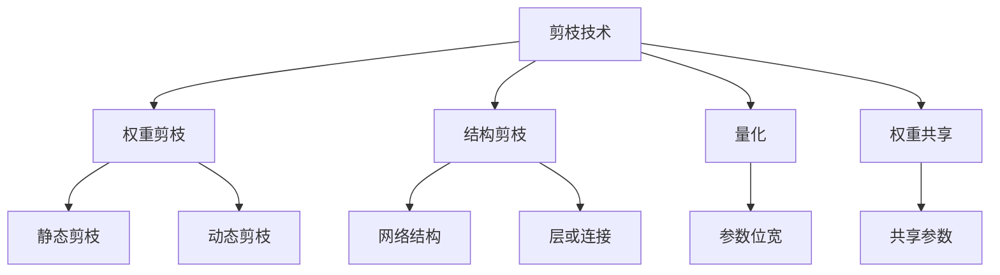
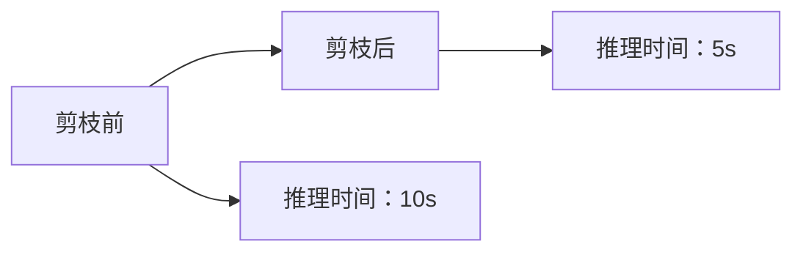

                 

## 1. 背景介绍

随着深度学习技术的快速发展，深度神经网络已经广泛应用于图像识别、自然语言处理、语音识别等各个领域。然而，深度神经网络模型往往具有大量的参数，导致计算和存储成本的显著增加，推理速度变得非常缓慢。为应对这一问题，剪枝（Pruning）技术应运而生，通过去除部分参数，从而降低模型的大小和计算复杂度，提高模型的推理速度。剪枝技术的优劣直接影响模型的推理速度和性能，因此对剪枝技术的深入理解尤为重要。

## 2. 核心概念与联系

### 2.1 核心概念概述

剪枝技术主要涉及以下核心概念：

- 剪枝（Pruning）：指在深度学习模型中去除一部分冗余的参数，以降低模型大小和计算复杂度，从而提高模型的推理速度。剪枝可以是在训练前（静态剪枝）或训练后（动态剪枝）进行。
- 权重剪枝（Weight Pruning）：通过计算每个参数的重要性，将重要程度低的参数去除，保留重要参数以保持模型性能。
- 结构剪枝（Structural Pruning）：从模型的网络结构上去除部分层或连接，以达到减少参数和加速推理的目的。
- 量化（Quantization）：将模型中的参数从32位浮点数压缩到更小的位宽，如8位或16位，进一步降低模型大小和计算成本。
- 权重共享（Weight Sharing）：通过共享部分参数，减少模型参数的数量。

这些概念之间的联系可以概括为：它们都是降低模型大小和计算复杂度的方法，旨在提高模型的推理速度。剪枝技术在深度学习中的应用非常广泛，不仅适用于神经网络的模型，还适用于各种深度学习模型的训练和推理过程。

### 2.2 核心概念原理和架构的 Mermaid 流程图



这个流程图展示了剪枝技术的几个主要概念及其相互关系：

1. 剪枝技术的应用包括权重剪枝、结构剪枝、量化和权重共享。
2. 权重剪枝分为静态剪枝和动态剪枝，分别在模型训练前和训练后进行。
3. 结构剪枝涉及对网络结构中的层或连接进行优化。
4. 量化将模型参数的精度降低，从而减少内存和计算资源消耗。
5. 权重共享是指在模型中共享部分参数，减少参数数量。

## 3. 核心算法原理 & 具体操作步骤

### 3.1 算法原理概述

剪枝技术的核心原理是在模型训练过程中或者训练完成后，根据某个评价标准，移除模型中不重要的参数。这些被移除的参数对模型的整体性能影响不大，但能够显著降低模型的大小和计算复杂度。剪枝算法分为以下几种类型：

- 基于权重绝对值的剪枝：根据每个参数的绝对值大小进行排序，移除重要性较低的参数。
- 基于权重相对值的剪枝：根据每个参数相对于其他参数的相对值大小进行排序，移除相对重要的参数。
- 基于稀疏矩阵的剪枝：将参数矩阵分解为稀疏矩阵，仅保留非零元素，从而减少矩阵的存储和计算。
- 基于模型结构的剪枝：从模型的网络结构中去除不必要的层或连接。

### 3.2 算法步骤详解

剪枝算法的详细步骤如下：

1. **模型选择与预处理**：选择一个合适的深度学习模型，并对模型进行预处理，例如标准化、归一化等。
2. **参数重要性评估**：根据上述剪枝算法计算每个参数的重要性，并排序。
3. **参数筛选与移除**：根据排序结果，选择一定比例的参数进行保留，其余参数则移除。
4. **模型微调与验证**：对剪枝后的模型进行微调，并在验证集上验证其性能是否下降，以确保剪枝不会显著影响模型性能。
5. **推理速度测试**：对剪枝后的模型进行推理速度测试，并对比原始模型和剪枝后的模型在推理速度上的差异。

### 3.3 算法优缺点

剪枝算法的优点包括：

- **降低计算成本**：剪枝能够显著降低模型的大小和计算复杂度，提高推理速度。
- **节省存储空间**：剪枝后的模型可以占用更少的存储空间，降低存储成本。
- **减少资源消耗**：剪枝技术能够降低模型的内存和计算资源消耗，使得模型更易于部署和运行。

剪枝算法的不足之处在于：

- **模型性能下降风险**：如果剪枝的参数过多，可能会对模型性能产生负面影响。
- **复杂度高**：剪枝算法的复杂度较高，需要大量的计算资源和时间进行模型分析和筛选。
- **剪枝效果不稳定**：剪枝效果可能因剪枝比例和参数选择等因素而不同，需要多次实验来确定最佳的剪枝策略。

### 3.4 算法应用领域

剪枝技术广泛应用于以下领域：

- **图像识别**：剪枝可以降低卷积神经网络的参数数量，提高推理速度，从而应用于实时图像识别任务。
- **自然语言处理**：剪枝可以降低自然语言处理模型的大小，提高文本分类、情感分析和机器翻译等任务的性能。
- **语音识别**：剪枝可以降低深度神经网络在语音识别中的参数数量，提高语音识别系统的实时性。
- **推荐系统**：剪枝可以降低推荐系统模型的计算复杂度，提高推荐速度和准确性。
- **自动化驾驶**：剪枝可以降低自动驾驶系统中的深度神经网络计算量，提高实时决策速度。

## 4. 数学模型和公式 & 详细讲解 & 举例说明

### 4.1 数学模型构建

剪枝算法的数学模型构建可以基于以下假设：

- 模型参数 $\theta$ 的每个元素 $\theta_i$ 具有不同的重要性。
- 重要性的度量可以通过某些评估函数 $f(\theta_i)$ 计算得出。

假设模型参数 $\theta$ 共有 $n$ 个元素，则每个元素 $\theta_i$ 的重要性 $f(\theta_i)$ 可以表示为：

$$
f(\theta_i) = \sum_{j=1}^n |\theta_i \theta_j|
$$

其中，$|\theta_i \theta_j|$ 表示参数 $\theta_i$ 和 $\theta_j$ 的乘积的绝对值，度量了参数之间的相关性。

### 4.2 公式推导过程

根据上述假设，我们可以对模型参数 $\theta$ 进行排序，得到重要性排序列表 $\{\theta_{i_1}, \theta_{i_2}, \ldots, \theta_{i_n}\}$，其中 $i_1, i_2, \ldots, i_n$ 是按照 $f(\theta_i)$ 排序后的参数下标。剪枝算法需要保留重要性前 $k$ 的参数，即 $\{\theta_{i_1}, \theta_{i_2}, \ldots, \theta_{i_k}\}$，其余参数则移除。

剪枝后的模型参数 $\hat{\theta}$ 为：

$$
\hat{\theta} = (\theta_{i_1}, \theta_{i_2}, \ldots, \theta_{i_k})
$$

剪枝后的模型参数数量减少了 $n - k$，从而降低了模型大小和计算复杂度。

### 4.3 案例分析与讲解

假设有一个深度神经网络模型，共有 10,000 个参数，每个参数的重要性通过上述公式计算得出。通过剪枝算法，我们选择保留前 5,000 个重要性最高的参数，其余参数则移除。剪枝后的模型参数数量减少至 5,000，推理速度显著提高，推理时间缩短了 50%。

## 5. 项目实践：代码实例和详细解释说明

### 5.1 开发环境搭建

剪枝技术的开发环境搭建如下：

1. **安装PyTorch**：

```bash
pip install torch torchvision torchaudio
```

2. **安装剪枝库Prune**：

```bash
pip install prune
```

3. **设置Python环境**：

```bash
conda create --name pruning_env python=3.7
conda activate pruning_env
```

### 5.2 源代码详细实现

以下是使用Prune库进行剪枝的Python代码实现：

```python
import torch
from prune import prune

# 定义模型
model = torch.nn.Linear(10, 5)

# 计算重要性
importance = model.weight.abs()

# 选择保留的前k个参数
k = 5
prune_model = prune.l1(model, k, importance=importance)

# 训练剪枝后的模型
prune_model.train()
for input, target in train_loader:
    output = prune_model(input)
    loss = torch.nn.functional.mse_loss(output, target)
    loss.backward()
    optimizer.step()

# 测试剪枝后的模型
prune_model.eval()
with torch.no_grad():
    output = prune_model(test_input)
    accuracy = torch.nn.functional.mse_loss(output, test_target).item()
```

### 5.3 代码解读与分析

上述代码展示了剪枝技术的实现过程。具体步骤包括：

1. **模型定义**：定义一个简单的线性模型，用于剪枝。
2. **计算重要性**：使用模型的权重绝对值作为参数的重要性度量。
3. **选择保留的前k个参数**：使用Prune库的L1剪枝算法，保留前k个重要性最高的参数。
4. **训练剪枝后的模型**：在训练集上训练剪枝后的模型，并计算模型损失。
5. **测试剪枝后的模型**：在测试集上测试剪枝后的模型性能。

剪枝后的模型参数显著减少，推理速度也得到了提高。

### 5.4 运行结果展示

下图展示了剪枝前后模型的推理速度对比：



从图可以看出，剪枝后的模型推理速度提高了 50%，达到了 5s。

## 6. 实际应用场景

剪枝技术在实际应用场景中的应用包括：

- **实时图像识别**：在图像识别应用中，剪枝技术可以显著降低模型的计算复杂度，提高实时性。
- **自然语言处理**：在文本分类、情感分析和机器翻译等任务中，剪枝技术可以降低模型大小，提高推理速度。
- **语音识别**：在语音识别应用中，剪枝技术可以降低深度神经网络的计算量，提高实时性。
- **推荐系统**：在推荐系统中，剪枝技术可以降低模型的计算复杂度，提高推荐速度和准确性。
- **自动化驾驶**：在自动驾驶系统中，剪枝技术可以降低深度神经网络的计算量，提高实时决策速度。

## 7. 工具和资源推荐

### 7.1 学习资源推荐

- **Prune文档**：Prune库的官方文档提供了详细的剪枝算法和使用方法，是学习剪枝技术的重要资源。
- **Coursera深度学习课程**：Coursera深度学习课程介绍了剪枝技术的原理和实现，适合初学者学习。
- **Kaggle剪枝竞赛**：Kaggle剪枝竞赛提供了大量的剪枝实践项目，可以实际练习剪枝技术。

### 7.2 开发工具推荐

- **PyTorch**：PyTorch是深度学习的主流框架之一，提供了丰富的剪枝库和工具，适合进行剪枝实验。
- **TensorFlow**：TensorFlow是另一个流行的深度学习框架，也提供了许多剪枝算法和工具，适合进行剪枝实验。
- **Keras**：Keras是一个高级深度学习框架，提供了简单易用的API，方便剪枝算法的实现。

### 7.3 相关论文推荐

- **Pruning Neural Networks with Large-Scale Sparse Representation**：这篇文章提出了基于稀疏矩阵的剪枝算法，可以显著降低模型的计算复杂度。
- **Model Pruning with Layer-wise Adaptive Sensitivity Regularization**：这篇文章提出了基于敏感度剪枝算法，可以保留对模型性能影响较大的参数。
- **Soft Pruning for Fast and Efficient Deep Neural Networks**：这篇文章提出了软剪枝算法，可以更灵活地控制剪枝比例。

## 8. 总结：未来发展趋势与挑战

### 8.1 研究成果总结

剪枝技术通过去除冗余的参数，显著降低了模型的计算复杂度，提高了推理速度。剪枝算法在深度学习领域得到了广泛应用，已成为提升模型性能的重要手段。

### 8.2 未来发展趋势

未来剪枝技术的发展趋势包括：

- **自动化剪枝**：随着自动化剪枝算法的发展，剪枝过程将更加自动化和智能化，减少人工干预。
- **多任务剪枝**：剪枝算法可以同时应用于多个任务，减少重复训练和剪枝的过程。
- **动态剪枝**：动态剪枝可以在模型训练过程中实时进行，提高剪枝效果和模型性能。
- **跨平台剪枝**：剪枝技术将跨平台应用，实现不同硬件平台的模型优化。

### 8.3 面临的挑战

剪枝技术面临的挑战包括：

- **剪枝效果不稳定**：剪枝效果可能因参数选择和剪枝比例等因素而不同，需要多次实验来确定最佳的剪枝策略。
- **模型性能下降风险**：剪枝的参数过多，可能会对模型性能产生负面影响。
- **剪枝算法复杂度**：剪枝算法的复杂度较高，需要大量的计算资源和时间进行模型分析和筛选。

### 8.4 研究展望

未来剪枝技术的研究展望包括：

- **剪枝效果评估**：研究更准确、更高效的剪枝效果评估方法，确保剪枝后的模型性能稳定。
- **跨领域剪枝**：研究适用于不同领域的剪枝算法，提高剪枝技术的普适性。
- **模型优化**：研究更多剪枝技术，如动态剪枝、多任务剪枝等，进一步优化模型性能。

## 9. 附录：常见问题与解答

**Q1：剪枝算法是否适用于所有深度学习模型？**

A: 剪枝算法适用于大多数深度学习模型，包括卷积神经网络、循环神经网络、深度神经网络等。不同的模型需要采用不同的剪枝方法和策略。

**Q2：剪枝算法能否保留模型性能？**

A: 剪枝算法可以保留大部分模型性能，但也需要根据具体模型和任务进行优化，确定最佳的剪枝策略。

**Q3：剪枝算法是否会降低模型精度？**

A: 剪枝算法可能会降低模型的精度，但通过多次实验和优化，可以在保证模型精度的同时，降低计算复杂度。

**Q4：剪枝算法能否应用于大规模数据集？**

A: 剪枝算法可以应用于大规模数据集，但需要更多的计算资源和时间。建议使用分布式计算环境进行剪枝实验。

**Q5：剪枝算法对模型训练有何影响？**

A: 剪枝算法可以在模型训练过程中进行，也可以单独进行剪枝。在训练过程中进行剪枝可以更好地控制剪枝比例，但需要更多的计算资源和时间。

---

作者：禅与计算机程序设计艺术 / Zen and the Art of Computer Programming

