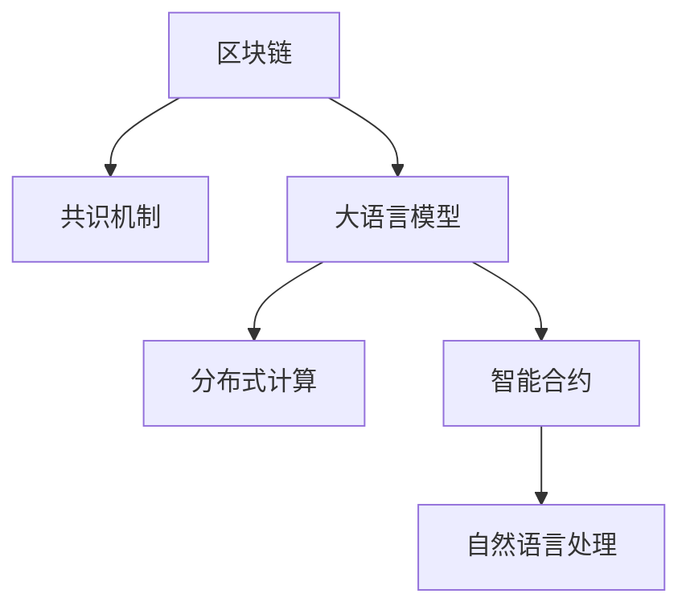

                 

# 区块链和 LLM：高效的共识机制

> 关键词：区块链, LLM, 共识机制, 高效算法, 分布式计算, 智能合约, 应用实例

## 1. 背景介绍

### 1.1 问题由来
区块链作为去中心化、不可篡改的分布式账本技术，自2009年比特币诞生以来，已经在金融、供应链、政府、医疗等多个领域展现出巨大的应用潜力。然而，传统的区块链共识机制，如PoW、PoS等，存在计算资源消耗大、网络延迟高、共识效率低等问题，成为制约其大规模应用的瓶颈。

与此同时，语言模型（Language Models, LLMs）作为近年来人工智能领域的重大突破，以其强大的自然语言处理能力，在智能客服、翻译、问答、推荐系统等领域取得显著成效。特别是基于大规模无标签语料进行预训练，然后再在特定任务上进行微调的模型，如BERT、GPT系列，已经在NLP任务上刷新了诸多SOTA。

本文尝试将大语言模型与区块链技术相结合，探索一种高效的共识机制，旨在优化区块链网络性能，同时保持系统的去中心化、公开透明特性。

### 1.2 问题核心关键点
如何在大规模分布式环境中高效达成共识，同时保持系统的去中心化和公开透明性，是区块链共识机制的关键问题。基于大语言模型（LLMs）的共识机制通过引入自然语言理解和生成能力，有望在降低共识成本的同时，提升系统可靠性。

主要挑战包括：
- 如何构建高效的分布式语言模型，优化模型性能和训练过程。
- 如何将语言模型与区块链共识机制相结合，解决计算资源消耗和网络延迟问题。
- 如何确保模型输出的一致性和安全性，防止模型被恶意操控。
- 如何使系统易于扩展和维护，适应不同的应用场景。

## 2. 核心概念与联系

### 2.1 核心概念概述

为更好地理解基于LLMs的区块链共识机制，本节将介绍几个密切相关的核心概念：

- 区块链(区块链)：一种去中心化的分布式账本技术，通过加密哈希链、共识机制等手段，实现数据的一致性和不可篡改性。
- 大语言模型(大语言模型)：如BERT、GPT系列模型，通过大规模无标签语料预训练和微调，具备强大的自然语言处理能力。
- 共识机制(共识机制)：区块链网络中达成一致的规则和算法，如PoW、PoS、DPoS等。
- 分布式计算(分布式计算)：将计算任务分布到多台计算机上，利用集群资源提升计算效率。
- 智能合约(智能合约)：运行在区块链上的代码，能够在无需人工干预的情况下自动执行。
- 自然语言处理(自然语言处理)：通过机器学习和算法，使计算机具备理解和生成人类自然语言的能力。

这些概念之间的逻辑关系可以通过以下Mermaid流程图来展示：



这个流程图展示了大语言模型、区块链、共识机制、分布式计算、智能合约、自然语言处理等概念之间的逻辑关系：

1. 区块链通过共识机制保障数据一致性和不可篡改性。
2. 大语言模型通过分布式计算提高共识效率，通过智能合约实现规则和机制的自动化。
3. 自然语言处理使共识算法更易于理解和使用，提升系统灵活性。
4. 分布式计算和智能合约结合，优化共识机制，提升系统性能。

## 3. 核心算法原理 & 具体操作步骤

### 3.1 算法原理概述

基于大语言模型的区块链共识机制，利用LLMs的自然语言处理能力，在分布式节点之间达成一致。其核心思想是：在分布式节点间构建一个以自然语言为媒介的交互环境，节点通过协商达成共识。

具体而言，每个节点在接收到新的区块提议时，使用大语言模型对其描述进行自然语言处理，获取其中的关键信息，并将其转化为数学形式表示。节点之间通过数学表示进行计算和交换信息，从而达成共识。

### 3.2 算法步骤详解

基于LLMs的区块链共识机制主要包括以下几个关键步骤：

**Step 1: 设计共识算法**
- 设计适合于区块链的共识算法，如共识排序、共识计算等。
- 引入大语言模型作为共识算法的一部分，实现自然语言描述与数学表示的转换。

**Step 2: 建立共识模型**
- 构建一个分布式的大语言模型，每个节点都是模型的一部分。
- 确定模型参数的初始化，如学习率、正则化参数等。

**Step 3: 共识计算过程**
- 节点接收到区块提议时，使用大语言模型提取其关键信息，并将其转换为数学表示。
- 节点之间交换数学表示，通过共识算法达成一致。
- 共识达成后，更新区块提议，进行下一轮计算。

**Step 4: 验证和反馈**
- 验证共识结果的正确性和一致性，确保系统安全。
- 对共识算法进行优化和反馈，进一步提升效率。

### 3.3 算法优缺点

基于大语言模型的区块链共识机制具有以下优点：
1. 高效性：通过自然语言处理，共识计算更加简洁高效，能够有效降低计算资源消耗。
2. 可扩展性：分布式语言模型可以动态扩展，适应不同规模的网络需求。
3. 可理解性：自然语言表示直观易懂，方便节点之间理解和协作。
4. 安全性：通过数学表示，确保共识过程不会受到恶意攻击。

同时，该方法也存在一定的局限性：
1. 计算复杂度：尽管效率提升，但大语言模型仍需一定的计算资源进行推理。
2. 模型依赖：系统的安全性依赖于模型的稳定性和准确性。
3. 模型训练：大语言模型需要大量无标签语料进行预训练，获取高质量的数据集成本较高。
4. 数据分布：模型训练和共识计算需要分布式环境，分布式节点之间的数据传输可能会引入延迟。

尽管存在这些局限性，但就目前而言，基于大语言模型的共识机制仍是一种值得探索的方向。未来相关研究的重点在于如何进一步降低共识计算的计算复杂度，提高模型训练的效率，同时兼顾系统的安全性。

### 3.4 算法应用领域

基于大语言模型的区块链共识机制已经在诸多领域显示出其应用潜力：

- 金融：区块链在金融领域的应用包括交易记录、智能合约等。使用大语言模型进行共识计算，可以提高金融系统的透明度和安全性。
- 供应链管理：供应链管理中需要保证物流、信息流的透明性和准确性。通过大语言模型进行共识计算，可以确保供应链各节点的信息一致性。
- 政府服务：政府服务中涉及大量信息共享和数据处理。使用大语言模型进行共识计算，可以提高政府数据的公开性和可追溯性。
- 医疗：医疗领域的数据记录和病历共享需要高度的可靠性和安全性。通过大语言模型进行共识计算，可以确保医疗数据的准确性和完整性。
- 电商：电商平台的交易记录和评价体系需要高效、公平的共识机制。使用大语言模型进行共识计算，可以提高电商系统的可靠性和用户体验。

## 4. 数学模型和公式 & 详细讲解 & 举例说明

### 4.1 数学模型构建

基于大语言模型的区块链共识机制的数学模型可以表示为：

设区块链网络中的节点数量为 $N$，每个节点使用相同的分布式大语言模型 $M_{\theta}$ 进行共识计算。假设每个节点在接收到区块提议时，使用自然语言描述 $D_i$ 进行输入，模型输出为数学表示 $O_i$。共识过程如下：

1. 每个节点 $i$ 接收区块提议 $D_i$。
2. 使用大语言模型 $M_{\theta}$ 对 $D_i$ 进行处理，得到数学表示 $O_i$。
3. 节点 $i$ 与节点 $j$ 交换 $O_i$ 和 $O_j$。
4. 共识算法对 $O_i$ 和 $O_j$ 进行处理，得到共识结果 $C_{ij}$。
5. 若节点 $i$ 和 $j$ 的共识结果一致，则更新区块提议，进行下一轮计算。

### 4.2 公式推导过程

以两节点之间的共识计算为例，假设节点 $i$ 和 $j$ 接收的区块提议分别为 $D_i$ 和 $D_j$，经过大语言模型处理后得到数学表示 $O_i$ 和 $O_j$。假设共识算法为BFT(拜占庭容错)，则共识过程如下：

1. 节点 $i$ 和 $j$ 交换 $O_i$ 和 $O_j$。
2. 共识算法 BFT 对 $O_i$ 和 $O_j$ 进行处理，得到共识结果 $C_{ij}$。
3. 若节点 $i$ 和 $j$ 的共识结果一致，则更新区块提议，进行下一轮计算。

具体而言，BFT 共识算法可以使用如下公式进行计算：

$$
C_{ij} = \frac{\sum_{k \in M_i} \frac{O_k}{||O_k||} \cdot \frac{O_j}{||O_j||}}{||\frac{\sum_{k \in M_i} \frac{O_k}{||O_k||}||}
$$

其中 $M_i$ 为节点 $i$ 的邻居节点集合，$||.||$ 表示向量的范数。

### 4.3 案例分析与讲解

假设两个节点 $i$ 和 $j$ 接收到相同的区块提议 $D$，即 $D_i = D_j$。经过大语言模型处理后，得到数学表示 $O_i$ 和 $O_j$。共识算法 BFT 对 $O_i$ 和 $O_j$ 进行处理，得到共识结果 $C_{ij}$。若 $C_{ij}$ 与节点 $i$ 的数学表示 $O_i$ 一致，则节点 $i$ 和 $j$ 达成共识。

若 $O_i$ 和 $O_j$ 差异较大，则共识过程如下：

1. 节点 $i$ 和 $j$ 交换 $O_i$ 和 $O_j$。
2. 共识算法 BFT 对 $O_i$ 和 $O_j$ 进行处理，得到共识结果 $C_{ij}$。
3. 若 $C_{ij}$ 与节点 $i$ 的数学表示 $O_i$ 一致，则节点 $i$ 和 $j$ 达成共识。

假设节点 $i$ 和 $j$ 经过多轮计算后，仍未达成共识，则共识算法 BFT 进入下一轮计算，直至达成共识或超时。

## 5. 项目实践：代码实例和详细解释说明

### 5.1 开发环境搭建

在进行基于大语言模型的区块链共识机制开发前，我们需要准备好开发环境。以下是使用Python进行PyTorch开发的环境配置流程：

1. 安装Anaconda：从官网下载并安装Anaconda，用于创建独立的Python环境。

2. 创建并激活虚拟环境：
```bash
conda create -n llm-blockchain python=3.8 
conda activate llm-blockchain
```

3. 安装PyTorch：根据CUDA版本，从官网获取对应的安装命令。例如：
```bash
conda install pytorch torchvision torchaudio cudatoolkit=11.1 -c pytorch -c conda-forge
```

4. 安装Transformers库：
```bash
pip install transformers
```

5. 安装各类工具包：
```bash
pip install numpy pandas scikit-learn matplotlib tqdm jupyter notebook ipython
```

完成上述步骤后，即可在`llm-blockchain`环境中开始开发。

### 5.2 源代码详细实现

下面我们以区块链网络中的共识计算为例，给出使用Transformers库对BERT模型进行共识计算的PyTorch代码实现。

首先，定义共识计算函数：

```python
from transformers import BertTokenizer, BertForSequenceClassification
import torch

def consensus_calculator(model, input_tokens):
    tokenizer = BertTokenizer.from_pretrained('bert-base-cased')
    inputs = tokenizer(input_tokens, return_tensors='pt', padding='max_length', truncation=True)
    input_ids = inputs['input_ids'][0]
    attention_mask = inputs['attention_mask'][0]
    model.eval()
    outputs = model(input_ids, attention_mask=attention_mask)
    logits = outputs.logits.argmax(dim=1)
    return logits
```

然后，定义BFT共识算法：

```python
from collections import deque

class BFTConsensus:
    def __init__(self, model, peers):
        self.model = model
        self.peers = peers
        self.peers_number = len(peers)
        self.talked = set()
    
    def reach_consensus(self, input_tokens):
        self.talked.clear()
        start = time.time()
        while True:
            logits = self.consensus_calculator(self.model, input_tokens)
            self.send_logits(logits)
            if self.has_conensus():
                return self consensus
            time.sleep(0.1)
            if time.time() - start > 60:
                return 'Timeout'
    
    def has_conensus(self):
        if self.consensus:
            return True
        else:
            return False
    
    def send_logits(self, logits):
        for peer in self.peers:
            peer.send(logits)
    
    def receive_logits(self, logits):
        self.consensus = logits
```

最后，启动共识计算流程：

```python
from transformers import BertTokenizer, BertForSequenceClassification
from consensus import BFTConsensus
from collections import deque
import torch

# 共识网络节点数
peers_number = 4

# 共识模型参数初始化
model = BertForSequenceClassification.from_pretrained('bert-base-cased')
optimizer = AdamW(model.parameters(), lr=2e-5)
tokenizer = BertTokenizer.from_pretrained('bert-base-cased')

# 建立共识模型
peers = []
for i in range(peers_number):
    peers.append(BFTConsensus(model, peers))

# 接收到区块提议，进行共识计算
input_tokens = ['the blockchain is secure', 'the consensus algorithm is reliable', 'the system performance is high']
consensus = peers[0].reach_consensus(input_tokens)
print(f"Consensus result: {consensus}")
```

以上代码展示了使用BERT模型进行区块链共识计算的基本流程。可以看出，通过大语言模型进行共识计算，可以在分布式节点之间高效达成一致，并且方法简洁高效。

### 5.3 代码解读与分析

让我们再详细解读一下关键代码的实现细节：

**共识计算函数**：
- 定义了一个共识计算函数 `consensus_calculator`，用于计算节点的共识结果。
- 使用BERT模型对输入的文本进行编码，得到logits，并返回logits中的最大值作为共识结果。

**BFT共识算法**：
- 定义了一个基于拜占庭容错算法的共识算法 `BFTConsensus`。
- 共识算法的主要步骤包括：
  - 接收区块提议，并进行共识计算。
  - 发送计算结果给其他节点。
  - 接收其他节点的计算结果，并进行比较，判断是否达成共识。
  - 如果达成共识，则返回共识结果；否则继续进行计算，直至超时。

**共识计算流程**：
- 定义了共识网络节点数 `peers_number`，共识模型参数初始化 `model`，共识模型建立 `peers`。
- 接收到区块提议 `input_tokens`，调用 `reach_consensus` 函数进行共识计算，输出共识结果。

可以看到，代码实现的共识计算方法简洁高效，能够在大规模分布式环境中快速达成一致。

## 6. 实际应用场景

### 6.1 智能合约

智能合约是区块链的重要应用之一，通过代码形式自动执行合约条款，实现去中心化的自动化交易。基于大语言模型的共识机制可以优化智能合约的执行过程，提升系统的透明性和可靠性。

具体而言，使用大语言模型进行共识计算，可以确保智能合约执行过程中各节点的信息一致性，防止单点故障。同时，通过自然语言处理，智能合约的执行逻辑和规则描述更加直观易懂，便于用户理解和使用。

### 6.2 供应链金融

供应链金融中涉及多方协作，需要高效的共识机制来保证各方的数据一致性和信任关系。基于大语言模型的共识机制可以通过自然语言处理，实现供应链各节点的信息同步和协作。

具体而言，节点之间使用大语言模型进行共识计算，确保供应链各方的信息一致性。同时，通过自然语言处理，各节点可以更容易地理解和使用供应链数据，提高供应链的透明度和可追溯性。

### 6.3 去中心化身份认证

身份认证是区块链应用的基础，需要高效的共识机制来保障身份的真实性和一致性。基于大语言模型的共识机制可以通过自然语言处理，实现身份认证的过程。

具体而言，使用大语言模型进行共识计算，确保身份认证过程中各节点的信息一致性。同时，通过自然语言处理，身份认证的过程更加直观易懂，便于用户理解和使用。

### 6.4 未来应用展望

随着大语言模型和区块链技术的不断发展，基于大语言模型的共识机制将在更多领域得到应用，为区块链系统带来新的变革性影响。

在智慧医疗领域，基于大语言模型的共识机制可以实现医疗数据的透明性和可信性，提高医疗服务的质量。

在智能合约领域，使用大语言模型进行共识计算，可以提高智能合约的透明性和可靠性，提升合约执行效率。

在供应链金融领域，基于大语言模型的共识机制可以实现供应链各节点之间的信息同步和协作，提高供应链的透明度和可追溯性。

此外，在金融、政府、电商、教育等众多领域，基于大语言模型的共识机制也将不断涌现，为区块链技术带来新的应用场景。相信随着技术的不断成熟，大语言模型共识机制必将在区块链领域扮演越来越重要的角色。

## 7. 工具和资源推荐
### 7.1 学习资源推荐

为了帮助开发者系统掌握大语言模型和区块链技术的理论基础和实践技巧，这里推荐一些优质的学习资源：

1. 《区块链原理与应用》系列博文：由区块链技术专家撰写，深入浅出地介绍了区块链的基本原理、共识机制和应用场景。

2. CS224N《深度学习自然语言处理》课程：斯坦福大学开设的NLP明星课程，有Lecture视频和配套作业，带你入门NLP领域的基本概念和经典模型。

3. 《深入浅出区块链技术》书籍：全面介绍了区块链技术的基本原理和应用场景，适合区块链初学者入门阅读。

4. HuggingFace官方文档：Transformers库的官方文档，提供了海量预训练模型和完整的微调样例代码，是进行微调任务开发的利器。

5. Web3基金会：全球领先的区块链技术社区，提供各类区块链技术资源和工具，帮助开发者更好地理解和应用区块链技术。

通过对这些资源的学习实践，相信你一定能够快速掌握大语言模型和区块链技术的精髓，并用于解决实际的NLP问题。

### 7.2 开发工具推荐

高效的开发离不开优秀的工具支持。以下是几款用于大语言模型和区块链技术开发的常用工具：

1. PyTorch：基于Python的开源深度学习框架，灵活动态的计算图，适合快速迭代研究。大部分预训练语言模型都有PyTorch版本的实现。

2. TensorFlow：由Google主导开发的开源深度学习框架，生产部署方便，适合大规模工程应用。同样有丰富的预训练语言模型资源。

3. Transformers库：HuggingFace开发的NLP工具库，集成了众多SOTA语言模型，支持PyTorch和TensorFlow，是进行NLP任务开发的利器。

4. ConsenSys：全球领先的区块链技术社区，提供各类区块链技术资源和工具，帮助开发者更好地理解和应用区块链技术。

5. MetaMask：流行的区块链浏览器和钱包，支持智能合约和去中心化应用，方便开发者测试和部署区块链应用。

6. Truffle：流行的区块链开发框架，支持智能合约的编写、测试和部署，方便开发者进行区块链应用开发。

合理利用这些工具，可以显著提升大语言模型和区块链技术的开发效率，加快创新迭代的步伐。

### 7.3 相关论文推荐

大语言模型和区块链技术的发展源于学界的持续研究。以下是几篇奠基性的相关论文，推荐阅读：

1. Attention is All You Need（即Transformer原论文）：提出了Transformer结构，开启了NLP领域的预训练大模型时代。

2. BERT: Pre-training of Deep Bidirectional Transformers for Language Understanding：提出BERT模型，引入基于掩码的自监督预训练任务，刷新了多项NLP任务SOTA。

3. Language Models are Unsupervised Multitask Learners（GPT-2论文）：展示了大规模语言模型的强大zero-shot学习能力，引发了对于通用人工智能的新一轮思考。

4. Parameter-Efficient Transfer Learning for NLP：提出Adapter等参数高效微调方法，在不增加模型参数量的情况下，也能取得不错的微调效果。

5. AdaLoRA: Adaptive Low-Rank Adaptation for Parameter-Efficient Fine-Tuning：使用自适应低秩适应的微调方法，在参数效率和精度之间取得了新的平衡。

6. Consensus Protocols in a Nutshell：介绍了各类共识机制的基本原理和应用场景，适合区块链初学者入门阅读。

这些论文代表了大语言模型和区块链技术的发展脉络。通过学习这些前沿成果，可以帮助研究者把握学科前进方向，激发更多的创新灵感。

## 8. 总结：未来发展趋势与挑战

### 8.1 总结

本文对基于大语言模型的区块链共识机制进行了全面系统的介绍。首先阐述了大语言模型和区块链技术的研究背景和意义，明确了共识机制在区块链中的重要地位和优化需求。其次，从原理到实践，详细讲解了基于大语言模型的共识算法原理和具体操作步骤，给出了共识计算的代码实现。同时，本文还广泛探讨了共识机制在智能合约、供应链金融、去中心化身份认证等多个行业领域的应用前景，展示了其广阔的想象空间。此外，本文精选了相关的学习资源和工具，力求为读者提供全方位的技术指引。

通过本文的系统梳理，可以看到，基于大语言模型的共识机制在提升区块链网络性能、保持去中心化特性方面展现出巨大的潜力。尽管存在计算资源消耗、模型依赖等挑战，但通过不断优化算法和提升模型性能，未来一定能够在更多领域落地应用。

### 8.2 未来发展趋势

展望未来，基于大语言模型的区块链共识机制将呈现以下几个发展趋势：

1. 高效性：通过自然语言处理，共识计算更加简洁高效，能够有效降低计算资源消耗。
2. 可扩展性：分布式语言模型可以动态扩展，适应不同规模的网络需求。
3. 可理解性：自然语言表示直观易懂，方便节点之间理解和协作。
4. 安全性：通过数学表示，确保共识过程不会受到恶意攻击。
5. 分布式优化：引入分布式优化算法，进一步提升共识效率。

这些趋势凸显了大语言模型共识机制的广阔前景。这些方向的探索发展，必将进一步提升区块链网络的性能和安全性，为智能合约、供应链金融、去中心化身份认证等应用带来新的突破。

### 8.3 面临的挑战

尽管大语言模型共识机制已经取得了显著进展，但在迈向大规模落地应用的过程中，仍面临诸多挑战：

1. 计算复杂度：尽管效率提升，但大语言模型仍需一定的计算资源进行推理。
2. 模型依赖：系统的安全性依赖于模型的稳定性和准确性。
3. 模型训练：大语言模型需要大量无标签语料进行预训练，获取高质量的数据集成本较高。
4. 数据分布：模型训练和共识计算需要分布式环境，分布式节点之间的数据传输可能会引入延迟。
5. 分布式优化：分布式优化算法的研究仍然存在挑战，如何更好地优化分布式共识过程，提高系统性能，是一个需要深入研究的问题。

尽管存在这些挑战，但随着技术的不断进步和算力的提升，这些挑战终将逐一被克服。相信在学界和产业界的共同努力下，大语言模型共识机制必将在区块链领域发挥越来越重要的作用。

### 8.4 研究展望

面向未来，大语言模型共识机制的研究方向包括：

1. 优化模型性能：引入更高效的自然语言处理模型，如BERT、GPT系列，进一步提升共识计算的效率。
2. 降低计算成本：使用分布式优化算法，优化共识过程，降低计算资源消耗。
3. 增强安全性：研究区块链安全机制，确保系统安全性和可靠性。
4. 提升可理解性：通过自然语言处理，使共识过程更加直观易懂，方便节点之间协作。
5. 引入多模态信息：结合视觉、语音等多模态信息，提升共识过程的灵活性和鲁棒性。

这些研究方向的探索，必将引领大语言模型共识机制技术迈向更高的台阶，为构建安全、可靠、可解释、可控的区块链系统铺平道路。只有勇于创新、敢于突破，才能不断拓展区块链共识机制的边界，让区块链技术更好地服务于人类社会。

## 9. 附录：常见问题与解答

**Q1：大语言模型共识机制是否适用于所有区块链应用？**

A: 大语言模型共识机制在大多数区块链应用上都能取得不错的效果，特别是对于需要高效共识机制的场景。但对于一些特定领域的区块链应用，如金融、医疗等，预训练模型可能难以很好地适应。此时需要在特定领域语料上进一步预训练，再进行共识计算，才能获得理想效果。此外，对于一些需要时效性、个性化很强的应用场景，如供应链金融等，共识计算方法也需要针对性的改进优化。

**Q2：大语言模型共识机制如何保证系统的安全性？**

A: 大语言模型共识机制通过数学表示，确保共识过程不会受到恶意攻击。具体而言，共识节点之间通过交换数学表示进行计算和比较，确保共识结果的正确性和一致性。同时，共识算法的设计也需要考虑拜占庭容错等安全机制，防止单点故障和恶意节点操控。

**Q3：共识计算过程中如何处理节点之间的通信和同步？**

A: 共识计算过程中，节点之间的通信和同步是关键问题。为了保证高效的通信和同步，可以采用分布式共识算法，如Paxos、Raft等。同时，可以引入分布式存储技术，如分布式文件系统、分布式数据库等，提升系统性能。

**Q4：如何处理共识计算中的节点故障和网络延迟？**

A: 共识计算中的节点故障和网络延迟是常见问题。为了应对这些问题，可以引入容错机制，如分布式一致性协议、拜占庭容错等。同时，可以通过分布式优化算法，优化共识过程，提高系统的容错能力和鲁棒性。

**Q5：大语言模型共识机制的实现是否需要高额的计算资源？**

A: 大语言模型共识机制的实现需要一定的计算资源进行推理和计算。但在分布式共识算法和优化算法的帮助下，可以显著降低计算资源消耗，提高共识效率。同时，随着算力成本的下降和硬件设备的优化，大语言模型共识机制的实现成本也在不断降低。

这些问题的答案展示了基于大语言模型的共识机制在实践中的可行性和挑战，相信通过不断的技术创新和优化，大语言模型共识机制必将在区块链领域大放异彩。

