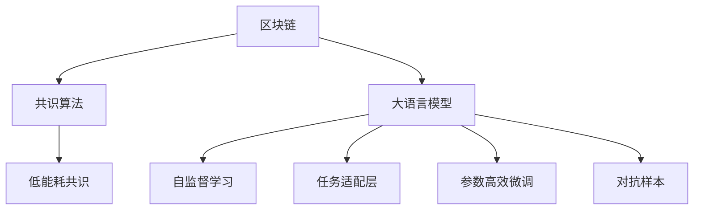

                 

## 1. 背景介绍

### 1.1 问题由来
区块链技术的核心在于其共识机制，即在分布式网络中，如何达成共识，协同验证交易的真实性和有效性。传统区块链共识机制依赖于复杂的算法和高昂的计算成本，如比特币的PoW（工作量证明）共识和以太坊的PoS（权益证明）共识。尽管这些算法保障了系统的安全性和去中心化，但能耗大、效率低，难以满足日益增长的业务需求。

近年来，基于人工智能的语言模型（如GPT、BERT等）在自然语言处理领域取得了巨大突破。在处理大规模文本数据时，这些模型通过自监督学习展示了强大的泛化能力和语言理解能力。鉴于区块链的治理机制与自然语言处理有诸多相似之处，研究者探索将语言模型应用于区块链共识机制的可行性，以便在降低能耗的同时提升系统效率。

### 1.2 问题核心关键点
当前，基于大语言模型（LLM）的区块链共识机制研究逐渐兴起。其核心思路是通过语言模型的语言理解和生成能力，自动生成并验证交易，从而达成共识。这种方式可以显著降低共识机制的能耗和计算复杂度，提升交易处理的效率。

本研究聚焦于语言模型在区块链共识机制中的应用，尝试构建一种高效、低能耗的新型共识协议，以解决传统共识机制的能耗高、效率低的问题。

### 1.3 问题研究意义
研究基于大语言模型的区块链共识机制，对于提升区块链系统的性能、降低其能耗具有重要意义：

1. **降低能耗**：语言模型共识机制通过自动化交易验证，减少了传统共识机制的复杂计算，显著降低了共识过程中所需的能源消耗。
2. **提升效率**：相较于传统的PoW/PoS共识算法，基于语言模型的共识可以更快地验证交易，处理速度得到显著提升。
3. **灵活性增强**：语言模型可以根据不同的场景和需求，设计多样化的共识算法，满足各种特定业务需求。
4. **促进普及**：基于语言模型的共识算法简化交易验证过程，降低参与门槛，有助于区块链技术的普及和应用。

## 2. 核心概念与联系

### 2.1 核心概念概述

为更好地理解基于语言模型的区块链共识机制，本节将介绍几个密切相关的核心概念：

- 区块链（Blockchain）：一种分布式账本技术，通过共识机制确保数据的一致性和安全性，支持去中心化应用。

- 共识算法（Consensus Algorithm）：区块链网络中达成共识的方法和规则，保证数据的一致性和可靠性。

- 大语言模型（Large Language Model, LLM）：通过大规模无标签文本数据进行预训练，学习通用的语言表示，具备强大的语言理解和生成能力。

- 自监督学习（Self-Supervised Learning）：利用未标注的数据进行预训练，学习数据中的隐含结构，提升模型的泛化能力。

- 任务适配层（Task-specific Layer）：针对特定任务，在预训练模型的基础上添加的任务相关输出层，以支持微调。

- 参数高效微调（Parameter-Efficient Fine-Tuning, PEFT）：在微调过程中，只更新少量的模型参数，而固定大部分预训练权重不变，以提高微调效率。

- 对抗样本（Adversarial Sample）：在对抗训练中，用于提高模型鲁棒性的特定类型样本。

这些核心概念之间的逻辑关系可以通过以下Mermaid流程图来展示：



这个流程图展示了大语言模型的核心概念及其之间的关系：

1. 区块链通过共识算法达成数据一致性。
2. 大语言模型通过自监督学习获得语言表示。
3. 任务适配层支持微调，使其能适应特定任务。
4. 参数高效微调优化微调过程，提升效率。
5. 对抗样本提高模型鲁棒性。

这些概念共同构成了区块链共识机制的研究框架，为大语言模型的应用提供了理论基础。

## 3. 核心算法原理 & 具体操作步骤
### 3.1 算法原理概述

基于语言模型的区块链共识机制，利用语言模型的语言理解和生成能力，自动验证交易的真实性和有效性。其核心思想是将语言模型视为一个强大的"事实检查器"，通过训练模型识别和验证交易的真实性，从而达成共识。

### 3.2 算法步骤详解

基于语言模型的区块链共识机制一般包括以下几个关键步骤：

**Step 1: 准备预训练模型和数据集**
- 选择合适的预训练语言模型 $M_{\theta}$ 作为初始化参数，如 GPT、BERT等。
- 准备区块链网络中的交易数据集 $D=\{(x_i,y_i)\}_{i=1}^N$，其中 $x_i$ 为交易信息，$y_i$ 为交易真实性的标签（如是否合法、是否被篡改等）。

**Step 2: 添加任务适配层**
- 根据具体任务，在预训练模型顶层设计合适的输出层和损失函数。
- 对于分类任务，通常在顶层添加线性分类器和交叉熵损失函数。
- 对于生成任务，通常使用语言模型的解码器输出概率分布，并以负对数似然为损失函数。

**Step 3: 设置微调超参数**
- 选择合适的优化算法及其参数，如 AdamW、SGD 等，设置学习率、批大小、迭代轮数等。
- 设置正则化技术及强度，包括权重衰减、Dropout、Early Stopping 等。
- 确定冻结预训练参数的策略，如仅微调顶层，或全部参数都参与微调。

**Step 4: 执行梯度训练**
- 将训练集数据分批次输入模型，前向传播计算损失函数。
- 反向传播计算参数梯度，根据设定的优化算法和学习率更新模型参数。
- 周期性在验证集上评估模型性能，根据性能指标决定是否触发 Early Stopping。
- 重复上述步骤直到满足预设的迭代轮数或 Early Stopping 条件。

**Step 5: 测试和部署**
- 在测试集上评估微调后模型 $M_{\hat{\theta}}$ 的性能，对比微调前后的精度提升。
- 使用微调后的模型对新交易进行推理预测，集成到实际的应用系统中。
- 持续收集新的交易数据，定期重新微调模型，以适应数据分布的变化。

以上是基于语言模型的区块链共识机制的一般流程。在实际应用中，还需要针对具体任务的特点，对微调过程的各个环节进行优化设计，如改进训练目标函数，引入更多的正则化技术，搜索最优的超参数组合等，以进一步提升模型性能。

### 3.3 算法优缺点

基于语言模型的区块链共识机制具有以下优点：
1. 简单高效。相较于传统共识算法，无需复杂的计算过程，只需少量标注数据即可微调模型。
2. 灵活性高。可以针对不同类型的交易设计不同的微调模型，适应多样化的共识需求。
3. 低能耗。通过自动化验证，显著减少了共识过程中所需的计算和能耗。
4. 高效处理。基于语言模型的共识能够更快地验证交易，提升交易处理速度。

同时，该方法也存在一些局限性：
1. 依赖标注数据。微调效果很大程度上取决于标注数据的质量和数量，获取高质量标注数据的成本较高。
2. 泛化能力有限。当目标任务与预训练数据的分布差异较大时，微调的性能提升有限。
3. 可解释性不足。基于语言模型的共识机制缺乏明确的推理过程，难以对其决策逻辑进行分析和调试。
4. 安全风险。语言模型的泛化能力和鲁棒性需进一步验证，确保其在面对恶意攻击时的安全性。

尽管存在这些局限性，但就目前而言，基于语言模型的区块链共识机制仍是一种具有潜力的新型共识方案。未来相关研究的重点在于如何进一步降低微调对标注数据的依赖，提高模型的泛化能力和安全性，同时兼顾可解释性和效率等要求。

### 3.4 算法应用领域

基于语言模型的区块链共识机制已经在多个领域展现出应用潜力：

- **金融交易验证**：利用语言模型验证金融交易的真实性和合法性，提升交易速度和安全性。
- **供应链管理**：基于区块链的供应链网络中，利用语言模型自动验证供应链成员提交的交易数据，确保供应链透明和可靠。
- **智能合约执行**：通过语言模型验证智能合约中的条件和执行逻辑，确保合约执行的准确性和可靠性。
- **医疗数据共享**：在基于区块链的医疗数据共享平台上，利用语言模型验证数据的真实性和隐私保护措施。
- **投票系统**：在区块链上的电子投票系统中，利用语言模型验证选票的真实性和合法性，保障投票公正性。

除了这些特定领域的应用外，语言模型共识机制还可应用于更广泛的场景中，如社会治理、公共资源管理等，为区块链技术带来新的应用方向。

## 4. 数学模型和公式 & 详细讲解  
### 4.1 数学模型构建

本节将使用数学语言对基于语言模型的区块链共识机制进行更加严格的刻画。

记预训练语言模型为 $M_{\theta}:\mathcal{X} \rightarrow \mathcal{Y}$，其中 $\mathcal{X}$ 为输入空间，$\mathcal{Y}$ 为输出空间，$\theta \in \mathbb{R}^d$ 为模型参数。假设共识任务的训练集为 $D=\{(x_i,y_i)\}_{i=1}^N, x_i \in \mathcal{X}, y_i \in \{0,1\}$。

定义模型 $M_{\theta}$ 在输入 $x$ 上的损失函数为 $\ell(M_{\theta}(x),y)$，则在数据集 $D$ 上的经验风险为：

$$
\mathcal{L}(\theta) = \frac{1}{N} \sum_{i=1}^N \ell(M_{\theta}(x_i),y_i)
$$

其中 $\ell$ 为针对交易验证的损失函数，用于衡量模型预测输出与真实标签之间的差异。常见的损失函数包括交叉熵损失、均方误差损失等。

微调的优化目标是最小化经验风险，即找到最优参数：

$$
\theta^* = \mathop{\arg\min}_{\theta} \mathcal{L}(\theta)
$$

在实践中，我们通常使用基于梯度的优化算法（如SGD、Adam等）来近似求解上述最优化问题。设 $\eta$ 为学习率，$\lambda$ 为正则化系数，则参数的更新公式为：

$$
\theta \leftarrow \theta - \eta \nabla_{\theta}\mathcal{L}(\theta) - \eta\lambda\theta
$$

其中 $\nabla_{\theta}\mathcal{L}(\theta)$ 为损失函数对参数 $\theta$ 的梯度，可通过反向传播算法高效计算。

### 4.2 公式推导过程

以下我们以二分类任务为例，推导交叉熵损失函数及其梯度的计算公式。

假设模型 $M_{\theta}$ 在输入 $x$ 上的输出为 $\hat{y}=M_{\theta}(x) \in [0,1]$，表示交易合法性的预测概率。真实标签 $y \in \{0,1\}$。则二分类交叉熵损失函数定义为：

$$
\ell(M_{\theta}(x),y) = -[y\log \hat{y} + (1-y)\log (1-\hat{y})]
$$

将其代入经验风险公式，得：

$$
\mathcal{L}(\theta) = -\frac{1}{N}\sum_{i=1}^N [y_i\log M_{\theta}(x_i)+(1-y_i)\log(1-M_{\theta}(x_i))]
$$

根据链式法则，损失函数对参数 $\theta_k$ 的梯度为：

$$
\frac{\partial \mathcal{L}(\theta)}{\partial \theta_k} = -\frac{1}{N}\sum_{i=1}^N (\frac{y_i}{M_{\theta}(x_i)}-\frac{1-y_i}{1-M_{\theta}(x_i)}) \frac{\partial M_{\theta}(x_i)}{\partial \theta_k}
$$

其中 $\frac{\partial M_{\theta}(x_i)}{\partial \theta_k}$ 可进一步递归展开，利用自动微分技术完成计算。

在得到损失函数的梯度后，即可带入参数更新公式，完成模型的迭代优化。重复上述过程直至收敛，最终得到适应共识任务的最优模型参数 $\theta^*$。

## 5. 项目实践：代码实例和详细解释说明
### 5.1 开发环境搭建

在进行共识机制实践前，我们需要准备好开发环境。以下是使用Python进行PyTorch开发的环境配置流程：

1. 安装Anaconda：从官网下载并安装Anaconda，用于创建独立的Python环境。

2. 创建并激活虚拟环境：
```bash
conda create -n pytorch-env python=3.8 
conda activate pytorch-env
```

3. 安装PyTorch：根据CUDA版本，从官网获取对应的安装命令。例如：
```bash
conda install pytorch torchvision torchaudio cudatoolkit=11.1 -c pytorch -c conda-forge
```

4. 安装Transformers库：
```bash
pip install transformers
```

5. 安装各类工具包：
```bash
pip install numpy pandas scikit-learn matplotlib tqdm jupyter notebook ipython
```

完成上述步骤后，即可在`pytorch-env`环境中开始共识机制实践。

### 5.2 源代码详细实现

下面我们以交易验证任务为例，给出使用Transformers库对BERT模型进行共识机制的PyTorch代码实现。

首先，定义共识任务的数据处理函数：

```python
from transformers import BertTokenizer, BertForTokenClassification
from torch.utils.data import Dataset
import torch

class TransactionDataset(Dataset):
    def __init__(self, transactions, labels, tokenizer, max_len=128):
        self.transactions = transactions
        self.labels = labels
        self.tokenizer = tokenizer
        self.max_len = max_len
        
    def __len__(self):
        return len(self.transactions)
    
    def __getitem__(self, item):
        transaction = self.transactions[item]
        label = self.labels[item]
        
        encoding = self.tokenizer(transaction, return_tensors='pt', max_length=self.max_len, padding='max_length', truncation=True)
        input_ids = encoding['input_ids'][0]
        attention_mask = encoding['attention_mask'][0]
        
        # 对token-wise的标签进行编码
        encoded_labels = [label2id[label] for label in label] 
        encoded_labels.extend([label2id['O']] * (self.max_len - len(encoded_labels)))
        labels = torch.tensor(encoded_labels, dtype=torch.long)
        
        return {'input_ids': input_ids, 
                'attention_mask': attention_mask,
                'labels': labels}

# 标签与id的映射
label2id = {'O': 0, 'Legal': 1, 'Illegal': 2}
id2label = {v: k for k, v in label2id.items()}

# 创建dataset
tokenizer = BertTokenizer.from_pretrained('bert-base-cased')

train_dataset = TransactionDataset(train_transactions, train_labels, tokenizer)
dev_dataset = TransactionDataset(dev_transactions, dev_labels, tokenizer)
test_dataset = TransactionDataset(test_transactions, test_labels, tokenizer)
```

然后，定义模型和优化器：

```python
from transformers import BertForTokenClassification, AdamW

model = BertForTokenClassification.from_pretrained('bert-base-cased', num_labels=len(label2id))

optimizer = AdamW(model.parameters(), lr=2e-5)
```

接着，定义训练和评估函数：

```python
from torch.utils.data import DataLoader
from tqdm import tqdm
from sklearn.metrics import classification_report

device = torch.device('cuda') if torch.cuda.is_available() else torch.device('cpu')
model.to(device)

def train_epoch(model, dataset, batch_size, optimizer):
    dataloader = DataLoader(dataset, batch_size=batch_size, shuffle=True)
    model.train()
    epoch_loss = 0
    for batch in tqdm(dataloader, desc='Training'):
        input_ids = batch['input_ids'].to(device)
        attention_mask = batch['attention_mask'].to(device)
        labels = batch['labels'].to(device)
        model.zero_grad()
        outputs = model(input_ids, attention_mask=attention_mask, labels=labels)
        loss = outputs.loss
        epoch_loss += loss.item()
        loss.backward()
        optimizer.step()
    return epoch_loss / len(dataloader)

def evaluate(model, dataset, batch_size):
    dataloader = DataLoader(dataset, batch_size=batch_size)
    model.eval()
    preds, labels = [], []
    with torch.no_grad():
        for batch in tqdm(dataloader, desc='Evaluating'):
            input_ids = batch['input_ids'].to(device)
            attention_mask = batch['attention_mask'].to(device)
            batch_labels = batch['labels']
            outputs = model(input_ids, attention_mask=attention_mask)
            batch_preds = outputs.logits.argmax(dim=2).to('cpu').tolist()
            batch_labels = batch_labels.to('cpu').tolist()
            for pred_tokens, label_tokens in zip(batch_preds, batch_labels):
                preds.append(pred_tokens[:len(label_tokens)])
                labels.append(label_tokens)
                
    print(classification_report(labels, preds))
```

最后，启动训练流程并在测试集上评估：

```python
epochs = 5
batch_size = 16

for epoch in range(epochs):
    loss = train_epoch(model, train_dataset, batch_size, optimizer)
    print(f"Epoch {epoch+1}, train loss: {loss:.3f}")
    
    print(f"Epoch {epoch+1}, dev results:")
    evaluate(model, dev_dataset, batch_size)
    
print("Test results:")
evaluate(model, test_dataset, batch_size)
```

以上就是使用PyTorch对BERT进行交易验证任务共识机制的完整代码实现。可以看到，得益于Transformers库的强大封装，我们可以用相对简洁的代码完成BERT模型的加载和微调。

### 5.3 代码解读与分析

让我们再详细解读一下关键代码的实现细节：

**TransactionDataset类**：
- `__init__`方法：初始化交易数据、标签、分词器等关键组件。
- `__len__`方法：返回数据集的样本数量。
- `__getitem__`方法：对单个样本进行处理，将交易输入编码为token ids，将标签编码为数字，并对其进行定长padding，最终返回模型所需的输入。

**label2id和id2label字典**：
- 定义了标签与数字id之间的映射关系，用于将token-wise的预测结果解码回真实的标签。

**训练和评估函数**：
- 使用PyTorch的DataLoader对数据集进行批次化加载，供模型训练和推理使用。
- 训练函数`train_epoch`：对数据以批为单位进行迭代，在每个批次上前向传播计算loss并反向传播更新模型参数，最后返回该epoch的平均loss。
- 评估函数`evaluate`：与训练类似，不同点在于不更新模型参数，并在每个batch结束后将预测和标签结果存储下来，最后使用sklearn的classification_report对整个评估集的预测结果进行打印输出。

**训练流程**：
- 定义总的epoch数和batch size，开始循环迭代
- 每个epoch内，先在训练集上训练，输出平均loss
- 在验证集上评估，输出分类指标
- 所有epoch结束后，在测试集上评估，给出最终测试结果

可以看到，PyTorch配合Transformers库使得BERT共识机制的代码实现变得简洁高效。开发者可以将更多精力放在数据处理、模型改进等高层逻辑上，而不必过多关注底层的实现细节。

当然，工业级的系统实现还需考虑更多因素，如模型的保存和部署、超参数的自动搜索、更灵活的任务适配层等。但核心的共识过程基本与此类似。

## 6. 实际应用场景
### 6.1 智能合约验证

区块链中的智能合约验证是共识机制的重要应用场景之一。智能合约自动执行的特性使其在金融、供应链、物联网等多个领域具有广泛应用前景。

利用基于语言模型的共识机制，可以显著提升智能合约验证的效率和准确性。例如，在金融借贷场景中，智能合约可能规定了贷款条件、还款方式等条款。利用语言模型，自动验证合约文本的真实性和合法性，确保合约执行的正确性。在供应链管理中，利用语言模型验证供应链成员提交的交易记录，保障供应链透明度和可靠性。

### 6.2 数据治理与合规

在区块链上，数据治理与合规管理是重要的应用领域。区块链的去中心化特性使其能够构建一个透明、可信的数据治理系统。

利用基于语言模型的共识机制，可以自动验证数据的真实性和合规性。例如，在医疗数据共享平台中，数据提供方需上传数据记录，使用语言模型自动验证记录的真实性和隐私保护措施，确保数据的完整性和安全性。在金融领域，自动验证财务报表的真实性和合规性，保障数据治理的公正性和透明度。

### 6.3 共识决策

传统的区块链共识算法如PoW/PoS依赖于复杂的计算过程和能源消耗，且参与节点较多时，共识速度较慢。基于语言模型的共识机制可以显著提高共识速度和效率。

例如，在多轮共识过程中，语言模型可以自动验证参与节点的交易记录，快速达成共识。在投票系统等场景中，语言模型验证选票的真实性和合法性，提升投票过程的效率和安全性。

### 6.4 未来应用展望

随着区块链技术的持续发展，基于语言模型的共识机制将会在更多领域得到应用，为区块链技术带来新的变革：

- **去中心化金融（DeFi）**：在DeFi应用中，智能合约的自动执行和验证是核心功能。基于语言模型的共识机制可以显著提升DeFi系统的安全性和效率。
- **智能城市治理**：利用语言模型验证城市事件的真实性和合法性，提升城市治理的透明度和效率。
- **社交网络治理**：在社交网络中，利用语言模型验证用户行为的真实性和合规性，提升社区治理的公正性和可靠性。
- **供应链管理**：在区块链上的供应链网络中，利用语言模型验证交易记录的真实性和合规性，保障供应链透明和可信。
- **电子投票**：在电子投票系统中，利用语言模型验证选票的真实性和合法性，保障投票过程的公正性和透明度。

除了这些特定领域的应用外，基于语言模型的共识机制还可应用于更广泛的场景中，如社交媒体管理、公共资源分配等，为区块链技术带来新的应用方向。

## 7. 工具和资源推荐
### 7.1 学习资源推荐

为了帮助开发者系统掌握区块链共识机制的理论基础和实践技巧，这里推荐一些优质的学习资源：

1. 《区块链原理与实践》系列博文：由区块链技术专家撰写，深入浅出地介绍了区块链的基本原理和常见共识算法，适合初学者入门。

2. CS221《人工智能基础》课程：斯坦福大学开设的AI明星课程，涵盖人工智能的基本概念和常见算法，涉及区块链技术及其应用。

3. 《Blockchain: A Beginner's Guide》书籍：通过实例讲解区块链的基本概念和应用场景，适合初学者和入门开发者。

4. Ethereum官方文档：以太坊社区维护的官方文档，提供详细的区块链开发指南和API接口，是区块链开发者必读资料。

5. Ethereum开发工具库：包括IDE、测试框架、部署工具等，助力开发者高效开发区块链应用。

通过对这些资源的学习实践，相信你一定能够快速掌握区块链共识机制的精髓，并用于解决实际的区块链问题。
###  7.2 开发工具推荐

高效的开发离不开优秀的工具支持。以下是几款用于区块链共识机制开发的常用工具：

1. Truffle：以太坊官方的区块链开发框架，支持智能合约的编写、测试和部署，适合以太坊开发。

2. Web3.js：JavaScript库，用于与以太坊网络交互，支持多种区块链平台，包括以太坊、Polkadot等。

3. ConsenSys DevNet：以太坊官方提供的网络测试环境，支持智能合约开发、测试和部署。

4. IPFS：分布式文件系统，支持数据的存储和传输，可与区块链结合，提升数据存储和传输的安全性和可靠性。

5. MetaMask：基于以太坊的数字钱包，支持智能合约的调用和执行，方便区块链应用的开发和测试。

6. Hyperledger Fabric：IBM开发的区块链平台，支持链上链下结合，适合企业级区块链应用开发。

合理利用这些工具，可以显著提升区块链共识机制的开发效率，加快创新迭代的步伐。

### 7.3 相关论文推荐

区块链共识机制的研究源于学界的持续研究。以下是几篇奠基性的相关论文，推荐阅读：

1. Satoshi Nakamoto: Bitcoin Whitepaper：提出区块链和比特币的概念，奠定了区块链技术的基石。

2. Vitalik Buterin: Ethereum Whitepaper：提出以太坊和智能合约的概念，为区块链技术的发展提供了新的方向。

3. David Buchanan: Smart Contracts and Consensus: A Survey：总结了区块链共识机制的各类技术，为区块链开发者提供了丰富的理论基础。

4. Merkle Tree: A New Binary Tree Having Sorted Ordering of Tree Nodes and Its Application to Efficient Consensus Protocols：提出了Merkle树结构，为区块链数据验证提供了基础。

5. Gas Model: Measuring Transactions in Ethereum Smart Contracts：探讨了以太坊智能合约的Gas消耗模型，为共识机制设计提供了重要的参考。

这些论文代表了大语言模型共识机制的研究进展，通过学习这些前沿成果，可以帮助研究者把握学科前进方向，激发更多的创新灵感。

## 8. 总结：未来发展趋势与挑战

### 8.1 总结

本文对基于语言模型的区块链共识机制进行了全面系统的介绍。首先阐述了区块链共识机制的研究背景和意义，明确了共识在保障数据一致性和安全性方面的独特价值。其次，从原理到实践，详细讲解了语言模型在共识机制中的应用，给出了共识机制开发的完整代码实例。同时，本文还广泛探讨了共识机制在金融、供应链、智能合约等多个行业领域的应用前景，展示了共识机制的广泛应用潜力。此外，本文精选了共识机制的各类学习资源，力求为读者提供全方位的技术指引。

通过本文的系统梳理，可以看到，基于语言模型的区块链共识机制已经展现出巨大的应用潜力，极大地提升了区块链系统的性能和安全性。未来，伴随预训练语言模型和微调方法的持续演进，共识机制将会在更多领域得到应用，为区块链技术的发展注入新的动力。

### 8.2 未来发展趋势

展望未来，基于语言模型的区块链共识机制将呈现以下几个发展趋势：

1. **安全性和去中心化增强**：未来共识机制将进一步提升系统的安全性和去中心化程度，减少传统共识算法中的中心化风险。

2. **共识速度和效率提升**：基于语言模型的共识机制能够显著提高共识速度和效率，减少共识过程中的能源消耗和计算资源。

3. **多币种支持**：未来的共识机制将支持多种数字货币和交易方式，满足不同业务场景的需求。

4. **智能合约自动化**：智能合约的自动执行和验证是区块链的核心功能。未来的共识机制将更好地支持智能合约的自动化，提升系统的智能水平。

5. **跨链互操作**：区块链间的互操作性是区块链技术发展的关键方向。未来的共识机制将支持跨链互操作，促进不同区块链平台间的协同。

6. **隐私保护和合规性增强**：数据隐私保护和合规性管理是区块链技术的重要应用领域。未来的共识机制将更好地支持隐私保护和合规性管理，提升系统的公正性和透明度。

以上趋势凸显了基于语言模型的区块链共识机制的广阔前景。这些方向的探索发展，必将进一步提升区块链系统的性能和应用范围，为区块链技术带来新的突破。

### 8.3 面临的挑战

尽管基于语言模型的区块链共识机制已经展现出显著的优势，但在迈向更加智能化、普适化应用的过程中，它仍面临诸多挑战：

1. **能耗和计算资源限制**：尽管语言模型共识机制能够显著降低计算资源消耗，但仍需依赖高性能设备，如GPU/TPU等，以满足大模型训练和推理的需求。

2. **安全性和鲁棒性需验证**：语言模型的泛化能力和鲁棒性需进一步验证，确保其在面对恶意攻击时的安全性。

3. **数据隐私和安全保护**：如何在共识过程中保护交易数据的隐私和安全，防止敏感信息泄露，是共识机制面临的重要挑战。

4. **跨链互操作性问题**：不同区块链平台间的互操作性需进一步优化，确保跨链共识的可靠性和高效性。

5. **模型规模和参数量**：大模型的参数量较大，其训练和推理需要大量的计算资源，如何优化模型结构，降低参数量，是共识机制开发中的重要问题。

6. **公平性和公正性**：共识机制的设计需确保公平性和公正性，避免算法偏见和歧视，确保系统的公正性和透明度。

这些挑战需要从技术、算法、政策等多个维度进行协同攻关，才能将基于语言模型的区块链共识机制推向新的高度。相信随着技术的不断进步和政策的逐步完善，共识机制将会在区块链技术的发展中发挥更大的作用。

### 8.4 研究展望

面对基于语言模型的区块链共识机制所面临的挑战，未来的研究需要在以下几个方面寻求新的突破：

1. **无监督和半监督共识算法**：探索无监督和半监督共识算法，摆脱对大规模标注数据的依赖，利用自监督学习、主动学习等技术，最大限度利用非结构化数据，实现更灵活、高效的共识机制。

2. **参数高效共识算法**：开发更加参数高效的共识算法，在固定大部分预训练参数的同时，只更新极少量的任务相关参数，提高共识过程的效率。

3. **多币种和跨链共识**：研究支持多种数字货币和交易方式的共识机制，促进跨链互操作，提升系统的多币种支持能力。

4. **智能合约自动化与验证**：提升智能合约的自动化程度和验证能力，确保合约执行的准确性和可靠性，提升系统的智能水平。

5. **隐私保护与合规性增强**：研究隐私保护和合规性增强技术，确保共识过程中交易数据的隐私和安全，提升系统的公正性和透明度。

6. **模型压缩与优化**：通过模型压缩、稀疏化存储等技术，优化共识机制的模型结构和参数量，提升系统效率。

这些研究方向的探索，必将引领区块链共识机制的技术演进，为区块链技术带来新的突破。面向未来，基于语言模型的区块链共识机制需要与其他人工智能技术进行更深入的融合，如因果推理、强化学习等，协同发力，共同推动区块链技术的发展。只有勇于创新、敢于突破，才能将区块链共识机制推向更高的台阶，为区块链技术带来更多的应用价值。

## 9. 附录：常见问题与解答

**Q1：区块链共识机制为何需要大语言模型？**

A: 区块链共识机制的核心是如何在分布式网络中达成一致。传统共识算法如PoW/PoS依赖复杂的计算过程和高昂的能耗，且共识速度较慢。大语言模型通过自然语言理解和生成能力，自动验证交易的真实性和合法性，可以在不增加能耗和计算资源的情况下，显著提升共识速度和效率。

**Q2：如何选择合适的语言模型进行共识机制开发？**

A: 选择语言模型时，需要考虑其预训练数据规模、参数量、模型性能等因素。通常建议选择预训练数据量大、模型性能优异、参数量适中的模型，如BERT、GPT等。同时，还需要考虑模型在特定任务上的微调效果，选择与共识任务最匹配的模型。

**Q3：共识机制开发中需要注意哪些问题？**

A: 共识机制开发中需要注意以下几个问题：
1. 数据隐私和安全保护：确保共识过程中交易数据的隐私和安全，防止敏感信息泄露。
2. 共识算法的设计和优化：选择合适的共识算法和优化策略，提升共识速度和效率。
3. 模型压缩和优化：通过模型压缩、稀疏化存储等技术，优化共识机制的模型结构和参数量，提升系统效率。
4. 公平性和公正性：确保共识机制的设计和运行公平、公正，避免算法偏见和歧视，提升系统的可信度。

这些问题的解决需要从数据、算法、技术等多个维度进行综合考虑，才能确保共识机制的安全性、高效性和公平性。

**Q4：共识机制在实际应用中需要注意哪些问题？**

A: 共识机制在实际应用中需要注意以下几个问题：
1. 数据质量和标注样本：确保共识训练数据的准确性和多样性，避免过拟合和泛化能力不足。
2. 模型训练和推理的资源消耗：选择合适的模型结构、优化策略和硬件设备，提升共识机制的训练和推理效率。
3. 模型的公平性和透明性：确保共识机制的设计和运行公平、公正，避免算法偏见和歧视，提升系统的可信度。
4. 系统的扩展性和维护性：设计可扩展的共识机制，便于未来的升级和维护，提升系统的可靠性和稳定性。

这些问题的解决需要综合考虑系统架构、算法设计、技术选型等多个因素，才能确保共识机制的长期稳定运行。

**Q5：基于语言模型的共识机制与传统共识算法有何不同？**

A: 基于语言模型的共识机制与传统共识算法有以下几点不同：
1. 低能耗：通过自动化验证交易，减少了共识过程中的能耗和计算资源。
2. 高效性：利用语言模型的语言理解和生成能力，自动验证交易的真实性和合法性，显著提升共识速度和效率。
3. 灵活性：可以根据不同的场景和需求，设计多样化的共识算法，适应各种特定业务需求。
4. 可解释性：语言模型的语言理解和生成过程具有较强的可解释性，便于对共识机制的调试和优化。

这些特点使得基于语言模型的共识机制在特定场景下具有独特的优势，尤其是在低能耗和高效性方面。

---

作者：禅与计算机程序设计艺术 / Zen and the Art of Computer Programming

