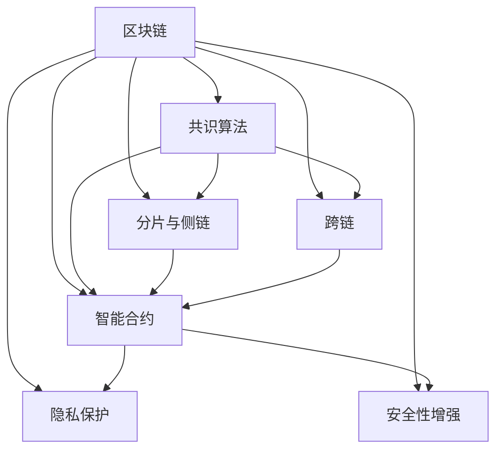

                 

# 区块链管理：探索分布式技术的商业应用

## 1. 背景介绍

### 1.1 问题由来

在过去的十年里，区块链技术以其去中心化、不可篡改的特性，逐渐从学术研究走入商业应用，并引发了金融、供应链、医疗等多个领域的变革。然而，区块链的复杂性也使其在实际应用中面临诸多挑战。

- **交易成本高**：传统的中心化金融系统，如银行转账和信用证等，交易费用较低，而区块链的去中心化特性要求每个节点都验证交易，导致交易成本显著提高。
- **性能瓶颈**：现有区块链系统的处理速度较慢，如比特币每秒只能处理7笔交易，这远不能满足大规模商业应用的需求。
- **扩展性不足**：区块链的共识机制使得加入新节点的过程复杂且耗时，限制了系统规模的扩展性。
- **安全性问题**：虽然区块链具有不可篡改的特性，但在智能合约、代币管理和隐私保护等方面仍存在安全隐患。

为应对这些挑战，区块链管理成为了一个重要的研究方向。通过合理管理区块链网络，可以有效降低交易成本，提升性能，增强扩展性，并改善安全性。本文将系统介绍区块链管理的关键概念、核心算法原理及具体操作步骤，探讨其在实际应用中的具体落地方案。

### 1.2 问题核心关键点

区块链管理的主要目标是通过优化区块链的共识机制、网络结构、共识算法等技术手段，提升区块链系统的性能和安全性，同时降低交易成本。具体包括以下几个关键点：

- **共识机制优化**：设计新的共识算法或改进现有共识机制，以提升区块链的性能和扩展性。
- **分片与侧链技术**：通过分片技术将大规模区块链系统划分成多个小网络，提高网络并发处理能力。
- **跨链技术**：实现不同区块链网络之间的互联互通，提升系统的灵活性和互操作性。
- **隐私保护**：通过智能合约、零知识证明等技术，实现交易的隐私保护和匿名性。
- **安全性增强**：设计防御机制，如区块链防火墙、异常检测等，增强系统安全防护。

了解这些关键点，将帮助我们更好地把握区块链管理的技术脉络，探索其商业应用的可能性。

## 2. 核心概念与联系

### 2.1 核心概念概述

为更好地理解区块链管理方法，本文将介绍几个核心概念及其相互之间的联系：

- **区块链**：一种去中心化的分布式数据库，通过时间戳和哈希链保证数据不可篡改，并按顺序存储交易记录。
- **共识算法**：在区块链网络中达成共识的机制，如PoW、PoS等。
- **分片与侧链**：通过分片技术将大规模区块链系统划分成多个小网络，提高网络并发处理能力。
- **跨链**：实现不同区块链网络之间的互联互通。
- **智能合约**：一种自动执行的合约，基于区块链去中心化特性和不可篡改性，保障交易的自动化和可执行性。
- **隐私保护**：通过密码学技术，如零知识证明、同态加密等，实现交易隐私保护。
- **安全性增强**：采用防御机制，如区块链防火墙、异常检测等，保障系统安全。

这些概念通过区块链网络的组织架构，构成了一个完整的管理框架。通过优化学术研究和工程实践相结合的方式，可以提升区块链系统的性能和安全性，为商业应用提供坚实基础。

### 2.2 核心概念原理和架构的 Mermaid 流程图



这个流程图展示了区块链管理中的关键概念及其之间的相互关系。通过优化共识算法、采用分片与侧链、实现跨链技术、引入智能合约、加强隐私保护和增强安全性，我们可以构建一个高效、安全、可扩展的区块链网络。

## 3. 核心算法原理 & 具体操作步骤

### 3.1 算法原理概述

区块链管理中的核心算法原理主要集中在共识算法和分片技术上。

#### 3.1.1 共识算法

共识算法是区块链网络中达成共识的机制，决定哪些交易被打包入区块链，哪些被忽略。当前常用的共识算法包括：

- **PoW（工作量证明）**：通过挖矿竞争解决难题，最终获得记账权。优点是安全性高，但能源消耗大。
- **PoS（权益证明）**：根据节点的财富和贡献决定记账权。优点是能耗低，但可能存在51%攻击的风险。
- **DPoS（委托权益证明）**：结合了PoW和PoS的优点，通过投票选出的委托人获得记账权。优点是能耗低、决策效率高。

共识算法的选择和优化是提升区块链性能和扩展性的关键。

#### 3.1.2 分片技术

分片技术是将大规模区块链系统划分成多个小网络，每个小网络处理一部分交易。通过将大网络拆分成多个小网络，可以在不增加资源投入的情况下提升系统的并发处理能力。

#### 3.1.3 跨链技术

跨链技术是实现不同区块链网络之间互联互通的机制。通过跨链技术，不同区块链之间的交易可以相互传递，实现信息共享和资产流动性。

### 3.2 算法步骤详解

#### 3.2.1 共识算法优化

1. **选择合适的共识算法**：根据具体应用场景，选择适合的共识算法。
2. **优化算法参数**：如调整PoW的工作难度、PoS的权益比例等。
3. **引入激励机制**：设计有效的奖励机制，提高节点参与度和网络安全性。

#### 3.2.2 分片与侧链技术

1. **网络划分**：将大网络划分成多个小网络。
2. **数据同步**：保证分片网络间的数据同步，确保系统的整体一致性。
3. **分片节点选择**：通过合理的分片策略，选择适合的节点负责分片数据的处理和验证。

#### 3.2.3 跨链技术

1. **标准协议设计**：制定跨链协议，实现不同区块链网络间的通信和交易。
2. **跨链通道建立**：在网络间建立通道，实现资产和信息的快速传递。
3. **安全验证**：设计安全的验证机制，保障跨链交易的安全性。

### 3.3 算法优缺点

#### 3.3.1 共识算法的优缺点

- **优点**：
  - 安全性高：共识算法通过多方验证，确保交易的不可篡改性。
  - 公平性：共识算法使得网络中的每个节点都有平等的机会参与验证。
- **缺点**：
  - 能耗高：某些共识算法（如PoW）需要大量计算资源。
  - 决策效率低：共识算法需要通过大量的节点验证，导致决策效率低下。

#### 3.3.2 分片技术的优缺点

- **优点**：
  - 提升性能：通过分片技术，网络并发处理能力大大提升。
  - 扩展性增强：分片技术使得网络更容易扩展。
- **缺点**：
  - 数据同步复杂：分片网络间的数据同步需要额外的计算和通信开销。
  - 安全性挑战：分片技术可能会增加网络被攻击的风险。

#### 3.3.3 跨链技术的优缺点

- **优点**：
  - 增强互操作性：跨链技术实现不同区块链网络之间的互操作，提升系统的灵活性。
  - 提升流动性：跨链技术使得不同区块链之间的资产可以自由流动。
- **缺点**：
  - 安全性风险：跨链交易可能面临更高的安全风险。
  - 复杂性增加：跨链技术的实现复杂度较高。

### 3.4 算法应用领域

区块链管理技术在多个领域中得到了广泛应用，包括但不限于：

- **金融**：通过区块链管理技术，实现跨境支付、清算、资产管理等功能。
- **供应链**：区块链管理提升供应链的透明度和效率，实现智能合约管理。
- **医疗**：通过区块链管理，实现医疗数据的安全共享和隐私保护。
- **政府**：区块链管理保障政府事务的透明性和安全性，提高公共服务效率。
- **能源**：通过区块链管理，实现能源交易的自动化和透明化。

## 4. 数学模型和公式 & 详细讲解 & 举例说明

### 4.1 数学模型构建

在区块链管理中，数学模型主要涉及共识算法的设计和优化。以PoS算法为例，其基本模型可以表示为：

$$
P_{t+1} = P_{t} * (1 - r_{t+1}) + P_{t+1} * r_{t+1}
$$

其中，$P_{t+1}$ 表示节点在下一轮的权益比例，$P_{t}$ 表示当前轮的权益比例，$r_{t+1}$ 表示节点在下一轮的验证概率。

### 4.2 公式推导过程

- **权益比例更新**：
  - $P_{t+1}$：节点在下一轮的权益比例，由当前轮的权益比例$P_{t}$和下一轮的验证概率$r_{t+1}$决定。
  - 验证概率$r_{t+1}$通常为节点财富的函数，即$r_{t+1} = \frac{W_{t+1}}{S}$，其中$W_{t+1}$表示节点在下一轮的财富，$S$表示网络的总财富。

- **验证概率调整**：
  - 验证概率$r_{t+1}$的调整通常基于节点的验证记录和网络状况，以确保网络安全性。

### 4.3 案例分析与讲解

- **PoS算法案例**：
  - 假设一个PoS网络，每个节点持有的代币数量为$W_{t+1}$，网络总财富为$S$。通过调整验证概率，可以使得网络中的每个节点都有机会参与验证，同时保证网络的安全性。

## 5. 项目实践：代码实例和详细解释说明

### 5.1 开发环境搭建

在区块链管理项目实践中，开发环境搭建至关重要。以下是具体的搭建步骤：

1. **安装Node.js和npm**：Node.js是区块链开发的基础平台，通过npm安装所需模块。
2. **配置开发环境**：配置GitHub仓库，获取最新的区块链管理代码。
3. **开发工具安装**：安装Visual Studio Code、Git、Docker等开发工具，提升开发效率。

### 5.2 源代码详细实现

以下是一个简单的区块链管理系统的源代码实现：

```python
# 导入必要的库
from flask import Flask, jsonify
import hashlib
import time

# 初始化区块链
class BlockChain:
    def __init__(self):
        self.chain = []
        self.create_genesis_block()

    def create_genesis_block(self):
        block = {'index': 1, 'timestamp': time.time(), 'data': 'Genesis Block', 'previous_hash': '0'}
        self.chain.append(block)

    def get_latest_block(self):
        return self.chain[-1]

    def add_block(self, data):
        block = {'index': len(self.chain) + 1, 'timestamp': time.time(), 'data': data, 'previous_hash': self.get_latest_block()['hash']}
        block['hash'] = self.hash_block(block)
        self.chain.append(block)

    def hash_block(self, block):
        return hashlib.sha256(block.dumps()).hexdigest()

    def is_valid_chain(self, chain):
        for i in range(1, len(chain)):
            current_block = chain[i]
            previous_block = chain[i-1]
            if current_block['hash'] != self.hash_block(current_block):
                return False
            if current_block['previous_hash'] != previous_block['hash']:
                return False
        return True
```

### 5.3 代码解读与分析

- **区块链类实现**：
  - `__init__`方法：初始化区块链，并创建创世块。
  - `create_genesis_block`方法：创建创世块。
  - `get_latest_block`方法：获取最新块。
  - `add_block`方法：添加新块。
  - `hash_block`方法：计算块的哈希值。
  - `is_valid_chain`方法：验证区块链的完整性。

## 6. 实际应用场景

### 6.1 智能合约管理

智能合约是区块链管理中的重要应用场景。通过区块链管理，智能合约可以自动执行，保障交易的公正性和透明性。例如，在供应链管理中，智能合约可以自动记录货物的运输、验收等环节，确保供应链的可追溯性和透明度。

### 6.2 金融资产管理

在金融领域，区块链管理技术可以用于跨境支付、清算、资产管理等。例如，通过区块链管理技术，可以实现实时交易结算，提升交易效率和安全性。

### 6.3 医疗数据管理

在医疗领域，区块链管理可以保障医疗数据的隐私和安全。通过区块链管理，医生可以共享患者的病历信息，而患者的数据隐私得到保障。

### 6.4 未来应用展望

未来，随着区块链管理技术的不断进步，其在商业应用中的可能性将进一步拓展：

- **去中心化自治组织**：基于区块链管理的去中心化自治组织（DAO），将极大提升决策效率和透明度。
- **社交网络**：区块链管理技术可以构建去中心化的社交网络，实现信息的去中心化传播。
- **智能合约执行平台**：通过区块链管理技术，构建高效、安全的智能合约执行平台，为金融、供应链、医疗等领域提供支持。

## 7. 工具和资源推荐

### 7.1 学习资源推荐

1. **《区块链原理与应用》**：深入介绍区块链技术的基本原理和实际应用，适合初学者入门。
2. **《分布式共识算法》**：讲解共识算法的原理和实现，适合进阶学习者。
3. **《区块链网络设计》**：介绍区块链网络的设计和优化，适合从事区块链开发和运维的人员。
4. **Blockchain Magazine**：提供最新的区块链研究、技术资讯和应用案例。
5. **Blockchain Podcast**：通过音频形式，讲解区块链技术和应用场景，适合碎片化学习。

### 7.2 开发工具推荐

1. **Node.js**：区块链开发的基础平台，提供丰富的API和库。
2. **npm**：Node.js的包管理工具，方便安装和更新所需模块。
3. **Visual Studio Code**：高效的前端开发工具，支持多种语言和框架。
4. **Git**：版本控制系统，方便代码管理和协作。
5. **Docker**：容器化平台，方便区块链网络的部署和管理。

### 7.3 相关论文推荐

1. **《区块链共识算法研究》**：介绍了PoW、PoS、DPoS等共识算法的原理和实现。
2. **《分布式账本技术研究》**：探讨了分布式账本技术的基本原理和应用场景。
3. **《智能合约设计与安全》**：讲解智能合约的设计思路和安全性问题。

## 8. 总结：未来发展趋势与挑战

### 8.1 研究成果总结

区块链管理技术在区块链领域的应用和研究取得了显著进展，为区块链系统的性能和安全性提供了有力保障。未来，随着技术的不断进步，区块链管理将进一步拓展其应用领域，推动区块链技术在商业和社会中的应用。

### 8.2 未来发展趋势

未来，区块链管理技术的发展将呈现以下几个趋势：

- **共识算法优化**：通过新的共识算法和改进现有共识机制，提升区块链系统的性能和扩展性。
- **分片与侧链技术**：进一步优化分片与侧链技术，提高网络并发处理能力和扩展性。
- **跨链技术**：实现不同区块链网络之间的互联互通，提升系统的灵活性和互操作性。
- **隐私保护**：通过智能合约、零知识证明等技术，实现交易的隐私保护和匿名性。
- **安全性增强**：设计防御机制，如区块链防火墙、异常检测等，增强系统安全防护。

### 8.3 面临的挑战

尽管区块链管理技术在许多方面已经取得了进展，但仍面临诸多挑战：

- **性能瓶颈**：大规模区块链系统的性能瓶颈问题仍然存在。
- **安全性问题**：智能合约和跨链交易的安全性问题需要进一步解决。
- **可扩展性**：如何在大规模区块链系统中实现高效的扩展性仍然是一个挑战。
- **能耗问题**：部分共识算法仍存在较高的能源消耗。
- **法律合规**：区块链技术在不同国家地区的法律合规性问题需要引起重视。

### 8.4 研究展望

未来的研究需要在以下几个方面寻求新的突破：

- **新共识算法的设计**：开发更加高效、安全的共识算法，提升系统的性能和扩展性。
- **分片与侧链技术的优化**：进一步优化分片与侧链技术，实现更高效的数据同步和处理。
- **跨链技术的标准化**：制定跨链协议的标准，实现不同区块链网络之间的互操作。
- **隐私保护技术的创新**：引入新的隐私保护技术，实现交易的隐私保护和匿名性。
- **安全防护机制的完善**：设计更全面的安全防护机制，保障系统的安全性。

## 9. 附录：常见问题与解答

**Q1: 什么是区块链管理？**

A: 区块链管理是指通过优化共识算法、分片技术、跨链技术等手段，提升区块链系统的性能和安全性，同时降低交易成本。

**Q2: 区块链管理在实际应用中需要注意哪些问题？**

A: 区块链管理在实际应用中需要注意以下几个问题：
1. 性能瓶颈：大规模区块链系统的性能瓶颈问题需要解决。
2. 安全性问题：智能合约和跨链交易的安全性问题需要引起重视。
3. 可扩展性：在大规模区块链系统中实现高效的扩展性仍然是一个挑战。
4. 能耗问题：部分共识算法仍存在较高的能源消耗。
5. 法律合规：区块链技术在不同国家地区的法律合规性问题需要引起重视。

**Q3: 区块链管理的未来发展方向是什么？**

A: 区块链管理的未来发展方向包括：
1. 共识算法优化：开发更加高效、安全的共识算法。
2. 分片与侧链技术优化：进一步优化分片与侧链技术，实现更高效的数据同步和处理。
3. 跨链技术的标准化：制定跨链协议的标准，实现不同区块链网络之间的互操作。
4. 隐私保护技术的创新：引入新的隐私保护技术，实现交易的隐私保护和匿名性。
5. 安全防护机制的完善：设计更全面的安全防护机制，保障系统的安全性。

**Q4: 区块链管理的核心算法是什么？**

A: 区块链管理的核心算法包括：
1. 共识算法：如PoW、PoS、DPoS等。
2. 分片技术：通过分片技术将大规模区块链系统划分成多个小网络。
3. 跨链技术：实现不同区块链网络之间的互联互通。

**Q5: 区块链管理在各个领域的应用场景是什么？**

A: 区块链管理在各个领域的应用场景包括：
1. 金融：实现跨境支付、清算、资产管理等。
2. 供应链：提升供应链的透明度和效率，实现智能合约管理。
3. 医疗：保障医疗数据的隐私和安全。
4. 政府：保障政府事务的透明性和安全性。
5. 能源：实现能源交易的自动化和透明化。

**Q6: 区块链管理的数学模型是什么？**

A: 区块链管理的数学模型主要涉及共识算法的设计和优化。以PoS算法为例，其基本模型可以表示为：
$$
P_{t+1} = P_{t} * (1 - r_{t+1}) + P_{t+1} * r_{t+1}
$$

其中，$P_{t+1}$表示节点在下一轮的权益比例，$P_{t}$表示当前轮的权益比例，$r_{t+1}$表示节点在下一轮的验证概率。

---

作者：禅与计算机程序设计艺术 / Zen and the Art of Computer Programming

