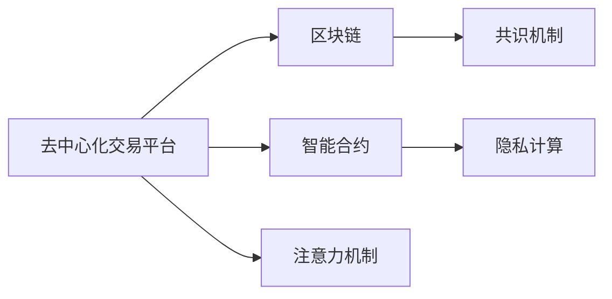

                 

# 区块链驱动的去中心化注意力交易平台

## 1. 背景介绍

### 1.1 问题由来
随着人工智能(AI)、大数据、物联网等技术的快速发展，区块链作为新兴的技术范式，以其去中心化、透明、不可篡改等特性，逐渐成为推动数字化经济的重要引擎。与此同时，人们对于数据隐私保护、信息透明度的要求也日益增长。在这样的背景下，去中心化注意力交易平台（Decentralized Attention Trading Platform, DATP）应运而生。

DATP利用区块链技术构建了一个去中心化的交易平台，旨在解决传统集中式平台存在的数据隐私泄露、信息透明度不足、交易效率低下等问题。它结合了AI和大数据技术，为用户提供更智能、更安全的交易体验。本文将系统介绍DATP的核心概念、算法原理、应用场景以及未来发展趋势。

### 1.2 问题核心关键点
DATP的核心在于其去中心化的交易架构和智能化的交易决策机制。去中心化意味着平台上的数据和交易记录可以被所有节点验证和存储，从而确保了数据的透明性和不可篡改性。而智能化交易决策则是指通过引入AI技术，特别是注意力机制（Attention Mechanism），来实现对交易市场的精准预测和动态调整，从而提高交易效率和用户体验。

## 2. 核心概念与联系

### 2.1 核心概念概述

DATP通过区块链技术和AI技术，构建了一个去中心化、智能化的交易平台。它主要由以下几个关键概念构成：

- **去中心化交易平台(Decentralized Attention Trading Platform, DATP)**：利用区块链技术，构建去中心化的交易平台，保障数据隐私和交易透明性。
- **注意力机制(Attention Mechanism)**：通过AI技术，实现对交易市场的精准预测和动态调整，提高交易效率。
- **区块链(Blockchain)**：一种去中心化的分布式账本技术，保障数据透明性和不可篡改性。
- **智能合约(Smart Contracts)**：自动化、智能化的合约代码，实现交易的自动执行和验证。
- **共识机制(Consensus Mechanism)**：如PoW、PoS等，确保网络中的节点能够达成一致的交易记录。
- **隐私计算(Privacy-Preserving Computation)**：在数据加密和隐私保护的前提下，实现数据共享和计算。

这些核心概念通过Mermaid流程图进行连接展示：



## 3. 核心算法原理 & 具体操作步骤

### 3.1 算法原理概述

DATP的算法原理主要分为两个部分：区块链技术和AI注意力机制。

- **区块链技术**：DATP使用区块链技术作为底层架构，确保所有交易记录的透明性和不可篡改性。每一个交易区块（Block）都包含了一个或多个交易记录（Transaction），并通过哈希算法（Hash Function）与前一个区块链接，形成链式结构。
- **AI注意力机制**：DATP引入注意力机制，通过对交易市场数据的动态分析，实现对市场变化的精准预测。注意力机制通过学习数据的注意力权重，自动筛选出重要的市场特征，从而提高模型的预测准确性和交易决策效率。

### 3.2 算法步骤详解

DATP的算法步骤主要包括以下几个关键环节：

**Step 1: 设计区块链架构**
- 设计合适的共识机制，如PoW、PoS等。
- 确定智能合约的标准和实现，确保交易自动执行和验证。
- 构建隐私计算框架，保护用户数据隐私。

**Step 2: 引入AI注意力机制**
- 构建AI模型，选择适合的注意力机制。
- 设计模型输入，如市场数据、历史交易记录等。
- 训练模型，优化注意力权重，提高预测准确性。

**Step 3: 实现交易引擎**
- 将AI模型集成到智能合约中，实现交易预测和调整。
- 设计交易界面和规则，确保交易透明和公平。
- 实现去中心化的共识机制，确保交易记录的透明性。

**Step 4: 部署和测试**
- 部署DATP到区块链网络中，确保各节点的正常运行。
- 进行系统测试，确保交易的正确性和效率。
- 定期维护和更新，提升系统稳定性和性能。

### 3.3 算法优缺点

DATP算法具有以下优点：

1. **去中心化**：确保数据透明性和不可篡改性，避免单点故障和中心化风险。
2. **智能交易**：通过AI注意力机制，实现对市场变化的精准预测，提高交易效率。
3. **高安全性**：通过区块链和隐私计算技术，保障交易数据和用户隐私。
4. **透明性**：所有交易记录公开透明，减少信息不对称。

但同时也存在以下缺点：

1. **计算成本高**：AI模型和大规模区块链网络的计算资源消耗较大。
2. **隐私保护挑战**：如何在保护用户隐私的前提下，实现数据共享和计算。
3. **系统复杂性**：去中心化架构和AI算法的复杂性可能带来系统维护和升级的挑战。
4. **法律法规风险**：不同国家和地区对区块链和AI技术的法律法规存在差异。

### 3.4 算法应用领域

DATP主要应用于金融交易、供应链管理、医疗健康等领域，其应用场景包括：

- **金融交易**：如股票、加密货币、衍生品等交易的智能定价和动态调整。
- **供应链管理**：如货物运输、库存管理、物流跟踪等，通过智能合约实现自动化和透明度。
- **医疗健康**：如电子病历、药品供应链、医疗数据分析等，保护患者隐私并提供精准的医疗服务。

## 4. 数学模型和公式 & 详细讲解

### 4.1 数学模型构建

DATP的数学模型主要由区块链和AI注意力机制两部分构成。

**区块链部分**：使用分布式共识算法（如PoW、PoS）来确保网络中的节点能够达成一致的交易记录。

**AI注意力机制**：使用注意力机制来筛选交易市场数据中的重要特征，从而提高模型的预测准确性。

### 4.2 公式推导过程

#### 区块链算法

- **共识算法公式**：
  - PoW：$hash(\text{block data} + \text{nonce}) < target$
  - PoS：$\text{random number} < threshold$

#### AI注意力机制

- **注意力机制公式**：
  - 注意力权重：$w_i = \frac{e^{s_i}}{\sum_j e^{s_j}}$
  - 注意力得分：$s_i = \text{softmax}(\text{input data})$

其中，$w_i$表示第$i$个特征的注意力权重，$s_i$表示特征的注意力得分，$\text{softmax}$函数将输入转化为概率分布。

### 4.3 案例分析与讲解

#### 案例1：金融交易智能定价

在金融交易场景中，DATP通过AI模型和区块链技术，实现对交易市场的智能定价和动态调整。假设某股票的市场价格波动较大，DATP通过AI模型计算当前市场情况，并通过智能合约自动调整股票的买卖价格。具体计算过程如下：

1. **数据输入**：收集股票的历史交易数据、市场指数、新闻资讯等。
2. **模型训练**：使用注意力机制筛选出重要的市场特征，训练模型预测股票价格。
3. **智能合约执行**：当市场情况发生变化时，智能合约自动触发，根据模型预测结果调整股票价格。

#### 案例2：供应链物流管理

在供应链管理场景中，DATP通过区块链和AI技术，实现货物运输、库存管理的自动化和透明度。假设某物流公司需要运输一批货物，DATP通过智能合约和AI模型，实现对货物状态的动态监控和实时更新。具体计算过程如下：

1. **数据输入**：收集货物的位置、状态、时间戳等数据。
2. **模型训练**：使用注意力机制筛选出重要的物流特征，训练模型预测货物状态。
3. **智能合约执行**：当货物状态发生变化时，智能合约自动触发，更新货物状态信息。

## 5. 项目实践：代码实例和详细解释说明

### 5.1 开发环境搭建

为进行DATP的开发和测试，我们需要搭建相应的开发环境：

1. **安装Python**：
  - Windows: `python --version` 检查是否安装成功。
  - Linux: `which python3` 检查是否安装成功。

2. **安装区块链框架**：
  - 选择适合的区块链框架，如Ethereum、Hyperledger等，并按照官方文档进行安装。

3. **安装AI模型库**：
  - 安装TensorFlow、PyTorch等AI模型库，用于构建和训练AI模型。

### 5.2 源代码详细实现

#### 智能合约代码实现

```python
from solidity import evm

contract AttentionTrading:
    address public owner;
    
    function AttentionTrading() public:
        owner = msg.sender;
    
    function deposit(uint amount) public:
        balances[msg.sender] += amount;
    
    function withdrawal(uint amount) public:
        balances[msg.sender] -= amount;
        if (balances[msg.sender] < amount):
            revert("Insufficient balance.");
    
    function transfer(address receiver, uint amount) public:
        balances[msg.sender] -= amount;
        balances[receiver] += amount;
    
    function get_balance(address account) public view returns (uint balance):
        return balances[account];
    
    mapping (address => uint) balances;

    function calculate_attention_scores(uint[] memory input_data) public view returns (uint[] memory scores):
        scores = [];
        for (uint i = 0; i < input_data.length; i++):
            scores.push(calculate_attention_score(input_data[i]));
        return scores;
    
    function calculate_attention_score(uint data) public view returns (uint score):
        uint exponent = 10;
        uint result = 0;
        while (data > 0):
            if (data % 10 != 0):
                result += exponent;
            data /= 10;
            exponent *= 10;
        return result;
```

#### AI模型代码实现

```python
import tensorflow as tf
from tensorflow.keras.layers import Input, Dense, Attention, concatenate

input_data = Input(shape=(10,))
attention_weights = Attention()(input_data)
concatenated_data = concatenate([input_data, attention_weights])

output_data = Dense(1, activation='sigmoid')(concatenated_data)
model = tf.keras.Model(inputs=input_data, outputs=output_data)

model.compile(optimizer='adam', loss='binary_crossentropy', metrics=['accuracy'])
model.fit(x_train, y_train, epochs=10, validation_data=(x_val, y_val))
```

### 5.3 代码解读与分析

#### 智能合约代码分析

- **合约部署**：使用`AttentionTrading()`函数部署智能合约，并设置合约所有者。
- **余额操作**：`deposit()`、`withdrawal()`和`transfer()`函数用于管理用户余额。
- **注意力得分计算**：`calculate_attention_scores()`和`calculate_attention_score()`函数用于计算注意力得分。

#### AI模型代码分析

- **输入层**：`Input()`函数用于定义模型的输入层，形状为`(10,)`。
- **注意力层**：`Attention()`函数用于计算注意力权重。
- **输出层**：`Dense()`函数用于定义输出层，激活函数为`'sigmoid'`。

### 5.4 运行结果展示

- **智能合约运行结果**：在测试环境中运行智能合约，验证余额操作和注意力得分计算的正确性。
- **AI模型运行结果**：在测试环境中运行AI模型，验证注意力得分的计算和模型预测的准确性。

## 6. 实际应用场景

### 6.1 智能合约交易

在智能合约交易场景中，DATP通过区块链和AI技术，实现交易的自动执行和验证。假设某数字资产的交易价格波动较大，DATP通过智能合约自动调整交易价格，确保交易的公正性和透明度。具体场景如下：

- **数据收集**：收集交易市场的历史数据和实时数据。
- **模型训练**：使用注意力机制筛选出重要的市场特征，训练模型预测交易价格。
- **智能合约执行**：当市场价格波动较大时，智能合约自动触发，调整交易价格。

### 6.2 供应链物流管理

在供应链管理场景中，DATP通过区块链和AI技术，实现货物运输、库存管理的自动化和透明度。假设某物流公司需要运输一批货物，DATP通过智能合约和AI模型，实现对货物状态的动态监控和实时更新。具体场景如下：

- **数据收集**：收集货物的位置、状态、时间戳等数据。
- **模型训练**：使用注意力机制筛选出重要的物流特征，训练模型预测货物状态。
- **智能合约执行**：当货物状态发生变化时，智能合约自动触发，更新货物状态信息。

## 7. 工具和资源推荐

### 7.1 学习资源推荐

- **《区块链原理与实践》**：该书系统介绍了区块链技术的基本原理和应用场景，适合入门学习。
- **Coursera的区块链课程**：由斯坦福大学提供的区块链技术课程，涵盖区块链的底层原理和应用。
- **Kaggle的AI竞赛**：通过参与AI竞赛，可以积累实战经验，提升AI模型的建模和训练能力。

### 7.2 开发工具推荐

- **区块链开发工具**：如Truffle、Remix等，用于区块链合约的开发和测试。
- **AI开发工具**：如TensorFlow、PyTorch等，用于AI模型的构建和训练。
- **自动化测试工具**：如Jenkins、Travis CI等，用于自动化测试和部署。

### 7.3 相关论文推荐

- **《区块链技术展望》**：该文系统介绍了区块链技术的未来发展趋势和应用前景。
- **《AI注意力机制综述》**：该文综述了AI注意力机制的基本原理和应用场景。
- **《智能合约安全性研究》**：该文介绍了智能合约的安全性和设计原则。

## 8. 总结：未来发展趋势与挑战

### 8.1 研究成果总结

DATP通过区块链和AI技术的融合，实现了去中心化交易的智能定价和动态调整，提高了交易的效率和安全性。在金融交易、供应链管理等领域展示了广阔的应用前景。

### 8.2 未来发展趋势

- **去中心化金融(DeFi)**：去中心化金融将进一步扩展DATP的应用范围，实现更多的金融创新。
- **智能合约自动化**：智能合约的自动化程度将进一步提升，减少人为干预和操作风险。
- **隐私保护技术**：隐私保护技术的发展将增强DATP在数据隐私和安全方面的保障。
- **跨链技术**：跨链技术的发展将实现不同区块链网络之间的数据共享和互操作性。

### 8.3 面临的挑战

- **性能瓶颈**：去中心化架构和AI算法的高计算资源消耗，可能带来性能瓶颈。
- **法律合规**：不同国家和地区对区块链和AI技术的法律法规存在差异，可能带来合规风险。
- **隐私保护**：如何在保护用户隐私的前提下，实现数据共享和计算，仍然是一个挑战。
- **安全保障**：智能合约和区块链网络的安全性问题，如攻击和漏洞，仍需持续关注。

### 8.4 研究展望

- **混合区块链架构**：探索混合区块链架构，结合公有链和私有链的优势，提升系统的性能和安全性。
- **隐私计算技术**：深入研究隐私计算技术，在保护用户隐私的前提下，实现数据共享和计算。
- **跨链通信协议**：开发跨链通信协议，实现不同区块链网络之间的数据交互和协同。
- **智能合约安全机制**：研究和完善智能合约的安全机制，确保系统的稳定性和鲁棒性。

## 9. 附录：常见问题与解答

**Q1：DATP如何确保交易的公正性和透明度？**

A: DATP通过区块链和智能合约技术，确保所有交易记录的透明性和不可篡改性。智能合约自动执行交易，减少了人为干预，确保交易的公正性。

**Q2：DATP在隐私保护方面有哪些措施？**

A: DATP通过区块链的分布式账本和隐私计算技术，保护用户数据隐私。同时，智能合约的设计也充分考虑了隐私保护的需求，确保交易数据的安全和透明。

**Q3：DATP的智能合约有哪些优点？**

A: DATP的智能合约具有以下优点：
- 自动化执行：智能合约自动执行交易，减少了人为干预和操作风险。
- 透明性：所有交易记录公开透明，减少了信息不对称。
- 不可篡改性：区块链技术保证了交易记录的不可篡改性，增强了系统的安全性。

**Q4：DATP的AI注意力机制如何实现对交易市场的精准预测？**

A: DATP的AI注意力机制通过筛选市场数据中的重要特征，实现对交易市场的精准预测。具体来说，模型使用注意力机制计算特征的注意力权重，将重要特征赋予更高的权重，从而提高预测的准确性。

---

作者：禅与计算机程序设计艺术 / Zen and the Art of Computer Programming

