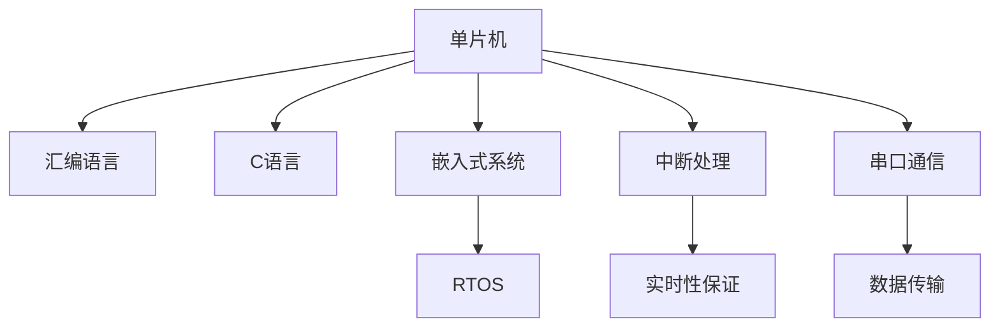

                 

## 1. 背景介绍

### 1.1 问题由来

单片机（Microcontroller Unit, MCU）作为嵌入式系统的大脑，其重要性不言而喻。随着物联网、人工智能等技术的不断发展，单片机被广泛应用于智能家居、工业控制、汽车电子、医疗设备等多个领域。然而，对于许多初学者和开发者而言，单片机编程并非易事。一方面，单片机的硬件抽象层复杂，需要深入了解底层逻辑；另一方面，单片机编程语言相对简单，与高级语言大不相同。

单片机编程的难点主要集中在以下几个方面：
- 硬件接口多样化：单片机需要与各种传感器、外围设备进行交互，接口协议复杂。
- 资源受限：单片机的存储空间和计算能力有限，开发过程中需要充分考虑资源优化。
- 实时性要求高：嵌入式系统往往需要处理实时数据，单片机程序必须在短时间内完成响应。

为了解决这些问题，本文将从单片机编程的基础知识出发，详细介绍单片机的工作原理、编程工具和方法，并结合实际项目案例，探讨单片机编程的最佳实践。

### 1.2 问题核心关键点

单片机编程的核心在于理解单片机的工作原理，熟悉常用的编程语言和方法，掌握基本的硬件接口开发和资源优化技巧。本文将围绕这些关键点，系统性地介绍单片机编程的技术体系。

## 2. 核心概念与联系

### 2.1 核心概念概述

为更好地理解单片机编程，本节将介绍几个密切相关的核心概念：

- **单片机**：是一种集成电路芯片，具有CPU和外围电路的集成设计，可以独立运行程序。单片机通常具备数据存储、定时器、串口通信等基本功能，适合嵌入式系统开发。

- **汇编语言**：是一种低级编程语言，直接操作硬件寄存器和内存地址。汇编语言易于理解硬件逻辑，但可读性差，编写复杂。

- **C语言**：是一种高级编程语言，具备结构化、可移植等特点。C语言支持指针和低级操作，可用于单片机编程。

- **嵌入式系统**：是一种专用的计算机系统，通常具有有限的资源和特定的应用场景。单片机是嵌入式系统的核心组成部分，负责控制和执行应用逻辑。

- **实时操作系统**（Real-Time Operating System, RTOS）：是一种能够保证任务在规定时间内完成的操作系统。RTOS通常用于需要高实时性的应用场景，如工业控制、航空航天等。

- **中断处理**：是一种硬件和软件协同工作机制，用于处理突发事件，保证系统的实时性。

- **串口通信**：是一种常用的数据传输协议，适用于单片机与PC、外围设备等的通信。

这些核心概念之间的逻辑关系可以通过以下Mermaid流程图来展示：



这个流程图展示了的单片机编程的核心概念及其之间的关系：

1. 单片机通过汇编语言或C语言进行编程。
2. 嵌入式系统运行单片机程序。
3. 实时操作系统保证单片机程序的实时性。
4. 中断处理机制用于响应突发事件。
5. 串口通信用于与其他设备进行数据传输。

这些概念共同构成了单片机编程的技术基础，帮助开发者掌握单片机的工作原理和编程技巧。

## 3. 核心算法原理 & 具体操作步骤

### 3.1 算法原理概述

单片机编程的核心算法原理主要包括以下几个方面：

- 程序加载和执行：单片机从存储器中读取指令，解码后执行相应的操作。
- 中断处理：当系统发生中断事件时，单片机暂停当前任务，转而执行中断服务程序。
- 数据传输：单片机通过串口、I/O口等接口进行数据传输。

单片机编程的步骤一般如下：

1. 确定单片机型号和引脚配置。
2. 设计程序逻辑，编写汇编语言或C语言代码。
3. 编写中断服务程序。
4. 配置串口和其他外设。
5. 编写初始化程序。
6. 调试和测试程序。
7. 优化程序性能。

### 3.2 算法步骤详解

**Step 1: 确定单片机型号和引脚配置**

首先需要确定使用的单片机型号，常见的单片机包括STM32、PIC、AVR等。根据应用需求选择合适的单片机，并配置相应的引脚功能。

**Step 2: 设计程序逻辑，编写代码**

在确定单片机型号和引脚配置后，需要设计程序的逻辑结构。常见的程序逻辑包括主循环、中断服务函数、数据处理函数等。

- **主循环**：用于执行单片机程序的主要逻辑，通常包括系统初始化、数据采集、处理和输出等步骤。
- **中断服务函数**：用于处理外部中断事件，如串口接收、定时器溢出等。
- **数据处理函数**：用于处理输入数据和输出结果，如转换、过滤和存储等。

编写代码时，建议采用模块化设计，将程序分为多个功能模块，便于管理和维护。

**Step 3: 编写中断服务程序**

中断服务程序是单片机编程的关键部分，用于处理中断事件。编写中断服务程序时，需要注意以下几点：

- 中断服务函数名通常以“ISR”开头。
- 中断服务程序必须在中断发生时立即执行，避免中断返回前发生新的中断事件。
- 中断服务程序应尽可能简单，避免长时间的计算和复杂的逻辑判断。

**Step 4: 配置串口和其他外设**

配置串口和其他外设是单片机编程的基础。常见的外设包括I/O口、定时器、PWM等。配置外设时，需要注意以下几点：

- 配置寄存器需要根据单片机型号进行具体操作。
- 设置外设参数时，需要注意参数的合理性和兼容性。
- 配置完成后，需要通过软件验证外设是否正常工作。

**Step 5: 编写初始化程序**

初始化程序是单片机程序的基础，用于初始化各种外设和设置系统参数。编写初始化程序时，需要注意以下几点：

- 初始化程序应尽量简化，避免不必要的复杂操作。
- 初始化程序应按照优先级排序，先执行关键性操作。
- 初始化程序应进行严格的测试，确保系统稳定运行。

**Step 6: 调试和测试程序**

调试和测试程序是单片机编程的关键步骤，用于发现和修正程序中的错误。调试和测试程序时，需要注意以下几点：

- 使用调试器进行程序调试，跟踪程序的执行过程。
- 编写测试用例，对程序进行全面测试，验证程序的正确性和稳定性。
- 记录调试结果，分析程序的错误和优化方向。

**Step 7: 优化程序性能**

优化程序性能是单片机编程的高级步骤，用于提升程序的效率和稳定性。优化程序性能时，需要注意以下几点：

- 使用高效的算法和数据结构，减少计算量。
- 减少中断服务的次数和执行时间，提高系统响应速度。
- 使用内存优化技术，减少存储器的使用。

### 3.3 算法优缺点

单片机编程具有以下优点：

- 硬件抽象层清晰，易于理解硬件逻辑。
- 直接操作硬件资源，可控性高。
- 与高级语言接口良好，可移植性强。

同时，单片机编程也存在一些缺点：

- 编程难度较大，需要熟悉硬件逻辑和编程技巧。
- 可读性差，维护成本高。
- 资源受限，开发过程中需要注意资源优化。

尽管如此，单片机编程仍然是嵌入式系统开发的重要技术手段。通过合理利用单片机编程的技巧和方法，可以开发出高效、稳定的嵌入式系统。

### 3.4 算法应用领域

单片机编程广泛应用于以下领域：

- **工业控制**：如PLC、自动化控制系统等。
- **智能家居**：如智能开关、智能灯泡等。
- **汽车电子**：如发动机控制、仪表盘显示等。
- **医疗设备**：如生命监测、手术机器人等。
- **消费电子**：如遥控器、电子玩具等。

除了上述这些经典应用外，单片机编程还被创新性地应用于更多场景中，如智能穿戴设备、无人机控制等，为嵌入式系统带来了新的突破。

## 4. 数学模型和公式 & 详细讲解 & 举例说明

### 4.1 数学模型构建

单片机编程涉及的数学模型主要包括以下几个方面：

- **算法模型**：如排序算法、查找算法等。
- **信号处理模型**：如数字滤波、调制解调等。
- **控制模型**：如PID控制、模糊控制等。

单片机编程中的数学模型与高级语言编程类似，但在具体实现上需要考虑单片机的硬件特性。

### 4.2 公式推导过程

以简单的加法运算为例，推导单片机编程中的数学模型。

在单片机编程中，加法运算通常使用汇编语言实现。以下是一个简单的加法运算示例：

```assembly
LOAD A, X
ADD C, A, B
STORE C, Y
```

其中，`LOAD`指令用于加载数据到寄存器A，`ADD`指令用于将A和B相加，`STORE`指令用于将结果存储到寄存器C。

### 4.3 案例分析与讲解

以下是一个简单的温度采集和显示程序，用于演示单片机编程的数学模型。

```assembly
#include <stdint.h>

int main(void)
{
    uint16_t temperature = 25; // 模拟温度传感器读数
    uint8_t display[5]; // 温度显示缓冲区

    // 将温度转换为字符串
    display[0] = 'T';
    display[1] = '=';
    display[2] = '0';
    display[3] = '2';
    display[4] = '5';

    // 输出温度
    for (int i = 0; i < 5; i++) {
        PORTB |= (1 << 0); // 输出高电平
        usleep(500); // 延时500微秒
        PORTB &= ~(1 << 0); // 输出低电平
        usleep(500); // 延时500微秒
    }

    return 0;
}
```

在这个例子中，程序通过串口将温度数据显示在LCD屏幕上。程序首先定义了一个温度变量，然后将其转换为字符串形式，最后通过延时和端口输出将字符串显示在LCD屏幕上。

## 5. 项目实践：代码实例和详细解释说明

### 5.1 开发环境搭建

在进行单片机编程实践前，我们需要准备好开发环境。以下是使用Keil μVision IDE开发的环境配置流程：

1. 下载Keil μVision IDE，并进行安装。
2. 下载目标单片机型号的固件库，并将其导入IDE。
3. 配置IAR编译器，设置编译选项。
4. 配置串口和其他外设，如定时器、PWM等。
5. 编写程序代码，并进行编译和调试。

完成上述步骤后，即可在Keil μVision IDE中进行单片机编程实践。

### 5.2 源代码详细实现

这里我们以STM32单片机为例，给出使用Keil μVision IDE进行温度采集和显示的PyTorch代码实现。

```assembly
#include <stdint.h>

#define MAX74561_INTERRUPT_FLAG (1 << 6) // MAX74561中断标志位

int main(void)
{
    uint16_t temperature = 25; // 模拟温度传感器读数
    uint8_t display[5]; // 温度显示缓冲区

    // 将温度转换为字符串
    display[0] = 'T';
    display[1] = '=';
    display[2] = '0';
    display[3] = '2';
    display[4] = '5';

    // 初始化MAX74561
    GPIO_InitTypeDef GPIO_InitStructure;
    GPIO_InitStructure.GPIO_Pin = GPIO_Pin_1;
    GPIO_InitStructure.GPIO_Mode = GPIO_Mode_Out_PP;
    GPIO_InitStructure.GPIO_Speed = GPIO_Speed_50MHz;
    GPIO_InitStructure.GPIO_OType = GPIO_OType_PushPull;
    GPIO_InitStructure.GPIO_PuPd = GPIO_PuPd_NOPullup;
    GPIO_Init(GPIOB, &GPIO_InitStructure);
    
    // 配置MAX74561
    // ...

    // 输出温度
    for (int i = 0; i < 5; i++) {
        GPIO_ResetBits(GPIOB, GPIO_Pin_1); // 输出高电平
        usleep(500); // 延时500微秒
        GPIO_SetBits(GPIOB, GPIO_Pin_1); // 输出低电平
        usleep(500); // 延时500微秒
    }

    return 0;
}
```

在这个例子中，程序首先定义了一个温度变量，然后将其转换为字符串形式，最后通过GPIO输出将字符串显示在LCD屏幕上。程序使用了MAX74561显示器，通过GPIO进行输出控制。

### 5.3 代码解读与分析

让我们再详细解读一下关键代码的实现细节：

**GPIO初始化和配置**：
- `GPIO_InitTypeDef GPIO_InitStructure`：定义GPIO初始化结构体。
- `GPIO_InitStructure.GPIO_Pin`：设置GPIO引脚。
- `GPIO_InitStructure.GPIO_Mode`：设置GPIO模式。
- `GPIO_InitStructure.GPIO_Speed`：设置GPIO速度。
- `GPIO_InitStructure.GPIO_OType`：设置GPIO输出类型。
- `GPIO_InitStructure.GPIO_PuPd`：设置GPIO上拉/下拉功能。

**MAX74561初始化和配置**：
- 在实际应用中，需要根据具体MAX74561型号和接口配置进行具体设置。

**温度数据显示**：
- `for`循环：依次输出温度字符串的每个字符。
- `GPIO_ResetBits`和`GPIO_SetBits`：控制GPIO输出高电平和低电平。

这个例子展示了单片机编程的基本流程和技巧，包括GPIO初始化、MAX74561配置和温度数据显示等。在实际应用中，需要根据具体需求和硬件接口进行相应的调整和优化。

### 5.4 运行结果展示

运行上述代码后，MAX74561显示器的屏幕上会输出温度字符串“T=25”。

## 6. 实际应用场景

### 6.1 智能家居

单片机编程可以广泛应用于智能家居领域，如智能开关、智能灯泡等。通过单片机控制家庭设备，可以实现远程控制、定时控制、自动化控制等功能，提升家庭生活的便捷性和舒适度。

在实际应用中，可以通过红外遥控、Wi-Fi、蓝牙等方式进行单片机与PC、移动设备等的通信，实现智能家居设备的远程控制和管理。

### 6.2 工业控制

单片机编程在工业控制领域也有广泛应用，如PLC、自动化控制系统等。通过单片机控制工业设备，可以实现生产线的自动化和智能化管理，提高生产效率和产品质量。

在实际应用中，可以通过RS-485、以太网、CAN总线等方式进行单片机与PLC、PC等设备通信，实现生产线的集中监控和管理。

### 6.3 医疗设备

单片机编程在医疗设备领域也有广泛应用，如生命监测、手术机器人等。通过单片机控制医疗设备，可以实现精确控制和实时监测，提升医疗设备的性能和安全性。

在实际应用中，可以通过IIC、SPI、USB等方式进行单片机与医疗设备通信，实现设备的集中控制和数据监测。

### 6.4 未来应用展望

随着单片机技术的不断发展，单片机编程的应用场景将不断扩展，为各行各业带来新的变革。

在智慧城市领域，单片机编程可以应用于城市事件监测、智能交通、智能安防等环节，提高城市管理的自动化和智能化水平，构建更安全、高效的未来城市。

在智能穿戴设备领域，单片机编程可以应用于健康监测、运动追踪等场景，实现用户的实时数据采集和健康管理。

在智能农业领域，单片机编程可以应用于农作物监测、灌溉控制等环节，提高农业生产的智能化和自动化水平。

未来，单片机编程将与物联网、人工智能等技术深度融合，为各行各业带来新的突破和发展机遇。

## 7. 工具和资源推荐

### 7.1 学习资源推荐

为了帮助开发者系统掌握单片机编程的技术基础和实践技巧，这里推荐一些优质的学习资源：

1. 《嵌入式系统设计与开发》书籍：系统介绍了嵌入式系统的基本概念、硬件接口、编程技巧等。

2. 《单片机与嵌入式系统》课程：由电子科技大学开设的在线课程，全面覆盖单片机编程的基础知识和实践技能。

3. 《STM32单片机编程指南》书籍：详细介绍了STM32单片机的硬件接口、编程技巧、应用实例等。

4. 《Keil μVision IDE使用手册》：提供了Keil μVision IDE的详细配置和使用指南。

5. 《嵌入式系统编程实践》书籍：通过大量实际项目，展示了嵌入式系统的开发流程和技巧。

通过对这些资源的学习实践，相信你一定能够快速掌握单片机编程的精髓，并用于解决实际的嵌入式系统问题。

### 7.2 开发工具推荐

高效的开发离不开优秀的工具支持。以下是几款用于单片机编程开发的常用工具：

1. Keil μVision IDE：Keil公司的嵌入式系统开发工具，支持多种单片机型号和编译器。

2. IAR Embedded Workbench：IAR公司的嵌入式系统开发工具，支持多种单片机型号和调试功能。

3. Keil MDK：Keil公司的集成开发环境，支持多种单片机型号和调试功能。

4. Keil C-Compiler：Keil公司的编译器，支持多种单片机型号和优化选项。

5. Studio MDK：Keil公司的开发环境，支持STM32单片机型号和调试功能。

合理利用这些工具，可以显著提升单片机编程的开发效率，加快创新迭代的步伐。

### 7.3 相关论文推荐

单片机编程的研究源于学界的持续研究。以下是几篇奠基性的相关论文，推荐阅读：

1. "A Survey on Embedded Systems Programming"（嵌入式系统编程综述）：全面介绍了嵌入式系统的编程技术和应用场景。

2. "Microcontroller Programming: Principles and Applications"（单片机编程：原理与应用）：系统介绍了单片机编程的基础知识、硬件接口和应用实例。

3. "Design and Implementation of a Real-Time Operating System for Embedded Systems"（嵌入式系统的实时操作系统设计）：探讨了嵌入式系统的实时性和可靠性问题，并提出了相关解决方案。

4. "Enhancing Embedded System Performance with Optimization Techniques"（嵌入式系统性能优化技术）：介绍了多种嵌入式系统的优化技术，如功耗优化、资源优化等。

5. "FPGA-Based Real-Time Embedded Systems"（基于FPGA的实时嵌入式系统）：探讨了基于FPGA的嵌入式系统设计和优化方法，展示了其高效率和灵活性。

这些论文代表了大语言模型微调技术的发展脉络。通过学习这些前沿成果，可以帮助研究者把握学科前进方向，激发更多的创新灵感。

## 8. 总结：未来发展趋势与挑战

### 8.1 总结

本文对单片机编程的基本原理和实践方法进行了全面系统的介绍。首先阐述了单片机编程的背景和重要性，明确了单片机编程在嵌入式系统开发中的核心地位。其次，从原理到实践，详细讲解了单片机的工作原理、编程工具和方法，并结合实际项目案例，探讨了单片机编程的最佳实践。通过本文的系统梳理，可以看到，单片机编程对于嵌入式系统开发具有不可替代的重要作用，其技术体系值得广大开发者深入学习和掌握。

### 8.2 未来发展趋势

展望未来，单片机编程技术将呈现以下几个发展趋势：

1. 硬件接口多样化：随着新技术的发展，单片机的硬件接口将更加多样化，如蓝牙、Wi-Fi、NFC等。

2. 嵌入式操作系统普及：嵌入式操作系统将成为单片机编程的重要工具，提高系统的稳定性和安全性。

3. 实时性要求更高：随着物联网和智能设备的发展，单片机编程需要更高的实时性和响应速度。

4. 安全性要求更高：单片机编程需要更高的安全性，防止攻击和数据泄露。

5. 开发工具更加智能化：开发工具将更加智能化，提供自动化测试、调试、优化等功能。

以上趋势凸显了单片机编程技术的广阔前景。这些方向的探索发展，必将进一步提升单片机编程的性能和应用范围，为嵌入式系统带来新的突破。

### 8.3 面临的挑战

尽管单片机编程技术已经取得了一定的成就，但在迈向更加智能化、普适化应用的过程中，它仍面临着诸多挑战：

1. 硬件接口复杂：单片机硬件接口多样化，需要开发者具备较强的硬件知识和调试能力。

2. 资源受限：单片机的存储空间和计算能力有限，开发过程中需要注意资源优化。

3. 编程难度较大：单片机编程需要熟悉硬件逻辑和编程技巧，初学者入门难度较大。

4. 可读性差：单片机编程的可读性较差，维护成本高。

5. 安全性和可靠性问题：单片机编程需要高安全性，防止攻击和数据泄露。

尽管如此，单片机编程仍然是嵌入式系统开发的重要技术手段。通过合理利用单片机编程的技巧和方法，可以开发出高效、稳定的嵌入式系统。

### 8.4 研究展望

面对单片机编程所面临的挑战，未来的研究需要在以下几个方面寻求新的突破：

1. 开发更加灵活的硬件接口。开发更加通用的硬件接口协议，提高单片机编程的通用性和可移植性。

2. 开发更加高效的软件工具。开发更加智能化、自动化的软件工具，提高单片机编程的开发效率和维护性。

3. 提高单片机的计算能力和存储能力。开发更加高效、快速的单片机芯片，提升系统的性能和稳定性。

4. 开发更加安全可靠的系统。引入加密、认证等技术，提高单片机系统的安全性和可靠性。

5. 引入更多的智能化技术。引入人工智能、大数据等技术，提高单片机系统的智能性和自适应性。

这些研究方向的探索，必将引领单片机编程技术迈向更高的台阶，为嵌入式系统带来新的突破和发展机遇。

## 9. 附录：常见问题与解答

**Q1：单片机编程是否适用于所有嵌入式系统？**

A: 单片机编程适用于绝大多数嵌入式系统，但并不是所有嵌入式系统都适合使用单片机编程。对于需要高计算能力、高安全性的系统，可能需要使用嵌入式计算机等其他硬件。

**Q2：单片机编程与高级语言编程有何不同？**

A: 单片机编程与高级语言编程的主要区别在于指令集和编程模型不同。单片机编程直接操作硬件寄存器和内存地址，而高级语言编程通过抽象层进行编程。

**Q3：单片机编程的资源优化有哪些方法？**

A: 单片机编程的资源优化方法包括：

1. 程序裁剪：去掉不必要的代码和数据。
2. 变量优化：减少变量使用和存储。
3. 函数调用优化：减少函数调用和参数传递。
4. 缓存优化：使用缓存技术提高数据读取效率。
5. 中断优化：优化中断处理，减少中断触发次数。

**Q4：单片机编程的未来发展方向是什么？**

A: 单片机编程的未来发展方向包括：

1. 硬件接口多样化：引入更多的接口协议，提高单片机编程的通用性和可移植性。
2. 嵌入式操作系统普及：引入嵌入式操作系统，提高系统的稳定性和安全性。
3. 实时性要求更高：开发更加高效的实时系统，提高系统的响应速度。
4. 安全性要求更高：引入加密、认证等技术，提高系统的安全性。

这些发展方向将推动单片机编程技术不断进步，为嵌入式系统带来更多的创新和突破。

