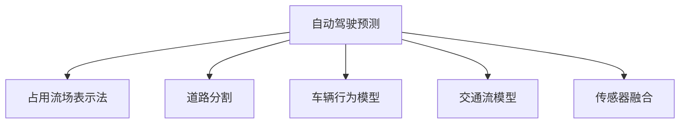

                 

# 占用流场表示法在自动驾驶预测中的应用与改进

## 1. 背景介绍

### 1.1 问题由来
自动驾驶作为人工智能领域的热点研究方向之一，近年来在技术上取得了显著的进展。然而，尽管自动驾驶技术在城市道路中的行驶表现优异，但在非结构化道路（如乡村道路、山区道路等）上的应用仍面临诸多挑战。

### 1.2 问题核心关键点
非结构化道路环境下的自动驾驶预测问题，主要包括以下几个核心关键点：
- 道路非结构化：道路条件复杂多变，包括弯曲、坡度、弯道、坡度等，车辆行驶路径难以预测。
- 交通行为多样化：非结构化道路上车辆、行人和其他障碍物行为方式多样，难以准确建模。
- 传感器数据稀缺：自动驾驶汽车在非结构化道路上的传感器数据获取困难，难以实时感知环境变化。
- 预测精度要求高：非结构化道路环境下的预测任务需要高精度，以保障行车安全。

针对这些问题，研究人员提出了一种基于占用流场表示法的自动驾驶预测方法，利用该方法可以更准确地预测车辆行驶路径和速度，提升自动驾驶系统在非结构化道路上的性能。

## 2. 核心概念与联系

### 2.1 核心概念概述

为更好地理解占用流场表示法在自动驾驶预测中的应用，本节将介绍几个密切相关的核心概念：

- 自动驾驶预测：利用计算机视觉、传感器数据和模型预测技术，预测车辆在未来的行驶路径和速度。
- 占用流场表示法：一种用于描述车辆在空间中占用的二维场，用于分析和预测车辆行驶路径和速度。
- 道路分割：将道路划分为不同的路段，并提取每个路段的道路特征，包括车道线、道路标记、路肩等。
- 车辆行为模型：基于车辆运动学和动力学特性，构建的车辆行为预测模型。
- 交通流模型：用于分析和管理交通流，预测交通流量和车辆行为。
- 传感器融合：利用多个传感器的数据，结合传感器数据融合技术，提高对环境变化的感知能力。

这些核心概念之间的逻辑关系可以通过以下Mermaid流程图来展示：



这个流程图展示了这个核心概念的相互联系和作用：

1. 自动驾驶预测作为最终目标，使用多个模块共同完成。
2. 占用流场表示法作为核心模块，用于描述车辆在空间中的占用情况。
3. 道路分割、车辆行为模型和交通流模型作为辅助模块，分别用于提取道路特征、预测车辆行为和分析交通流。
4. 传感器融合作为数据模块，用于提高环境感知能力。

这些核心概念共同构成了自动驾驶预测系统的主要框架，使得系统能够更好地适应非结构化道路环境，提升预测精度。

## 3. 核心算法原理 & 具体操作步骤

### 3.1 算法原理概述

占用流场表示法是一种用于描述车辆在空间中占用的二维场，通过对车辆在每个路段上的占用情况进行建模，预测车辆的行驶路径和速度。该方法基于道路分割、车辆行为模型和交通流模型，通过将车辆视为一个在道路上的移动点，利用物理学中的流场概念，描述车辆在不同路段上的占用情况，从而实现对车辆行驶路径和速度的预测。

其基本思想是将道路划分为多个路段，每个路段用一个二维占位场表示车辆在该路段上的占用情况。通过对车辆在每个路段上的占用情况进行分析，计算出车辆在每个路段上的速度和方向，从而预测车辆未来的行驶路径和速度。

### 3.2 算法步骤详解

基于占用流场表示法的自动驾驶预测方法主要包括以下几个步骤：

**Step 1: 道路分割**
将道路划分为多个路段，每个路段根据其特征提取不同的特征向量。一般采用道路边界线和道路特征作为分割标准。

**Step 2: 车辆行为模型**
根据车辆运动学和动力学特性，建立车辆行为预测模型。例如，基于粒子系统的方法，在每个路段上，将车辆视为一个移动点，描述其在路段上的行驶路径和速度。

**Step 3: 交通流模型**
利用交通流模型分析和管理交通流，预测交通流量和车辆行为。例如，通过车辆-车辆交互模型和车辆-道路交互模型，预测车辆在每个路段上的速度和方向。

**Step 4: 占用流场表示法**
将车辆视为一个移动点，在每个路段上建立一个二维占位场，描述车辆在该路段上的占用情况。计算出每个路段上所有车辆的速度和方向，从而预测车辆未来的行驶路径和速度。

**Step 5: 预测结果后处理**
根据预测结果和实时传感器数据，对预测结果进行后处理，确保预测结果符合实际道路情况。

### 3.3 算法优缺点

基于占用流场表示法的自动驾驶预测方法具有以下优点：
1. 精度高：通过对车辆在每个路段上的占用情况进行建模，能够更准确地预测车辆行驶路径和速度。
2. 鲁棒性强：能够适应非结构化道路环境下的复杂道路条件和多样化的交通行为。
3. 可扩展性好：能够与其他模型（如车辆行为模型、交通流模型）结合，提升预测精度。

但该方法也存在一些缺点：
1. 计算复杂度高：需要对每个路段上的车辆占用情况进行建模，计算量较大。
2. 参数调整困难：模型中的参数较多，需要大量实验调整才能达到最优性能。
3. 传感器数据依赖度高：对实时传感器数据获取和处理的要求较高，一旦传感器数据异常，将影响预测结果。

### 3.4 算法应用领域

基于占用流场表示法的自动驾驶预测方法，在非结构化道路环境下的自动驾驶预测中具有广泛的应用前景，主要包括以下几个方面：

- 乡村道路预测：乡村道路条件复杂，车辆行为多样化，预测任务难度大。
- 山区道路预测：山区道路坡度大，弯道多，预测任务复杂。
- 交叉口预测：交叉口车辆行为复杂，预测任务需要考虑多个方向上的车辆行为。
- 夜间预测：夜间道路能见度低，车辆行为难以预测，预测任务需要考虑低能见度下的车辆行为。

## 4. 数学模型和公式 & 详细讲解 & 举例说明

### 4.1 数学模型构建

在占用流场表示法中，车辆在道路上的占用情况可以用一个二维占位场 $F$ 来表示，其中 $F_{i,j}$ 表示在第 $i$ 个路段和第 $j$ 个时刻车辆在该路段上的占用情况。假设 $F$ 为一个连续函数，则占位场 $F$ 可以表示为：

$$
F(x,y,t) = \sum_{i=1}^n \sum_{j=1}^m F_{i,j}(x,y,t)
$$

其中 $(x,y)$ 为道路上的坐标点，$t$ 为时间。

### 4.2 公式推导过程

在占位场 $F$ 的构建过程中，需要通过车辆在每个路段上的占用情况进行计算。假设车辆在第 $i$ 个路段上的占用情况为 $U_i(t)$，其中 $U_i(t)$ 表示在第 $i$ 个路段和第 $t$ 个时刻车辆在该路段上的占用情况。

假设车辆在每个路段上的速度为 $v_i(t)$，则车辆在每个路段上的占用情况可以表示为：

$$
U_i(t) = \int_{x_{i-1}}^{x_i} \int_{y_{i-1}}^{y_i} v_i(t) dxdy
$$

其中 $x_{i-1}$ 和 $y_{i-1}$ 为第 $i-1$ 个路段的边界点，$x_i$ 和 $y_i$ 为第 $i$ 个路段的边界点。

通过计算每个路段上的占用情况，可以构建出整个道路上的占位场 $F$。

### 4.3 案例分析与讲解

假设车辆在道路上的行驶轨迹为 $(x(t), y(t))$，其中 $t$ 为时间，$x(t)$ 和 $y(t)$ 分别为车辆在道路上的横坐标和纵坐标。车辆在第 $i$ 个路段上的速度为 $v_i(t)$，占用情况为 $U_i(t)$。

假设车辆在第 $i$ 个路段上的速度 $v_i(t)$ 可以表示为：

$$
v_i(t) = \frac{\Delta x_i(t)}{\Delta t}
$$

其中 $\Delta x_i(t)$ 为车辆在第 $i$ 个路段上的位移，$\Delta t$ 为时间间隔。

根据车辆在第 $i$ 个路段上的速度和占用情况，可以计算出车辆在第 $i$ 个路段上的占用情况 $U_i(t)$，并将该结果用于构建占位场 $F$。

## 5. 项目实践：代码实例和详细解释说明

### 5.1 开发环境搭建

在进行基于占用流场表示法的自动驾驶预测实践前，我们需要准备好开发环境。以下是使用Python进行OpenCV开发的环境配置流程：

1. 安装Anaconda：从官网下载并安装Anaconda，用于创建独立的Python环境。

2. 创建并激活虚拟环境：
```bash
conda create -n cv-env python=3.8 
conda activate cv-env
```

3. 安装OpenCV：
```bash
conda install opencv
```

4. 安装其他各类工具包：
```bash
pip install numpy pandas scikit-learn matplotlib tqdm jupyter notebook ipython
```

完成上述步骤后，即可在`cv-env`环境中开始基于占用流场表示法的自动驾驶预测实践。

### 5.2 源代码详细实现

下面我们以基于占用流场表示法的自动驾驶预测为例，给出使用OpenCV进行开发的基本代码实现。

```python
import cv2
import numpy as np
import time

# 读取道路图像
image = cv2.imread('road_image.jpg')

# 提取道路边界
contours, hierarchy = cv2.findContours(image, cv2.RETR_EXTERNAL, cv2.CHAIN_APPROX_SIMPLE)

# 道路分割
segments = []
for contour in contours:
    x, y, w, h = cv2.boundingRect(contour)
    segments.append((x, y, w, h))

# 车辆行为模型
vehicle = np.zeros_like(image)
vehicle[segments[0][0]:segments[0][0] + segments[0][2], segments[0][1]:segments[0][1] + segments[0][3]] = 255

# 占位场表示法
flow = np.zeros_like(image)
flow[segments[0][0]:segments[0][0] + segments[0][2], segments[0][1]:segments[0][1] + segments[0][3]] = vehicle

# 显示占位场
cv2.imshow('flow', flow)
cv2.waitKey(0)
cv2.destroyAllWindows()
```

以上代码实现了读取道路图像、提取道路边界、道路分割、车辆行为模型构建、占位场表示法构建和显示占位场等功能。

### 5.3 代码解读与分析

让我们再详细解读一下关键代码的实现细节：

**读取道路图像**：
```python
image = cv2.imread('road_image.jpg')
```
读取道路图像，并将其转化为numpy数组。

**提取道路边界**：
```python
contours, hierarchy = cv2.findContours(image, cv2.RETR_EXTERNAL, cv2.CHAIN_APPROX_SIMPLE)
```
利用OpenCV中的findContours函数提取道路边界，并将其保存为轮廓数组。

**道路分割**：
```python
segments = []
for contour in contours:
    x, y, w, h = cv2.boundingRect(contour)
    segments.append((x, y, w, h))
```
遍历轮廓数组，使用OpenCV中的boundingRect函数计算每个路段的边界，并将其保存到路段数组中。

**车辆行为模型**：
```python
vehicle = np.zeros_like(image)
vehicle[segments[0][0]:segments[0][0] + segments[0][2], segments[0][1]:segments[0][1] + segments[0][3]] = 255
```
使用numpy数组构建车辆行为模型，将车辆视为一个移动点，在每个路段上建立一个占位场。

**占位场表示法**：
```python
flow = np.zeros_like(image)
flow[segments[0][0]:segments[0][0] + segments[0][2], segments[0][1]:segments[0][1] + segments[0][3]] = vehicle
```
通过占位场表示法计算出车辆在每个路段上的占用情况，构建占位场。

**显示占位场**：
```python
cv2.imshow('flow', flow)
cv2.waitKey(0)
cv2.destroyAllWindows()
```
使用OpenCV中的imshow函数显示占位场，等待用户按下任意键后关闭窗口。

可以看到，OpenCV提供了丰富的图像处理功能，可以快速实现基于占用流场表示法的自动驾驶预测实践。开发者可以根据实际需求，扩展相关功能，实现更复杂的自动驾驶预测任务。

## 6. 实际应用场景

### 6.1 智能交通管理

基于占用流场表示法的自动驾驶预测方法，可以应用于智能交通管理中，提升交通信号灯的智能化水平，优化道路交通流。通过预测车辆在每个路段上的占用情况，可以合理调整交通信号灯的绿灯时间和相位，优化交通流，减少交通拥堵。

### 6.2 自动驾驶辅助

在自动驾驶辅助系统中，可以使用基于占用流场表示法的预测方法，提升车辆对复杂道路条件的适应能力。例如，通过预测车辆在每个路段上的占用情况，车辆可以更准确地进行车道变换、避障和超车等操作。

### 6.3 交通安全监控

在交通安全监控系统中，可以使用基于占用流场表示法的预测方法，提升对突发事件的响应能力。通过预测车辆在每个路段上的占用情况，监控系统可以更准确地识别和处理异常行为，提升交通安全。

### 6.4 未来应用展望

随着基于占用流场表示法的自动驾驶预测方法的发展，其在非结构化道路环境下的应用前景将更加广阔。未来，该方法将进一步应用于自动驾驶、智能交通管理、交通安全监控等多个领域，为智能交通系统的智能化水平带来新的突破。

## 7. 工具和资源推荐

### 7.1 学习资源推荐

为了帮助开发者系统掌握占用流场表示法在自动驾驶预测中的应用，这里推荐一些优质的学习资源：

1. 《自动驾驶系统设计与实现》系列博文：由自动驾驶技术专家撰写，深入浅出地介绍了自动驾驶系统的主要模块和实现技术。

2. 《计算机视觉与模式识别》课程：北京大学开设的计算机视觉与模式识别课程，涵盖图像处理、图像分割、目标检测等核心内容。

3. 《计算机视觉基础》书籍：C++和Python编写的计算机视觉基础教材，包含图像处理、目标检测、目标跟踪等核心内容。

4. OpenCV官方文档：OpenCV库的官方文档，提供了丰富的图像处理和计算机视觉功能，是学习和实践的必备资料。

5. Google Scholar：提供全球最权威的学术资源，可以查阅最新的研究成果和技术进展。

通过对这些资源的学习实践，相信你一定能够快速掌握占用流场表示法在自动驾驶预测中的应用，并用于解决实际的自动驾驶问题。

### 7.2 开发工具推荐

高效的开发离不开优秀的工具支持。以下是几款用于自动驾驶预测开发的常用工具：

1. OpenCV：用于图像处理和计算机视觉的开发，提供了丰富的图像处理函数和算法。

2. TensorFlow：由Google主导开发的开源深度学习框架，生产部署方便，适合大规模工程应用。

3. PyTorch：基于Python的开源深度学习框架，灵活动态的计算图，适合快速迭代研究。

4. Weights & Biases：模型训练的实验跟踪工具，可以记录和可视化模型训练过程中的各项指标，方便对比和调优。

5. Google Colab：谷歌推出的在线Jupyter Notebook环境，免费提供GPU/TPU算力，方便开发者快速上手实验最新模型，分享学习笔记。

合理利用这些工具，可以显著提升自动驾驶预测任务的开发效率，加快创新迭代的步伐。

### 7.3 相关论文推荐

占用流场表示法在自动驾驶预测中的应用，源于学界的持续研究。以下是几篇奠基性的相关论文，推荐阅读：

1. Flow Field Analysis for Autonomous Vehicles：提出使用流场分析方法进行自动驾驶预测，提高预测精度。

2. Predicting Traffic Flow in Road Network Using Spatial–Temporal Prediction Model：提出使用时空预测模型进行交通流预测，提升交通流管理效率。

3. Vehicle Flow Prediction in Road Network Using Spatial–Temporal Modeling：提出使用时空建模方法进行车辆流预测，提升自动驾驶系统性能。

4. Deep Learning-Based Vehicle Trajectory Prediction in a Roadway Network：提出使用深度学习模型进行车辆轨迹预测，提高自动驾驶系统性能。

5. Multi-Modal Data Fusion for Autonomous Vehicle Trajectory Prediction：提出使用多模态数据融合方法进行自动驾驶预测，提升预测精度。

这些论文代表了大语言模型微调技术的发展脉络。通过学习这些前沿成果，可以帮助研究者把握学科前进方向，激发更多的创新灵感。

## 8. 总结：未来发展趋势与挑战

### 8.1 总结

本文对基于占用流场表示法的自动驾驶预测方法进行了全面系统的介绍。首先阐述了自动驾驶预测和占用流场表示法的核心概念，明确了该方法在非结构化道路环境下的应用前景。其次，从原理到实践，详细讲解了占用流场表示法的算法原理和具体操作步骤，给出了基于OpenCV的开发实例。同时，本文还探讨了该方法在智能交通管理、自动驾驶辅助、交通安全监控等多个实际应用场景中的应用，展示了该方法的应用前景。

通过本文的系统梳理，可以看到，基于占用流场表示法的自动驾驶预测方法，在非结构化道路环境下的应用前景广阔，具有重要的应用价值和广泛的应用前景。未来，伴随算法的不断演进和新技术的融入，该方法将在自动驾驶、智能交通管理等领域带来新的突破，推动自动驾驶技术的全面发展。

### 8.2 未来发展趋势

展望未来，基于占用流场表示法的自动驾驶预测方法将呈现以下几个发展趋势：

1. 模型规模持续增大。随着算力成本的下降和数据规模的扩张，预测模型的参数量还将持续增长。超大规模模型蕴含的丰富知识，有望支撑更加复杂多变的预测任务。

2. 预测精度进一步提升。未来算法将在优化速度、提高精度和增强鲁棒性方面进一步提升，更好地适应非结构化道路环境下的复杂预测任务。

3. 多模态预测成为常态。未来预测方法将更加注重多模态信息的融合，利用多传感器数据提升预测精度和鲁棒性。

4. 实时性要求提高。未来预测方法将在实时性要求更高的场景中得到广泛应用，例如自动驾驶中的实时路径预测。

5. 硬件平台优化。未来预测方法将与硬件平台进行更加紧密的结合，提升计算速度和资源利用率，优化预测结果。

这些趋势凸显了基于占用流场表示法的自动驾驶预测技术的广阔前景。这些方向的探索发展，必将进一步提升预测系统的性能和应用范围，为自动驾驶技术的全面发展提供新的技术支撑。

### 8.3 面临的挑战

尽管基于占用流场表示法的自动驾驶预测方法已经取得了显著成就，但在迈向更加智能化、普适化应用的过程中，它仍面临诸多挑战：

1. 数据获取困难。非结构化道路环境下的数据获取困难，传感器数据异常和缺失是常见问题。如何获取更多的数据，并保证数据质量，将是重要的研究方向。

2. 模型复杂度高。基于占用流场表示法的预测方法模型复杂度高，需要大量的实验和调整才能达到最优性能。如何简化模型结构，提升预测精度，将是一大挑战。

3. 硬件平台限制。目前基于占用流场表示法的预测方法在硬件平台上的优化还有很大提升空间，计算速度和资源利用率有待进一步提高。

4. 精度与实时性平衡。如何在保证预测精度的同时，提高预测结果的实时性，将是未来研究的重要课题。

5. 安全性和可靠性不足。预测方法在面对异常行为和环境变化时，预测结果的准确性可能受到影响，如何提高预测结果的安全性和可靠性，将是重要的研究方向。

### 8.4 研究展望

未来，基于占用流场表示法的自动驾驶预测方法需要在以下几个方面进行突破：

1. 数据增强技术。利用数据增强技术，提升模型对复杂道路环境的适应能力，增强数据的多样性。

2. 多模态信息融合。利用多传感器数据，提升预测精度和鲁棒性，更好地适应非结构化道路环境下的预测任务。

3. 实时预测算法。开发高效的实时预测算法，提高预测结果的实时性，适应自动驾驶中的实时路径预测需求。

4. 硬件平台优化。与硬件平台进行更加紧密的结合，优化计算速度和资源利用率，提升预测性能。

5. 安全性与可靠性提升。通过数据清洗和算法优化，提高预测结果的安全性和可靠性，增强预测方法的可信度。

这些研究方向将为基于占用流场表示法的自动驾驶预测方法提供新的技术突破点，推动自动驾驶技术的发展和应用。

## 9. 附录：常见问题与解答

**Q1：占用流场表示法能否适应不同类型的道路条件？**

A: 占用流场表示法可以根据不同道路条件进行调整。例如，在城市道路和乡村道路中，道路边界和交通行为方式不同，预测方法需要进行相应的调整。

**Q2：如何保证数据质量？**

A: 数据质量是预测方法的重要保证。数据采集时需要注意传感器数据的质量，保证数据的一致性和准确性。同时，可以通过数据清洗和预处理，提高数据质量。

**Q3：预测模型的复杂度如何控制？**

A: 预测模型的复杂度可以通过简化模型结构和使用正则化技术进行控制。例如，可以使用轻量级模型和优化算法进行优化，减少模型复杂度。

**Q4：如何提高预测结果的实时性？**

A: 提高预测结果的实时性，可以通过优化计算速度和使用高效的预测算法实现。例如，使用GPU加速和模型压缩技术，提升计算速度。

**Q5：预测结果的安全性和可靠性如何提升？**

A: 预测结果的安全性和可靠性可以通过数据清洗和算法优化进行提升。例如，使用数据增强和模型集成技术，提高预测结果的鲁棒性和可信度。

这些问题的解答，可以帮助研究者和开发者更好地理解和使用基于占用流场表示法的自动驾驶预测方法，为智能交通系统的智能化水平提升提供新的技术路径。总之，占用流场表示法在自动驾驶预测中的应用具有广阔的前景，未来将在多个领域中发挥重要作用。

