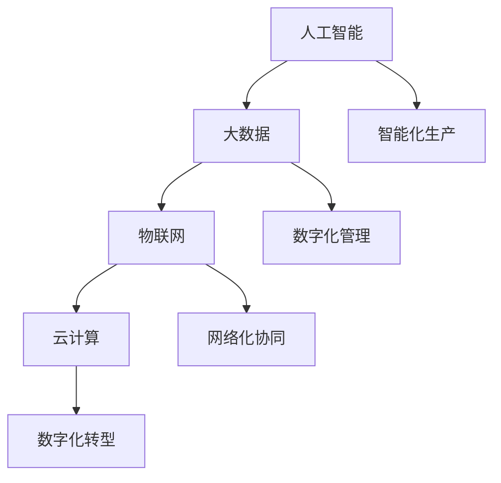

                 

## 1. 背景介绍

### 1.1 问题由来
当前全球经济正处于结构性变革的关键时期。无论是传统制造业还是新兴的数字化产业，都面临着市场环境多变、竞争日趋激烈、消费者需求多元化等挑战。如何在日益复杂的市场环境中，提升企业的核心竞争力，成为各行业企业关注的焦点。

随着第四次工业革命的到来，特别是人工智能(AI)和大数据技术的快速崛起，新型生产力模式正在逐步取代传统的生产方式。企业通过引入新型生产工具和流程，能够提高生产效率、降低成本、增强市场响应速度，实现可持续发展。

本文将从人工智能和大数据在提升企业生产力的角度出发，阐述新型生产力的定义、优势、应用场景，以及企业在实际应用中需要注意的策略和措施。

### 1.2 问题核心关键点
新型生产力是指在人工智能、大数据等新一代信息技术推动下，通过自动化、智能化、网络化的手段，提高生产效率、优化资源配置、增强产品竞争力的一种新型生产模式。其核心关键点包括：

1. **智能化生产**：借助机器学习和深度学习算法，实现对生产过程的智能调度、质量控制、故障预测等。
2. **数字化管理**：通过物联网(IoT)、云计算等技术，实现对生产过程的数字化监控、数据分析、管理决策等。
3. **网络化协同**：借助互联网、移动通信等技术，实现企业内部和跨企业间的信息共享、协同作业、快速响应市场变化等。

这些关键点共同构成了新型生产力的核心要素，能够显著提升企业的生产效率、产品质量和市场响应速度。

## 2. 核心概念与联系

### 2.1 核心概念概述

为更好地理解新型生产力的相关概念，本节将介绍几个密切相关的核心概念：

- **人工智能**：指利用计算机算法模拟人类智能行为的技术，包括机器学习、深度学习、自然语言处理等。
- **大数据**：指规模巨大、结构复杂、来源多样的数据集，通常包括结构化数据、非结构化数据、实时数据等。
- **物联网(IoT)**：指通过互联网将设备、传感器、软件、用户等要素连接起来，实现智能感知、信息传递、协同作业。
- **云计算**：指通过网络提供计算资源、存储空间、应用程序等服务，按需使用、按量计费。
- **数字化转型**：指利用新一代信息技术，对企业的业务流程、组织架构、商业模式等进行全面转型，提升企业竞争力。

这些核心概念之间的逻辑关系可以通过以下Mermaid流程图来展示：



这个流程图展示了一系列关键概念及其之间的关系：

1. 人工智能通过大数据和物联网技术，提升智能化生产能力。
2. 云计算和大数据技术，为数字化管理提供基础设施支持。
3. 网络化协同依托物联网和云计算，实现跨企业间的协同作业。
4. 数字化转型则整合了智能化生产、数字化管理和网络化协同，为企业带来全新的竞争优势。

这些概念共同构成了新型生产力的技术基础，推动企业迈向智能制造、智慧运营、精准营销等新的发展路径。

## 3. 核心算法原理 & 具体操作步骤
### 3.1 算法原理概述

新型生产力的发展，离不开算法和技术的支撑。以下将从人工智能和大数据的角度，介绍新型生产力的核心算法原理。

- **机器学习**：基于数据驱动的模型训练，使机器能够从历史数据中学习规律，进行预测、分类、聚类等任务。
- **深度学习**：通过多层神经网络结构，模拟人类大脑神经元之间的连接，提升模型的复杂性和表达能力，适用于图像识别、语音识别等复杂任务。
- **自然语言处理(NLP)**：使机器能够理解和生成自然语言，包括文本分类、情感分析、机器翻译等。
- **推荐系统**：通过分析用户行为数据，推荐符合用户兴趣的产品或服务，广泛应用于电子商务、在线娱乐等领域。

这些算法共同构成了新型生产力的技术基础，为提升企业的生产效率、优化资源配置、增强市场竞争力提供了技术保障。

### 3.2 算法步骤详解

新型生产力的实现步骤主要包括以下几个关键环节：

**Step 1: 数据准备与预处理**
- 收集企业内部的业务数据、市场数据、客户数据等，进行清洗、整理、归一化等预处理，确保数据的质量和一致性。

**Step 2: 算法模型设计与训练**
- 根据具体业务需求，选择合适的机器学习、深度学习、NLP等算法，进行模型设计和训练。
- 利用企业历史数据对模型进行训练，验证模型的准确性和泛化能力。

**Step 3: 系统集成与部署**
- 将训练好的模型集成到企业现有的业务系统中，实现智能化的生产、管理、协同等应用。
- 部署模型到云计算平台，按需扩展资源，确保系统的稳定性和扩展性。

**Step 4: 持续优化与迭代**
- 实时监控模型运行效果，收集用户反馈和业务数据，进行模型优化和迭代。
- 定期更新数据和算法，保持系统的先进性和竞争力。

### 3.3 算法优缺点

新型生产力的算法应用具有以下优点：
1. **提高生产效率**：通过自动化、智能化手段，减少人工干预，提高生产效率。
2. **优化资源配置**：通过数据分析和预测，优化资源使用，降低生产成本。
3. **增强市场响应速度**：通过实时数据处理和决策支持，快速响应市场变化。
4. **提升产品质量**：通过智能化的质量控制和故障预测，提高产品质量和可靠性。

同时，这些算法也存在一些局限性：
1. **数据依赖**：算法的效果高度依赖于数据的质量和数量，数据不足或数据质量差都会影响效果。
2. **技术门槛高**：算法的设计、训练、部署、优化等环节需要专业的技术人才，企业需投入大量资源进行人才培养和引入。
3. **安全性与隐私问题**：数据和算法的复杂性可能导致数据泄露、模型篡改等安全问题，需制定严格的数据治理和隐私保护措施。
4. **模型复杂性**：深度学习等算法模型的复杂性较高，训练和推理耗时较长，对计算资源和算力有较高要求。

尽管存在这些局限性，但就目前而言，新型生产力的算法应用仍是大势所趋。企业需根据自身实际情况，选择合适的技术路线，平衡利弊，发挥新型生产力的最大价值。

### 3.4 算法应用领域

新型生产力的算法应用已经渗透到各行各业，具体包括：

- **智能制造**：通过机器视觉、传感器、物联网等技术，实现设备状态的实时监控、故障预测、自动维护，提升生产效率和设备可靠性。
- **智慧物流**：利用大数据、云计算、物联网等技术，实现货物追踪、库存管理、配送路径优化，降低物流成本，提升配送效率。
- **智能客服**：通过自然语言处理技术，实现智能客服机器人，提供24/7无间断服务，提升客户满意度。
- **智慧营销**：利用大数据和推荐系统，实现精准营销，提升广告投放效果，增加客户转化率。
- **智能财务**：通过机器学习和NLP技术，实现财务数据的自动化分析和处理，提升财务决策的准确性和效率。

除了上述这些领域外，新型生产力的算法应用还在金融、医疗、教育、农业等领域不断拓展，推动各行业的数字化转型和智能化升级。

## 4. 数学模型和公式 & 详细讲解  
### 4.1 数学模型构建

新型生产力的数学模型构建主要基于机器学习和深度学习算法。以下以推荐系统为例，介绍推荐模型的数学模型构建过程。

设用户集合为 $U$，物品集合为 $I$，用户对物品的评分矩阵为 $R_{UI}$，其中 $R_{ui} \in [0,1]$ 表示用户 $u$ 对物品 $i$ 的评分。推荐系统的目标是通过模型 $f$ 预测用户对物品的评分，优化目标是最大化用户对推荐物品的评分，即：

$$
\max_{f} \sum_{u \in U} \sum_{i \in I} r_{ui} \log f(u,i)
$$

其中 $r_{ui}$ 为实际评分，$f(u,i)$ 为模型预测评分。

### 4.2 公式推导过程

推荐模型的公式推导过程如下：

1. **共现矩阵构建**：将用户和物品的评分矩阵 $R_{UI}$ 构建为共现矩阵 $X_{UI}$，其中 $X_{ui}=1$ 表示用户 $u$ 对物品 $i$ 进行了评分，$X_{ui}=0$ 表示用户 $u$ 未对物品 $i$ 进行评分。

2. **模型参数定义**：设推荐模型为 $f$，定义 $f(u,i) = \hat{R}_{ui}$，其中 $\hat{R}_{ui}$ 为模型预测评分。

3. **损失函数定义**：定义平均绝对误差（MAE）损失函数为：

$$
\text{MAE} = \frac{1}{N} \sum_{u \in U} \sum_{i \in I} |r_{ui} - \hat{R}_{ui}|
$$

4. **模型训练**：使用梯度下降等优化算法，最小化MAE损失函数，更新模型参数，得到推荐模型 $f$。

### 4.3 案例分析与讲解

以Netflix推荐系统为例，Netflix收集了用户对电影、电视剧的评分数据，使用协同过滤算法和基于内容的推荐算法构建推荐模型。推荐系统首先通过协同过滤算法预测用户对未评分物品的评分，然后基于内容的推荐算法，根据物品的属性特征（如导演、演员、类型等）进一步提升推荐精度。通过不断的模型优化和迭代，Netflix实现了个性化推荐，大大提升了用户体验和平台粘性。

## 5. 项目实践：代码实例和详细解释说明
### 5.1 开发环境搭建

在进行新型生产力项目的开发前，我们需要准备好开发环境。以下是使用Python进行PyTorch开发的环境配置流程：

1. 安装Anaconda：从官网下载并安装Anaconda，用于创建独立的Python环境。

2. 创建并激活虚拟环境：
```bash
conda create -n pytorch-env python=3.8 
conda activate pytorch-env
```

3. 安装PyTorch：根据CUDA版本，从官网获取对应的安装命令。例如：
```bash
conda install pytorch torchvision torchaudio cudatoolkit=11.1 -c pytorch -c conda-forge
```

4. 安装相关库：
```bash
pip install torch torchtext sklearn pandas numpy matplotlib
```

完成上述步骤后，即可在`pytorch-env`环境中开始项目开发。

### 5.2 源代码详细实现

这里我们以协同过滤算法为例，给出使用PyTorch进行协同过滤推荐系统的代码实现。

```python
import torch
from torch import nn
from torchtext import data
from torchtext import datasets

# 定义数据集
TEXT = data.Field(sequential=True, use_vocab=False, tokenize='spacy')
LABEL = data.LabelField(dtype=torch.float)
train_data, test_data = datasets.CLIBAS(movie, texts=TEXT, labels=LABEL)

# 定义模型
class CollaborativeFiltering(nn.Module):
    def __init__(self, num_users, num_items, emb_dim=128):
        super(CollaborativeFiltering, self).__init__()
        self.user_embed = nn.Embedding(num_users, emb_dim)
        self.item_embed = nn.Embedding(num_items, emb_dim)
        self.out = nn.Linear(emb_dim*2, 1)
    
    def forward(self, user_ids, item_ids):
        user_embed = self.user_embed(user_ids)
        item_embed = self.item_embed(item_ids)
        hidden = torch.cat([user_embed, item_embed], dim=1)
        return self.out(hidden).squeeze()

# 定义优化器和损失函数
model = CollaborativeFiltering(num_users, num_items)
optimizer = torch.optim.Adam(model.parameters(), lr=0.001)
criterion = nn.MSELoss()

# 训练模型
num_epochs = 10
for epoch in range(num_epochs):
    for user_id, item_id, target in train_data:
        optimizer.zero_grad()
        predictions = model(user_id, item_id)
        loss = criterion(predictions, target)
        loss.backward()
        optimizer.step()
    
    print(f"Epoch {epoch+1}, loss: {loss.item():.4f}")
```

### 5.3 代码解读与分析

让我们再详细解读一下关键代码的实现细节：

**数据处理函数**：
- `TEXT`和`LABEL`定义了数据的字段类型和处理方法，`use_vocab=False`表示不需要词典，因为每个用户和物品都有一个唯一的编号。
- `train_data`和`test_data`分别从`CLIBAS`数据集中获取训练集和测试集。

**模型定义**：
- `CollaborativeFiltering`类定义了协同过滤模型的结构，包含用户嵌入层、物品嵌入层和线性输出层。
- 使用`nn.Embedding`定义嵌入层，`nn.Linear`定义线性输出层。

**训练函数**：
- 在每个epoch中，对训练集进行迭代，计算预测评分与真实评分的平均平方误差。
- 使用`torch.optim.Adam`定义优化器，`nn.MSELoss`定义损失函数。
- 每轮训练后，输出当前epoch的损失值。

这个代码示例展示了如何使用PyTorch构建一个简单的协同过滤推荐模型。开发者可以根据具体业务需求，进一步优化模型结构和训练流程，提高推荐系统的精度和效率。

## 6. 实际应用场景
### 6.1 智能制造

智能制造是大规模应用新型生产力的典型场景之一。传统制造业面临设备老化、能耗高、生产效率低等问题，而智能制造通过引入机器视觉、物联网、人工智能等技术，实现设备的智能监控、故障预测、生产调度和优化，大幅提升生产效率和设备利用率。

以智能工厂为例，通过在生产线上安装传感器和视觉设备，实时监控设备状态和产品品质，使用机器学习算法对数据进行分析和预测，可以及时发现异常并调整生产参数，减少停机时间和废品率。同时，通过物联网技术实现设备互联和数据共享，实现生产过程的可视化和自动化，提升生产效率和灵活性。

### 6.2 智慧物流

智慧物流通过大数据、云计算、物联网等技术，优化物流供应链，实现货物追踪、库存管理、配送路径优化，提高物流效率和客户满意度。

以亚马逊为例，通过使用基于深度学习的算法，对物流数据进行分析和预测，优化库存管理和配送路线，减少运输成本和交货时间。同时，通过物联网技术，实现对货物和运输车辆的实时监控和调度，提高物流的透明度和可靠性。

### 6.3 智能客服

智能客服通过自然语言处理技术，实现24/7无间断服务，提升客户体验和满意度。智能客服机器人可以处理客户咨询、投诉、建议等，提供及时的反馈和解决方案。

以银行智能客服为例，通过训练基于Transformer的模型，实现对用户查询的自然语言理解和处理。智能客服机器人可以回答客户关于账户余额、交易记录、产品介绍等问题，大大提升服务效率和客户满意度。

### 6.4 未来应用展望

新型生产力的大规模应用将在未来进一步拓展，主要包括以下几个方向：

1. **智能制造**：随着物联网和工业互联网的发展，智能制造将逐步普及，实现生产过程的全面智能化。智能制造将推动制造业的转型升级，提升产业竞争力。

2. **智慧物流**：未来智慧物流将进一步融合大数据和物联网技术，实现对物流过程的全面监控和优化。智慧物流将大幅提升物流效率和客户体验。

3. **智能财务**：通过机器学习和自然语言处理技术，智能财务将实现对财务数据的自动化分析和处理，提升财务决策的效率和准确性。

4. **智慧医疗**：通过人工智能和大数据技术，智慧医疗将实现对医疗数据的深度分析和管理，提高医疗服务质量和效率。

5. **智能交通**：未来智能交通将结合物联网、云计算和大数据分析，实现对交通流量的实时监控和调度，提升交通安全和通行效率。

新型生产力的应用将推动各行业数字化转型，实现产业的智能化升级和可持续发展。

## 7. 工具和资源推荐
### 7.1 学习资源推荐

为了帮助开发者系统掌握新型生产力的理论和实践，这里推荐一些优质的学习资源：

1. 《深度学习》书籍：Ian Goodfellow等著，系统介绍了深度学习的理论基础和应用案例。

2. 《Python机器学习》书籍：Sebastian Raschka等著，介绍了使用Python进行机器学习开发的实战案例。

3. 《自然语言处理综论》书籍：Daniel Jurafsky等著，全面介绍了自然语言处理的基本概念和前沿技术。

4. Kaggle竞赛平台：提供丰富的机器学习竞赛和数据集，帮助开发者提升实战能力。

5. Coursera、edX等在线教育平台：提供各类人工智能和大数据课程，帮助开发者系统学习相关知识。

通过对这些资源的学习实践，相信你一定能够快速掌握新型生产力的精髓，并用于解决实际的业务问题。

### 7.2 开发工具推荐

高效的开发离不开优秀的工具支持。以下是几款用于新型生产力开发常用的工具：

1. PyTorch：基于Python的开源深度学习框架，灵活动态的计算图，适合快速迭代研究。

2. TensorFlow：由Google主导开发的开源深度学习框架，生产部署方便，适合大规模工程应用。

3. HuggingFace Transformers库：提供了多种预训练语言模型和高效微调接口，是实现NLP任务的利器。

4. Jupyter Notebook：交互式编程环境，支持Python、R等语言，适合数据科学和机器学习开发。

5. TensorBoard：TensorFlow配套的可视化工具，可实时监测模型训练状态，提供丰富的图表呈现方式。

6. Weights & Biases：模型训练的实验跟踪工具，可以记录和可视化模型训练过程中的各项指标，方便对比和调优。

合理利用这些工具，可以显著提升新型生产力项目的开发效率，加快创新迭代的步伐。

### 7.3 相关论文推荐

新型生产力技术的发展源于学界的持续研究。以下是几篇奠基性的相关论文，推荐阅读：

1. "A Survey on Deep Learning for Autonomous Vehicles"：Kriti Jalan等，综述了深度学习在自动驾驶领域的应用。

2. "Advances in Natural Language Processing"：Yoshua Bengio等，综述了自然语言处理领域的前沿技术。

3. "Transformers Are Universal Approximators"：Andrej Karpathy等，证明了Transformer模型具有通用逼近能力。

4. "Scalable Semantic Learning of Sparse Networks"：Jeffrey Pennington等，提出了一种用于大规模语料预训练的优化算法。

5. "BERT: Pre-training of Deep Bidirectional Transformers for Language Understanding"：Jacob Devlin等，提出了BERT预训练模型，刷新了多项NLP任务SOTA。

这些论文代表了大数据和人工智能技术的发展脉络。通过学习这些前沿成果，可以帮助研究者把握学科前进方向，激发更多的创新灵感。

## 8. 总结：未来发展趋势与挑战

### 8.1 总结

本文对新型生产力的理论和实践进行了全面系统的介绍。首先阐述了新型生产力的定义、优势、应用场景，明确了其在新经济环境下提升企业竞争力的关键作用。其次，从算法和技术的角度，详细讲解了新型生产力的核心原理和具体操作步骤。最后，展望了新型生产力的未来发展趋势，并指出企业在实际应用中需要注意的策略和挑战。

通过本文的系统梳理，可以看到，新型生产力正逐步成为企业数字化转型的重要推动力，推动各行业向智能化、自动化、网络化方向发展。企业需要积极拥抱新技术，结合自身业务特点，选择合适的技术路线，才能在激烈的竞争中取得优势。

### 8.2 未来发展趋势

展望未来，新型生产力的发展将呈现以下几个趋势：

1. **智能化制造**：通过物联网和工业互联网的普及，实现生产过程的全面智能化。智能制造将大幅提升生产效率和设备利用率，推动制造业的转型升级。

2. **智慧物流**：融合大数据和物联网技术，实现对物流过程的全面监控和优化。智慧物流将大幅提升物流效率和客户满意度，推动电子商务等新兴产业的发展。

3. **智能客服**：通过自然语言处理技术，实现智能客服机器人，提升客户体验和满意度。智能客服将在金融、医疗、教育等多个领域得到广泛应用。

4. **智能财务**：通过机器学习和自然语言处理技术，实现对财务数据的自动化分析和处理，提升财务决策的效率和准确性。智能财务将在金融、会计等行业得到广泛应用。

5. **智能交通**：结合物联网、云计算和大数据分析，实现对交通流量的实时监控和调度，提升交通安全和通行效率。智能交通将在智能城市、智慧交通等领域得到广泛应用。

以上趋势凸显了新型生产力的广阔前景，推动各行业数字化转型，实现产业的智能化升级和可持续发展。

### 8.3 面临的挑战

尽管新型生产力技术已经取得了显著进展，但在向规模化应用的过程中，仍面临诸多挑战：

1. **数据质量与隐私问题**：新型生产力的应用高度依赖数据质量，数据偏差和隐私保护问题需引起重视。需制定严格的数据治理和隐私保护措施，确保数据安全。

2. **技术复杂性与集成成本**：新型生产力的技术复杂性较高，企业需投入大量资源进行技术引进和系统集成，需制定详细的技术路线和实施计划。

3. **人才短缺与技能提升**：新型生产力技术需专业的技术人才进行开发和维护，企业需投入大量资源进行人才培养和技能提升。

4. **算法公平性与透明性**：新型生产力的算法模型需具备公平性和透明性，避免对特定群体或环境产生偏见，需加强算法评估和测试。

5. **系统安全性与稳定性**：新型生产力的系统需具备高可靠性和高可用性，需制定严格的安全防护和应急预案。

6. **法规与伦理问题**：新型生产力的应用需符合相关法律法规和伦理规范，需制定明确的技术标准和规范，确保技术应用合法合规。

以上挑战需企业在应用过程中充分考虑，采取相应的措施，才能确保新型生产力的平稳落地和健康发展。

### 8.4 研究展望

面对新型生产力面临的诸多挑战，未来的研究需要在以下几个方面寻求新的突破：

1. **数据治理与隐私保护**：探索基于区块链和联邦学习的数据治理技术，确保数据隐私和安全。

2. **模型优化与资源管理**：开发更加高效、轻量级的模型架构，优化资源使用，提升系统性能。

3. **算法公平性与透明性**：研究算法公平性评估和透明性技术，确保算法的公正性和可解释性。

4. **系统安全性与稳定性**：研究系统安全防护和应急管理技术，确保系统的稳定性和可靠性。

5. **法规与伦理规范**：制定明确的技术标准和规范，确保技术应用合法合规，提升技术应用的伦理道德水平。

这些研究方向将推动新型生产力的进一步发展和应用，为企业提供更加智能、高效、安全的技术保障。

## 9. 附录：常见问题与解答

**Q1：企业如何选择合适的技术路线？**

A: 企业需根据自身业务需求和技术能力，选择合适的技术路线。可以参考行业内的成功案例和技术积累，结合自身实际情况，制定详细的技术实施计划。

**Q2：如何提高数据质量？**

A: 数据质量是新型生产力的关键因素，需从数据采集、清洗、标注等多个环节进行严格控制。可通过引入第三方数据源、采用多模态数据融合技术、优化数据标注流程等方式，提高数据质量。

**Q3：如何降低技术复杂性？**

A: 企业需选择合适的技术工具和平台，降低技术复杂性。可使用开源软件、云服务平台、AI中间件等，简化系统开发和部署过程。同时，需加强技术培训和技能提升，提高团队的技术水平。

**Q4：如何确保数据安全与隐私保护？**

A: 需制定严格的数据治理和隐私保护措施，如数据加密、访问控制、匿名化处理等。采用联邦学习、差分隐私等技术，确保数据隐私和安全。

**Q5：如何确保算法的公平性与透明性？**

A: 需制定明确的算法评估和测试标准，如公平性指标、透明性指标等。采用可解释性算法、公平性约束技术，确保算法的公正性和可解释性。

**Q6：如何确保系统安全性与稳定性？**

A: 需制定严格的安全防护和应急预案，如访问控制、异常检测、故障恢复等。采用分布式系统、高可用性架构、灾难恢复技术，确保系统的稳定性和可靠性。

通过这些措施，企业可以在新型生产力应用过程中，确保系统的安全性和稳定性，提升企业的竞争力和市场响应速度。

---

作者：禅与计算机程序设计艺术 / Zen and the Art of Computer Programming

