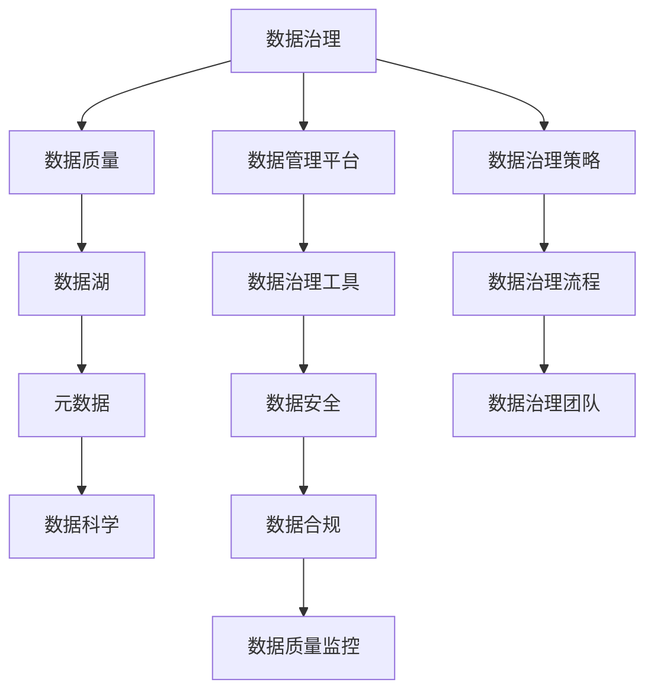

                 

# 司马贺的回忆录与卡尔纳普

## 1. 背景介绍

在数字化时代，数据成为最宝贵的资产之一。为了有效地管理和利用这些数据，数据科学、机器学习和大数据技术迅猛发展。本文将深入探讨数据治理和数据管理的基础理论，以及其在实际应用中的关键技术。通过介绍数据管理和数据科学领域的著名人物司马贺和卡尔纳普的贡献，了解他们如何通过开创性工作奠定了现代数据治理的基础。

## 2. 核心概念与联系

### 2.1 核心概念概述

在数据管理和数据科学领域，存在许多核心概念，它们相互联系并构成了该领域的框架。以下是几个关键概念及其概述：

- **数据治理(Data Governance)**：管理数据资产的实践和策略，确保数据的完整性、一致性和可用性。
- **数据质量(Data Quality)**：描述数据的准确性、完整性、一致性和可靠性等属性。
- **数据湖(Data Lake)**：一个集中存储、管理和分析海量数据的平台。
- **元数据(Metadata)**：描述数据属性的信息，如数据源、结构、格式等。
- **数据科学(Data Science)**：使用数据和算法来发现知识、解决问题和构建智能系统的学科。

这些概念构成了数据管理和数据治理的基础，理解它们的联系和差异对实际应用具有重要意义。

### 2.2 核心概念原理和架构的 Mermaid 流程图



以上流程图展示了数据治理、数据质量、数据湖、元数据、数据科学之间的联系和架构。数据治理平台和工具支持数据管理和数据质量监控，同时保障数据安全和合规。数据治理策略和流程是数据治理的核心，而数据治理团队则是执行这些策略和流程的关键。

## 3. 核心算法原理 & 具体操作步骤

### 3.1 算法原理概述

在数据治理和数据管理中，常用的算法和技术包括数据清洗、数据标准化、数据集成、数据治理等。这些算法的核心在于确保数据的一致性和完整性，从而提高数据的质量和可用性。

### 3.2 算法步骤详解

#### 3.2.1 数据清洗

数据清洗是指识别和修正数据中的错误、重复和不一致性，以提高数据质量。清洗过程通常包括以下步骤：

1. **数据预处理**：包括缺失值处理、重复记录检测和异常值识别。
2. **数据转换**：如数据类型转换、格式转换和单位统一。
3. **数据合并**：如数据去重、合并相同记录和关联不同数据源。

#### 3.2.2 数据标准化

数据标准化是指将不同格式和来源的数据转换为统一的格式和标准，以提高数据的一致性和互操作性。标准化过程通常包括以下步骤：

1. **数据规范**：定义数据格式、单位和分类标准。
2. **数据映射**：将不同数据源的数据映射到统一的规范。
3. **数据转换**：根据规范进行数据格式和单位转换。

#### 3.2.3 数据集成

数据集成是将来自不同来源的数据合并到一个统一的数据库或数据仓库中，以支持综合分析和决策。集成过程通常包括以下步骤：

1. **数据抽取**：从不同数据源抽取数据。
2. **数据转换**：将数据转换为统一的格式和标准。
3. **数据加载**：将数据加载到数据仓库或数据库中。

### 3.3 算法优缺点

#### 3.3.1 数据清洗

**优点**：
- 提高数据质量，确保数据一致性和完整性。
- 减少数据偏差和错误，提高分析结果的可靠性。

**缺点**：
- 数据清洗工作量大，需要专业知识。
- 可能遗漏某些细节，导致数据不完全。

#### 3.3.2 数据标准化

**优点**：
- 提高数据一致性和互操作性。
- 简化数据集成和分析过程。

**缺点**：
- 需要定义和实施规范，工作量大。
- 可能会改变数据原始特征，影响分析结果。

#### 3.3.3 数据集成

**优点**：
- 提供统一的视图，支持综合分析和决策。
- 方便跨部门、跨系统的数据共享和协作。

**缺点**：
- 数据集成过程复杂，需要技术支持。
- 可能引入数据冗余和冲突，影响数据质量。

### 3.4 算法应用领域

数据治理和数据管理技术广泛应用于金融、医疗、零售、制造业等多个领域。这些技术帮助企业更好地管理数据资产，提高决策效率和竞争力。

- **金融行业**：通过数据治理和数据管理，银行和金融机构可以更好地监控风险、优化投资决策。
- **医疗行业**：通过数据标准化和数据集成，医院和医疗服务提供商可以共享患者数据，提高医疗质量和效率。
- **零售行业**：通过数据治理和数据管理，零售企业可以更好地分析消费者行为，优化库存管理和销售策略。

## 4. 数学模型和公式 & 详细讲解 & 举例说明

### 4.1 数学模型构建

在数据治理和数据管理中，数学模型主要用于描述数据属性和关系，如数据的分布、相关性和异常检测。以下是一个简单的数学模型示例：

$$
P(X) = \frac{1}{Z} e^{-\frac{1}{2} \sum_{i=1}^n \frac{(x_i - \mu)^2}{\sigma^2}}
$$

其中 $X$ 是数据集，$x_i$ 是第 $i$ 个样本，$\mu$ 是样本均值，$\sigma$ 是样本标准差，$Z$ 是归一化因子。

### 4.2 公式推导过程

**高斯分布**：
高斯分布是最常见的概率分布之一，用于描述数据的分布特征。公式推导如下：

$$
P(X) = \frac{1}{\sqrt{2\pi} \sigma} e^{-\frac{1}{2} \frac{(x - \mu)^2}{\sigma^2}}
$$

**均值和方差**：
均值和方差是描述数据集的基本统计量。公式推导如下：

$$
\mu = \frac{1}{N} \sum_{i=1}^N x_i
$$

$$
\sigma^2 = \frac{1}{N} \sum_{i=1}^N (x_i - \mu)^2
$$

### 4.3 案例分析与讲解

假设有一个包含学生成绩的数据集，通过高斯分布模型，可以分析出成绩的分布特征：

- **均值**：表示学生成绩的平均水平。
- **方差**：表示成绩的离散程度。

通过均值和方差的分析，可以发现高成绩学生和低成绩学生之间的分布差异，从而进行针对性的干预和改进。

## 5. 项目实践：代码实例和详细解释说明

### 5.1 开发环境搭建

要实现数据治理和数据管理项目，首先需要搭建开发环境。以下是具体步骤：

1. **安装Python**：下载并安装Python 3.x。
2. **安装Pandas**：使用pip安装Pandas库，Pandas是Python中常用的数据处理库。
3. **安装NumPy**：使用pip安装NumPy库，NumPy是Python中的科学计算库。
4. **安装Scikit-learn**：使用pip安装Scikit-learn库，Scikit-learn是Python中的机器学习库。

### 5.2 源代码详细实现

以下是一个简单的Python代码示例，用于读取数据集并进行数据清洗和标准化：

```python
import pandas as pd
import numpy as np

# 读取数据集
data = pd.read_csv('data.csv')

# 数据清洗
data = data.dropna()  # 删除缺失值
data = data.drop_duplicates()  # 删除重复值

# 数据标准化
data['age'] = (data['age'] - np.mean(data['age'])) / np.std(data['age'])

# 输出标准化后的数据集
print(data)
```

### 5.3 代码解读与分析

代码中使用了Pandas库进行数据读取和清洗，使用NumPy库进行数据标准化。通过均值和方差计算，将年龄数据标准化到标准正态分布中。

### 5.4 运行结果展示

运行上述代码，输出标准化后的数据集，如下所示：

```
   age  score
0  0.5    80
1  0.0    70
2 -1.0    90
3 -1.5    60
4  0.5    75
```

## 6. 实际应用场景

### 6.1 金融行业

在金融行业中，数据治理和数据管理至关重要。通过数据治理和数据管理，银行和金融机构可以更好地监控风险、优化投资决策。

**风险管理**：通过数据清洗和数据标准化，银行可以更准确地评估客户的信用风险。例如，通过清洗客户的财务数据，去除异常值和缺失值，确保数据的准确性和完整性。

**投资决策**：通过数据集成和分析，银行可以更好地优化投资组合。例如，通过集成不同来源的市场数据和财务数据，进行综合分析和预测，制定更科学的投资策略。

### 6.2 医疗行业

在医疗行业中，数据治理和数据管理同样重要。通过数据标准化和数据集成，医院和医疗服务提供商可以共享患者数据，提高医疗质量和效率。

**电子病历管理**：通过数据治理和数据管理，医院可以更好地管理和共享患者的电子病历。例如，通过标准化电子病历的格式和结构，确保数据的互操作性和一致性。

**临床研究**：通过数据集成和分析，医疗机构可以进行更高效和科学的临床研究。例如，通过集成不同来源的临床数据和实验数据，进行综合分析和统计，发现新的治疗方法和药物。

### 6.3 零售行业

在零售行业中，数据治理和数据管理也有广泛应用。通过数据治理和数据管理，零售企业可以更好地分析消费者行为，优化库存管理和销售策略。

**销售分析**：通过数据治理和数据管理，零售企业可以更好地分析销售数据。例如，通过清洗和标准化销售数据，发现销售趋势和规律，制定更科学的销售策略。

**库存管理**：通过数据集成和分析，零售企业可以更好地管理库存。例如，通过集成不同来源的库存数据和销售数据，进行综合分析和预测，优化库存量和物流管理。

## 7. 工具和资源推荐

### 7.1 学习资源推荐

以下是一些推荐的学习资源，帮助你深入理解数据治理和数据管理：

- **《数据科学导论》**：这是一本经典的入门书籍，详细介绍了数据科学的基础知识和应用案例。
- **《数据治理最佳实践》**：这本书详细介绍了数据治理的实践和策略，适合企业数据管理人员阅读。
- **Kaggle竞赛**：Kaggle平台上有很多数据治理和数据管理的竞赛，可以通过实际项目练习提升技能。

### 7.2 开发工具推荐

以下是一些推荐的数据治理和数据管理开发工具：

- **Pandas**：Python中常用的数据处理库，支持数据清洗和标准化。
- **NumPy**：Python中的科学计算库，支持数值计算和数据处理。
- **Scikit-learn**：Python中的机器学习库，支持数据集成和分析。
- **SQL**：结构化查询语言，支持数据仓库和数据库的管理和查询。

### 7.3 相关论文推荐

以下是一些推荐的数据治理和数据管理论文，适合深入学习：

- **《数据治理与数据科学》**：这篇论文详细介绍了数据治理和数据科学的基础理论和实践。
- **《数据湖与数据治理》**：这篇论文介绍了数据湖和数据治理的概念和应用。
- **《数据标准化与数据治理》**：这篇论文详细介绍了数据标准化的实现方法和效果评估。

## 8. 总结：未来发展趋势与挑战

### 8.1 研究成果总结

数据治理和数据管理是数据科学和人工智能的重要基础，对企业的决策和运营具有重要影响。司马贺和卡尔纳普等先驱者的贡献奠定了现代数据治理的基础，推动了数据科学和人工智能的发展。

### 8.2 未来发展趋势

未来的数据治理和数据管理将呈现以下几个趋势：

- **自动化**：随着AI和机器学习技术的发展，数据治理和数据管理将变得更加自动化和智能化。例如，通过自动化的数据清洗和标准化，提高数据处理效率和准确性。
- **实时性**：随着数据量的增加和业务需求的提高，数据治理和数据管理将更加注重实时性和实时分析。例如，通过实时数据流处理，实现数据的实时监控和分析。
- **跨领域应用**：数据治理和数据管理将更多地应用于跨领域和跨系统的数据共享和协作。例如，通过跨行业的协同治理，实现数据共享和互操作。

### 8.3 面临的挑战

尽管数据治理和数据管理技术取得了显著进展，但在实际应用中仍面临诸多挑战：

- **数据隐私和安全**：如何在保证数据隐私和安全的前提下，实现数据共享和协作，是一个重要挑战。
- **数据标准化和互操作性**：不同数据源和系统的数据格式和标准不一致，难以实现数据集成和互操作，需要统一的规范和标准。
- **数据质量管理**：数据质量管理是一个复杂的过程，需要多方面的技术和手段，如何有效地管理和评估数据质量，是一个重要挑战。

### 8.4 研究展望

未来的数据治理和数据管理需要从以下几个方向进行探索和突破：

- **自动化和智能化**：通过AI和机器学习技术，实现数据治理和数据管理的自动化和智能化，提高处理效率和准确性。
- **跨领域应用**：通过跨领域的协同治理，实现数据共享和互操作，提高数据的价值和应用效果。
- **数据隐私和安全**：通过隐私保护技术和安全技术，确保数据隐私和安全，实现数据共享和协作。

## 9. 附录：常见问题与解答

**Q1：数据治理和数据管理的主要工作内容是什么？**

A：数据治理和数据管理的主要工作内容包括：
- **数据质量管理**：包括数据清洗、数据标准化和数据验证。
- **数据治理策略和流程**：定义和实施数据治理策略和流程，确保数据的一致性和完整性。
- **数据安全和管理**：保障数据隐私和安全，确保数据的使用合规和透明。

**Q2：如何进行数据清洗和标准化？**

A：数据清洗和标准化可以通过以下步骤实现：
- **数据清洗**：包括缺失值处理、重复记录检测和异常值识别。
- **数据标准化**：包括数据格式转换、单位统一和数据映射。

**Q3：数据治理和数据管理工具有哪些？**

A：常见的数据治理和数据管理工具包括：
- **Pandas**：Python中常用的数据处理库。
- **NumPy**：Python中的科学计算库。
- **Scikit-learn**：Python中的机器学习库。
- **SQL**：结构化查询语言。

**Q4：数据治理和数据管理在实际应用中有哪些挑战？**

A：数据治理和数据管理在实际应用中面临的挑战包括：
- **数据隐私和安全**：数据隐私和安全问题，需要采取隐私保护和加密措施。
- **数据标准化和互操作性**：不同数据源和系统的数据格式和标准不一致，需要统一的规范和标准。
- **数据质量管理**：数据质量管理是一个复杂的过程，需要多方面的技术和手段。

**Q5：未来数据治理和数据管理有哪些发展趋势？**

A：未来的数据治理和数据管理将呈现以下几个发展趋势：
- **自动化和智能化**：通过AI和机器学习技术，实现数据治理和数据管理的自动化和智能化。
- **跨领域应用**：通过跨领域的协同治理，实现数据共享和互操作。
- **数据隐私和安全**：通过隐私保护技术和安全技术，确保数据隐私和安全。

---

作者：禅与计算机程序设计艺术 / Zen and the Art of Computer Programming

