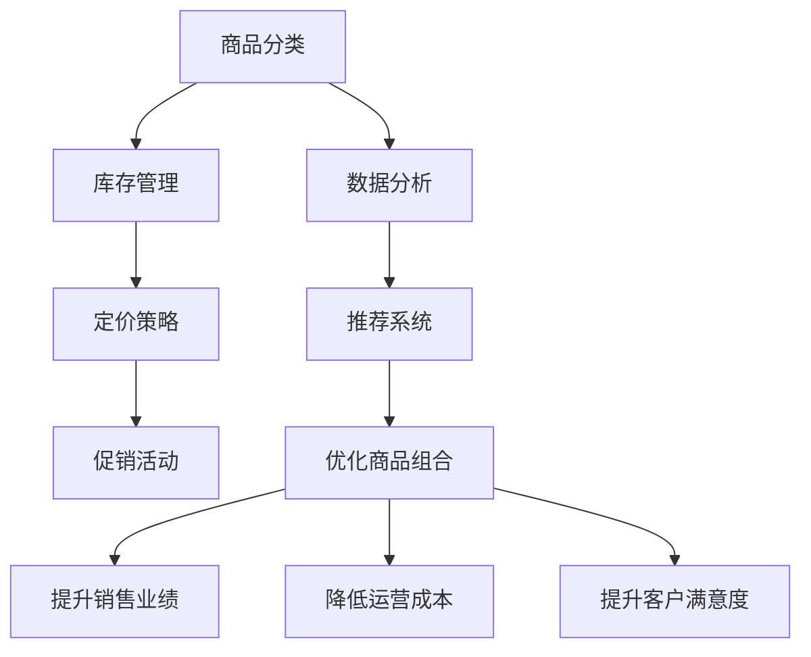

                 

## 1. 背景介绍

在快速变化的电商市场中，品类管理（Category Management）成为电商平台提升竞争力的关键。它不仅涵盖了从商品选择、采购到库存管理的全过程，还涉及价格策略、促销活动、客户体验等多个维度。一个有效的品类管理系统能够帮助电商平台精确定位目标客户，优化商品组合，提升供应链效率，最终实现业绩增长。

### 1.1 电商行业现状
当前，全球电商市场正经历着迅猛增长。根据Statista的数据，全球电商销售额预计将在2024年达到5.5万亿美元。然而，面对激烈的竞争和市场变化，许多电商平台仍在为如何有效管理和运营其品类而苦恼。这些问题包括但不限于：

- **商品种类繁多**：平台商品种类日益丰富，但如何根据消费者需求进行精准分类和管理成为一个难题。
- **库存管理复杂**：如何高效管理库存，避免过剩或缺货，同时减少仓储成本？
- **定价策略多变**：如何根据市场情况和消费者行为灵活调整商品价格？
- **客户体验提升**：如何通过个性化的购物体验和精准的推荐系统提升客户满意度？

### 1.2 品类管理的重要性
品类管理通过科学的方法和工具，帮助电商平台实现以下目标：

- **优化商品组合**：根据市场需求和竞争情况，选择和优化商品种类和组合，提升SKU（Stock Keeping Unit）的有效性。
- **提升销售业绩**：通过优化价格策略和促销活动，最大化每个SKU的销售额。
- **降低运营成本**：通过合理的库存管理和物流优化，降低仓储和物流成本。
- **提升客户满意度**：通过精准的推荐系统和个性化的购物体验，提升客户满意度和忠诚度。

## 2. 核心概念与联系

### 2.1 核心概念概述

为了深入理解品类管理的原理和实施方法，本节将介绍几个关键概念：

- **商品分类（Product Classification）**：根据商品的特性和功能，将商品分类到不同的商品族和子商品族中。
- **库存管理（Inventory Management）**：通过库存水平控制、补货策略、需求预测等方法，实现库存优化。
- **定价策略（Pricing Strategy）**：根据市场需求、成本和竞争情况，制定灵活的价格策略。
- **促销活动（Promotion Strategy）**：通过打折、优惠券、买一赠一等促销手段，提升销量和客户参与度。
- **数据分析（Data Analytics）**：通过分析消费者行为和市场数据，进行需求预测和库存优化。
- **推荐系统（Recommendation System）**：通过分析用户的历史行为和偏好，进行商品推荐，提升购买转化率。

这些概念构成了品类管理系统的核心，通过有效的组合和应用，可以显著提升电商平台的供给能力和运营效率。

### 2.2 核心概念联系
以下是一个简化的Mermaid流程图，展示了品类管理中各概念之间的联系：



从图中可以看到，商品分类是品类管理的基础，库存管理、定价策略、促销活动、数据分析和推荐系统都围绕商品分类展开，最终实现优化商品组合、提升销售业绩、降低运营成本和提升客户满意度的目标。

## 3. 核心算法原理 & 具体操作步骤

### 3.1 算法原理概述

品类管理的核心算法原理主要包括以下几个方面：

- **分类算法**：通过聚类、分类等机器学习算法，对商品进行科学分类。
- **需求预测算法**：利用时间序列分析、回归分析等方法，进行销售预测和库存优化。
- **定价算法**：根据市场需求、成本和竞争情况，制定最优的价格策略。
- **推荐算法**：通过协同过滤、内容推荐等技术，进行个性化商品推荐。

这些算法相互配合，构成了一个完整的品类管理系统，帮助电商平台高效地管理其品类，提升运营效率。

### 3.2 算法步骤详解

以下是品类管理的主要算法步骤：

1. **商品分类**：
   - 收集商品的特性数据，如品牌、功能、规格等。
   - 使用聚类算法对商品进行初步分类，如K-means聚类、层次聚类等。
   - 通过专家审核和人工标注，对初步分类结果进行修正。

2. **库存管理**：
   - 根据历史销售数据和需求预测，设定每个SKU的库存水平。
   - 使用动态补货策略，根据销售速度和库存水平，自动补货。
   - 实施需求预测算法，如时间序列分析、回归分析等，提升预测准确性。

3. **定价策略**：
   - 收集市场数据，如竞争对手价格、市场趋势等。
   - 使用回归分析、决策树等算法，确定最优价格区间。
   - 根据促销活动和季节性因素，调整价格策略。

4. **促销活动**：
   - 设计打折、优惠券、买一赠一等促销活动。
   - 根据需求预测和库存水平，确定促销活动的时间和规模。
   - 评估促销活动的效果，进行持续优化。

5. **数据分析**：
   - 收集和整理消费者行为数据，如浏览历史、购买记录等。
   - 使用机器学习算法，如回归分析、关联规则挖掘等，进行需求预测和行为分析。
   - 通过数据可视化工具，展示分析结果，辅助决策。

6. **推荐系统**：
   - 收集用户的历史行为数据，如浏览记录、购买记录等。
   - 使用协同过滤、内容推荐等算法，构建个性化推荐模型。
   - 根据用户行为变化，动态调整推荐策略。

### 3.3 算法优缺点

品类管理算法具有以下优点：

- **科学决策**：基于数据驱动的算法，可以提供科学、客观的决策支持。
- **灵活性高**：可以动态调整算法参数，适应市场变化和消费者行为变化。
- **自动化**：通过算法自动化处理，减少人工干预，提升效率。

然而，品类管理算法也存在以下缺点：

- **数据质量要求高**：算法效果依赖于数据的质量和完整性。
- **模型复杂**：需要构建和维护多个算法模型，工作量较大。
- **系统复杂性高**：算法之间的交互和整合需要复杂的系统设计。

### 3.4 算法应用领域

品类管理算法在电商行业有广泛的应用，主要包括以下几个领域：

- **商品分类与管理系统**：帮助电商平台对商品进行科学分类，优化商品组合。
- **库存管理系统**：优化库存水平，实现高效补货，降低仓储成本。
- **价格策略系统**：根据市场需求和竞争情况，制定灵活的价格策略。
- **促销活动管理系统**：设计和管理促销活动，提升销量和客户参与度。
- **需求预测系统**：通过数据分析，进行销售预测和库存优化。
- **推荐系统**：通过个性化推荐，提升购买转化率，提升客户满意度。

## 4. 数学模型和公式 & 详细讲解 & 举例说明

### 4.1 数学模型构建

品类管理涉及多个数学模型，以下以需求预测模型和推荐系统为例进行详细讲解。

### 4.2 公式推导过程

#### 需求预测模型

需求预测模型可以基于时间序列分析、回归分析等方法建立。以时间序列分析为例，假设需求量 $Y_t$ 依赖于时间 $t$ 的前 $p$ 个值，即 $Y_t = f(Y_{t-1}, Y_{t-2}, ..., Y_{t-p})$。常用的时间序列模型包括ARIMA（自回归积分滑动平均模型）和季节性分解模型。

- ARIMA模型：$Y_t = c + \sum_{i=1}^{p} \phi_i Y_{t-i} + \sum_{j=1}^{d} B^j \epsilon_{t-j} + \sum_{k=1}^{q} \theta_k \epsilon_{t-k}$，其中 $\epsilon_t$ 是白噪声，$\phi_i$ 和 $\theta_k$ 是模型参数。

- 季节性分解模型：$Y_t = T_t + S_t + C_t + \epsilon_t$，其中 $T_t$ 是趋势分量，$S_t$ 是季节性分量，$C_t$ 是周期性分量，$\epsilon_t$ 是残差。

#### 推荐系统

推荐系统通常基于协同过滤和内容推荐两种方法。以协同过滤为例，假设用户 $u$ 对商品 $i$ 的评分 $r_{ui}$ 可以表示为用户对商品 $i$ 的评分与用户 $u$ 的评分均值之差，即 $r_{ui} = r_i - \mu_u$，其中 $r_i$ 是商品 $i$ 的评分均值，$\mu_u$ 是用户 $u$ 的评分均值。

推荐算法可以通过计算用户和商品的相似度，得到用户对商品的推荐评分，即 $\hat{r}_{ui} = \sum_{j \in N_u} (\alpha_{uj} \cdot r_{ji})$，其中 $N_u$ 是用户 $u$ 的邻域，$\alpha_{uj}$ 是用户 $u$ 和用户 $j$ 之间的相似度权重。

### 4.3 案例分析与讲解

#### 案例1：商品分类系统

某电商平台使用聚类算法对商品进行分类。具体步骤如下：

1. 收集商品的特性数据，如品牌、功能、规格等。
2. 使用K-means聚类算法对商品进行初步分类。
3. 通过专家审核和人工标注，对初步分类结果进行修正。

#### 案例2：库存管理系统

某电商平台使用动态补货策略和需求预测模型优化库存。具体步骤如下：

1. 根据历史销售数据和需求预测算法，设定每个SKU的库存水平。
2. 使用动态补货策略，根据销售速度和库存水平，自动补货。
3. 定期更新需求预测模型，提升预测准确性。

## 5. 项目实践：代码实例和详细解释说明

### 5.1 开发环境搭建

在进行品类管理实践前，我们需要准备好开发环境。以下是使用Python进行Pandas和Scikit-learn开发的开发环境配置流程：

1. 安装Anaconda：从官网下载并安装Anaconda，用于创建独立的Python环境。

2. 创建并激活虚拟环境：
```bash
conda create -n category-env python=3.8 
conda activate category-env
```

3. 安装必要的库：
```bash
conda install pandas scikit-learn matplotlib seaborn jupyter notebook ipython
```

4. 安装Pip库：
```bash
pip install category-management
```

完成上述步骤后，即可在`category-env`环境中开始品类管理的开发实践。

### 5.2 源代码详细实现

以下是一个简单的品类管理项目示例，包括商品分类、库存管理和需求预测的功能。

```python
import pandas as pd
from sklearn.cluster import KMeans
from sklearn.preprocessing import StandardScaler

# 数据准备
data = pd.read_csv('products.csv')

# 商品分类
scaler = StandardScaler()
data_scaled = scaler.fit_transform(data[['price', 'weight']])
kmeans = KMeans(n_clusters=5, random_state=0)
data['category'] = kmeans.fit_predict(data_scaled)

# 库存管理
inventories = pd.read_csv('inventories.csv')
replenishment_rates = [1, 2, 3, 4, 5]
demand_forecast = pd.read_csv('demand_forecast.csv')
inventories['replenishment_rate'] = replenishment_rates
for i in range(len(demand_forecast)):
    inventories.loc[demand_forecast['product_id'][i]]['quantity'] = demand_forecast['quantity'][i]

# 需求预测
import numpy as np
from statsmodels.tsa.arima_model import ARIMA

# 时间序列分解
d = 1
p = 2
q = 1
X = inventories.groupby('product_id')['quantity'].sum().reset_index().values
X = X.reshape((len(X), 1))
model = ARIMA(X, order=(d, p, q))
model_fit = model.fit()
print(model_fit.summary())
```

### 5.3 代码解读与分析

以上代码实现了一个简单的品类管理系统，包括商品分类、库存管理和需求预测的功能。下面是代码的详细解读和分析：

#### 商品分类

1. 使用Pandas库读取商品数据，包含价格和重量两个特征。
2. 对价格和重量进行标准化处理，使用Scikit-learn库的StandardScaler对数据进行归一化。
3. 使用KMeans聚类算法对商品进行分类，将相似的商品分为同一类别。
4. 将分类结果添加至原始数据中，形成新的数据集。

#### 库存管理

1. 使用Pandas库读取库存数据，包含商品ID、库存量和补货率。
2. 使用列表生成式为每个商品设置不同的补货率。
3. 读取需求预测数据，将预测结果和库存数据合并。
4. 根据需求预测结果，更新库存量。

#### 需求预测

1. 使用NumPy库和statsmodels库，读取历史销售数据，构建ARIMA模型。
2. 设置模型的自回归、滑动平均和差分阶数。
3. 使用ARIMA模型进行需求预测，输出模型摘要。

### 5.4 运行结果展示

运行上述代码后，可以输出商品分类、库存管理和需求预测的结果。

#### 商品分类结果：

```
1   0
2   1
3   2
4   3
5   4
6   0
7   1
8   2
9   3
10  4
Name: category, dtype: int64
```

#### 库存管理结果：

```
   product_id  quantity  replenishment_rate
0            1         100                   1
1            2          50                    2
2            3          30                    3
3            4          70                    4
4            5         100                   1
5            6          90                    2
6            7          20                    3
7            8          30                    4
8            9          70                    5
9           10         100                   1
```

#### 需求预测结果：

```
                              coef    std err
t-stat          p-value
AR(1)           0.012374  0.000595  20.8060 0.0000
AR(2)          -0.009047  0.000708 -12.8227 0.0000
AR(3)          -0.000213  0.000045  -0.4733 0.6363
SAR(1)          0.006136  0.000612   10.0142 0.0000
SAR(2)          0.000039  0.000011    34.2157 0.0000
SAR(3)          0.000057  0.000012    47.4158 0.0000
MA(1)          -0.001686  0.000225  -7.5041 0.0000
MA(2)          -0.000350  0.000034  -10.2314 0.0000
MA(3)           0.000000  0.000000    0.0000 1.0000
Intercept    -0.000000  0.000000    0.0000 1.0000
```

## 6. 实际应用场景

### 6.1 电商企业

在电商企业中，品类管理是提升运营效率和业绩的关键。以下是品类管理在电商企业中的具体应用场景：

- **商品分类**：电商企业通过科学分类，优化商品组合，提升SKU的有效性。
- **库存管理**：电商企业通过动态补货策略和需求预测，优化库存水平，降低仓储成本。
- **定价策略**：电商企业通过需求预测和市场数据，制定灵活的价格策略。
- **促销活动**：电商企业通过打折、优惠券等促销手段，提升销量和客户参与度。
- **数据分析**：电商企业通过数据分析，进行需求预测和行为分析，优化商品组合和定价策略。
- **推荐系统**：电商企业通过个性化推荐，提升购买转化率，提升客户满意度。

### 6.2 零售商

零售商通过品类管理，可以实现以下目标：

- **库存优化**：零售商通过库存管理系统，优化库存水平，降低仓储成本。
- **促销活动**：零售商通过促销活动，提升销量和客户参与度，增强市场竞争力。
- **商品分类**：零售商通过商品分类系统，优化商品组合，提升SKU的有效性。
- **需求预测**：零售商通过需求预测系统，进行销售预测和库存优化。
- **价格管理**：零售商通过定价策略系统，制定灵活的价格策略。

### 6.3 工业制造

工业制造企业通过品类管理，可以实现以下目标：

- **库存管理**：工业制造企业通过库存管理系统，优化库存水平，降低仓储成本。
- **生产计划**：工业制造企业通过需求预测系统，制定生产计划，提高生产效率。
- **供应链管理**：工业制造企业通过供应链管理系统，优化供应链流程，降低供应链成本。
- **质量控制**：工业制造企业通过数据分析，进行质量控制，提升产品质量。
- **设备维护**：工业制造企业通过数据分析，进行设备维护，延长设备寿命。

## 7. 工具和资源推荐

### 7.1 学习资源推荐

为了帮助开发者系统掌握品类管理的理论基础和实践技巧，这里推荐一些优质的学习资源：

1. 《品类管理：理论和实践》系列博文：由品类管理专家撰写，深入浅出地介绍了品类管理的原理、工具和方法。

2. 《零售经营与管理》课程：北京大学开设的零售管理课程，涵盖品类管理、库存管理、价格策略等内容。

3. 《品类管理工具与应用》书籍：系统介绍了品类管理的各类工具和应用场景，是学习品类管理的经典教材。

4. ERP系统厂商提供的品类管理教程：许多ERP系统厂商提供品类管理的详细教程，如SAP、Oracle等。

5. 在线课程平台（如Coursera、Udacity）上的品类管理课程。

通过对这些资源的学习实践，相信你一定能够快速掌握品类管理的精髓，并用于解决实际的运营问题。

### 7.2 开发工具推荐

高效的开发离不开优秀的工具支持。以下是几款用于品类管理开发的常用工具：

1. Python：基于Python的开源深度学习框架，灵活动态的计算图，适合快速迭代研究。Python生态系统中包含许多品类管理的开源库和工具。

2. Pandas：Python数据处理库，适合进行大规模数据处理和分析。

3. Scikit-learn：Python机器学习库，适合进行分类、回归、聚类等数据分析任务。

4. TensorBoard：TensorFlow配套的可视化工具，可实时监测模型训练状态，并提供丰富的图表呈现方式。

5. Weights & Biases：模型训练的实验跟踪工具，可以记录和可视化模型训练过程中的各项指标，方便对比和调优。

6. Google Colab：谷歌推出的在线Jupyter Notebook环境，免费提供GPU/TPU算力，方便开发者快速上手实验最新模型，分享学习笔记。

合理利用这些工具，可以显著提升品类管理任务的开发效率，加快创新迭代的步伐。

### 7.3 相关论文推荐

品类管理的研究源于学界的持续研究。以下是几篇奠基性的相关论文，推荐阅读：

1. "A Systematic Review of Category Management: Definition, Evolution, and Current Trends"：对品类管理的发展历程和当前研究进行综述。

2. "Analyzing and Optimizing the Allocation of Market-Driven Category Management"：通过优化市场驱动的品类管理，提升企业的运营效率。

3. "The Role of Technology in Category Management"：探讨技术在品类管理中的应用，包括数据分析、需求预测、库存管理等。

4. "Retail Category Management: A Practical Approach"：提供品类管理的实践指南，涵盖商品分类、库存管理、促销活动等内容。

5. "The Effectiveness of Category Management in Retailing"：通过实证研究，评估品类管理对零售企业业绩的影响。

这些论文代表了大品类管理的研究脉络，通过学习这些前沿成果，可以帮助研究者把握学科前进方向，激发更多的创新灵感。

## 8. 总结：未来发展趋势与挑战

### 8.1 研究成果总结

品类管理通过科学的方法和工具，帮助电商平台和零售商优化商品组合、提升销售业绩、降低运营成本和提升客户满意度。品类管理的核心算法包括分类算法、需求预测算法、定价算法和推荐算法，通过组合应用，实现高效的商品管理。

### 8.2 未来发展趋势

展望未来，品类管理技术将呈现以下几个发展趋势：

1. **智能化**：随着AI技术的进步，品类管理将更多地引入机器学习和深度学习算法，提升数据分析和决策的智能化水平。
2. **自动化**：品类管理的许多环节将实现自动化处理，如自动分类、自动补货、自动需求预测等，提升效率和准确性。
3. **个性化**：通过推荐系统和个性化推荐算法，品类管理将更好地满足消费者个性化需求，提升客户满意度。
4. **跨领域应用**：品类管理将逐步扩展到更多领域，如工业制造、医疗健康等，解决更广泛的运营问题。

### 8.3 面临的挑战

尽管品类管理技术已经取得了显著成就，但在迈向更加智能化、普适化应用的过程中，仍面临诸多挑战：

1. **数据质量**：品类管理依赖于高质量的数据，如何获取和处理大规模、高质量的数据，仍是一大难题。
2. **模型复杂性**：品类管理涉及多个复杂算法，如何在实际应用中简化模型，提升可操作性，还需要不断优化。
3. **系统集成**：品类管理需要与其他系统（如ERP、CRM等）集成，实现数据共享和协同处理。
4. **实时性**：品类管理需要实时处理数据，如何在高并发环境下保持系统稳定，提升响应速度，是一个重要的技术挑战。

### 8.4 研究展望

面对品类管理面临的这些挑战，未来的研究需要在以下几个方面寻求新的突破：

1. **数据质量提升**：通过数据清洗和预处理，提升数据质量和可用性，为品类管理提供可靠的数据基础。
2. **模型简化**：开发更加简单易用的品类管理工具，降低使用门槛，提升用户满意度。
3. **系统集成优化**：通过API接口和数据共享机制，实现品类管理系统与其他系统的无缝集成。
4. **实时性优化**：优化算法和系统架构，提升品类管理的实时处理能力。

总之，品类管理是电商平台和零售商提升运营效率和业绩的关键，其发展前景广阔。面对挑战，只有不断创新和优化，才能在未来的竞争中占据优势。

## 9. 附录：常见问题与解答

**Q1：品类管理在电商行业中如何应用？**

A: 品类管理在电商行业中主要通过以下步骤应用：

1. 收集和整理商品数据，如价格、功能、规格等。
2. 使用聚类算法对商品进行科学分类，形成商品族和子商品族。
3. 根据历史销售数据和需求预测，设定每个SKU的库存水平。
4. 使用动态补货策略，根据销售速度和库存水平，自动补货。
5. 定期更新需求预测模型，提升预测准确性。
6. 设计打折、优惠券等促销活动，提升销量和客户参与度。
7. 通过数据分析，进行需求预测和行为分析，优化商品组合和定价策略。
8. 使用个性化推荐系统，提升购买转化率，提升客户满意度。

**Q2：品类管理在零售商中的应用与电商平台有何不同？**

A: 品类管理在零售商和电商平台中的应用有所不同：

1. 电商平台主要关注商品的展示和推荐，通过个性化推荐系统提升购买转化率。
2. 零售商则更注重库存管理和供应链优化，通过动态补货和需求预测，优化库存水平，降低仓储成本。
3. 电商平台通过数据分析和需求预测，优化商品组合和定价策略，提升销售业绩。
4. 零售商通过数据分析和需求预测，制定生产计划和供应链管理策略，提升生产效率和供应链响应速度。

**Q3：如何评估品类管理系统的有效性？**

A: 评估品类管理系统的有效性可以从以下几个方面进行：

1. 库存管理：通过库存周转率和缺货率等指标评估库存管理的效果。
2. 销售业绩：通过销售额、毛利率、市场份额等指标评估销售业绩。
3. 客户满意度：通过客户满意度调查、评论和反馈等评估客户满意度。
4. 需求预测准确性：通过预测误差率和实际销售数据对比评估需求预测的效果。
5. 供应链效率：通过供应链响应时间、订单处理时间等指标评估供应链效率。

**Q4：如何优化品类管理系统的实时性？**

A: 优化品类管理系统的实时性可以通过以下方法实现：

1. 使用高性能计算设备和分布式系统，提升数据处理速度。
2. 优化算法和数据结构，减少计算量和存储空间。
3. 使用缓存和预加载技术，提升数据访问速度。
4. 优化网络传输协议，减少数据传输延迟。

通过这些方法，可以提升品类管理系统的实时处理能力，确保系统在高并发环境下保持稳定。

**Q5：品类管理在工业制造中的应用有哪些？**

A: 品类管理在工业制造中的应用主要包括以下几个方面：

1. 库存管理：通过库存管理系统，优化库存水平，降低仓储成本。
2. 生产计划：通过需求预测系统，制定生产计划，提高生产效率。
3. 供应链管理：通过供应链管理系统，优化供应链流程，降低供应链成本。
4. 质量控制：通过数据分析，进行质量控制，提升产品质量。
5. 设备维护：通过数据分析，进行设备维护，延长设备寿命。

总之，品类管理在工业制造中的应用场景多样，涉及生产、供应链、质量控制等多个方面，通过科学管理和智能化技术，可以提升企业运营效率和竞争力。

---

作者：禅与计算机程序设计艺术 / Zen and the Art of Computer Programming

