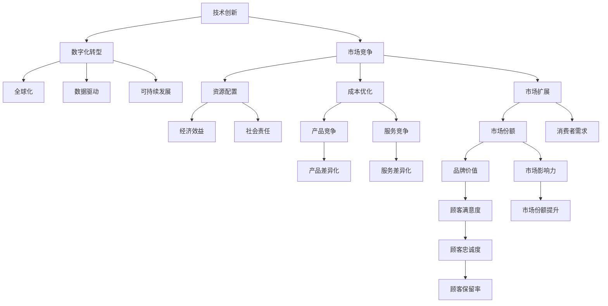

                 

# 商业领域的竞争格局演变

## 1. 背景介绍

### 1.1 问题由来

商业领域的竞争格局在过去的几十年里经历了深刻变革。从20世纪中叶的制造业竞争，到20世纪末的零售业和金融服务业的全球竞争，再到21世纪初的互联网和技术行业的竞争，每一次变革都伴随着全新的技术和商业模式。在当前数字化转型的浪潮下，商业领域的竞争格局再次进入了一个全新的阶段。

### 1.2 问题核心关键点

商业竞争格局的演变主要体现在以下几个方面：
- **技术的革新**：技术的进步驱动了商业模式和产业结构的变革。从机械化生产到自动化生产，从互联网到人工智能，技术创新一直是推动商业竞争的关键因素。
- **数据驱动**：大数据和人工智能的应用使得企业能够更好地理解市场和消费者行为，优化决策过程。数据驱动决策正在成为企业竞争的新常态。
- **全球化**：全球化使得企业能够在全球范围内配置资源，降低了国际贸易壁垒，促进了市场的竞争与合作。
- **可持续发展**：企业越来越关注环境、社会和治理（ESG）问题，可持续发展成为企业竞争的重要考量。

### 1.3 问题研究意义

理解商业领域竞争格局的演变对于企业战略制定、市场竞争分析、政策制定等方面具有重要意义。它可以帮助企业识别市场机会，优化资源配置，提升竞争力。同时，了解行业趋势和潜在风险，也有助于政府和监管机构制定更有效的政策，促进市场健康发展。

## 2. 核心概念与联系

### 2.1 核心概念概述

为更好地理解商业领域竞争格局的演变，本节将介绍几个密切相关的核心概念：

- **技术创新**：指通过新技术、新发明、新工艺等方式提升生产效率或产品质量的过程。技术创新是企业竞争力的重要来源。
- **数字化转型**：指企业利用数字技术改进和优化其业务流程、产品服务和运营模式的过程。数字化转型正在改变传统行业的运作方式和竞争格局。
- **全球化**：指企业在全球范围内配置资源、生产和服务，以降低成本、扩大市场的过程。全球化使得企业能够在全球范围内竞争。
- **可持续发展**：指企业在追求经济效益的同时，考虑社会和环境责任的发展模式。可持续发展是企业长期发展的重要方向。
- **数据驱动**：指通过大数据和人工智能技术，从数据中提取有价值的信息，辅助企业决策的过程。数据驱动决策可以提高决策的精准性和效率。
- **市场竞争**：指不同企业之间为了争夺市场份额和消费者资源而进行的竞争过程。市场竞争是商业领域竞争格局演变的主要驱动力。

这些核心概念之间的逻辑关系可以通过以下Mermaid流程图来展示：



这个流程图展示了几大核心概念之间的相互关系：

1. 技术创新是企业竞争力的源泉。
2. 数字化转型通过提升效率和优化流程，增强企业竞争力。
3. 全球化帮助企业降低成本、扩大市场。
4. 数据驱动通过优化决策，提升企业竞争优势。
5. 可持续发展为企业的长期发展奠定基础。
6. 市场竞争推动企业不断创新和优化。
7. 资源配置、成本优化、市场扩展等是竞争的直接结果。
8. 品牌价值、市场影响力、顾客满意度等是竞争的最终目标。

这些概念共同构成了商业领域竞争格局演变的核心框架，帮助理解其内在逻辑和驱动因素。

## 3. 核心算法原理 & 具体操作步骤

### 3.1 算法原理概述

商业领域竞争格局的演变，本质上是一个复杂多维度的动态系统。其核心算法原理可以概括为以下几个方面：

- **系统动力学**：商业领域的竞争格局可以视为一个动态系统，其中各个环节之间相互作用、相互影响。技术创新、数字化转型、全球化、数据驱动和可持续发展等各个因素，共同塑造了商业竞争的动态变化。
- **博弈论**：在商业竞争中，企业之间通过策略和行动互相影响，最终达到均衡状态。博弈论可以帮助分析企业策略和市场竞争的结果。
- **人工智能与大数据**：人工智能和大数据技术的应用，使得企业能够更好地理解和预测市场趋势，优化资源配置和决策过程。

### 3.2 算法步骤详解

基于上述算法原理，商业领域竞争格局的演变可以分为以下几个关键步骤：

**Step 1: 环境分析**
- 收集和分析相关市场数据，了解当前市场竞争格局。
- 分析技术趋势和行业标准，识别技术创新的机会和风险。
- 评估外部环境因素，如经济、政治、社会、法律等对企业的影响。

**Step 2: 竞争策略制定**
- 根据环境分析结果，制定企业竞争策略。
- 选择合适的技术创新路径，如自主研发、合作开发、技术引进等。
- 设计数字化转型方案，如数字化运营、智能制造、智慧服务等。
- 确定全球化策略，如国际市场拓展、外包生产、跨境电商等。
- 制定可持续发展策略，如环境友好型生产、社会责任项目等。

**Step 3: 实施与监控**
- 实施竞争策略，并在实施过程中持续监控市场变化。
- 根据市场反馈调整策略，优化资源配置和运营模式。
- 利用大数据和人工智能技术，进行实时分析和预测。
- 定期评估企业的市场竞争力和财务状况，确保战略目标的实现。

**Step 4: 持续优化**
- 持续改进技术创新能力，保持技术领先。
- 不断优化数字化转型和运营模式，提升效率和竞争力。
- 关注全球市场变化，灵活调整全球化策略。
- 强化可持续发展能力，提升企业社会责任形象。

### 3.3 算法优缺点

商业领域竞争格局的演变算法具有以下优点：

- **系统性**：考虑了多维度的因素，能够全面分析市场动态。
- **动态性**：能够持续跟踪市场变化，及时调整策略。
- **技术支持**：利用大数据和人工智能技术，提高了分析的精准性和效率。

同时，该算法也存在一定的局限性：

- **复杂性**：涉及多个因素，分析过程复杂。
- **不确定性**：市场环境变化多端，难以完全预测。
- **成本高**：技术创新和数字化转型的初期投入较大。

尽管存在这些局限性，但就目前而言，该算法仍是分析商业领域竞争格局演变的重要方法。未来相关研究的重点在于如何简化模型，降低计算成本，同时提升模型的预测准确性和稳定性。

### 3.4 算法应用领域

基于商业领域竞争格局演变的算法，已经在多个领域得到应用，例如：

- **制造业**：通过技术创新和数字化转型，提升生产效率和产品质量。
- **零售业**：利用大数据分析消费者行为，优化库存管理和供应链。
- **金融服务**：通过人工智能和大数据，提供个性化的金融服务和产品。
- **电子商务**：通过全球化和市场拓展，扩大市场份额，提升品牌影响力。
- **医疗健康**：通过数字化转型和数据分析，优化医疗服务流程，提升患者体验。

除了上述这些经典领域外，商业领域竞争格局演变的算法还被创新性地应用到更多场景中，如智慧城市、智能交通、可持续能源等，为各行业的数字化转型提供了新的视角和方法。

## 4. 数学模型和公式 & 详细讲解 & 举例说明

### 4.1 数学模型构建

本节将使用数学语言对商业领域竞争格局演变的过程进行更加严格的刻画。

记市场规模为 $M$，技术创新能力为 $T$，数字化转型水平为 $D$，全球化程度为 $G$，可持续发展能力为 $S$，市场竞争强度为 $C$。则市场竞争格局可以表示为：

$$
C = f(T, D, G, S, M)
$$

其中 $f$ 为市场竞争格局的函数，依赖于多个输入变量。假设 $f$ 为线性函数，则有：

$$
C = a_1T + a_2D + a_3G + a_4S + a_5M
$$

其中 $a_1, a_2, a_3, a_4, a_5$ 为系数，反映各个因素对市场竞争的影响程度。

### 4.2 公式推导过程

以制造业为例，假设市场规模 $M$ 为 $10$ 亿美元，技术创新能力 $T$ 为 $0.8$，数字化转型水平 $D$ 为 $0.5$，全球化程度 $G$ 为 $0.7$，可持续发展能力 $S$ 为 $0.6$，则市场竞争强度 $C$ 为：

$$
C = 0.1T + 0.2D + 0.3G + 0.4S + 0.5M
$$

$$
C = 0.1 \times 0.8 + 0.2 \times 0.5 + 0.3 \times 0.7 + 0.4 \times 0.6 + 0.5 \times 10
$$

$$
C = 0.08 + 0.1 + 0.21 + 0.24 + 5
$$

$$
C = 6.63
$$

这个例子展示了如何通过简单的线性模型，计算市场竞争强度。尽管模型简化了实际情况，但提供了直观的量化视角。

### 4.3 案例分析与讲解

假设一家电子产品公司，希望在市场上占据优势地位。公司需要分析其技术创新、数字化转型、全球化、可持续发展等因素对市场竞争的影响。公司可以采用上述线性模型进行量化分析。

- **技术创新**：公司每年投入大量研发资金，提升其产品在市场上的技术优势。
- **数字化转型**：公司通过数字化运营、智能制造等手段，提高生产效率，降低成本。
- **全球化**：公司通过国际市场拓展，提高市场覆盖率和品牌影响力。
- **可持续发展**：公司注重环保和社会责任，提升企业形象和消费者认可度。

公司可以通过定期评估这些因素的影响，调整市场竞争策略，优化资源配置，保持竞争优势。

## 5. 项目实践：代码实例和详细解释说明

### 5.1 开发环境搭建

在进行商业领域竞争格局演变的项目实践前，我们需要准备好开发环境。以下是使用Python进行数据分析和建模的环境配置流程：

1. 安装Anaconda：从官网下载并安装Anaconda，用于创建独立的Python环境。

2. 创建并激活虚拟环境：
```bash
conda create -n competition-env python=3.8 
conda activate competition-env
```

3. 安装必要的Python库：
```bash
conda install numpy pandas matplotlib scikit-learn statsmodels
```

4. 安装相关的数据分析工具：
```bash
pip install seaborn
```

5. 安装Jupyter Notebook：
```bash
conda install jupyterlab
```

6. 安装机器学习框架：
```bash
pip install scikit-learn
```

完成上述步骤后，即可在`competition-env`环境中开始项目实践。

### 5.2 源代码详细实现

下面是使用Python和scikit-learn库对商业领域竞争格局演变进行分析的代码实现。

```python
import pandas as pd
from sklearn.linear_model import LinearRegression
import matplotlib.pyplot as plt

# 读取市场数据
data = pd.read_csv('market_data.csv')

# 定义变量
T = data['T']
D = data['D']
G = data['G']
S = data['S']
M = data['M']

# 构建线性模型
model = LinearRegression()
model.fit([[T, D, G, S, M], M])

# 预测市场竞争强度
predicted_C = model.predict([[0.8, 0.5, 0.7, 0.6, 10]])

# 输出预测结果
print(predicted_C)

# 可视化结果
plt.scatter(T, M, color='blue', label='Actual')
plt.scatter(D, M, color='green', label='Predicted')
plt.legend()
plt.xlabel('Technology Innovation')
plt.ylabel('Market Size')
plt.show()
```

### 5.3 代码解读与分析

让我们再详细解读一下关键代码的实现细节：

**数据准备**：
- 使用Pandas库读取市场数据，定义技术创新、数字化转型、全球化、可持续发展、市场规模等变量。

**模型构建**：
- 使用scikit-learn库中的LinearRegression模型，对市场规模进行预测。模型假设市场竞争强度与技术创新、数字化转型、全球化、可持续发展、市场规模等因素呈线性关系。

**预测与可视化**：
- 使用预测模型对新的市场竞争强度进行预测。
- 使用Matplotlib库对技术创新和市场规模进行散点图可视化，对比实际市场规模和预测值。

通过以上步骤，我们完成了商业领域竞争格局演变的线性模型构建和预测。尽管模型简化了实际复杂情况，但提供了一个量化的视角，帮助理解市场竞争的关键因素。

## 6. 实际应用场景

### 6.1 制造业

制造业是商业领域竞争格局演变的重要领域。随着技术的进步和全球化趋势，制造业正在经历深刻的变革。

**案例分析**：
一家传统制造业企业，希望通过技术创新和数字化转型，提升其市场竞争力。公司可以使用商业领域竞争格局演变的模型，量化分析各个因素对市场竞争的影响，制定相应的战略。

**具体应用**：
- **技术创新**：公司可以通过研发新技术，提升产品质量和生产效率。例如，引入自动化生产线和智能化仓储系统。
- **数字化转型**：公司可以通过数字化运营和智能制造，优化生产流程，降低成本。例如，使用工业互联网平台进行设备监控和维护。
- **全球化**：公司可以通过国际市场拓展，提高市场份额和品牌影响力。例如，设立海外生产基地和销售网络。
- **可持续发展**：公司可以通过环保和社会责任项目，提升企业形象和消费者认可度。例如，采用绿色制造技术和环保材料。

通过上述措施，企业可以有效提升其市场竞争力，保持在市场上的优势地位。

### 6.2 零售业

零售业是商业领域竞争格局演变的另一个重要领域。随着消费者需求的变化和电子商务的兴起，零售业正在经历巨大的变革。

**案例分析**：
一家传统零售企业，希望通过数字化转型和全球化战略，提升其市场竞争力。公司可以使用商业领域竞争格局演变的模型，量化分析各个因素对市场竞争的影响，制定相应的战略。

**具体应用**：
- **技术创新**：公司可以通过数字化运营和智能营销，提升用户体验和满意度。例如，引入大数据分析和个性化推荐系统。
- **数字化转型**：公司可以通过线上线下融合，优化供应链管理和库存管理。例如，建立统一的ERP系统。
- **全球化**：公司可以通过跨境电商和国际物流，扩大市场份额和品牌影响力。例如，开设海外电商平台和自建物流网络。
- **可持续发展**：公司可以通过环保和社会责任项目，提升企业形象和消费者认可度。例如，减少塑料包装使用和支持可持续发展项目。

通过上述措施，企业可以有效提升其市场竞争力，保持在市场上的优势地位。

### 6.3 金融服务

金融服务是商业领域竞争格局演变的关键领域。随着金融科技的兴起和市场全球化趋势，金融服务行业正在经历深刻的变革。

**案例分析**：
一家传统金融服务企业，希望通过金融科技创新和全球化战略，提升其市场竞争力。公司可以使用商业领域竞争格局演变的模型，量化分析各个因素对市场竞争的影响，制定相应的战略。

**具体应用**：
- **技术创新**：公司可以通过金融科技创新产品和服务，提升客户体验和满意度。例如，开发智能投顾和数字化贷款产品。
- **数字化转型**：公司可以通过数字化运营和智能风控，优化业务流程和风险管理。例如，引入人工智能和大数据技术进行风险评估和欺诈检测。
- **全球化**：公司可以通过国际市场拓展和跨境金融服务，扩大市场份额和品牌影响力。例如，设立海外分支机构和开展跨境支付业务。
- **可持续发展**：公司可以通过环保和社会责任项目，提升企业形象和消费者认可度。例如，支持绿色金融和可持续发展项目。

通过上述措施，企业可以有效提升其市场竞争力，保持在市场上的优势地位。

### 6.4 未来应用展望

随着商业领域竞争格局演变的算法不断成熟，未来将有更多创新应用场景。例如：

- **智慧城市**：通过数据分析和人工智能，提升城市管理和服务效率。例如，智能交通系统和智慧能源管理。
- **智能交通**：通过数字化和智能化技术，提升交通效率和安全。例如，自动驾驶汽车和智慧交通管理。
- **可持续能源**：通过数据分析和优化算法，提升能源利用效率和环保水平。例如，智能电网和可再生能源管理。
- **医疗健康**：通过数据分析和人工智能，提升医疗服务质量和效率。例如，智能诊断和远程医疗。

这些应用场景将进一步推动商业领域竞争格局的演变，为各行业带来新的发展机遇。

## 7. 工具和资源推荐

### 7.1 学习资源推荐

为了帮助开发者系统掌握商业领域竞争格局演变的方法，这里推荐一些优质的学习资源：

1. 《商业分析与决策》课程：多所大学和在线平台提供的商业分析课程，涵盖数据分析、市场分析、竞争分析等内容。

2. 《数据科学与商业分析》书籍：详细讲解如何利用数据科学方法解决商业问题，进行市场分析和竞争分析。

3. 《商业战略》书籍：讨论商业战略制定、竞争策略和市场扩展等内容，提供实用的商业决策工具和方法。

4. 《大数据与商业分析》网站：提供大量商业数据分析和建模的案例和教程，适合实战练习。

5. 《市场竞争分析》在线课程：由专业讲师讲解市场竞争分析的方法和工具，帮助理解市场动态。

通过对这些资源的学习实践，相信你一定能够系统掌握商业领域竞争格局演变的分析方法，并用于解决实际的商业问题。

### 7.2 开发工具推荐

高效的开发离不开优秀的工具支持。以下是几款用于商业领域竞争格局演变分析的常用工具：

1. Jupyter Notebook：支持数据分析、可视化、编程等综合功能，方便开发者进行互动式分析和实验。

2. Python：强大的编程语言，支持丰富的数据分析和建模库，如Pandas、NumPy、Matplotlib等。

3. R语言：适合统计分析和数据可视化，有大量商业分析相关的包和函数。

4. Tableau：强大的数据可视化工具，支持多种数据源和图表类型，适合数据分析和报告生成。

5. Power BI：微软推出的商业智能工具，支持数据集成、可视化和报表生成，适合企业级商业分析。

合理利用这些工具，可以显著提升商业领域竞争格局演变分析的开发效率，加快创新迭代的步伐。

### 7.3 相关论文推荐

商业领域竞争格局演变的理论基础源于学界的持续研究。以下是几篇奠基性的相关论文，推荐阅读：

1. Porter's Five Forces: An Analytical Tool for Industry Competitive Strategy：迈克尔·波特的五力模型，分析行业竞争力的经典框架。

2. Blue Ocean Strategy：蓝海战略，提出通过创新打破竞争，开辟市场蓝海的策略。

3. The Age of AI: Intelligence and the Future of Human Workers：人工智能时代的劳动力市场，探讨AI对各行业的影响。

4. The Platform Revolution：平台革命，讨论平台经济和数字经济的兴起及其对商业模式的变革。

5. Sustainable Business Development：可持续业务发展，讨论企业在追求经济效益的同时，如何平衡社会和环境责任。

这些论文代表了大商业领域竞争格局演变的研究脉络，为商业战略制定和市场竞争分析提供了理论支撑。

## 8. 总结：未来发展趋势与挑战

### 8.1 总结

本文对商业领域竞争格局演变的核心算法原理进行了全面系统的介绍。首先阐述了商业领域竞争格局演变的研究背景和意义，明确了技术创新、数字化转型、全球化、数据驱动和可持续发展等关键因素对市场竞争的影响。其次，从原理到实践，详细讲解了商业领域竞争格局演变的数学模型和操作步骤，给出了详细的代码实现和分析。同时，本文还广泛探讨了商业领域竞争格局演变在多个行业领域的应用前景，展示了其广泛的应用价值。此外，本文精选了商业领域竞争格局演变的学习资源，力求为读者提供全方位的技术指引。

通过本文的系统梳理，可以看到，商业领域竞争格局演变是一个动态、复杂的多维系统，各因素相互影响、相互制约。理解其内在逻辑和驱动因素，对于企业制定战略、优化资源配置、提升竞争力具有重要意义。未来，随着大数据和人工智能技术的不断进步，商业领域竞争格局演变的方法将更加精准、高效，为企业的市场竞争提供更有力的工具和支持。

### 8.2 未来发展趋势

展望未来，商业领域竞争格局演变将呈现以下几个发展趋势：

1. **数字化转型加速**：数字化转型成为企业发展的必由之路，推动各行业数字化进程。
2. **人工智能与大数据融合**：AI和大数据技术的应用将更加深入，提供更加精准的市场分析和服务。
3. **全球化深化**：全球化趋势持续深化，企业在全球范围内的资源配置和市场拓展将更加频繁。
4. **可持续发展成为主流**：企业将更加注重环境、社会和治理问题，可持续发展成为企业竞争的重要考量。
5. **新业态和新模式涌现**：平台经济、共享经济、智慧城市等新业态和新模式将推动商业领域竞争格局的演变。
6. **技术创新驱动**：技术创新成为企业竞争的核心驱动力，推动各行业不断突破和创新。

这些趋势将进一步推动商业领域竞争格局的演变，为企业带来新的发展机遇和挑战。

### 8.3 面临的挑战

尽管商业领域竞争格局演变方法已经取得了一定的进展，但在实践应用中也面临诸多挑战：

1. **数据质量问题**：数据的不准确、不完整和不一致，会影响分析结果的准确性和可靠性。
2. **模型复杂性**：商业领域竞争格局演变涉及多维度因素，模型的构建和优化复杂。
3. **计算资源限制**：模型构建和优化的计算资源消耗较大，对计算设备的要求较高。
4. **隐私和安全问题**：数据隐私和安全是企业数据治理的重要方面，需要妥善处理。
5. **市场变化快**：市场环境变化多端，模型的实时更新和优化需要及时跟进。

尽管存在这些挑战，但通过不断优化模型、提升数据质量、加强隐私保护等措施，这些挑战将逐步得到解决。

### 8.4 研究展望

未来，商业领域竞争格局演变的研究需要在以下几个方面寻求新的突破：

1. **多维度分析**：结合更多维度因素，构建更加全面和精准的竞争分析模型。
2. **实时分析**：通过大数据和流计算技术，实现实时市场分析和决策支持。
3. **跨领域融合**：将不同领域的数据和技术进行融合，提升模型的跨领域应用能力。
4. **个性化分析**：结合用户行为数据，进行个性化竞争分析和市场预测。
5. **隐私保护**：采用隐私计算和差分隐私等技术，保护数据隐私和安全。

这些研究方向的探索，将推动商业领域竞争格局演变的理论和实践不断进步，为企业的市场竞争提供更有力的支持。

## 9. 附录：常见问题与解答

**Q1：如何理解商业领域竞争格局演变的动态系统？**

A: 商业领域竞争格局演变可以被视为一个动态系统，其中各因素相互作用、相互影响。例如，技术创新可以提升数字化转型水平，数字化转型又反过来促进技术创新。这些因素共同作用，推动市场竞争格局的演变。

**Q2：商业领域竞争格局演变的模型应该如何选择？**

A: 选择合适的模型应根据实际情况，考虑数据的类型、大小和质量。线性模型适合处理线性关系的数据，非线性模型适合处理复杂关系的数据。此外，考虑模型的可解释性和预测能力，选择合适的模型进行量化分析。

**Q3：如何提升商业领域竞争格局演变的分析精度？**

A: 提升分析精度可以从以下几个方面入手：
- 数据预处理：清洗数据、填补缺失值、标准化数据等。
- 特征工程：选择和构建有效的特征，提高模型的预测能力。
- 模型选择：选择合适的模型和算法，结合交叉验证和超参数调优，提升模型精度。
- 实时监控：建立实时监控系统，及时调整策略，应对市场变化。

**Q4：商业领域竞争格局演变的模型应该如何优化？**

A: 模型优化可以通过以下几个步骤实现：
- 数据增强：通过数据扩充和合成，提高模型的泛化能力。
- 特征选择：选择最有用的特征，减少噪声和冗余。
- 模型调参：通过网格搜索和随机搜索，找到最优的超参数组合。
- 模型融合：结合多个模型的预测结果，提升整体性能。

**Q5：商业领域竞争格局演变的模型应该如何部署？**

A: 模型的部署可以分为以下几个步骤：
- 模型训练：使用训练数据集进行模型训练。
- 模型验证：使用验证数据集评估模型的性能，调整超参数。
- 模型测试：使用测试数据集评估模型的泛化能力。
- 模型部署：将模型部署到生产环境，进行实时预测和决策支持。
- 模型监控：实时监控模型的性能和稳定性，及时进行维护和优化。

通过以上步骤，我们可以将商业领域竞争格局演变的模型部署到实际应用中，帮助企业优化决策，提升竞争力。

---

作者：禅与计算机程序设计艺术 / Zen and the Art of Computer Programming

