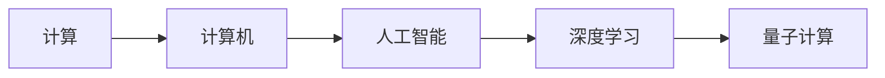

                 

## 1. 背景介绍

计算，作为人类文明进步的重要驱动力，其发展历程与人类社会的演进紧密相连。从古老的结绳计数到现代的超级计算，计算技术不断进化，深刻改变了人类生活的方方面面。本文旨在回顾计算机的发展历程，展望未来计算的前景与挑战，以期对未来技术的发展趋势有所启发。

## 2. 核心概念与联系

### 2.1 核心概念概述

- **计算与计算技术**：指人类在解决各类问题时，运用数学、逻辑和物理规律进行推导和验证的过程。计算技术的进步推动了社会的全面发展。
- **计算机**：一种通过电子器件和软件实现计算过程的机械设备。计算机的发展，直接体现了计算技术的发展水平。
- **人工智能**：一种模拟人类智能的技术，包括学习、推理、感知等能力。人工智能是计算机技术的重要分支。
- **深度学习**：一种基于神经网络的机器学习技术，具有高度的泛化能力和自适应性。深度学习在许多复杂任务上取得了卓越的成果。
- **量子计算**：一种利用量子力学的计算模型，拥有潜在超越经典计算的计算能力。量子计算是计算技术的前沿。

### 2.2 核心概念原理和架构的 Mermaid 流程图



## 3. 核心算法原理 & 具体操作步骤

### 3.1 算法原理概述

计算技术的发展可以分为多个阶段，每个阶段的核心算法和原理各不相同：

- **第一代计算技术**：以机械式计算器为代表，主要基于机械或手工计算。
- **第二代计算技术**：以电子管计算机为代表，实现了电子逻辑门的集成。
- **第三代计算技术**：以晶体管计算机为代表，实现了更高效的电子逻辑门和更快的计算速度。
- **第四代计算技术**：以集成电路计算机为代表，实现了大规模集成电路和操作系统。
- **第五代计算技术**：以人工智能和深度学习为代表，通过复杂的神经网络实现高效的计算。
- **第六代计算技术**：以量子计算为代表，利用量子态的叠加和纠缠，实现更高的计算效率。

### 3.2 算法步骤详解

#### 3.2.1 机械计算时代

**步骤1**：使用机械或手工进行计算。
**步骤2**：手工记录计算结果。

#### 3.2.2 电子管计算时代

**步骤1**：使用电子管进行逻辑运算。
**步骤2**：使用磁带、打孔卡片等方式进行数据存储和传输。
**步骤3**：运行程序并输出结果。

#### 3.2.3 晶体管计算时代

**步骤1**：使用晶体管进行逻辑运算。
**步骤2**：使用磁盘、磁带等方式进行数据存储和传输。
**步骤3**：运行程序并输出结果。

#### 3.2.4 集成电路计算时代

**步骤1**：使用集成电路进行逻辑运算。
**步骤2**：使用磁盘、磁带、软盘等方式进行数据存储和传输。
**步骤3**：运行程序并输出结果。

#### 3.2.5 人工智能与深度学习时代

**步骤1**：使用神经网络进行复杂计算。
**步骤2**：使用硬盘、固态硬盘等方式进行数据存储和传输。
**步骤3**：运行程序并输出结果。

#### 3.2.6 量子计算时代

**步骤1**：使用量子比特进行逻辑运算。
**步骤2**：使用量子存储器进行数据存储和传输。
**步骤3**：运行程序并输出结果。

### 3.3 算法优缺点

#### 3.3.1 机械计算时代

**优点**：
- 使用简单，易于维护。
- 数据存储量大。

**缺点**：
- 计算速度慢，容易出错。
- 受机械零件磨损影响，寿命短。

#### 3.3.2 电子管计算时代

**优点**：
- 计算速度快，可靠性高。
- 数据存储和传输速度提高。

**缺点**：
- 体积大，能耗高。
- 程序复杂，调试困难。

#### 3.3.3 晶体管计算时代

**优点**：
- 体积小，能耗低。
- 程序设计简化。

**缺点**：
- 计算速度有限。
- 数据存储容量仍受限制。

#### 3.3.4 集成电路计算时代

**优点**：
- 计算速度快，体积小。
- 数据存储和传输速度大幅提高。

**缺点**：
- 程序设计复杂度增加。
- 对环境要求高，散热和稳定运行需要特殊设计。

#### 3.3.5 人工智能与深度学习时代

**优点**：
- 计算能力强，能处理复杂问题。
- 模型可扩展性好，适应性强。

**缺点**：
- 模型训练复杂，需要大量计算资源。
- 对数据质量要求高，容易过拟合。

#### 3.3.6 量子计算时代

**优点**：
- 计算速度极快，理论上可以超越经典计算机。
- 具备并行计算能力。

**缺点**：
- 技术尚不成熟，实现难度大。
- 需要低温环境，设备成本高。

### 3.4 算法应用领域

- **科学计算**：在物理、化学、天文等领域，用于模拟和分析复杂系统。
- **金融计算**：用于高频交易、风险管理等，提高决策效率。
- **医疗计算**：用于疾病预测、药物研发等，提高诊断和治疗的精确度。
- **人工智能**：用于语音识别、图像处理、自然语言处理等，提升智能系统的能力。
- **量子计算**：用于密码学、材料科学等领域，破解复杂问题。

## 4. 数学模型和公式 & 详细讲解 & 举例说明

### 4.1 数学模型构建

在计算机科学的早期，许多算法和计算模型都是以数学模型为基础的。以下是一些核心计算模型：

- **牛顿-拉夫逊法**：用于优化问题求解，是一种迭代算法。
- **蒙特卡洛方法**：通过随机抽样和统计计算，求解复杂的概率和统计问题。
- **模拟退火算法**：通过随机接受高能量状态，寻找全局最优解。

### 4.2 公式推导过程

以牛顿-拉夫逊法为例，推导如下：

$$
x_{k+1} = x_k - \frac{f'(x_k)}{f''(x_k)}
$$

其中 $f(x)$ 为目标函数，$x_k$ 为当前解，$x_{k+1}$ 为迭代后的解，$f'(x)$ 和 $f''(x)$ 分别为 $f(x)$ 的一阶导数和二阶导数。

### 4.3 案例分析与讲解

假设目标函数为 $f(x) = x^3 - 3x^2 + 2x - 1$，初值为 $x_0 = 1$。使用牛顿-拉夫逊法迭代求解 $f(x) = 0$ 的解。

```python
import numpy as np

def f(x):
    return x**3 - 3*x**2 + 2*x - 1

def f_prime(x):
    return 3*x**2 - 6*x + 2

def f_double_prime(x):
    return 6*x - 6

x = 1
x_list = [x]

while abs(f(x)) > 1e-8:
    f_prime_x = f_prime(x)
    f_double_prime_x = f_double_prime(x)
    if f_double_prime_x != 0:
        x = x - f_prime_x / f_double_prime_x
    else:
        break
    x_list.append(x)

x_list.append(x)
```

## 5. 项目实践：代码实例和详细解释说明

### 5.1 开发环境搭建

- **操作系统**：Linux、Windows、macOS。
- **编程语言**：C++、Python、Java。
- **开发工具**：Eclipse、PyCharm、Visual Studio。
- **数据库**：MySQL、PostgreSQL、MongoDB。
- **框架**：Spring Boot、Flask、TensorFlow。
- **版本控制**：Git、SVN。

### 5.2 源代码详细实现

以TensorFlow为例，实现一个简单的神经网络：

```python
import tensorflow as tf
from tensorflow import keras

# 定义模型
model = keras.Sequential([
    keras.layers.Dense(64, activation='relu', input_shape=(784,)),
    keras.layers.Dense(64, activation='relu'),
    keras.layers.Dense(10)
])

# 编译模型
model.compile(optimizer=tf.keras.optimizers.Adam(), 
              loss=tf.keras.losses.SparseCategoricalCrossentropy(from_logits=True), 
              metrics=['accuracy'])

# 加载数据集
mnist = tf.keras.datasets.mnist
(x_train, y_train), (x_test, y_test) = mnist.load_data()

# 数据预处理
x_train = x_train / 255.0
x_test = x_test / 255.0

# 训练模型
model.fit(x_train, y_train, epochs=10, batch_size=32)

# 评估模型
model.evaluate(x_test, y_test)
```

### 5.3 代码解读与分析

- **Sequential模型**：用于搭建简单的神经网络。
- **Dense层**：全连接层，用于特征提取和分类。
- **Adam优化器**：自适应优化算法，能够根据梯度大小自适应学习率。
- **交叉熵损失函数**：用于衡量模型输出与真实标签之间的差异。
- **数据预处理**：将像素值归一化，确保模型稳定训练。

### 5.4 运行结果展示

- **训练过程**：模型在训练集上逐步提高准确率。
- **评估过程**：模型在测试集上验证其泛化能力。

## 6. 实际应用场景

### 6.1 金融计算

金融计算是计算机应用的重要领域之一。高频交易系统、风险管理模型、量化交易策略等都依赖于高性能计算技术。

- **高频交易系统**：通过算法模型，在极短时间内执行大量交易，优化资产配置，提高收益。
- **风险管理模型**：通过复杂计算模型，评估市场风险，制定风险控制策略。
- **量化交易策略**：通过数学模型和统计分析，自动执行交易决策，实现市场套利。

### 6.2 医疗计算

医疗计算在疾病预测、药物研发等方面有重要应用。

- **疾病预测**：通过数据分析和机器学习模型，预测疾病风险，实现早期预警。
- **药物研发**：通过计算模型和模拟实验，筛选出潜在药物分子，加速新药研发进程。
- **医疗影像分析**：通过图像处理和深度学习模型，自动分析医学影像，提高诊断准确率。

### 6.3 人工智能

人工智能是计算机科学的重要分支，在语音识别、图像处理、自然语言处理等领域有广泛应用。

- **语音识别**：通过声学模型和语言模型，实现语音与文本的自动转换。
- **图像处理**：通过图像识别和深度学习模型，实现图像的分类、检测、分割等任务。
- **自然语言处理**：通过语言模型和自然语言理解模型，实现文本分析、情感分析、问答系统等任务。

### 6.4 量子计算

量子计算具有突破经典计算极限的潜力，广泛应用于密码学、材料科学等领域。

- **量子加密**：通过量子密钥分发，实现无条件安全的通信。
- **量子模拟**：通过量子计算机模拟复杂物理过程，加速材料科学研究。
- **量子优化**：通过量子算法解决优化问题，提高求解效率。

## 7. 工具和资源推荐

### 7.1 学习资源推荐

- **《算法导论》**：经典计算机科学教材，介绍了各种算法和数据结构。
- **Coursera**：在线学习平台，提供多种计算机科学课程。
- **Kaggle**：数据科学竞赛平台，提供大量数据集和算法模型。

### 7.2 开发工具推荐

- **PyCharm**：Python开发环境，提供代码高亮、调试工具等功能。
- **Visual Studio**：跨平台开发工具，支持多种编程语言。
- **Jupyter Notebook**：交互式编程环境，支持Python和R等多种语言。

### 7.3 相关论文推荐

- **"Deep Learning" by Ian Goodfellow, Yoshua Bengio, and Aaron Courville**：深度学习领域的经典教材，介绍了深度学习的基本概念和算法。
- **"Quantum Computing Since Democritus" by Scott Aaronson**：量子计算领域的入门教材，介绍了量子计算的基本原理和应用。
- **"Introduction to Algorithms" by Thomas H. Cormen, Charles E. Leiserson, Ronald L. Rivest, and Clifford Stein**：算法导论的经典教材，介绍了各种算法和数据结构。

## 8. 总结：未来发展趋势与挑战

### 8.1 研究成果总结

- **计算能力提升**：计算机硬件和软件的进步，不断提升计算能力。
- **计算模型创新**：神经网络、深度学习等创新算法，推动计算技术的发展。
- **计算应用扩展**：计算技术在金融、医疗、人工智能等领域得到广泛应用。

### 8.2 未来发展趋势

- **量子计算**：量子计算将极大提升计算能力，实现更多复杂问题的求解。
- **人工智能**：深度学习等人工智能技术将进一步提升计算机的智能水平，推动更多领域的自动化和智能化。
- **边缘计算**：计算资源将在边缘设备上分布，提高数据处理效率。
- **智能芯片**：如GPU、FPGA等专用芯片，提高计算效率和能效比。

### 8.3 面临的挑战

- **计算资源瓶颈**：计算资源的需求不断增长，但物理设备的硬件性能增长已趋缓。
- **数据质量与隐私保护**：数据质量和隐私保护问题，影响计算的准确性和安全性。
- **技术标准化**：计算技术的多样性带来标准化难题，影响计算资源的互通和协同。
- **技术伦理与安全**：计算技术的应用可能带来伦理和安全问题，如数据滥用、隐私泄露等。

### 8.4 研究展望

- **量子计算**：开发新型量子算法，解决经典计算无法解决的问题。
- **人工智能**：研发更加高效、普适的人工智能算法，提升智能系统的能力。
- **计算伦理**：建立计算技术的伦理框架，确保技术应用的合法性和道德性。

## 9. 附录：常见问题与解答

**Q1: 什么是计算技术？**

A: 计算技术是指人类在解决各类问题时，运用数学、逻辑和物理规律进行推导和验证的过程。它涉及各种算法、数据结构和计算机硬件的研发与应用。

**Q2: 计算机的发展经历了哪些阶段？**

A: 计算机的发展经历了机械计算时代、电子管计算时代、晶体管计算时代、集成电路计算时代、人工智能与深度学习时代以及量子计算时代。

**Q3: 深度学习在计算机科学中起什么作用？**

A: 深度学习是人工智能的重要分支，通过复杂的神经网络模型，可以自动学习和提取数据的特征，用于图像识别、自然语言处理等复杂任务，具有高度的泛化能力和自适应性。

**Q4: 量子计算的优势是什么？**

A: 量子计算利用量子态的叠加和纠缠，可以实现更快的计算速度，理论上可以超越经典计算机，在密码学、材料科学等领域有广泛应用。

**Q5: 计算机科学将走向何方？**

A: 未来计算科学将继续向量子计算、人工智能、边缘计算和智能芯片等方向发展，推动计算技术的全面突破。同时，计算伦理与安全也将成为重要研究方向，确保技术应用的合法性和道德性。

---

作者：禅与计算机程序设计艺术 / Zen and the Art of Computer Programming

