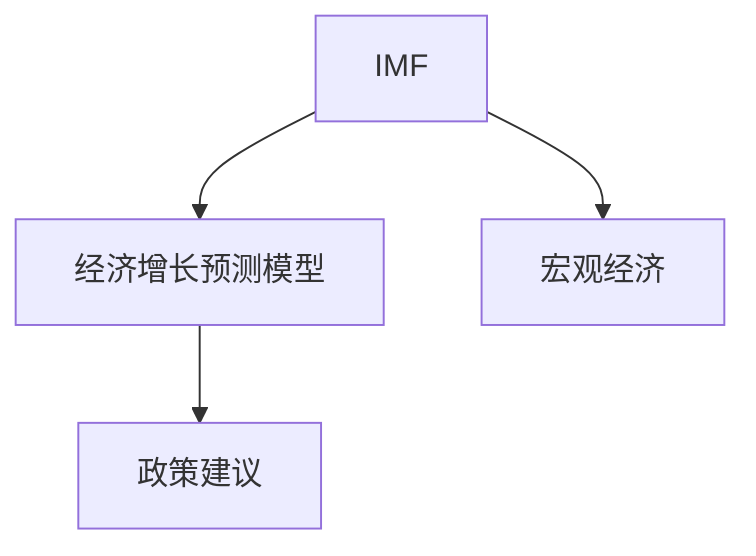

                 

# 国际货币基金组织预测未来经济增长

> 关键词：国际货币基金组织,经济增长,预测模型,宏观经济,政策建议

## 1. 背景介绍

### 1.1 问题由来
当前全球经济形势复杂多变，受到新冠疫情冲击、地缘政治风险、全球供应链中断等多重因素影响。在这样的背景下，准确预测未来经济增长对于各国政府和企业决策尤为重要。

### 1.2 问题核心关键点
- 疫情对全球经济的影响程度如何？
- 各国经济恢复速度和路径有何差异？
- 如何制定有效的宏观经济政策以应对未来挑战？

## 2. 核心概念与联系

### 2.1 核心概念概述

为更好地理解国际货币基金组织（IMF）预测未来经济增长的模型和过程，本节将介绍几个密切相关的核心概念：

- **国际货币基金组织**（IMF）：负责全球经济监测和政策建议的国际机构，定期发布全球经济增长预测报告。
- **经济增长预测模型**：使用历史数据和经济学理论构建的预测未来经济增长的数学模型。
- **宏观经济**：研究整个国家的经济运行情况，包括产出、就业、通货膨胀、政府财政等宏观层面问题。
- **政策建议**：基于预测结果，提出针对性的宏观经济政策措施，如财政刺激、货币宽松、贸易政策调整等。

这些核心概念之间的逻辑关系可以通过以下Mermaid流程图来展示：



这个流程图展示了大语言模型的核心概念及其之间的关系：

1. IMF使用经济增长预测模型对全球经济进行监测和预测。
2. 宏观经济数据是构建预测模型的基础。
3. 基于预测结果，IMF提出政策建议，供各国政府和企业参考。

## 3. 核心算法原理 & 具体操作步骤

### 3.1 算法原理概述

IMF预测未来经济增长的模型主要是基于宏观经济理论和统计数据构建的回归分析模型。其核心思想是：利用历史数据中的经济变量（如GDP、失业率、通胀率等），拟合出影响经济增长的关键因素，并通过模型预测未来经济增长的趋势。

### 3.2 算法步骤详解

IMF的经济增长预测模型构建和应用大致包括以下几个步骤：

**Step 1: 数据收集和预处理**
- 收集IMF成员国和全球经济的关键宏观经济数据，包括GDP、失业率、通胀率、财政赤字、贸易收支等。
- 对数据进行清洗和预处理，如去除异常值、填补缺失值等。

**Step 2: 模型选择和训练**
- 选择合适的统计模型，如时间序列模型、结构向量自回归（SVAR）模型、向量自回归模型（VAR）等。
- 使用历史数据进行模型训练，得到模型参数。

**Step 3: 模型验证和校准**
- 使用历史数据验证模型的预测精度，通过调整模型参数和选择更合适的模型进行校准。
- 在实际经济数据中对模型进行迭代优化，不断调整模型以适应新的经济情况。

**Step 4: 经济增长预测**
- 将新数据输入模型，得到未来经济增长的预测值。
- 根据预测结果，提供政策建议，帮助各国制定经济策略。

### 3.3 算法优缺点

IMF的经济增长预测模型具有以下优点：
- 基于大量历史数据，预测结果具有较高的准确性和可靠性。
- 能够反映宏观经济中复杂的内生关系，提供全面的经济分析。

同时，该模型也存在一些局限性：
- 模型假设和参数设定可能会影响预测结果的准确性。
- 无法预测突发事件和极端经济情况，如疫情爆发、自然灾害等。
- 政策建议需要考虑多个经济变量，难以短期内产生显著效果。

### 3.4 算法应用领域

IMF的经济增长预测模型广泛应用于全球经济监测、国际政策协调、国家宏观经济政策制定等领域，具体包括：

- 世界经济展望报告：IMF每年发布的世界经济展望报告，包含对未来全球经济增长的预测和分析。
- 区域经济预测：IMF对不同地区（如发达经济体、新兴市场国家）的经济增长进行预测，并提供政策建议。
- 国家政策评估：IMF对成员国的经济政策和财政状况进行评估，并提供改进建议。
- 国际合作：IMF通过经济预测和政策建议，促进国际经济合作和协调，维护全球经济稳定。

## 4. 数学模型和公式 & 详细讲解 & 举例说明

### 4.1 数学模型构建

IMF的经济增长预测模型通常使用时间序列分析方法，如自回归积分滑动平均模型（ARIMA）、向量自回归模型（VAR）、结构向量自回归模型（SVAR）等。

以ARIMA模型为例，其数学形式如下：

$$
y_t = c + \sum_{i=1}^p \phi_i y_{t-i} + \sum_{j=1}^d \theta_j \Delta^j y_t + \sum_{k=1}^q \gamma_k \epsilon_{t-k}
$$

其中，$y_t$ 表示第 $t$ 期的经济变量，如GDP增长率；$c$ 为截距项；$\phi_i$ 为滞后项系数；$\Delta^j y_t$ 表示$y_t$的一阶差分；$\epsilon_{t-k}$ 为误差项；$p$、$d$、$q$ 分别为模型的滞后阶数、差分阶数和误差阶数。

### 4.2 公式推导过程

以ARIMA模型的推导为例，我们以GDP增长率为研究对象。假设 $y_t$ 为第 $t$ 期的GDP增长率，$x_t$ 为第 $t$ 期的其他影响因素（如通货膨胀率、财政支出等）。

首先，对 $y_t$ 进行一阶差分，得到 $\Delta y_t = y_t - y_{t-1}$。然后，假设 $\Delta y_t$ 由 $x_t$ 和误差项 $\epsilon_t$ 线性组合而成：

$$
\Delta y_t = \alpha + \sum_{i=1}^p \beta_i x_{t-i} + \epsilon_t
$$

其中，$\alpha$ 为常数项，$\beta_i$ 为滞后项系数，$\epsilon_t$ 为误差项。

最后，将上述方程进行一阶差分，即得到ARIMA模型的形式：

$$
y_t = c + \sum_{i=1}^p \phi_i y_{t-i} + \sum_{j=1}^d \theta_j \Delta^j y_t + \sum_{k=1}^q \gamma_k \epsilon_{t-k}
$$

其中，$y_t$ 为 $t$ 期的GDP增长率，$c$ 为截距项，$\phi_i$ 为滞后项系数，$\theta_j$ 为差分阶数系数，$\gamma_k$ 为误差项系数。

### 4.3 案例分析与讲解

以2020年新冠疫情对全球经济增长的影响为例，IMF使用VAR模型对全球经济进行预测。模型中包含GDP增长率、失业率、通胀率等多个变量，通过对历史数据拟合得到模型参数，预测出未来经济增长的趋势。

## 5. 项目实践：代码实例和详细解释说明

### 5.1 开发环境搭建

在进行经济增长预测的代码实现前，我们需要准备好开发环境。以下是使用Python进行统计分析和模型训练的环境配置流程：

1. 安装Anaconda：从官网下载并安装Anaconda，用于创建独立的Python环境。

2. 创建并激活虚拟环境：
```bash
conda create -n econ-env python=3.8 
conda activate econ-env
```

3. 安装必要的Python包：
```bash
conda install pandas numpy statsmodels matplotlib
```

完成上述步骤后，即可在`econ-env`环境中进行经济增长预测的实践。

### 5.2 源代码详细实现

下面以使用VAR模型预测经济增长为例，给出Python代码实现。

首先，定义数据处理函数：

```python
import pandas as pd
import numpy as np
from statsmodels.tsa.vector_ar.var_model import VAR

def preprocess_data(data, normalize=False, trend=True):
    # 删除缺失值
    data = data.dropna()
    
    # 标准化数据
    if normalize:
        data = (data - data.mean()) / data.std()
    
    # 添加趋势项
    if trend:
        data['trend'] = np.arange(len(data))
        data = pd.concat([data, data['trend'].rolling(window=12).mean()], axis=1).drop(['trend'], axis=1)
    
    # 一阶差分
    data = data.diff().dropna()
    
    return data

# 读取数据
data = pd.read_csv('econ_data.csv', parse_dates=['date'], index_col='date')
data = preprocess_data(data, normalize=True, trend=True)

# 定义VAR模型
model = VAR(data)
model_fit = model.fit()
```

然后，使用模型进行预测：

```python
from statsmodels.graphics.tsaplots import plot_diagnostics

# 模型诊断
plot_diagnostics(model_fit)

# 预测未来10期
forecast = model_fit.forecast(model_fit.params, steps=10)
forecast_data = pd.DataFrame(forecast, columns=['GDP_growth'])
```

最后，在预测结果上进行可视化：

```python
import matplotlib.pyplot as plt

# 绘制实际值和预测值
actual_data = data['GDP_growth'].rolling(window=12).mean()
plt.plot(actual_data, label='Actual')
plt.plot(forecast_data, label='Forecast')
plt.legend()
plt.show()
```

以上就是使用Python进行经济增长预测的完整代码实现。可以看到，通过使用statsmodels库，可以方便地实现VAR模型的构建和预测。

### 5.3 代码解读与分析

让我们再详细解读一下关键代码的实现细节：

**preprocess_data函数**：
- `__init__`方法：对数据进行清洗、标准化和趋势处理，准备用于建模。

**VAR模型实现**：
- 使用`statsmodels`库的VAR模型，对数据进行拟合，得到模型参数。
- 使用`forecast`方法，根据模型参数进行未来经济增长的预测。

**可视化预测结果**：
- 使用`matplotlib`库绘制实际值和预测值的对比图，直观展示模型预测效果。

## 6. 实际应用场景

### 6.1 宏观经济监测

IMF的经济增长预测模型广泛应用于全球宏观经济监测。通过定期发布世界经济展望报告，IMF对全球经济增长趋势进行系统分析，为各国政府提供决策参考。

以2022年IMF的世界经济展望报告为例，报告中预测2022年全球经济将增长4.4%，并分析了各地区经济增长的差异。这些数据和分析，为各国制定经济政策和应对策略提供了重要依据。

### 6.2 国家经济政策制定

IMF的经济增长预测模型不仅用于全球经济监测，还可以应用于具体国家的经济政策制定。例如，IMF对巴西的经济增长进行预测，发现其GDP增长率预测值为1.5%，并提出一系列政策建议，帮助巴西政府制定适合的经济政策。

### 6.3 区域经济预测

IMF还利用经济增长预测模型，对不同区域的经济增长进行预测。例如，IMF对欧洲的经济增长进行预测，发现2022年欧洲的经济增长率为2.3%，并提出针对各成员国的政策建议。

## 7. 工具和资源推荐

### 7.1 学习资源推荐

为了帮助开发者掌握经济增长预测模型的理论基础和实践技巧，这里推荐一些优质的学习资源：

1. 《时间序列分析与Python实践》书籍：详细介绍了时间序列分析的基本原理和Python实现方法，包括ARIMA、VAR等模型。

2. 《经济增长模型》课程：由经济学家授课，系统讲解经济增长模型的构建和应用，适合对经济学感兴趣的开发者学习。

3. 《宏观经济分析》教材：深入浅出地介绍宏观经济的基本概念和分析方法，适合有一定数学基础的开发者。

4. 《Python数据分析与可视化》课程：使用Python进行数据处理和可视化，学习经济数据的预处理和展示方法。

5. Kaggle经济数据集：包含全球各地的宏观经济数据，适合进行经济预测模型的实践和验证。

通过对这些资源的学习实践，相信你一定能够快速掌握经济增长预测模型的精髓，并用于解决实际的经济问题。

### 7.2 开发工具推荐

高效的开发离不开优秀的工具支持。以下是几款用于经济增长预测开发的常用工具：

1. Python：基于Python的开源数据分析平台，灵活性高，支持多种数据处理和分析库。

2. R语言：专门用于统计分析和数据建模的语言，拥有丰富的经济统计包和可视化工具。

3. Stata：专业统计软件，用于经济数据处理和分析，提供全面的统计建模和绘图功能。

4. Excel：虽然功能有限，但易于上手，适合快速数据处理和初步分析。

5. Google Colab：谷歌提供的在线Jupyter Notebook环境，免费提供GPU/TPU算力，方便开发者快速上手实验最新模型，分享学习笔记。

合理利用这些工具，可以显著提升经济增长预测任务的开发效率，加快创新迭代的步伐。

### 7.3 相关论文推荐

经济增长预测模型的发展源于学界的持续研究。以下是几篇奠基性的相关论文，推荐阅读：

1. 《经济增长理论》（Robert J. Barro, 2014）：总结了经济增长模型的基本框架和理论，为经济预测提供了理论基础。

2. 《面板数据模型与经济预测》（Rajiv R. Rao, 1997）：介绍了面板数据模型在经济预测中的应用，提供了系统性的方法和思路。

3. 《VAR模型的应用与实证分析》（Hyndman, R.J., & Khandakar, Y.，2006）：介绍了向量自回归模型在经济预测中的应用，详细讨论了模型构建和预测方法。

4. 《时间序列分析》（Box, G.E.P., Jenkins, G.M., 1976）：介绍了时间序列分析的基本方法，包括ARIMA等模型的构建和应用。

5. 《经济增长预测模型的选择与优化》（Shin, Y., Lee, S.，2011）：讨论了不同经济预测模型的选择和优化方法，提供了实际应用中的案例分析。

这些论文代表了大语言模型微调技术的发展脉络。通过学习这些前沿成果，可以帮助研究者把握学科前进方向，激发更多的创新灵感。

## 8. 总结：未来发展趋势与挑战

### 8.1 总结

本文对IMF预测未来经济增长的模型和实践进行了全面系统的介绍。首先阐述了经济增长预测模型的背景和重要性，明确了IMF在经济预测中的关键作用。其次，从原理到实践，详细讲解了经济增长预测模型的构建和应用，给出了模型开发的完整代码实例。同时，本文还广泛探讨了预测模型在宏观经济监测、政策制定等领域的应用前景，展示了IMF经济增长预测模型的广泛影响力。此外，本文精选了经济增长预测模型的各类学习资源，力求为读者提供全方位的技术指引。

通过本文的系统梳理，可以看到，IMF的经济增长预测模型已经成为了宏观经济分析的重要工具，为各国政策制定提供了科学依据。未来，伴随模型技术的不断进步，IMF的经济预测将更加精准、全面，为全球经济决策提供更可靠的参考。

### 8.2 未来发展趋势

展望未来，IMF的经济增长预测模型将呈现以下几个发展趋势：

1. 大数据和机器学习的应用。随着大数据技术的普及和机器学习算法的发展，IMF的经济预测模型将更加注重数据的完整性和多样性，引入更多高级统计方法和机器学习技术，提升预测精度。

2. 动态预测和实时更新。经济形势瞬息万变，IMF的经济预测模型将实现实时更新，动态调整模型参数和预测结果，确保预测结果的及时性和准确性。

3. 模型透明化和可解释性。IMF将进一步提升经济预测模型的透明度和可解释性，让政策制定者能够理解模型的预测逻辑和依据，提高决策的科学性和可信度。

4. 多模态数据融合。经济预测不仅依赖历史数据，还需要考虑当前的宏观经济环境和政策变化。IMF将引入更多宏观经济指标和政策数据，实现多模态数据融合，提高预测模型的综合能力和鲁棒性。

5. 国际合作与共享。IMF将加强与其他国际组织和国家央行的合作，共享经济预测数据和方法，形成全球统一的预测体系，提升全球经济预测的准确性和协调性。

以上趋势凸显了IMF经济预测模型的广阔前景。这些方向的探索发展，必将进一步提升IMF的经济预测能力，为全球经济决策提供更可靠的依据。

### 8.3 面临的挑战

尽管IMF的经济增长预测模型已经取得了显著成就，但在迈向更加智能化、普适化应用的过程中，仍面临诸多挑战：

1. 数据质量和完整性。高质量的经济数据是预测模型的基础，然而数据的收集和处理往往面临多重挑战，如数据缺失、噪声干扰等。如何提高数据的完整性和准确性，是未来需要重点攻克的难题。

2. 模型复杂度和可解释性。经济预测模型通常较为复杂，难以理解和解释其内部工作机制。如何简化模型，提升预测结果的可解释性，将是亟待解决的问题。

3. 模型鲁棒性和适应性。经济预测模型需要具备较强的鲁棒性和适应性，以应对突发事件和极端经济情况。如何在保证精度的同时，提高模型的鲁棒性，还需更多理论和实践的积累。

4. 模型时效性和实时性。经济预测模型的实时更新和动态调整，需要高效的技术支持。如何优化模型计算，实现快速高效的预测，将是对计算资源和算法的新挑战。

5. 国际合作与政策协调。IMF的经济预测模型需要与各成员国的政策制定相协调，提供符合各国实际情况的政策建议。如何加强国际合作，提升政策的协调性和一致性，将是重要的课题。

### 8.4 研究展望

面对IMF经济预测模型面临的种种挑战，未来的研究需要在以下几个方面寻求新的突破：

1. 探索新的统计方法和机器学习算法。引入先进的大数据分析和机器学习算法，提升经济预测模型的精度和效率。

2. 开发更加高效的数据处理和清洗工具。提高数据的完整性和准确性，确保模型预测的可靠性。

3. 研究模型透明化和可解释性方法。引入因果分析和可解释性工具，提升模型预测的可解释性。

4. 引入更多国际合作机制。加强与其他国际组织和国家央行的合作，共享数据和方法，形成全球统一的预测体系。

5. 开发实时预测和动态更新的系统。利用云计算和大数据技术，实现预测模型的实时更新和动态调整。

这些研究方向的探索，必将引领IMF经济预测模型迈向更高的台阶，为全球经济决策提供更可靠、更具前瞻性的参考依据。

