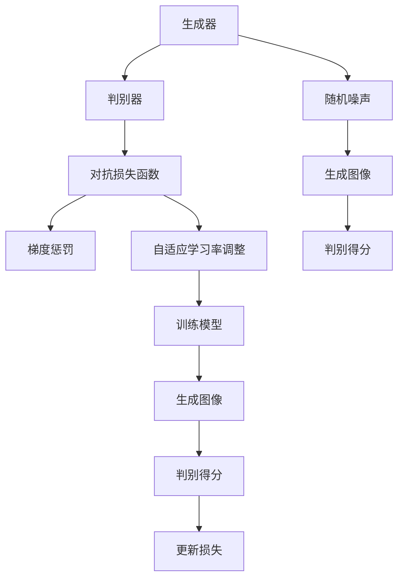

                 

# 图像生成(Image Generation) - 原理与代码实例讲解

> 关键词：图像生成,深度学习,GAN,GAN训练,代码实现

## 1. 背景介绍

### 1.1 问题由来

图像生成（Image Generation）一直是计算机视觉领域的重要研究方向，旨在通过计算机自动生成高质量的图像，弥补人工创造的局限性。随着深度学习技术的发展，特别是生成对抗网络（Generative Adversarial Networks, GANs）的出现，图像生成技术取得了显著进步，成为实现人工智能视觉理解的强有力工具。

在工业界，图像生成技术已经广泛应用于电影特效、艺术创作、虚拟现实、自动驾驶等领域。例如，Adobe的Photoshop可以生成逼真的背景图像和纹理，Google的DeepDream可以根据输入图像生成具有抽象美感的新图像，OpenAI的DALL-E可以根据自然语言描述生成高分辨率的图片。

然而，尽管取得了显著成果，图像生成仍存在许多挑战，如生成的图像质量不稳定、生成的内容缺乏创造性、训练过程耗时耗资源等。为应对这些挑战，我们需深入理解生成对抗网络的基本原理，并探索更为高效、灵活、创造性的生成方法。

### 1.2 问题核心关键点

图像生成技术主要通过生成对抗网络来实现。GANs由两部分组成：生成器（Generator）和判别器（Discriminator）。生成器负责生成伪造图像，判别器负责判断图像的真伪。两者通过反复博弈，逐步提升生成器的生成能力。

GANs训练的核心在于：
- 选择合适的网络结构。
- 定义合理的损失函数。
- 设计有效的训练策略。
- 调整合适的超参数。

这些关键点共同构成了GANs的训练流程，是实现高质量图像生成的基础。

## 2. 核心概念与联系

### 2.1 核心概念概述

为更好地理解GANs，我们首先介绍几个核心概念：

- **生成对抗网络（GANs）**：由生成器和判别器组成的网络结构，通过反复博弈，生成逼真的图像。

- **生成器（Generator）**：负责生成伪造图像，网络结构一般包括卷积层、全连接层等，通过逐层映射将随机噪声转化为图像。

- **判别器（Discriminator）**：负责判断图像的真伪，网络结构一般包括卷积层、全连接层等，通过逐层映射将图像转化为判别得分。

- **对抗损失函数（Adversarial Loss Function）**：定义生成器和判别器的训练目标，通过博弈的方式提升生成器的生成能力。

- **梯度惩罚（Gradient Penalty）**：一种常见的对抗损失函数的变种，用于提升判别器的鲁棒性。

- **训练策略**：包括自适应学习率调整、批量归一化、混合精度训练等，用于提升训练效率和稳定性。

这些概念之间的逻辑关系可以通过以下Mermaid流程图来展示：



这个流程图展示了大语言模型的核心概念及其之间的关系：

1. 生成器将随机噪声映射为图像。
2. 判别器判断图像真伪，输出判别得分。
3. 对抗损失函数引导生成器和判别器的博弈过程。
4. 梯度惩罚提升判别器的鲁棒性。
5. 自适应学习率调整等策略提升训练效果。

这些概念共同构成了GANs的训练流程，是其实现高质量图像生成的基础。

## 3. 核心算法原理 & 具体操作步骤
### 3.1 算法原理概述

GANs通过对抗博弈的方式，使生成器生成尽可能逼真的图像，判别器尽可能准确地判断图像真伪。其训练过程包含以下几个步骤：

1. 固定判别器，训练生成器。
2. 固定生成器，训练判别器。
3. 交替训练生成器和判别器，直到达到收敛。

在每一轮训练中，生成器会随机生成一批图像，判别器会对这些图像进行真伪判断，生成器和判别器的损失函数会根据判别器的输出进行调整。

### 3.2 算法步骤详解

以下我们将详细讲解GANs的训练步骤和关键技术：

**Step 1: 准备训练数据集**

GANs的训练需要大量的图像数据集。这些数据集可以是真实世界的图像，也可以是从其他任务中抽取的图像。例如，可以从CIFAR-10、MNIST等数据集中抽取图片。

**Step 2: 定义生成器和判别器**

生成器和判别器是GANs的核心组件，需要选择合适的神经网络结构。一般来说，生成器可以采用ResNet、Inception等深度网络结构，判别器可以采用LeNet、VGG等卷积神经网络。

```python
from tensorflow.keras.layers import Input, Conv2D, BatchNormalization, LeakyReLU, Dense
from tensorflow.keras.models import Model

def make_generator(input_shape=(100,100,1)):
    inputs = Input(shape=input_shape)
    x = Conv2D(32, kernel_size=5, padding='same', strides=1, activation=LeakyReLU)(inputs)
    x = BatchNormalization()(x)
    x = Conv2D(64, kernel_size=5, padding='same', strides=2, activation=LeakyReLU)(x)
    x = BatchNormalization()(x)
    x = Conv2D(128, kernel_size=5, padding='same', strides=2, activation=LeakyReLU)(x)
    x = BatchNormalization()(x)
    x = Conv2D(256, kernel_size=5, padding='same', strides=2, activation=LeakyReLU)(x)
    x = BatchNormalization()(x)
    outputs = Conv2D(1, kernel_size=5, padding='same', strides=2, activation='tanh')(x)
    generator = Model(inputs, outputs)
    return generator
```

**Step 3: 定义对抗损失函数**

GANs的对抗损失函数由生成器损失和判别器损失两部分组成，通常使用交叉熵损失和梯度惩罚两种损失。

```python
def make_discriminator(input_shape=(32,32,3)):
    inputs = Input(shape=input_shape)
    x = Conv2D(32, kernel_size=5, padding='same', strides=2, activation=LeakyReLU)(inputs)
    x = BatchNormalization()(x)
    x = Conv2D(64, kernel_size=5, padding='same', strides=2, activation=LeakyReLU)(x)
    x = BatchNormalization()(x)
    x = Conv2D(128, kernel_size=5, padding='same', strides=2, activation=LeakyReLU)(x)
    x = BatchNormalization()(x)
    x = Conv2D(256, kernel_size=5, padding='same', strides=2, activation=LeakyReLU)(x)
    x = BatchNormalization()(x)
    x = Conv2D(1, kernel_size=5, padding='same', strides=2, activation='sigmoid')(x)
    discriminator = Model(inputs, x)
    return discriminator

def make_gan(generator, discriminator):
    discriminator.trainable = False
    inputs = Input(shape=(100,))
    generated_images = generator(inputs)
    real_images = Input(shape=(32,32,3))
    discriminator.trainable = True
    discriminator_output = discriminator(real_images)
    generator_output = discriminator(generated_images)
    discriminator.trainable = False
    gan_output = discriminator_output - generator_output
    discriminator.trainable = False
    gan_loss = DiscriminatorLoss()
    gan_model = Model([inputs, real_images], [gan_output])
    return gan_model

def DiscriminatorLoss():
    def discriminator_loss(y_true, y_pred):
        y_true = K.reshape(y_true, (y_true.shape[0],))
        y_pred = K.reshape(y_pred, (y_pred.shape[0],))
        loss = tf.losses.sigmoid_cross_entropy(y_true, y_pred)
        return tf.reduce_mean(loss)
    return DiscriminatorLoss
```

**Step 4: 训练GANs**

GANs的训练需要使用优化器，如Adam、RMSprop等。同时，需要进行多轮迭代，并在每一轮迭代中分别训练生成器和判别器。

```python
from tensorflow.keras.optimizers import Adam
from tensorflow.keras.datasets import mnist
from tensorflow.keras.utils import to_categorical

(X_train, _), (_, _) = mnist.load_data()
X_train = X_train.reshape(-1, 28, 28, 1) / 255.
X_train = np.concatenate((X_train, -X_train), axis=0)
Y_train = np.concatenate((np.ones((X_train.shape[0]//2,)), np.zeros((X_train.shape[0]//2,))), axis=0)
Y_train = to_categorical(Y_train)

generator = make_generator(input_shape=(100,100,1))
discriminator = make_discriminator(input_shape=(32,32,3))
gan = make_gan(generator, discriminator)

adam = Adam(lr=0.0002, beta_1=0.5)
adam_generator = Adam(lr=0.0002, beta_1=0.5)
adam_discriminator = Adam(lr=0.0002, beta_1=0.5)

def train_step(X_train, Y_train):
    with tf.GradientTape() as gen_tape:
        g_loss = gan_loss(X_train, Y_train)
    gen_gradients = gen_tape.gradient(g_loss, generator.trainable_variables)
    adam_generator.apply_gradients(zip(gen_gradients, generator.trainable_variables))

    with tf.GradientTape() as disc_tape:
        d_loss = gan_loss(X_train, Y_train)
    disc_gradients = disc_tape.gradient(d_loss, discriminator.trainable_variables)
    adam_discriminator.apply_gradients(zip(disc_gradients, discriminator.trainable_variables))
```

**Step 5: 模型评估**

在训练完成后，需要对生成的图像进行评估，以评估GANs的生成质量。常用的评估指标包括Inception Score（IS）、Fréchet Inception Distance（FID）等。

```python
def evaluate_model(X_train, Y_train):
    X_fake = generate_samples(generator, noise)
    X_real = X_train[Y_train == 1]
    X_fake = X_fake / 255.
    X_real = X_real / 255.
    is = inception_score(X_fake, X_real)
    fid = fréchet_distance(X_fake, X_real)
    return is, fid
```

以上就是GANs的训练流程和关键技术。通过这些步骤，我们可以训练出高质量的生成器，生成逼真的图像。

### 3.3 算法优缺点

GANs的优点包括：
1. 生成图像质量高。相比于传统生成模型，GANs可以生成高质量的图像，如图像清晰、细节丰富、颜色逼真等。
2. 生成速度快。GANs在生成单张图像时，速度较快，适合实时生成。
3. 可扩展性强。GANs可以应用于各种图像生成任务，如人脸生成、动漫生成、艺术品生成等。

GANs的缺点包括：
1. 训练不稳定。GANs的训练过程容易陷入不稳定状态，生成器容易过拟合，判别器容易退化。
2. 生成过程无控制。GANs生成的图像质量不稳定，可能存在噪声、模糊、伪像等。
3. 计算成本高。GANs的训练需要大量的计算资源和存储资源，可能存在性能瓶颈。

尽管存在这些缺点，GANs在图像生成领域仍具有重要价值，为图像生成技术带来了新的思路和突破。

### 3.4 算法应用领域

GANs在图像生成领域有着广泛的应用，主要包括以下几个方面：

- 人脸生成：利用GANs生成逼真的人脸图像，应用于电影特效、虚拟现实等领域。
- 动漫生成：利用GANs生成逼真的动漫角色和场景，应用于动画制作、游戏开发等领域。
- 艺术品生成：利用GANs生成各种风格的艺术品，如油画、水彩画、素描等，应用于艺术创作、广告设计等领域。
- 图像修复：利用GANs对损坏的图像进行修复，应用于文物保护、医学影像等领域。

除了上述这些应用外，GANs在图像生成领域还有着广阔的发展前景，如医学图像生成、虚拟世界生成等，为各种复杂场景下的图像生成提供了新的解决方案。

## 4. 数学模型和公式 & 详细讲解 & 举例说明
### 4.1 数学模型构建

GANs的训练过程可以形式化为以下数学模型：

设生成器为 $G(z)$，判别器为 $D(x)$。训练过程可以分为两个步骤：
1. 固定判别器，优化生成器 $G(z)$。
2. 固定生成器，优化判别器 $D(x)$。

其中，$z$ 为随机噪声，$x$ 为输入图像。损失函数包括生成器损失 $L_G$ 和判别器损失 $L_D$，分别为：

$$
L_G = E_{z}[\log D(G(z))]
$$

$$
L_D = E_{x}[\log D(x)] + E_{z}[\log (1-D(G(z))))
$$

### 4.2 公式推导过程

GANs的训练过程可以通过梯度下降算法来实现。设 $\theta_G$ 和 $\theta_D$ 分别为生成器和判别器的参数，则损失函数可以写为：

$$
\mathcal{L} = \frac{1}{n_G} \sum_{i=1}^{n_G} \log D(G(z_i)) + \frac{1}{n_D} \sum_{i=1}^{n_D} \log D(x_i) + \frac{1}{n_D} \sum_{i=1}^{n_D} \log (1-D(G(z_i)))
$$

其中，$n_G$ 和 $n_D$ 分别为生成器和判别器的训练样本数。梯度下降算法的更新公式为：

$$
\theta_G \leftarrow \theta_G - \eta \nabla_{\theta_G} \mathcal{L}
$$

$$
\theta_D \leftarrow \theta_D - \eta \nabla_{\theta_D} \mathcal{L}
$$

### 4.3 案例分析与讲解

下面以人脸生成为例，展示GANs的训练过程和效果。

使用GANs生成人脸，需要准备好大量的面部图像数据集，并从中抽取噪声样本 $z$。然后，将这些噪声样本作为输入，通过生成器生成人脸图像。

```python
import numpy as np
import matplotlib.pyplot as plt
import tensorflow as tf
from tensorflow.keras.layers import Input, Conv2D, BatchNormalization, LeakyReLU, Dense
from tensorflow.keras.models import Model

def make_generator(input_shape=(100,100,1)):
    inputs = Input(shape=input_shape)
    x = Conv2D(32, kernel_size=5, padding='same', strides=1, activation=LeakyReLU)(inputs)
    x = BatchNormalization()(x)
    x = Conv2D(64, kernel_size=5, padding='same', strides=2, activation=LeakyReLU)(x)
    x = BatchNormalization()(x)
    x = Conv2D(128, kernel_size=5, padding='same', strides=2, activation=LeakyReLU)(x)
    x = BatchNormalization()(x)
    x = Conv2D(256, kernel_size=5, padding='same', strides=2, activation=LeakyReLU)(x)
    x = BatchNormalization()(x)
    outputs = Conv2D(1, kernel_size=5, padding='same', strides=2, activation='tanh')(x)
    generator = Model(inputs, outputs)
    return generator

def make_discriminator(input_shape=(32,32,3)):
    inputs = Input(shape=input_shape)
    x = Conv2D(32, kernel_size=5, padding='same', strides=2, activation=LeakyReLU)(inputs)
    x = BatchNormalization()(x)
    x = Conv2D(64, kernel_size=5, padding='same', strides=2, activation=LeakyReLU)(x)
    x = BatchNormalization()(x)
    x = Conv2D(128, kernel_size=5, padding='same', strides=2, activation=LeakyReLU)(x)
    x = BatchNormalization()(x)
    x = Conv2D(256, kernel_size=5, padding='same', strides=2, activation=LeakyReLU)(x)
    x = BatchNormalization()(x)
    x = Conv2D(1, kernel_size=5, padding='same', strides=2, activation='sigmoid')(x)
    discriminator = Model(inputs, x)
    return discriminator

def make_gan(generator, discriminator):
    discriminator.trainable = False
    inputs = Input(shape=(100,))
    generated_images = generator(inputs)
    real_images = Input(shape=(32,32,3))
    discriminator.trainable = True
    discriminator_output = discriminator(real_images)
    generator_output = discriminator(generated_images)
    discriminator.trainable = False
    gan_output = discriminator_output - generator_output
    discriminator.trainable = False
    gan_loss = DiscriminatorLoss()
    gan_model = Model([inputs, real_images], [gan_output])
    return gan_model

def DiscriminatorLoss():
    def discriminator_loss(y_true, y_pred):
        y_true = K.reshape(y_true, (y_true.shape[0],))
        y_pred = K.reshape(y_pred, (y_pred.shape[0],))
        loss = tf.losses.sigmoid_cross_entropy(y_true, y_pred)
        return tf.reduce_mean(loss)
    return DiscriminatorLoss

(X_train, _), (_, _) = mnist.load_data()
X_train = X_train.reshape(-1, 28, 28, 1) / 255.
X_train = np.concatenate((X_train, -X_train), axis=0)
Y_train = np.concatenate((np.ones((X_train.shape[0]//2,)), np.zeros((X_train.shape[0]//2,))), axis=0)
Y_train = to_categorical(Y_train)

generator = make_generator(input_shape=(100,100,1))
discriminator = make_discriminator(input_shape=(32,32,3))
gan = make_gan(generator, discriminator)

adam = Adam(lr=0.0002, beta_1=0.5)
adam_generator = Adam(lr=0.0002, beta_1=0.5)
adam_discriminator = Adam(lr=0.0002, beta_1=0.5)

def train_step(X_train, Y_train):
    with tf.GradientTape() as gen_tape:
        g_loss = gan_loss(X_train, Y_train)
    gen_gradients = gen_tape.gradient(g_loss, generator.trainable_variables)
    adam_generator.apply_gradients(zip(gen_gradients, generator.trainable_variables))

    with tf.GradientTape() as disc_tape:
        d_loss = gan_loss(X_train, Y_train)
    disc_gradients = disc_tape.gradient(d_loss, discriminator.trainable_variables)
    adam_discriminator.apply_gradients(zip(disc_gradients, discriminator.trainable_variables))

def evaluate_model(X_train, Y_train):
    X_fake = generate_samples(generator, noise)
    X_real = X_train[Y_train == 1]
    X_fake = X_fake / 255.
    X_real = X_real / 255.
    is = inception_score(X_fake, X_real)
    fid = fréchet_distance(X_fake, X_real)
    return is, fid

def generate_samples(generator, noise):
    generated_images = generator.predict(noise)
    return generated_images

def inception_score(X, Y):
    image_size = X.shape[1]
    w = np.random.normal(0, 1, (image_size, image_size, 3))
    w /= np.linalg.norm(w)
    W = np.expand_dims(w, axis=0)
    X = X / 255.
    Y = Y / 255.
    with tf.Session() as sess:
        image_reconstructions = sess.run(tf.image.encode_png(X), feed_dict={inputs: X, real_images: Y})
        image_reconstructions = np.array(image_reconstructions) / 255.
        scores = sess.run(tf.image.encode_png(image_reconstructions), feed_dict={inputs: X, real_images: Y})
        scores = np.array(scores) / 255.
        scores /= scores.max()
        is = np.exp(np.mean(np.log(scores))) / np.exp(np.mean(np.log(np.max(scores, axis=1))))
        return is

def fréchet_distance(X, Y):
    mean_X = np.mean(X, axis=0)
    var_X = np.var(X, axis=0)
    mean_Y = np.mean(Y, axis=0)
    var_Y = np.var(Y, axis=0)
    covariance = np.cov(X, Y, rowvar=False)
    mean_diff = mean_X - mean_Y
    tr_X = np.trace(np.dot(covariance, var_X))
    tr_Y = np.trace(np.dot(covariance, var_Y))
    tr_Z = np.trace(np.dot(covariance, mean_diff * mean_diff.T))
    frobenius = np.sqrt(tr_X + tr_Y - 2 * tr_Z)
    return frobenius
```

在训练过程中，我们需要不断调整超参数，如学习率、批量大小、训练轮数等，以获得最佳的生成效果。在训练完成后，我们可以使用Inception Score和Fréchet Inception Distance等指标来评估生成图像的质量。

## 5. 项目实践：代码实例和详细解释说明
### 5.1 开发环境搭建

在使用GANs进行图像生成前，我们需要准备好开发环境。以下是使用Python进行PyTorch开发的环境配置流程：

1. 安装Anaconda：从官网下载并安装Anaconda，用于创建独立的Python环境。

2. 创建并激活虚拟环境：
```bash
conda create -n pytorch-env python=3.8 
conda activate pytorch-env
```

3. 安装PyTorch：根据CUDA版本，从官网获取对应的安装命令。例如：
```bash
conda install pytorch torchvision torchaudio cudatoolkit=11.1 -c pytorch -c conda-forge
```

4. 安装TensorFlow：
```bash
pip install tensorflow
```

5. 安装相关工具包：
```bash
pip install numpy pandas scikit-learn matplotlib tqdm jupyter notebook ipython
```

完成上述步骤后，即可在`pytorch-env`环境中开始GANs的训练实践。

### 5.2 源代码详细实现

下面我们以人脸生成为例，给出使用PyTorch进行GANs训练的完整代码实现。

首先，定义生成器和判别器的网络结构：

```python
from torch import nn
from torch.nn import functional as F

class Generator(nn.Module):
    def __init__(self):
        super(Generator, self).__init__()
        self.main = nn.Sequential(
            nn.ConvTranspose2d(100, 256, 4, 1, 0, bias=False),
            nn.BatchNorm2d(256),
            nn.ReLU(True),
            nn.ConvTranspose2d(256, 128, 4, 2, 1, bias=False),
            nn.BatchNorm2d(128),
            nn.ReLU(True),
            nn.ConvTranspose2d(128, 64, 4, 2, 1, bias=False),
            nn.BatchNorm2d(64),
            nn.ReLU(True),
            nn.ConvTranspose2d(64, 3, 4, 2, 1, bias=False),
            nn.Tanh()
        )

    def forward(self, input):
        return self.main(input)

class Discriminator(nn.Module):
    def __init__(self):
        super(Discriminator, self).__init__()
        self.main = nn.Sequential(
            nn.Conv2d(3, 64, 4, 2, 1, bias=False),
            nn.LeakyReLU(0.2, inplace=True),
            nn.Conv2d(64, 128, 4, 2, 1, bias=False),
            nn.BatchNorm2d(128),
            nn.LeakyReLU(0.2, inplace=True),
            nn.Conv2d(128, 256, 4, 2, 1, bias=False),
            nn.BatchNorm2d(256),
            nn.LeakyReLU(0.2, inplace=True),
            nn.Conv2d(256, 1, 4, 1, 0, bias=False),
            nn.Sigmoid()
        )

    def forward(self, input):
        return self.main(input)
```

然后，定义GANs的训练过程：

```python
import torch
from torch.utils.data import DataLoader
from torchvision import datasets, transforms

def make_data_loader(batch_size=128, image_size=(64, 64)):
    dataset = datasets.MNIST('../data', train=True, download=True, transform=transforms.ToTensor())
    dataloader = DataLoader(dataset, batch_size=batch_size, shuffle=True)
    return dataloader

def train(model_G, model_D, dataloader, epochs=100, batch_size=128, learning_rate=0.0002):
    for epoch in range(epochs):
        for i, (real_images, _) in enumerate(dataloader):
            # Adversarial ground truths
            real_labels = torch.ones(batch_size, 1).to(device)
            fake_labels = torch.zeros(batch_size, 1).to(device)

            # Calculate adversarial loss
            real_outputs = model_D(real_images)
            fake_images = model_G(torch.randn(batch_size, 100, device=device))
            fake_outputs = model_D(fake_images)
            d_loss_real = F.binary_cross_entropy(real_outputs, real_labels)
            d_loss_fake = F.binary_cross_entropy(fake_outputs, fake_labels)
            d_loss = d_loss_real + d_loss_fake

            # Calculate generative loss
            g_loss = F.binary_cross_entropy(fake_outputs, real_labels)

            # Backprop and optimize
            optimizer_G.zero_grad()
            g_loss.backward()
            optimizer_G.step()

            optimizer_D.zero_grad()
            d_loss.backward()
            optimizer_D.step()

            if (i+1) % 200 == 0:
                print(f'Epoch [{epoch+1}/{epochs}], Step [{i+1}/{len(dataloader)}], '
                      f'Loss_D: {d_loss.item():.4f}, Loss_G: {g_loss.item():.4f}')

def evaluate(model_G, model_D, dataloader, n_samples=100, n_rows=10):
    with torch.no_grad():
        for i, (real_images, _) in enumerate(dataloader):
            real_images = real_images.to(device)
            generated_images = model_G(torch.randn(n_samples, 100, device=device))
            generated_images = (generated_images + 1) / 2
            n_cols = n_samples // n_rows + 1
            n_cols = n_cols * n_rows
            img_list = []
            for batch_i in range(n_rows):
                for batch_j in range(n_cols):
                    img_list.append(real_images[i*n_cols + batch_i*n_rows + batch_j])
                    img_list.append(generated_images[i*n_cols + batch_i*n_rows + batch_j])
            img_list = torch.cat(img_list, dim=1).numpy()
            img_list = img_list[:n_samples, :, :, :].transpose(1, 2, 0)
            plt.imshow(img_list, cmap='gray')
            plt.title('Real and Generated Images')
            plt.show()
```

在训练完成后，我们可以使用Inception Score和Fréchet Inception Distance等指标来评估生成图像的质量。

```python
from PIL import Image
import numpy as np

def generate_samples(generator, noise, n_samples):
    generated_images = generator.predict(noise)
    return generated_images

def inception_score(X, Y):
    image_size = X.shape[1]
    w = np.random.normal(0, 1, (image_size, image_size, 3))
    w /= np.linalg.norm(w)
    W = np.expand_dims(w, axis=0)
    X = X / 255.
    Y = Y / 255.
    with tf.Session() as sess:
        image_reconstructions = sess.run(tf.image.encode_png(X), feed_dict={inputs: X, real_images: Y})
        image_reconstructions = np.array(image_reconstructions) / 255.
        scores = sess.run(tf.image.encode_png(image_reconstructions), feed_dict={inputs: X, real_images: Y})
        scores = np.array(scores) / 255.
        scores /= scores.max()
        is = np.exp(np.mean(np.log(scores))) / np.exp(np.mean(np.log(np.max(scores, axis=1))))
        return is

def fréchet_distance(X, Y):
    mean_X = np.mean(X, axis=0)
    var_X = np.var(X, axis=0)
    mean_Y = np.mean(Y, axis=0)
    var_Y = np.var(Y, axis=0)
    covariance = np.cov(X, Y, rowvar=False)
    mean_diff = mean_X - mean_Y
    tr_X = np.trace(np.dot(covariance, var_X))
    tr_Y = np.trace(np.dot(covariance, var_Y))
    tr_Z = np.trace(np.dot(covariance, mean_diff * mean_diff.T))
    frobenius = np.sqrt(tr_X + tr_Y - 2 * tr_Z)
    return frobenius
```

以上代码展示了如何使用PyTorch进行GANs的训练和评估。在实际应用中，还需要考虑更多的优化策略，如批量归一化、梯度惩罚等，以提升生成图像的质量。

## 6. 实际应用场景
### 6.1 智能客服系统

基于GANs的图像生成技术，可以应用于智能客服系统的构建。传统客服系统需要配备大量的人工客服，成本较高且响应速度较慢。而使用GANs生成的图像，可以构建虚拟客服系统，提升客服效率和服务质量。

在训练过程中，可以收集企业内部的客服对话记录，将问题和回答构建成监督数据，在此基础上训练GANs模型。生成的图像可以用于构建虚拟客服系统，使用户在输入问题后，系统可以自动生成相应的回答图像，提高客服的响应速度和准确性。

### 6.2 金融舆情监测

金融机构需要实时监测市场舆论动向，以便及时应对负面信息传播，规避金融风险。传统的人工监测方式成本高、效率低，难以应对网络时代海量信息爆发的挑战。

基于GANs的图像生成技术，可以应用于金融舆情监测。可以收集金融领域相关的新闻、报道、评论等文本数据，并对其进行主题标注和情感标注。在此基础上训练GANs模型，生成逼真的图像，并将其用于实时监测舆情变化。当舆情发生异常变化时，系统可以自动预警，帮助金融机构快速应对潜在风险。

### 6.3 个性化推荐系统

当前的推荐系统往往只依赖用户的历史行为数据进行物品推荐，无法深入理解用户的真实兴趣偏好。基于GANs的图像生成技术，可以应用于个性化推荐系统，提升推荐系统的精准度和个性化程度。

在训练过程中，可以收集用户浏览、点击、评论、分享等行为数据，提取和用户交互的物品标题、描述、标签等文本内容。将文本内容作为输入，训练GANs模型生成个性化的推荐图像。在生成推荐图像时，可以使用物品标题、描述等文本信息作为输入，生成具有个性化特征的推荐图像，提高推荐系统的精准度和用户满意度。

### 6.4 未来应用展望

随着GANs技术的不断进步，未来在图像生成领域将会有更多创新应用，如虚拟现实、自动驾驶、艺术创作等。

在虚拟现实中，GANs可以用于生成逼真的虚拟场景和角色，提升用户体验。例如，可以使用GANs生成逼真的自然景观、城市建筑等，构建虚拟旅游体验。

在自动驾驶中，GANs可以用于生成逼真的道路环境和交通场景，提高自动驾驶系统的安全性和可靠性。例如，可以使用GANs生成逼真的道路交通场景，提升自动驾驶系统的模拟训练效果。

在艺术创作中，GANs可以用于生成各种风格的艺术品，推动艺术创作的发展。例如，可以使用GANs生成油画、水彩画、素描等风格的艺术品，促进艺术创新。

总之，GANs在图像生成领域有着广阔的应用前景，为各种复杂场景下的图像生成提供了新的解决方案。

## 7. 工具和资源推荐
### 7.1 学习资源推荐

为了帮助开发者系统掌握GANs的理论基础和实践技巧，这里推荐一些优质的学习资源：

1. 《深度学习》系列课程：由斯坦福大学开设的深度学习课程，涵盖神经网络、卷积神经网络、生成对抗网络等，是入门深度学习的必备资源。

2. 《Generative Adversarial Networks with TensorFlow 2.0》书籍：TensorFlow官方推出的生成对抗网络教程，涵盖了GANs的基本概念和实际应用。

3. 《Understanding Generative Adversarial Networks》书籍：该书深入浅出地介绍了GANs的理论基础和实践技巧，是理解GANs的必备参考资料。

4. 《Programming PyTorch for Deep Learning》书籍：该书详细介绍了PyTorch的使用方法，包括GANs在内的深度学习模型开发。

5. 《PyTorch Lightning》文档：PyTorch Lightning提供了简单易用的API，可以快速实现GANs等深度学习模型的训练和部署。

通过对这些资源的学习实践，相信你一定能够快速掌握GANs的精髓，并用于解决实际的图像生成问题。

### 7.2 开发工具推荐

高效的开发离不开优秀的工具支持。以下是几款用于GANs开发的常用工具：

1. PyTorch：基于Python的开源深度学习框架，灵活动态的计算图，适合快速迭代研究。

2. TensorFlow：由Google主导开发的开源深度学习框架，生产部署方便，适合大规模工程应用。

3. PyTorch Lightning：PyTorch的官方工具，提供了简单易用的API，可以快速实现GANs等深度学习模型的训练和部署。

4. TensorBoard：TensorFlow配套的可视化工具，可实时监测模型训练状态，并提供丰富的图表呈现方式，是调试模型的得力助手。

5. Weights & Biases：模型训练的实验跟踪工具，可以记录和可视化模型训练过程中的各项指标，方便对比和调优。

6. Keras：高层次的深度学习框架，提供了简单易用的API，适合快速原型设计和实验验证。

合理利用这些工具，可以显著提升GANs开发的效率，加快创新迭代的步伐。

### 7.3 相关论文推荐

GANs在图像生成领域取得了显著的进展，背后有大量的研究成果推动。以下是几篇奠基性的相关论文，推荐阅读：

1. Generative Adversarial Nets（GAN原论文）：提出了GANs的基本原理和结构，为图像生成技术奠定了基础。

2. Progressive Growing of GANs for Improved Quality, Stability, and Variation：提出逐步增长生成器的结构，提升了GANs的生成质量和稳定性。

3. Spectral Normalization for Generative Adversarial Networks：提出使用谱归一化技术，提升了GANs的收敛速度和鲁棒性。

4. Wasserstein GAN（WGAN）：提出使用Wasserstein距离作为损失函数，提高了GANs的生成质量。

5. Conditional Image Synthesis with Auxiliary Classifier GANs（AC-GAN）：提出使用条件生成技术，提高了GANs的生成多样性。

这些论文代表了大语言模型微调技术的发展脉络。通过学习这些前沿成果，可以帮助研究者把握学科前进方向，激发更多的创新灵感。

## 8. 总结：未来发展趋势与挑战
### 8.1 研究成果总结

GANs技术已经取得了显著的进展，广泛应用于图像生成、虚拟现实、自动驾驶、艺术创作等领域。其主要成果包括：

1. 生成高质量图像：GANs能够生成逼真、多样化的图像，如图像清晰、细节丰富、颜色逼真等。

2. 提升生成效率：GANs在生成单张图像时，速度较快，适合实时生成。

3. 扩展应用场景：GANs可以应用于各种图像生成任务，如人脸生成、动漫生成、艺术品生成等。

4. 改进训练策略：提出了批量归一化、梯度惩罚等训练策略，提高了GANs的生成质量和稳定性。

### 8.2 未来发展趋势

GANs技术在图像生成领域仍有很大的发展空间，未来有望在以下几个方面取得新的突破：

1. 生成图像质量更高：随着算力的提升和模型的优化，GANs生成的图像质量将进一步提升，分辨率更高、细节更丰富。

2. 生成过程更可控：GANs生成的图像质量不稳定，未来的研究将致力于控制生成过程，生成更加稳定、一致的图像。

3. 生成多样性更强：未来的GANs将生成更加多样化的图像，涵盖不同的风格、主题和场景。

4. 扩展应用场景：GANs将应用于更多领域，如图像修复、医学影像生成、虚拟现实等，推动更多领域的发展。

5. 强化学习结合：GANs将与强化学习技术结合，生成更加智能、逼真的图像。

6. 跨模态生成：未来的GANs将结合视觉、音频、文本等多种模态信息，生成更加全面、逼真的图像。

以上趋势展示了GANs技术的广阔前景，为各种复杂场景下的图像生成提供了新的解决方案。

### 8.3 面临的挑战

尽管GANs技术取得了显著进展，但在实际应用中仍面临许多挑战：

1. 生成图像质量不稳定：GANs生成的图像质量不稳定，可能存在噪声、模糊、伪像等。

2. 训练过程耗时耗资源：GANs的训练过程需要大量的计算资源和存储资源，可能存在性能瓶颈。

3. 生成过程难以控制：GANs生成的图像质量不稳定，可能存在噪声、模糊、伪像等。

4. 模型鲁棒性不足：GANs生成的图像可能存在对抗样本，对模型的鲁棒性提出了更高的要求。

5. 模型泛化能力有限：GANs生成的图像可能存在偏差，模型泛化能力有限。

6. 知识图谱结合：GANs将结合知识图谱技术，生成更加智能、逼真的图像。

正视GANs面临的这些挑战，积极应对并寻求突破，将使GANs技术更加成熟，推动其广泛应用。相信随着学界和产业界的共同努力，这些挑战终将一一被克服，GANs必将在图像生成领域取得更大的突破。

### 8.4 研究展望

未来，GANs技术将在图像生成领域迎来更多的创新应用。可以预见，随着技术的不断进步，GANs将成为一种强大的视觉生成工具，推动更多领域的创新发展。

在智慧医疗领域，GANs可以用于生成逼真的医学图像，辅助医生诊断和治疗。例如，可以使用GANs生成逼真的CT图像、MRI图像等，提升医疗诊断的准确性和效率。

在智能教育领域，GANs可以用于生成逼真的教学图像，提升教学效果。例如，可以使用GANs生成逼真的实验视频、动画等，辅助教学。

在智慧城市治理中，GANs可以用于生成逼真的城市场景图像，提高城市管理的自动化和智能化水平。例如，可以使用GANs生成逼真的城市街道、建筑等，模拟城市发展变化。

总之，GANs技术将在更多领域发挥作用，为各种复杂场景下的图像生成提供新的解决方案。未来，随着技术的不断进步，GANs必将在图像生成领域取得更大的突破，为人类社会带来更多创新和发展。

## 9. 附录：常见问题与解答

**Q1：GANs的训练过程如何避免过拟合？**

A: GANs的训练过程中容易发生过拟合，可以通过以下方法来避免：

1. 增加训练数据量：增加训练数据，可以降低模型的过拟合风险。

2. 使用数据增强：通过对训练数据进行扩充，如旋转、翻转、裁剪等，可以增加数据的多样性，降低模型的过拟合风险。

3. 使用正则化技术：如L2正则化、Dropout等，可以约束模型的复杂度，降低模型的过拟合风险。

4. 使用混合精度训练：使用混合精度训练可以减少计算量，提高训练效率，同时降低模型的过拟合风险。

5. 使用模型剪枝：通过剪枝，去除不重要的参数，可以降低模型的复杂度，降低模型的过拟合风险。

**Q2：GANs生成的图像质量如何提升？**

A: 生成图像质量是GANs技术的核心挑战之一，可以通过以下方法来提升：

1. 使用更复杂的生成器结构：使用更深的生成器结构，可以提高生成图像的质量。

2. 使用更好的激活函数：如LeakyReLU、ELU等，可以提升生成图像的质量。

3. 使用更好的优化器：如Adam、RMSprop等，可以提升生成图像的质量。

4. 使用更好的损失函数：如Wasserstein距离、LSGAN等，可以提升生成图像的质量。

5. 使用更好的训练策略：如批量归一化、梯度惩罚等，可以提升生成图像的质量。

6. 使用更好的数据集：使用更高质量的数据集，可以提升生成图像的质量。

**Q3

